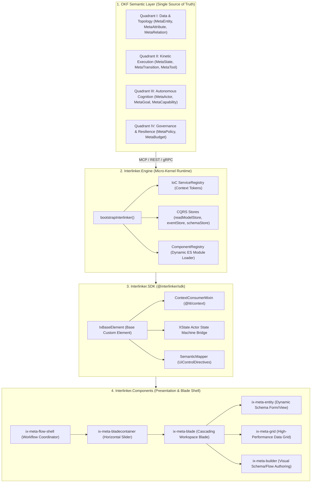
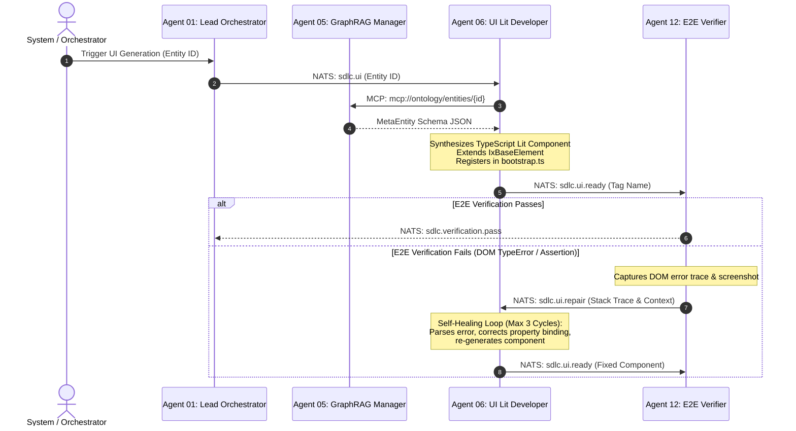

# Interlinker UI Ecosystem: Philosophy, Micro-Kernel & Blade Architecture

This document establishes the architectural foundation, design philosophy, and operational engineering standards of the **Interlinker UI (Ix-Platform)** ecosystem. It serves as the authoritative blueprint for the ontology-driven frontend layer within the polyglot enterprise AI infrastructure.

---

## 1. System Vision & Core Philosophy

### Why Web Components Over Monolithic Frameworks?
Enterprise software platforms frequently succumb to the **Framework Churn Trap**. Over a 5-to-10-year enterprise lifecycle, monolithic frameworks (React, Angular, Vue) undergo breaking architectural shifts (e.g., Angular.js to Angular 2+, React Class Components to Hooks to Server Components). Upgrading massive enterprise suites across these paradigms incurs millions of dollars in rewrites, library incompatibilities, and technical debt.

Furthermore, multi-tenant enterprise frontends require hosting third-party extensions, dynamic plugins, and micro-frontends without style collisions or bundle contamination.

Interlinker UI solves this by anchoring the entire frontend on **W3C Standard Web Components** powered by **Lit 3.x**:

```
+-----------------------------------------------------------------------------------+
|                            INTERLINKER UI (IX-PLATFORM)                           |
+-----------------------------------------------------------------------------------+
|  Standard W3C Custom Elements (<ix-*>)  |  Shadow DOM Style Isolation             |
|  Zero Virtual DOM Overhead              |  Native Browser Lifecycle Callbacks     |
|  Strict Framework Independence          |  Dynamic Lazy-Loading via Native import()|
+-----------------------------------------------------------------------------------+
```

1. **True Encapsulation via Shadow DOM:**
   Every Interlinker component encapsulates its markup and styling inside a `ShadowRoot`. Enterprise themes, global resets, and third-party plugin stylesheets cannot leak across component boundaries.
2. **Native Performance & Zero Virtual DOM Reconciliation:**
   Lit leverages the browser's native parser and template cache (`tagged template literals`). DOM updates are pinpointed at the exact binding node without computing diffs over massive virtual DOM trees.
3. **Framework Agnostic Hostability:**
   Any `<ix-*>` element can be mounted inside vanilla HTML, legacy applications, or third-party wrappers without requiring a specific runtime framework wrapper.
4. **An Operating System, Not a Web Page:**
   Enterprise users do not browse static pages; they orchestrate multi-entity business processes. Interlinker UI is architected as an **Enterprise Desktop Operating System in the Browser**, featuring multi-tenant switching, sliding contextual workspaces, and spatial memory retention.

---

## 2. High-Level Architectural Decomposition

The Interlinker UI ecosystem is partitioned into four decoupled layers:



---

## 3. The Micro-Kernel Runtime (`Interlinker.Engine`)

The core of Interlinker UI is a lightweight micro-kernel that boots the runtime, establishes dependency injection, and dynamically loads functional modules.

### Inversion of Control (IoC) via `ServiceRegistry`
All core capabilities are registered as abstract context tokens. Applications can supply custom enterprise implementations or fall back to defaults during bootstrap:

```typescript
// Location: Interlinker-UI/src/Interlinker.Engine/src/bootstrap.ts
import { 
  ServiceRegistry, 
  storageServiceContext, 
  themeServiceContext,
  localizationServiceContext,
  componentRegistryContext,
  telemetryServiceContext,
  authServiceContext,
  orgContextServiceContext,
  validationServiceContext,
  navigationRegistryServiceContext,
  schemaServiceContext,
  entityDataServiceContext,
  workflowServiceContext,
  eventSourcingServiceContext
} from '@interlinker/public-sdk';

export function bootstrapInterlinker(options: InterlinkerOptions = {}) {
  const custom = options.customServices || {};

  // 1. Storage & Foundation
  const storage = custom.storageService || new LocalStorageService();
  ServiceRegistry.register(storageServiceContext, storage);

  // 2. UI, Theme & Localization
  ServiceRegistry.register(themeServiceContext, custom.themeService || new DefaultThemeService(storage));
  ServiceRegistry.register(localizationServiceContext, custom.localizationService || new DefaultLocalizationService());

  // 3. Dynamic Component Registry
  let componentRegistry = custom.componentRegistry || new DefaultComponentRegistry();
  registerDefaultComponents(componentRegistry);
  ServiceRegistry.register(componentRegistryContext, componentRegistry);

  // 4. Infrastructure & Governance
  ServiceRegistry.register(telemetryServiceContext, custom.telemetryService || new DefaultTelemetryService());
  ServiceRegistry.register(authServiceContext, custom.authService || new DefaultAuthService(storage));
  ServiceRegistry.register(orgContextServiceContext, custom.orgContextService || new DefaultOrgContextService());
  ServiceRegistry.register(validationServiceContext, custom.validationService || new DefaultValidationService());

  // 5. Ontology Data Services
  ServiceRegistry.register(schemaServiceContext, custom.schemaService || new DefaultSchemaService());
  ServiceRegistry.register(entityDataServiceContext, custom.entityDataService || new EntityDataServiceImpl());
  ServiceRegistry.register(workflowServiceContext, custom.workflowService || new DefaultWorkflowService());
  ServiceRegistry.register(eventSourcingServiceContext, custom.eventSourcingService || new DefaultEventSourcingService());
}
```

### Dynamic Component Registry & Micro-Frontends
Components and modules are never bundled into a single monolithic bundle. The `ComponentRegistry` acts as a dynamic module loader that resolves components on-demand using native browser ES dynamic `import()`:

```typescript
// Lazy-loaded component registration pattern
ComponentRegistry.register(
  'AssetTracking',
  'ix-asset-tracking-element',
  () => import('./components/ix-asset-tracking-element.js')
);

// Modules are isolated packages loaded on route/blade request
ComponentRegistry.registerModule('Profile', () => import('@interlinker/module-profile'));
ComponentRegistry.registerModule('Appearance', () => import('@interlinker/module-appearance'));
ComponentRegistry.registerModule('Settings', () => import('@interlinker/module-settings'));
ComponentRegistry.registerModule('Localization', () => import('@interlinker/module-localization'));
```

---

## 4. Horizontal Blade Navigation Architecture

Standard web applications rely on vertical page reloads or hierarchical drill-down routes (`/customers/123/orders/456/items/789`). This navigation model forces users to lose their parent operational context, destroying productivity in complex enterprise scenarios.

Interlinker UI implements a **Spatial Horizontal Blade Navigation System** (analogous to the Azure Portal architecture, engineered for ontology graph workflows):

```
+----------------------------------------------------------------------------------------------------------------+
|  [Header: Interlinker Enterprise OS] [Org Picker: ProsPano Corp] [User: Architect] [Search...]               |
+----------------------------------------------------------------------------------------------------------------+
| [Sidebar] |  Blade 1: Customer Directory  |  Blade 2: Customer (Acme Corp) |  Blade 3: Order #ORD-9824         |
| - Entities|  +--------------------------+ |  +---------------------------+ |  +------------------------------+ |
| - Workflows| | [Grid: 12,480 Records]   | | | [Status: Active]           | | | [Amount: $45,200.00]           | |
| - Analytics| | Acme Corp     -> Clicked |==>| [Tab 1: Profile]           | | | [Items: 14 lines]              | |
| - Settings | | Global Logist ->         | | | [Tab 2: Orders] -> Clicked |==>| [Action: Approve Shipment]     | |
|            | | Matrix Systems ->        | | | [Tab 3: SLA & Contracts]   | | | [Audit: 3 events logged]       | |
|            | +--------------------------+ |  +---------------------------+ |  +------------------------------+ |
|            |<============================= Horizontal Smooth Panning Viewport ===============================>|
+----------------------------------------------------------------------------------------------------------------+
```

### Blade Subsystem Structure

1. **`ix-meta-layout`:**
   Outer desktop frame providing the global navigation sidebar (`ix-meta-sidebar`), multi-tenant workspace header (`ix-meta-header`), and tenant organization picker (`ix-org-picker`).
2. **`ix-meta-flow-shell`:**
   Stateful orchestrator coordinating active workflow paths. Manages horizontal scroll offsets, blade history stacks, and inter-blade event messaging.
3. **`ix-meta-bladecontainer`:**
   Hardware-accelerated horizontal container. Enforces kinetic scroll physics, smooth sliding animations, and handles auto-scroll to newly spawned child blades.
4. **`ix-meta-blade` (`ix-blade-element`):**
   The autonomous unit of workspace execution. Supports:
   - Dynamic width states: `small` (400px), `large` (720px), or `maximized` (full viewport).
   - `ix-meta-bladeheader`: Title, entity icon, maximize/restore toggle, and close trigger.
   - `ix-meta-bladetoolbar`: Contextual action buttons (`ToolbarCommand[]`), approval triggers, and audit shortcuts.
   - Spatial Context: Retains local form state, scroll positions, and validation indicators when sibling blades are spawned.

---

## 5. GSOAE 4-Quadrant Ontology UI Synthesis

The Open Knowledge Framework (OKF) defines business domains across four distinct quadrants. Interlinker UI is the direct visual execution engine of these quadrants:

```
                          GSOAE 4-QUADRANT ONTOLOGY
                                      |
         +----------------------------+----------------------------+
         |                                                         |
   [QUADRANT I]                                              [QUADRANT II]
Data & Topology                                            Kinetic Execution
- MetaEntity, MetaAttribute                                - MetaState, MetaTransition
- MetaRelation, LayoutHints                                - MetaTool, MetaEvent
- Generates Forms, Views, Grids                            - Powers State Machines, Wizards
         |                                                         |
         +----------------------------+----------------------------+
         |                                                         |
   [QUADRANT III]                                            [QUADRANT IV]
Autonomous Cognition                                       Governance & Resilience
- MetaActor (HUMAN, AI_AGENT)                              - MetaPolicy (OBLIGATION, PROHIBITION)
- MetaGoal, MetaCapability                                 - MetaBudget, Approval Stages
- Multi-Agent UI Collaboration                             - Dynamic Validation & Guardrails
```

### Quadrant I: Data & Topology (`MetaEntity`)
Entities are not hardcoded into HTML forms. The runtime ingests a `MetaEntity` schema and dynamically lays out the interface:
- **`layoutHints`:** Automatically organizes fields into `tabs`, `accordions`, `fieldGroups` (horizontal or vertical), and `splitViews`.
- **`relations`:** Evaluates `displayHint` to render related entities as an `inline_grid`, a `master_detail` drill-down, or a child blade launcher.

### Quadrant II: Kinetic Execution (`MetaFlow` & `MetaState`)
User interfaces are state machines. `MetaFlow` defines:
- **`states`:** Current entity lifecycle state (`DRAFT`, `PENDING_APPROVAL`, `ACTIVE`, `SUSPENDED`, `ARCHIVED`).
- **`transitions`:** Which buttons are rendered in `ix-meta-bladetoolbar` and what preconditions (`TransitionRule`) must be satisfied before enabling actions.
- **`kineticAction`:** The backend tool or API endpoint (`MetaTool`) executed when a transition fires.

### Quadrant III: Autonomous Cognition (AI Agent Fleet Integration)
Autonomous agents (e.g. `agent-06-ui-lit-developer`, `agent-03-client-simulator`) interact with the same ontology metadata:
- Human users and AI agents share identical `MetaActor` capabilities.
- An AI agent can inspect a `MetaGoal`, read the current `MetaState`, and trigger permitted transitions identically to a human operator.

### Quadrant IV: Governance & Resilience (`MetaPolicy`)
Enterprise rules are enforced live in the browser before commands are dispatched:
- **Policy Enforcement:** Evaluates `OBLIGATION`, `PERMISSION`, and `PROHIBITION` rules against active user roles and entity attributes.
- **Multi-Level Approval Engines:** Tracks `createApprovalLevels`, `updateApprovalLevels`, and `deleteApprovalLevels`, locking fields and highlighting pending authorization stages.

---

## 6. Dynamic Semantic UI & Control Directives

Interlinker UI strictly forbids hardcoding raw HTML form inputs (`<input type="text">`, `<select>`). Instead, the **`SemanticMapper`** inspects the ontology attribute's `uiControl` directive and renders the appropriate Web Component:

| Category | `UiControlDirective` | Rendered Custom Element | Enterprise Capabilities |
| :--- | :--- | :--- | :--- |
| **Textual** | `text` | `<ix-text-input>` | Regex masking, debounce validation, clearable button. |
| | `textarea` | `<ix-textarea-input>` | Auto-expanding height, markdown preview toggle. |
| | `code_editor` | `<ix-code-editor>` | Syntax highlighting (SQL, JSON, Python, Rust), line numbers. |
| **Numeric** | `number` | `<ix-number-input>` | Precision decimal formatting, min/max clamps, step buttons. |
| | `slider` | `<ix-slider-input>` | Discrete ticks, dual-handle range support. |
| **Selection** | `select` | `<ix-select>` | Searchable single selection, virtualized options list. |
| | `combobox` | `<ix-combobox>` | Type-ahead autocomplete, remote entity search. |
| | `radio_group` | `<ix-radio-group>` | Accessible ARIA keyboard navigation, horizontal/vertical layout. |
| | `switch` | `<ix-switch>` | High-visibility boolean toggle with loading state. |
| | `checkbox` | `<ix-checkbox>` | Tristate support (checked, unchecked, indeterminate). |
| **Temporal** | `date_picker` | `<ix-date-picker>` | ISO-8601 formatting, timezone awareness, date-range lockouts. |
| **Visual/Media**| `color_area` / `color_slider` | `<ix-color-picker>` | Hex, RGBA, and HSL palette manipulation. |
| | `dropzone` | `<ix-file-dropzone>` | Chunked multi-file upload, MIME verification, drag-over cues. |
| **Structured** | `json_tree` | `<ix-json-tree>` | Collapsible object explorer, copy-to-clipboard, path search. |
| | `table` | `<ix-meta-grid>` | Virtualized high-density grid, sticky headers, sorting, filters. |
| **Telemetry** | `meter` / `gauge` | `<ix-gauge-display>` | Radial/linear threshold alerts (nominal, warning, critical). |
| | `progress_bar` / `circle` | `<ix-progress-indicator>` | Determinate percentage or indeterminate pulse. |
| | `status_light` | `<ix-status-light>` | Semantic state indicators (`neutral`, `positive`, `notice`, `negative`). |
| **Identity** | `badge` / `tags` | `<ix-tag-list>` | Removable tokens, auto-colored badge categories. |
| | `avatar` / `thumbnail` | `<ix-avatar-image>` | Initials fallback, presence indicators (online/busy/offline). |

---

## 7. The Base Element Foundation: `IxBaseElement`

Every presentation and container element in Interlinker UI extends **`IxBaseElement`**. This base class provides out-of-the-box context consumption, state machine integration, localization, and telemetry:

```typescript
// Location: Interlinker-UI/src/Interlinker.SDK/src/components/IxBaseElement.ts
import { LitElement } from 'lit';
import { property, state } from 'lit/decorators.js';
import { consume } from '@lit/context';
import type { Actor, AnyStateMachine, SnapshotFrom } from 'xstate';
import { metadataContext, MetadataContextValue } from '../context/MetadataContext.js';
import { commandBusContext } from '../services/CommandBusContext.js';
import { telemetryServiceContext } from '../context/tokens.js';
import type { ICommandBus } from '../services/ICommandBus.js';
import type { ITelemetryService } from '../services/ITelemetryService.js';
import type { MetaEntity, MetaFlow, MetaState } from '../types/index.js';

export abstract class IxBaseElement extends ContextConsumerMixin(LitElement) {
  // 1. Reactive Ontology Context (Injected via @lit/context)
  @consume({ context: metadataContext, subscribe: true })
  @state()
  protected metadataCtx?: MetadataContextValue;

  // 2. CQRS Command Dispatcher
  @consume({ context: commandBusContext })
  protected commandBus?: ICommandBus;

  // 3. Distributed Telemetry Service
  @consume({ context: telemetryServiceContext })
  protected telemetry!: ITelemetryService;

  // 4. Ontology Bindings with Local Overrides
  get metaEntity(): MetaEntity | undefined { 
    return this._metaEntityOverride ?? this.metadataCtx?.metaEntity; 
  }
  get metaFlow(): MetaFlow | undefined { 
    return this._metaFlowOverride ?? this.metadataCtx?.metaFlow; 
  }
  get currentState(): MetaState | string | undefined { 
    return this._currentStateOverride ?? this.metadataCtx?.currentState; 
  }

  // 5. XState Finite State Machine Engine
  protected _managedLocalActor?: Actor<AnyStateMachine>;
  @state()
  protected _managedLocalSnapshot?: SnapshotFrom<AnyStateMachine>;

  connectedCallback() {
    super.connectedCallback();
    this.telemetry.trackEvent('COMPONENT_MOUNTED', { tagName: this.tagName });
  }

  disconnectedCallback() {
    super.disconnectedCallback();
    this._managedLocalActor?.stop();
  }
}
```

---

## 8. Client-Side CQRS, Event Sourcing & MassTransit UUIDv7

Enterprise scale requires clean separation between write commands and read queries at the browser layer, mirroring the backend PostgreSQL architecture.

```
[User Action: Edit Field / Click Action]
                   |
                   v
        [ICommandBus Dispatch]
         /                   \
        v                     v
 [eventStore.ts]       [readModelStore.ts]
 (Appends Event)       (Optimistic Update)
        |                     |
        v                     v
 [NATS JetStream]      [Normalized Adapters]
 (Backend CDC Sync)    (Instant UI Reactivity)
```

### Sequential UUIDv7 Generation (Zero Database Index Fragmentation)
When records are authored on the client, standard random UUIDs (UUIDv4) cause catastrophic B-Tree page splits and index fragmentation in PostgreSQL.

Interlinker UI implements **Time-Based Sequential GUIDs (UUIDv7)** embedded directly in `readModelStore.ts`, behaving identically to MassTransit's `NewId.NextGuid()`:

```typescript
// Location: Interlinker-UI/src/Interlinker.Engine/src/store/readModelStore.ts
function generateSequentialGuid(): string {
  const now = Date.now();
  const hexTime = now.toString(16).padStart(12, '0'); // 48-bit timestamp prefix
  
  const randomBytes = new Uint8Array(10);
  crypto.getRandomValues(randomBytes);
  const hexRandom = Array.from(randomBytes).map(b => b.toString(16).padStart(2, '0')).join('');
  
  const part1 = hexTime.substring(0, 8);
  const part2 = hexTime.substring(8, 12);
  const part3 = '7' + hexRandom.substring(0, 3); // UUID Version 7 marker
  const variantHex = ((randomBytes[1] & 0x3f) | 0x80).toString(16).padStart(2, '0');
  const part4 = variantHex + hexRandom.substring(3, 5);
  const part5 = hexRandom.substring(5, 17);
  
  // Format: e.g. 018df3a2-4a1b-78a0-9c23-d8f921501bc8
  return `${part1}-${part2}-${part3}-${part4}-${part5}`;
}
```

### Client Graph Read Model
`readModelStore.ts` maintains a fully normalized relational schema on the client with automated relationship traversal across collections:
- Entities: `User`, `Role`, `Product`, `Customer`, `Order`, `OrderLineItem`, `PaymentTransaction`, `ShipmentTracking`, `Vendor`.
- Relationship Types: `one-to-one`, `one-to-many`, `many-to-one`, `many-to-many`, `polymorphic`.
- Eliminates repeated REST queries by resolving foreign keys in-memory from the normalized cache.

---

## 9. Autonomous AI Agent UI Synthesis & Bilateral Repair

Frontend development in the Interlinker ecosystem is not entirely manual. The **SDLC Agent Fleet** features specialized autonomous agents that synthesize and verify Lit Web Components:



### Agent 06 Technical Profile:
- **Role:** Autonomous synthesis of TypeScript Lit Web Components extending `IxBaseElement`.
- **Inbound Topics:** `sdlc.ui`, `sdlc.ui.repair`.
- **Outbound Topic:** `sdlc.ui.ready`.
- **Core Rules:**
  1. ALWAYS extend `IxBaseElement`, never raw `LitElement`.
  2. ALWAYS use `SemanticMapper` for control resolution—never hardcode raw HTML inputs.
  3. NEVER use `innerHTML` or unsanitized template strings.
  4. Automatically append module registrations to `ComponentRegistry.register()`.

---

## 10. High-Performance Grid & Builder Tooling

### High-Density Data Grid (`ix-meta-grid`)
Enterprise operators require inspecting tens of thousands of records without browser lag.
- **Virtualized Row Engine:** Only renders DOM elements visible within the current blade viewport.
- **Column Directives:** Supports specialized cell renderers (`currency`, `badge`, `bold`, `text`, `actions`) with declarative `badgeMap` styling.
- **Multi-Column Sticky Locks:** Pin leading identifiers and trailing action buttons while horizontally scrolling wide datasets.

### Visual Schema & Workflow Builder (`ix-meta-builder`)
Allows system architects and business analysts to construct OKF schemas directly within the browser:
- **`ix-schema-builder`:** Visual canvas to add attributes, assign `uiControl` directives, and configure relationships.
- **`ix-builder-toolbox`:** Palette of standard UI controls and validation rules ready for drag-and-drop ontology modeling.
- **Bi-directional Serialization:** Automatically compiles visual diagrams into standardized OKF JSON/YAML schemas.

---

## 11. Architectural Summary & Golden Rules

| Discipline | Golden Rule |
| :--- | :--- |
| **Component Foundation** | All components MUST extend `IxBaseElement` to inherit context injection, telemetry, and XState lifecycle management. |
| **Styling & Isolation** | All styles MUST reside inside static `css\`...\`` blocks attached to the component's Shadow DOM. Never rely on global CSS classes. |
| **Navigation & Spatial Context**| Workflows MUST expand horizontally via `ix-meta-blade` within `ix-meta-flow-shell`. Never wipe state through full-page navigation. |
| **Input Generation** | Form fields MUST be resolved via `SemanticMapper` and `UiControlDirective`. Raw `<input>` tags are prohibited. |
| **Identity & Keys** | Client-generated entity IDs MUST use `generateSequentialGuid()` (UUIDv7) to prevent database B-Tree index fragmentation. |
| **Module Splitting** | Modules and custom blades MUST be registered via `ComponentRegistry` with dynamic `import()` to guarantee lazy loading. |
