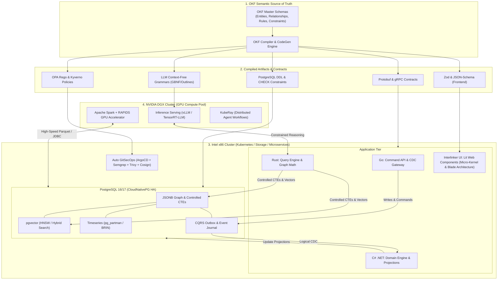

# Enterprise Architecture & Tooling Roadmap: OKF-Driven Polyglot AI Ecosystem

This repository directory contains the architectural blueprints, technical toolchain selections, and operational guidelines for building an enterprise-grade, ontology-driven intelligent system.

---

## 1. System Vision & Core Tenets

1. **Universal Semantic Truth (OKF Everywhere):** 
   The Open Knowledge Framework (OKF) acts as the single source of truth. All data contracts, schema definitions, validation rules, UI forms, API specifications, and LLM output constraints are deterministically compiled from OKF.
2. **Unified Data Engine (Multi-Model PostgreSQL):**
   Instead of fragmenting the state layer across separate graph, vector, time-series, and relational databases, **PostgreSQL (16/17)** acts as the unified storage engine. It provides:
   - **Graph Traversal:** Relational nodes & edges with rich `JSONB` properties and depth-controlled recursive Common Table Expressions (`WITH RECURSIVE` + `CYCLE`).
   - **Vector Search:** `pgvector` with HNSW indexes and `halfvec` quantization for sub-50ms hybrid retrieval.
   - **Timeseries & Telemetry:** Native range partitioning (`pg_partman`) and BRIN indexes.
   - **CQRS & Event Sourcing:** Append-only event store paired with the Transactional Outbox pattern and WAL-based Change Data Capture (CDC).
3. **Hybrid Compute Topology (DGX Spark + Intel K8s):**
   - **NVIDIA DGX Cluster:** Dedicated to matrix-heavy workloads—LLM inference (vLLM / TensorRT-LLM), distributed Spark GPU data processing (RAPIDS Accelerator), and Ray actor pipelines.
   - **Intel x86 Servers:** Dedicated to I/O-intensive workloads—High-availability PostgreSQL, high-concurrency Go ingress, C# .NET domain services, Rust query engines, and Kubernetes control planes.
4. **Polyglot Systems Engineering (Rust, Go, C# .NET):**
   - **Go:** Ultra-lightweight network ingress, CQRS command ingestion, CDC consumers, and Kubernetes operators.
   - **C# .NET 8/9:** Complex domain business logic, workflow state machines, and CQRS read projections.
   - **Rust:** Ultra-low-latency query parsing, complex CTE generation, zero-copy Arrow serialization, and math-heavy graph algorithms.
5. **Ontology-Driven UI Operating System (Interlinker UI / Ix-Platform):**
   - **Native Web Components (Lit 3.x):** W3C standard Custom Elements with Shadow DOM style isolation, native performance, and strict framework independence.
   - **Micro-Kernel Engine (`Interlinker.Engine`):** Pluggable IoC `ServiceRegistry` and dynamic micro-frontend module loading via `ComponentRegistry`.
   - **Horizontal Blade Navigation (`ix-meta-blade` + `ix-meta-flow-shell`):** Spatial multi-blade cascading workspaces preserving operator context.
   - **GSOAE 4-Quadrant Execution:** Dynamic form/view synthesis via `SemanticMapper` (26+ semantic controls), client-side CQRS event sourcing, and MassTransit-compatible UUIDv7 sequential GUIDs.
   - **Autonomous UI Fleet:** AI Agent 06 (`agent-06-ui-lit-developer`) synthesizes Lit components directly from MCP ontology endpoints with bilateral E2E self-healing.

---

## Architecture Documents Index

- [README.md](file:///home/sundarjadhav/ProsPano-Development/Hub/technical-depth/00%20Arch-roadmap-tools/README.md) — Master Architecture Roadmap, System Vision, Tooling Matrix & Multi-Model PostgreSQL Blueprints.
- [01_UI_ECOSYSTEM_PHILOSOPHY_AND_ARCHITECTURE.md](file:///home/sundarjadhav/ProsPano-Development/Hub/technical-depth/00%20Arch-roadmap-tools/01_UI_ECOSYSTEM_PHILOSOPHY_AND_ARCHITECTURE.md) — Deep Specification: Interlinker UI / Ix-Platform, Micro-Kernel, Web Components, Blade Architecture, and GSOAE 4-Quadrant Synthesis.

---

## 2. High-Level Architecture Topology



---

## 3. Comprehensive Tooling Matrix

| Tier | Category | Selected Tool / Framework | Role & Architectural Rationale |
| :--- | :--- | :--- | :--- |
| **Ontology** | **Source Definition** | **OKF (Open Knowledge Framework)** | Canonical domain model declaring entities, relations, value spaces, and invariants. |
| | **Code Generation** | **Custom OKF Compiler / LinkML / Buf** | Generates DDL, Protobuf, TypeScript, Zod, and OPA policies in one deterministic CI pass. |
| **Data Engine** | **Database Core** | **PostgreSQL 16 / 17** | Single transactional engine replacing distinct graph, vector, and time-series DBs. |
| | **K8s Operator** | **CloudNativePG** (or **Crunchy Data PGO**) | Automated HA failover, declarative backups, connection pooling, and rolling upgrades. |
| | **Vector Search** | **`pgvector` (v0.7+)** | HNSW indexing, `halfvec` (FP16) quantization, and single-query hybrid search. |
| | **Timeseries** | **`pg_partman`** (or **TimescaleDB**) | Automatic range partitioning and BRIN indexing for multi-billion row event logs. |
| | **Graph Traversal** | **Controlled Recursive CTEs** (+ optional **Apache AGE**) | Graph walks via SQL with strict depth bounds and cycle prevention. |
| | **Migration Tool** | **Atlas** (`atlasgo.io`) | Declarative schema management ensuring PostgreSQL DDL matches OKF specs. |
| **DGX Compute** | **Inference Serving** | **vLLM** / **TensorRT-LLM** | PagedAttention, multi-GPU tensor parallelism, and native guided logit decoding. |
| | **Logit Constraints** | **Outlines** | Enforces OKF Context-Free Grammars at inference time to prevent schema hallucinations. |
| | **Big Data ETL** | **Spark Operator + RAPIDS Accelerator** | Executes Spark SQL queries and vector transformations directly on DGX GPUs. |
| | **Distributed Agents** | **KubeRay (Ray on K8s)** | Scalable multi-agent execution, parallel evaluations, and distributed batching. |
| | **GPU Management** | **NVIDIA GPU & Network Operators** | CUDA driver lifecycle, GPUDirect RDMA, InfiniBand/RoCE, and MIG configuration. |
| **Polyglot Backends** | **Go (Ingress & CDC)** | **Chi** + **pgx/v5** + **sqlc** | High-concurrency command endpoints, CDC event processing, and streaming. |
| | **C# .NET (Domain)** | **ASP.NET Core 8/9** + **EF Core** / **Dapper** | Complex domain orchestration, CQRS read model projections, and enterprise APIs. |
| | **Rust (Engine)** | **Axum** + **Tonic (gRPC)** + **SQLx** | High-performance graph queries, controlled CTE execution, and zero-copy math. |
| **Frontend Platform** | **Component Framework** | **Lit 3.x (Web Components / Custom Elements)** | W3C custom elements with Shadow DOM; zero virtual DOM overhead, native browser speed, framework-agnostic. |
| | **Micro-Kernel Engine** | **Interlinker.Engine (`bootstrap.ts`)** | Dynamic module loader, IoC `ServiceRegistry`, and event-driven runtime lifecycle. |
| | **Component SDK** | **Interlinker.SDK (`IxBaseElement`, `@interlinker/sdk`)** | Base element foundation with `@consume` context injection, XState actors, and command bus. |
| | **Blade Navigation** | **`ix-meta-blade` + `ix-meta-flow-shell`** | Multi-tenant horizontal sliding blade architecture preserving deep spatial workflow context. |
| | **Dynamic Semantic UI** | **`SemanticMapper` + `UiControlDirective`** | Dynamic form/view synthesis mapping OKF `MetaEntity` attributes to 26+ native semantic controls. |
| | **High-Perf Grid** | **`ix-meta-grid`** | High-density enterprise virtualized data grid with type renderers, action bars, and inline editing. |
| | **Schema & Flow Builder**| **`ix-meta-builder`** | Visual drag-and-drop ontology entity and workflow transition builder. |
| | **Client CQRS & State** | **Redux Toolkit (`readModelStore`, `eventStore`)** | Client-side CQRS event sourcing with MassTransit-compatible UUIDv7 sequential GUIDs. |
| | **Autonomous Agent UI** | **Agent 06 (UI Lit Developer OpenClaw)** | Autonomous synthesis of Lit Web Components directly from MCP ontology schemas with bilateral E2E repair. |
| | **Policy-as-Code** | **Kyverno** / **OPA Gatekeeper** | Validates that all workloads and DDL migrations adhere to OKF governance. |
| | **Code Scanning** | **Semgrep** | Custom AST rules ensuring backend code validates OKF constraints before writes. |
| | **Container Security**| **Trivy** + **Cosign** | Vulnerability scanning, SBOM generation, and cryptographic image signing. |
| **Observability** | **Telemetry** | **OpenTelemetry Collector + Grafana Tempo**| Distributed request tracing across Rust, Go, .NET, and LLM inference. |
| | **Metrics** | **Prometheus + DCGM-Exporter** | Correlates DGX GPU temperature/power with PostgreSQL I/O and query latency. |

---

## 4. PostgreSQL Multi-Model Schema Blueprints

### A. Graph via JSONB & Controlled Recursive CTEs

```sql
-- 1. Node Table
CREATE TABLE nodes (
    id UUID PRIMARY KEY DEFAULT gen_random_uuid(),
    label VARCHAR(64) NOT NULL,
    properties JSONB NOT NULL DEFAULT '{}'::jsonb,
    created_at TIMESTAMPTZ NOT NULL DEFAULT clock_timestamp()
);

CREATE INDEX idx_nodes_label ON nodes(label);
CREATE INDEX idx_nodes_props ON nodes USING gin (properties jsonb_path_ops);

-- 2. Edge Table
CREATE TABLE edges (
    id UUID PRIMARY KEY DEFAULT gen_random_uuid(),
    source_id UUID NOT NULL REFERENCES nodes(id) ON DELETE CASCADE,
    target_id UUID NOT NULL REFERENCES nodes(id) ON DELETE CASCADE,
    relationship VARCHAR(64) NOT NULL,
    weight DOUBLE PRECISION DEFAULT 1.0,
    properties JSONB NOT NULL DEFAULT '{}'::jsonb,
    created_at TIMESTAMPTZ NOT NULL DEFAULT clock_timestamp()
);

CREATE INDEX idx_edges_src_rel ON edges(source_id, relationship);
CREATE INDEX idx_edges_tgt_rel ON edges(target_id, relationship);
CREATE INDEX idx_edges_props ON edges USING gin (properties jsonb_path_ops);

-- 3. Controlled Recursive CTE with Cycle Detection and Depth Limit
CREATE OR REPLACE FUNCTION traverse_okf_graph(
    p_start_node UUID,
    p_rel_type VARCHAR,
    p_max_depth INT DEFAULT 4
)
RETURNS TABLE (
    hop INT,
    source_id UUID,
    target_id UUID,
    relationship VARCHAR,
    properties JSONB,
    traversal_path UUID[]
) AS $$
BEGIN
    RETURN QUERY
    WITH RECURSIVE graph_walk AS (
        -- Anchor Member
        SELECT 
            1 AS hop,
            e.source_id,
            e.target_id,
            e.relationship,
            e.properties,
            ARRAY[e.source_id, e.target_id] AS traversal_path
        FROM edges e
        WHERE e.source_id = p_start_node
          AND (p_rel_type IS NULL OR e.relationship = p_rel_type)

        UNION ALL

        -- Recursive Member
        SELECT 
            gw.hop + 1,
            e.source_id,
            e.target_id,
            e.relationship,
            e.properties,
            gw.traversal_path || e.target_id
        FROM edges e
        JOIN graph_walk gw ON e.source_id = gw.target_id
        WHERE gw.hop < p_max_depth
          AND NOT (e.target_id = ANY(gw.traversal_path)) -- Anti-cycle barrier
    )
    SELECT * FROM graph_walk;
END;
$$ LANGUAGE plpgsql STABLE;
```

### B. Vector Embeddings (`pgvector`) & Hybrid Search

```sql
CREATE EXTENSION IF NOT EXISTS vector;

-- Vector-enabled entity table
CREATE TABLE okf_embeddings (
    node_id UUID PRIMARY KEY REFERENCES nodes(id) ON DELETE CASCADE,
    embedding halfvec(1536) NOT NULL, -- FP16 for 50% RAM savings
    content_chunk TEXT NOT NULL,
    search_tsv TSVECTOR GENERATED ALWAYS AS (to_tsvector('english', content_chunk)) STORED
);

-- HNSW Cosine Index for ultra-fast nearest-neighbor lookups
CREATE INDEX idx_okf_emb_hnsw ON okf_embeddings 
USING hnsw (embedding halfvec_cosine_ops) 
WITH (m = 16, ef_construction = 64);

CREATE INDEX idx_okf_tsv ON okf_embeddings USING gin(search_tsv);
```

### C. CQRS Event Store & Transactional Outbox

```sql
-- Append-only event journal
CREATE TABLE cqrs_event_journal (
    event_id BIGSERIAL NOT NULL,
    aggregate_type VARCHAR(64) NOT NULL,
    aggregate_id UUID NOT NULL,
    event_type VARCHAR(64) NOT NULL,
    payload JSONB NOT NULL,
    metadata JSONB NOT NULL DEFAULT '{}'::jsonb,
    created_at TIMESTAMPTZ NOT NULL DEFAULT clock_timestamp()
) PARTITION BY RANGE (created_at);

-- Transactional Outbox (Relayed via Logical Replication / CDC to message bus)
CREATE TABLE cqrs_outbox (
    outbox_id BIGSERIAL PRIMARY KEY,
    topic VARCHAR(128) NOT NULL,
    payload JSONB NOT NULL,
    created_at TIMESTAMPTZ NOT NULL DEFAULT clock_timestamp()
);
```

---

## 5. Hybrid Node Scheduling (Kubernetes Spec)

In your unified Kubernetes cluster, isolate workloads via node labels, taints, and affinity:

```yaml
# Sample manifest for DGX GPU workloads (vLLM / TensorRT-LLM)
apiVersion: apps/v1
kind: Deployment
metadata:
  name: vllm-okf-inference
spec:
  replicas: 2
  template:
    spec:
      affinity:
        nodeAffinity:
          requiredDuringSchedulingIgnoredDuringExecution:
            nodeSelectorTerms:
            - matchExpressions:
              - key: node.kubernetes.io/instance-type
                operator: In
                values: ["dgx-h100", "dgx-a100"]
      tolerations:
      - key: "nvidia.com/gpu"
        operator: "Exists"
        effect: "NoSchedule"
      containers:
      - name: vllm
        image: vllm/vllm-openai:latest
        resources:
          limits:
            nvidia.com/gpu: 4
---
# Sample manifest for Intel PostgreSQL / Microservices
apiVersion: apps/v1
kind: Deployment
metadata:
  name: rust-query-engine
spec:
  replicas: 4
  template:
    spec:
      affinity:
        nodeAffinity:
          requiredDuringSchedulingIgnoredDuringExecution:
            nodeSelectorTerms:
            - matchExpressions:
              - key: kubernetes.io/arch
                operator: In
                values: ["amd64"]
              - key: hardware.node.role
                operator: In
                values: ["intel-worker"]
```

---

## 6. Implementation Milestones

1. **Phase 1: OKF Definition & Compiler Setup**
   - Author domain definitions using OKF YAML conventions.
   - Build compiler to emit PostgreSQL DDL, Protobuf, Zod schemas, and Outlines CFGs.
2. **Phase 2: PostgreSQL Multi-Model Foundation**
   - Deploy CloudNativePG on Intel Kubernetes nodes.
   - Install `pgvector` and `pg_partman`.
   - Apply base DDL and verify controlled recursive CTE traversal performance.
3. **Phase 3: DGX Inference & Spark RAPIDS Pipeline**
   - Deploy NVIDIA GPU and Network Operators.
   - Spin up vLLM with Outlines guided decoding bound to OKF grammars.
   - Configure Spark RAPIDS operator for GPU-accelerated batch vectorization.
4. **Phase 4: Polyglot Backend & Interlinker UI Platform Deployment**
   - Deploy Go CQRS command gateway, C# .NET projection workers, and Rust query services.
   - Deploy Interlinker UI micro-kernel engine (`Interlinker.Engine`), registering core services (`ServiceRegistry`).
   - Mount `ix-meta-flow-shell` and `ix-meta-bladecontainer` for horizontal cascading blade navigation.
   - Activate dynamic `SemanticMapper` rendering 26+ native Lit controls from OKF Quadrant I `MetaEntity` schemas.
   - Connect frontend Redux `eventStore` and `readModelStore` with client-side UUIDv7 sequential GUID generation.
   - Configure Agent 06 (UI Lit Developer) in CI to autonomously generate Lit Web Components from MCP ontology endpoints.
5. **Phase 5: Auto GitSecOps & Production Hardening**
   - Configure ArgoCD GitOps pipelines.
   - Deploy Kyverno policies and Semgrep CI scanners to enforce OKF compliance.
