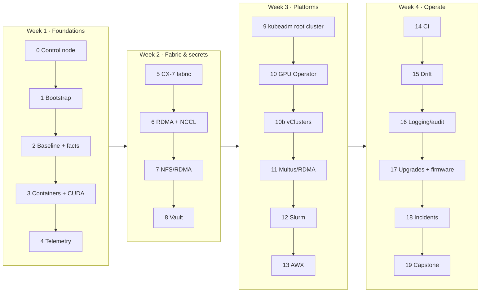

# Step-by-Step: From an Unboxed DGX Spark to a Fully Automated Lab

> **Module 01 companion guide.** The shortest correct path through the lab, in the order that avoids rework. Each step lists the command, what "done" looks like, and the volume that explains it. New to Ansible? Read [01A](01-ansible-core-deep-dive.md) first, then follow this page.



**One Spark or two?** Steps 5–7 and the multi-node parts of 11–12 need two Sparks and a QSFP cable. Everything else works on one; remove `dgx-spark-02` from the inventory.

---

## Step 0 · Control node (30 min) → [01A](01-ansible-core-deep-dive.md)

```bash
git clone https://github.com/cloudone365/technical-depth.git && cd "technical-depth/01 Ansible/lab"
python3 -m venv ~/.venvs/spark-ansible && source ~/.venvs/spark-ansible/bin/activate
pip install -r requirements.txt
ansible-galaxy collection install -r requirements.yml -p ./collections
tests/run-local-checks.sh              # proves your toolchain before touching hardware
```

✅ Done when `ALL LOCAL CHECKS PASSED`.

## Step 1 · Bootstrap the Spark (45 min) → [06](06-bare-metal-os-provisioning-pxe-and-redfish.md)

1. First-boot wizard (display or headless hotspot). Same username (`nvidia`) on every Spark. Let updates finish.
2. Edit `inventory/hosts.yml` (IPs) and `inventory/host_vars/spark-0N.yml`.

```bash
ansible-playbook playbooks/00-bootstrap.yml -l dgx-spark-01 -k -K -e bootstrap_current_ip=<dhcp-ip>
ansible-playbook playbooks/00-bootstrap.yml -l dgx-spark-01 -K -e bootstrap_current_ip=<dhcp-ip> -e bootstrap_static_ip=true
ansible-playbook playbooks/00-ping.yml
```

✅ Done when `00-ping` reports aarch64 / 20 cores / Ubuntu 24.04 on the static IP.

## Step 2 · Baseline and custom facts (20 min) → [01A](01-ansible-core-deep-dive.md), [07](07-nvidia-driver-and-fabric-manager-automation.md)

```bash
ansible-playbook playbooks/01-baseline.yml -K          # twice: second run changed=0
ansible-playbook playbooks/16-driver-audit.yml -K
```

✅ `ansible_local.spark.gpu.compute_cap == "12.1"`; driver audit green; NVIDIA packages held.

## Step 3 · Containers and CUDA (40 min) → [08](08-cuda-toolkit-cudnn-and-container-runtime.md)

```bash
ansible-playbook playbooks/03-containers.yml -K
ansible-playbook playbooks/18-cuda-smoke.yml -K
```

✅ `uma_probe ... cc=12.1 integrated=1 check=PASS`; PyTorch bf16 TFLOPS recorded.

## Step 4 · Telemetry (30 min) → [09](09-dcgm-telemetry-and-exporter-orchestration.md)

```bash
ansible-playbook playbooks/04-telemetry.yml -K
```

✅ Grafana `http://<dgx-spark-01>:3000` → *Spark Lab / Overview* shows GPU, UMA and CX-7 panels.

## Step 5 · CX-7 fabric (45 min, 2 Sparks) → [11](11-infiniband-fabric-automation-and-opensm.md)

```bash
ssh nvidia@192.168.0.100 ibdev2netdev           # confirm names → host_vars
ansible-playbook playbooks/02-fabric.yml -K
```

✅ All link asserts pass at 200000 Mb/s, MTU 9000, `PORT_ACTIVE`; jumbo pings OK.

## Step 6 · RDMA and NCCL (60 min) → [11](11-infiniband-fabric-automation-and-opensm.md), [12](12-lossless-rocev2-and-pfc-switch-host-tuning.md)

```bash
ansible-playbook playbooks/11-rdma-perftest.yml -K
ansible-playbook playbooks/10-nccl-test.yml -K
```

✅ NCCL log says `via NET/IB`; busbw recorded next to the perftest numbers.

## Step 7 · Shared model cache (20 min) → [15](15-parallel-file-system-client-orchestration.md)

```bash
ansible-playbook playbooks/09-nfs-rdma.yml -K
```

✅ dgx-spark-02 `/proc/mounts` shows `proto=rdma,port=20049`.

## Step 8 · Vault (60 min) → [03B](03-hashicorp-vault-deep-dive.md), [19](19-hashicorp-vault-approle-and-dynamic-secrets.md)

```bash
ansible-playbook playbooks/08-vault.yml -K
export VAULT_ADDR=https://192.168.0.100:8200 VAULT_CACERT=$PWD/.cache/spark-lab-ca.crt
export VAULT_TOKEN=$(jq -r .root_token .cache/vault-init.json)
vault kv put kv/spark-lab/ngc api_key=nvapi-...
ansible-playbook playbooks/19-vault-integration.yml -e vault_issue_secret_id=true -l localhost
unset VAULT_TOKEN; source .cache/approle.env
ansible-playbook playbooks/19-vault-integration.yml -K
```

✅ NGC login works from an AppRole token; SSH certificate issued.

## Step 9 · Kubernetes root cluster (45 min) → [16](16-kubernetes-bare-metal-bootstrap-kubeadm.md)

The end-state of steps 9–10b is **one kubeadm root cluster with two vClusters inside it**:

| Context | What it is | Where |
|---|---|---|
| `spark-root` | kubeadm v1.36.5, `dgx-spark-01` is control plane *and* worker (no taint), `dgx-spark-02` joins as a worker if present; Cilium (VXLAN, kube-proxy kept), MetalLB L2 pool `192.168.0.110–119` | `https://192.168.0.100:6443` |
| `dev-lab` | vCluster #1 in root namespace `vc-dev-lab`: 2 CPU · 8 Gi · 2 GPU slices | `https://192.168.0.111` |
| `llms` | vCluster #2 in root namespace `vc-llms`: 4 CPU · 48 Gi · 8 GPU slices | `https://192.168.0.112` |

```bash
ansible-playbook playbooks/05-kubernetes.yml -K          # kubeadm_cluster, then cilium + metallb from the control node
export KUBECONFIG=$PWD/.cache/kubeconfig-spark-lab.yaml  # one file, every context
kubectl --context spark-root get nodes -o wide
kubectl --context spark-root -n kube-system get pods     # static-pod control plane, etcd, CoreDNS, cilium, kube-proxy
```

✅ `dgx-spark-01` is `Ready`; `kubectl --context spark-root -n kube-system exec ds/cilium -- cilium-dbg status --brief` prints `OK`; `ssh nvidia@192.168.0.100 sudo crictl ps` lists the control-plane containers. Broke it while learning? `ansible-playbook playbooks/99-reset-kubernetes.yml -K` (type `RESET`) and run step 9 again.

## Step 10 · GPU Operator (30 min) → [17](17-nvidia-gpu-operator-helm-automation.md)

```bash
ansible-playbook playbooks/06-gpu-operator.yml
```

✅ Each node advertises `nvidia.com/gpu: 15` (`kubectl --context spark-root get node dgx-spark-01 -o jsonpath='{.status.allocatable.nvidia\.com/gpu}'`); the `cuda-smoke` pod in `default` prints the GB10.

## Step 10b · vClusters dev-lab and llms (30 min) → [16](16-kubernetes-bare-metal-bootstrap-kubeadm.md), [02 Kubernetes · 27](../02%20Kubernetes/27-nested-clusters-with-vcluster.md)

Needs the [02 Kubernetes lab](../02%20Kubernetes/lab/README.md) checked out next to this one: the `vclusters` role applies its `vclusters/*.yaml` values and `manifests/root/05-vclusters` budgets rather than keeping a copy.

```bash
ansible-playbook playbooks/06b-vclusters.yml
kubectl --context spark-root get ns vc-dev-lab vc-llms
kubectl --context dev-lab get namespaces
kubectl --context llms get namespaces
```

✅ Both vCluster contexts answer through their MetalLB IPs; `kubectl --context spark-root -n vc-llms get resourcequota` shows the llms budget.

## Step 11 · Multus + RDMA pods (45 min) → [13](13-multus-cni-and-secondary-rdma-networking.md)

```bash
ansible-playbook playbooks/13-multus-rdma.yml
```

## Step 12 · Slurm (45 min) → [18](18-slurm-cluster-orchestration-and-cgroup-gpus.md)

> Cordon the node in Kubernetes first (`kubectl --context spark-root cordon dgx-spark-01`) or dedicate nodes: Slurm and Kubernetes don't know about each other's GPU use, and the time-sliced GPU is shared by root and vCluster pods alike.

```bash
ansible-playbook playbooks/07-slurm.yml -K
```

## Step 13 · AWX (2 h) → [02B](02-ansible-tower-awx-deep-dive.md), [20](20-awx-tower-production-cluster-and-receptor.md)

Install per 02B (arm64 pre-flight first), then configure as code and add the drift workflow.

## Step 14 · CI (45 min) → [21](21-ansible-testing-linting-and-molecule.md)

Push a branch → `ansible-lab` workflow green. Register the Spark as a self-hosted runner and run Molecule.

## Step 15 · Drift (30 min) → [22](22-configuration-drift-detection-and-self-healing.md)

```bash
tools/drift-cycle.sh; AUTO_HEAL=1 tools/drift-cycle.sh
```

## Step 16 · Logging and audit (45 min) → [23](23-high-cardinality-logging-and-audit-compliance.md)

```bash
ansible-playbook playbooks/23-logging-audit.yml -K
```

## Step 17 · Upgrades and firmware (per maintenance window) → [07](07-nvidia-driver-and-fabric-manager-automation.md), [10](10-firmware-lifecycle-and-gpu-vulnerability-patch.md)

```bash
ansible-playbook playbooks/19-firmware-inventory.yml -K
ansible-playbook playbooks/17-dgxos-upgrade.yml -K -e upgrade_dry_run=true
ansible-playbook playbooks/17-dgxos-upgrade.yml -K -l dgx-spark-02 -e upgrade_firmware=true
```

## Step 18 · Incidents (90 min of drills) → [24](24-cluster-wide-emergency-drain-and-remediation.md)

```bash
ansible-playbook playbooks/21-emergency-drain.yml -l dgx-spark-02 -K -e node_drain_reboot=true -e node_drain_undrain_after=true
ansible-playbook playbooks/24-uma-relief.yml -l dgx-spark-01 -K
```

## Step 19 · Capstone → [25](25-hands-on-ansible-mastery-lab-and-test-harness.md)

```bash
ansible-playbook playbooks/25-chaos.yml -l dgx-spark-02 -K -e chaos_fault=random
python3 tools/capstone_scorecard.py
```

---

## Playbook quick reference

| Playbook | Purpose | Volume |
|---|---|---|
| `00-bootstrap.yml` | Hostname, keys, static IP with dead-man rollback | 06 |
| `00-ping.yml` | Connectivity + identity | 01A |
| `01-baseline.yml` | Facts + OS baseline | 01A |
| `02-fabric.yml` | CX-7 addressing + verification | 11 |
| `03-containers.yml` | Docker, toolkit, CDI, NGC | 08 |
| `04-telemetry.yml` | node_exporter, collector, Prometheus/Grafana/Alertmanager | 09 |
| `05-kubernetes.yml` · `06-gpu-operator.yml` · `06b-vclusters.yml` | kubeadm root cluster (Cilium, MetalLB) → GPU Operator → vClusters dev-lab + llms | 16–17 |
| `07-slurm.yml` | Slurm | 18 |
| `08-vault.yml` · `19-vault-integration.yml` | Vault server + Ansible integration | 03B, 19 |
| `09-nfs-rdma.yml` | Shared model cache | 15 |
| `10-nccl-test.yml` · `11-rdma-perftest.yml` · `12b-roce-qos.yml` | Fabric performance and QoS | 11–12 |
| `12-redfish-practice.yml` | Redfish mockup BMC | 06 |
| `13-fleet-sim.yml` · `14-fleet-bench.yml` | Performance lab | 02A |
| `13-multus-rdma.yml` | Secondary RDMA networks for pods | 13 |
| `14-gds-check.yml` | GDS / cuFile assessment | 14 |
| `15-jinja-lab.yml` | Jinja katas | 04 |
| `16-driver-audit.yml` · `17-dgxos-upgrade.yml` | Driver consistency + rolling upgrade | 07 |
| `18-cuda-smoke.yml` | sm_121 + PyTorch smoke | 08 |
| `19-firmware-inventory.yml` | Firmware + security floor | 10 |
| `20-drift-check.yml` | Check-mode drift | 22 |
| `21-emergency-drain.yml` · `24-uma-relief.yml` | Incident response | 24 |
| `23-logging-audit.yml` | auditd, Loki, Alloy, ARA | 23 |
| `25-chaos.yml` · `30-validate.yml` · `site.yml` | Capstone, validation, full build | 25 |
| `99-reset-kubernetes.yml` | Wipe Kubernetes and every vCluster for a clean rebuild (`RESET` prompt) | 16 |
