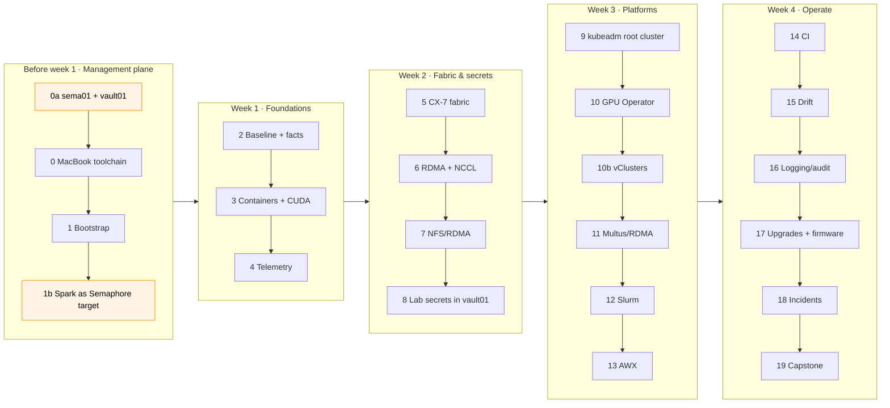

# Step-by-Step: From an Unboxed DGX Spark to a Fully Automated Lab

> **Module 01 companion guide.** The shortest correct path through the lab, in the order that avoids rework. Each step lists the Semaphore template to run, the break-glass command, what "done" looks like, and the volume that explains it. New to Ansible? Read [01A](01-ansible-core-deep-dive.md) first, then follow this page.



**Who runs what.** `sema01` (Semaphore) and `vault01` (Vault) stay outside the Spark and run every playbook from Step 2 on: each step names its **Semaphore template** in project `spark-lab` (template name = playbook name, for example `05 Kubernetes` ↔ `05-kubernetes.yml`). The `ansible-playbook …` line under it is the **break-glass** form from the MacBook, for when sema01 or vault01 is down ([00b §10](00b-dgx-spark-semaphore-target.md)). Your MacBook does the rest: browser, `git push`, `kubectl` for the 02 Kubernetes labs, and the bootstrap playbooks in Steps 1 and 1b.

**One Spark or two?** Steps 5–7 and the multi-node parts of 11–12 need two Sparks and a QSFP cable. Everything else works on one: keep `dgx-spark-02` in the inventory and give every template the CLI argument `--limit dgx-spark-01,localhost` (the break-glass form uses `-l dgx-spark-01,localhost`).

---

## Step 0a · Management plane: vault01 + sema01 (half a day) → [00a](00a-semaphore-vault-lab-guide.md)

Build `vault01` (192.168.0.211: SSH CA `ssh-client-signer`, signing role `ansible` for principal `svc-ansible` with 15-minute certificates, AppRole `semaphore`, audit log) and `sema01` (192.168.0.210: Semaphore UI + PostgreSQL in Docker) by hand, exactly as the 00a guide says. They are never configured by the lab playbooks and survive every reset of the Spark.

✅ Done when the 00a §9 checks pass: a Semaphore task on your Ubuntu targets gets a certificate in play 1 and logs in as `svc-ansible`.

## Step 0 · MacBook toolchain (30 min) → [01A](01-ansible-core-deep-dive.md)

```bash
git clone https://github.com/cloudone365/technical-depth.git && cd "technical-depth/01 Ansible/lab"
python3 -m venv ~/.venvs/spark-ansible && source ~/.venvs/spark-ansible/bin/activate
pip install -r requirements.txt
ansible-galaxy collection install -r requirements.yml -p ./collections
tests/run-local-checks.sh              # proves your toolchain before touching hardware
```

✅ Done when `ALL LOCAL CHECKS PASSED`. The MacBook needs this toolchain only for the bootstrap playbooks, `08-vault.yml` and break-glass runs; Semaphore brings its own (00b §4).

## Step 1 · Bootstrap the Spark (45 min, MacBook) → [06](06-bare-metal-os-provisioning-pxe-and-redfish.md)

1. First-boot wizard (display or headless hotspot). Same username (`nvidia`) on every Spark. Let updates finish.
2. Edit `inventory/hosts.yml` (IPs) and `inventory/host_vars/dgx-spark-0N.yml`.

```bash
ansible-playbook playbooks/00-bootstrap.yml -l dgx-spark-01 -k -K -e bootstrap_current_ip=<dhcp-ip>
ansible-playbook playbooks/00-bootstrap.yml -l dgx-spark-01 -K -e bootstrap_current_ip=<dhcp-ip> -e bootstrap_static_ip=true
ansible-playbook playbooks/00-ping.yml -l dgx-spark-01,localhost
```

This step stays on the MacBook: the Spark doesn't trust vault01 yet, so Semaphore can't log in. You connect as `nvidia` with your own key ([`group_vars/spark.yml`](lab/inventory/group_vars/spark.yml) picks that login whenever no `vault_role_id` is set).

✅ Done when `00-ping` reports aarch64 / 20 cores / Ubuntu 24.04 on the static IP.

## Step 1b · dgx-spark-01 as a Semaphore target (60 min) → [00b](00b-dgx-spark-semaphore-target.md)

Follow the 00b guide. In short:

```bash
scp vault01:~/vault-ca.crt .cache/vault-ca.crt                                    # MacBook: vault01's TLS certificate (00b §2)
ansible-playbook playbooks/00b-semaphore-target.yml -l dgx-spark-01,localhost -K  # MacBook: svc-ansible, NOPASSWD sudo, trust vault01's CA (00b §3)
```

Then on sema01, build the lab's Semaphore image and state volume from [`lab/semaphore/`](lab/semaphore/) (00b §4), and in Semaphore create project `spark-lab` with the repository, the File inventory `01 Ansible/lab/inventory/hosts.yml`, the variable group `vault-approle` and the template `00 Ping` (00b §5). Finally run `08-vault.yml` from the MacBook to add the lab secrets to vault01 (Step 8 below, 00b §6).

✅ Done when the Semaphore template `00 Ping` shows play 1 ok and `dgx-spark-01 aarch64 20 cores …` with `failed=0`, and dgx-spark-01's sshd log shows `Accepted publickey for svc-ansible … ED25519-CERT`.

## Step 2 · Baseline and custom facts (20 min) → [01A](01-ansible-core-deep-dive.md), [07](07-nvidia-driver-and-fabric-manager-automation.md)

**Semaphore:** run `01 Baseline` (twice: the second run is `changed=0`), then `16 Driver audit`.

```bash
# break-glass (MacBook)
ansible-playbook playbooks/01-baseline.yml -l dgx-spark-01,localhost -K
ansible-playbook playbooks/16-driver-audit.yml -l dgx-spark-01,localhost -K
```

✅ `ansible_local.spark.gpu.compute_cap == "12.1"`; driver audit green; NVIDIA packages held.

## Step 3 · Containers and CUDA (40 min) → [08](08-cuda-toolkit-cudnn-and-container-runtime.md)

**Semaphore:** `03 Containers` (with `vault_lab_secrets_enabled: true` it logs in to NGC with the key from vault01, Step 1b), then `18 CUDA smoke`.

```bash
# break-glass (MacBook): no vault01 token here, so pass the NGC key yourself if you need it (Volume 08 §3.1)
ansible-playbook playbooks/03-containers.yml -l dgx-spark-01,localhost -K
ansible-playbook playbooks/18-cuda-smoke.yml -l dgx-spark-01,localhost -K
```

✅ `uma_probe ... cc=12.1 integrated=1 check=PASS`; PyTorch bf16 TFLOPS recorded.

## Step 4 · Telemetry (30 min) → [09](09-dcgm-telemetry-and-exporter-orchestration.md)

**Semaphore:** `04 Telemetry`.

```bash
ansible-playbook playbooks/04-telemetry.yml -l dgx-spark-01,localhost -K   # break-glass
```

✅ Grafana `http://192.168.0.100:3000` (the Spark's port 3000, not Semaphore's on sema01) → *Spark Lab / Overview* shows GPU, UMA and CX-7 panels.

## Step 5 · CX-7 fabric (45 min, 2 Sparks) → [11](11-infiniband-fabric-automation-and-opensm.md)

Confirm the CX-7 names with `ssh nvidia@192.168.0.100 ibdev2netdev` and put them in `host_vars`, push, then run the template **`02 Fabric`** without the `--limit` (both Sparks).

```bash
ansible-playbook playbooks/02-fabric.yml -K      # break-glass, both Sparks
```

✅ All link asserts pass at 200000 Mb/s, MTU 9000, `PORT_ACTIVE`; jumbo pings OK.

## Step 6 · RDMA and NCCL (60 min) → [11](11-infiniband-fabric-automation-and-opensm.md), [12](12-lossless-rocev2-and-pfc-switch-host-tuning.md)

**Semaphore:** `11 RDMA perftest`, then `10 NCCL test`.

```bash
ansible-playbook playbooks/11-rdma-perftest.yml -K   # break-glass
ansible-playbook playbooks/10-nccl-test.yml -K
```

✅ NCCL log says `via NET/IB`; busbw recorded next to the perftest numbers.

## Step 7 · Shared model cache (20 min) → [15](15-parallel-file-system-client-orchestration.md)

**Semaphore:** `09 NFS RDMA`.

```bash
ansible-playbook playbooks/09-nfs-rdma.yml -K   # break-glass
```

✅ dgx-spark-02 `/proc/mounts` shows `proto=rdma,port=20049`.

## Step 8 · Lab secrets in vault01 (20 min, done in Step 1b) → [03B](03-hashicorp-vault-deep-dive.md), [19](19-hashicorp-vault-approle-and-dynamic-secrets.md)

The lab has no Vault of its own: vault01 (Step 0a) holds the SSH CA **and** the lab's secrets. `08-vault.yml` only adds to it: KV v2 mount `kv`, policy `spark-lab-read` for `kv/spark-lab/*`, attached to AppRole `semaphore`, a placeholder `kv/spark-lab/ngc`. It needs an **admin** token, which Semaphore must never hold, so it runs from the MacBook. You did this in Step 1b (00b §6), because Step 3 already reads the NGC key; re-run it whenever you want to change the policy.

```bash
# MacBook, in 01 Ansible/lab
export VAULT_ADDR=https://192.168.0.211:8200 VAULT_CACERT=$PWD/.cache/vault-ca.crt
vault login                                       # admin token for vault01 (root token in the lab)
export VAULT_TOKEN=$(vault print token)           # read from the environment, never written to disk
ansible-playbook playbooks/08-vault.yml           # localhost only: talks to vault01's API
vault kv put kv/spark-lab/ngc api_key=nvapi-...   # the real key replaces the placeholder
unset VAULT_TOKEN
```

Then in Semaphore: variable group `vault-approle` → `"vault_lab_secrets_enabled": true`, and run the template **`19 Vault integration`**.

✅ The task log shows play 1 (certificate for `svc-ansible`), then `Lab secrets read from kv/spark-lab/: ['ngc']` and `NGC key present: True`, without printing the key; vault01's audit log has the AppRole login, the `sign/ansible` request and the KV read.

## Step 9 · Kubernetes root cluster (45 min) → [16](16-kubernetes-bare-metal-bootstrap-kubeadm.md)

The end-state of steps 9–10b is **one kubeadm root cluster with two vClusters inside it**:

| Context | What it is | Where |
|---|---|---|
| `spark-root` | kubeadm v1.36.5, `dgx-spark-01` is control plane *and* worker (no taint), `dgx-spark-02` joins as a worker if present; Cilium (VXLAN, kube-proxy kept), MetalLB L2 pool `192.168.0.110–119` | `https://192.168.0.100:6443` |
| `dev-lab` | vCluster #1 in root namespace `vc-dev-lab`: 2 CPU · 8 Gi · 2 GPU slices | `https://192.168.0.111` |
| `llms` | vCluster #2 in root namespace `vc-llms`: 4 CPU · 48 Gi · 8 GPU slices | `https://192.168.0.112` |

**Semaphore:** `05 Kubernetes` (kubeadm_cluster on the Spark, then cilium + metallb from the Semaphore container; the kubeconfig lands on sema01's state volume). Then, on the MacBook:

```bash
tools/fetch-kubeconfig.sh sema01                          # copies kubeconfig-spark-lab.yaml to .cache/ (0600)
export KUBECONFIG=$PWD/.cache/kubeconfig-spark-lab.yaml  # one file, every context
kubectl --context spark-root get nodes -o wide
kubectl --context spark-root -n kube-system get pods     # static-pod control plane, etcd, CoreDNS, cilium, kube-proxy
```

Break-glass: `ansible-playbook playbooks/05-kubernetes.yml -l dgx-spark-01,localhost -K` writes the kubeconfig straight to the MacBook's `.cache/`.

✅ `dgx-spark-01` is `Ready`; `kubectl --context spark-root -n kube-system exec ds/cilium -- cilium-dbg status --brief` prints `OK`; `ssh nvidia@192.168.0.100 sudo crictl ps` lists the control-plane containers. Broke it while learning? Run the template `99 Reset Kubernetes` (extra variable `reset_confirm: RESET`, 00b §7.3; break-glass: `ansible-playbook playbooks/99-reset-kubernetes.yml -l dgx-spark-01,localhost -K` and type `RESET`) and run step 9 again.

## Step 10 · GPU Operator (30 min) → [17](17-nvidia-gpu-operator-helm-automation.md)

**Semaphore:** `06 GPU Operator`, then `tools/fetch-kubeconfig.sh sema01` on the MacBook (the kubeconfig is unchanged, but this keeps the habit: after every cluster task, fetch).

```bash
ansible-playbook playbooks/06-gpu-operator.yml   # break-glass (localhost only, uses the MacBook's .cache/ kubeconfig)
tools/fetch-kubeconfig.sh sema01
```

✅ Each node advertises `nvidia.com/gpu: 15` (`kubectl --context spark-root get node dgx-spark-01 -o jsonpath='{.status.allocatable.nvidia\.com/gpu}'`); the `cuda-smoke` pod in `default` prints the GB10.

## Step 10b · vClusters dev-lab and llms (30 min) → [16](16-kubernetes-bare-metal-bootstrap-kubeadm.md), [02 Kubernetes · 27](../02%20Kubernetes/27-nested-clusters-with-vcluster.md)

Needs the [02 Kubernetes lab](../02%20Kubernetes/lab/README.md) checked out next to this one: the `vclusters` role applies its `vclusters/*.yaml` values and `manifests/root/05-vclusters` budgets rather than keeping a copy.

**Semaphore:** `06b vClusters` (adds the `dev-lab` and `llms` contexts to the kubeconfig on sema01's state volume). Then, on the MacBook:

```bash
tools/fetch-kubeconfig.sh sema01                 # now with all three contexts
kubectl --context spark-root get ns vc-dev-lab vc-llms
kubectl --context dev-lab get namespaces
kubectl --context llms get namespaces
```

✅ Both vCluster contexts answer through their MetalLB IPs; `kubectl --context spark-root -n vc-llms get resourcequota` shows the llms budget. Break-glass: `ansible-playbook playbooks/06b-vclusters.yml`. The [02 Kubernetes](../02%20Kubernetes/README.md) module starts from this kubeconfig on the MacBook.

## Step 11 · Multus + RDMA pods (45 min) → [13](13-multus-cni-and-secondary-rdma-networking.md)

**Semaphore:** `13 Multus RDMA`.

```bash
ansible-playbook playbooks/13-multus-rdma.yml   # break-glass
```

## Step 12 · Slurm (45 min) → [18](18-slurm-cluster-orchestration-and-cgroup-gpus.md)

> Cordon the node in Kubernetes first (`kubectl --context spark-root cordon dgx-spark-01`) or dedicate nodes: Slurm and Kubernetes don't know about each other's GPU use, and the time-sliced GPU is shared by root and vCluster pods alike.

**Semaphore:** `07 Slurm`.

```bash
ansible-playbook playbooks/07-slurm.yml -l dgx-spark-01,localhost -K   # break-glass
```

## Step 13 · AWX (2 h) → [02B](02-ansible-tower-awx-deep-dive.md), [20](20-awx-tower-production-cluster-and-receptor.md)

Optional. This lab's controller is Semaphore on sema01, outside the Spark; AWX is the alternative controller you'll meet in larger shops. Install per 02B (arm64 pre-flight first) to learn it, then configure as code and add the drift workflow. Don't run the same templates from both.

## Step 14 · CI (45 min) → [21](21-ansible-testing-linting-and-molecule.md)

Push a branch → `ansible-lab` workflow green (it also lints `00-vault-cert.yml`, `00b-semaphore-target.yml` and the `semaphore/` files). Register the Spark as a self-hosted runner and run Molecule. Semaphore clones `main`, so a green CI run is what gates the next template run.

## Step 15 · Drift (30 min) → [22](22-configuration-drift-detection-and-self-healing.md)

**Semaphore:** `20 Drift check` (check mode is built in, it changes nothing); schedule it **nightly** in the template's schedule. A failed or drifted run is your alert.

```bash
tools/drift-cycle.sh; AUTO_HEAL=1 tools/drift-cycle.sh   # MacBook: report + guarded self-heal (Volume 22)
```

## Step 16 · Logging and audit (45 min) → [23](23-high-cardinality-logging-and-audit-compliance.md)

**Semaphore:** `23 Logging audit`.

```bash
ansible-playbook playbooks/23-logging-audit.yml -l dgx-spark-01,localhost -K   # break-glass
```

✅ The audit trail now has four sources: Semaphore's task history (who ran what), vault01's audit log (who got a certificate or a secret), sshd's `ED25519-CERT` lines and auditd on the Spark (what changed).

## Step 17 · Upgrades and firmware (per maintenance window) → [07](07-nvidia-driver-and-fabric-manager-automation.md), [10](10-firmware-lifecycle-and-gpu-vulnerability-patch.md)

**Semaphore:** `19 Firmware inventory`, then `17 DGX OS upgrade` with extra variable `upgrade_dry_run: true`, then for real (`upgrade_firmware: true`, CLI args `--limit` on one Spark).

```bash
# break-glass (MacBook)
ansible-playbook playbooks/19-firmware-inventory.yml -l dgx-spark-01,localhost -K
ansible-playbook playbooks/17-dgxos-upgrade.yml -l dgx-spark-01,localhost -K -e upgrade_dry_run=true
ansible-playbook playbooks/17-dgxos-upgrade.yml -K -l dgx-spark-02,localhost -e upgrade_firmware=true
```

## Step 18 · Incidents (90 min of drills) → [24](24-cluster-wide-emergency-drain-and-remediation.md)

**Semaphore:** `21 Emergency drain` (extra variables `node_drain_reboot: true`, `node_drain_undrain_after: true`; the `--limit` names the node), then `24 UMA relief`. Then drill the break-glass path once, with sema01 "down":

```bash
ansible-playbook playbooks/21-emergency-drain.yml -l dgx-spark-02,localhost -K -e node_drain_reboot=true -e node_drain_undrain_after=true
ansible-playbook playbooks/24-uma-relief.yml -l dgx-spark-01,localhost -K
```

## Step 19 · Capstone → [25](25-hands-on-ansible-mastery-lab-and-test-harness.md)

**Semaphore:** `25 Chaos` (extra variable `chaos_fault: random`, `--limit` on one Spark), then find and fix the fault with your own templates. Grade on sema01, where the evidence is (Volume 25 §1.3).

```bash
ansible-playbook playbooks/25-chaos.yml -l dgx-spark-02,localhost -K -e chaos_fault=random   # break-glass
python3 tools/capstone_scorecard.py
```

---

## Playbook quick reference

"Where" says how the playbook normally runs: **Semaphore** = the template of the same name in project `spark-lab` (CLI args `--limit dgx-spark-01,localhost` while there's one Spark); **MacBook** = only from your MacBook. Every Semaphore playbook also runs from the MacBook as break-glass.

| Playbook | Purpose | Where | Volume |
|---|---|---|---|
| `00-bootstrap.yml` | Hostname, keys, static IP with dead-man rollback | MacBook | 06 |
| `00b-semaphore-target.yml` | `svc-ansible`, NOPASSWD sudo, trust vault01's SSH CA | MacBook (once) | 00b |
| `00-vault-cert.yml` | Play 1: AppRole login, 15-minute certificate, optional lab secrets | imported by every playbook that SSHes to the Sparks | 00a, 19 |
| `00-ping.yml` | Connectivity + identity | Semaphore `00 Ping` | 01A |
| `01-baseline.yml` | Facts + OS baseline | Semaphore | 01A |
| `02-fabric.yml` | CX-7 addressing + verification | Semaphore | 11 |
| `03-containers.yml` | Docker, toolkit, CDI, NGC (key from vault01) | Semaphore | 08 |
| `04-telemetry.yml` | node_exporter, collector, Prometheus/Grafana/Alertmanager | Semaphore | 09 |
| `05-kubernetes.yml` · `06-gpu-operator.yml` · `06b-vclusters.yml` | kubeadm root cluster (Cilium, MetalLB) → GPU Operator → vClusters dev-lab + llms; then `tools/fetch-kubeconfig.sh sema01` | Semaphore | 16–17 |
| `07-slurm.yml` | Slurm | Semaphore | 18 |
| `08-vault.yml` | Lab secrets in vault01: KV `kv`, policy `spark-lab-read`, AppRole attachment | MacBook (admin `VAULT_TOKEN`) | 03B, 19 |
| `19-vault-integration.yml` | Demonstrates the Semaphore path: play 1 token reads `kv/spark-lab/ngc` | Semaphore | 19 |
| `09-nfs-rdma.yml` | Shared model cache | Semaphore | 15 |
| `10-nccl-test.yml` · `11-rdma-perftest.yml` · `12b-roce-qos.yml` | Fabric performance and QoS | Semaphore | 11–12 |
| `12-redfish-practice.yml` | Redfish mockup BMC | Semaphore | 06 |
| `13-fleet-sim.yml` · `14-fleet-bench.yml` | Performance lab | MacBook (it benchmarks your own controller) | 02A |
| `13-multus-rdma.yml` | Secondary RDMA networks for pods | Semaphore | 13 |
| `14-gds-check.yml` | GDS / cuFile assessment | Semaphore | 14 |
| `15-jinja-lab.yml` | Jinja katas | MacBook or Semaphore (localhost only) | 04 |
| `16-driver-audit.yml` · `17-dgxos-upgrade.yml` | Driver consistency + rolling upgrade | Semaphore | 07 |
| `18-cuda-smoke.yml` | sm_121 + PyTorch smoke | Semaphore | 08 |
| `19-firmware-inventory.yml` | Firmware + security floor | Semaphore | 10 |
| `20-drift-check.yml` | Check-mode drift | Semaphore, scheduled nightly | 22 |
| `21-emergency-drain.yml` · `24-uma-relief.yml` | Incident response | Semaphore; break-glass from the MacBook | 24 |
| `23-logging-audit.yml` | auditd, Loki, Alloy, ARA | Semaphore | 23 |
| `25-chaos.yml` · `30-validate.yml` · `site.yml` | Capstone, validation, full build (`site` excludes 00-bootstrap, 00b and 08) | Semaphore | 25 |
| `99-reset-kubernetes.yml` | Wipe Kubernetes and every vCluster for a clean rebuild (`RESET` prompt, or extra variable `reset_confirm: RESET` in Semaphore) | Semaphore, never scheduled | 16 |
