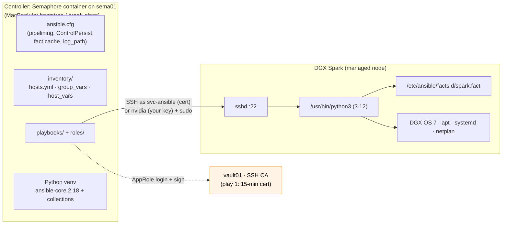
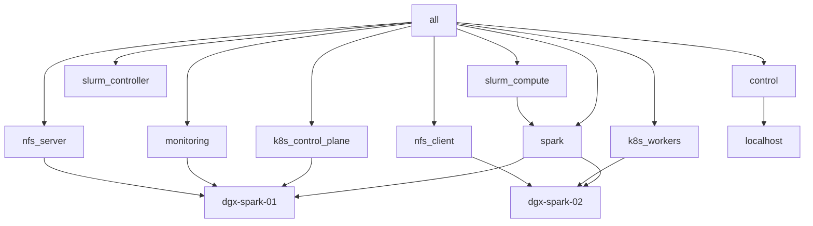

# Volume 01A — Ansible Core on DGX Spark: Controllers, Inventory & First Contact

> **Module 01 · Part I — Foundations** · Lab code: [`lab/`](lab/) · Next: [01B Execution internals & debugging](01-ansible-core-engine-and-execution-internals.md)

| | |
|---|---|
| **You will build** | A reproducible Ansible toolchain on your MacBook (bootstrap and break-glass), an inventory that describes your Spark(s) and how the controller logs in, and the first three playbooks: connectivity, custom GPU facts, OS baseline, run as Semaphore templates |
| **Hardware** | 1× DGX Spark (2× optional), the management plane from [00a](00a-semaphore-vault-lab-guide.md) (`sema01` + `vault01`, outside the Spark) and your MacBook |
| **Time** | 60–90 min |
| **Risk** | Low — read-only until `01-baseline.yml`, which only adds packages/config drop-ins |

---

## 1. Why Ansible on a single desktop box?

A DGX Spark looks like a workstation, but you'll treat it like a data-centre node: it runs DGX OS (Ubuntu 24.04 based, aarch64), a GB10 Grace Blackwell superchip (20 Arm cores + Blackwell GPU sharing **128 GB of coherent unified LPDDR5x memory**), a ConnectX-7 NIC with two 200 Gb/s QSFP cages, and eventually a kubeadm Kubernetes cluster (with two vClusters inside it), Slurm and a monitoring stack. The automation itself lives outside the box: Semaphore on `sema01` runs the playbooks and Vault on `vault01` signs a 15-minute SSH certificate for each run ([00a](00a-semaphore-vault-lab-guide.md), [00b](00b-dgx-spark-semaphore-target.md)). Ansible gives you:

- **Rebuild in minutes after a re-image or a bad DGX OS update.** The playbooks describe the machine, so recovery doesn't depend on remembering what you changed.
- **Moving from one Spark to two (or four) is a one-line inventory change.** You don't have to repeat every manual step on the new node.
- **Drift detection:** `--check --diff` shows what changed behind your back (Volume 22).
- **The same muscle memory you'll use on DGX/HGX clusters.** Only the inventory gets bigger.

---

## 2. Architecture

### 2.1 High-level design (HLD)



Ansible is **agentless**. Nothing runs on the Spark between plays. Each task is a small Python program that is shipped over SSH, run by `/usr/bin/python3`, and returns JSON.

### 2.2 Low-level design (LLD)

| Item | Value in this lab | Why |
|---|---|---|
| Managed-node user | `svc-ansible` with a 15-minute vault01 certificate under Semaphore; `nvidia` (same on every Spark, your own key) for bootstrap and break-glass | `group_vars/spark.yml` switches on `vault_role_id` (Step 2b). NVIDIA's multi-Spark playbooks and MPI assume identical usernames, which both accounts are |
| Privilege | `become: true` via `sudo` (group_vars/spark.yml); NOPASSWD for `svc-ansible`, `-K` for `nvidia` | Everything we configure is root-owned |
| Python on target | `/usr/bin/python3` pinned in `ansible.cfg` | Avoids interpreter discovery warnings; DGX OS ships 3.12 |
| Mgmt network | `enP7s7` 10GbE, `192.168.0.0/24` | Ansible/SSH traffic never rides the CX-7 fabric |
| Fabric | CX-7 `enp1s0f1np1` / `enP2p1s0f1np1`, `192.168.100/101.0/24` | Workload traffic only (NCCL, NFS/RDMA, Multus `net1` for RDMA pods); the Kubernetes API and Cilium VXLAN stay on mgmt |
| Fact cache | `jsonfile` in the state folder `facts/`, 2 h | Ad-hoc runs and drift reports reuse facts |
| Run log | `ansible.log` in the state folder | Free audit trail (Volume 23), next to Semaphore's task history |
| State folder (`lab_cache_dir`) | `/opt/spark-lab/cache` on sema01 (`SPARK_LAB_CACHE`), `lab/.cache` on the MacBook | Semaphore's checkout is temporary; kubeconfigs and reports must survive it (00b §4) |

**Inventory model:** one *hardware* group (`spark`) plus *functional* groups (`k8s_control_plane`, `k8s_workers`, `slurm_compute`, `monitoring`…). A host can belong to several. Roles target functional groups, so moving the monitoring stack to another box is an inventory edit, not a code change. `sema01` and `vault01` are deliberately **not** in the inventory: they are the management plane, built by hand (00a), and no lab playbook configures them.



**Variable precedence you'll actually use** (low → high):
`role defaults` → `inventory group_vars/all` → `group_vars/<group>` → `host_vars/<host>` → play `vars` → `-e extra vars`.
Rule of thumb: **hardware facts in `group_vars/spark.yml`, per-box addressing in `host_vars`, knobs in role `defaults`, one-off overrides with `-e`.**

---

## 3. Hands-on lab

### Step 1 — Build the MacBook toolchain

The lab has two controllers that run the same repository. **Semaphore** on `sema01` runs every playbook from 00b on; its container image (kubectl, helm, Python libraries, collections) comes from [`lab/semaphore/`](lab/semaphore/) and is built in [00b §4](00b-dgx-spark-semaphore-target.md). Your **MacBook** needs its own toolchain for the bootstrap playbooks (`00-bootstrap.yml`, `00b-semaphore-target.yml`), `08-vault.yml`, and break-glass runs:

```bash
# macOS (or any Linux/WSL box) with Python ≥ 3.11
git clone https://github.com/cloudone365/technical-depth.git
cd "technical-depth/01 Ansible/lab"
python3 -m venv ~/.venvs/spark-ansible
source ~/.venvs/spark-ansible/bin/activate
pip install -r requirements.txt
ansible-galaxy collection install -r requirements.yml -p ./collections
ansible --version        # expect: core 2.18.x, config file = .../lab/ansible.cfg
```

> **Why not use the Spark as its own controller?** `99-reset-kubernetes.yml` and a DGX OS re-image delete everything on the box, including a controller running there. Keeping Semaphore and Vault outside, like out-of-band management in a data centre, is what lets the Spark break freely ([00b §1](00b-dgx-spark-semaphore-target.md)).

In Semaphore, `ANSIBLE_CONFIG="01 Ansible/lab/ansible.cfg"` points at the same file, and the environment variables of the Semaphore container (`SPARK_LAB_CACHE`, `ANSIBLE_LOG_PATH`, `ANSIBLE_CACHE_PLUGIN_CONNECTION`) move the run log and fact cache from `./.cache` to the state volume.

```ini
# lab/ansible.cfg
# ansible.cfg — DGX Spark lab control-node configuration
# Every setting here is explained in Volume 01 (core) and Volume 02 (performance).
[defaults]
inventory               = ./inventory
inventory_plugins       = ./inventory_plugins
roles_path              = ./roles
collections_path        = ./collections:~/.ansible/collections
remote_user             = nvidia
forks                   = 10
interpreter_python      = /usr/bin/python3
host_key_checking       = True
retry_files_enabled     = False
stdout_callback         = ansible.builtin.default
callback_result_format  = yaml
callbacks_enabled       = ansible.posix.profile_tasks, ansible.posix.timer
# Fact cache: lets ad-hoc runs and drift reports reuse facts without re-gathering
gathering               = smart
fact_caching            = jsonfile
fact_caching_connection = ./.cache/facts
fact_caching_timeout    = 7200
# Log every run to a file — the cheapest audit trail you will ever build (Volume 23)
log_path                = ./.cache/ansible.log
# Vault password comes from a script so it never sits in plain text (Volume 19)
# vault_password_file   = ./tools/vault-pass.sh
nocows                  = True

[inventory]
enable_plugins          = ansible.builtin.yaml, ansible.builtin.ini, spark_mdns, ansible.builtin.constructed, ansible.builtin.auto

[privilege_escalation]
become                  = False
become_method           = sudo

[ssh_connection]
# ControlPersist keeps one TCP+SSH session per host alive for 10 minutes.
ssh_args                = -o ControlMaster=auto -o ControlPersist=600s -o ServerAliveInterval=30
control_path_dir        = ~/.ansible/cp
# Pipelining removes the "copy module to /tmp then execute" round trips.
# Requires 'Defaults !requiretty' in sudoers (the Ubuntu default).
pipelining              = True

[diff]
always                  = False
context                 = 3
```

### Step 2 — SSH trust

```bash
ssh-keygen -t ed25519 -C "ansible@control"          # if you don't have a key
ssh-copy-id nvidia@192.168.0.100
ssh-copy-id nvidia@192.168.0.101                        # second Spark, if any
ssh nvidia@192.168.0.100 'hostname; uname -m; cat /etc/dgx-release | head -3'
```

Expected: `aarch64` and a `DGX_*` release line. If `/etc/dgx-release` is missing, you're not on DGX OS. The lab still runs, but the version checks in `spark_validate` will warn.

This key is **your** key, for the `nvidia` admin user. It is what the MacBook uses for the bootstrap and break-glass paths. Semaphore never sees it: it logs in as `svc-ansible` with a certificate, after `00b-semaphore-target.yml` has made the Spark trust vault01's CA.

### Step 2b — How the login switches between Semaphore and the MacBook

One variable decides who Ansible logs in as. The Semaphore variable group `vault-approle` defines `vault_role_id`; your MacBook doesn't. `group_vars/spark.yml` (full file in Step 3) turns that into three connection variables:

| Variable | Semaphore (`vault_role_id` defined) | MacBook (not defined) |
|---|---|---|
| `ansible_user` | `svc-ansible` (`vault_ssh_principal`) | `nvidia` (`spark_admin_user`) |
| `ansible_ssh_private_key_file` | `/tmp/lab_ssh/id_ed25519`; ssh picks up `id_ed25519-cert.pub` next to it | empty: your agent / `~/.ssh` key |
| `ansible_ssh_common_args` | `-o StrictHostKeyChecking=accept-new` (the container starts with an empty `known_hosts`; a *changed* key is still refused) | empty: your `known_hosts` |
| sudo | NOPASSWD (`/etc/sudoers.d/90-svc-ansible`) | `-K` |

The key and certificate in `/tmp/lab_ssh` come from **play 1**, `playbooks/00-vault-cert.yml`, which every playbook that SSHes to the Sparks imports first. On the MacBook play 1 is skipped (`when: vault_role_id is defined`), so the same playbook runs as `nvidia`. That is the break-glass path ([00b §10](00b-dgx-spark-semaphore-target.md)). `remote_user = nvidia` in `ansible.cfg` is only the fallback; the inventory variable wins.

**ControlPersist and the 15-minute certificate.** sshd checks a certificate's validity window only when a connection **authenticates**. With `ControlPersist=600s`, Ansible opens one master connection per host and runs every later task through it, so a task that is still running at minute 20 keeps working: its master connection authenticated at minute 1. What fails is a **new** connection after the certificate has expired, for example a master that closed because the host rebooted (`reboot` module in `17-dgxos-upgrade.yml`, `21-emergency-drain.yml -e node_drain_reboot=true`) or because it sat idle for more than 600 s. Two more details:

- `ServerAliveInterval=30` keeps a busy master from being dropped by the network, so long tasks without a reboot are fine.
- A master socket left in the container's `~/.ansible/cp` by the previous task may be reused by the next one for up to 600 s, which is harmless, and every run's play 1 signs a fresh certificate anyway.

So keep long or rebooting Semaphore tasks to one host per task (`--limit`), and if a reconnect after a reboot fails with `Permission denied (publickey)`, simply run the template again: play 1 issues a new certificate. On the MacBook path none of this applies, because your key doesn't expire.

### Step 3 — Describe your hardware (inventory)

Find the real CX-7 interface names **on each Spark** before editing host_vars:

```bash
ssh nvidia@192.168.0.100 ibdev2netdev
# rocep1s0f0 port 1 ==> enp1s0f0np0 (Down)
# rocep1s0f1 port 1 ==> enp1s0f1np1 (Up)       <- cable is in this cage
# roceP2p1s0f0 port 1 ==> enP2p1s0f0np0 (Down)
# roceP2p1s0f1 port 1 ==> enP2p1s0f1np1 (Up)   <- same cage, second PCIe root
```

Each physical QSFP cage shows up as **two** netdevs (`enp1s0f1np1` and `enP2p1s0f1np1`) because the CX-7 is attached through two PCIe roots. Address both to get the full 200 Gb/s.

```yaml
# lab/inventory/hosts.yml
---
# Static inventory for the DGX Spark lab.
#
#   Single-Spark mode: delete dgx-spark-02 (or leave it commented) — every playbook
#   works on one node; 2-node sections are skipped automatically.
#
#   Management network (10GbE RJ-45, enP7s7) : 192.168.0.0/24
#   CX-7 fabric (QSFP, direct cable)          : 192.168.100.0/24 + 192.168.101.0/24
all:
  children:
    # The control node itself, declared explicitly so `--limit localhost` works
    # and it gets a sane Python (implicit localhost can't be targeted by --limit).
    control:
      hosts:
        localhost:
          ansible_connection: local
          ansible_python_interpreter: "{{ ansible_playbook_python }}"
    spark:
      hosts:
        dgx-spark-01:
          ansible_host: 192.168.0.100
        dgx-spark-02:
          ansible_host: 192.168.0.101

    # ---- functional groups (a host can be in several) -------------------
    # Kubernetes (Volume 16): kubeadm control plane on dgx-spark-01. It also runs
    # workloads (no control-plane taint), so a single Spark is a complete cluster.
    k8s_control_plane:
      hosts:
        dgx-spark-01:
    k8s_workers:
      hosts:
        dgx-spark-02:
    slurm_controller:
      hosts:
        dgx-spark-01:
    slurm_compute:
      children:
        spark:
    # vault01 (192.168.0.211) and sema01 (192.168.0.210) are deliberately NOT
    # here: they are the management plane, built by hand with the 00a guide and
    # never configured by these playbooks. Their addresses live in group_vars/all.yml.
    monitoring:
      hosts:
        dgx-spark-01:
    nfs_server:
      hosts:
        dgx-spark-01:
    nfs_client:
      hosts:
        dgx-spark-02:
```

```yaml
# lab/inventory/group_vars/spark.yml
---
# ------------------------------------------------------------------------
# Hardware invariants for every DGX Spark (GB10 Grace Blackwell).
# These are the "golden values" the validate + drift playbooks enforce.
# ------------------------------------------------------------------------
ansible_become: true

# ------------------------------------------------------------------------
# How the controller logs in (00b guide §1).
#   From Semaphore (sema01): the variable group defines vault_role_id, play 1
#     (00-vault-cert.yml) gets a 15-minute certificate from vault01, and every
#     task runs as svc-ansible with NOPASSWD sudo.
#   From your MacBook (bootstrap and break-glass only): no vault_role_id, so the
#     login is your own key as the admin user (add -K for the sudo password).
# ------------------------------------------------------------------------
ansible_user: "{{ vault_ssh_principal if vault_role_id is defined else spark_admin_user }}"
ansible_ssh_private_key_file: "{{ vault_ssh_key_dir ~ '/id_ed25519' if vault_role_id is defined else '' }}"
# The Semaphore container starts with an empty known_hosts: accept a host key the
# first time, refuse a CHANGED key afterwards.
ansible_ssh_common_args: "{{ '-o StrictHostKeyChecking=accept-new' if vault_role_id is defined else '' }}"

spark_expected:
  arch: aarch64
  cpu_cores: 20                  # 10x Cortex-X925 + 10x Cortex-A725
  gpu_name_regex: "GB10"
  cuda_major: 13                 # DGX OS 7.x ships CUDA 13.x
  driver_major_min: 580
  compute_capability: "12.1"     # sm_121 — use this in NVCC_GENCODE
  mem_total_gib_min: 110         # 128 GB LPDDR5x, some reserved by firmware
  os_family: Debian
  os_major: "24"                 # DGX OS 7 is Ubuntu 24.04 based

# Packages every node gets (Volume 06/07)
spark_base_packages:
  - chrony
  - jq
  - htop
  - nvtop
  - tmux
  - ethtool
  - pciutils
  - rdma-core
  - ibverbs-utils
  - infiniband-diags
  - perftest
  - python3-pip
  - python3-venv
  - acl                      # needed for become_user to unprivileged users

# NVIDIA packages we never let a random 'apt upgrade' move (Volume 07)
spark_hold_nvidia_packages: true
spark_nvidia_hold_regex: '^(nvidia-driver-|nvidia-dkms-|nvidia-kernel-|libnvidia-|nvidia-firmware-|cuda-drivers)'

# Kernel / sysctl tuning (Volume 06, 12)
spark_sysctls:
  vm.swappiness: 10
  vm.max_map_count: 1048576          # large mmap'ed model weights
  fs.inotify.max_user_watches: 1048576
  fs.inotify.max_user_instances: 8192 # kubelet + vClusters + many containers
  net.core.rmem_max: 268435456
  net.core.wmem_max: 268435456
  net.ipv4.tcp_rmem: "4096 87380 268435456"
  net.ipv4.tcp_wmem: "4096 65536 268435456"
  net.core.netdev_max_backlog: 250000
  net.ipv4.tcp_mtu_probing: 1
```

```yaml
# lab/inventory/host_vars/dgx-spark-01.yml
---
spark_node_index: 1

# CX-7 fabric. Each physical QSFP port shows up as TWO logical netdevs
# (one per PCIe root: enp1s0f1np1 and enP2p1s0f1np1 are the SAME cage).
# Assign both to get the full 200 Gb/s. Confirm names with `ibdev2netdev`.
cx7_interfaces:
  - name: enp1s0f1np1
    rdma_dev: rocep1s0f1
    address: 192.168.100.11/24
    mtu: 9000
  - name: enP2p1s0f1np1
    rdma_dev: roceP2p1s0f1
    address: 192.168.101.11/24
    mtu: 9000
```

Check that Ansible sees what you meant:

```bash
ansible-inventory --graph
ansible-inventory --host dgx-spark-01 --yaml | head -40     # merged vars for one host
ansible -m debug -a "var=cx7_interfaces" spark           # per-host value
```

### Step 4 — First contact

```yaml
# lab/playbooks/00-ping.yml
---
# Day-0 connectivity: SSH works, sudo works, Python works, it IS a Spark.
- name: Short-lived SSH certificate from vault01 (Semaphore runs only)
  ansible.builtin.import_playbook: 00-vault-cert.yml

- name: Connectivity and identity check
  hosts: spark
  gather_facts: true
  become: true
  tasks:
    - name: Ping (tests SSH + Python, not ICMP)
      ansible.builtin.ping:

    - name: Show what we are talking to
      ansible.builtin.debug:
        msg: >-
          {{ inventory_hostname }} {{ ansible_facts.architecture }}
          {{ ansible_facts.processor_nproc }} cores
          {{ (ansible_facts.memtotal_mb / 1024) | round(1) }} GiB
          {{ ansible_facts.distribution }} {{ ansible_facts.distribution_version }}
          kernel {{ ansible_facts.kernel }}
```

In Semaphore this is the template **`00 Ping`** ([00b §5.6](00b-dgx-spark-semaphore-target.md)): the log shows play 1, *Get an SSH certificate from Vault*, then this play. From the MacBook (bootstrap or break-glass):

```bash
ansible-playbook playbooks/00-ping.yml -l dgx-spark-01,localhost -K     # -K prompts for nvidia's sudo password
```

Expected output (trimmed; your exact numbers and kernel will differ):

```
ok: [dgx-spark-01] => msg: dgx-spark-01 aarch64 20 cores 119.6 GiB Ubuntu 24.04 kernel 6.x-…-nvidia
```

> The reported memory is slightly under 128 GB: firmware and carve-outs take some. The `spark_expected.mem_total_gib_min: 110` guard allows for that.

Ad-hoc commands are how you poke a box without writing a playbook:

```bash
ansible spark -m command -a "nvidia-smi --query-gpu=name,driver_version --format=csv"
ansible spark -m shell   -a "free -g | head -2"
ansible spark -m setup   -a "filter=ansible_processor*"
ansible spark -b -m apt  -a "name=nvtop state=present"        # -b = become
```

### Step 5 — Teach Ansible about the GPU: custom facts

Built-in facts know the CPU and OS but nothing about the GB10, CUDA or the CX-7. A **local fact** is an executable in `/etc/ansible/facts.d/*.fact` that prints JSON. Ansible runs it during fact gathering and exposes the result as `ansible_local.<name>`.

```python
# lab/roles/spark_facts/files/spark.fact
#!/usr/bin/env python3
"""
/etc/ansible/facts.d/spark.fact — Ansible local fact for DGX Spark.

Ansible executes every executable *.fact file during fact gathering and puts
the JSON it prints under ansible_local.<name>. This one exposes GPU, CUDA,
ConnectX-7 and DGX OS state so playbooks can branch on real hardware state
instead of re-running shell commands in every role.

Design rules:
  * never fail — a broken fact script breaks *every* play on the host
  * hard timeout on every subprocess (a wedged GPU makes nvidia-smi hang)
  * report 'error' fields instead of raising
"""
import json
import os
import re
import shutil
import subprocess

TIMEOUT = 8


def run(cmd):
    try:
        out = subprocess.run(cmd, capture_output=True, text=True, timeout=TIMEOUT)
        return out.returncode, out.stdout.strip(), out.stderr.strip()
    except FileNotFoundError:
        return 127, "", "not found"
    except subprocess.TimeoutExpired:
        return 124, "", "timeout"


def gpu():
    info = {"present": False}
    if not shutil.which("nvidia-smi"):
        info["error"] = "nvidia-smi not installed"
        return info
    fields = "name,driver_version,compute_cap,temperature.gpu,power.draw,utilization.gpu,pstate"
    rc, out, err = run(["nvidia-smi", f"--query-gpu={fields}", "--format=csv,noheader,nounits"])
    if rc != 0:
        info["error"] = err or f"nvidia-smi rc={rc}"
        return info
    first = out.splitlines()[0]
    vals = [v.strip() for v in first.split(",")]
    keys = ["name", "driver_version", "compute_cap", "temp_c", "power_w", "util_pct", "pstate"]
    info.update(dict(zip(keys, vals)))
    info["present"] = True
    info["count"] = len(out.splitlines())
    # CUDA version the *driver* supports comes from the nvidia-smi banner
    rc, banner, _ = run(["nvidia-smi"])
    m = re.search(r"CUDA Version:\s*([\d.]+)", banner)
    info["cuda_driver_api"] = m.group(1) if m else None
    return info


def cuda_toolkit():
    nvcc = shutil.which("nvcc") or "/usr/local/cuda/bin/nvcc"
    rc, out, _ = run([nvcc, "--version"])
    m = re.search(r"release ([\d.]+)", out)
    return {"nvcc_path": nvcc if rc == 0 else None, "version": m.group(1) if m else None}


def cx7():
    """Parse `ibdev2netdev` → {netdev: {rdma_dev, state, speed_mbps, mtu}}."""
    ports = {}
    rc, out, err = run(["ibdev2netdev"])
    if rc != 0:
        return {"error": err or "ibdev2netdev unavailable", "ports": ports}
    for line in out.splitlines():
        m = re.match(r"(\S+) port (\d+) ==> (\S+) \((\w+)\)", line)
        if not m:
            continue
        rdma, _port, netdev, state = m.groups()
        entry = {"rdma_dev": rdma, "state": state}
        base = f"/sys/class/net/{netdev}"
        for key, fname in (("speed_mbps", "speed"), ("mtu", "mtu")):
            try:
                with open(f"{base}/{fname}") as fh:
                    entry[key] = int(fh.read().strip())
            except (OSError, ValueError):
                entry[key] = None
        ports[netdev] = entry
    up = [n for n, p in ports.items() if p["state"] == "Up"]
    return {"ports": ports, "up": sorted(up)}


def memory():
    mem = {}
    try:
        with open("/proc/meminfo") as fh:
            for line in fh:
                k, v = line.split(":", 1)
                if k in ("MemTotal", "MemAvailable", "Cached", "SwapTotal", "HugePages_Total"):
                    mem[k] = int(v.split()[0])
    except OSError:
        pass
    gib = lambda kb: round(kb / 1048576, 1)
    return {
        "total_gib": gib(mem.get("MemTotal", 0)),
        "available_gib": gib(mem.get("MemAvailable", 0)),
        "page_cache_gib": gib(mem.get("Cached", 0)),
        "swap_gib": gib(mem.get("SwapTotal", 0)),
        # On a UMA machine the GPU allocates from this same pool:
        "note": "unified memory: GPU allocations consume MemAvailable",
    }


def dgx_release():
    rel = {}
    try:
        with open("/etc/dgx-release") as fh:
            for line in fh:
                if "=" in line:
                    k, v = line.strip().split("=", 1)
                    rel[k] = v.strip('"')
    except OSError:
        return {"present": False}
    rel["present"] = True
    return rel


def container_runtime():
    rc, out, _ = run(["nvidia-ctk", "--version"])
    return {
        "nvidia_ctk": out.splitlines()[0] if rc == 0 and out else None,
        "cdi_spec": os.path.exists("/etc/cdi/nvidia.yaml") or os.path.exists("/var/run/cdi/nvidia.yaml"),
        "docker": shutil.which("docker") is not None,
    }


print(json.dumps({
    "schema": 1,
    "gpu": gpu(),
    "cuda": cuda_toolkit(),
    "cx7": cx7(),
    "memory": memory(),
    "dgx_release": dgx_release(),
    "runtime": container_runtime(),
}))
```

```yaml
# lab/roles/spark_facts/tasks/main.yml
---
# Installs the spark.fact local fact and re-reads facts so that
# ansible_local.spark is available to every role that runs afterwards.
- name: Ensure facts.d directory exists
  ansible.builtin.file:
    path: /etc/ansible/facts.d
    state: directory
    owner: root
    group: root
    mode: "0755"

- name: Install DGX Spark local fact script
  ansible.builtin.copy:
    src: spark.fact
    dest: /etc/ansible/facts.d/spark.fact
    owner: root
    group: root
    mode: "0755"
  register: spark_fact_script

- name: Re-read local facts after install/update
  ansible.builtin.setup:
    filter: ansible_local
  when: spark_fact_script is changed or ansible_local.spark is not defined

- name: Summarise hardware (visible with -v)
  ansible.builtin.debug:
    msg: >-
      {{ inventory_hostname }}:
      GPU={{ ansible_local.spark.gpu.name | default('n/a') }}
      driver={{ ansible_local.spark.gpu.driver_version | default('n/a') }}
      cuda(driver)={{ ansible_local.spark.gpu.cuda_driver_api | default('n/a') }}
      cx7_up={{ ansible_local.spark.cx7.up | default([]) | join(',') }}
      mem={{ ansible_local.spark.memory.total_gib | default('?') }}GiB
    verbosity: 1
```

```bash
ansible-playbook playbooks/01-baseline.yml -K --tags facts -v
ansible spark -m setup -a "filter=ansible_local" | less
```

Expected (excerpt, example values):

```json
"ansible_local": { "spark": {
   "gpu":  {"present": true, "name": "NVIDIA GB10", "driver_version": "580.82.09",
            "compute_cap": "12.1", "cuda_driver_api": "13.0", ...},
   "cx7":  {"up": ["enP2p1s0f1np1", "enp1s0f1np1"], "ports": {...}},
   "memory": {"total_gib": 119.6, "available_gib": 112.3, ...},
   "dgx_release": {"present": true, ...}}}
```

Every later role reads these instead of re-running `nvidia-smi`. A typical use in a play:

```yaml
- name: Only on nodes whose fabric is cabled
  ansible.builtin.include_role: { name: cx7_fabric }
  when: ansible_local.spark.cx7.up | length > 0
```

### Step 6 — OS baseline

The `spark_baseline` role installs the tooling you'll need in every later volume, pins the NVIDIA driver stack against accidental upgrades, and applies sysctl, SSH and time settings.

```yaml
# lab/roles/spark_baseline/tasks/main.yml
---
- name: Assert we are on a supported platform
  ansible.builtin.assert:
    that:
      - ansible_facts.os_family == 'Debian'
      - ansible_facts.distribution_major_version is version('24', '>=')
    fail_msg: "spark_baseline targets DGX OS 7 / Ubuntu 24.04+, got {{ ansible_facts.distribution }} {{ ansible_facts.distribution_version }}"
    quiet: true

- name: Packages
  ansible.builtin.import_tasks: packages.yml
  tags: [baseline, packages]

- name: Users and SSH
  ansible.builtin.import_tasks: users_ssh.yml
  tags: [baseline, ssh]

- name: Kernel and sysctl
  ansible.builtin.import_tasks: kernel.yml
  tags: [baseline, sysctl]

- name: Time and logging
  ansible.builtin.import_tasks: time_logging.yml
  tags: [baseline, time]
```

```yaml
# lab/roles/spark_baseline/tasks/packages.yml
---
- name: Install baseline packages
  ansible.builtin.apt:
    name: "{{ spark_baseline_packages }}"
    state: present
    update_cache: true
    cache_valid_time: 3600
  register: spark_baseline_apt
  retries: 3
  delay: 10
  until: spark_baseline_apt is succeeded   # apt lock held by unattended-upgrades → retry

- name: Gather installed package list
  ansible.builtin.package_facts:
    manager: apt
  when: spark_baseline_hold_nvidia | bool

- name: Compute NVIDIA packages to hold
  ansible.builtin.set_fact:
    spark_baseline_nvidia_pkgs: >-
      {{ ansible_facts.packages.keys()
         | select('match', spark_baseline_hold_regex)
         | list | sort }}
  when: spark_baseline_hold_nvidia | bool

- name: Read current apt holds
  ansible.builtin.command: apt-mark showhold
  register: spark_baseline_holds
  changed_when: false
  check_mode: false        # read-only probe: must also run under --check (drift detection)
  when: spark_baseline_hold_nvidia | bool

- name: Hold NVIDIA driver stack (DGX Dashboard / planned upgrades only)
  ansible.builtin.command: "apt-mark hold {{ item }}"
  loop: "{{ spark_baseline_nvidia_pkgs | difference(spark_baseline_holds.stdout_lines) }}"
  changed_when: true
  when: spark_baseline_hold_nvidia | bool

# `command` tasks are SKIPPED (not "changed") under --check, so without this a
# missing hold would be invisible to drift detection (Volume 22).
- name: Report missing holds as drift in check mode
  ansible.builtin.debug:
    msg: "Would hold: {{ spark_baseline_nvidia_pkgs | difference(spark_baseline_holds.stdout_lines) }}"
  changed_when: true
  when:
    - ansible_check_mode
    - spark_baseline_hold_nvidia | bool
    - spark_baseline_nvidia_pkgs | difference(spark_baseline_holds.stdout_lines) | length > 0
```

In Semaphore: template `01 Baseline` (tick *Dry run* / `--check --diff` for the preview), run it, then run it again. From the MacBook:

```bash
ansible-playbook playbooks/01-baseline.yml -l dgx-spark-01,localhost -K --check --diff   # preview
ansible-playbook playbooks/01-baseline.yml -l dgx-spark-01,localhost -K                  # apply
ansible-playbook playbooks/01-baseline.yml -l dgx-spark-01,localhost -K                  # again → changed=0
```

**The second run must report `changed=0`.** If it doesn't, a task isn't idempotent. Fix it before moving on, or drift detection (Volume 22) will cry wolf forever.

---

## 4. Integrations introduced here

| Integration | How | Used again in |
|---|---|---|
| DGX OS release metadata | `/etc/dgx-release` → `ansible_local.spark.dgx_release` | 07 (upgrade gating), 22 (drift) |
| NVIDIA driver/CUDA | `nvidia-smi` → `ansible_local.spark.gpu` | 08, 17, 25 |
| CX-7 / RDMA | `ibdev2netdev` + sysfs → `ansible_local.spark.cx7` | 11, 12, 15 |
| apt holds | `package_facts` + `apt-mark hold` | 07, 10 |
| DGX Dashboard | untouched; `AllowTcpForwarding yes` keeps SSH tunnels to `localhost:11000` working | 09 |

---

## 5. Production hardening checklist

- [ ] `host_key_checking = True`. Pre-seed `known_hosts` with `ssh-keyscan` rather than turning checking off.
- [ ] Keys only: flip `spark_baseline_ssh_disable_passwords: true` **after** you've confirmed key login works from two places.
- [ ] Put the lab directory in git and never commit `.cache/` (it holds the kubeconfig and the munge key). On sema01 the same applies to the state volume `/opt/spark-lab/cache`: back it up, keep it `0700`.
- [ ] Pin `ansible-core` and collection versions (`requirements.*`). An unpinned `community.general` bump is the most common source of "it worked yesterday".
- [x] Use a dedicated automation user with `NOPASSWD` sudo **only** once Vault-signed SSH certificates are in place: `svc-ansible` + vault01's CA, from `00b-semaphore-target.yml` (Volume 19).

---

## 6. Troubleshooting & diagnostics

| Symptom | Likely cause | Diagnose | Fix |
|---|---|---|---|
| `UNREACHABLE! ... Permission denied (publickey)` | Key not on the Spark, or the wrong user | `ssh -v nvidia@192.168.0.100` | `ssh-copy-id`; check `remote_user` in `ansible.cfg` |
| `Missing sudo password` | MacBook run (`nvidia`) without `-K` | — | Add `-K`; Semaphore runs as `svc-ansible` with NOPASSWD |
| Semaphore: `Permission denied (publickey)` for `svc-ansible` | Spark doesn't trust vault01's CA yet, or the certificate expired before a reconnect (Step 2b) | `sudo journalctl -u ssh \| grep svc-ansible` on the Spark | Run `00b-semaphore-target.yml`; run the template again for a fresh certificate |
| Semaphore run tries to log in as `nvidia` | Template has no variable group, so `vault_role_id` is undefined | Task log: play 1 tasks *skipped* | Attach `vault-approle` to the template (00b §12) |
| `Timeout (12s) waiting for privilege escalation prompt` | sudo is slow because of a DNS lookup of the hostname | `time sudo true` on the Spark | Add the hostname to `/etc/hosts` |
| `/usr/bin/python3: not found` | Minimal image, or a container target | `ansible host -m raw -a 'which python3'` | Bootstrap with the `raw` module (see the Molecule `prepare.yml`) |
| `ansible_local` is empty | Fact file not executable, or it printed non-JSON | `sudo /etc/ansible/facts.d/spark.fact \| jq .` | `chmod 755`; the script must print a single JSON object |
| Fact gathering hangs for ~10 s | `nvidia-smi` blocked on a wedged GPU | `timeout 5 nvidia-smi; echo $?` | The fact script time-boxes itself; go to Volume 24, Runbook A |
| `E: Could not get lock /var/lib/dpkg/lock-frontend` | unattended-upgrades or the DGX Dashboard updater is running | `ps aux \| grep -E 'apt\|dpkg'` | The role retries 3× with a 10 s delay. Otherwise wait for it to finish |
| Second run is not `changed=0` | Non-idempotent task (`command`/`shell` without `changed_when`) | `ansible-playbook ... --diff -v` | Add `creates:`, `changed_when:` or a real module |

A diagnostic sequence worth memorising:

```bash
ansible spark -m ping -vvv 2>&1 | grep -E 'ESTABLISH|EXEC|SSH:'   # is it SSH, sudo or Python?
ansible-config dump --only-changed                                # which config is actually in effect
ansible-inventory --host dgx-spark-02 --yaml                          # which vars will be used
ansible-playbook playbooks/01-baseline.yml --list-tasks --list-tags
ansible-playbook playbooks/01-baseline.yml --start-at-task "Harden sshd (drop-in, validated before reload)" -K
```

---

## 7. Validation

```bash
ansible spark -m command -a "test -x /etc/ansible/facts.d/spark.fact"
ansible spark -m command -a "apt-mark showhold" -b | grep -c nvidia     # > 0
ansible spark -m command -a "sysctl -n vm.max_map_count" -b             # 1048576
ansible spark -m command -a "sshd -T" -b | grep -E 'permitrootlogin|allowtcpforwarding'
```

- [ ] `00-ping.yml` reports aarch64 / 20 cores / Ubuntu 24.04 for every Spark
- [ ] `ansible_local.spark.gpu.present == true` and `compute_cap == "12.1"`
- [ ] `01-baseline.yml` second run: `changed=0`
- [ ] `ansible.log` contains both runs

## 8. Break-it exercises

1. Make the fact script print `hello` before the JSON. What error do you get, and at which task?
2. Remove `pipelining = True` and time `01-baseline.yml` with `profile_tasks`. How many seconds does it add? (Volume 02 explains why.)
3. Hold a non-NVIDIA package by hand (`apt-mark hold jq`). Does the role release it? Should it?
