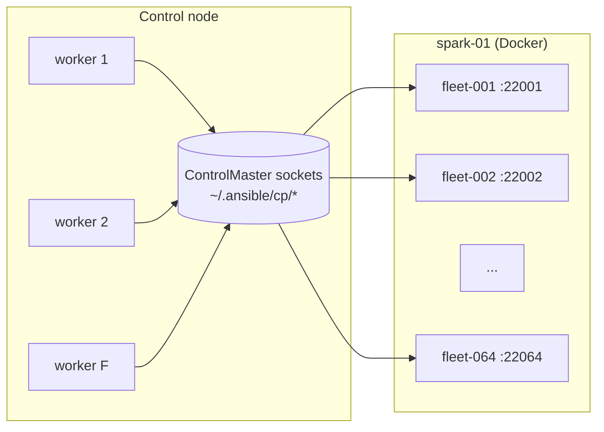

# Volume 02A — Performance at Scale: SSH Multiplexing, Pipelining, Forks & Mitogen (Measured on a Spark)

> **Module 01 · Part I — Foundations** · Prev: [01B Execution internals](01-ansible-core-engine-and-execution-internals.md) · Next: [02B AWX on the Spark](02-ansible-tower-awx-deep-dive.md)

| | |
|---|---|
| **You will build** | A 32–64-node **simulated fleet** (sshd containers) on one DGX Spark, a benchmark playbook, and a tuned `ansible.cfg` backed by your own numbers |
| **Hardware** | 1× DGX Spark (20 cores / 128 GB is plenty for 64 fake nodes) |
| **Time** | 90 min |
| **Risk** | Low. The containers are labelled and removed by the same playbook |

You only own one or two Sparks, but the problems you'll meet on a 256-node DGX cluster (fork exhaustion, SSH storms, fact-gathering minutes) only show up with many hosts. The Spark has enough cores and RAM to fake that fleet.

---

## 1. Where the time goes

For **H hosts**, **T tasks**, **F forks**, and a per-task cost **c**:

```
wall_time ≈ ceil(H / F) × T × c
c = SSH round-trips × RTT + remote Python start (≈50–150 ms on Arm) + module work
```

| Setting | Round-trips per task | Effect on `c` |
|---|---|---|
| No ControlPersist, no pipelining | 5 × (TCP + SSH handshake) | Worst case: each task pays a full SSH handshake several times |
| ControlPersist, no pipelining | 5 × channel open | Removes the handshakes, keeps the `mkdir/put/chmod/exec/rm` dance |
| ControlPersist + pipelining | 1 | Module goes over stdin; nothing is written to disk |
| Mitogen | ~0 per task (persistent interpreter) | Also removes Python start-up; compatibility risk |

Forks only help until something else saturates: the control node's CPU (each fork is a Python process of roughly 50–80 MB), the target's `sshd` `MaxStartups`, or a shared API.



---

## 2. Build the simulated fleet

```dockerfile
# lab/tools/fleet-sim/Dockerfile
# A minimal "fake node": sshd + python3, arm64-native on the Spark.
FROM ubuntu:24.04
RUN apt-get update \
 && DEBIAN_FRONTEND=noninteractive apt-get install -y --no-install-recommends \
      openssh-server python3 sudo iproute2 \
 && rm -rf /var/lib/apt/lists/* \
 && mkdir -p /run/sshd \
 && useradd -m -s /bin/bash nvidia \
 && echo 'nvidia ALL=(ALL) NOPASSWD:ALL' > /etc/sudoers.d/nvidia \
 && sed -i 's/^#\?MaxStartups.*/MaxStartups 200:30:400/' /etc/ssh/sshd_config
COPY authorized_keys /home/nvidia/.ssh/authorized_keys
RUN chown -R nvidia:nvidia /home/nvidia/.ssh && chmod 700 /home/nvidia/.ssh && chmod 600 /home/nvidia/.ssh/authorized_keys
EXPOSE 22
CMD ["/usr/sbin/sshd", "-D", "-e"]
```

```yaml
# lab/playbooks/13-fleet-sim.yml
---
# Spin up N fake nodes (sshd containers) on spark-01 to practise fleet-scale
# tuning — forks, pipelining, ControlPersist, strategies, Mitogen (Volume 02A).
#
#   ansible-playbook playbooks/13-fleet-sim.yml -e fleet_size=64 -K
#   ansible-playbook -i .cache/fleet.ini playbooks/14-fleet-bench.yml -f 50
#   ansible-playbook playbooks/13-fleet-sim.yml -e fleet_state=absent -K
- name: Fake fleet on the Spark
  hosts: spark[0]
  become: true
  vars:
    fleet_size: 32
    fleet_state: present
    fleet_base_port: 22000
    fleet_dir: /opt/fleet-sim
    fleet_cpus: "0.25"            # 64 nodes x 0.25 = 16 of the 20 cores
    fleet_mem: 256m
  tasks:
    - name: Build context
      ansible.builtin.file:
        path: "{{ fleet_dir }}"
        state: directory
        mode: "0755"
      when: fleet_state == 'present'

    - name: Copy Dockerfile
      ansible.builtin.copy:
        src: "{{ playbook_dir }}/../tools/fleet-sim/Dockerfile"
        dest: "{{ fleet_dir }}/Dockerfile"
        mode: "0644"
      when: fleet_state == 'present'

    - name: Authorise the control node's key inside the fake nodes
      ansible.builtin.copy:
        content: "{{ spark_admin_pubkeys | select | join('\n') }}\n"
        dest: "{{ fleet_dir }}/authorized_keys"
        mode: "0644"
      when: fleet_state == 'present'

    - name: Build image (native arm64)
      community.docker.docker_image_build:
        name: fleet-node
        tag: latest
        path: "{{ fleet_dir }}"
        rebuild: always
      when: fleet_state == 'present'

    - name: Fake nodes
      community.docker.docker_container:
        name: "fleet-{{ '%03d' | format(item) }}"
        image: fleet-node:latest
        state: "{{ 'started' if fleet_state == 'present' else 'absent' }}"
        restart_policy: unless-stopped
        cpus: "{{ fleet_cpus }}"
        memory: "{{ fleet_mem }}"
        published_ports: ["{{ fleet_base_port + item }}:22"]
        labels: { spark.lab/fleet-sim: "true" }
      loop: "{{ range(1, fleet_size | int + 1) | list }}"
      loop_control:
        label: "fleet-{{ '%03d' | format(item) }}"

    - name: Write inventory on the control node
      ansible.builtin.copy:
        dest: "{{ playbook_dir }}/../.cache/fleet.ini"
        mode: "0644"
        content: |
          [fleet]
          
          fleet-{{ '%03d' | format(i) }} ansible_host={{ ansible_host }} ansible_port={{ fleet_base_port + i }}
          
          [fleet:vars]
          ansible_user=nvidia
          ansible_python_interpreter=/usr/bin/python3
          ansible_ssh_common_args=-o StrictHostKeyChecking=no -o UserKnownHostsFile=/dev/null
      delegate_to: localhost
      become: false
      when: fleet_state == 'present'
```

```bash
cd "01 Ansible/lab"
ansible-playbook playbooks/13-fleet-sim.yml -e fleet_size=64 -K
ansible -i .cache/fleet.ini fleet -m ping -f 64 -o | sort | head -3
```

The benchmark workload (facts plus ten `copy` tasks, a typical baseline shape):

```yaml
# lab/playbooks/14-fleet-bench.yml
---
# A representative workload: facts + 10 small idempotent tasks.
# Compare wall time across forks / pipelining / strategy / Mitogen settings.
- name: Fleet benchmark
  hosts: fleet
  gather_facts: true
  become: true
  tasks:
    - name: Ten config-file tasks (typical of a baseline role)
      ansible.builtin.copy:
        dest: "/etc/bench-{{ item }}.conf"
        content: "setting_{{ item }} = {{ inventory_hostname }}\n"
        mode: "0644"
      loop: "{{ range(10) | list }}"
    - name: One package-manager style query
      ansible.builtin.command: dpkg -s python3
      changed_when: false
```

---

## 3. Run the experiment matrix

Keep everything identical except one variable per run. `ANSIBLE_CALLBACKS_ENABLED=ansible.posix.timer` prints the wall time.

```bash
bench() {  # usage: bench <label> [env...]
  label=$1; shift
  rm -rf ~/.ansible/cp/*   # cold mux sockets each run
  t=$( env "$@" ANSIBLE_CALLBACKS_ENABLED=ansible.posix.timer \
       ansible-playbook -i .cache/fleet.ini playbooks/14-fleet-bench.yml 2>&1 \
       | awk '/Playbook run took/{print $(NF-3)*60+$(NF-1)}' )
  echo "$label,$t" | tee -a .cache/bench.csv
}
bench baseline-f5           ANSIBLE_FORKS=5  ANSIBLE_PIPELINING=0 ANSIBLE_SSH_ARGS="-o ControlMaster=no"
bench mux-f5                ANSIBLE_FORKS=5  ANSIBLE_PIPELINING=0
bench mux-pipe-f5           ANSIBLE_FORKS=5
bench mux-pipe-f20          ANSIBLE_FORKS=20
bench mux-pipe-f64          ANSIBLE_FORKS=64
bench mux-pipe-f64-free     ANSIBLE_FORKS=64 ANSIBLE_STRATEGY=free
bench mux-pipe-f64-nofacts  ANSIBLE_FORKS=64 ANSIBLE_GATHERING=explicit
```

Record your results in a table like this. The shape is what matters; absolute numbers depend on your control node:

| Run | Expect relative to baseline | What you're seeing |
|---|---|---|
| `mux-f5` | noticeably faster | SSH handshakes amortised |
| `mux-pipe-f5` | faster again | 5 round-trips → 1 |
| `mux-pipe-f20` | ~3–4× faster than f5 | parallelism, until the control-node CPU saturates |
| `mux-pipe-f64` | small gain or worse | contention: control-node CPU, container CPU quota (0.25 core each) |
| `-free` | small gain | hosts don't wait for the slowest one on each task |
| `-nofacts` | big gain for short plays | `setup` is often the most expensive task |

Watch the saturation point live while `f64` runs:

```bash
# control node
top -o %CPU     # ansible-playbook workers
# on the Spark
docker stats --no-stream | sort -k3 -h | tail
journalctl -u ssh --since "-5min" | grep -c 'beginning MaxStartups throttling'
```

---

## 4. Tuning levers, in order of payoff

### 4.1 SSH multiplexing and pipelining (already on in `lab/ansible.cfg`)

```ini
[ssh_connection]
ssh_args         = -o ControlMaster=auto -o ControlPersist=600s -o ServerAliveInterval=30
control_path_dir = ~/.ansible/cp
pipelining       = True
```

Pipelining requires that sudo does not demand a TTY (Ubuntu's default is fine). If a hardened image sets `Defaults requiretty`, override it for the automation user:

```
# /etc/sudoers.d/ansible
Defaults:nvidia !requiretty
```

### 4.2 Facts: gather less, cache more

```ini
[defaults]
gathering               = smart            # gather once per host per cache lifetime
fact_caching            = jsonfile         # or redis for AWX / many control nodes
fact_caching_connection = ./.cache/facts
fact_caching_timeout    = 7200
```

```yaml
- hosts: spark
  gather_facts: true
  module_defaults:
    ansible.builtin.setup:
      gather_subset: [min, hardware, network, local]   # skip 'all' (virtual, ohai/facter probes, …)
```

### 4.3 Forks: size to the control node, not the fleet

A reasonable starting point is `forks ≈ 2–4 × control-node cores`, capped by memory at roughly 80 MB per fork. Then measure. For a laptop controlling two Sparks, `forks = 10` is plenty. For AWX controlling a 256-node cluster, scale out with execution nodes (Volume 20) rather than setting `forks = 256` on one pod.

### 4.4 Target-side limits

| Limit | Default | Symptom when hit | Fix |
|---|---|---|---|
| `sshd MaxStartups` | `10:30:100` | Random `Connection reset by peer` under high forks | `MaxStartups 30:30:100` (set by `spark_baseline`) |
| `MaxSessions` | 10 | `channel N: open failed` with ControlPersist | Raise, or reduce parallel tasks per host |
| systemd `TasksMax` for user slices | varies | `fork: Resource temporarily unavailable` | `UserTasksMax` / slice limits |

### 4.5 Mitogen, with eyes open

Mitogen replaces per-task SSH and Python start-up with a persistent interpreter tree and can be several times faster on task-heavy plays. The trade-offs:

- It **lags ansible-core releases**. Check the Mitogen changelog for your exact `ansible-core` version before upgrading either one.
- Some modules and connection plugins behave differently under it (become edge cases, `async`, `raw`).
- It isn't supported inside AWX execution environments by Red Hat.

```bash
pip install mitogen
ANSIBLE_STRATEGY_PLUGINS=$(python -c 'import ansible_mitogen,os;print(os.path.dirname(ansible_mitogen.__file__)+"/plugins/strategy")') \
ANSIBLE_STRATEGY=mitogen_linear \
  ansible-playbook -i .cache/fleet.ini playbooks/14-fleet-bench.yml -f 20
```

Add it as another row in your benchmark. **Adopt it only if** (a) it's a large win on *your* playbooks and (b) `molecule test` and `20-drift-check.yml` pass unchanged under it.

---

## 5. Integrations

| Where the tuning matters | Setting |
|---|---|
| AWX job templates (Volume 20) | `forks` per template; container groups scale horizontally |
| Drift checks every 30 min (Volume 22) | fact cache + `gather_subset` keep them cheap |
| Emergency drain (Volume 24) | `serial: 1` makes speed deliberately irrelevant; correctness first |
| NCCL build (`10-nccl-test.yml`) | `async` + `strategy: free` on 2+ nodes |

## 6. Troubleshooting & diagnostics

| Symptom | Diagnose | Fix |
|---|---|---|
| `Control socket connect(...): No such file or directory` / stale socket | `ls -la ~/.ansible/cp/` | `rm ~/.ansible/cp/*`; very long hostnames can overflow the 108-char socket path, so shorten `control_path_dir` |
| Fleet hosts randomly `UNREACHABLE` at high forks | `journalctl -u ssh \| grep MaxStartups` inside a container, or on the host | Raise `MaxStartups`; lower forks |
| Control node swaps during a run | `free -m` during the run | Fewer forks; or run from a bigger box (the Spark itself) |
| Pipelining silently not used | `-vvvv` shows `PUT` lines | A `become` method or plugin that disables it; `Defaults requiretty` |
| Mitogen: `ansible_mitogen ... unsupported Ansible version` | `pip show mitogen ansible-core` | Pin to a compatible pair, or drop Mitogen |
| Runs slow only when the first task is `setup` | `profile_tasks` output | `gather_subset`, `gathering=smart`, fact cache |

## 7. Clean up and validate

```bash
ansible-playbook playbooks/13-fleet-sim.yml -e fleet_state=absent -e fleet_size=64 -K
docker ps --filter label=spark.lab/fleet-sim=true -q | wc -l     # 0
```

- [ ] `.cache/bench.csv` has at least 7 rows and you can explain each delta.
- [ ] You identified your control node's fork saturation point.
- [ ] Your final `ansible.cfg` values are justified by your numbers, not by folklore.
