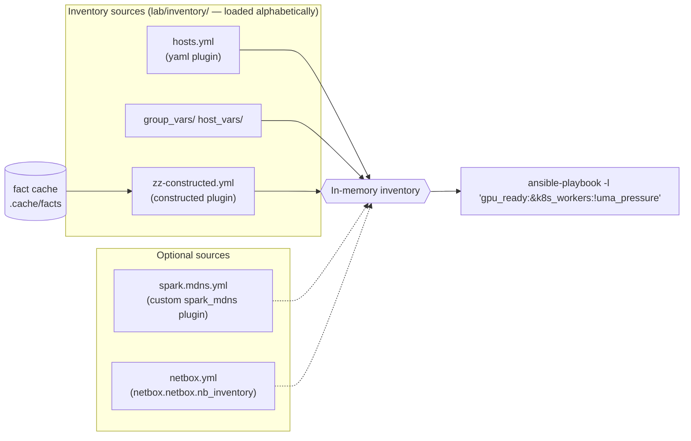

# Volume 03A — Inventory Architecture: Static, Constructed, mDNS Discovery & NetBox as Source of Truth

> **Module 01 · Part I — Foundations** · Prev: [02B AWX](02-ansible-tower-awx-deep-dive.md) · Next: [03B Vault server](03-hashicorp-vault-deep-dive.md)

| | |
|---|---|
| **You will build** | A layered inventory: a static YAML baseline, **fact-driven groups** (`gpu_ready`, `driver_580`, `uma_pressure`), a **custom mDNS inventory plugin** that finds Sparks on the LAN, and NetBox as an optional source of truth |
| **Hardware** | 1–2× DGX Spark; the control node on the same LAN for mDNS |
| **Time** | 90 min |
| **Risk** | None. Inventory is read-only |

---

## 1. Why inventory design matters more than playbooks

On a real GPU cluster, most outages traced back to automation come down to *targeting*: a playbook ran against the wrong nodes, or against nodes in the wrong state. Examples include a driver upgrade hitting a node mid-job, or a fabric change reaching both ends of a link at once. Good inventory makes the right target set the easy one:

| Question | Answered by |
|---|---|
| *What hardware exists?* | static `spark` group, or NetBox |
| *What does each box do?* | functional groups (`k8s_control_plane`, `k8s_workers`, `slurm_compute`, …) |
| *What state is it in right now?* | **constructed** groups from facts (`gpu_ready`, `uma_pressure`, `driver_580`) |
| *What's on the network that I didn't write down?* | discovery (mDNS plugin) |

## 2. Architecture



**LLD — the files in the lab:**

| File | Plugin | Purpose |
|---|---|---|
| `inventory/hosts.yml` | `ansible.builtin.yaml` | Hardware + functional groups (Volume 01A) |
| `inventory/group_vars/*.yml`, `host_vars/*.yml` | vars plugin | Golden values and per-node addressing |
| `inventory/zz-constructed.yml` | `ansible.builtin.constructed` | Groups computed from facts in the cache. The `zz-` prefix makes it load last |
| `inventory_plugins/spark_mdns.py` | custom | Discovers `_ssh._tcp` Sparks via Avahi |
| `inventory-examples/spark.mdns.yml` | → `spark_mdns` | Config for the plugin (kept out of `inventory/` so it's opt-in) |

`ansible.cfg` points `inventory = ./inventory` (a **directory**, so every file in it is a source) and enables the custom plugin:

```ini
[defaults]
inventory         = ./inventory
inventory_plugins = ./inventory_plugins
[inventory]
enable_plugins = ansible.builtin.yaml, ansible.builtin.ini, spark_mdns, ansible.builtin.constructed, ansible.builtin.auto
```

---

## 3. Hands-on

### 3.1 Fact-driven groups with `constructed`

```yaml
# lab/inventory/zz-constructed.yml
---
# Loaded after hosts.yml (alphabetical). Builds groups from *facts* — including
# the custom ansible_local.spark facts — read from the fact cache.
# Run any play with facts once (e.g. 00-ping.yml) to populate the cache.
plugin: ansible.builtin.constructed
strict: false
groups:
  gpu_ready: ansible_local.spark.gpu.present | default(false)
  fabric_cabled: (ansible_local.spark.cx7.up | default([])) | length > 0
  uma_pressure: (ansible_local.spark.memory.available_gib | default(999)) < 16
keyed_groups:
  - prefix: driver
    key: (ansible_local.spark.gpu.driver_version | default('unknown')).split('.')[0]
  - prefix: cuda
    key: (ansible_local.spark.gpu.cuda_driver_api | default('unknown')) | replace('.', '_')
  - prefix: arch
    key: ansible_architecture | default('unknown')
```

```bash
cd "01 Ansible/lab"
ansible-playbook playbooks/00-ping.yml -K        # populates .cache/facts/*
ansible-playbook playbooks/01-baseline.yml -K --tags facts   # adds ansible_local.spark
ansible-inventory --graph
```

Output (example):

```
  |--@gpu_ready:        |--spark-01 |--spark-02
  |--@fabric_cabled:    |--spark-01 |--spark-02
  |--@driver_580:       |--spark-01 |--spark-02
  |--@cuda_13_0:        |--spark-01 |--spark-02
  |--@arch_aarch64:     |--spark-01 |--spark-02
```

Now **target by state** with inventory patterns:

```bash
# only healthy GPU nodes that are Kubernetes workers and NOT under memory pressure
# (30-validate targets the Sparks themselves; 05/06/06b run from localhost against the API)
ansible-playbook playbooks/30-validate.yml -l 'gpu_ready:&k8s_workers:!uma_pressure'
# every node still on an old driver major
ansible 'driver_570' -m debug -a msg="needs upgrade"
# one node at a time from a group
ansible-playbook playbooks/21-emergency-drain.yml -l 'slurm_compute[1]'
```

| Pattern | Meaning |
|---|---|
| `a:b` | union |
| `a:&b` | intersection |
| `a:!b` | exclusion |
| `group[0]`, `group[0:2]` | index / slice |
| `~spark-0[12]` | regex |

> **Stale facts = wrong groups.** Constructed groups are only as fresh as the cache (`fact_caching_timeout = 7200`). For safety-critical targeting (drain, upgrade), refresh first: `ansible spark -m setup -a filter=ansible_local`.

### 3.2 Discovery: a custom mDNS inventory plugin

DGX OS advertises SSH over mDNS, which is how NVIDIA's `discover-sparks` script finds peers (`avahi-browse -p -r -t _ssh._tcp`). The same mechanism can feed Ansible:

```python
# lab/inventory_plugins/spark_mdns.py
# -*- coding: utf-8 -*-
# Inventory plugin: discover DGX Sparks on the local LAN via mDNS (_ssh._tcp),
# the same mechanism NVIDIA's `discover-sparks` script uses.
from __future__ import annotations

DOCUMENTATION = r"""
name: spark_mdns
short_description: Discover DGX Spark systems via Avahi/mDNS
description:
  - Runs C(avahi-browse -p -r -t _ssh._tcp) on the control node (or reads a saved
    capture) and adds every host whose mDNS name matches O(name_regex).
  - Hosts land in group O(group) with C(ansible_host) set to the discovered IPv4.
options:
  plugin:
    description: Must be C(spark_mdns).
    required: true
    choices: [spark_mdns]
  name_regex:
    description: Regex applied to the mDNS host name (without .local).
    type: str
    default: '^(spark|dgx-spark|spark-)[-\w]*$'
  group:
    description: Group to put discovered hosts in.
    type: str
    default: spark
  interface:
    description: Only accept answers seen on this control-node interface (e.g. the mgmt NIC).
    type: str
  from_file:
    description: Parse this saved avahi-browse -p output instead of running avahi-browse (testing/CI).
    type: path
  timeout:
    description: Seconds to wait for avahi-browse.
    type: int
    default: 10
extends_documentation_fragment:
  - constructed
"""

EXAMPLES = r"""
# inventory/spark.mdns.yml
plugin: spark_mdns
name_regex: '^spark-\d+$'
interface: enp0s31f6
keyed_groups:
  - key: mdns_interface
    prefix: seen_on
"""

import re
import subprocess

from ansible.errors import AnsibleParserError
from ansible.plugins.inventory import BaseInventoryPlugin, Constructable


class InventoryModule(BaseInventoryPlugin, Constructable):
    NAME = "spark_mdns"

    def verify_file(self, path):
        return super().verify_file(path) and path.endswith(("spark.mdns.yml", "spark.mdns.yaml"))

    def _capture(self):
        src = self.get_option("from_file")
        if src:
            with open(src) as fh:
                return fh.read()
        try:
            out = subprocess.run(
                ["avahi-browse", "-p", "-r", "-t", "_ssh._tcp"],
                capture_output=True, text=True, timeout=self.get_option("timeout"),
            )
        except FileNotFoundError as e:
            raise AnsibleParserError("avahi-browse not found: apt install avahi-utils") from e
        except subprocess.TimeoutExpired as e:
            raise AnsibleParserError("avahi-browse timed out") from e
        return out.stdout

    def parse(self, inventory, loader, path, cache=True):
        super().parse(inventory, loader, path, cache)
        self._read_config_data(path)
        name_re = re.compile(self.get_option("name_regex"))
        want_if = self.get_option("interface")
        group = self.inventory.add_group(self.get_option("group"))

        # '=;iface;IPv4;service name;_ssh._tcp;local;host.local;192.168.0.100;22;"txt"'
        for line in self._capture().splitlines():
            f = line.split(";")
            if len(f) < 9 or f[0] != "=" or f[2] != "IPv4":
                continue
            iface, host_fqdn, addr, port = f[1], f[6], f[7], f[8]
            host = host_fqdn.removesuffix(".local")
            if not name_re.search(host) or (want_if and iface != want_if):
                continue
            self.inventory.add_host(host, group=group)
            self.inventory.set_variable(host, "ansible_host", addr)
            self.inventory.set_variable(host, "ansible_port", int(port))
            self.inventory.set_variable(host, "mdns_interface", iface)
            strict = self.get_option("strict")
            hv = self.inventory.get_host(host).get_vars()
            self._set_composite_vars(self.get_option("compose"), hv, host, strict=strict)
            self._add_host_to_composed_groups(self.get_option("groups"), hv, host, strict=strict)
            self._add_host_to_keyed_groups(self.get_option("keyed_groups"), hv, host, strict=strict)
```

```yaml
# lab/inventory-examples/spark.mdns.yml
---
# ansible-inventory -i inventory-examples/spark.mdns.yml --graph
# Requires: avahi-utils on the control node, control node on the Sparks' LAN.
plugin: spark_mdns
name_regex: '^spark-\d+$'
# interface: enp0s31f6          # your control node's LAN NIC
compose:
  ansible_user: "'nvidia'"
keyed_groups:
  - key: mdns_interface
    prefix: seen_on
```

```bash
sudo apt install avahi-utils                         # control node
avahi-browse -p -r -t _ssh._tcp | grep '^='          # raw view
ansible-inventory -i inventory-examples/spark.mdns.yml --graph
ansible-inventory -i inventory -i inventory-examples/spark.mdns.yml --graph   # merged with static
```

The plugin accepts `from_file:` so you can unit-test it against a saved capture without any Sparks on the network. That's how it was validated for this lab:

```text
=;enp0s31f6;IPv4;spark-01;_ssh._tcp;local;spark-01.local;192.168.0.100;22;
=;enp0s31f6;IPv4;spark-02;_ssh._tcp;local;spark-02.local;192.168.0.101;22;
=;enp0s31f6;IPv4;nas;_ssh._tcp;local;nas.local;192.168.0.200;22;          <- filtered by name_regex
=;wlp2s0;IPv4;spark-01;_ssh._tcp;local;spark-01.local;192.168.1.77;22;   <- filtered by interface
```

**Discovery vs. source of truth.** Use discovery to *find* what's there, and compare it against what *should* be there:

```bash
comm -3 <(ansible-inventory -i inventory --list | jq -r '.spark.hosts[]' | sort) \
        <(ansible-inventory -i inventory-examples/spark.mdns.yml --list | jq -r '.spark.hosts[]' | sort)
# column 1 = declared but not seen (down?), column 2 = seen but not declared (rogue/new)
```

### 3.3 NetBox as source of truth (optional, runs on the Spark)

```bash
git clone -b release https://github.com/netbox-community/netbox-docker.git ~/netbox-docker
cd ~/netbox-docker
cat > docker-compose.override.yml <<'EOF'
services:
  netbox:
    ports: ["8081:8080"]
EOF
docker compose pull && docker compose up -d        # images are multi-arch; first boot runs migrations
docker compose exec netbox /opt/netbox/netbox/manage.py createsuperuser
```

Seed NetBox from your inventory, so the model describes the Spark precisely:

```yaml
# playbooks/netbox-seed.yml  (ansible-galaxy collection install netbox.netbox; pip install pynetbox)
- name: Model the lab in NetBox
  hosts: spark
  gather_facts: false
  connection: local
  vars:
    nb: { url: "http://192.168.0.100:8081", token: "{{ lookup('env', 'NETBOX_TOKEN') }}" }
  tasks:
    - name: Manufacturer / device type / role / site (run once)
      run_once: true
      block:
        - netbox.netbox.netbox_manufacturer: { netbox_url: "{{ nb.url }}", netbox_token: "{{ nb.token }}", data: { name: NVIDIA } }
        - netbox.netbox.netbox_device_type:
            netbox_url: "{{ nb.url }}"
            netbox_token: "{{ nb.token }}"
            data: { model: DGX Spark, manufacturer: NVIDIA, u_height: 0 }
        - netbox.netbox.netbox_device_role: { netbox_url: "{{ nb.url }}", netbox_token: "{{ nb.token }}", data: { name: gpu-node, color: 76b900 } }
        - netbox.netbox.netbox_site: { netbox_url: "{{ nb.url }}", netbox_token: "{{ nb.token }}", data: { name: home-lab } }
    - name: Device
      netbox.netbox.netbox_device:
        netbox_url: "{{ nb.url }}"
        netbox_token: "{{ nb.token }}"
        data:
          name: "{{ inventory_hostname }}"
          device_type: DGX Spark
          role: gpu-node
          site: home-lab
          custom_fields: {}
          tags: ["{{ 'k8s-control-plane' if inventory_hostname in groups['k8s_control_plane'] else 'k8s-worker' }}"]
    - name: CX-7 interfaces + IPs
      netbox.netbox.netbox_interface:
        netbox_url: "{{ nb.url }}"
        netbox_token: "{{ nb.token }}"
        data: { device: "{{ inventory_hostname }}", name: "{{ item.name }}", type: 200gbase-x-qsfp56, mtu: "{{ item.mtu }}" }
      loop: "{{ cx7_interfaces }}"
    - name: Fabric addresses
      netbox.netbox.netbox_ip_address:
        netbox_url: "{{ nb.url }}"
        netbox_token: "{{ nb.token }}"
        data:
          address: "{{ item.address }}"
          assigned_object: { device: "{{ inventory_hostname }}", name: "{{ item.name }}" }
      loop: "{{ cx7_interfaces }}"
```

Then read it back as inventory:

```yaml
# inventory-examples/netbox.yml
plugin: netbox.netbox.nb_inventory
api_endpoint: http://192.168.0.100:8081
validate_certs: false
config_context: true
group_by: [device_roles, sites, tags]
compose:
  ansible_host: primary_ip4.address | default('') | ansible.utils.ipaddr('address')
```

```bash
NETBOX_TOKEN=... ansible-inventory -i inventory-examples/netbox.yml --graph
```

**Source-of-truth rules for a real cluster:** NetBox (or your CMDB) owns *what exists and how it's cabled*. Ansible `group_vars` own *how it's configured*. Facts own *what state it's in*. Never let two of these define the same thing.

---

## 4. Integrations

| Consumer | Uses |
|---|---|
| AWX (Volume 02B/20) | Inventory source "Sourced from a Project" → `lab/inventory/`; NetBox has a native source type |
| Drift (Volume 22) | `-l gpu_ready` keeps drift checks off nodes that are already known-bad |
| Drain (Volume 24) | `-l uma_pressure` finds nodes to relieve first |
| Slurm / `kubeadm_cluster` roles | functional groups decide who's controller / control plane vs worker (`k8s_control_plane` runs `kubeadm init`, `k8s_workers` run `kubeadm join`) |

## 5. Troubleshooting & diagnostics

| Symptom | Diagnose | Fix |
|---|---|---|
| `[WARNING]: Unable to parse ... as an inventory source` | `ansible-inventory -i <file> --list -vvv` | For custom plugins the file name must pass `verify_file` (`spark.mdns.yml`), and the plugin must be in `enable_plugins` |
| Constructed groups empty | `ls .cache/facts/`; `jq .ansible_local .cache/facts/spark-01` | Gather facts first; check `fact_caching_timeout`; `strict: false` hides errors, so set `strict: true` temporarily |
| Host appears twice with different names (IP vs name) | `ansible-inventory --list \| jq '._meta.hostvars \| keys'` | Keep one naming source. Use `compose: ansible_host` rather than naming hosts by IP |
| mDNS finds nothing | `avahi-browse -a -t` on the control node | Different L2 segment, or multicast filtered (Wi-Fi APs, VLANs); `systemctl status avahi-daemon` on the Spark |
| Variables from `group_vars/spark.yml` missing for mDNS hosts | `ansible-inventory --host spark-01` | group_vars load relative to the inventory *source*. Pass both `-i inventory -i inventory-examples/...` so the directory's group_vars apply |
| NetBox plugin: `ansible.utils.ipaddr` not found | — | `ansible-galaxy collection install ansible.utils`; `pip install netaddr` |

## 6. Validation

- [ ] `ansible-inventory --graph` shows functional, constructed and hardware groups.
- [ ] You targeted a playbook with an intersection plus exclusion pattern and confirmed the host list with `--list-hosts`.
- [ ] `spark_mdns` finds your Spark(s), and the declared-vs-seen `comm` diff is empty.
- [ ] (Optional) NetBox shows both Sparks with CX-7 interfaces and fabric IPs.
