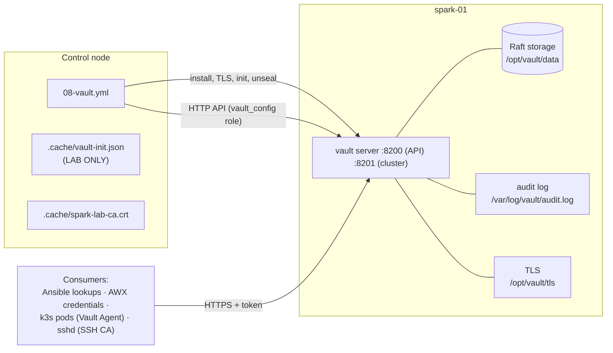
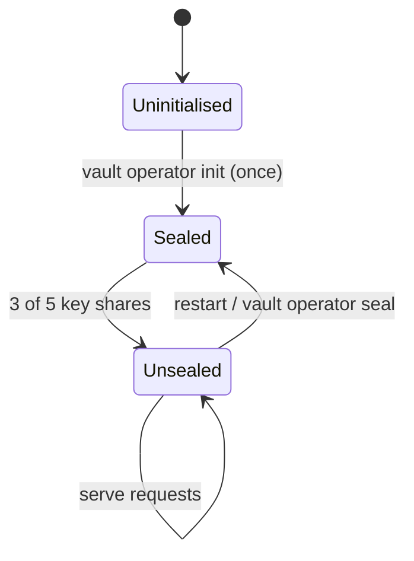

# Volume 03B — HashiCorp Vault on the Spark: Raft Storage, TLS, Init/Unseal, Audit & Backup

> **Module 01 · Part I — Foundations** · Prev: [03A Inventory](03-dynamic-inventory-and-cloud-infrastructure.md) · Next: [04 Jinja2 & data transforms](04-advanced-jinja2-filters-and-data-transforms.md) · Ansible integration: [Volume 19](19-hashicorp-vault-approle-and-dynamic-secrets.md)

| | |
|---|---|
| **You will build** | A single-node Vault on spark-01 (integrated Raft storage, TLS from a lab CA, audit log, snapshots), deployed and configured entirely by Ansible |
| **Hardware** | 1× DGX Spark |
| **Time** | 90 min |
| **Risk** | Medium. **Losing the unseal keys means losing every secret.** Read §5 before running |

The lab needs secrets for NGC API keys, the Grafana admin password, the AWX credentials, SSH signing and the k3s join token. Vault gives you one audited place to keep them, short-lived credentials, and an API that Ansible, AWX and pods can all use.

---

## 1. Architecture

### 1.1 HLD



### 1.2 LLD

| Item | Value | Notes |
|---|---|---|
| Package | `vault` from `apt.releases.hashicorp.com` (arm64) | Version pinned with an apt wildcard (`1.20.*`) |
| Config | `/etc/vault.d/vault.hcl` | Rendered by `vault_server` |
| Storage | Integrated Raft, `/opt/vault/data` | No Consul needed; add nodes later with `retry_join` |
| Listener | `0.0.0.0:8200`, TLS ≥ 1.2 | Cert SANs: hostname, FQDN, mgmt IP, 127.0.0.1 |
| Cluster port | 8201 | Raft and request forwarding between nodes |
| TLS | Lab CA (ECDSA P-384) → server cert (P-256, 825 days) | CA added to the system trust store and fetched to the control node |
| Seal | Shamir, 5 shares, threshold 3 | Production: auto-unseal (transit, KMS or HSM) |
| Audit | `file` device → `/var/log/vault/audit.log` | Every request is logged with HMAC'd secrets |
| Telemetry | Prometheus format at `/v1/sys/metrics?format=prometheus` | Scraped in Volume 09 |

### 1.3 Seal/unseal, briefly and practically

Vault encrypts everything with a **data key**. That key is itself encrypted with the **root key**, which only exists in memory after an unseal. With Shamir sealing the root key is split into 5 shares, and any 3 reconstruct it. After **every restart Vault comes up sealed** and serves nothing until it's unsealed. That's why the role's restart handler is followed by unseal tasks, and why production uses auto-unseal.



---

## 2. The role

```yaml
# lab/roles/vault_server/defaults/main.yml
---
vault_server_version: "1.20.*"             # apt pin pattern; HashiCorp publishes arm64 debs
vault_server_addr: "https://{{ ansible_host }}:8200"
vault_server_data_dir: /opt/vault/data
vault_server_tls_dir: /opt/vault/tls
vault_server_node_id: "{{ inventory_hostname }}"
vault_server_ui: true

# LAB ONLY: init output (unseal keys + root token) is written to the control node.
# In production: PGP-encrypt shares (-pgp-keys) or use auto-unseal (transit/KMS/HSM).
vault_server_init_file: "{{ playbook_dir }}/../.cache/vault-init.json"
vault_server_key_shares: 5
vault_server_key_threshold: 3
```

```jinja
# lab/roles/vault_server/templates/vault.hcl.j2
# {{ ansible_managed }}
ui            = {{ vault_server_ui | lower }}
cluster_name  = "{{ lab_name | default('spark-lab') }}"
api_addr      = "{{ vault_server_addr }}"
cluster_addr  = "https://{{ ansible_host }}:8201"
disable_mlock = true   # required with integrated storage (raft) — see docs

storage "raft" {
  path    = "{{ vault_server_data_dir }}"
  node_id = "{{ vault_server_node_id }}"
}

listener "tcp" {
  address         = "0.0.0.0:8200"
  cluster_address = "0.0.0.0:8201"
  tls_cert_file   = "{{ vault_server_tls_dir }}/vault.crt"
  tls_key_file    = "{{ vault_server_tls_dir }}/vault.key"
  tls_min_version = "tls12"
}

telemetry {
  prometheus_retention_time = "24h"
  disable_hostname          = true
}
```

```yaml
# lab/roles/vault_server/tasks/main.yml
---
# ------------------------------------------------------------ install
- name: HashiCorp apt key
  ansible.builtin.get_url:
    url: https://apt.releases.hashicorp.com/gpg
    dest: /usr/share/keyrings/hashicorp-archive-keyring.asc
    mode: "0644"

- name: HashiCorp apt repo
  ansible.builtin.apt_repository:
    repo: >-
      deb [arch=arm64 signed-by=/usr/share/keyrings/hashicorp-archive-keyring.asc]
      https://apt.releases.hashicorp.com {{ ansible_facts.distribution_release }} main
    filename: hashicorp
    state: present

- name: Install Vault
  ansible.builtin.apt:
    name: "vault={{ vault_server_version }}"
    state: present
    update_cache: true

# ------------------------------------------------------------ TLS (self-signed CA for the lab)
- name: TLS directory
  ansible.builtin.file:
    path: "{{ vault_server_tls_dir }}"
    state: directory
    owner: vault
    group: vault
    mode: "0750"

- name: CA key
  community.crypto.openssl_privatekey:
    path: "{{ vault_server_tls_dir }}/ca.key"
    type: ECC
    curve: secp384r1
    owner: vault
    mode: "0600"

- name: CA CSR
  community.crypto.openssl_csr_pipe:
    privatekey_path: "{{ vault_server_tls_dir }}/ca.key"
    common_name: "{{ lab_name | default('spark-lab') }} Lab CA"
    basic_constraints: ["CA:TRUE"]
    basic_constraints_critical: true
    key_usage: [keyCertSign, cRLSign]
    key_usage_critical: true
  register: vault_server_ca_csr
  changed_when: false

- name: CA certificate
  community.crypto.x509_certificate:
    path: "{{ vault_server_tls_dir }}/ca.crt"
    csr_content: "{{ vault_server_ca_csr.csr }}"
    privatekey_path: "{{ vault_server_tls_dir }}/ca.key"
    provider: selfsigned
    selfsigned_not_after: "+3650d"
    mode: "0644"

- name: Server key
  community.crypto.openssl_privatekey:
    path: "{{ vault_server_tls_dir }}/vault.key"
    type: ECC
    curve: secp256r1
    owner: vault
    mode: "0600"

- name: Server CSR
  community.crypto.openssl_csr_pipe:
    privatekey_path: "{{ vault_server_tls_dir }}/vault.key"
    common_name: "{{ inventory_hostname }}"
    subject_alt_name:
      - "DNS:{{ inventory_hostname }}"
      - "DNS:{{ inventory_hostname }}.{{ lab_domain | default('lab.local') }}"
      - "DNS:localhost"
      - "IP:{{ ansible_host }}"
      - "IP:127.0.0.1"
  register: vault_server_csr
  changed_when: false

- name: Server certificate signed by lab CA
  community.crypto.x509_certificate:
    path: "{{ vault_server_tls_dir }}/vault.crt"
    csr_content: "{{ vault_server_csr.csr }}"
    provider: ownca
    ownca_path: "{{ vault_server_tls_dir }}/ca.crt"
    ownca_privatekey_path: "{{ vault_server_tls_dir }}/ca.key"
    ownca_not_after: "+825d"
    owner: vault
    mode: "0644"
  notify: Restart vault

- name: Trust lab CA system-wide (so curl/hvac on the node verify TLS)
  ansible.builtin.copy:
    src: "{{ vault_server_tls_dir }}/ca.crt"
    dest: /usr/local/share/ca-certificates/spark-lab-ca.crt
    remote_src: true
    mode: "0644"
  notify: Update CA trust

- name: Fetch CA to the control node (for VAULT_CACERT)
  ansible.builtin.fetch:
    src: "{{ vault_server_tls_dir }}/ca.crt"
    dest: "{{ playbook_dir }}/../.cache/spark-lab-ca.crt"
    flat: true

# ------------------------------------------------------------ configure + start
- name: Data and audit-log directories
  ansible.builtin.file:
    path: "{{ item }}"
    state: directory
    owner: vault
    group: vault
    mode: "0750"
  loop:
    - "{{ vault_server_data_dir }}"
    - /var/log/vault

- name: Render vault.hcl
  ansible.builtin.template:
    src: vault.hcl.j2
    dest: /etc/vault.d/vault.hcl
    owner: vault
    group: vault
    mode: "0640"
  notify: Restart vault

- name: Start Vault
  ansible.builtin.systemd_service:
    name: vault
    state: started
    enabled: true

- name: Flush handlers
  ansible.builtin.meta: flush_handlers

- name: Wait for the listener
  ansible.builtin.wait_for:
    port: 8200
    timeout: 60

# ------------------------------------------------------------ init + unseal
- name: Read seal status
  ansible.builtin.uri:
    url: "{{ vault_server_addr }}/v1/sys/seal-status"
    ca_path: "{{ vault_server_tls_dir }}/ca.crt"
    return_content: true
  register: vault_server_seal

- name: Initialise Vault (first run only)
  ansible.builtin.command: >-
    vault operator init -format=json
    -key-shares={{ vault_server_key_shares }} -key-threshold={{ vault_server_key_threshold }}
  environment:
    VAULT_ADDR: "{{ vault_server_addr }}"
    VAULT_CACERT: "{{ vault_server_tls_dir }}/ca.crt"
  register: vault_server_init
  when: not vault_server_seal.json.initialized
  changed_when: true
  no_log: true

- name: Save init material on the control node (LAB ONLY — chmod 600)  # noqa: no-handler (must happen before unseal)
  ansible.builtin.copy:
    content: "{{ vault_server_init.stdout }}"
    dest: "{{ vault_server_init_file }}"
    mode: "0600"
  delegate_to: localhost
  become: false
  when: vault_server_init is changed
  no_log: true

- name: Load init material
  ansible.builtin.set_fact:
    vault_server_keys: "{{ lookup('ansible.builtin.file', vault_server_init_file) | from_json }}"
  no_log: true

- name: Unseal
  ansible.builtin.command: "vault operator unseal {{ item }}"
  environment:
    VAULT_ADDR: "{{ vault_server_addr }}"
    VAULT_CACERT: "{{ vault_server_tls_dir }}/ca.crt"
  loop: "{{ vault_server_keys.unseal_keys_b64[:vault_server_key_threshold] }}"
  when: vault_server_seal.json.sealed or vault_server_init is changed
  changed_when: true
  no_log: true

- name: Confirm unsealed + raft leader
  ansible.builtin.uri:
    url: "{{ vault_server_addr }}/v1/sys/health"
    ca_path: "{{ vault_server_tls_dir }}/ca.crt"
    status_code: [200]
  register: vault_server_health
  retries: 10
  delay: 3
  until: vault_server_health.status == 200
```

Things to notice:

- **TLS is built with `community.crypto`,** so it's idempotent. A re-run doesn't regenerate keys unless they're missing or expiring.
- **`vault operator init` is guarded** by `sys/seal-status.initialized`. Running init twice would be catastrophic, and this guard makes it impossible from Ansible.
- **`no_log: true`** on every task that touches keys or tokens. Without it they'd end up in `ansible.log`, AWX job output and ARA.
- The **HTTP API via `uri`** is used for status (no CLI parsing), while the CLI is used for init and unseal, which have no clean idempotent API wrapper.

---

## 3. Hands-on

```bash
cd "01 Ansible/lab"
ansible-playbook playbooks/08-vault.yml -K
```

Then work with it from the control node:

```bash
export VAULT_ADDR=https://192.168.0.100:8200
export VAULT_CACERT=$PWD/.cache/spark-lab-ca.crt
export VAULT_TOKEN=$(jq -r .root_token .cache/vault-init.json)     # lab only!

vault status                         # Sealed false, Storage Type raft, HA Enabled true
vault operator raft list-peers       # spark-01 leader
vault secrets list                   # kv/, ssh-client-signer/ (from vault_config)
vault audit list                     # file/
vault kv put kv/spark-lab/ngc api_key=nvapi-xxxxxxxx
vault kv get -field=api_key kv/spark-lab/ngc
sudo tail -1 /var/log/vault/audit.log | jq '.request.path, .auth.display_name'   # on spark-01
```

### 3.1 Prove the seal behaviour

```bash
ssh nvidia@192.168.0.100 sudo systemctl restart vault
vault status | grep Sealed           # true: every secret read now returns 503
ansible-playbook playbooks/08-vault.yml -K     # detects sealed=true and unseals; everything else reports ok
vault status | grep Sealed           # false
```

### 3.2 Backups: Raft snapshots

```yaml
# add to your ops playbooks; runs on the vault host
- name: Raft snapshot
  ansible.builtin.command: >
    vault operator raft snapshot save /var/backups/vault/raft-{{ now(fmt='%Y%m%d-%H%M') }}.snap
  environment:
    VAULT_ADDR: "https://127.0.0.1:8200"
    VAULT_TOKEN: "{{ vault_backup_token }}"   # a token with a snapshot-only policy
  changed_when: true
```

Restore (disaster drill, do it once):

```bash
vault operator raft snapshot restore -force raft-20260929-0300.snap
```

A snapshot is useless without the unseal keys that were valid **when it was taken**, so store them together.

### 3.3 Metrics

```bash
curl -s --cacert $VAULT_CACERT -H "X-Vault-Token: $VAULT_TOKEN" \
  "$VAULT_ADDR/v1/sys/metrics?format=prometheus" | grep -E '^vault_core_unsealed|^vault_raft_leader'
```

Add a Prometheus job in Volume 09 (use a token with a `sys/metrics` read policy). Alert on `vault_core_unsealed == 0`.

---

## 4. Integrations

| Consumer | Mechanism | Volume |
|---|---|---|
| Ansible playbooks | `community.hashi_vault` lookup with AppRole auth | 19 |
| SSH | Vault SSH CA signs short-lived user certs; sshd trusts `TrustedUserCAKeys` | 19 (+ `08-vault.yml` play 3) |
| AWX | "HashiCorp Vault Secret Lookup" credential type | 20 |
| k3s pods | Vault Agent Injector or the External Secrets Operator | 17 |
| NGC / Docker | `container_runtime_ngc_api_key` from a Vault lookup | 08 |

## 5. Production hardening

- [ ] **Unseal keys:** never on the control node in plain text. Use `vault operator init -pgp-keys=...` to encrypt each share to a different person's key, or use **auto-unseal**.
- [ ] **Auto-unseal options:** a *transit* seal against a second small Vault (a good home-lab pattern: a Raspberry Pi or a VM), a cloud KMS, or an HSM via PKCS#11 (Enterprise).
- [ ] **Revoke the root token** after bootstrap (`vault token revoke <root>`). Regenerate it with `vault operator generate-root` when needed.
- [ ] **HA:** three Raft nodes (spark-01, spark-02 and a small third box) with `retry_join`. Two nodes can't reach quorum after one failure.
- [ ] **Audit device redundancy:** if every audit device fails, Vault **stops serving requests**. Add a second (`socket` to Loki or syslog) and rotate the file with `logrotate` using `copytruncate` or a HUP.
- [ ] **TLS:** replace the lab CA with your org CA; monitor certificate expiry (825 days here).

## 6. Troubleshooting & diagnostics

| Symptom | Diagnose | Fix |
|---|---|---|
| `x509: certificate signed by unknown authority` | `openssl s_client -connect 192.168.0.100:8200 -showcerts` | Set `VAULT_CACERT` to `.cache/spark-lab-ca.crt`, or install the CA on the client |
| `x509: certificate is valid for spark-01, not 192.168.0.100` | Inspect the SANs: `openssl x509 -in /opt/vault/tls/vault.crt -noout -ext subjectAltName` | Add the name or IP to `subject_alt_name` and re-run (the cert is reissued) |
| `503 Vault is sealed` after a reboot | `vault status` | Re-run `08-vault.yml` (it unseals) or `vault operator unseal` ×3 |
| `Error initializing: Vault is already initialized` | — | Expected on re-runs. The role checks first; if you ran init by hand, recover the keys you got then |
| Vault won't start: `failed to open raft storage: permission denied` | `journalctl -u vault -n 50`; `ls -ld /opt/vault/data` | `chown -R vault:vault /opt/vault` |
| Vault won't start: `mlock` error | Config | `disable_mlock = true` is required for integrated storage on most setups |
| Requests hang, and the audit log disk is full | `df -h /var/log`; journal shows `audit backend failed` | Free space; add a second audit device; logrotate |
| `permission denied` on a path that should be allowed | `vault token capabilities <path>`; audit log `error` field | The policy path is wrong: KV v2 needs `kv/data/...` for read and `kv/metadata/...` for list |
| `apt` can't find `vault=1.20.*` | `apt-cache policy vault` | The repo line must say `arch=arm64`; check that the release codename (`noble`) is published |

## 7. Validation

```bash
vault status -format=json | jq '{sealed, initialized, storage_type, ha_enabled}'
vault operator raft autopilot state | head
vault read sys/audit
```

- [ ] Sealed `false`, storage `raft`, one audit device.
- [ ] A restart leaves Vault sealed, and one playbook run brings it back.
- [ ] A snapshot restore drill succeeded on a throwaway secret.
- [ ] `.cache/vault-init.json` is `chmod 600` and listed in `.gitignore`. You have a plan to get rid of it (§5).
