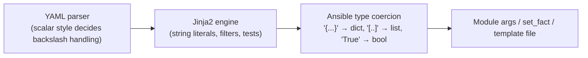

# Step 07 · Jinja2 & Data Transforms: Turning Spark Command Output into Decisions

> **01 Ansible · Part I — Management plane & Ansible foundations · Step 07 of 30** · ← [Step 06 · Inventory: static, dynamic & discovery](06-inventory-static-dynamic-and-discovery.md) · [All steps](00-ansible-step-by-step-guide.md) · [Step 08 · Roles, collections & EEs](08-roles-collections-and-execution-environments.md) →

| | |
|---|---|
| **You will build** | Fluency in the handful of transforms infrastructure automation keeps needing: text to dict, CSV to typed records, log mining to decisions, JMESPath over API objects, safe deep merges, and config generated from inventory |
| **Hardware** | **None required.** The kata runs on localhost with output captured from a Spark; then you point it at the real thing |
| **Time** | 60–90 min |
| **Risk** | None |

Automation on GPU nodes is mostly **parsing**. `nvidia-smi`, `ibdev2netdev`, `ibv_devinfo`, `dmesg`, `kubectl -o json` and `sinfo` all produce text or JSON that you have to turn into a yes/no decision before touching anything.

---

## 1. Where templating happens (and why escaping bites)



Three layers each get a chance to eat your backslashes and quotes:

| You write in YAML as… | YAML turns `\\d` into | What the regex engine sees |
|---|---|---|
| `"{{ x \| regex_findall('\\d+') }}"` (double-quoted) | `\d` | `\d` ✅ |
| `'{{ x \| regex_findall("\d+") }}'` (single-quoted) | `\d` (no escapes in single quotes) | `\d` ✅ |
| `>-` folded / `\|` literal block, writing `'\\d+'` | `\\d` (block scalars don't process escapes) | `\\d` ❌ literal backslash |
| `>-` folded block, writing `'\d+'` | `\d` | `\d` ✅ |

**Rule:** in block scalars (`>-`, `|`), write regexes with **single** backslashes. In double-quoted scalars, **double** them. When it gets hairy, put the pattern in a `vars:` entry using single quotes and reference it by name, as K1 and K4 below do.

---

## 2. The kata

Run it first, then read each block:

```bash
cd "01 Ansible/lab"
ansible-playbook playbooks/15-jinja-lab.yml        # → "7/7 Jinja katas passed"
```

```yaml
# lab/playbooks/15-jinja-lab.yml
---
# Jinja2 / data-transform kata using REAL DGX Spark command output.
# Runs on localhost (no Spark needed):  ansible-playbook playbooks/15-jinja-lab.yml
# Each task transforms raw text → structured data and ASSERTS the result.
- name: Jinja2 transforms on Spark data
  hosts: localhost
  connection: local
  gather_facts: false
  vars:
    # ---------- canned command output (captured on a Spark) ----------
    raw_ibdev2netdev: |
      roceP2p1s0f0 port 1 ==> enP2p1s0f0np0 (Down)
      roceP2p1s0f1 port 1 ==> enP2p1s0f1np1 (Up)
      rocep1s0f0 port 1 ==> enp1s0f0np0 (Down)
      rocep1s0f1 port 1 ==> enp1s0f1np1 (Up)
    raw_smi_csv: |
      index, name, temperature.gpu, power.draw [W], utilization.gpu [%], memory.used [MiB]
      0, NVIDIA GB10, 43, 12.31 W, 7 %, [N/A]
    raw_dmesg: |
      [ 1203.114] NVRM: Xid (PCI:000f:01:00): 13, pid=4242, name=python3, Graphics Exception
      [ 5402.771] NVRM: Xid (PCI:000f:01:00): 31, pid=5150, name=vllm, Ch 00000010, MMU Fault
      [ 9001.002] NVRM: Xid (PCI:000f:01:00): 79, pid=0, name=, GPU has fallen off the bus.
      [ 9001.010] mlx5_core 0000:01:00.1: Port module event: module 1, Cable unplugged
    k8s_nodes_json:
      items:
        - metadata: { name: dgx-spark-1, labels: { nvidia.com/gpu.product: GB10 } }
          status:
            allocatable: { nvidia.com/gpu: "4", memory: 110Gi }
            conditions: [{ type: Ready, status: "True" }]
        - metadata: { name: dgx-spark-2, labels: { nvidia.com/gpu.product: GB10 } }
          status:
            allocatable: { memory: 110Gi }
            conditions: [{ type: Ready, status: "False" }]
    xid_severity:
      "13": app       # graphics/compute exception — usually the application
      "31": app       # MMU fault — bad pointer / OOB in the app
      "43": app
      "48": hw        # DBE ECC
      "63": hw
      "74": fabric
      "79": hw        # fell off the bus — node must be drained
      "94": hw
      "95": hw
      "119": hw       # GSP timeout
  tasks:
    # 1 ─ line-oriented text → dict  (regex_findall + zip + dict)
    - name: "K1 ibdev2netdev → {netdev: {rdma, state}}"
      ansible.builtin.set_fact:
        k1: >-
          {{ dict(raw_ibdev2netdev | regex_findall(k1_re) | map('list') | map('community.general.json_query', '[1]')
                  | zip(raw_ibdev2netdev | regex_findall(k1_re) | map('list')
                        | map('community.general.json_query', '{rdma: [0], state: [2]}'))) }}
      vars:
        k1_re: '(\S+) port \d+ ==> (\S+) \((\w+)\)'
    - name: K1 check
      ansible.builtin.assert:
        that:
          - k1['enp1s0f1np1'].rdma == 'rocep1s0f1'
          # GOTCHA: Jinja's sort is case-INsensitive by default; DGX netdev names mix case (enP2… vs enp1…)
          - k1 | dict2items | selectattr('value.state', 'eq', 'Up') | map(attribute='key') | sort(case_sensitive=true) == ['enP2p1s0f1np1', 'enp1s0f1np1']

    # 2 ─ CSV with units and N/A → typed list of dicts (community.general.from_csv)
    - name: K2 nvidia-smi CSV → typed records
      ansible.builtin.set_fact:
        k2_clean: >-
          
          
            
            
              
              {%- set val = v | regex_replace('\s*(W|%|MiB)$', '') -%}
              
            
            
          
          {{ out }}
    - name: K2 check (memory.used is N/A on a UMA GPU → None, not a crash)
      ansible.builtin.assert:
        that:
          - k2_clean[0].name == 'NVIDIA GB10'
          - k2_clean[0].power_draw == 12.31
          - k2_clean[0].memory_used is none

    # 3 ─ log mining: extract Xid codes, classify, decide an action
    - name: K3 Xid classification
      ansible.builtin.set_fact:
        k3_codes: "{{ raw_dmesg | regex_findall('NVRM: Xid \\([^)]*\\): (\\d+)') }}"
    - name: K3 Decide
      ansible.builtin.set_fact:
        k3_action: >-
          {{ 'drain' if (k3_codes | map('extract', xid_severity) | select('in', ['hw', 'fabric']) | list | length > 0)
             else ('notify-owner' if k3_codes | length > 0 else 'none') }}
        k3_cable_events: "{{ raw_dmesg | regex_findall('mlx5_core (\\S+): .*Cable unplugged') }}"
    - name: K3 check
      ansible.builtin.assert:
        that:
          - k3_codes == ['13', '31', '79']
          - k3_action == 'drain'
          - k3_cable_events == ['0000:01:00.1']      # PCI BDF of the CX-7 function

    # 4 ─ JMESPath over API objects (json_query)
    - name: K4 Nodes that are Ready AND advertise GPUs
      ansible.builtin.set_fact:
        k4: "{{ k8s_nodes_json | community.general.json_query(k4_query) }}"
      vars:
        # Keys containing dots/slashes must be quoted in JMESPath — keep the query in a var to dodge YAML+Jinja escaping
        k4_query: >-
          items[?status.conditions[?type=='Ready' && status=='True']]
          | [?status.allocatable."nvidia.com/gpu"].metadata.name
    - name: K4 check
      ansible.builtin.assert:
        that: k4 == ['dgx-spark-1']

    # 5 ─ deep merge without clobbering (daemon.json pattern)
    - name: K5 recursive combine keeps unknown keys, list_merge controls arrays
      ansible.builtin.set_fact:
        k5: >-
          {{ {'runtimes': {'nvidia': {'path': 'nvidia-container-runtime'}}, 'insecure-registries': ['192.168.0.100:5000']}
             | combine({'default-runtime': 'nvidia', 'insecure-registries': ['192.168.0.101:5000'],
                        'runtimes': {'nvidia': {'args': []}}}, recursive=True, list_merge='append_rp') }}
    - name: K5 check
      ansible.builtin.assert:
        that:
          - k5.runtimes.nvidia.path == 'nvidia-container-runtime'
          - k5.runtimes.nvidia.args == []
          - k5['insecure-registries'] | length == 2

    # 6 ─ generate config lines from inventory (Slurm NodeName, /etc/hosts)
    - name: K6 Build /etc/hosts fabric entries from host_vars
      ansible.builtin.set_fact:
        k6: >-
          {{ groups['spark'] | map('extract', hostvars, ['cx7_interfaces', 0, 'address'])
             | map('regex_replace', '/\d+$', '')
             | zip(groups['spark'] | map('regex_replace', '$', '-fab'))
             | map('join', ' ') | list }}
    - name: K6 check
      ansible.builtin.assert:
        that: >-
          k6 == (['192.168.100.11 dgx-spark-1-fab', '192.168.100.12 dgx-spark-2-fab']
                 | select('search', ' (' ~ (groups['spark'] | join('|')) ~ ')-fab$') | list)
      # one Spark in the inventory → one line, two → two (dgx-spark-2 is commented out until it joins)

    # 7 ─ safe defaults & type tests
    - name: K7 Defaults that don't hide bugs
      ansible.builtin.assert:
        that:
          - (undefined_thing | default('fallback')) == 'fallback'
          - ('' | default('x', true)) == 'x'                 # true → also replace falsy values
          - ('580.82.09'.split('.')[0] | int) >= 580
          - ('13.0' is version('13.0', '>='))
          - ('GB10' is search('gb10', ignorecase=true))

    - name: All katas passed
      ansible.builtin.debug:
        msg: "7/7 Jinja katas passed"
```

### 2.1 What each kata teaches

| Kata | Real-world use in the lab | Key tools | Gotcha it encodes |
|---|---|---|---|
| **K1** text → dict | `cx7_fabric`, `spark.fact` | `regex_findall`, `map('list')`, `json_query`, `zip`, `dict` | `regex_findall` returns **tuples**, and JMESPath can't index tuples, so `map('list')` first. Jinja `sort` is **case-insensitive by default**; DGX netdevs mix case (`enP2…`/`enp1…`), so use `sort(case_sensitive=true)` |
| **K2** CSV → typed | textfile collector, validation | `community.general.from_csv`, `regex_replace`, per-field typing | On a UMA GPU, `memory.used` is `[N/A]`. Map it to `none` explicitly instead of letting `float` blow up |
| **K3** logs → action | Slurm health check, drain runbook | `regex_findall`, `extract`, `select('in', …)` | Classify **codes**, not messages. Xid 13/31/43 usually mean the app (notify its owner); 48/63/74/79/94/95/119 mean hardware or driver (drain) |
| **K4** JMESPath on API JSON | `spark_validate`, GPU operator checks | `community.general.json_query` | Keys with dots (`nvidia.com/gpu`) need `"double quotes"` inside JMESPath. Keep the query in a var |
| **K5** deep merge | `container_runtime` daemon.json | `combine(recursive=True, list_merge=...)` | Default `list_merge='replace'` silently drops existing registries. Choose `append_rp`/`prepend_rp` deliberately |
| **K6** inventory → config | `/etc/hosts`, `slurm.conf`, Prometheus targets | `extract` with key path, `zip`, `join` | `extract(hostvars, ['a', 0, 'b'])` walks nested keys without a loop |
| **K7** defaults & tests | everywhere | `default(x, true)`, `version`, `search` | `default` without `true` does **not** replace empty strings |

### 2.2 Jinja loops inside `set_fact`: when filters get unreadable

The `cx7_fabric` role uses a Jinja block for the peer-pair calculation because the pure-filter version is unreadable. The pattern:

```jinja


  
    
      
        
      
    
  

{{ pairs }}
```

- The `-` in `` strips whitespace, so the result is a clean `[...]` string, which Ansible then converts to a real list.
- `set _ = list.append(...)` is the idiom for mutation, because Jinja has no statement form of it.
- If the logic grows past about 15 lines, write a **filter plugin** (`filter_plugins/spark.py`) and unit-test it with `pytest` instead.

### 2.3 A custom filter for the hardest one

```python
# lab/filter_plugins/spark_filters.py  (optional exercise)
import re

def ibdev2netdev(text):
    """'rocep1s0f1 port 1 ==> enp1s0f1np1 (Up)' → {'enp1s0f1np1': {'rdma': 'rocep1s0f1', 'state': 'Up'}}"""
    out = {}
    for rdma, netdev, state in re.findall(r"(\S+) port \d+ ==> (\S+) \((\w+)\)", text):
        out[netdev] = {"rdma": rdma, "state": state}
    return out

class FilterModule:
    def filters(self):
        return {"ibdev2netdev": ibdev2netdev}
```

```yaml
- ansible.builtin.set_fact:
    cx7_map: "{{ ibdev_raw.stdout | ibdev2netdev }}"
```

---

## 3. Point it at your real Spark

Replace the canned vars with live output:

```yaml
- hosts: spark
  gather_facts: false
  tasks:
    - ansible.builtin.command: ibdev2netdev
      register: ib
      changed_when: false
    - ansible.builtin.command: >
        nvidia-smi --query-gpu=index,name,temperature.gpu,power.draw,utilization.gpu,memory.used --format=csv
      register: smi
      changed_when: false
    - ansible.builtin.shell: set -o pipefail; journalctl -k --no-pager | grep -E 'NVRM|mlx5' | tail -200
      args: { executable: /bin/bash }
      register: kern
      changed_when: false
      failed_when: false
    - ansible.builtin.include_tasks: katas-on-live-data.yml   # your version of K1–K3 using ib.stdout, smi.stdout, kern.stdout
```

---

## 4. Troubleshooting & diagnostics

| Symptom | Cause | Fix |
|---|---|---|
| `set_fact` result is a **string** that looks like a dict | Leading/trailing text or whitespace defeated type coercion | Use `` whitespace control; make sure the output starts with `{`/`[`; or `\| from_yaml` |
| `json_query` returns `null` / `[]` on data you can see | Tuples (from `regex_findall`/`zip`), or unquoted dotted keys | `map('list')`; quote keys: `"nvidia.com/gpu"` |
| `template error ... expected token ','` | Quotes nested three levels deep | Move the literal into `vars:` |
| Regex matches in regex101 but not in Ansible | Backslash layering (§1) | Block scalar → single `\`; double-quoted → `\\` |
| `'dict object' has no attribute 'x'` for a key that exists | Key contains `-` or `.` | Bracket syntax: `item['insecure-registries']` |
| Comparison of versions is wrong (`580.9 > 580.82`) | String comparison | `is version('580.82', '>=')` |
| `combine` lost list items | `list_merge` defaults to `replace` | `list_merge='append_rp'` |
| Output differs between localhost and AWX | Different Jinja/Ansible version in the EE | Pin ansible-core in the EE (Step 08) |

Tools for debugging expressions:

```bash
ansible localhost -m debug -a "msg={{ '580.82.09' is version('580', '>=') }}"
ansible dgx-spark-1 -m debug -a "msg={{ hostvars['dgx-spark-2'].cx7_interfaces | map(attribute='address') }}"
ansible-console localhost      # then: debug msg="{{ ... }}"
```

## 5. Validation

- [ ] `15-jinja-lab.yml` passes 7/7.
- [ ] You broke K1 by removing `map('list')` and explained the `null`.
- [ ] You rewrote one kata against live Spark output.
- [ ] (Stretch) The `ibdev2netdev` filter plugin exists with a pytest test.
