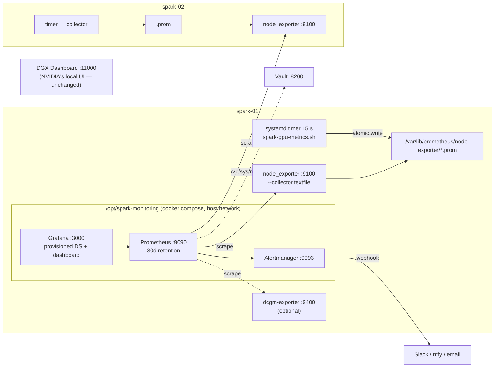

# Volume 09 — Telemetry for DGX Spark: GPU, Unified Memory & Fabric Metrics, Prometheus, Grafana, Alerts (and Where DCGM Fits)

> **Module 01 · Part II — Node Provisioning** · Prev: [08 CUDA & containers](08-cuda-toolkit-cudnn-and-container-runtime.md) · Next: [10 Firmware lifecycle](10-firmware-lifecycle-and-gpu-vulnerability-patch.md)

| | |
|---|---|
| **You will build** | node_exporter plus a dependency-free **GPU/UMA/CX-7 textfile collector** on every Spark, a Prometheus + Alertmanager + Grafana stack on spark-01 with a provisioned dashboard and 7 alert rules (all validated with `promtool`), and an optional dcgm-exporter path |
| **Hardware** | 1–2× DGX Spark |
| **Time** | 60 min |
| **Risk** | Low. About 1 GiB RAM for the stack; data lives in Docker volumes |

---

## 1. What to measure on a Spark (it's not a DGX H100)

| Signal | Why it matters here | Source |
|---|---|---|
| GPU up/answering | A wedged GPU makes `nvidia-smi` hang; everything downstream fails | `spark_gpu_up` (collector, 10 s timeout) |
| **Unified memory available** | GPU allocations come from the **same** 128 GB pool as the OS, page cache and containers. `nvidia-smi memory.used` shows `[N/A]` | `spark_uma_available_bytes`, `spark_uma_page_cache_bytes` |
| Xid events | Kernel-reported GPU errors → triage (Volume 24) | `spark_gpu_xid_events_24h` (from `journalctl -k`) |
| Temperature / power / clocks / throttle reasons | A desk-side 240 W box can be thermally limited by placement | `spark_gpu_*` |
| CX-7 link speed & throughput | A link that silently negotiated 100G halves NCCL bandwidth | `spark_cx7_link_speed_mbps`, `node_network_*` |
| Config drift | Tasks that would change in check mode | `spark_config_drift_tasks` (Volume 22) |

## 2. Architecture

### 2.1 HLD



### 2.2 LLD

| Item | Value |
|---|---|
| Collector | `/usr/local/sbin/spark-gpu-metrics.sh`, `spark-gpu-metrics.timer` every 15 s |
| Textfile dir | `/var/lib/prometheus/node-exporter` (Ubuntu package default) |
| node_exporter args | `--collector.textfile.directory=… --collector.systemd --collector.processes` |
| Stack | `/opt/spark-monitoring/compose.yml`: `prom/prometheus`, `prom/alertmanager`, `grafana/grafana` (multi-arch images) |
| Retention | `30d` (`gpu_telemetry_retention`) |
| Dashboard | `roles/gpu_telemetry/files/spark-overview.json` → folder "Spark Lab" |
| Alerts | `SparkGPUUnresponsive`, `SparkGPUMetricsStale`, `SparkGPUXid`, `SparkGPUHot`, `SparkUnifiedMemoryLow`, `SparkCX7Degraded`, `SparkNodeDown` |

**Why a textfile collector instead of a custom exporter?** No daemon to crash, no port to secure. The atomic `mktemp` + `mv` means Prometheus never scrapes a half-written file, and a hung `nvidia-smi` shows up as `spark_gpu_up 0` rather than a stuck exporter.

---

## 3. The code

```bash
# lab/roles/gpu_telemetry/files/spark-gpu-metrics.sh
#!/usr/bin/env bash
# spark-gpu-metrics.sh — node_exporter textfile collector for DGX Spark.
# Writes Prometheus metrics atomically to $OUT (tmp file + mv), run by a systemd timer.
#
# Why not only dcgm-exporter? It may not expose every GB10 field, and on a UMA
# system "GPU memory used" is not reported by nvidia-smi (shows [N/A]) — the real
# memory signal is host MemAvailable. This script is the dependency-free fallback.
set -euo pipefail
OUT_DIR=${OUT_DIR:-/var/lib/prometheus/node-exporter}
OUT="$OUT_DIR/spark_gpu.prom"
TMP="$(mktemp "$OUT_DIR/.spark_gpu.XXXXXX")"
trap 'rm -f "$TMP"' EXIT

num() { [[ "$1" =~ ^-?[0-9]+(\.[0-9]+)?$ ]] && echo "$1" || echo "NaN"; }

{
echo "# HELP spark_gpu_up 1 if nvidia-smi answered within the timeout"
echo "# TYPE spark_gpu_up gauge"
if q=$(timeout 10 nvidia-smi --query-gpu=index,name,temperature.gpu,power.draw,utilization.gpu,clocks.sm,clocks_throttle_reasons.active \
        --format=csv,noheader,nounits 2>/dev/null); then
  echo "spark_gpu_up 1"
  echo "# HELP spark_gpu_temperature_celsius GPU die temperature"
  echo "# TYPE spark_gpu_temperature_celsius gauge"
  echo "# HELP spark_gpu_power_watts GPU power draw"
  echo "# TYPE spark_gpu_power_watts gauge"
  echo "# HELP spark_gpu_utilization_ratio GPU busy ratio 0-1"
  echo "# TYPE spark_gpu_utilization_ratio gauge"
  echo "# HELP spark_gpu_sm_clock_mhz SM clock"
  echo "# TYPE spark_gpu_sm_clock_mhz gauge"
  echo "# HELP spark_gpu_throttle_reasons_bitmask Active clock throttle reasons (0 = none)"
  echo "# TYPE spark_gpu_throttle_reasons_bitmask gauge"
  while IFS=',' read -r idx name temp power util sm thr; do
    idx=$(echo "$idx" | xargs); name=$(echo "$name" | xargs)
    l="gpu=\"$idx\",name=\"$name\""
    echo "spark_gpu_temperature_celsius{$l} $(num "$(echo "$temp" | xargs)")"
    echo "spark_gpu_power_watts{$l} $(num "$(echo "$power" | xargs)")"
    u=$(num "$(echo "$util" | xargs)"); [[ "$u" != NaN ]] && u=$(awk "BEGIN{print $u/100}")
    echo "spark_gpu_utilization_ratio{$l} $u"
    echo "spark_gpu_sm_clock_mhz{$l} $(num "$(echo "$sm" | xargs)")"
    echo "spark_gpu_throttle_reasons_bitmask{$l} $(( $(echo "$thr" | xargs) + 0 ))" 2>/dev/null \
      || echo "spark_gpu_throttle_reasons_bitmask{$l} NaN"
  done <<< "$q"
else
  echo "spark_gpu_up 0"
fi

echo "# HELP spark_gpu_xid_events_24h Kernel NVRM Xid events in the last 24h"
echo "# TYPE spark_gpu_xid_events_24h gauge"
echo "spark_gpu_xid_events_24h $(journalctl -k --since '24 hours ago' --no-pager 2>/dev/null | grep -c 'NVRM: Xid' || true)"

echo "# HELP spark_gpu_processes Number of compute processes on the GPU"
echo "# TYPE spark_gpu_processes gauge"
echo "spark_gpu_processes $(timeout 10 nvidia-smi --query-compute-apps=pid --format=csv,noheader 2>/dev/null | grep -c . || true)"

echo "# HELP spark_uma_available_bytes Unified memory available to CPU+GPU (MemAvailable)"
echo "# TYPE spark_uma_available_bytes gauge"
echo "spark_uma_available_bytes $(awk '/MemAvailable/{print $2*1024}' /proc/meminfo)"
echo "# HELP spark_uma_page_cache_bytes Page cache that can be dropped to give memory back to the GPU"
echo "# TYPE spark_uma_page_cache_bytes gauge"
echo "spark_uma_page_cache_bytes $(awk '/^Cached:/{print $2*1024}' /proc/meminfo)"

echo "# HELP spark_cx7_link_speed_mbps ConnectX-7 negotiated speed"
echo "# TYPE spark_cx7_link_speed_mbps gauge"
for n in /sys/class/net/enp1s0f*np* /sys/class/net/enP2p1s0f*np*; do
  [[ -e "$n" ]] || continue
  s=$(cat "$n/speed" 2>/dev/null || echo -1)
  echo "spark_cx7_link_speed_mbps{device=\"$(basename "$n")\"} $s"
done
} > "$TMP"

chmod 0644 "$TMP"
mv "$TMP" "$OUT"
trap - EXIT
```

```yaml
# lab/roles/gpu_telemetry/tasks/node.yml
---
- name: Install node_exporter
  ansible.builtin.apt:
    name: prometheus-node-exporter
    state: present

- name: Point node_exporter at the textfile directory
  ansible.builtin.copy:
    dest: /etc/default/prometheus-node-exporter
    content: |
      # {{ ansible_managed }}
      ARGS="--collector.textfile.directory={{ gpu_telemetry_textfile_dir }} --collector.systemd --collector.processes"
    owner: root
    group: root
    mode: "0644"
  notify: Restart node_exporter

- name: Ensure textfile directory
  ansible.builtin.file:
    path: "{{ gpu_telemetry_textfile_dir }}"
    state: directory
    owner: root
    group: root
    mode: "0755"

- name: Install GPU/UMA/CX-7 textfile collector
  ansible.builtin.copy:
    src: spark-gpu-metrics.sh
    dest: /usr/local/sbin/spark-gpu-metrics.sh
    owner: root
    group: root
    mode: "0755"

- name: Install systemd service + timer for the collector
  ansible.builtin.copy:
    dest: "/etc/systemd/system/{{ item.name }}"
    content: "{{ item.content }}"
    owner: root
    group: root
    mode: "0644"
  loop:
    - name: spark-gpu-metrics.service
      content: |
        [Unit]
        Description=DGX Spark GPU textfile metrics
        [Service]
        Type=oneshot
        Environment=OUT_DIR={{ gpu_telemetry_textfile_dir }}
        ExecStart=/usr/local/sbin/spark-gpu-metrics.sh
        Nice=10
    - name: spark-gpu-metrics.timer
      content: |
        [Unit]
        Description=Run spark-gpu-metrics every {{ gpu_telemetry_interval }}
        [Timer]
        OnBootSec=30s
        OnUnitActiveSec={{ gpu_telemetry_interval }}
        AccuracySec=1s
        [Install]
        WantedBy=timers.target
  loop_control:
    label: "{{ item.name }}"
  notify: Reload systemd

- name: Flush handlers (daemon-reload before enabling the timer)
  ansible.builtin.meta: flush_handlers

- name: Enable collector timer
  ansible.builtin.systemd_service:
    name: spark-gpu-metrics.timer
    enabled: true
    state: started

- name: Run dcgm-exporter container (optional)
  community.docker.docker_container:
    name: dcgm-exporter
    image: "{{ gpu_telemetry_dcgm_image }}"
    restart_policy: unless-stopped
    runtime: nvidia
    capabilities: [SYS_ADMIN]
    published_ports: ["{{ gpu_telemetry_dcgm_port }}:9400"]
    env:
      NVIDIA_VISIBLE_DEVICES: all
  when: gpu_telemetry_dcgm_enabled | bool
```

```yaml
# lab/roles/gpu_telemetry/tasks/stack.yml
---
- name: Create monitoring stack directories
  ansible.builtin.file:
    path: "{{ gpu_telemetry_stack_dir }}/{{ item }}"
    state: directory
    owner: root
    group: root
    mode: "0755"
  loop: [prometheus, alertmanager, grafana/provisioning/datasources, grafana/provisioning/dashboards]

- name: Render stack configuration
  ansible.builtin.template:
    src: "{{ item.src }}"
    dest: "{{ gpu_telemetry_stack_dir }}/{{ item.dest }}"
    owner: root
    group: root
    mode: "0644"
  loop:
    - { src: compose.yml.j2, dest: compose.yml }
    - { src: prometheus.yml.j2, dest: prometheus/prometheus.yml }
    - { src: spark-alerts.yml.j2, dest: prometheus/spark-alerts.yml }
    - { src: alertmanager.yml.j2, dest: alertmanager/alertmanager.yml }
    - { src: grafana-datasource.yml.j2, dest: grafana/provisioning/datasources/prometheus.yml }
    - { src: grafana-dashboards.yml.j2, dest: grafana/provisioning/dashboards/spark-lab.yml }
  loop_control:
    label: "{{ item.dest }}"
  register: gpu_telemetry_cfg

- name: Provision the Spark overview dashboard
  ansible.builtin.copy:
    src: spark-overview.json
    dest: "{{ gpu_telemetry_stack_dir }}/grafana/provisioning/dashboards/spark-overview.json"
    owner: root
    group: root
    mode: "0644"

- name: Validate Prometheus config + rules with promtool (in the image)  # noqa: no-handler (gate before compose up)
  ansible.builtin.command: >-
    docker run --rm --entrypoint promtool
    -v {{ gpu_telemetry_stack_dir }}/prometheus:/etc/prometheus:ro
    {{ gpu_telemetry_prometheus_image }} check config /etc/prometheus/prometheus.yml
  changed_when: false
  check_mode: false        # read-only probe: must also run under --check (drift detection)
  when: gpu_telemetry_cfg is changed

- name: Bring the stack up
  community.docker.docker_compose_v2:
    project_src: "{{ gpu_telemetry_stack_dir }}"
    state: present
    pull: missing
  register: gpu_telemetry_compose

- name: Hot-reload Prometheus when only config changed
  ansible.builtin.uri:
    url: http://127.0.0.1:9090/-/reload
    method: POST
    status_code: [200]
  when: gpu_telemetry_cfg is changed and gpu_telemetry_compose is not changed
```

```yaml
# lab/roles/gpu_telemetry/templates/spark-alerts.yml.j2
# {{ ansible_managed }}
groups:
  - name: spark-gpu
    rules:
      - alert: SparkGPUUnresponsive
        expr: spark_gpu_up == 0
        for: 2m
        labels: { severity: critical }
        annotations:
          summary: "nvidia-smi not answering on {{ '{{' }} $labels.host {{ '}}' }}"
          runbook: "Volume 24 §Runbook A — GPU hang"
      - alert: SparkGPUMetricsStale
        # A textfile metric that stops updating looks exactly like a healthy one.
        expr: time() - node_textfile_mtime_seconds{file=~".*spark_gpu.prom"} > 120
        for: 2m
        labels: { severity: warning }
        annotations:
          summary: "GPU metrics on {{ '{{' }} $labels.host {{ '}}' }} are {{ '{{' }} $value | humanizeDuration {{ '}}' }} old — collector timer stopped?"
          runbook: "systemctl status spark-gpu-metrics.timer; ansible-playbook playbooks/04-telemetry.yml"
      - alert: SparkGPUXid
        expr: delta(spark_gpu_xid_events_24h[15m]) > 0
        labels: { severity: warning }
        annotations:
          summary: "New NVRM Xid on {{ '{{' }} $labels.host {{ '}}' }}"
          runbook: "Volume 24 §Runbook B — Xid triage"
      - alert: SparkGPUHot
        expr: spark_gpu_temperature_celsius > 85
        for: 5m
        labels: { severity: warning }
        annotations:
          summary: "GPU {{ '{{' }} $value {{ '}}' }}C on {{ '{{' }} $labels.host {{ '}}' }} — check airflow / desk placement"
      - alert: SparkUnifiedMemoryLow
        expr: spark_uma_available_bytes < 8 * 1024 * 1024 * 1024
        for: 2m
        labels: { severity: warning }
        annotations:
          summary: "<8 GiB unified memory available on {{ '{{' }} $labels.host {{ '}}' }}"
          runbook: "Volume 24 §Runbook C — UMA pressure (drop caches, stop idle model servers)"
  - name: spark-fabric
    rules:
      - alert: SparkCX7Degraded
        expr: spark_cx7_link_speed_mbps > 0 and spark_cx7_link_speed_mbps < 200000
        for: 1m
        labels: { severity: warning }
        annotations:
          summary: "{{ '{{' }} $labels.device {{ '}}' }} negotiated {{ '{{' }} $value {{ '}}' }} Mb/s on {{ '{{' }} $labels.host {{ '}}' }}"
      - alert: SparkNodeDown
        expr: up{job="node"} == 0
        for: 1m
        labels: { severity: critical }
        annotations:
          summary: "{{ '{{' }} $labels.host {{ '}}' }} unreachable"
```

> `{{ '{{' }}` in the template escapes Prometheus's own `{{ $labels.host }}` from Jinja. Forgetting this is the #1 error when templating alert rules with Ansible.

---

## 4. Hands-on

```bash
cd "01 Ansible/lab"
ansible-playbook playbooks/04-telemetry.yml -K
# node side
ssh nvidia@10.10.10.11 'cat /var/lib/prometheus/node-exporter/spark_gpu.prom; curl -s localhost:9100/metrics | grep ^spark_ | head'
# stack
curl -s http://10.10.10.11:9090/api/v1/targets | jq -r '.data.activeTargets[] | "\(.labels.host) \(.health)"'
curl -s http://10.10.10.11:9090/api/v1/rules | jq -r '.data.groups[].rules[].name'
# Grafana: http://10.10.10.11:3000  (admin / gpu_telemetry_grafana_admin_password) → Spark Lab → Overview
```

### 4.1 Make the alerts fire (on purpose)

| Alert | How to trigger it safely |
|---|---|
| `SparkUnifiedMemoryLow` | In a PyTorch container, allocate until `MemAvailable` < 8 GiB: `x=[torch.empty(2**30, dtype=torch.uint8, device='cuda') for _ in range(110)]` (adjust the count), then free it |
| `SparkCX7Degraded` | Unplug the QSFP cable (speed drops to −1/absent) or force 100G: `sudo ethtool -s enp1s0f1np1 speed 100000 autoneg off` (revert afterwards) |
| `SparkNodeDown` | `sudo systemctl stop prometheus-node-exporter` on spark-02 for 90 s |
| `SparkGPUUnresponsive` | Temporarily break PATH for the collector: `sudo systemctl edit spark-gpu-metrics.service` → `Environment=PATH=/nonexistent` |
| `SparkGPUMetricsStale` | `sudo systemctl stop spark-gpu-metrics.timer` for 4 min (the `.prom` file stops updating while node_exporter keeps serving it) |

Check them in Prometheus (Alerts tab) and Alertmanager (`:9093`). Wire a receiver by setting `gpu_telemetry_webhook_url` (e.g. an ntfy.sh or Slack-compatible webhook) and re-running the play.

### 4.2 DCGM: when and how

DCGM (Data Center GPU Manager) is NVIDIA's data-centre telemetry, health and diagnostics stack. `dcgm-exporter` is its Prometheus exporter. On DGX/HGX it's the standard. On a Spark, first check whether your DGX OS release supports it on GB10:

```bash
sudo apt install datacenter-gpu-manager-4-core 2>/dev/null || apt-cache search datacenter-gpu-manager
sudo systemctl start nvidia-dcgm 2>/dev/null
dcgmi discovery -l          # does it list the GB10?
dcgmi dmon -e 150,155,203 -c 5   # temp, power, util
```

If the GPU is listed, enable the exporter container:

```bash
ansible-playbook playbooks/04-telemetry.yml -K -e gpu_telemetry_dcgm_enabled=true
curl -s localhost:9400/metrics | grep -E '^DCGM_FI_DEV_(GPU_TEMP|POWER_USAGE|GPU_UTIL)'
```

Expect some fields (framebuffer memory in particular) to be absent or meaningless on UMA. Keep the textfile collector for the UMA and CX-7 signals either way.

---

## 5. Integrations

| System | How |
|---|---|
| Vault | Add a scrape job for `https://spark-01:8200/v1/sys/metrics?format=prometheus` with a `bearer_token` from a metrics-only policy; alert on `vault_core_unsealed == 0` |
| k3s / GPU Operator | With the operator's `dcgmExporter.enabled=true` you get a ServiceMonitor-style endpoint in-cluster. Pick one exporter path per node to avoid double counting |
| Slurm | The same `spark_gpu_up`/Xid signals drive the Slurm health check (Volume 18). Alerts and scheduler agree |
| Drift (Volume 22) | `spark_drift_report.py --prom` writes `spark_config_drift.prom` into the textfile dir, and it shows on the dashboard |
| DGX Dashboard | Stays as NVIDIA's local UI on `:11000` (reach it through an SSH tunnel). Prometheus is for history and alerting |

## 6. Troubleshooting & diagnostics

| Symptom | Diagnose | Fix |
|---|---|---|
| No `spark_*` metrics | `systemctl list-timers \| grep spark`; `journalctl -u spark-gpu-metrics -n 20` | Timer not enabled / script error; run `/usr/local/sbin/spark-gpu-metrics.sh` by hand |
| node_exporter: `textfile ... was collected before with the same name and label values` | Two `.prom` files export the same series | One writer per metric family; delete stale files |
| `spark_gpu_up 0` but `nvidia-smi` works interactively | The collector's PATH or permissions under systemd | `systemd-run --wait -p Environment=OUT_DIR=/tmp /usr/local/sbin/spark-gpu-metrics.sh` |
| Prometheus target `DOWN: connection refused :9100` | `ss -ltnp \| grep 9100` on the node; host firewall | Start node_exporter; allow 9100 from spark-01 only |
| Stack play fails at promtool | Output shows the bad line | Usually an escaping error in `spark-alerts.yml.j2` (§3 note) |
| Grafana dashboard empty | Datasource UID / variable `DS` | Dashboard uses `${DS}`; select "Prometheus" in the dropdown; check `http://127.0.0.1:9090` from Grafana (host network) |
| CX-7 throughput panel empty | `node_network_receive_bytes_total{device=~"en[pP].*np[0-9]"}` | Interface regex; the netdev names differ on your unit (check `ibdev2netdev`) |
| dcgm-exporter crashloops | `docker logs dcgm-exporter` | DCGM doesn't support this GPU/driver combo: set `gpu_telemetry_dcgm_enabled=false` |

## 7. Validation

- [ ] `promtool check config` and `check rules` pass (the play does it; this lab's rules were validated with Prometheus 3.4.1's promtool).
- [ ] The dashboard shows both Sparks. The UMA panel moves when you load a model.
- [ ] You triggered and resolved at least `SparkUnifiedMemoryLow` and `SparkNodeDown`.
- [ ] Alerts reach a real receiver (webhook, Slack or ntfy).
