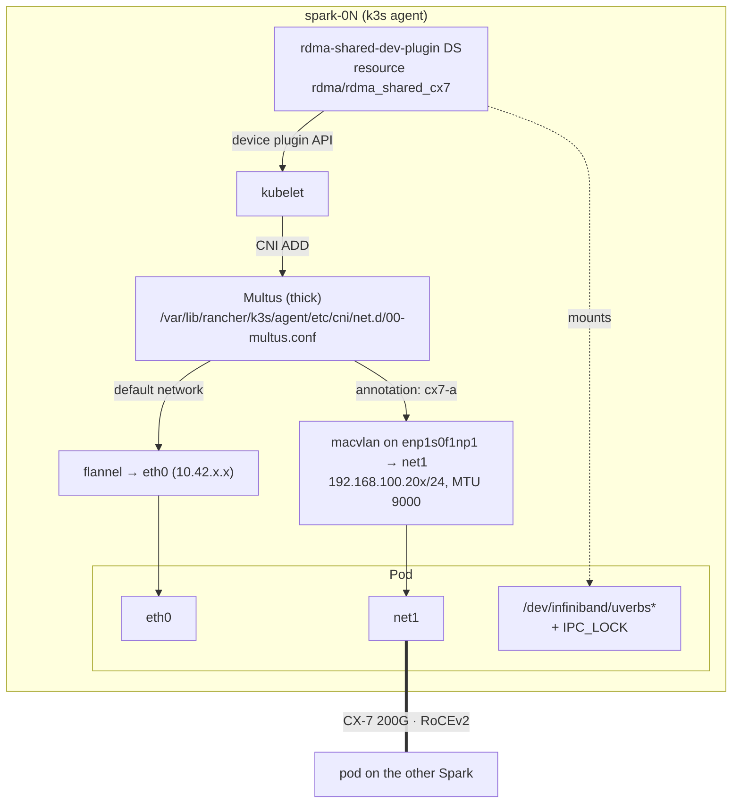

# Volume 13 — Multus & Secondary RDMA Networks for Pods on k3s (CX-7 Fabric Inside Kubernetes)

> **Module 01 · Part III — High-Speed Fabric** · Prev: [12 RoCEv2 & NCCL](12-lossless-rocev2-and-pfc-switch-host-tuning.md) · Next: [14 GPUDirect Storage on a UMA system](14-gpudirect-storage-gds-and-cufile-provisioning.md) · Requires: [16 k3s](16-kubernetes-bare-metal-bootstrap-kubespray.md)

| | |
|---|---|
| **You will build** | Pods with **two** interfaces (`eth0` on flannel for control traffic, `net1` on the 200G CX-7 fabric) plus RDMA verbs access through an extended resource, proven with a pod-to-pod `ib_write_bw` across Sparks |
| **Hardware** | 2× DGX Spark running k3s (single Spark works too; both pods then land on one node) |
| **Time** | 60–90 min |
| **Risk** | Low–medium. Adds a CNI meta-plugin; the pod network (flannel) is untouched |

---

## 1. Why pods need a second network

Flannel (k3s's default CNI) gives every pod an overlay IP with VXLAN encapsulation. That's fine for APIs and Ray control traffic, but **it can't carry RDMA**: verbs need direct access to the NIC's RDMA device and a GID on the physical fabric. Distributed training and multi-node inference pods therefore need:

1. a **second interface** on the CX-7 fabric (Multus + macvlan/host-device/SR-IOV), and
2. **access to the RDMA device** (`/dev/infiniband/*`), handed out as a schedulable resource by a device plugin, and
3. `IPC_LOCK` (RDMA pins memory).

## 2. Architecture

### 2.1 HLD



### 2.2 LLD

| Component | Choice in this lab | Production alternative |
|---|---|---|
| Multus | `rke2-multus` chart via k3s's built-in **HelmChart controller**, with k3s CNI paths | NVIDIA **Network Operator** (bundles Multus, IPAM, RDMA/SR-IOV device plugins, OFED) |
| Secondary CNI | `macvlan` bridge mode, master = CX-7 netdev, MTU 9000 | `host-device` (a whole netdev per pod), or SR-IOV VFs (one VF per pod, hardware isolation) |
| IPAM | `static`, IP given per pod in the annotation (deterministic for a lab) | `whereabouts` (cluster-wide ranges) or DHCP |
| RDMA exposure | `k8s-rdma-shared-dev-plugin`, selecting netdevs `enp1s0f1np1`, `enP2p1s0f1np1` | SR-IOV network device plugin (exclusive VFs) |
| k3s paths | conf `…/agent/etc/cni/net.d`, bin `…/k3s/data/cni/` | Check them on your k3s version: `ls /var/lib/rancher/k3s/data/` |

> **Why macvlan works for RoCE:** the mlx5 driver installs RoCE GIDs for IPs on macvlan upper devices, so a pod's `net1` IP gets its own RoCEv2 GID on the physical port. Check it with `show_gids` on the host after a pod starts.

---

## 3. Hands-on

```yaml
# lab/playbooks/13-multus-rdma.yml
---
# Secondary CX-7 networks for pods on k3s: Multus + macvlan (static IPAM) + RDMA shared device plugin.
# Result: a pod gets eth0 (flannel) AND net1 on the 200G fabric with RDMA verbs access.
#
#   ansible-playbook playbooks/13-multus-rdma.yml
- name: Multus + RDMA on k3s
  hosts: localhost
  connection: local
  gather_facts: false
  vars:
    kubeconfig: "{{ playbook_dir }}/../.cache/kubeconfig-{{ lab_name | default('spark-lab') }}.yaml"
    multus_chart_version: ""                 # pin after `helm search repo rke2-charts/rke2-multus -l`
    multus_rdma_resource: rdma_shared_cx7
    multus_rdma_ifnames: [enp1s0f1np1, enP2p1s0f1np1]
    multus_rdma_dp_image: ghcr.io/mellanox/k8s-rdma-shared-dev-plugin:latest   # pin a release tag
    multus_test_image: ubuntu:24.04          # perftest + verbs utils installed at start (readiness waits for it)
    multus_nads:
      - { name: cx7-a, master: enp1s0f1np1, subnet: 192.168.100.0/24 }
      - { name: cx7-b, master: enP2p1s0f1np1, subnet: 192.168.101.0/24 }
  tasks:
    # ---------------------------------------------------------------- Multus via k3s HelmChart CRD
    - name: Multus (rke2-multus chart, paths adjusted for k3s)
      kubernetes.core.k8s:
        kubeconfig: "{{ kubeconfig }}"
        definition:
          apiVersion: helm.cattle.io/v1
          kind: HelmChart
          metadata:
            name: multus
            namespace: kube-system
          spec:
            repo: https://rke2-charts.rancher.io
            chart: rke2-multus
            version: "{{ multus_chart_version | default(omit, true) }}"
            targetNamespace: kube-system
            valuesContent: |-
              config:
                fullnameOverride: multus
                cni_conf:
                  confDir: /var/lib/rancher/k3s/agent/etc/cni/net.d
                  binDir: /var/lib/rancher/k3s/data/cni/
                  kubeconfig: /var/lib/rancher/k3s/agent/etc/cni/net.d/multus.d/multus.kubeconfig
                  # per k3s docs: remove this line for rke2-multus < v4.2.202
                  multusAutoconfigDir: /var/lib/rancher/k3s/agent/etc/cni/net.d
              manifests:
                dhcpDaemonSet: false

    - name: Wait for Multus DaemonSet
      kubernetes.core.k8s_info:
        kubeconfig: "{{ kubeconfig }}"
        kind: DaemonSet
        namespace: kube-system
        name: multus
      register: multus_ds
      until: >-
        multus_ds.resources | length > 0 and
        multus_ds.resources[0].status.numberReady | default(0) == multus_ds.resources[0].status.desiredNumberScheduled | default(-1)
      retries: 30
      delay: 10

    # ---------------------------------------------------------------- RDMA shared device plugin
    - name: RDMA shared device plugin
      kubernetes.core.k8s:
        kubeconfig: "{{ kubeconfig }}"
        state: present
        template: rdma-shared-dp.yaml.j2

    # ---------------------------------------------------------------- NetworkAttachmentDefinitions
    - name: Macvlan NADs on the CX-7 netdevs (static IPAM — IP chosen per pod)
      kubernetes.core.k8s:
        kubeconfig: "{{ kubeconfig }}"
        definition:
          apiVersion: k8s.cni.cncf.io/v1
          kind: NetworkAttachmentDefinition
          metadata:
            name: "{{ item.name }}"
            namespace: default
          spec:
            config: >-
              {{ {'cniVersion': '0.3.1', 'type': 'macvlan', 'master': item.master, 'mode': 'bridge',
                  'mtu': 9000, 'capabilities': {'ips': true}, 'ipam': {'type': 'static'}} | to_json }}
      loop: "{{ multus_nads }}"
      loop_control: { label: "{{ item.name }} -> {{ item.master }}" }

    - name: Wait until every node advertises the RDMA resource
      kubernetes.core.k8s_info:
        kubeconfig: "{{ kubeconfig }}"
        kind: Node
      register: multus_nodes
      until: >-
        multus_nodes.resources
        | map(attribute='status.allocatable')
        | selectattr('rdma/' ~ multus_rdma_resource, 'defined')
        | list | length == multus_nodes.resources | length
      retries: 18
      delay: 10

    # ---------------------------------------------------------------- test pods, one per node
    - name: RDMA test pods
      kubernetes.core.k8s:
        kubeconfig: "{{ kubeconfig }}"
        wait: true
        wait_timeout: 600
        definition:
          apiVersion: v1
          kind: Pod
          metadata:
            name: "rdma-test-{{ item.node }}"
            namespace: default
            annotations:
              k8s.v1.cni.cncf.io/networks: >-
                [{"name": "cx7-a", "ips": ["{{ item.ip }}/24"]}]
          spec:
            nodeName: "{{ item.node }}"
            restartPolicy: Never
            containers:
              - name: t
                image: "{{ multus_test_image }}"
                command:
                  - sh
                  - -c
                  - apt-get update -qq && apt-get install -y -qq perftest ibverbs-utils iproute2 >/dev/null && sleep infinity
                readinessProbe:
                  exec: { command: [sh, -c, "command -v ib_write_bw"] }
                  periodSeconds: 5
                securityContext:
                  capabilities: { add: [IPC_LOCK] }
                resources:
                  limits:
                    "rdma/{{ multus_rdma_resource }}": 1
      loop:
        - { node: "{{ groups['spark'][0] }}", ip: 192.168.100.201 }
        - { node: "{{ groups['spark'][1] | default(groups['spark'][0]) }}", ip: 192.168.100.202 }
      loop_control: { label: "{{ item.node }} {{ item.ip }}" }

    - name: Show net1 inside each pod
      kubernetes.core.k8s_exec:
        kubeconfig: "{{ kubeconfig }}"
        namespace: default
        pod: "rdma-test-{{ item }}"
        command: sh -c "ip -br addr show net1; ls /dev/infiniband"
      loop: "{{ groups['spark'] }}"
      register: multus_exec
      changed_when: false
      failed_when: false

    - name: Result
      ansible.builtin.debug:
        msg: "{{ multus_exec.results | map(attribute='stdout') | list }}"
```

```yaml
# lab/playbooks/templates/rdma-shared-dp.yaml.j2
# {{ ansible_managed }}
# k8s-rdma-shared-dev-plugin: exposes the host RDMA devices behind the listed
# netdevs as an extended resource (rdma/{{ multus_rdma_resource }}) that pods request.
apiVersion: v1
kind: ConfigMap
metadata:
  name: rdma-devices
  namespace: kube-system
data:
  config.json: |
    {
      "periodicUpdateInterval": 300,
      "configList": [
        {
          "resourceName": "{{ multus_rdma_resource }}",
          "rdmaHcaMax": 64,
          "selectors": { "ifNames": {{ multus_rdma_ifnames | to_json }} }
        }
      ]
    }
---
apiVersion: apps/v1
kind: DaemonSet
metadata:
  name: rdma-shared-dp-ds
  namespace: kube-system
spec:
  selector:
    matchLabels: { name: rdma-shared-dp-ds }
  template:
    metadata:
      labels: { name: rdma-shared-dp-ds }
    spec:
      hostNetwork: true
      priorityClassName: system-node-critical
      containers:
        - name: k8s-rdma-shared-dp-ds
          image: {{ multus_rdma_dp_image }}
          imagePullPolicy: IfNotPresent
          securityContext:
            privileged: true
          volumeMounts:
            - { name: device-plugin, mountPath: /var/lib/kubelet/device-plugins }
            - { name: plugins-registry, mountPath: /var/lib/kubelet/plugins_registry }
            - { name: config, mountPath: /k8s-rdma-shared-dev-plugin }
            - { name: devs, mountPath: /dev/ }
      volumes:
        - { name: device-plugin, hostPath: { path: /var/lib/kubelet/device-plugins } }
        - { name: plugins-registry, hostPath: { path: /var/lib/kubelet/plugins_registry } }
        - { name: config, configMap: { name: rdma-devices, items: [{ key: config.json, path: config.json }] } }
        - { name: devs, hostPath: { path: /dev/ } }
```

```bash
cd "01 Ansible/lab"
export KUBECONFIG=$PWD/.cache/kubeconfig-spark-lab.yaml
ansible-playbook playbooks/13-multus-rdma.yml
kubectl get net-attach-def
kubectl get nodes -o custom-columns=NAME:.metadata.name,RDMA:.status.allocatable.rdma/rdma_shared_cx7,GPU:.status.allocatable.nvidia\\.com/gpu
```

### 3.1 Pod-to-pod RDMA across Sparks

```bash
kubectl exec rdma-test-spark-02 -- ib_write_bw -d rocep1s0f1 -q 4 -D 10 --report_gbits -F &
sleep 3
kubectl exec rdma-test-spark-01 -- ib_write_bw -d rocep1s0f1 -q 4 -D 10 --report_gbits -F 192.168.100.202
```

Inside the pods, `ibv_devices` shows the host's RDMA devices, because the shared plugin exposes them (not isolated). The traffic's source address is the pod's macvlan IP, `.201`/`.202`. Compare the number with the host-level perftest from Volume 11: it should be within a few percent.

### 3.2 A GPU + RDMA pod (what real workloads request)

```yaml
apiVersion: v1
kind: Pod
metadata:
  name: nccl-worker-0
  annotations:
    k8s.v1.cni.cncf.io/networks: '[{"name":"cx7-a","ips":["192.168.100.211/24"]},{"name":"cx7-b","ips":["192.168.101.211/24"]}]'
spec:
  nodeName: spark-01
  containers:
    - name: w
      image: nvcr.io/nvidia/pytorch:25.11-py3
      env:
        - { name: NCCL_SOCKET_IFNAME, value: eth0 }            # bootstrap over the pod network
        - { name: NCCL_IB_HCA,        value: "rocep1s0f1,roceP2p1s0f1" }
        - { name: NCCL_DEBUG,         value: INFO }
      securityContext: { capabilities: { add: [IPC_LOCK] } }
      resources:
        limits:
          nvidia.com/gpu: 1
          rdma/rdma_shared_cx7: 1
```

---

## 4. Integrations

| With | Note |
|---|---|
| GPU Operator (Volume 17) | Independent: GPU via `nvidia.com/gpu`, RDMA via `rdma/*`. Both limits go on the same container |
| Time-slicing (Volume 17) | Several pods can share the GPU **and** the shared RDMA device. Neither is isolated, and that's fine for a lab |
| Slurm (Volume 18) | Bare-metal jobs don't need any of this; it's the Kubernetes equivalent |
| Network Operator | For production, one Helm chart replaces §3: `NicClusterPolicy` with `rdmaSharedDevicePlugin`, `secondaryNetwork.multus`, `ipamPlugin` |

## 5. Troubleshooting & diagnostics

| Symptom | Diagnose | Fix |
|---|---|---|
| Pod stuck `ContainerCreating`: `failed to find plugin "macvlan"` | `ls /var/lib/rancher/k3s/data/cni/` on the node | Wrong `binDir`; k3s ships macvlan in its CNI bundle, so point Multus at that directory |
| Multus DS ready, but pods have no `net1` | `kubectl describe pod` events; `cat /var/lib/rancher/k3s/agent/etc/cni/net.d/00-multus.conf` | Annotation typo, or the NAD is in another namespace (use `namespace/name`) |
| `net1` exists, ping to the other pod fails | `ip -d link show net1` in the pod; host `ip link show enp1s0f1np1` | Master netdev down or wrong; macvlan can't reach **its own host** (a known macvlan property). Test pod-to-pod across nodes |
| Node doesn't advertise `rdma/rdma_shared_cx7` | `kubectl -n kube-system logs ds/rdma-shared-dp-ds` | `ifNames` don't match the node's netdevs; image arch (`exec format error`) → use a multi-arch tag |
| `ibv_devices` empty in the pod | Resource not requested / plugin not mounting | Add the `rdma/…` limit; check `/dev/infiniband` inside the pod |
| `ib_write_bw: Couldn't allocate MR` / `Cannot allocate memory` | Locked-memory limit | `IPC_LOCK` capability; container `ulimit -l unlimited` (containerd default may be low) |
| RDMA works but slower than on the host | MTU on the NAD vs the host netdev; QPs | NAD `mtu: 9000` must be ≤ the master's MTU; `-q 4` |

## 6. Validation

- [ ] Every node advertises `rdma/rdma_shared_cx7`.
- [ ] `rdma-test-*` pods have `net1` with the expected IPs and `/dev/infiniband/uverbs*`.
- [ ] Pod-to-pod `ib_write_bw` is close to host-level perftest.
- [ ] (Stretch) Replace static IPAM with whereabouts, or swap the whole stack for the NVIDIA Network Operator.
