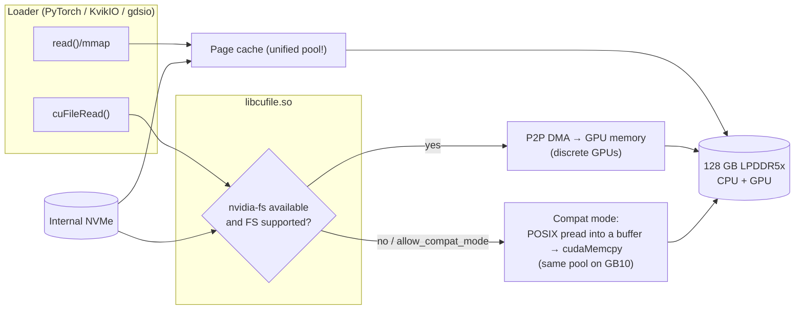

# Step 16 · GPUDirect Storage & cuFile on a Unified-Memory Machine: Detect, Configure, Measure

> **01 Ansible · Part III — Fabric & storage · Step 16 of 30** · ← [Step 15 · NFS over RDMA](15-nfs-rdma-and-parallel-file-systems.md) · [All steps](00-ansible-step-by-step-guide.md) · [Step 17 · Vault server deep dive](17-vault-server-deep-dive.md) →

| | |
|---|---|
| **You will build** | A data-driven answer to "does GDS help on my Spark?": platform detection (`gdscheck`), a managed `/etc/cufile.json`, and a three-way `gdsio` benchmark (GPU-direct vs CPU-only vs bounce) against the local NVMe, plus a model-loading comparison |
| **Hardware** | 1× DGX Spark |
| **Time** | 45 min |
| **Risk** | Low. Writes an 8 GiB test file and drops page caches during the benchmark |

---

## 1. First principles, applied to GB10

**What GDS solves on a discrete-GPU server (DGX H100/B200):** NVMe or a NIC DMAs **directly into GPU HBM** through PCIe peer-to-peer (via `nvidia-fs.ko`), skipping the "bounce buffer" in CPU RAM. That saves a memory copy and CPU cycles, and matters at 10s of GB/s.

**What's different on DGX Spark:** there's **no separate HBM**. The Blackwell GPU and Grace CPU share one coherent LPDDR5x pool over NVLink-C2C. When NVMe DMAs a file into memory, that memory is already GPU-addressable. So:

| Question | Discrete GPU (HBM) | GB10 (UMA) |
|---|---|---|
| Is there a bounce copy without GDS? | Yes (host RAM → HBM) | Only if your loader copies explicitly (e.g. `.to('cuda')` on a pageable tensor may still copy within the same pool) |
| What does `nvidia-fs` add? | P2P DMA to HBM | Little or nothing. Expect cuFile to run in **compatibility mode** (POSIX I/O under the cuFile API) |
| Where's the bottleneck? | PCIe/NVMe vs HBM bandwidth | **NVMe read speed** and the page cache (which competes for the same unified pool) |
| What should you optimise? | Enable GDS end to end | Avoid double copies and double buffering: `mmap`/safetensors zero-copy, `O_DIRECT` reads so the page cache doesn't eat GPU-usable memory |

The cuFile **API** is still worth knowing. Libraries like KvikIO and some loaders use it, and the same code gets real GDS when it runs on a data-centre DGX.

---

## 2. Architecture



| File | Purpose |
|---|---|
| `/etc/cufile.json` | cuFile config: `allow_compat_mode`, logging, I/O sizes (managed by the play; a backup is kept) |
| `/usr/local/cuda/gds/tools/gdscheck[-p]` | Platform capability report |
| `/usr/local/cuda/gds/tools/gdsio` | Benchmark tool with transfer types (`-x 0` GPU direct, `-x 1` CPU only, `-x 2` CPU→GPU) |

---

## 3. Hands-on

```yaml
# lab/playbooks/14-gds-check.yml
---
# GPUDirect Storage / cuFile on DGX Spark: detect, configure, measure.
# On GB10 the "GPU memory" IS system memory (coherent UMA), so the question is
# not "can NVMe DMA into the GPU BAR" but "what path does cuFile take, and is it
# faster than plain POSIX reads for your loader?" This play answers that with data.
- name: GDS / cuFile assessment
  hosts: spark
  become: true
  gather_facts: false
  vars:
    gds_test_dir: /srv/models
    gds_test_size: 8G
    gds_io_size: 1M
    gds_threads: 8
  tasks:
    - name: Find GDS tools shipped with the CUDA toolkit
      ansible.builtin.find:
        paths: [/usr/local/cuda/gds/tools]
        patterns: [gdscheck, gdscheck.py, gdsio]
      register: gds_tools

    - name: Offer the package if tools are missing
      ansible.builtin.shell: set -o pipefail; apt-cache search --names-only '^(nvidia-gds|gds-tools)' | awk '{print $1}'
      args: { executable: /bin/bash }
      register: gds_pkgs
      changed_when: false
      when: gds_tools.matched < 2

    - name: Install GDS userspace (if the repo offers it)
      ansible.builtin.apt:
        name: "{{ gds_pkgs.stdout_lines | select('match', '^gds-tools') | list | last }}"
        state: present
      when:
        - gds_tools.matched < 2
        - gds_pkgs.stdout_lines | select('match', '^gds-tools') | list | length > 0

    - name: Platform check
      ansible.builtin.shell: |
        set -o pipefail
        T=/usr/local/cuda/gds/tools
        if [ -x $T/gdscheck ]; then $T/gdscheck -p; elif [ -f $T/gdscheck.py ]; then python3 $T/gdscheck.py -p; else echo "gdscheck not found"; fi
      args: { executable: /bin/bash }
      register: gds_check
      changed_when: false
      failed_when: false

    - name: Is nvidia-fs loaded?
      ansible.builtin.command: lsmod
      register: gds_lsmod
      changed_when: false

    - name: Summarise platform
      ansible.builtin.set_fact:
        gds_summary:
          nvidia_fs_loaded: "{{ 'nvidia_fs' in gds_lsmod.stdout }}"
          nvme_supported: "{{ gds_check.stdout is search('NVMe\\s*:\\s*Supported') }}"
          compat_mode: "{{ gds_check.stdout is search('(?i)compat') }}"
          raw_lines: "{{ gds_check.stdout_lines | select('search', '(?i)nvme|compat|iommu|platform|driver') | list }}"

    - name: Configure /etc/cufile.json (allow compat mode, file logging)
      ansible.builtin.copy:
        dest: /etc/cufile.json
        backup: true
        mode: "0644"
        content: "{{ gds_cufile | to_nice_json }}"
      vars:
        gds_cufile:
          logging: { dir: /var/log/cufile, level: ERROR }
          properties:
            allow_compat_mode: true
            max_direct_io_size_kb: 16384
            max_device_cache_size_kb: 131072
            use_poll_mode: false
          fs: { generic: { posix_unaligned_writes: false } }

    - name: Benchmark (only if gdsio exists)
      when: gds_tools.files | map(attribute='path') | select('search', 'gdsio$') | list | length > 0
      block:
        - name: Test file directory
          ansible.builtin.file:
            path: "{{ gds_test_dir }}"
            state: directory
            mode: "0775"

        - name: Write the test file once (-I 1 = write)
          ansible.builtin.command: >-
            /usr/local/cuda/gds/tools/gdsio -f {{ gds_test_dir }}/gdsio.bin -d 0 -w {{ gds_threads }}
            -s {{ gds_test_size }} -i {{ gds_io_size }} -x 1 -I 1
          args:
            creates: "{{ gds_test_dir }}/gdsio.bin"

        - name: Read tests — 0=GPU_DIRECT, 1=CPU_ONLY, 2=CPU_GPU (bounce)
          ansible.builtin.shell: |
            set -o pipefail
            sync; echo 3 > /proc/sys/vm/drop_caches
            /usr/local/cuda/gds/tools/gdsio -f {{ gds_test_dir }}/gdsio.bin -d 0 -w {{ gds_threads }} \
              -s {{ gds_test_size }} -i {{ gds_io_size }} -x {{ item }} -I 0 -T 15 | grep -E 'Throughput'
          args: { executable: /bin/bash }
          loop: [0, 1, 2]
          register: gds_bench
          changed_when: false
          failed_when: false

        - name: Add results
          ansible.builtin.set_fact:
            gds_summary: >-
              {{ gds_summary | combine({'bench': dict(['gpu_direct', 'cpu_only', 'cpu_gpu_bounce']
                 | zip(gds_bench.results | map(attribute='stdout') | map('regex_search', 'Throughput: ([\d.]+ \w+/s)', '\1')
                 | map('default', ['n/a'], true) | map('first')))}) }}

    - name: Report
      ansible.builtin.debug:
        var: gds_summary
```

```bash
cd "01 Ansible/lab"
ansible-playbook playbooks/14-gds-check.yml -K
```

Read the result:

| Outcome | Interpretation |
|---|---|
| `nvidia_fs_loaded: false`, `compat_mode: true`, GPU-direct ≈ CPU-only | Expected on UMA. cuFile works, but there's no true P2P path. Your loader's efficiency is what matters |
| GPU-direct noticeably slower than CPU-only | Compat-mode overhead. Use plain `O_DIRECT`/mmap loaders on the Spark |
| Everything ≈ your NVMe's rated sequential read | You're storage-bound. Faster models-per-minute means fewer bytes (quantised weights) or a cache (Step 15) |
| `gdscheck not found` and no package | This DGX OS image has no GDS tools. Skip; the cuFile API isn't needed on this box |

### 3.1 The comparison that actually matters: model load time

```bash
# inside an NGC PyTorch container on the Spark, with /srv/models mounted
docker run --rm --gpus all -v /srv/models:/models nvcr.io/nvidia/pytorch:25.11-py3 python - <<'PY'
import time, torch, os, glob
from safetensors.torch import load_file
f = sorted(glob.glob("/models/**/*.safetensors", recursive=True))[0]
os.system("sync")  # (drop caches from the host between runs: echo 3 > /proc/sys/vm/drop_caches)
t=time.time(); sd = load_file(f, device="cuda"); torch.cuda.synchronize(); dt=time.time()-t
gb = sum(v.numel()*v.element_size() for v in sd.values())/1e9
print(f"{f}: {gb:.2f} GB in {dt:.2f}s -> {gb/dt:.2f} GB/s")
PY
```

Run it cold (after dropping caches) and warm. On a UMA machine the warm run is fast because the page cache already holds the weights, **but that cache is now occupying memory the model also needs**. That trade-off is the operational lesson of this volume.

---

## 4. Integrations

| System | Relevance |
|---|---|
| Telemetry (Step 12) | `spark_uma_page_cache_bytes` shows how much of the unified pool the file cache holds after loads |
| Emergency runbook (Step 29) | "UMA pressure" remediation drops caches, which is safe but makes the next load cold |
| NFS/RDMA cache (Step 15) | For a second Spark, a shared model store avoids downloading twice; cuFile over NFS runs in compat mode too |
| Data-centre DGX | The same `14-gds-check.yml` on an H100/B200 node should show `nvidia_fs_loaded: true`, NVMe supported, and GPU-direct > bounce. Keep the playbook for that day |

## 5. Troubleshooting & diagnostics

| Symptom | Diagnose | Fix |
|---|---|---|
| `cuFileDriverOpen` fails in an app | `/var/log/cufile/cufile.log`; `gdscheck -p` | Set `allow_compat_mode: true` (the play does this) |
| `gdsio` error `-5` / `EIO` on `-x 0` | cufile log | FS/device not GDS-capable, which is expected here; use `-x 1/2` for baselines |
| Benchmarks vary wildly run to run | Page cache | The play drops caches before each read test; don't benchmark while other containers load models |
| Model loads fast, then CUDA OOM at "half-full" | `free -g` → `buff/cache` high | UMA: the page cache holds the weights. `echo 3 > /proc/sys/vm/drop_caches` after loading, or use `O_DIRECT` loaders |
| `apt` has no gds package | `apt-cache search gds` | Not shipped for this platform/release. Nothing to fix |

## 6. Validation

- [ ] `gds_summary` recorded for your Spark (flags + the three throughputs).
- [ ] Cold and warm safetensors load times recorded, with page-cache size before and after.
- [ ] You can explain to a colleague why GDS helps an H100 box and does little on a GB10.
