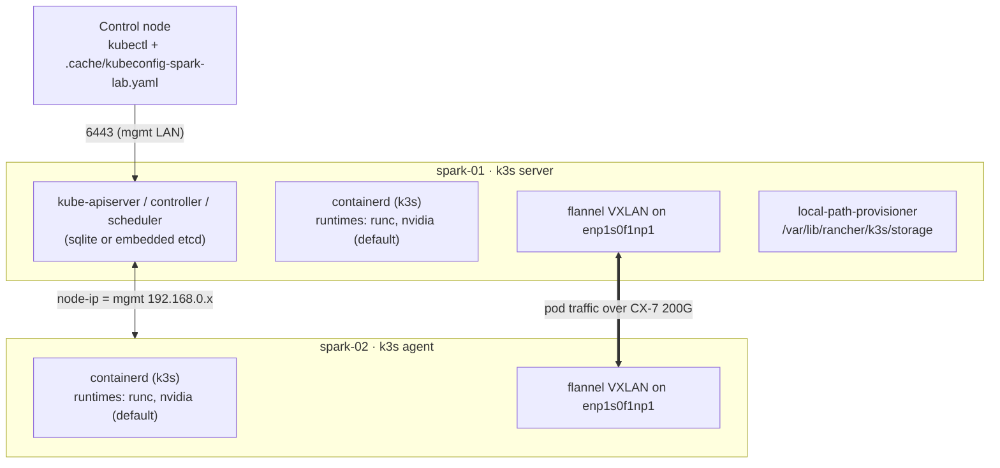

# Volume 16 — Kubernetes on DGX Spark with k3s: GPU-Ready Bootstrap, Fabric-Aware Pod Networking, Upgrades (and When Kubespray Is the Right Tool)

> **Module 01 · Part IV — Platforms** · Prev: [15 NFS/RDMA](15-parallel-file-system-client-orchestration.md) · Next: [17 GPU Operator](17-nvidia-gpu-operator-helm-automation.md)

| | |
|---|---|
| **You will build** | A k3s cluster (spark-01 server, spark-02 agent) where GPU pods work out of the box (`default-runtime: nvidia`), pod-to-pod traffic rides the 200G CX-7 link (flannel on the fabric interface), the OS keeps a protected memory reserve on the unified pool, and the kubeconfig lands on your control node |
| **Hardware** | 1–2× DGX Spark |
| **Time** | 45 min |
| **Risk** | Low–medium. Installs services; uninstall with `/usr/local/bin/k3s-uninstall.sh` / `k3s-agent-uninstall.sh` |

---

## 1. Why k3s here (and when Kubespray instead)

| | k3s | Kubespray (kubeadm-based) |
|---|---|---|
| Footprint | One ~70 MB binary; embedded containerd, flannel, CoreDNS, local-path storage | Full upstream components, many Ansible roles |
| Time to a cluster | Minutes | 20–40 min |
| Fits a 1–2 node desk lab with 128 GB shared with the GPU | ✅ | Works, but heavier |
| HA control plane | Embedded etcd with 3 servers | Stacked or external etcd, 3+ masters |
| When you move to a DGX cluster | Still viable at the edge | **Typical choice**, alongside NVIDIA Base Command Manager, which deploys Kubernetes on DGX clusters itself |

The inventory model carries over. Kubespray's groups are `kube_control_plane`, `kube_node` and `etcd`. Map them from the same functional-group idea you used for `k3s_server`/`k3s_agent` (Volume 03A).

## 2. Architecture

### 2.1 HLD



### 2.2 LLD: the config file

```yaml
# lab/roles/k3s_cluster/templates/config.yaml.j2
# {{ ansible_managed }}
# /etc/rancher/k3s/config.yaml — read by both 'k3s server' and 'k3s agent'
node-ip: {{ k3s_cluster_node_ip }}
flannel-iface: {{ k3s_cluster_flannel_iface }}

write-kubeconfig-mode: "0640"
tls-san:
  - {{ k3s_cluster_node_ip }}
  - {{ inventory_hostname }}
disable:

  - {{ d }}

flannel-backend: vxlan

server: https://{{ hostvars[groups[k3s_cluster_server_group][0]].k3s_cluster_node_ip | default(hostvars[groups[k3s_cluster_server_group][0]].ansible_host) }}:6443


default-runtime: nvidia

kubelet-arg:

  - "{{ a }}"

node-label:
  - "nvidia.com/gpu.product=GB10"
  - "spark.lab/node-index={{ spark_node_index | default(0) }}"
```

| Key | Value | Reason |
|---|---|---|
| `node-ip` | mgmt IP | API, kubelet and SSH on the management network |
| `flannel-iface` | CX-7 netdev when there are 2+ Sparks | Pod-to-pod VXLAN over 200G instead of 10G |
| `default-runtime: nvidia` | on | k3s auto-detects `nvidia-container-runtime` at startup and adds an `nvidia` runtime to its containerd; making it the default means GPU pods need no `runtimeClassName` (convenient for a lab; for multi-tenant clusters use a RuntimeClass instead) |
| `system-reserved` / `kube-reserved` / `eviction-hard` | 8 GiB + 2 GiB reserve, evict < 4 GiB | On UMA, pods (and their GPU allocations) share memory with DGX OS. Without a reserve, a big model can starve sshd and the Dashboard |
| `disable: [traefik]` | — | Keep 80/443 free; choose your own ingress |
| `node-label` | `nvidia.com/gpu.product=GB10`, node index | Scheduling selectors before GPU Operator's NFD labels exist |

---

## 3. The role

```yaml
# lab/roles/k3s_cluster/tasks/main.yml
---
- name: Determine this node's k3s role
  ansible.builtin.set_fact:
    k3s_cluster_role: "{{ 'server' if inventory_hostname in groups[k3s_cluster_server_group] else 'agent' }}"

- name: Sanity — nvidia-container-runtime must exist for GPU pods
  ansible.builtin.stat:
    path: /usr/bin/nvidia-container-runtime
  register: k3s_cluster_ncr
  failed_when: not k3s_cluster_ncr.stat.exists

- name: Ensure k3s config directory exists
  ansible.builtin.file:
    path: /etc/rancher/k3s
    state: directory
    owner: root
    group: root
    mode: "0755"

- name: Write k3s config
  ansible.builtin.template:
    src: config.yaml.j2
    dest: /etc/rancher/k3s/config.yaml
    owner: root
    group: root
    mode: "0600"
  register: k3s_cluster_config

- name: Check installed k3s version
  ansible.builtin.command: k3s --version
  register: k3s_cluster_installed
  changed_when: false
  check_mode: false        # read-only probe: must also run under --check (drift detection)
  failed_when: false

- name: Download installer
  ansible.builtin.get_url:
    url: "{{ k3s_cluster_install_url }}"
    dest: /usr/local/bin/k3s-install.sh
    mode: "0755"
  when: k3s_cluster_version not in k3s_cluster_installed.stdout | default('')

# --------------------------------------------------------------- server
- name: Install / upgrade k3s server
  ansible.builtin.command: /usr/local/bin/k3s-install.sh
  environment:
    INSTALL_K3S_VERSION: "{{ k3s_cluster_version }}"
    INSTALL_K3S_EXEC: server
  changed_when: true
  when:
    - k3s_cluster_role == 'server'
    - k3s_cluster_version not in k3s_cluster_installed.stdout | default('')

- name: Restart server on config change
  ansible.builtin.service:
    name: k3s
    state: restarted
  when:
    - k3s_cluster_role == 'server'
    - k3s_cluster_config is changed
    - k3s_cluster_version in k3s_cluster_installed.stdout | default('')

- name: Wait for API server
  ansible.builtin.command: k3s kubectl get --raw /readyz
  register: k3s_cluster_ready
  until: k3s_cluster_ready.rc == 0
  retries: 30
  delay: 5
  changed_when: false
  check_mode: false        # read-only probe: must also run under --check (drift detection)
  when: k3s_cluster_role == 'server'

- name: Read join token
  ansible.builtin.slurp:
    src: /var/lib/rancher/k3s/server/node-token
  register: k3s_cluster_token_raw
  no_log: true
  when: k3s_cluster_role == 'server'

# --------------------------------------------------------------- agents
- name: Install / upgrade k3s agent
  ansible.builtin.command: /usr/local/bin/k3s-install.sh
  environment:
    INSTALL_K3S_VERSION: "{{ k3s_cluster_version }}"
    INSTALL_K3S_EXEC: agent
    K3S_TOKEN: "{{ hostvars[groups[k3s_cluster_server_group][0]].k3s_cluster_token_raw.content | b64decode | trim }}"
  no_log: true
  changed_when: true
  when:
    - k3s_cluster_role == 'agent'
    - k3s_cluster_version not in k3s_cluster_installed.stdout | default('')

- name: Restart agent on config change
  ansible.builtin.service:
    name: k3s-agent
    state: restarted
  when:
    - k3s_cluster_role == 'agent'
    - k3s_cluster_config is changed
    - k3s_cluster_version in k3s_cluster_installed.stdout | default('')

# --------------------------------------------------------------- verify
- name: Wait for all nodes Ready
  ansible.builtin.command: >-
    k3s kubectl wait --for=condition=Ready node --all --timeout=180s
  changed_when: false
  check_mode: false        # read-only probe: must also run under --check (drift detection)
  run_once: true
  delegate_to: "{{ groups[k3s_cluster_server_group][0] }}"

- name: Confirm containerd registered the nvidia runtime
  ansible.builtin.command: >-
    grep -A2 'runtimes."nvidia"' /var/lib/rancher/k3s/agent/etc/containerd/config.toml
  register: k3s_cluster_rt
  changed_when: false
  check_mode: false        # read-only probe: must also run under --check (drift detection)
  failed_when: k3s_cluster_rt.rc != 0

- name: Fetch kubeconfig to the control node
  ansible.builtin.fetch:
    src: /etc/rancher/k3s/k3s.yaml
    dest: "{{ k3s_cluster_kubeconfig_local }}"
    flat: true
  when: k3s_cluster_role == 'server'

- name: Point kubeconfig at the server's mgmt IP
  ansible.builtin.replace:
    path: "{{ k3s_cluster_kubeconfig_local }}"
    regexp: 'https://127\.0\.0\.1:6443'
    replace: "https://{{ k3s_cluster_node_ip }}:6443"
  delegate_to: localhost
  become: false
  when: k3s_cluster_role == 'server'
```

Things worth noticing:

- **Version-gated install.** The installer runs only if `k3s --version` doesn't already contain the pinned version, so re-runs are no-ops and bumping `k3s_cluster_version` is an upgrade.
- **The join token is read with `slurp`** on the server and passed through `hostvars` to agents under `no_log`. It's never written to disk on the control node.
- **Runtime proof:** the role greps k3s's generated containerd config for `runtimes."nvidia"`. If it's missing, the NVIDIA toolkit wasn't there when k3s started.

---

## 4. Hands-on

```bash
cd "01 Ansible/lab"
ansible-playbook playbooks/05-k3s.yml -K
export KUBECONFIG=$PWD/.cache/kubeconfig-spark-lab.yaml
kubectl get nodes -o wide
kubectl describe node spark-01 | sed -n '/Allocatable/,/System Info/p'
```

### 4.1 A GPU pod *before* any device plugin

With `default-runtime: nvidia`, a pod can see the GPU even without the GPU Operator. That's useful for understanding what the operator adds (scheduling and accounting):

```bash
kubectl run smi --rm -it --restart=Never --image=nvcr.io/nvidia/cuda:13.0.1-base-ubuntu24.04 \
  --env NVIDIA_VISIBLE_DEVICES=all -- nvidia-smi -L
```

It works, but Kubernetes has no idea a GPU was used: no `nvidia.com/gpu` resource, so no scheduling guarantees. Volume 17 fixes that.

### 4.2 Verify pod traffic uses the fabric

```bash
kubectl get pods -A -o wide | head
ssh nvidia@192.168.0.100 'ip -d link show flannel.1 | grep -o "dev [^ ]*"'   # → dev enp1s0f1np1
kubectl run a --image=nicolaka/netshoot --overrides='{"spec":{"nodeName":"spark-01"}}' -- sleep 1d
kubectl run b --image=nicolaka/netshoot --overrides='{"spec":{"nodeName":"spark-02"}}' -- sleep 1d
B=$(kubectl get pod b -o jsonpath='{.status.podIP}')
kubectl exec b -- iperf3 -s -D; kubectl exec a -- iperf3 -c $B -P 4 -t 10
```

VXLAN over the CX-7 should comfortably beat the 10GbE ceiling. It won't reach RDMA numbers; for that, use Volume 13's secondary network.

### 4.3 Upgrade k3s

```bash
# bump k3s_cluster_version in roles/k3s_cluster/defaults/main.yml (or -e), then:
ansible-playbook playbooks/05-k3s.yml -K -e k3s_cluster_version=v1.33.1+k3s1 --check   # what would run
ansible-playbook playbooks/05-k3s.yml -K -e k3s_cluster_version=v1.33.1+k3s1
```

Server first, then agents (`order: sorted` with the server listed first). Skip at most one minor version at a time. Drain an agent (Volume 24) before upgrading it if workloads are running.

---

## 5. Integrations

| Next step | Depends on |
|---|---|
| GPU Operator (Volume 17) | the containerd `nvidia` runtime; `toolkit.enabled=false` because DGX OS provides it |
| Multus/RDMA (Volume 13) | k3s CNI paths (`/var/lib/rancher/k3s/agent/etc/cni/net.d`, `/var/lib/rancher/k3s/data/cni`) |
| AWX (Volume 02B/20) | runs on this cluster; its PVC uses `local-path` |
| NFS models (Volume 15) | `hostPath: /mnt/models` or `csi-driver-nfs` |
| Vault (Volume 19) | pods get secrets via Vault Agent Injector or External Secrets |

## 6. Troubleshooting & diagnostics

| Symptom | Diagnose | Fix |
|---|---|---|
| Agent never joins | `journalctl -u k3s-agent -f` → `failed to get CA certs` / `401` | Wrong server URL or token; the server's `tls-san` must include the IP the agent uses |
| Node `NotReady` | `kubectl describe node`; `journalctl -u k3s -n 100` | CNI: `flannel-iface` points at a down interface (cable pulled?). Fall back to `mgmt_interface` |
| Role fails "nvidia runtime registered" check | `grep -n nvidia /var/lib/rancher/k3s/agent/etc/containerd/config.toml` | Toolkit installed after k3s started: `systemctl restart k3s` (or `k3s-agent`) |
| GPU pod: `failed to create shim: ... nvidia-container-runtime: not found` | `which nvidia-container-runtime` | Run Volume 08 first; restart k3s |
| Pods evicted with `MemoryPressure` while a model loads | `kubectl describe node \| grep -A5 Conditions`; `free -g` | Working as designed (eviction at < 4 GiB). Reduce model or batch size; stop idle pods; tune the reserve |
| kubectl from the control node: `x509: certificate is valid for 127.0.0.1` | kubeconfig `server:` | The role rewrites `127.0.0.1` to the mgmt IP; re-fetch or edit |
| `ImagePullBackOff` with `no match for platform` | `kubectl describe pod` | amd64-only image; find an arm64 build (Volume 08 §3.4) |

## 7. Validation

- [ ] `kubectl get nodes`: all `Ready`, `ARCH=arm64`.
- [ ] `flannel.1` bound to the CX-7 interface on 2-node setups; pod-to-pod iperf beats 10 Gb/s.
- [ ] The `smi` pod prints the GB10.
- [ ] Re-running `05-k3s.yml` reports no installs (version-gated).
