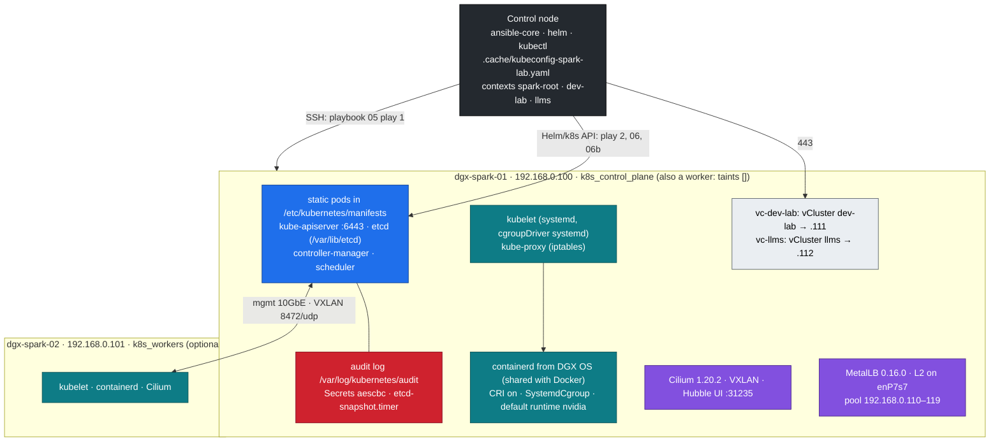

# Volume 16 — Kubernetes on DGX Spark with kubeadm: the Root Cluster, Cilium, MetalLB and Two vClusters (and When Kubespray)

> **Module 01 · Part IV — Platforms** · Prev: [15 NFS/RDMA](15-parallel-file-system-client-orchestration.md) · Next: [17 GPU Operator](17-nvidia-gpu-operator-helm-automation.md) · Deep dive on what you build here: 02 Kubernetes [01 Core architecture](../02%20Kubernetes/01-kubernetes-core-architecture.md), [27 Nested clusters](../02%20Kubernetes/27-nested-clusters-with-vcluster.md)

| | |
|---|---|
| **You will build** | The lab's **root** Kubernetes cluster, `spark-root`: kubeadm v1.36.5 on dgx-spark-01, which is control plane *and* worker. It gets containerd with the NVIDIA runtime as default, an audit log, encrypted Secrets and etcd snapshots on a timer, Cilium as the CNI and MetalLB for LoadBalancer IPs. Then the two vClusters `dev-lab` and `llms` go inside it, and one kubeconfig on your control node holds three contexts |
| **Hardware** | 1 DGX Spark (dgx-spark-02 optional: it joins as a worker) |
| **Time** | 60 min (about 20 of it image pulls) |
| **Risk** | Medium. Rewrites `/etc/containerd/config.toml` (the DGX OS original is kept as `.dgxos-orig`) and turns swap off. `playbooks/99-reset-kubernetes.yml` removes all of it again (§8) |
| **Clusters** | `spark-root` (everything in §3–§4.4), `dev-lab` and `llms` (§4.5) |
| **Lab files** | [`roles/kubeadm_cluster`](lab/roles/kubeadm_cluster), [`roles/cilium`](lab/roles/cilium), [`roles/metallb`](lab/roles/metallb), [`roles/vclusters`](lab/roles/vclusters), [`playbooks/05-kubernetes.yml`](lab/playbooks/05-kubernetes.yml), [`06b-vclusters.yml`](lab/playbooks/06b-vclusters.yml), [`99-reset-kubernetes.yml`](lab/playbooks/99-reset-kubernetes.yml), [`inventory/hosts.yml`](lab/inventory/hosts.yml) |

---

## 1. Why kubeadm in our own roles (and when Kubespray)

A datacenter GPU cluster is almost always "upstream Kubernetes bootstrapped by kubeadm": static-pod control plane, stacked or external etcd, the distro's containerd, a CNI you choose. The lab builds exactly that, so the paths, certificates, upgrade commands and failure modes you meet on the Spark are the ones you will meet on a DGX cluster.

| | kubeadm via the lab's own roles (this volume) | Kubespray (kubeadm-based) |
|---|---|---|
| What it is | 5 task files and 6 templates around `kubeadm init` / `join` | A large Ansible project: 100+ roles, every CNI, every OS, HA, add-ons |
| Readable in one sitting | ✅ every line is shown below | No. You configure it through group_vars rather than read it |
| Fits a 1–2 node lab on 128 GB of unified memory | ✅ nothing you didn't ask for | Works, but installs and checks far more than one Spark needs |
| Teaching value | You see each kubeadm phase, the containerd edits, the kubeconfig merge | Hides them (that is its job) |
| HA control plane | `controlPlaneEndpoint` is already set; add control planes by hand (02 Kubernetes Vol 01 §8.2) | Built in: `kube_control_plane` × 3, `etcd` group |
| When you move to a DGX fleet | Keep it as the reference for *what* must happen on a node | **The scale-out path**, alongside NVIDIA Base Command Manager, which deploys Kubernetes on DGX clusters itself |

The inventory model carries over. Kubespray's groups are `kube_control_plane`, `kube_node` and `etcd`; this lab's are `k8s_control_plane` and `k8s_workers` (etcd is stacked on the control plane). Mapping one onto the other is a `children:` block in the inventory (Volume 03A).

> An earlier version of this lab ran k3s. The role refuses to install next to it (ports 6443/10250 and the iptables chains would clash), and `99-reset-kubernetes.yml -e reset_remove_k3s=true` removes it (§8).

## 2. Architecture

### 2.1 HLD



Two networks, two jobs. The **pod network** (Cilium VXLAN) and the API run on the 10GbE management LAN, because `node-ip` is the mgmt address. **Bulk GPU traffic** (NCCL, RDMA) does not go through the pod network at all. It uses the 200G CX-7 fabric through a second pod interface from Multus (Volume 13). The old lab tunnelled pod traffic over the CX-7 instead. That was faster for TCP, but it still couldn't carry RDMA, and it tied the cluster's health to a cable.

### 2.2 Play order

```yaml
# lab/playbooks/05-kubernetes.yml
- name: Kubeadm (control plane first, then workers)
  hosts: k8s_control_plane:k8s_workers
  become: true
  order: sorted
  serial: "{{ groups['k8s_control_plane'] | length }}"   # control plane must finish before workers join
  roles:
    - role: kubeadm_cluster

- name: Pod network (Cilium) and LoadBalancer IPs (MetalLB)
  hosts: localhost
  connection: local
  gather_facts: false
  roles:
    - role: cilium
    - role: metallb
```

| Stage | Runs on | Talks to | Result |
|---|---|---|---|
| `05` play 1 · `kubeadm_cluster` | each Spark over SSH, `become` | the host | containerd ready, packages held, `kubeadm init` (dgx-spark-01) / `kubeadm join` (dgx-spark-02), context `spark-root` written on the control node |
| `05` play 2 · `cilium`, `metallb` | control node | root API with context `spark-root` | nodes `Ready`, CoreDNS running, LoadBalancer IPs available |
| `06` · `gpu_operator` | control node | root API | 15 GPU time-slices per node (Volume 17) |
| `06b` · `vclusters` | control node | root API, then each vCluster API | storage, budgets, `dev-lab` and `llms`, contexts merged |

`serial` equal to the number of control planes (1) plus `order: sorted` makes dgx-spark-01 a batch of its own. dgx-spark-02 starts only after `kubeadm init` has finished. The ordering comes from the names: if you add a worker whose name sorts before the control plane's, list the groups explicitly or give the control plane its own play.

### 2.3 Inventory

```yaml
# lab/inventory/hosts.yml (excerpt)
    k8s_control_plane:
      hosts:
        dgx-spark-01:
    k8s_workers:
      hosts:
        dgx-spark-02:
```

Single Spark: remove dgx-spark-02 from `spark` and `k8s_workers`. The cluster is complete with one node, because the control plane carries no taint.

### 2.4 LLD: the kubeadm config

kubeadm reads one file, once, at `kubeadm init`. The role renders it to `/etc/kubernetes/kubeadm-config.yaml`. 02 Kubernetes [Volume 01](../02%20Kubernetes/01-kubernetes-core-architecture.md) walks through the running result; here is what Ansible decides:

```yaml
# lab/roles/kubeadm_cluster/templates/kubeadm-init.yaml.j2 (abridged)
apiVersion: kubeadm.k8s.io/v1beta4
kind: InitConfiguration
localAPIEndpoint:
  advertiseAddress: {{ kubeadm_cluster_node_ip }}
nodeRegistration:
  criSocket: unix:///run/containerd/containerd.sock
  taints: []                                 # no control-plane NoSchedule taint
  kubeletExtraArgs:
    - { name: node-ip, value: "{{ kubeadm_cluster_node_ip }}" }
    - { name: node-labels, value: "{{ kubeadm_cluster_node_labels | join(',') }}" }
---
apiVersion: kubeadm.k8s.io/v1beta4
kind: ClusterConfiguration
clusterName: {{ kubeadm_cluster_name }}               # spark-root
kubernetesVersion: v{{ kubeadm_cluster_version }}     # v1.36.5
controlPlaneEndpoint: "{{ kubeadm_cluster_api_endpoint }}"   # 192.168.0.100:6443
networking:
  podSubnet: 10.42.0.0/16
  serviceSubnet: 10.43.0.0/16                         # → cluster DNS 10.43.0.10
apiServer:
  extraArgs:                                          # + extraVolumes mounting the three host dirs
    - { name: audit-policy-file, value: /etc/kubernetes/audit/audit-policy.yaml }
    - { name: audit-log-path, value: /var/log/kubernetes/audit/audit.log }
    - { name: encryption-provider-config, value: /etc/kubernetes/encryption/config.yaml }
controllerManager: { extraArgs: [{ name: bind-address, value: 0.0.0.0 }] }   # :10257 for Prometheus
scheduler:         { extraArgs: [{ name: bind-address, value: 0.0.0.0 }] }   # :10259
etcd:
  local:
    dataDir: /var/lib/etcd
    extraArgs: [{ name: listen-metrics-urls, value: "http://0.0.0.0:2381" }]
---
apiVersion: kubelet.config.k8s.io/v1beta1
kind: KubeletConfiguration
cgroupDriver: systemd
maxPods: 200
systemReserved: { cpu: "2", memory: "8Gi" }
kubeReserved:   { cpu: "1", memory: "2Gi" }
evictionHard: { memory.available: "4Gi", nodefs.available: "10%", nodefs.inodesFree: "5%", imagefs.available: "15%" }
---
apiVersion: kubeproxy.config.k8s.io/v1alpha1
kind: KubeProxyConfiguration
mode: iptables
```

| Setting | Value | Reason |
|---|---|---|
| `taints: []` | no taint | dgx-spark-01 is the only node. Without this, nothing but DaemonSets could run on it |
| `controlPlaneEndpoint` | `192.168.0.100:6443` | A stable endpoint, so dgx-spark-02 (or more control planes later) can join. Change it to a VIP *before* `init` if you plan HA; it is baked into every certificate and kubeconfig |
| Pod / Service CIDR | `10.42.0.0/16` / `10.43.0.0/16` | Kept from the earlier lab, so every address in the course stays valid |
| `systemReserved` + `kubeReserved` + `evictionHard` | 3 CPU, 10 GiB, evict below 4 GiB | Unified memory: pods, their GPU allocations and DGX OS share ~119.7 GiB. Without a reserve, a big model can starve sshd and the DGX Dashboard. Allocatable ends up 17 CPU / ≈105.7 GiB |
| `evictionHard` lists all four signals | — | Setting the map **replaces** kubelet's defaults; a signal you omit is no longer enforced |
| `maxPods: 200` | — | Two vClusters plus platform add-ons on one node pass the default 110 quickly: every tenant pod is a real pod here |
| `bind-address: 0.0.0.0`, etcd metrics `:2381` | — | kube-prometheus-stack scrapes them from the pod network |
| kube-proxy `mode: iptables` | Cilium with `kubeProxyReplacement=false` | 02 Kubernetes Vol 07 reads the `KUBE-SVC-*` chains. Cilium's kube-proxy replacement (eBPF) is the faster alternative; turn it on only together with removing kube-proxy |
| node labels | `spark.lab/gpu=gb10`, `spark.lab/node-index` | Lab-owned selectors: they exist before the GPU Operator, and GFD never rewrites them (it owns `nvidia.com/gpu.product`) |

### 2.5 LLD: one kubeconfig, three contexts

```text
01 Ansible/lab/.cache/kubeconfig-spark-lab.yaml          (mode 0600, git-ignored)
  context spark-root → cluster spark-root https://192.168.0.100:6443   user spark-root-admin   (kubeadm_cluster role)
  context dev-lab    → cluster dev-lab    https://192.168.0.111:443    user dev-lab            (vclusters role)
  context llms       → cluster llms       https://192.168.0.112:443    user llms               (vclusters role)
.cache/kubeconfig-dev-lab.yaml, .cache/kubeconfig-llms.yaml   standalone copies, one per vCluster
```

Both roles **merge** rather than overwrite: each one reads the file, drops only the entries it owns (by name) and appends its own. Re-running 05 after 06b keeps the vCluster contexts; re-running 06b keeps `spark-root`. Every command in this course names its context (`kubectl --context spark-root …`, `helm --kube-context llms …`). With three clusters in one file, a bare `kubectl` is a guess.

---

## 3. The roles

### 3.1 `kubeadm_cluster`: one task file per concern

```yaml
# lab/roles/kubeadm_cluster/tasks/main.yml
- name: Determine this node's Kubernetes role
  ansible.builtin.set_fact:
    kubeadm_cluster_role: >-
      {{ 'control_plane' if inventory_hostname in groups[kubeadm_cluster_control_plane_group] else 'worker' }}
- { name: Host prerequisites (no k3s, swap off, kernel modules, sysctls), ansible.builtin.import_tasks: prereqs.yml }
- { name: Containerd with CRI, systemd cgroups and the NVIDIA runtime, ansible.builtin.import_tasks: containerd.yml }
- { name: Kubernetes packages from pkgs.k8s.io (held), ansible.builtin.import_tasks: packages.yml }
- name: Control plane (kubeadm init, audit, encryption, etcd snapshots)
  ansible.builtin.include_tasks: control_plane.yml
  when: kubeadm_cluster_role == 'control_plane'
- name: Workers (kubeadm join)
  ansible.builtin.include_tasks: workers.yml
  when: kubeadm_cluster_role == 'worker'
- name: Every node is registered with the API server (Ready comes after the CNI)
  # kubectl get node <me> -o name, delegated to the control plane, retried 30 × 5 s
```

| File | Does | Idempotence key |
|---|---|---|
| `prereqs.yml` | Fails if `/usr/local/bin/k3s` exists; checks `/usr/bin/nvidia-container-runtime`; `swapoff -a` and comments swap out of `/etc/fstab`; loads `overlay`, `br_netfilter` (persisted in `/etc/modules-load.d/kubernetes.conf`); sets `bridge-nf-call-iptables`, `bridge-nf-call-ip6tables`, `ip_forward` in `/etc/sysctl.d/90-kubernetes.conf` | All declarative modules |
| `containerd.yml` | Makes DGX OS's containerd usable by kubelet (below) | Regenerates only when CRI is disabled or `SystemdCgroup` is missing |
| `packages.yml` | pkgs.k8s.io key + repo **per minor** (`/etc/apt/keyrings/kubernetes-v1.36.asc`), installs `kubelet`, `kubeadm`, `kubectl` `=1.36.5-1.1`, then **holds** them | Exact version pin + `dpkg_selections` |
| `control_plane.yml` | Audit policy, encryption key, kubeadm config, image pre-pull, `kubeadm init`, admin kubeconfig on the Spark (context renamed to `spark-root`), context merge on the control node, etcdctl/etcdutl, snapshot timer | `kubeadm init` only if `/etc/kubernetes/admin.conf` is absent |
| `workers.yml` | 30-minute bootstrap token + CA hash from the control plane, `JoinConfiguration`, `kubeadm join`, removes the join file | Only if `/etc/kubernetes/kubelet.conf` is absent |

#### containerd: the part that differs from a stock Ubuntu box

DGX OS ships Docker's `containerd.io`, and its stock `config.toml` **disables the CRI plugin** because Docker doesn't need it. kubelet talks to containerd only through CRI, so the role converges three things:

```yaml
# lab/roles/kubeadm_cluster/tasks/containerd.yml (core)
- name: Decide whether the config needs regenerating
  ansible.builtin.set_fact:
    kubeadm_cluster_ctd_regen: >-
      {{ kubeadm_cluster_ctd_raw.content is not defined
         or ('SystemdCgroup' not in (kubeadm_cluster_ctd_raw.content | b64decode))
         or ((kubeadm_cluster_ctd_raw.content | b64decode) is search('disabled_plugins\s*=\s*\[[^\]]*"cri"')) }}
# → back up to config.toml.dgxos-orig (once), then: containerd config default > config.toml

- name: Use the systemd cgroup driver (must match kubelet's cgroupDriver)
  ansible.builtin.replace:
    path: "{{ kubeadm_cluster_containerd_config }}"
    regexp: 'SystemdCgroup\s*=\s*false'
    replace: "SystemdCgroup = true"
  notify: Restart containerd

- name: Register the NVIDIA runtime (nvidia-ctk edits config.toml in place)
  ansible.builtin.command: >-
    nvidia-ctk runtime configure --runtime=containerd
    --config={{ kubeadm_cluster_containerd_config }}
    {{ '--set-as-default' if kubeadm_cluster_default_runtime_nvidia | bool else '' }}
  when: >-
    kubeadm_cluster_ctd_has_nvidia.rc != 0 or
    (kubeadm_cluster_default_runtime_nvidia | bool and kubeadm_cluster_ctd_nvidia.rc != 0)
  notify: Restart containerd

- name: Apply containerd changes before kubelet starts
  ansible.builtin.meta: flush_handlers
# → /etc/crictl.yaml pointing at /run/containerd/containerd.sock
```

| Setting | Why |
|---|---|
| CRI enabled (full default config) | Otherwise `kubeadm init` preflight fails: `container runtime is not running` |
| `SystemdCgroup = true` | kubelet uses `cgroupDriver: systemd`. A mismatch gives pods that start and then get killed, or a kubelet that never settles |
| default runtime `nvidia` | GPU pods work with the device plugin without `runtimeClassName`. For strict multi-tenancy set `kubeadm_cluster_default_runtime_nvidia: false` and use the `nvidia` RuntimeClass instead |
| `/etc/crictl.yaml` | `sudo crictl ps` works without flags (the 02 lab scripts rely on it) |

Docker keeps working. It uses containerd's `moby` namespace, kubelet uses `k8s.io`: one daemon, two tenants, `sudo ctr namespaces ls` shows both.

The two `grep` probes carry `check_mode: false`. They are read-only, so they also run under `--check`, and the drift report in Volume 22 can tell "runtime missing" from "not checked".

#### Control plane: what Ansible owns around `kubeadm init`

| Item | Path | Note |
|---|---|---|
| Audit policy | `/etc/kubernetes/audit/audit-policy.yaml` ([`files/audit-policy.yaml`](lab/roles/kubeadm_cluster/files/audit-policy.yaml)) | Secrets/ConfigMaps at Metadata only; node and kube-system reads dropped; **full RequestResponse for writes in `vc-dev-lab`, `vc-llms`, `gpu-operator`, `platform-tools`**. An identical copy is kept at `02 Kubernetes/lab/kubeadm/audit-policy.yaml` (the 02 lab tests diff them) |
| Audit log | `/var/log/kubernetes/audit/audit.log` | 7 days, 5 × 100 MB |
| Encryption config | `/etc/kubernetes/encryption/config.yaml` (0600) | `aescbc` key `key1` from `openssl rand -base64 32`, written **only if the file doesn't exist**, under `no_log`. Re-running never rotates the key by accident |
| kubeadm config | `/etc/kubernetes/kubeadm-config.yaml` | If it changes on an existing cluster, the role doesn't re-init. It prints the `kubeadm init phase control-plane all` command to apply it |
| etcd tools | `/usr/local/bin/etcdctl`, `etcdutl` | Version read from the image tag in `/etc/kubernetes/manifests/etcd.yaml`, arm64 release downloaded only when it differs |
| Snapshots | `/usr/local/sbin/etcd-snapshot` → `/var/lib/etcd-snapshots`, `etcd-snapshot.timer` | Every 6 h (`*-*-* 00/6:00:00`), newest 20 kept |

```bash
# lab/roles/kubeadm_cluster/templates/etcd-snapshot.sh.j2 (rendered)
ETCDCTL_API=3 etcdctl \
  --endpoints=https://127.0.0.1:2379 \
  --cacert=/etc/kubernetes/pki/etcd/ca.crt \
  --cert=/etc/kubernetes/pki/etcd/healthcheck-client.crt \
  --key=/etc/kubernetes/pki/etcd/healthcheck-client.key \
  snapshot save "$dir/$name"
etcdutl snapshot status "$dir/$name" -w table
```

> **Back up the encryption key with the snapshots.** An etcd snapshot without `/etc/kubernetes/encryption/config.yaml` restores every Secret as unreadable ciphertext. Store the key in Vault (Volume 19). The etcd snapshot does **not** contain the vClusters' state: each keeps its own SQLite database on a PVC (02 Kubernetes Vol 27 §6.7).

#### Workers: join without a long-lived secret

```yaml
# lab/roles/kubeadm_cluster/templates/kubeadm-join.yaml.j2
apiVersion: kubeadm.k8s.io/v1beta4
kind: JoinConfiguration
discovery:
  bootstrapToken:
    apiServerEndpoint: "{{ kubeadm_cluster_api_endpoint }}"
    token: "{{ kubeadm_cluster_token.stdout }}"           # kubeadm token create --ttl 30m (delegated, no_log)
    caCertHashes:
      - "sha256:{{ kubeadm_cluster_ca_hash.stdout }}"     # pins the API server the worker trusts
```

The token exists for 30 minutes, the rendered file is deleted after `kubeadm join`, and the CA hash means a worker can't be tricked into joining an impostor API server.

### 3.2 `cilium`: CNI only

```yaml
# lab/roles/cilium/defaults/main.yml (values)
cilium_chart_version: "1.20.2"
cilium_values:
  kubeProxyReplacement: "false"
  k8sServiceHost: "{{ cilium_api_host }}"     # 192.168.0.100: Cilium starts before any Service works
  k8sServicePort: 6443
  routingMode: tunnel
  tunnelProtocol: vxlan
  ipam: { mode: kubernetes }                  # per-node /24 from 10.42.0.0/16 (controller-manager)
  cni: { exclusive: false }                   # leave room for Multus (Volume 13)
  operator: { replicas: 1 }
  hubble:
    relay: { enabled: true }
    ui: { enabled: true, service: { type: NodePort, nodePort: 31235 } }
```

The task list is three steps: `helm upgrade --install` with `wait`; wait until **every** node reports `Ready` (that is when the CNI config exists); wait until the `coredns` Deployment has all replicas ready. Before Cilium, kubeadm's CoreDNS pods stay `Pending`, because there is no pod network yet.

`cni.exclusive=false` is the one setting with a consequence elsewhere. By default Cilium renames every other CNI config in `/etc/cni/net.d` so nothing else can take over. Multus must be allowed to write `00-multus.conf` in front of `05-cilium.conflist`.

### 3.3 `metallb`: LoadBalancer IPs on the mgmt LAN

kubeadm has no built-in load balancer: a `type: LoadBalancer` Service stays `<pending>` forever. The role creates `metallb-system` with privileged PSA (the speaker uses hostNetwork and raw sockets for ARP), installs chart 0.16.0, then applies the pool. That last step is retried until MetalLB's webhook accepts it, instead of sleeping:

```yaml
# lab/roles/metallb/tasks/main.yml (CRs)
- apiVersion: metallb.io/v1beta1
  kind: IPAddressPool
  metadata: { name: lab-pool, namespace: metallb-system }
  spec: { addresses: [192.168.0.110-192.168.0.119] }
- apiVersion: metallb.io/v1beta1
  kind: L2Advertisement
  metadata: { name: lab-pool-l2, namespace: metallb-system }
  spec: { ipAddressPools: [lab-pool], interfaces: [enP7s7] }
```

| IP | Service |
|---|---|
| `192.168.0.111` | `dev-lab` vCluster API |
| `192.168.0.112` | `llms` vCluster API |
| `192.168.0.115` | Traefik inside `llms` (installed by the 02 lab) |

Reserve `.110–.119` in your router's DHCP settings. In L2 mode the node answers ARP for the Service IP, so no router configuration is needed. The trade-off is that all traffic for one IP enters through one node.

### 3.4 `vclusters`: two clusters inside the root (playbook 06b)

The vCluster definitions are **not** duplicated in Ansible. The role applies the files of the 02 Kubernetes lab, so the Ansible path and the lab scripts can't drift apart:

```yaml
# lab/roles/vclusters/defaults/main.yml (excerpt)
vclusters_lab_dir: "{{ playbook_dir }}/../../../02 Kubernetes/lab"
vclusters_chart_version: "0.37.1"            # standard Kubernetes distro (vCluster ≥ 0.33 has no K3s)
vclusters_root_manifests:
  - 00-platform/namespaces.yaml
  - 00-platform/priorityclasses.yaml
  - 05-vclusters/namespaces.yaml
  - 05-vclusters/limitranges.yaml
  - 05-vclusters/quotas.yaml
  - 05-vclusters/cilium-policies.yaml
vclusters_list:
  - { name: dev-lab, namespace: vc-dev-lab }   # 2 CPU · 8 Gi · 2 GPU slices
  - { name: llms, namespace: vc-llms }         # 4 CPU · 48 Gi · 8 GPU slices
```

| Step | What | Why first |
|---|---|---|
| 1 | local-path-provisioner v0.0.31, volumes under `/data/k8s`, StorageClasses `local-nvme`, `local-nvme-retain`, `local-path` as default | Each vCluster keeps its SQLite database on a `local-nvme` PVC |
| 2 | Root manifests above (server-side apply, field manager `ansible-vclusters`) | Namespaces `vc-*`, PriorityClass `spark-platform`, the **budgets** (`vcluster-budget` ResourceQuota + LimitRange) and the Cilium `vcluster-boundary` policies must exist before any vCluster pod |
| 3 | `helm upgrade --install` chart `loft/vcluster` with [`vclusters/dev-lab.yaml`](../02%20Kubernetes/lab/vclusters/dev-lab.yaml), [`llms.yaml`](../02%20Kubernetes/lab/vclusters/llms.yaml) | API exposed as LoadBalancer `.111` / `.112` |
| 4 | Read Secret `vc-<name>` (written by `exportKubeConfig`), write `.cache/kubeconfig-<name>.yaml`, merge contexts `dev-lab`, `llms` | §2.5 |
| 5 | `k8s_info` on Namespace `default` **through each new context** | Proves the MetalLB IP, the certificate SAN and the credentials together |

Budgets, sync rules and naming are taught in 02 Kubernetes [Volume 27](../02%20Kubernetes/27-nested-clusters-with-vcluster.md). The one rule to keep in mind here: the root keeps 14 CPU, ~64 GiB and 5 GPU slices; `dev-lab` gets 2 / 8 Gi / 2 and `llms` 4 / 48 Gi / 8, enforced by the **root's** ResourceQuota on each `vc-*` namespace.

### 3.5 Things worth noticing

- **Probe, then act.** Every irreversible step (`kubeadm init`, `join`, the encryption key, the containerd regeneration) is guarded by a `stat` or a content check. A second run of `05-kubernetes.yml` changes nothing.
- **kubeadm doesn't reconcile.** Ansible can re-render the config, but only `kubeadm init phase …` or `kubeadm upgrade` apply it to a running control plane. The role says so instead of pretending.
- **Secrets never touch the log or the control node's disk longer than needed.** Join token and encryption key are `no_log`. `admin.conf` is fetched to `*.admin-raw`, merged under `no_log`, then deleted.
- **Holds protect the version.** A routine `apt upgrade` can't move kubelet. Upgrades go through `kubeadm upgrade` (§4.6), the same idea as the NVIDIA package holds in `spark_baseline`.

---

## 4. Hands-on

### 4.1 Build the root cluster

```bash
cd "01 Ansible/lab"
ansible-playbook playbooks/05-kubernetes.yml -K
export KUBECONFIG=$PWD/.cache/kubeconfig-spark-lab.yaml
kubectl --context spark-root get nodes -o wide -L kubernetes.io/arch
kubectl --context spark-root -n kube-system get pods -o wide
kubectl --context spark-root describe node dgx-spark-01 | grep -E '^Taints|^Allocatable' -A6
```

Expected: `dgx-spark-01` `Ready` with role `control-plane`, `ARCH` column `arm64`, `Taints: <none>`. In kube-system: the four static-pod mirrors (`kube-apiserver-dgx-spark-01`, `etcd-dgx-spark-01`, …), `coredns` ×2, `kube-proxy`, `cilium`, `cilium-operator`, `hubble-relay`, `hubble-ui`. Allocatable reads `cpu: 17` and memory about 105–106 GiB (printed in Ki).

On the Spark itself:

```bash
ssh nvidia@192.168.0.100
ls /etc/kubernetes/manifests                       # etcd.yaml kube-apiserver.yaml kube-controller-manager.yaml kube-scheduler.yaml
sudo crictl ps --name kube-apiserver               # CRI view, through /etc/crictl.yaml
sudo ctr namespaces ls                             # k8s.io (kubelet) and moby (Docker): one containerd
grep -nE 'SystemdCgroup|default_runtime_name' /etc/containerd/config.toml
apt-mark showhold | grep -E 'kube'                 # kubeadm kubectl kubelet
```

### 4.2 A GPU pod *before* any device plugin

With `nvidia` as containerd's default runtime, a pod can see the GPU even before the GPU Operator exists. That shows what the operator adds (scheduling and accounting):

```bash
kubectl --context spark-root run smi --rm -it --restart=Never \
  --image=nvcr.io/nvidia/cuda:13.0.1-base-ubuntu24.04 \
  --env NVIDIA_VISIBLE_DEVICES=all -- nvidia-smi -L
```

It prints the GB10, but Kubernetes has no idea a GPU was used: no `nvidia.com/gpu` resource, so no scheduling guarantees. Volume 17 fixes that. Tenants can't take this shortcut: inside the vClusters, the 02 lab's CEL policy `spark-no-nvidia-env-bypass` rejects pods that set `NVIDIA_VISIBLE_DEVICES`.

### 4.3 Pod network and LoadBalancer IPs

```bash
kubectl --context spark-root -n kube-system exec ds/cilium -- cilium-dbg status --brief    # OK
kubectl --context spark-root -n kube-system exec ds/cilium -- cilium-dbg status | grep -E 'KubeProxyReplacement|Routing|IPAM'
ssh nvidia@192.168.0.100 'ip -d link show cilium_vxlan | grep -o "vxlan.*dstport [0-9]*"; ls /etc/cni/net.d'
kubectl --context spark-root -n metallb-system get ipaddresspool,l2advertisement
```

Expected: `KubeProxyReplacement: False`, tunnel `vxlan`, IPAM `kubernetes`; `/etc/cni/net.d` has `05-cilium.conflist`. Hubble UI is at `http://192.168.0.100:31235`.

Try MetalLB with a throwaway Service:

```bash
kubectl --context spark-root create deploy lb-demo --image=nginx:1.27-alpine
kubectl --context spark-root expose deploy lb-demo --port 80 --type LoadBalancer
kubectl --context spark-root get svc lb-demo -w                # EXTERNAL-IP from 192.168.0.110–119
curl -sI http://$(kubectl --context spark-root get svc lb-demo -o jsonpath='{.status.loadBalancer.ingress[0].ip}') | head -1
ip neigh | grep 192.168.0.11                                   # the IP resolves to dgx-spark-01's enP7s7 MAC
kubectl --context spark-root delete svc,deploy lb-demo
```

With two Sparks, measure the pod network between nodes (`nodeName` pins each pod):

```bash
kubectl --context spark-root run a --image=nicolaka/netshoot:v0.13 --overrides='{"spec":{"nodeName":"dgx-spark-01"}}' -- sleep 1d
kubectl --context spark-root run b --image=nicolaka/netshoot:v0.13 --overrides='{"spec":{"nodeName":"dgx-spark-02"}}' -- sleep 1d
B=$(kubectl --context spark-root get pod b -o jsonpath='{.status.podIP}')
kubectl --context spark-root exec b -- iperf3 -s -D; kubectl --context spark-root exec a -- iperf3 -c "$B" -P 4 -t 10
```

Expect a little under 10 Gb/s: VXLAN over the mgmt link. That is by design. The 200G fabric is reached through Multus in Volume 13.

### 4.4 Prove audit, encryption and snapshots

```bash
kubectl --context spark-root -n default create secret generic enc-demo --from-literal=k=v
ssh nvidia@192.168.0.100
sudo etcdctl --endpoints=https://127.0.0.1:2379 --cacert=/etc/kubernetes/pki/etcd/ca.crt \
  --cert=/etc/kubernetes/pki/etcd/healthcheck-client.crt --key=/etc/kubernetes/pki/etcd/healthcheck-client.key \
  get /registry/secrets/default/enc-demo | hexdump -C | head -5      # … k8s:enc:aescbc:v1:key1: …
sudo grep '"enc-demo"' /var/log/kubernetes/audit/audit.log | tail -1 | jq '{verb, user: .user.username, level}'
systemctl list-timers etcd-snapshot.timer
sudo etcd-snapshot drill-1 && ls -lh /var/lib/etcd-snapshots
```

The audit record for the Secret is at `Metadata` level (no payload), as the policy says. 02 Kubernetes Vol 02 §5 Step 1 does the same proof in more depth; Vol 03 rehearses a restore from these snapshots.

### 4.5 Add the vClusters and use three contexts

```bash
ansible-playbook playbooks/06-gpu-operator.yml       # Volume 17: the GPU slices the budgets refer to
ansible-playbook playbooks/06b-vclusters.yml
kubectl config get-contexts                          # KUBECONFIG is set above: spark-root (current), dev-lab, llms
kubectl --context spark-root get ns | grep -E '^vc-'
kubectl --context spark-root -n vc-llms get svc llms  # TYPE LoadBalancer, EXTERNAL-IP 192.168.0.112
kubectl --context dev-lab get nodes                   # the real dgx-spark-01, synced from the root
```

Follow one pod down into the root:

```bash
kubectl --context dev-lab run web --image=nginx:1.27-alpine
kubectl --context dev-lab get pod web -o wide                           # Running on dgx-spark-01
kubectl --context spark-root -n vc-dev-lab get pods | grep web          # web-x-default-x-dev-lab
kubectl --context spark-root -n vc-dev-lab get pod web-x-default-x-dev-lab \
  -o jsonpath='{.metadata.annotations.vcluster\.loft\.sh/object-name}{"  "}{.spec.containers[0].resources}{"\n"}'
kubectl --context dev-lab delete pod web
```

The host copy carries `requests` and `limits` that you never wrote. They come from the root LimitRange `vcluster-defaults` in `vc-dev-lab`, which exists because the root quota caps memory and would otherwise reject the pod. The tenant's cluster has its own API server, but the scheduler, kubelet, containerd and Cilium that ran `web` are the root's, built by this volume. The rest of the 02 lab (tenants, serving, Traefik on `.115`) goes on with `scripts/apply-lab.sh`; see 02 Kubernetes [Volume 15](../02%20Kubernetes/15-dgx-spark-datacenter-simulation-lab.md).

### 4.6 Upgrade the root

kubeadm upgrades go one minor at a time: control plane first, then kubelets. The full procedure is in 02 Kubernetes Vol 01 §8.1. What matters for Ansible is **order**. Don't bump `kubeadm_cluster_version` and re-run `05-kubernetes.yml` first. `packages.yml` would install the new **kubelet** on a control plane that still runs the old API server, and a kubelet newer than its API server is outside Kubernetes' version-skew policy.

```bash
# Patch release inside v1.36 (same pkgs.k8s.io repo):
ssh nvidia@192.168.0.100
sudo apt-mark unhold kubeadm && sudo apt-get install -y kubeadm=1.36.X-1.1 && sudo apt-mark hold kubeadm
sudo kubeadm upgrade plan
sudo kubeadm upgrade apply v1.36.X            # static pods one by one; extraArgs come from ConfigMap kube-system/kubeadm-config
exit
kubectl --context spark-root drain dgx-spark-01 --ignore-daemonsets --delete-emptydir-data   # one node: evicts everything, vClusters included
ansible-playbook playbooks/05-kubernetes.yml -K -e kubeadm_cluster_version=1.36.X --check --diff   # shows kubelet/kubectl moving
ansible-playbook playbooks/05-kubernetes.yml -K -e kubeadm_cluster_version=1.36.X                  # converges + re-holds
ssh nvidia@192.168.0.100 'sudo systemctl daemon-reload && sudo systemctl restart kubelet'
kubectl --context spark-root uncordon dgx-spark-01
```

For a **new minor** (1.36 → 1.37) the packages live in a new repo. Add it before step 1, with the role's own module arguments:

```bash
ansible k8s_control_plane:k8s_workers -b -m ansible.builtin.get_url \
  -a "url=https://pkgs.k8s.io/core:/stable:/v1.37/deb/Release.key dest=/etc/apt/keyrings/kubernetes-v1.37.asc mode=0644"
ansible k8s_control_plane:k8s_workers -b -m ansible.builtin.apt_repository \
  -a "repo='deb [signed-by=/etc/apt/keyrings/kubernetes-v1.37.asc] https://pkgs.k8s.io/core:/stable:/v1.37/deb/ /' filename=kubernetes"
```

Then set `kubeadm_cluster_version` in `roles/kubeadm_cluster/defaults/main.yml` (and `KUBERNETES_VERSION` in `02 Kubernetes/lab/versions.env`) so a rebuild lands on the same version. On that run the role also prints its "kubeadm-config.yaml changed but the cluster already exists" notice: expected, because `kubeadm upgrade apply` already moved the control plane. Before a minor upgrade, check that vCluster 0.37 supports the new host version. With dgx-spark-02: upgrade the control plane, then drain dgx-spark-02, `sudo kubeadm upgrade node` on it, and converge its packages with `-l dgx-spark-02`.

---

## 5. Integrations

| Next step | Depends on |
|---|---|
| GPU Operator (Volume 17) | containerd's default runtime `nvidia` (set here with `nvidia-ctk`); the operator's driver, toolkit and CDI stay disabled |
| Multus/RDMA (Volume 13) | Cilium `cni.exclusive=false`; standard kubeadm CNI paths `/etc/cni/net.d`, `/opt/cni/bin` |
| AWX (Volumes 02B, 20) | runs on `spark-root` in namespace `awx`; its PVC uses the default StorageClass `local-path` from playbook 06b |
| NFS models (Volume 15) | `hostPath: /mnt/models` or `csi-driver-nfs` |
| Vault (Volume 19) | stores the Secret-encryption key; pods get secrets via Vault Agent Injector or External Secrets |
| Drift detection (Volume 22) | `05-kubernetes.yml --check` runs the read-only probes (`check_mode: false`) and reports containerd or package drift |
| Drain & remediation (Volume 24) | single node: draining dgx-spark-01 stops both vClusters' workloads too |
| 02 Kubernetes lab | `scripts/install-addons.sh` (metrics-server, kube-prometheus-stack) and `scripts/apply-lab.sh root|dev-lab|llms` build on this cluster and the merged kubeconfig |

## 6. Troubleshooting & diagnostics

| Symptom | Diagnose | Fix |
|---|---|---|
| Role stops: "k3s is still installed" | `ls /usr/local/bin/k3s*` | Back up anything you need, then `ansible-playbook playbooks/99-reset-kubernetes.yml -e reset_remove_k3s=true` |
| `kubeadm init` preflight: `container runtime is not running` | `sudo crictl info`; `grep disabled_plugins /etc/containerd/config.toml` | CRI still disabled (stock DGX OS config). Re-run the play; restore `config.toml.dgxos-orig` only if you go back to Docker-only |
| preflight: `swap is enabled` / `bridge-nf-call-iptables does not exist` | `swapon --show`; `lsmod \| grep br_netfilter` | Prereqs didn't run or were undone (a zram swap unit?). Re-run; disable the unit |
| kubelet crash-loops **before** `init` | `journalctl -u kubelet -n 50` | Normal: kubelet waits for `/var/lib/kubelet/config.yaml`, which `kubeadm init` writes |
| Pods start, then restart at random; kubelet logs cgroup errors | `grep SystemdCgroup /etc/containerd/config.toml` | Must be `true` (kubelet uses systemd). Fix, `systemctl restart containerd kubelet` |
| Node `NotReady`, `NetworkPluginNotReady` | `ls /etc/cni/net.d`; `kubectl --context spark-root -n kube-system get pods -l k8s-app=cilium` | Cilium not installed or not ready (play 2 of 05). `cilium-dbg status` in the agent pod |
| CoreDNS `Pending` | `kubectl --context spark-root -n kube-system describe pod -l k8s-app=kube-dns` | No CNI yet, or the node is tainted. `taints: []` only applies at `init`; remove a taint added later with `kubectl --context spark-root taint node dgx-spark-01 node-role.kubernetes.io/control-plane-` |
| Worker join fails (token rejected, or `couldn't validate the identity of the API Server`) | `journalctl -u kubelet` on the worker; `controlPlaneEndpoint` in the config | Token expired (30 min) or the CA/endpoint changed since. Re-run 05: each run on an unjoined worker creates a fresh token and hash |
| LoadBalancer Service stays `<pending>` | `kubectl --context spark-root -n metallb-system get ipaddresspool`; quota `services.loadbalancers` in `vc-*` | Pool missing (play 2 failed on the webhook: re-run), pool exhausted, or the vCluster's root quota is spent |
| vCluster context: `x509: certificate is valid for …` or timeout | `kubectl --context spark-root -n vc-llms get svc llms` | MetalLB IP differs from `exportKubeConfig.server` / `proxy.extraSANs` in the values file |
| GPU pod: `failed to create shim … nvidia-container-runtime: not found` | `which nvidia-container-runtime` | Run Volume 08 first, then re-run 05 (it re-registers the runtime) |
| Pods evicted with `MemoryPressure` while a model loads | `kubectl --context spark-root describe node dgx-spark-01 \| grep -A5 Conditions`; `free -g` | Working as designed (eviction below 4 GiB). Reduce model or batch size, stop idle pods, tune the reserve |
| `ImagePullBackOff`: `no match for platform` | `kubectl --context <ctx> describe pod` | amd64-only image; find an arm64 build (Volume 08 §3.4) |

## 7. Validation

- [ ] `kubectl --context spark-root get nodes`: every node `Ready`, arm64; dgx-spark-01 `Taints: <none>`.
- [ ] `/etc/containerd/config.toml` has CRI enabled, `SystemdCgroup = true`, default runtime `nvidia`; `sudo crictl ps` works.
- [ ] kubelet, kubeadm, kubectl held at 1.36.5.
- [ ] A Secret reads `k8s:enc:aescbc:v1:key1:` in etcd; the audit log records its creation; `etcd-snapshot.timer` is active and `/var/lib/etcd-snapshots` has a snapshot.
- [ ] Cilium status OK with `KubeProxyReplacement: False`; a LoadBalancer Service gets an IP from `.110–.119`.
- [ ] `kubectl config get-contexts` shows `spark-root`, `dev-lab`, `llms`, and each answers.
- [ ] Re-running `05-kubernetes.yml` and `06b-vclusters.yml` reports no `kubeadm init`/`join` and leaves all three contexts in place.

## 8. Reset and rebuild

The Spark is a lab: breaking the cluster, wiping it and rebuilding it in under an hour is part of learning, not a failure. [`99-reset-kubernetes.yml`](lab/playbooks/99-reset-kubernetes.yml) asks you to type `RESET`, then:

| Step | Removes | Leaves alone |
|---|---|---|
| `-e reset_remove_k3s=true` only | `k3s-uninstall.sh` / `k3s-agent-uninstall.sh` (the earlier lab) | — |
| `kubeadm reset --force` | static pods, `/etc/kubernetes`, `/var/lib/etcd` | packages (still held) |
| File cleanup | `/etc/cni/net.d`, `/var/lib/cni`, Cilium state in `/var/run/cilium` and `/sys/fs/bpf/cilium`, `kubeadm-config.yaml`, `~/.kube` | `/etc/containerd/config.toml` (stays kubelet-ready) |
| Links and iptables | `cilium_host`, `cilium_net`, `cilium_vxlan`; every `KUBE-*` / `CILIUM*` rule, by filtering `iptables-save` | **Docker's** iptables rules |
| `-e reset_wipe_data=true` only | `/data/k8s` (PV data, including the vClusters' SQLite volumes) | — |
| Restarts | containerd and Docker (drops stale sandboxes) | Driver, toolkit, Slurm, Vault, NFS |
| Control node | `.cache/kubeconfig-*.yaml` | the rest of `.cache/` |

```bash
cd "01 Ansible/lab"
ansible-playbook playbooks/99-reset-kubernetes.yml -K                         # type RESET
ansible-playbook playbooks/05-kubernetes.yml -K
ansible-playbook playbooks/06-gpu-operator.yml
ansible-playbook playbooks/06b-vclusters.yml
```

`kubeadm reset` on its own leaves the CNI config, Cilium's interfaces and BPF state and the iptables chains behind. A half-cleaned host is the most common cause of "the new cluster's networking is weird", which is why the playbook does the rest. The note on the encryption key in §3.1 applies here too: the reset deletes `/etc/kubernetes/encryption`, so an old etcd snapshot is only restorable with the key you saved.
