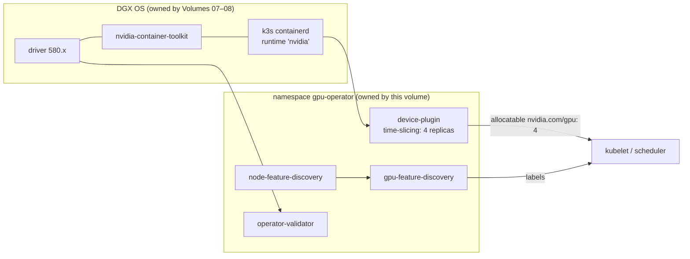

# Volume 17 — NVIDIA GPU Operator on k3s/DGX Spark: Host-Driver Mode, Time-Slicing, Validation & Secrets for Pods

> **Module 01 · Part IV — Platforms** · Prev: [16 k3s](16-kubernetes-bare-metal-bootstrap-kubespray.md) · Next: [18 Slurm](18-slurm-cluster-orchestration-and-cgroup-gpus.md)

| | |
|---|---|
| **You will build** | The GPU Operator deployed by Ansible with Helm in **host-driver mode** (DGX OS owns the driver and toolkit), NFD/GFD labels, a time-sliced GB10 advertised as N `nvidia.com/gpu`, an automated validator gate, and a GPU smoke pod |
| **Hardware** | k3s from Volume 16 |
| **Time** | 45 min |
| **Risk** | Low. `atomic: true` rolls back a failed Helm upgrade |

---

## 1. What the operator does, and what we switch off

| Operator component | Default job | On DGX Spark |
|---|---|---|
| `driver` DaemonSet | Builds and loads the NVIDIA driver in a container | **Disabled.** DGX OS ships and updates the driver; two owners would fight |
| `toolkit` DaemonSet | Installs nvidia-container-toolkit and edits containerd config | **Disabled.** The host toolkit exists and k3s already registered the `nvidia` runtime |
| `devicePlugin` | Advertises `nvidia.com/gpu` to kubelet | **On**, with a time-slicing config |
| `gfd` + `nfd` | Labels nodes (`nvidia.com/gpu.product`, `.memory`, `.compute.major/minor`, …) | On |
| `dcgmExporter` | Metrics | Optional (Volume 09 §4.2 — check GB10 support) |
| `migManager` | MIG partitioning | **Off.** GB10 has no MIG |
| `validator` | Proves driver + toolkit + CUDA workloads function | On, and our Ansible gate waits for it |



## 2. Time-slicing on a UMA GPU: what you get and what you don't

| | Time-slicing (this lab) | MIG (not on GB10) | MPS |
|---|---|---|---|
| Isolation of compute | None (context switching) | Hardware | Partial |
| Isolation of memory | **None.** All pods share the unified pool with the OS | Hardware | Limit per client (`CUDA_MPS_PINNED_DEVICE_MEM_LIMIT`) |
| Fault isolation | None: one bad kernel/Xid can affect all | Yes | No |
| Good for | Dev notebooks, small inference services, CI jobs | — | Many small inference processes |

`failRequestsGreaterThanOne: true` makes a pod asking for `nvidia.com/gpu: 2` fail rather than silently receive two slices of the same GPU.

---

## 3. The role

```yaml
# lab/roles/gpu_operator/defaults/main.yml
---
gpu_operator_chart_version: v25.3.0        # pin; check `helm search repo nvidia/gpu-operator -l`
gpu_operator_namespace: gpu-operator
gpu_operator_kubeconfig: "{{ k3s_cluster_kubeconfig_local | default(playbook_dir ~ '/../.cache/kubeconfig-spark-lab.yaml') }}"

# DGX OS already provides the driver and container toolkit — the operator must
# NOT try to install them (it would fight DGX OS updates).
gpu_operator_values:
  driver:
    enabled: false
  toolkit:
    enabled: false
  operator:
    defaultRuntime: containerd
  # k3s keeps containerd config/socket in non-standard paths
  cdi:
    enabled: false
  devicePlugin:
    config:
      name: time-slicing-config
      default: any
  dcgmExporter:
    enabled: "{{ gpu_operator_dcgm_exporter | default(false) }}"
  migManager:
    enabled: false        # GB10 has no MIG
  nfd:
    enabled: true

# Time-slicing: advertise N logical GPUs per physical GB10 (no memory isolation!)
gpu_operator_timeslice_replicas: 4
```

```yaml
# lab/roles/gpu_operator/tasks/main.yml
---
# Runs on the control node (localhost) against the k3s API.
- name: Add NVIDIA Helm repo
  kubernetes.core.helm_repository:
    name: nvidia
    repo_url: https://helm.ngc.nvidia.com/nvidia

- name: Create namespace (privileged PSA — operator pods need host access)
  kubernetes.core.k8s:
    kubeconfig: "{{ gpu_operator_kubeconfig }}"
    definition:
      apiVersion: v1
      kind: Namespace
      metadata:
        name: "{{ gpu_operator_namespace }}"
        labels:
          pod-security.kubernetes.io/enforce: privileged

- name: Time-slicing ConfigMap
  kubernetes.core.k8s:
    kubeconfig: "{{ gpu_operator_kubeconfig }}"
    definition:
      apiVersion: v1
      kind: ConfigMap
      metadata:
        name: time-slicing-config
        namespace: "{{ gpu_operator_namespace }}"
      data:
        any: |-
          version: v1
          flags:
            migStrategy: none
          sharing:
            timeSlicing:
              renameByDefault: false
              failRequestsGreaterThanOne: true
              resources:
                - name: nvidia.com/gpu
                  replicas: {{ gpu_operator_timeslice_replicas }}

- name: Install / upgrade GPU Operator
  kubernetes.core.helm:
    kubeconfig: "{{ gpu_operator_kubeconfig }}"
    name: gpu-operator
    chart_ref: nvidia/gpu-operator
    chart_version: "{{ gpu_operator_chart_version }}"
    release_namespace: "{{ gpu_operator_namespace }}"
    values: "{{ gpu_operator_values }}"
    wait: true
    wait_timeout: 15m
    atomic: true            # roll back automatically if pods never go Ready

- name: Wait for validator to succeed
  kubernetes.core.k8s_info:
    kubeconfig: "{{ gpu_operator_kubeconfig }}"
    kind: Pod
    namespace: "{{ gpu_operator_namespace }}"
    label_selectors: [app=nvidia-operator-validator]
  register: gpu_operator_validator
  until: >-
    gpu_operator_validator.resources | length > 0 and
    gpu_operator_validator.resources | map(attribute='status.phase') | unique == ['Running']
  retries: 40
  delay: 15

- name: Read allocatable GPUs per node
  kubernetes.core.k8s_info:
    kubeconfig: "{{ gpu_operator_kubeconfig }}"
    kind: Node
  register: gpu_operator_nodes

- name: Assert every node advertises time-sliced GPUs
  ansible.builtin.assert:
    that: (item.status.allocatable['nvidia.com/gpu'] | default('0') | int) == gpu_operator_timeslice_replicas
    fail_msg: "{{ item.metadata.name }} allocatable nvidia.com/gpu={{ item.status.allocatable['nvidia.com/gpu'] | default('0') }}"
    success_msg: "{{ item.metadata.name }} advertises {{ gpu_operator_timeslice_replicas }} GPU slices"
  loop: "{{ gpu_operator_nodes.resources }}"
  loop_control:
    label: "{{ item.metadata.name }}"
```

Key automation moves:

- **`atomic: true` + `wait: true`.** A broken values change rolls back instead of leaving half a DaemonSet set.
- **Validator gate.** The play doesn't finish until `nvidia-operator-validator` pods are Running, so "Helm said deployed" isn't mistaken for "GPUs work".
- **Allocatable assertion.** Every node must advertise exactly `gpu_operator_timeslice_replicas` GPUs, which catches the time-slicing ConfigMap not being picked up.

---

## 4. Hands-on

```bash
cd "01 Ansible/lab"
ansible-playbook playbooks/06-gpu-operator.yml
export KUBECONFIG=$PWD/.cache/kubeconfig-spark-lab.yaml
kubectl -n gpu-operator get pods
kubectl get node spark-01 -o json | jq '.status.allocatable["nvidia.com/gpu"], (.metadata.labels | with_entries(select(.key|startswith("nvidia.com/gpu"))))'
kubectl logs cuda-smoke     # → GPU 0: NVIDIA GB10 (UUID: GPU-…)
```

### 4.1 Four pods, one GPU

```yaml
# ts-demo.yaml
apiVersion: apps/v1
kind: Deployment
metadata: { name: ts-demo }
spec:
  replicas: 4
  selector: { matchLabels: { app: ts-demo } }
  template:
    metadata: { labels: { app: ts-demo } }
    spec:
      nodeSelector: { kubernetes.io/hostname: spark-01 }
      containers:
        - name: burn
          image: nvcr.io/nvidia/pytorch:25.11-py3
          command: [python, -c, "import torch,time;a=torch.randn(4096,4096,device='cuda');\nwhile True: a=a@a; a=a/a.norm(); torch.cuda.synchronize()"]
          resources:
            limits: { nvidia.com/gpu: 1, memory: 8Gi }     # memory limit matters on UMA!
```

```bash
kubectl apply -f ts-demo.yaml && kubectl get pods -l app=ts-demo -o wide
kubectl scale deploy ts-demo --replicas=5     # 5th pod stays Pending: only 4 slices per node
ssh nvidia@10.10.10.11 nvidia-smi              # 4 processes sharing one GPU
```

> **Always set a `memory` limit on GPU pods on a Spark.** Kubernetes can't account for GPU memory on a time-sliced UMA GPU, but the container memory limit plus the kubelet reserve from Volume 16 bound how much of the shared pool a pod's host-side allocations take. Whether CUDA allocations count against the pod's cgroup is something to verify on your node with the probe from Volume 08. Treat it as an experiment, not an assumption.

### 4.2 Secrets for GPU workloads (NGC, Hugging Face) from Vault

Two production-grade options (details in Volume 19):

```yaml
# Option A — Vault Agent Injector annotations on the pod
metadata:
  annotations:
    vault.hashicorp.com/agent-inject: "true"
    vault.hashicorp.com/role: "gpu-workloads"
    vault.hashicorp.com/agent-inject-secret-hf: "kv/data/spark-lab/huggingface"
    vault.hashicorp.com/agent-inject-template-hf: |
      {{- with secret "kv/data/spark-lab/huggingface" -}}export HF_TOKEN={{ .Data.data.token }}{{- end }}
```

```yaml
# Option B — External Secrets Operator → a normal k8s Secret
apiVersion: external-secrets.io/v1beta1
kind: ExternalSecret
metadata: { name: hf-token }
spec:
  secretStoreRef: { name: vault-spark, kind: ClusterSecretStore }
  target: { name: hf-token }
  data:
    - secretKey: HF_TOKEN
      remoteRef: { key: kv/spark-lab/huggingface, property: token }
```

---

## 5. Integrations

| System | Note |
|---|---|
| DGX OS upgrades (Volume 07) | After a driver update, restart the device-plugin and validator pods (or reboot); the upgrade playbook's drain/uncordon covers it |
| Telemetry (Volume 09) | Choose either host dcgm-exporter **or** the operator's, not both |
| Multus/RDMA (Volume 13) | Same pod requests `nvidia.com/gpu` + `rdma/rdma_shared_cx7` |
| AWX | Can run the Helm role from a job template (the EE includes `kubernetes.core` + helm) |

## 6. Troubleshooting & diagnostics

| Symptom | Diagnose | Fix |
|---|---|---|
| Validator stuck `Init` | `kubectl -n gpu-operator logs <validator> -c driver-validation` | Host driver not found: make sure `driver.enabled=false` (operator expects the host driver) and `nvidia-smi` works on the host |
| `toolkit-validation` fails | Container logs | k3s containerd has no `nvidia` runtime → restart k3s after installing the toolkit (Volume 16) |
| Allocatable `nvidia.com/gpu` = 1, not 4 | `kubectl -n gpu-operator get cm time-slicing-config -o yaml`; device-plugin logs | ConfigMap name/key must match `devicePlugin.config.name/default`; restart the device-plugin DS |
| Pods `Pending: Insufficient nvidia.com/gpu` | `kubectl describe node` | All slices in use; or `failRequestsGreaterThanOne` rejected a request for > 1 |
| `ImagePullBackOff` on operator pods | `describe pod` | Check the chart version supports arm64 for every component; pin a release that does |
| Helm upgrade rolled back (`atomic`) | `helm -n gpu-operator history gpu-operator` | Read `helm status`; fix values; re-run |
| CUDA OOM in one pod when others run | `free -g` on the host | Time-slicing shares memory. Size models to fit **together**, or run fewer replicas |

## 7. Validation

- [ ] `06-gpu-operator.yml` finishes with the validator Running and the allocatable assertion green.
- [ ] 4 pods share one GB10; the 5th stays Pending.
- [ ] NFD/GFD labels present (`nvidia.com/gpu.product`, `nvidia.com/gpu.compute.major=12`).
- [ ] A pod receives `HF_TOKEN` from Vault by one of the §4.2 routes.
