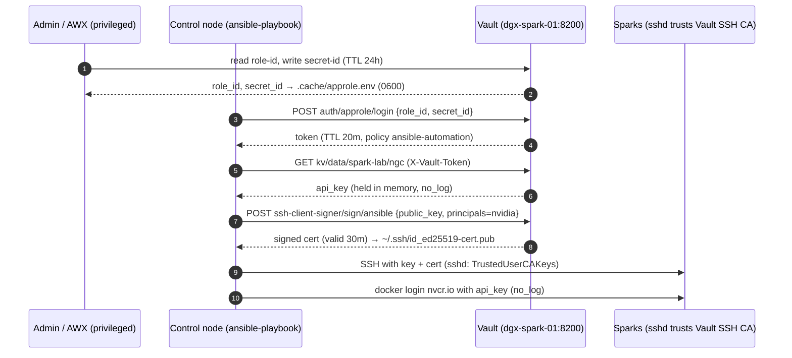

# Volume 19 — Vault ↔ Ansible in Production Style: AppRole, Short-Lived Tokens, KV Secrets, SSH Certificates, ansible-vault Keys

> **Module 01 · Part IV — Platforms & Security** · Prev: [18 Slurm](18-slurm-cluster-orchestration-and-cgroup-gpus.md) · Next: [20 AWX in production](20-awx-tower-production-cluster-and-receptor.md) · Server setup: [03B](03-hashicorp-vault-deep-dive.md)

| | |
|---|---|
| **You will build** | A playbook run that holds **no long-lived secrets**: AppRole login, then a 20-minute token, then the NGC key read from KV v2, then a 30-minute SSH certificate signed for the run, then the key used to log in to nvcr.io on every Spark. Plus an ansible-vault password sourced from Vault |
| **Hardware** | Vault from Volume 03B; control node |
| **Time** | 60 min |
| **Risk** | Low. Flipping sshd to certificate-only is the step to rehearse carefully (§3.4) |

---

## 1. Threat model → design

| Risk in a typical lab repo | Control in this volume |
|---|---|
| API keys in `group_vars` / git history | Secrets live in Vault KV. The repo only holds *paths* |
| One SSH key that works forever, everywhere | SSH **certificates** from Vault's SSH CA, valid 30 min, principal-restricted |
| Automation credentials that never expire | AppRole `secret_id` TTL 24 h, token TTL 20 min, max 1 h |
| Secrets in logs (CLI, AWX, ARA) | `no_log: true` on every task that touches values; only lengths and booleans are printed |
| "Who read what?" | Vault audit log (Volume 03B) records each read with the AppRole identity |

## 2. Architecture

### 2.1 Flow of a run



### 2.2 LLD: Vault objects (created by the `vault_config` role)

```yaml
# lab/roles/vault_config/defaults/main.yml
---
vault_config_addr: "https://{{ hostvars[groups['vault'][0]].ansible_host }}:8200"
vault_config_cacert: "{{ playbook_dir }}/../.cache/spark-lab-ca.crt"
# LAB: bootstrap with the root token from init; production: a short-lived admin token.
vault_config_token: "{{ (lookup('ansible.builtin.file', playbook_dir ~ '/../.cache/vault-init.json') | from_json).root_token }}"

vault_config_secret_engines:
  - { path: kv, type: kv, options: { version: "2" } }
  - { path: ssh-client-signer, type: ssh }

vault_config_auth_methods:
  - { path: approle, type: approle }

vault_config_policies:
  ansible-automation: |
    # Read lab secrets
    path "kv/data/spark-lab/*"     { capabilities = ["read"] }
    path "kv/metadata/spark-lab/*" { capabilities = ["list", "read"] }
    # Get SSH certificates signed for the automation user
    path "ssh-client-signer/sign/ansible" { capabilities = ["create", "update"] }
    # Let the token look itself up / renew (hvac does this)
    path "auth/token/lookup-self" { capabilities = ["read"] }
    path "auth/token/renew-self"  { capabilities = ["update"] }
  spark-admin: |
    path "kv/data/spark-lab/*"     { capabilities = ["create", "read", "update", "delete"] }
    path "kv/metadata/spark-lab/*" { capabilities = ["list", "read", "delete"] }

vault_config_approles:
  - name: ansible
    token_policies: [ansible-automation]
    token_ttl: 20m
    token_max_ttl: 1h
    secret_id_ttl: 24h        # AWX/cron must refresh; stolen secret_ids expire
    secret_id_num_uses: 0
    token_bound_cidrs: ""     # e.g. "192.168.0.0/24" to pin to the mgmt network

vault_config_ssh_role:
  name: ansible
  allowed_users: "{{ spark_admin_user | default('nvidia') }}"
  default_user: "{{ spark_admin_user | default('nvidia') }}"
  ttl: 30m
```

| Object | Path | Purpose |
|---|---|---|
| KV v2 engine | `kv/` | Lab secrets under `kv/spark-lab/*` |
| SSH engine | `ssh-client-signer/` | CA key generated inside Vault; role `ansible` |
| AppRole | `auth/approle/role/ansible` | Machine identity for automation |
| Policy | `ansible-automation` | read `kv/data/spark-lab/*`, sign `ssh-client-signer/sign/ansible`, token self-lookup/renew |
| Audit | `file` → `/var/log/vault/audit.log` | Every request logged |

> **KV v2 path gotcha:** the API path for *reading* is `kv/data/<path>`, and for *listing* it's `kv/metadata/<path>`. Policies must use those exact prefixes; the CLI (`vault kv get kv/spark-lab/ngc`) hides the `data/` segment from you.

---

## 3. Hands-on

### 3.1 The integration playbook

```yaml
# lab/playbooks/19-vault-integration.yml
---
# HashiCorp Vault ↔ Ansible, the production pattern:
#   1. (admin, once per day/run) issue a short-lived AppRole secret_id
#   2. Ansible logs in with role_id + secret_id → short-lived token (20 min)
#   3. secrets read with the token (never stored in the repo, never logged)
#   4. an SSH certificate valid 30 min is signed for this run
#
#   export VAULT_ADDR=https://192.168.0.100:8200 VAULT_CACERT=$PWD/.cache/spark-lab-ca.crt
#   ansible-playbook playbooks/19-vault-integration.yml -e vault_issue_secret_id=true   # admin step (root/admin token in VAULT_TOKEN)
#   source .cache/approle.env && ansible-playbook playbooks/19-vault-integration.yml -K
- name: Issue AppRole credentials (admin step, optional)
  hosts: localhost
  connection: local
  gather_facts: false
  vars:
    vault_issue_secret_id: false
    vault_addr: "{{ lookup('env', 'VAULT_ADDR') }}"
    vault_cacert: "{{ lookup('env', 'VAULT_CACERT') | default(omit, true) }}"
  tasks:
    - name: Admin block
      when: vault_issue_secret_id | bool
      block:
        - name: Read role_id
          community.hashi_vault.vault_read:
            url: "{{ vault_addr }}"
            ca_cert: "{{ vault_cacert }}"
            auth_method: token
            token: "{{ lookup('env', 'VAULT_TOKEN') }}"
            path: auth/approle/role/ansible/role-id
          register: vault_role_id
          no_log: true

        - name: Generate a fresh secret_id (TTL set on the role — 24h in this lab)
          community.hashi_vault.vault_write:
            url: "{{ vault_addr }}"
            ca_cert: "{{ vault_cacert }}"
            auth_method: token
            token: "{{ lookup('env', 'VAULT_TOKEN') }}"
            path: auth/approle/role/ansible/secret-id
            data:
              metadata: '{"issued_by": "19-vault-integration", "purpose": "spark-lab"}'
          register: vault_secret_id
          no_log: true

        - name: Write env file for the automation run (0600, git-ignored)
          ansible.builtin.copy:
            dest: "{{ playbook_dir }}/../.cache/approle.env"
            mode: "0600"
            content: |
              export ANSIBLE_HASHI_VAULT_ROLE_ID={{ vault_role_id.data.data.role_id }}
              export ANSIBLE_HASHI_VAULT_SECRET_ID={{ vault_secret_id.data.data.secret_id }}
          no_log: true

- name: Log in with AppRole and fetch run-time secrets
  hosts: localhost
  connection: local
  gather_facts: false
  vars:
    vault_conn: &vault_conn
      url: "{{ lookup('env', 'VAULT_ADDR') }}"
      ca_cert: "{{ lookup('env', 'VAULT_CACERT') | default(omit, true) }}"
  tasks:
    - name: The admin run stops after issuing credentials
      ansible.builtin.meta: end_play
      when: vault_issue_secret_id | default(false) | bool

    - name: AppRole credentials must be in the environment
      ansible.builtin.assert:
        that:
          - lookup('env', 'ANSIBLE_HASHI_VAULT_ROLE_ID') | length > 0
          - lookup('env', 'ANSIBLE_HASHI_VAULT_SECRET_ID') | length > 0
          - lookup('env', 'VAULT_ADDR') | length > 0
        fail_msg: >-
          Missing VAULT_ADDR / ANSIBLE_HASHI_VAULT_ROLE_ID / ANSIBLE_HASHI_VAULT_SECRET_ID.
          Run the admin step (-e vault_issue_secret_id=true) then: source .cache/approle.env
        quiet: true

    - name: AppRole login → token
      community.hashi_vault.vault_login:
        <<: *vault_conn
        auth_method: approle
        role_id: "{{ lookup('env', 'ANSIBLE_HASHI_VAULT_ROLE_ID') }}"
        secret_id: "{{ lookup('env', 'ANSIBLE_HASHI_VAULT_SECRET_ID') }}"
      register: vault_login
      no_log: true

    - name: Keep only the token
      ansible.builtin.set_fact:
        vault_token: "{{ vault_login | community.hashi_vault.vault_login_token }}"
        vault_token_ttl: "{{ vault_login.login.auth.lease_duration }}"
        vault_token_policies: "{{ vault_login.login.auth.policies }}"
      no_log: true

    - name: Read the NGC key (KV v2)
      ansible.builtin.set_fact:
        vault_ngc_api_key: >-
          {{ lookup('community.hashi_vault.vault_kv2_get', 'spark-lab/ngc', engine_mount_point='kv',
                    url=vault_conn.url, ca_cert=vault_conn.ca_cert | default(omit),
                    auth_method='token', token=vault_token).secret.api_key }}
      no_log: true

    - name: Sign an SSH certificate for this run
      community.hashi_vault.vault_write:
        <<: *vault_conn
        auth_method: token
        token: "{{ vault_token }}"
        path: ssh-client-signer/sign/ansible
        data:
          public_key: "{{ lookup('ansible.builtin.file', '~/.ssh/id_ed25519.pub') }}"
          valid_principals: "{{ spark_admin_user | default('nvidia') }}"
      register: vault_ssh
      no_log: true

    - name: Write certificate next to the key (OpenSSH picks it up automatically)
      ansible.builtin.copy:
        dest: "{{ lookup('env', 'HOME') }}/.ssh/id_ed25519-cert.pub"
        content: "{{ vault_ssh.data.data.signed_key }}"
        mode: "0644"

    - name: What we got (no secret values)
      ansible.builtin.debug:
        msg:
          - "token TTL {{ vault_token_ttl }}s, policies {{ vault_token_policies }}"
          - "NGC key present: {{ vault_ngc_api_key | length > 0 }} (length {{ vault_ngc_api_key | length }})"
          - "SSH cert written; inspect with: ssh-keygen -L -f ~/.ssh/id_ed25519-cert.pub"

- name: Use the secrets on the Sparks
  hosts: spark
  become: true
  gather_facts: false
  vars:
    container_runtime_ngc_login: true
    container_runtime_ngc_api_key: "{{ hostvars['localhost'].vault_ngc_api_key }}"
    container_runtime_smoke_test: false
  roles:
    - role: container_runtime
```

```bash
cd "01 Ansible/lab"
export VAULT_ADDR=https://192.168.0.100:8200 VAULT_CACERT=$PWD/.cache/spark-lab-ca.crt

# admin step (uses an admin/root token in VAULT_TOKEN — lab only)
export VAULT_TOKEN=$(jq -r .root_token .cache/vault-init.json)
vault kv put kv/spark-lab/ngc api_key=nvapi-XXXXXXXXXXXXXXXX
ansible-playbook playbooks/19-vault-integration.yml -e vault_issue_secret_id=true -l localhost   # stops after writing approle.env
unset VAULT_TOKEN                       # the automation run must NOT have the admin token

# automation run
source .cache/approle.env
ansible-playbook playbooks/19-vault-integration.yml -K
```

What was verified while building this lab (against a stand-in that implements the Vault HTTP API for AppRole login, KV v2 and SSH signing, with token checks on every protected path):

```
POST /v1/auth/approle/login                 tok=None
GET  /v1/kv/data/spark-lab/ngc              tok=<approle token>
POST /v1/ssh-client-signer/sign/ansible     tok=<approle token>
→ token TTL 1200s, policies ['default', 'ansible-automation']
→ NGC key present: True
```

> `-l localhost` works because the lab inventory declares `localhost` explicitly in a `control` group. Ansible's *implicit* localhost can't be selected with `--limit`, which is a classic reason an "admin-only" play silently does nothing.

### 3.2 Everyday lookup patterns

```yaml
# 1. Inline lookup with env-provided AppRole (ANSIBLE_HASHI_VAULT_* vars)
grafana_admin_password: >-
  {{ lookup('community.hashi_vault.vault_kv2_get', 'spark-lab/grafana', engine_mount_point='kv').secret.admin_password }}

# 2. Token from an earlier vault_login (fastest: one login per run, as in 19-vault-integration.yml)
hf_token: >-
  {{ lookup('community.hashi_vault.vault_kv2_get', 'spark-lab/huggingface', engine_mount_point='kv',
            auth_method='token', token=hostvars.localhost.vault_token).secret.token }}
```

```bash
# env wiring for pattern 1
export ANSIBLE_HASHI_VAULT_URL=$VAULT_ADDR
export ANSIBLE_HASHI_VAULT_CA_CERT=$VAULT_CACERT
export ANSIBLE_HASHI_VAULT_AUTH_METHOD=approle
source .cache/approle.env
```

> Lookups run **on the control node**, once per host that templates them. With 50 hosts, pattern 1 logs in 50 times. Log in once (`vault_login`), keep the token in `hostvars['localhost']`, and pass it as in pattern 2.

### 3.3 ansible-vault keys from HashiCorp Vault

For the few values that must live in git encrypted (e.g. a bootstrap sudo password for `-K`-less runs):

```bash
# lab/tools/vault-pass.sh
#!/usr/bin/env bash
# ansible-vault password source backed by HashiCorp Vault.
#   ansible.cfg:  vault_password_file = ./tools/vault-pass.sh
# Needs VAULT_ADDR, VAULT_CACERT and a token (VAULT_TOKEN or ~/.vault-token) that can
# read kv/data/spark-lab/ansible-vault. Nothing is ever written to disk.
set -euo pipefail
: "${VAULT_ADDR:?set VAULT_ADDR}"
exec vault kv get -field=password kv/spark-lab/ansible-vault
```

```bash
vault kv put kv/spark-lab/ansible-vault password="$(openssl rand -base64 32)"
ansible-vault encrypt_string --vault-password-file tools/vault-pass.sh 'S3cr3t!' --name ansible_become_password \
  >> inventory/group_vars/spark.vault.yml
ansible-playbook playbooks/01-baseline.yml --vault-password-file tools/vault-pass.sh
```

### 3.4 SSH certificates: move sshd to trust the CA, then retire static keys

`08-vault.yml` (play 3) already installed `TrustedUserCAKeys` on every Spark. Test it before removing anything:

```bash
# lab/tools/vault-ssh-cert.sh
#!/usr/bin/env bash
# Get a short-lived SSH user certificate from Vault's SSH CA for the lab user.
# OpenSSH (and therefore Ansible) automatically presents <key>-cert.pub next to <key>.
#   tools/vault-ssh-cert.sh [~/.ssh/id_ed25519] [nvidia]
set -euo pipefail
KEY=${1:-$HOME/.ssh/id_ed25519}
PRINCIPAL=${2:-nvidia}
: "${VAULT_ADDR:?set VAULT_ADDR}"
vault write -field=signed_key ssh-client-signer/sign/ansible \
  public_key=@"${KEY}.pub" valid_principals="$PRINCIPAL" > "${KEY}-cert.pub"
chmod 0644 "${KEY}-cert.pub"
ssh-keygen -L -f "${KEY}-cert.pub" | sed -n '1,12p'
```

```bash
tools/vault-ssh-cert.sh ~/.ssh/id_ed25519 nvidia
ssh-keygen -L -f ~/.ssh/id_ed25519-cert.pub | grep -E 'Valid|Principals'
ssh -o IdentitiesOnly=yes -i ~/.ssh/id_ed25519 nvidia@192.168.0.101 'echo cert login OK'
# Only after cert login works from TWO places: remove the static key from authorized_keys
```

Break-glass: keep console access (monitor and keyboard) and one static key in a sealed envelope. If Vault is down, certificate logins stop once the current certs expire.

---

## 4. Integrations

| Consumer | Pattern |
|---|---|
| AWX (Volume 20) | Credential type **HashiCorp Vault Secret Lookup** (AppRole) + **HashiCorp Vault Signed SSH**, so AWX never stores the NGC key or a private SSH key |
| Kubernetes pods (Volume 17) | Vault Agent Injector or External Secrets; a Kubernetes auth method replaces AppRole for pods. Use one auth mount per cluster (`spark-root`, `dev-lab`, `llms`): each vCluster has its own API server and ServiceAccount token issuer |
| Grafana / Prometheus (Volume 09) | `gpu_telemetry_grafana_admin_password` via lookup |
| CI (Volume 21) | A CI-specific AppRole with a *read-only, lint-only* policy, or no Vault access at all |

## 5. Troubleshooting & diagnostics

| Symptom | Diagnose | Fix |
|---|---|---|
| `invalid role or secret ID` | `vault read auth/approle/role/ansible` (TTL, num_uses) | secret_id expired (24 h); re-issue |
| `permission denied` reading a KV path | `vault token capabilities <token> kv/data/spark-lab/ngc`; audit log | Policy uses `kv/spark-lab/*` instead of `kv/data/spark-lab/*` |
| `The 'hvac' python library is required` | `python -c 'import hvac'` in the **same** env (or EE) | `pip install hvac`; rebuild the EE (Volume 05) |
| `certificate verify failed` | `VAULT_CACERT` / `ANSIBLE_HASHI_VAULT_CA_CERT` set? | Point at `.cache/spark-lab-ca.crt` |
| Lookups slow / Vault audit log flooded | Count login lines in the audit log per run | Log in once (§3.2 pattern 2) |
| SSH cert rejected: `Certificate invalid: name is not a listed principal` | `ssh-keygen -L` → Principals | `valid_principals` must equal the login user |
| SSH cert rejected: `no matching CA` | `sshd -T \| grep trustedusercakeys`; `ssh-keygen -lf /etc/ssh/trusted-user-ca-keys.pem` | Re-run `08-vault.yml` play 3; the CA was regenerated? |
| Secret appears in `ansible.log` | `grep -n nvapi .cache/ansible.log` | A task without `no_log`. Fix it and rotate the secret (treat it as leaked) |

## 6. Validation

- [ ] `grep -R "nvapi-" 01\ Ansible/` finds nothing; `.cache/` is git-ignored.
- [ ] An automation run succeeds with only `approle.env` sourced, and **fails** after the secret_id TTL.
- [ ] SSH login with a Vault certificate works; the cert expires after 30 min.
- [ ] The Vault audit log shows the AppRole identity reading `kv/data/spark-lab/ngc`.
