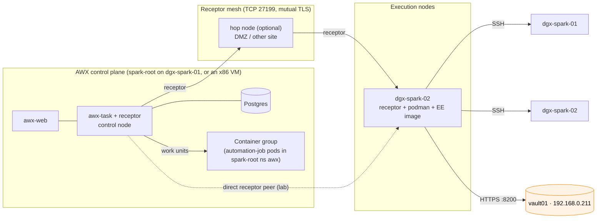
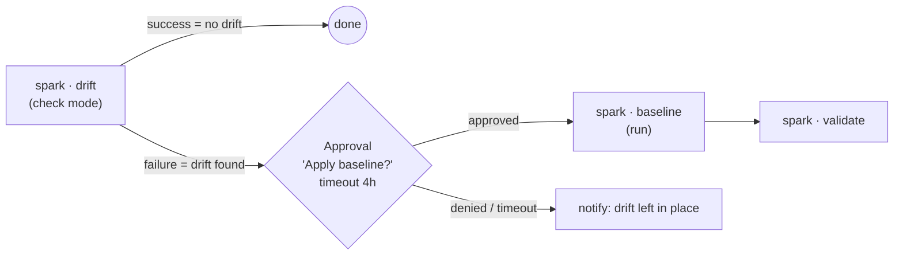

# Volume 20 — AWX in Production: Receptor Mesh & Execution Nodes, Vault Credentials, Approval Workflows, Backup/Restore, Monitoring

> **Module 01 · Part IV — Platforms & Security** · Prev: [19 Vault ↔ Ansible](19-hashicorp-vault-approle-and-dynamic-secrets.md) · Next: [21 Testing & CI](21-ansible-testing-linting-and-molecule.md) · Install basics: [02B](02-ansible-tower-awx-deep-dive.md)

| | |
|---|---|
| **You will build** | The operational layer around AWX: a Spark as a **Receptor execution node** (the hybrid pattern), Vault-backed credentials, a **drift → approval → remediate** workflow, scheduled backups with a tested restore, and metrics in Prometheus |
| **Prerequisite** | AWX from Volume 02B (on the kubeadm root cluster, or on an x86 box for the hybrid pattern) |
| **Clusters** | `spark-root` (namespace `awx`) for the AWX control plane and container group |
| **Time** | 2–3 h |
| **Risk** | Medium. Restores and upgrades touch the AWX database; rehearse them on purpose |

> **AWX is the alternative controller here.** This lab's controller is **Semaphore on `sema01`** (192.168.0.210), with SSH certificates from **`vault01`** (192.168.0.211), both outside the Spark ([00a](00a-semaphore-vault-lab-guide.md), [00b](00b-dgx-spark-semaphore-target.md)). The management plane must survive `99-reset-kubernetes.yml` and a re-image of the Spark, and an AWX on `spark-root` doesn't (Volume 02B explains the trade-off). Learn AWX's production layer here because it's what large shops run; the concepts map one to one:
>
> | Semaphore in this lab | AWX equivalent (this volume) |
> |---|---|
> | Task template + CLI args `--limit dgx-spark-01,localhost` | Job template + `ask_limit_on_launch` |
> | Variable group `vault-approle` (AppRole `semaphore`) + play 1 `00-vault-cert.yml` | *HashiCorp Vault Signed SSH* credential linked to a Machine credential (§2.2) |
> | `vault_lab_secrets_enabled` → play 1 reads `kv/spark-lab/*` | *HashiCorp Vault Secret Lookup* credential |
> | Schedule on `20 Drift check` | `awx.awx.schedule` |
> | Template permissions (*Task Runner* role, separate `spark-danger` project) | RBAC + an **approval node** (§2.3), which Semaphore doesn't have |
> | sema01 container + state volume `/opt/spark-lab/cache` | EE pods / execution nodes + PVCs |
>
> If you run both, keep AWX on its own AppRole and its own templates, and don't let both controllers change the same hosts.

---

## 1. Architecture

### 1.1 HLD: control plane vs execution plane



| Execution option | Where jobs run | Use it when |
|---|---|---|
| Control-plane pods (default) | `automation-job-*` pods in the AWX namespace | AWX sits next to the targets |
| **Container group** | Pods in any k8s namespace or cluster, with your pod spec | You want jobs on a specific node (`nodeSelector`), a GPU node, or with extra mounts |
| **Execution node** | A VM or bare-metal host running receptor + podman | AWX control plane is elsewhere (x86, cloud) but jobs must run *near* the Sparks; also the fix for the arm64 image gap (Volume 02B §2) |
| **Hop node** | Relay only, runs no jobs | Crossing network zones (lab LAN ↔ office) with a single inbound port |

### 1.2 LLD: what lives where

| Object | Managed by | Notes |
|---|---|---|
| Instances / instance groups | `awx.awx.instance`, `awx.awx.instance_group` | Execution nodes join by an install bundle generated in AWX |
| Credential types | built-in: *HashiCorp Vault Secret Lookup*, *HashiCorp Vault Signed SSH* | Source credentials; target credentials *link* to them |
| Workflow | `awx.awx.workflow_job_template` + `workflow_job_template_node` | Nodes: job templates, approvals, inventory syncs |
| Backups | `AWXBackup` CR (operator) → PVC | Includes DB and secrets (`secret_key`!) |
| Metrics | `/api/v2/metrics/` (Prometheus text) | Scrape with a token |

---

## 2. Hands-on

### 2.1 Make dgx-spark-02 an execution node

1. In AWX: **Instances → Add** → hostname `dgx-spark-02`, node type **execution**, listener port `27199`, peers from control. Save and **download the install bundle** (`dgx-spark-02_install_bundle.tar.gz`).
2. From your MacBook (as `nvidia`, the bootstrap path):

```bash
mkdir -p .cache/receptor && tar xzf ~/Downloads/dgx-spark-02_install_bundle.tar.gz -C .cache/receptor
cd .cache/receptor/dgx-spark-02_install_bundle
ansible-galaxy collection install -r requirements.yml       # ansible.receptor
# the bundle ships install_receptor.yml + inventory.yml; point it at the Spark:
ansible-playbook -i inventory.yml install_receptor.yml -e ansible_user=nvidia -K
```

3. Back in AWX the instance moves to **Ready**. Health-check it: `awx instances health_check dgx-spark-02`.
4. Put it in an instance group `spark-exec` and point job templates at it.

On the Spark, check it:

```bash
systemctl status receptor
receptorctl --socket /var/run/receptor/receptor.sock status     # peers, work types
podman images | grep -i ee                                      # EE image pulled on first job
```

The execution node runs your EE with **podman** under a dedicated user. Pre-pull your arm64 `spark-ee` (Volume 05) to avoid a slow first job.

### 2.2 Vault-backed credentials (no stored secrets)

The Vault is **vault01**, the same one Semaphore uses. Give AWX its **own** AppRole (for example `awx`, created on vault01 the way 00a §4 creates `semaphore`, with a policy that allows `ssh-client-signer/sign/ansible` and, if needed, `kv/data/spark-lab/*`), so you can revoke one controller without breaking the other. The targets need nothing new: `00b-semaphore-target.yml` already made them trust vault01's CA for `svc-ansible`.

```yaml
# playbooks/awx-config.yml (continued from Volume 02B)
- name: Vault lookup credential (AppRole)
  awx.awx.credential:
    name: vault-approle
    organization: SparkLab
    credential_type: HashiCorp Vault Secret Lookup
    inputs:
      url: https://192.168.0.211:8200                                  # vault01
      cacert: "{{ lookup('file', '.cache/vault-ca.crt') }}"            # vault01's TLS certificate (00b §2)
      role_id: "{{ lookup('env', 'ANSIBLE_HASHI_VAULT_ROLE_ID') }}"    # AWX's own AppRole, not 'semaphore'
      secret_id: "{{ lookup('env', 'ANSIBLE_HASHI_VAULT_SECRET_ID') }}"
      api_version: v2
  no_log: true

- name: Vault signed-SSH credential (source for the machine credential)
  awx.awx.credential:
    name: vault-ssh-ca
    organization: SparkLab
    credential_type: HashiCorp Vault Signed SSH
    inputs:
      url: https://192.168.0.211:8200
      cacert: "{{ lookup('file', '.cache/vault-ca.crt') }}"
      role_id: "{{ lookup('env', 'ANSIBLE_HASHI_VAULT_ROLE_ID') }}"
      secret_id: "{{ lookup('env', 'ANSIBLE_HASHI_VAULT_SECRET_ID') }}"
  no_log: true

- name: Machine credential whose certificate is signed per job
  awx.awx.credential:
    name: spark-ssh-cert
    organization: SparkLab
    credential_type: Machine
    inputs:
      username: svc-ansible                                         # the automation account from 00b
      ssh_key_data: "{{ lookup('file', '~/.ssh/awx_ed25519') }}"   # private key; public cert comes from Vault
  no_log: true

- name: Link the public-key certificate field to Vault signing
  awx.awx.credential_input_source:
    input_field_name: ssh_public_key_data
    target_credential: spark-ssh-cert
    source_credential: vault-ssh-ca
    metadata:
      public_key: "{{ lookup('file', '~/.ssh/awx_ed25519.pub') }}"
      secret_path: ssh-client-signer
      role: ansible
      valid_principals: svc-ansible                                 # the only principal role 'ansible' allows (00a §4)
```

Each job now gets a freshly signed certificate with the signing role's lifetime (15 minutes on vault01). AWX stores **no** usable long-term access on its own: the private key alone won't pass sshd without a valid certificate.

Two lab details. `group_vars/spark.yml` picks `ansible_user` from `vault_role_id`, which AWX doesn't define, so it would say `nvidia` and override the credential's username: give the job templates the extra variable `ansible_user: svc-ansible`. And play 1 (`00-vault-cert.yml`) skips itself for the same reason, so it never competes with the credential plugin.

### 2.3 Workflow: drift → approval → remediate → validate



To make "drift found" a *failure* in AWX, the drift template runs `20-drift-check.yml` followed by the drift reporter (exit code 2 on drift, Volume 22), for example as a final task that fails when `spark_config_drift_tasks > 0`.

```yaml
- name: Workflow template
  awx.awx.workflow_job_template:
    name: "spark · drift-remediate"
    organization: SparkLab
    inventory: spark-lab
    ask_limit_on_launch: true

- name: Nodes
  awx.awx.workflow_job_template_node:
    workflow_job_template: "spark · drift-remediate"
    organization: SparkLab
    identifier: "{{ item.id }}"
    unified_job_template: "{{ item.ujt | default(omit) }}"
    approval_node: "{{ item.approval | default(omit) }}"
    success_nodes: "{{ item.success | default([]) }}"
    failure_nodes: "{{ item.failure | default([]) }}"
  loop:
    - { id: validate, ujt: "spark · validate" }
    - { id: baseline, ujt: "spark · baseline", success: [validate] }
    - { id: approve, approval: { name: "Apply baseline to drifted Sparks?", timeout: 14400 }, success: [baseline] }
    - { id: drift, ujt: "spark · drift", failure: [approve] }
```

(Nodes are created leaf-first, so the referenced identifiers already exist.)

### 2.4 Backup and a restore drill

```yaml
# .cache/awx/backup.yaml
apiVersion: awx.ansible.com/v1beta1
kind: AWXBackup
metadata: { name: awx-backup-2026-09-29, namespace: awx }
spec:
  deployment_name: awx
  backup_storage_class: local-path
  backup_storage_requirements: 20Gi
```

```bash
kubectl --context spark-root apply -f .cache/awx/backup.yaml
kubectl --context spark-root -n awx get awxbackup awx-backup-2026-09-29 -o jsonpath='{.status}' | jq
```

Schedule it with a Kubernetes CronJob that applies a dated `AWXBackup`, or with an AWX job that runs `kubernetes.core.k8s`. **Restore drill:** deploy a second AWX named `awx-restore` in a scratch namespace from that backup (`AWXRestore` with `backup_name`), log in, and confirm credentials decrypt (open one; it must not error).

### 2.5 Monitoring AWX

```yaml
# add to roles/gpu_telemetry/templates/prometheus.yml.j2
  - job_name: awx
    metrics_path: /api/v2/metrics/
    authorization: { type: Bearer, credentials_file: /etc/prometheus/awx.token }
    static_configs: [{ targets: ["192.168.0.100:30080"] }]
```

Useful series: `awx_pending_jobs_total`, `awx_running_jobs_total`, `awx_instance_remaining_capacity`, `awx_status_total{status="failed"}`. Alert when pending jobs stay above zero for 15 min (capacity or an execution node down).

---

## 3. Operations runbook

| Task | How |
|---|---|
| Upgrade AWX | Back up → bump the operator `ref` in `kustomization.yaml` → `kubectl --context spark-root apply -k` → the operator migrates the DB. Never skip the backup |
| Rotate `secret_key` | Not supported in place. It encrypts every credential; treat it as permanent and back it up with the DB |
| Add an execution node | Instances → Add → bundle → `install_receptor.yml` → add to the instance group |
| Remove a node | Disable it in AWX, wait for running jobs, remove from the instance group, delete the instance, `systemctl disable --now receptor` |
| Capacity tuning | Instance → capacity adjustment (CPU vs memory weighting); the job template `forks` value counts against capacity |

## 4. Troubleshooting & diagnostics

| Symptom | Diagnose | Fix |
|---|---|---|
| Execution node stuck **Unavailable** | `receptorctl status` on both ends; `journalctl -u receptor` | TCP 27199 blocked; certificate CN mismatch; the node hostname must match what AWX expects |
| Jobs on the execution node fail pulling the EE | `podman pull <ee>` as the receptor user | Registry auth; arm64 image missing → build `spark-ee` (Volume 05) |
| `Credential lookup failed: permission denied` | vault01's audit log (`/var/log/vault_audit.log`) for AWX's AppRole | Policy lacks `ssh-client-signer/sign/ansible` or `kv/data/...` |
| `Permission denied (publickey)` although the lookup worked | The Spark's `journalctl -u ssh`: certificate principal | `valid_principals` must be `svc-ansible`, and the job must log in as `svc-ansible` (extra variable `ansible_user`, §2.2) |
| Workflow never reaches approval | Workflow visualizer: drift node edge type | The drift job must *fail* on drift; wire it to `failure_nodes` |
| Restore works, but credentials show errors | `awx-secret-key` in the restored namespace | The backup was restored without the matching secret key |
| `awx_instance_remaining_capacity` 0, jobs pending | Instance page | Too many forks per job for the instance's capacity; add a node or adjust capacity |

## 5. Validation

- [ ] dgx-spark-02 shows **Ready** as an execution node and runs `spark · validate`.
- [ ] A job's machine credential uses a vault01-signed cert (job output shows `Signed SSH` lookup; the Spark's `/var/log/auth.log` shows `Accepted publickey for svc-ansible ... ED25519-CERT ID ... (serial N) CA`).
- [ ] The drift workflow pauses for approval when you introduce drift.
- [ ] Restore drill: credentials decrypt in the restored instance.
- [ ] AWX metrics visible in Prometheus.
