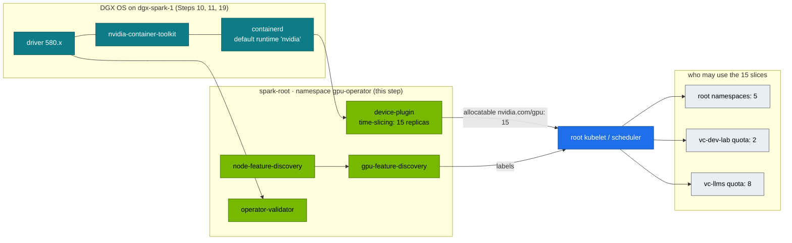

# Step 20 · NVIDIA GPU Operator on the kubeadm Root Cluster: Host-Driver Mode, 15 Time-Slices, Budgets per vCluster, Validation & Secrets for Pods

> **01 Ansible · Part IV — Secrets & platforms · Step 20 of 30** · ← [Step 19 · Kubernetes with kubeadm](19-kubernetes-kubeadm-root-cluster-and-vclusters.md) · [All steps](00-ansible-step-by-step-guide.md) · [Step 21 · Multus & RDMA networks](21-multus-and-secondary-rdma-networks.md) →
>
> Deep dive: [02 Kubernetes Vol 16 · GPU & Network Operator](../02%20Kubernetes/16-nvidia-gpu-operator-and-network-operator.md)

| | |
|---|---|
| **You will build** | The GPU Operator v26.7.1 deployed by Ansible with Helm in **host-driver mode** (DGX OS owns the driver and toolkit; the operator's driver, toolkit and CDI are off), NFD/GFD labels, the GB10 time-sliced into **15** `nvidia.com/gpu`, an automated validator gate and a GPU smoke pod. Then you watch the 15 slices split 5 / 2 / 8 between the root and the two vClusters |
| **Hardware** | The root cluster from Step 19 (Semaphore template `05 Kubernetes`); §4.2 also needs the vClusters (`06b vClusters`). The operator itself is the template `06 GPU Operator` |
| **Time** | 45 min |
| **Risk** | Low. `atomic: true` rolls back a failed Helm upgrade |
| **Clusters** | `spark-root` (the operator, §4.1), `llms` and `dev-lab` (§4.2) |
| **Lab files** | [`roles/gpu_operator`](lab/roles/gpu_operator), [`playbooks/06-gpu-operator.yml`](lab/playbooks/06-gpu-operator.yml), 02 Kubernetes [`manifests/root/05-vclusters/quotas.yaml`](../02%20Kubernetes/lab/manifests/root/05-vclusters/quotas.yaml) |

---

## 1. What the operator does, and what we switch off

| Operator component | Default job | On DGX Spark |
|---|---|---|
| `driver` DaemonSet | Builds and loads the NVIDIA driver in a container | **Disabled.** DGX OS ships and updates the driver; two owners would fight |
| `toolkit` DaemonSet | Installs nvidia-container-toolkit and edits the containerd config | **Disabled.** The host toolkit exists, and Step 19's `kubeadm_cluster` role already registered `nvidia` as containerd's default runtime with `nvidia-ctk` |
| CDI | On by default since operator v25.10: GPUs injected as CDI devices | **Disabled.** This lab injects GPUs through the `nvidia` runtime that DGX OS's toolkit configured. Mixing both paths makes "who gave this container the GPU?" hard to answer |
| `devicePlugin` | Advertises `nvidia.com/gpu` to kubelet | **On**, with a time-slicing config |
| `gfd` + `nfd` | Labels nodes (`nvidia.com/gpu.product`, `.memory`, `.compute.major/minor`, …) | On |
| `dcgmExporter` | Metrics | Off by default (`gpu_operator_dcgm_exporter`); Step 12's host collector covers the GB10 |
| `migManager` | MIG partitioning | **Off.** GB10 has no MIG |
| `validator` | Proves driver + toolkit + CUDA workloads function | On, and our Ansible gate waits for it |



The operator runs **only on the root**. The vClusters have no device plugin, no NFD and no GPU Operator of their own. They see the root's node, with its labels and its 15 allocatable slices, because they sync nodes from the host. Their pods are scheduled by the root's scheduler, and the root's device plugin hands out the slices.

## 2. Time-slicing on a UMA GPU: what you get and what you don't

| | Time-slicing (this lab) | MIG (not on GB10) | MPS |
|---|---|---|---|
| Isolation of compute | None (context switching) | Hardware | Partial |
| Isolation of memory | **None.** All pods share the unified pool with the OS | Hardware | Limit per client (`CUDA_MPS_PINNED_DEVICE_MEM_LIMIT`) |
| Fault isolation | None: one bad kernel/Xid can affect all | Yes | No |
| Good for | Dev notebooks, small inference services, CI jobs | — | Many small inference processes |

`failRequestsGreaterThanOne: true` makes a pod asking for `nvidia.com/gpu: 2` fail rather than silently receive two slices of the same GPU.

### 2.1 Why 15, and how they are split

A slice is a **ticket to the scheduler**, not a fraction of the GPU. The number only decides how many GPU pods may run at once. The lab picks 15 so that every layer has a budget you can exhaust in an exercise:

| Owner | Slices | Enforced by |
|---|---|---|
| vCluster `llms` | 8 | root ResourceQuota `vcluster-budget` in `vc-llms` (`requests.nvidia.com/gpu: "8"`) |
| vCluster `dev-lab` | 2 | root ResourceQuota `vcluster-budget` in `vc-dev-lab` (`"2"`) |
| root (`platform-tools`, `default`, smoke tests, benchmarks) | 5 | what is left: 15 − 8 − 2 |

The root quotas live in the 02 Kubernetes lab ([`quotas.yaml`](../02%20Kubernetes/lab/manifests/root/05-vclusters/quotas.yaml)), and its `tests/budget_check.py` checks that they add up to `gpu_operator_timeslice_replicas`. Change the replica count here and you must change the quotas there, or one side lies.

---

## 3. The role

```yaml
# lab/roles/gpu_operator/defaults/main.yml
---
gpu_operator_chart_version: v26.7.1        # pin; check `helm search repo nvidia/gpu-operator -l`
gpu_operator_namespace: gpu-operator
gpu_operator_kubeconfig: "{{ lab_cache_dir | default(playbook_dir ~ '/../.cache') }}/kubeconfig-{{ lab_name | default('spark-lab') }}.yaml"
gpu_operator_context: spark-root

# DGX OS already provides the driver and container toolkit — the operator must
# NOT try to install them (it would fight DGX OS updates). The kubeadm_cluster
# role registered the NVIDIA runtime in containerd with nvidia-ctk.
gpu_operator_values:
  driver:
    enabled: false
  toolkit:
    enabled: false
  operator:
    defaultRuntime: containerd
  # CDI is on by default since operator v25.10; this lab injects GPUs through
  # the nvidia runtime that DGX OS's toolkit configured, so keep it off.
  cdi:
    enabled: false
  devicePlugin:
    config:
      name: time-slicing-config
      default: any
  dcgmExporter:
    enabled: "{{ gpu_operator_dcgm_exporter | default(false) }}"
  migManager:
    enabled: false        # GB10 has no MIG
  nfd:
    enabled: true

# Time-slicing: advertise N logical GPUs per physical GB10 (no memory isolation!).
# 15 slices: the root keeps 5, vCluster dev-lab gets 2, vCluster llms gets 8
# (quotas in "02 Kubernetes/lab/manifests/root/05-vclusters").
gpu_operator_timeslice_replicas: 15
```

```yaml
# lab/roles/gpu_operator/tasks/main.yml
---
# Runs on the control node (localhost) against the root cluster's API server.
- name: Add NVIDIA Helm repo
  kubernetes.core.helm_repository:
    name: nvidia
    repo_url: https://helm.ngc.nvidia.com/nvidia

- name: Create namespace (privileged PSA — operator pods need host access)
  kubernetes.core.k8s:
    kubeconfig: "{{ gpu_operator_kubeconfig }}"
    context: "{{ gpu_operator_context }}"
    definition:
      apiVersion: v1
      kind: Namespace
      metadata:
        name: "{{ gpu_operator_namespace }}"
        labels:
          pod-security.kubernetes.io/enforce: privileged

- name: Time-slicing ConfigMap
  kubernetes.core.k8s:
    kubeconfig: "{{ gpu_operator_kubeconfig }}"
    context: "{{ gpu_operator_context }}"
    definition:
      apiVersion: v1
      kind: ConfigMap
      metadata:
        name: time-slicing-config
        namespace: "{{ gpu_operator_namespace }}"
      data:
        any: |-
          version: v1
          flags:
            migStrategy: none
          sharing:
            timeSlicing:
              renameByDefault: false
              failRequestsGreaterThanOne: true
              resources:
                - name: nvidia.com/gpu
                  replicas: {{ gpu_operator_timeslice_replicas }}

- name: Install / upgrade GPU Operator
  kubernetes.core.helm:
    kubeconfig: "{{ gpu_operator_kubeconfig }}"
    context: "{{ gpu_operator_context }}"
    name: gpu-operator
    chart_ref: nvidia/gpu-operator
    chart_version: "{{ gpu_operator_chart_version }}"
    release_namespace: "{{ gpu_operator_namespace }}"
    values: "{{ gpu_operator_values }}"
    wait: true
    wait_timeout: 15m
    atomic: true            # roll back automatically if pods never go Ready

- name: Wait for validator to succeed
  kubernetes.core.k8s_info:
    kubeconfig: "{{ gpu_operator_kubeconfig }}"
    context: "{{ gpu_operator_context }}"
    kind: Pod
    namespace: "{{ gpu_operator_namespace }}"
    label_selectors: [app=nvidia-operator-validator]
  register: gpu_operator_validator
  until: >-
    gpu_operator_validator.resources | length > 0 and
    gpu_operator_validator.resources | map(attribute='status.phase') | unique == ['Running']
  retries: 40
  delay: 15

- name: Read allocatable GPUs per node
  kubernetes.core.k8s_info:
    kubeconfig: "{{ gpu_operator_kubeconfig }}"
    context: "{{ gpu_operator_context }}"
    kind: Node
  register: gpu_operator_nodes

- name: Assert every node advertises time-sliced GPUs
  ansible.builtin.assert:
    that: (item.status.allocatable['nvidia.com/gpu'] | default('0') | int) == gpu_operator_timeslice_replicas
    fail_msg: "{{ item.metadata.name }} allocatable nvidia.com/gpu={{ item.status.allocatable['nvidia.com/gpu'] | default('0') }}"
    success_msg: "{{ item.metadata.name }} advertises {{ gpu_operator_timeslice_replicas }} GPU slices"
  loop: "{{ gpu_operator_nodes.resources }}"
  loop_control:
    label: "{{ item.metadata.name }}"
```

The playbook adds one post-task: a `cuda-smoke` pod in the root's `default` namespace that runs `nvidia-smi -L` with `nvidia.com/gpu: 1` and image `nvcr.io/nvidia/cuda:13.0.1-base-ubuntu24.04`. It is informational (`failed_when: false`); the validator gate is the real check.

Key automation moves:

- **Every call names the cluster.** `kubeconfig` *and* `context: spark-root`. The lab kubeconfig also holds `dev-lab` and `llms`, and the operator must never land inside a vCluster.
- **`atomic: true` + `wait: true`.** A broken values change rolls back instead of leaving half a DaemonSet set.
- **Validator gate.** The play doesn't finish until `nvidia-operator-validator` pods are Running, so "Helm said deployed" isn't mistaken for "GPUs work".
- **Allocatable assertion.** Every node must advertise exactly `gpu_operator_timeslice_replicas` (15) GPUs, which catches the time-slicing ConfigMap not being picked up. With dgx-spark-2 joined, each node advertises 15, the scheduler has 30, and the vCluster budgets stay as they are until you raise them.

---

## 4. Hands-on

### 4.1 The operator on the root

The role runs on the **controller**: in this lab the Semaphore container on sema01, which has `helm`, `kubectl` and `kubernetes.core` in its image and reads the kubeconfig from its state volume (Step 19 §2.5). Run the template **`06 GPU Operator`** (break-glass: `ansible-playbook playbooks/06-gpu-operator.yml` from the MacBook, against its own `.cache/` kubeconfig). The play only talks to the Kubernetes API, so it needs no SSH certificate. Then check from the MacBook:

```bash
cd "01 Ansible/lab"
tools/fetch-kubeconfig.sh sema01                     # same contexts as after 05; refresh after every cluster task
export KUBECONFIG=$PWD/.cache/kubeconfig-spark-lab.yaml
kubectl --context spark-root -n gpu-operator get pods
kubectl --context spark-root get node dgx-spark-1 -o json \
  | jq '.status.allocatable["nvidia.com/gpu"], (.metadata.labels | with_entries(select(.key|startswith("nvidia.com/gpu"))))'
kubectl --context spark-root logs cuda-smoke     # → GPU 0: NVIDIA GB10 (UUID: GPU-…)
helm --kube-context spark-root -n gpu-operator get values gpu-operator | grep -A1 -E '^(driver|toolkit|cdi):'
```

Expected: allocatable `"15"`, `nvidia.com/gpu.replicas: "15"` and a `nvidia.com/gpu.sharing-strategy` label from GFD, and `enabled: false` under `driver`, `toolkit` and `cdi`. There is no driver or toolkit DaemonSet in the namespace. Look closely at `nvidia.com/gpu.product`: GFD writes it from what the driver reports, and with time-slicing it adds a `-SHARED` suffix. That is why the lab never selects on it — Step 19's kubelet flags set the lab-owned `spark.lab/gpu=gb10` at registration, and every 02 lab selector (node-probe, dev-lab affinity, Kueue's ResourceFlavor, `verify.sh`) uses that.

### 4.2 Fifteen slices, three budgets

Build the vClusters if you haven't (template `06b vClusters`, then `tools/fetch-kubeconfig.sh sema01` for the `dev-lab` and `llms` contexts). First, what a tenant sees:

```bash
kubectl --context llms get node dgx-spark-1 -o jsonpath='{.status.allocatable.nvidia\.com/gpu}{"\n"}'   # 15
kubectl --context spark-root -n vc-llms describe resourcequota vcluster-budget | grep -E 'nvidia|memory'
```

The node says 15; the root's quota on `vc-llms` says 8. The tenant can see more than it may use, and that gap is the most common source of "why is my pod Pending when the node has free GPUs?".

Now spend the `llms` budget:

```yaml
# ts-demo.yaml (apply with --context llms)
apiVersion: apps/v1
kind: Deployment
metadata: { name: ts-demo, namespace: default }
spec:
  replicas: 8
  selector: { matchLabels: { app: ts-demo } }
  template:
    metadata: { labels: { app: ts-demo } }
    spec:
      containers:
        - name: burn
          image: nvcr.io/nvidia/pytorch:25.09-py3
          command: [python, -c, "import torch\na=torch.randn(4096,4096,device='cuda')\nwhile True:\n    a=a@a; a=a/a.norm(); torch.cuda.synchronize()"]
          resources:
            requests: { cpu: 100m }
            limits: { nvidia.com/gpu: 1, memory: 4Gi }     # memory limit matters on UMA (and the root quota demands it)
```

```bash
kubectl --context llms apply -f ts-demo.yaml
kubectl --context llms get pods -l app=ts-demo -o wide                # 8 Running on dgx-spark-1
kubectl --context llms scale deploy ts-demo --replicas=9
kubectl --context llms get pods -l app=ts-demo | grep Pending         # the 9th
kubectl --context llms describe pod "$(kubectl --context llms get pods -l app=ts-demo --field-selector=status.phase=Pending -o name | head -1)" | sed -n '/Events/,$p'
kubectl --context spark-root -n vc-llms describe resourcequota vcluster-budget | grep nvidia   # requests.nvidia.com/gpu  8  8
ssh nvidia@192.168.0.100 nvidia-smi                                   # 8 python processes on one GB10
```

The 9th pod is `Pending` **inside** `llms`, but no scheduler ever looked at it. The vCluster's own API server accepted it (its `default` namespace has no quota), and the syncer's attempt to create the host copy in `vc-llms` was refused by the root quota. The events show the syncer's error, quoting `exceeded quota: vcluster-budget` and `requests.nvidia.com/gpu`, and there are no `FailedScheduling` events. Root slices are still free (15 − 8 = 7), yet `llms` can't have them. That is the budget working.

Same exercise in `dev-lab`: the 3rd GPU pod stays Pending. And on the root, `platform-tools` or `default` can still start 5 GPU pods, because the root namespaces have no slice quota and simply take what the vClusters don't hold. Clean up:

```bash
kubectl --context llms delete -f ts-demo.yaml
```

> **Always set a `memory` limit on GPU pods on a Spark.** Kubernetes can't account for GPU memory on a time-sliced UMA GPU, but the container memory limit plus the kubelet reserve from Step 19 bound how much of the shared pool a pod's host-side allocations take. In the vClusters it is also mandatory: the root quota caps `limits.memory`, so the root's LimitRange fills in a default (512Mi in `vc-llms`) for pods that set none, and a CUDA process will exceed that. Whether CUDA allocations count against the pod's cgroup is something to verify on your node with the probe from Step 11. Treat it as an experiment, not an assumption.

### 4.3 Secrets for GPU workloads (NGC, Hugging Face) from Vault

The Vault is **vault01** (192.168.0.211), outside the Spark, where `08-vault.yml` created the `kv/` engine and the `kv/spark-lab/*` paths. Pods need their own way in: a Kubernetes auth method on vault01 for the cluster that runs the injector or operator, and a policy of their own. Don't reuse Semaphore's AppRole `semaphore`: it is the automation's identity, not a workload's. Two production-grade options (details in Step 18). With nested clusters there is one extra rule: **install the injector or operator in the cluster where the pod is created.** Each vCluster has its own API server and its own admission chain, so for tenant workloads that means inside `llms` (`helm --kube-context llms …`), not on the root.

```yaml
# Option A — Vault Agent Injector annotations on the pod (injector running in the same cluster)
metadata:
  annotations:
    vault.hashicorp.com/agent-inject: "true"
    vault.hashicorp.com/role: "gpu-workloads"
    vault.hashicorp.com/agent-inject-secret-hf: "kv/data/spark-lab/huggingface"
    vault.hashicorp.com/agent-inject-template-hf: |
      {{- with secret "kv/data/spark-lab/huggingface" -}}export HF_TOKEN={{ .Data.data.token }}{{- end }}
```

```yaml
# Option B — External Secrets Operator → a normal k8s Secret (apply with --context llms)
apiVersion: external-secrets.io/v1beta1
kind: ExternalSecret
metadata: { name: hf-token, namespace: llm-serving }
spec:
  secretStoreRef: { name: vault-spark, kind: ClusterSecretStore }
  target: { name: hf-token }
  data:
    - secretKey: HF_TOKEN
      remoteRef: { key: kv/spark-lab/huggingface, property: token }
```

With option B the Secret exists twice. The original is in the vCluster's SQLite database on its PVC. The synced copy is in `vc-llms` in the root's etcd, where Step 19's `aescbc` encryption applies. The root's EncryptionConfiguration does not cover the vCluster's own store, so protect the PVC (`/data/k8s` on the node) accordingly.

---

## 5. Integrations

| System | Note |
|---|---|
| Root cluster (Step 19) | Needs containerd's default runtime `nvidia`; the operator never edits containerd here (toolkit off) |
| vClusters (Step 19 §3.4, 02 Kubernetes Vol 27) | Consume slices through the root scheduler; budgets in `manifests/root/05-vclusters/quotas.yaml` must sum with the root's 5 to `gpu_operator_timeslice_replicas` |
| DGX OS upgrades (Step 10) | After a driver update, restart the device-plugin and validator pods (or reboot); the upgrade playbook's drain/uncordon covers it |
| Telemetry (Step 12) | Choose either host dcgm-exporter **or** the operator's, not both |
| Multus/RDMA (Step 21) | Same pod requests `nvidia.com/gpu` + `rdma/rdma_shared_cx7` |
| 02 Kubernetes Vol 16 | Switching a node between time-sliced and whole-GPU profiles, the Network Operator alternative |
| Semaphore (Step 04) | The lab's controller: template `06 GPU Operator`, run from the lab image (`kubernetes.core` + helm) |
| AWX | Alternative controller: can run the Helm role from a job template (the EE includes `kubernetes.core` + helm) |

## 6. Troubleshooting & diagnostics

| Symptom | Diagnose | Fix |
|---|---|---|
| Validator stuck `Init` | `kubectl --context spark-root -n gpu-operator logs <validator> -c driver-validation` | Host driver not found: make sure `driver.enabled=false` (operator expects the host driver) and `nvidia-smi` works on the host |
| `toolkit-validation` fails | Container logs; `grep default_runtime_name /etc/containerd/config.toml` on the node | containerd has no `nvidia` runtime (DGX OS update replaced `config.toml`?). Re-run the template `05 Kubernetes`; its `nvidia-ctk runtime configure` task restores it |
| Template fails: `Could not find … kubeconfig-spark-lab.yaml` | the state volume has no kubeconfig (`SPARK_LAB_CACHE` unset, or 05 ran from the MacBook) | Step 04 §4 Verify; run `05 Kubernetes` from Semaphore first |
| Allocatable `nvidia.com/gpu` = 1, not 15 | `kubectl --context spark-root -n gpu-operator get cm time-slicing-config -o yaml`; device-plugin logs | ConfigMap name/key must match `devicePlugin.config.name/default`; restart the device-plugin DS |
| Root pod `Pending: Insufficient nvidia.com/gpu` | `kubectl --context spark-root describe node dgx-spark-1 \| grep -A8 'Allocated resources'` | All 15 slices in use (count the `vc-*` pods too), or `failRequestsGreaterThanOne` rejected a request for > 1 |
| vCluster pod `Pending`, no scheduler events | `kubectl --context <vc> describe pod …` events; `kubectl --context spark-root -n vc-<vc> describe quota vcluster-budget` | Root budget spent (§4.2). Free slices in that vCluster or raise its quota (02 Kubernetes Vol 27 §6.5) |
| Tenant pod rejected: "at most 1 nvidia.com/gpu" | Message from the vCluster's API server | The 02 lab's CEL policy `spark-gpu-slice-limits`: a slice is not more GPU, request 1 |
| `ImagePullBackOff` on operator pods | `kubectl --context spark-root -n gpu-operator describe pod <p>` | Check the chart version supports arm64 for every component; pin a release that does |
| Helm upgrade rolled back (`atomic`) | `helm --kube-context spark-root -n gpu-operator history gpu-operator` | Read `helm status`; fix values; re-run |
| CUDA OOM in one pod when others run | `free -g` on the host | Time-slicing shares memory. Size models to fit **together**, or run fewer replicas |

## 7. Validation

- [ ] `06-gpu-operator.yml` finishes with the validator Running and the allocatable assertion green (15 per node).
- [ ] No driver or toolkit DaemonSet in `gpu-operator`; `cdi.enabled: false` in the release values.
- [ ] NFD/GFD labels present (`nvidia.com/gpu.product`, `nvidia.com/gpu.compute.major=12`).
- [ ] In `llms`, 8 GPU pods run and the 9th is refused by the root quota, while the node still shows free slices.
- [ ] A pod receives `HF_TOKEN` from vault01 by one of the §4.3 routes, with the injector/operator in the same cluster as the pod.
