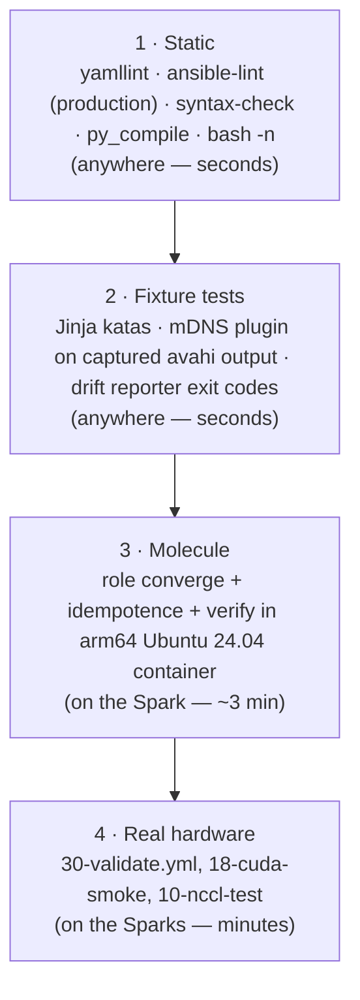

# Volume 21 — Testing the Lab Like Production: Lint, Syntax, Fixture Tests, Molecule on arm64, and CI with a Spark Runner

> **Module 01 · Part V — Production SRE** · Prev: [20 AWX in production](20-awx-tower-production-cluster-and-receptor.md) · Next: [22 Drift detection & self-healing](22-configuration-drift-detection-and-self-healing.md)

| | |
|---|---|
| **You will build** | A test pyramid for the lab: `yamllint` + `ansible-lint` (production profile), syntax checks, **fixture tests** for the parsers and plugins, **Molecule** for a role in an arm64 container on the Spark, and a GitHub Actions workflow that runs the cheap layers on every PR and Molecule on demand on a **self-hosted Spark runner** |
| **Hardware** | Control node; 1× Spark for Molecule and as a CI runner |
| **Time** | 90 min |
| **Risk** | None |

---

## 1. The pyramid, and what each layer catches



| Layer | Catches | Real examples from building this lab |
|---|---|---|
| Static | Style, deprecated syntax, risky shell, missing `changed_when`, `become_user` without `become`, relative `src:` paths | `partial-become` in the NCCL build; `no-relative-paths` for `uma_probe.cu`; `risky-shell-pipe` in the drain capture |
| Fixture | Logic bugs in parsing and templating | Tuples breaking JMESPath; case-insensitive `sort`; `\\d` in a folded scalar; JSON callback output followed by timer text breaking the drift parser |
| Molecule | Non-idempotent tasks, packaging and handler ordering, platform assumptions | Container-mode switches (`spark_baseline_container_mode`) that skip sysctl/timezone where they can't work |
| Hardware | Driver, fabric, GPU reality | Only the Sparks can tell you that the link negotiated 200G |

---

## 2. Static and fixture layers: one script

```bash
# lab/tests/run-local-checks.sh
#!/usr/bin/env bash
# Everything CI runs that doesn't need a Spark. Run from lab/:  tests/run-local-checks.sh
set -euo pipefail
cd "$(dirname "$0")/.."
export ANSIBLE_CONFIG=$PWD/ansible.cfg
echo "== yamllint";      yamllint -s .
echo "== ansible-lint";  ansible-lint
echo "== syntax-check";  for p in playbooks/*.yml; do ansible-playbook --syntax-check "$p" >/dev/null; done
echo "== jinja katas";   kata=$(ansible-playbook playbooks/15-jinja-lab.yml); grep -q '7/7 Jinja katas passed' <<<"$kata"
echo "== mdns plugin";   out=$(ANSIBLE_INVENTORY_ENABLED=spark_mdns ansible-inventory -i tests/fixtures/spark.mdns.yml --list)
                         echo "$out" | python3 -c 'import json,sys; d=json.load(sys.stdin); assert sorted(d["spark"]["hosts"])==["dgx-spark-01","dgx-spark-02"], d'
echo "== drift report";  set +e; python3 tools/spark_drift_report.py tests/fixtures/drift-sample.json >/dev/null; rc=$?; set -e
                         [ "$rc" -eq 2 ] || { echo "expected exit 2 (drift), got $rc"; exit 1; }
echo "== python tools";  python3 -m py_compile tools/*.py roles/spark_facts/files/spark.fact inventory_plugins/*.py
echo "== shell";         bash -n roles/gpu_telemetry/files/*.sh roles/slurm_cluster/files/*.sh tools/*.sh
echo "ALL LOCAL CHECKS PASSED"
```

```bash
cd "01 Ansible/lab"
tests/run-local-checks.sh
```

### 2.1 Lint configuration

```yaml
# lab/.ansible-lint
---
profile: production
exclude_paths:
  - .cache/
  - collections/
  - roles/*/molecule/
skip_list:
  - var-naming[no-role-prefix]   # inventory-level vars (cx7_interfaces, spark_expected) are shared on purpose
warn_list:
  - experimental
```

```yaml
# lab/.yamllint
---
extends: default
rules:
  line-length: {max: 160, level: warning}
  truthy: {allowed-values: ["true", "false", "yes", "no"], check-keys: false}
  comments: {min-spaces-from-content: 1}
  comments-indentation: disable
  braces: {max-spaces-inside: 1}
  octal-values: {forbid-implicit-octal: true, forbid-explicit-octal: true}
ignore: |
  .cache/
  collections/
```

The `production` profile is the strictest built-in profile. Every exception in the lab is a targeted `# noqa: <rule> (reason)` on a single task, never a blanket skip. Examples: `no-handler` where validation must run *before* apply in the same play, and `command-instead-of-module` for `apt-get -s`, which no module can do.

### 2.2 Fixture tests: capture once, test forever

The trick for hardware-dependent code: **capture real command output once from the Spark, commit it as a fixture, and test the parser against it** in CI.

```bash
# on a Spark
avahi-browse -p -r -t _ssh._tcp > tests/fixtures/avahi-browse.txt
ibdev2netdev > tests/fixtures/ibdev2netdev.txt
nvidia-smi --query-gpu=index,name,temperature.gpu,power.draw,utilization.gpu,memory.used --format=csv > tests/fixtures/smi.csv
ANSIBLE_STDOUT_CALLBACK=ansible.posix.json ansible-playbook playbooks/20-drift-check.yml > tests/fixtures/drift-real.json
```

Then add a case to `run-local-checks.sh`. The Jinja katas (Volume 04) are this pattern taken to its conclusion.

---

## 3. Molecule on the Spark (arm64)

```yaml
# lab/roles/spark_baseline/molecule/default/molecule.yml
---
# molecule test -s default   (run from roles/spark_baseline)
# Uses an arm64 Ubuntu 24.04 container — run it ON the Spark to test the
# same architecture you deploy to. Hardware tasks are skipped via
# spark_baseline_container_mode.
dependency:
  name: galaxy
  options:
    requirements-file: ../../requirements.yml
driver:
  name: docker
platforms:
  - name: noble-arm64
    image: ubuntu:24.04
    platform: linux/arm64
    pre_build_image: false
    command: /lib/systemd/systemd
    privileged: true
    cgroupns_mode: host
    volumes:
      - /sys/fs/cgroup:/sys/fs/cgroup:rw
provisioner:
  name: ansible
  inventory:
    host_vars:
      noble-arm64:
        spark_baseline_container_mode: true
        spark_baseline_hold_nvidia: false
        spark_baseline_packages: [chrony, jq, ethtool, openssh-server]
        spark_baseline_admin_user: root
        spark_baseline_admin_pubkeys: ["ssh-ed25519 AAAAC3NzaC1lZDI1NTE5AAAAIMoleculeTestKeyOnlyNotRealxxxxxxxxxxxxxxx molecule"]
verifier:
  name: ansible
scenario:
  test_sequence: [dependency, destroy, create, prepare, converge, idempotence, verify, destroy]
```

```yaml
# lab/roles/spark_baseline/molecule/default/converge.yml
---
- name: Converge
  hosts: all
  become: true
  roles:
    - role: spark_baseline
```

```yaml
# lab/roles/spark_baseline/molecule/default/verify.yml
---
- name: Verify
  hosts: all
  become: true
  gather_facts: false
  tasks:
    - name: Sshd config validates
      ansible.builtin.command: sshd -t
      changed_when: false
    - name: Root login disabled
      ansible.builtin.command: grep -q '^PermitRootLogin no' /etc/ssh/sshd_config.d/60-spark-hardening.conf
      changed_when: false
    - name: Journald is persistent
      ansible.builtin.command: grep -q 'Storage=persistent' /etc/systemd/journald.conf.d/60-spark.conf
      changed_when: false
    - name: Chrony is configured
      ansible.builtin.command: grep -q '^pool ' /etc/chrony/chrony.conf
      changed_when: false
```

```bash
# on dgx-spark-01 (native arm64 container; no emulation)
cd "01 Ansible/lab/roles/spark_baseline"
python3 -m venv ~/.venvs/molecule && . ~/.venvs/molecule/bin/activate
pip install -r ../../requirements.txt
molecule test              # destroy → create → prepare → converge → idempotence → verify → destroy
molecule converge && molecule login   # iterate interactively
```

**The idempotence step is the most valuable one.** Molecule runs converge twice and fails if the second run reports any `changed`. That catches `command`/`shell` tasks without `changed_when`/`creates`.

### 3.1 Designing roles for testability

| Pattern | In the lab |
|---|---|
| A container-mode flag to skip kernel/hardware tasks | `spark_baseline_container_mode` |
| Hardware assertions in a separate role | `spark_validate`, which runs only on real nodes |
| Pure functions (parsers) moved to filter plugins or fixture-tested Jinja | `ibdev2netdev` filter (Volume 04 §2.3) |
| Side-effect tasks guarded by `when: not ansible_check_mode` where check mode can't simulate them | Drift checks stay clean |
| Read-only probes marked `check_mode: false` so they still run under `--check` | `kubeadm_cluster` (CRI reachable, node registered), `spark_validate`, `node_drain` forensics |
| One source of truth shared with another lab, instead of a copy | `vclusters` applies `02 Kubernetes/lab/vclusters/*.yaml` and `manifests/root/05-vclusters`, so the 02 lab's CI tests the same files |

---

## 4. CI

```yaml
# .github/workflows/ansible-lab-ci.yml
# CI for "01 Ansible/lab" — see 01 Ansible/21-ansible-testing-linting-and-molecule.md
name: ansible-lab

on:
  pull_request:
    paths: ["01 Ansible/lab/**", ".github/workflows/ansible-lab-ci.yml"]
  push:
    branches: [main]
    paths: ["01 Ansible/lab/**"]
  workflow_dispatch:
    inputs:
      molecule:
        description: "Run Molecule on the self-hosted DGX Spark runner (arm64)"
        type: boolean
        default: false

defaults:
  run:
    working-directory: "01 Ansible/lab"

jobs:
  static:
    name: lint · syntax · katas · tool tests
    runs-on: ubuntu-latest
    steps:
      - uses: actions/checkout@v4
      - uses: actions/setup-python@v5
        with:
          python-version: "3.12"
          cache: pip
          cache-dependency-path: "01 Ansible/lab/requirements.txt"
      - name: Install control-node deps
        run: |
          pip install "ansible-core~=2.18.0" "ansible-lint>=24" "yamllint>=1.35" jmespath netaddr
          ansible-galaxy collection install -r requirements.yml -p ./collections
      - name: Run all local checks
        run: tests/run-local-checks.sh

  molecule-arm64:
    name: molecule (spark_baseline) on DGX Spark
    if: github.event_name == 'workflow_dispatch' && inputs.molecule
    needs: static
    runs-on: [self-hosted, linux, ARM64, spark]
    steps:
      - uses: actions/checkout@v4
      - name: Molecule test
        working-directory: "01 Ansible/lab/roles/spark_baseline"
        run: |
          python3 -m venv .venv && . .venv/bin/activate
          pip install -r ../../requirements.txt
          molecule test
```

### 4.1 Register the Spark as a self-hosted runner

```bash
# on dgx-spark-01, as a non-root user in the docker group
mkdir ~/actions-runner && cd ~/actions-runner
# download the linux-arm64 runner from: GitHub repo → Settings → Actions → Runners → New self-hosted runner
./config.sh --url https://github.com/cloudone365/technical-depth --token <TOKEN> --labels spark --unattended
sudo ./svc.sh install && sudo ./svc.sh start
```

**Security:** a self-hosted runner executes code from workflows. Restrict it to `workflow_dispatch` (as above) and never run it for PRs from forks. On a public repo, disable fork-PR workflows on self-hosted runners entirely.

### 4.2 Gating merges

In the repo's branch protection, require the `ansible-lab / static` check. Molecule stays manual (it needs the Spark to be online), and hardware validation is part of the release checklist (Volume 25).

---

### 4.3 What the Kubernetes roles get from CI

The Kubernetes stage (`kubeadm_cluster`, `cilium`, `metallb`, `gpu_operator`, `vclusters`) can't converge on a GitHub runner: kubeadm wants a real host, and the GPU Operator wants a GB10. It gets three layers of cover:

| Layer | Where | What it proves |
|---|---|---|
| Lint + `--syntax-check` | `ansible-lab` workflow (`tests/run-local-checks.sh`) | `05-kubernetes.yml`, `06-gpu-operator.yml`, `06b-vclusters.yml`, `99-reset-kubernetes.yml` parse; production-profile lint on every role |
| Same manifests on kind | `.github/workflows/k8s-lab-ci.yml`, which also triggers on `01 Ansible/lab/roles/**` | A kind cluster renamed to context `spark-root` (fake GB10 node) runs the root budgets, both vClusters from `vclusters/*.yaml`, and the tenant checks: the exact files the `vclusters` role applies |
| Hardware | `playbooks/30-validate.yml` on the Spark (Volume 25) | `k8s_ready_gpu`: the node is `Ready` and advertises `nvidia.com/gpu` > 0 |

## 5. Troubleshooting & diagnostics

| Symptom | Diagnose | Fix |
|---|---|---|
| ansible-lint passes locally, fails in CI | Versions: `ansible-lint --version` in both places | Pin `ansible-lint` and `ansible-core`; run CI's exact command locally |
| `couldn't resolve module/action` in lint | Collections not installed where lint looks | `ansible-galaxy collection install -r requirements.yml -p ./collections`; `collections_path` in `ansible.cfg` |
| Molecule: `exec format error` | Image arch | `platform: linux/arm64` + run on the Spark |
| Molecule create hangs on systemd image | cgroup mounts | `privileged: true`, `cgroupns_mode: host`, `/sys/fs/cgroup` rw (as in the config) |
| Idempotence fails on `apt` with `update_cache` | `cache_valid_time` missing | Add `cache_valid_time: 3600` |
| Self-hosted job stays queued | Runner offline, or the labels don't match | `sudo ./svc.sh status`; labels must include `self-hosted, linux, ARM64, spark` |

## 6. Validation

- [ ] `tests/run-local-checks.sh` passes locally and in GitHub Actions.
- [ ] `molecule test` passes on the Spark, including idempotence.
- [ ] Branch protection requires the static job.
- [ ] You added one new fixture captured from your own Spark.
