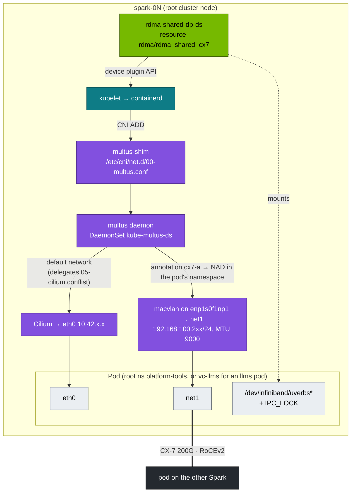

# Step 21 · Multus & Secondary RDMA Networks for Pods (CX-7 Fabric Inside Kubernetes, Chained with Cilium, Reachable from a vCluster)

> **01 Ansible · Part IV — Secrets & platforms · Step 21 of 30** · ← [Step 20 · GPU Operator](20-nvidia-gpu-operator-and-time-slicing.md) · [All steps](00-ansible-step-by-step-guide.md) · [Step 22 · Slurm](22-slurm-gres-and-cgroup-gpus.md) →
>
> Requires: [Step 19 · Kubernetes with kubeadm](19-kubernetes-kubeadm-root-cluster-and-vclusters.md).

| | |
|---|---|
| **You will build** | Pods with **two** interfaces: `eth0` on Cilium for control traffic, `net1` on the 200G CX-7 fabric. RDMA verbs access comes through an extended resource, proven with a pod-to-pod `ib_write_bw` across Sparks. The same fabric is then reachable from a pod in the `llms` vCluster |
| **Hardware** | 2× DGX Spark in the root cluster (single Spark works too; both pods then land on one node) |
| **Time** | 60–90 min |
| **Risk** | Low–medium. Adds a CNI meta-plugin in front of Cilium; the pod network itself is untouched |
| **Clusters** | `spark-root` (Multus, device plugin, NADs, test pods in `platform-tools`), `llms` (§3.3, a pod in `batch`) |
| **Lab files** | [`playbooks/13-multus-rdma.yml`](lab/playbooks/13-multus-rdma.yml), [`playbooks/templates/rdma-shared-dp.yaml.j2`](lab/playbooks/templates/rdma-shared-dp.yaml.j2), [`roles/cilium`](lab/roles/cilium) (`cni.exclusive=false`), 02 Kubernetes [`manifests/llms/85-network-operator/`](../02%20Kubernetes/lab/manifests/llms/85-network-operator) (the Network Operator alternative) |

---

## 1. Why pods need a second network

Cilium gives every pod an overlay IP (VXLAN over the 10GbE mgmt link, Step 19 §2.1). That's fine for APIs and Ray control traffic, but **it can't carry RDMA**: verbs need direct access to the NIC's RDMA device and a GID on the physical fabric. Distributed training and multi-node inference pods therefore need:

1. a **second interface** on the CX-7 fabric (Multus + macvlan/host-device/SR-IOV), and
2. **access to the RDMA device** (`/dev/infiniband/*`), handed out as a schedulable resource by a device plugin, and
3. `IPC_LOCK` (RDMA pins memory).

None of this is in the pod network, so none of it is governed by Cilium. That has consequences for multi-tenancy (§2.3).

## 2. Architecture

### 2.1 HLD



### 2.2 LLD

| Component | Choice in this lab | Production alternative |
|---|---|---|
| Multus | Upstream **thick plugin** v4.3.0: the release's `deployments/multus-daemonset-thick.yml`, applied unchanged. DaemonSet `kube-system/kube-multus-ds`, a small `multus-shim` binary in `/opt/cni/bin`, the real work in the per-node daemon | NVIDIA **Network Operator** (bundles Multus, IPAM, RDMA/SR-IOV device plugins). The 02 lab ships a `NicClusterPolicy` for it ([`root/85-network-operator`](../02%20Kubernetes/lab/manifests/root/85-network-operator/nicclusterpolicy.yaml)); use **one** of the two |
| Chaining with Cilium | Multus auto-generates `00-multus.conf` from the first config it finds (`05-cilium.conflist`) and makes Cilium the default network. Works because Step 19 installed Cilium with `cni.exclusive=false` | Same |
| Secondary CNI | `macvlan` bridge mode, master = CX-7 netdev, MTU 9000 | `host-device` (a whole netdev per pod), or SR-IOV VFs (one VF per pod, hardware isolation) |
| IPAM | `static`, IP given per pod in the annotation (deterministic for a lab) | `whereabouts` (cluster-wide ranges), as in the Network Operator path |
| RDMA exposure | `k8s-rdma-shared-dev-plugin`, selecting netdevs `enp1s0f1np1`, `enP2p1s0f1np1`, up to 64 pods per device (`rdmaHcaMax`) | SR-IOV network device plugin (exclusive VFs) |
| NADs | `cx7-a` (`enp1s0f1np1`, 192.168.100.0/24), `cx7-b` (`enP2p1s0f1np1`, 192.168.101.0/24) in **`platform-tools`** and **`vc-llms`** | One per tenant namespace, created by the platform team |
| CNI paths | kubeadm standard: config `/etc/cni/net.d`, binaries `/opt/cni/bin` (the reference plugins `macvlan` and `static` come with the `kubernetes-cni` package that is installed alongside kubeadm) | Same |

> **Why macvlan works for RoCE:** the mlx5 driver installs RoCE GIDs for IPs on macvlan upper devices, so a pod's `net1` IP gets its own RoCEv2 GID on the physical port. Check it with `show_gids` on the host after a pod starts.

### 2.3 NADs are namespaced, and the vCluster's namespace is `vc-llms`

A pod asks for a secondary network with the annotation `k8s.v1.cni.cncf.io/networks: cx7-a`. Multus runs on the root, reads the pod from the **root** API server, and looks up the NetworkAttachmentDefinition named `cx7-a` **in the pod's namespace**.

For a pod in the `llms` vCluster, that namespace is not `batch`:

```text
inside llms:   batch / rdma-llms                    annotation k8s.v1.cni.cncf.io/networks: [{"name":"cx7-a",…}]
on the root:   vc-llms / rdma-llms-x-batch-x-llms   same annotation, copied unchanged by the syncer
Multus:        NAD vc-llms/cx7-a                    ← created by playbook 13 on the root
```

So the playbook creates the NADs in `vc-llms`, where the llms pods really run. Tenants can't create them: NetworkAttachmentDefinition is a CRD on the root, and the vCluster neither has it nor syncs it. The platform team decides which fabrics a vCluster may use by deciding which NADs exist in its host namespace. `dev-lab` gets none, so a dev-lab pod that asks for `cx7-a` stays in `ContainerCreating` with a Multus "NAD not found" error.

What this does **not** give you, and what to add for real tenants:

| Gap | Why | Fix |
|---|---|---|
| A pod can name a NAD in *another* namespace (`platform-tools/cx7-a`) | The upstream daemon config doesn't enable Multus's `namespaceIsolation` | Add `"namespaceIsolation": true` (and `globalNamespaces` if needed) to the `multus-daemon-config` ConfigMap |
| Cilium policies (`vcluster-boundary`, tenant NetworkPolicies) don't apply on `net1` | macvlan traffic never passes through Cilium | Separate subnets/VLANs per tenant, or SR-IOV VFs with switch-side ACLs |
| `rdma/rdma_shared_cx7` isn't in the vCluster budget | `vcluster-budget` lists CPU, memory, GPU, storage | Add `requests.rdma/rdma_shared_cx7` to the root quota on `vc-llms` |
| Static IPs collide across namespaces silently | `static` IPAM has no shared state | A convention (here: `.201–.209` platform, `.211–.229` llms) or whereabouts |

---

## 3. Hands-on

```yaml
# lab/playbooks/13-multus-rdma.yml
---
# Secondary CX-7 networks for pods: Multus + macvlan (static IPAM) + RDMA shared device plugin.
# Result: a pod gets eth0 (Cilium) AND net1 on the 200G fabric with RDMA verbs access.
# Cilium was installed with cni.exclusive=false (roles/cilium) so it leaves Multus's
# config alone in /etc/cni/net.d.
#
#   ansible-playbook playbooks/13-multus-rdma.yml
- name: Multus + RDMA on the root cluster
  hosts: localhost
  connection: local
  gather_facts: false
  vars:
    kubeconfig: "{{ playbook_dir }}/../.cache/kubeconfig-{{ lab_name | default('spark-lab') }}.yaml"
    kube_context: spark-root
    multus_version: v4.3.0                   # check https://github.com/k8snetworkplumbingwg/multus-cni/releases
    multus_rdma_resource: rdma_shared_cx7
    multus_rdma_ifnames: [enp1s0f1np1, enP2p1s0f1np1]
    multus_rdma_dp_image: ghcr.io/mellanox/k8s-rdma-shared-dev-plugin:latest   # pin a release tag
    multus_test_image: ubuntu:24.04          # perftest + verbs utils installed at start (readiness waits for it)
    # NADs are namespaced: platform-tools for the platform test pods below, vc-llms
    # because that is where the llms vCluster's batch pods really run on the root.
    multus_nad_namespaces: [platform-tools, vc-llms]
    multus_test_namespace: platform-tools
    multus_nads:
      - { name: cx7-a, master: enp1s0f1np1, subnet: 192.168.100.0/24 }
      - { name: cx7-b, master: enP2p1s0f1np1, subnet: 192.168.101.0/24 }
  module_defaults:
    group/kubernetes.core.k8s:
      kubeconfig: "{{ kubeconfig }}"
      context: "{{ kube_context }}"
  tasks:
    # ---------------------------------------------------------------- Multus (thick plugin) from upstream
    - name: Download the Multus thick-plugin manifest
      ansible.builtin.get_url:
        url: "https://raw.githubusercontent.com/k8snetworkplumbingwg/multus-cni/{{ multus_version }}/deployments/multus-daemonset-thick.yml"
        dest: "{{ playbook_dir }}/../.cache/multus-{{ multus_version }}.yml"
        mode: "0644"

    - name: Multus DaemonSet (standard kubeadm paths /etc/cni/net.d and /opt/cni/bin)
      kubernetes.core.k8s:
        src: "{{ playbook_dir }}/../.cache/multus-{{ multus_version }}.yml"
        state: present

    - name: Wait for Multus DaemonSet
      kubernetes.core.k8s_info:
        kubeconfig: "{{ kubeconfig }}"
        kind: DaemonSet
        namespace: kube-system
        name: kube-multus-ds
      register: multus_ds
      until: >-
        multus_ds.resources | length > 0 and
        multus_ds.resources[0].status.numberReady | default(0) == multus_ds.resources[0].status.desiredNumberScheduled | default(-1)
      retries: 30
      delay: 10

    # ---------------------------------------------------------------- RDMA shared device plugin
    - name: RDMA shared device plugin
      kubernetes.core.k8s:
        kubeconfig: "{{ kubeconfig }}"
        state: present
        template: rdma-shared-dp.yaml.j2

    # ---------------------------------------------------------------- namespaces
    - name: Platform-tools namespace (also created by the 02 lab's manifests/root/00-platform)
      kubernetes.core.k8s:
        definition:
          apiVersion: v1
          kind: Namespace
          metadata:
            name: platform-tools
            labels:
              spark.lab/tier: platform
              pod-security.kubernetes.io/enforce: privileged

    - name: Which NAD namespaces exist (vc-llms appears once playbook 06b has run)?
      kubernetes.core.k8s_info:
        kind: Namespace
      register: multus_ns

    - name: Keep only existing namespaces
      ansible.builtin.set_fact:
        multus_nad_namespaces: "{{ multus_nad_namespaces | intersect(multus_ns.resources | map(attribute='metadata.name') | list) }}"

    # ---------------------------------------------------------------- NetworkAttachmentDefinitions
    - name: Macvlan NADs on the CX-7 netdevs (static IPAM — IP chosen per pod)
      kubernetes.core.k8s:
        kubeconfig: "{{ kubeconfig }}"
        definition:
          apiVersion: k8s.cni.cncf.io/v1
          kind: NetworkAttachmentDefinition
          metadata:
            name: "{{ item.0.name }}"
            namespace: "{{ item.1 }}"
          spec:
            config: >-
              {{ {'cniVersion': '0.3.1', 'type': 'macvlan', 'master': item.0.master, 'mode': 'bridge',
                  'mtu': 9000, 'capabilities': {'ips': true}, 'ipam': {'type': 'static'}} | to_json }}
      loop: "{{ multus_nads | product(multus_nad_namespaces) | list }}"
      loop_control: { label: "{{ item.1 }}/{{ item.0.name }} -> {{ item.0.master }}" }

    - name: Wait until every node advertises the RDMA resource
      kubernetes.core.k8s_info:
        kubeconfig: "{{ kubeconfig }}"
        kind: Node
      register: multus_nodes
      until: >-
        multus_nodes.resources
        | map(attribute='status.allocatable')
        | selectattr('rdma/' ~ multus_rdma_resource, 'defined')
        | list | length == multus_nodes.resources | length
      retries: 18
      delay: 10

    # ---------------------------------------------------------------- test pods, one per node
    - name: RDMA test pods
      kubernetes.core.k8s:
        kubeconfig: "{{ kubeconfig }}"
        wait: true
        wait_timeout: 600
        definition:
          apiVersion: v1
          kind: Pod
          metadata:
            name: "rdma-test-{{ item.node }}"
            namespace: "{{ multus_test_namespace }}"
            annotations:
              k8s.v1.cni.cncf.io/networks: >-
                [{"name": "cx7-a", "ips": ["{{ item.ip }}/24"]}]
          spec:
            nodeName: "{{ item.node }}"
            restartPolicy: Never
            containers:
              - name: t
                image: "{{ multus_test_image }}"
                command:
                  - sh
                  - -c
                  - apt-get update -qq && apt-get install -y -qq perftest ibverbs-utils iproute2 >/dev/null && sleep infinity
                readinessProbe:
                  exec: { command: [sh, -c, "command -v ib_write_bw"] }
                  periodSeconds: 5
                securityContext:
                  capabilities: { add: [IPC_LOCK] }
                resources:
                  limits:
                    "rdma/{{ multus_rdma_resource }}": 1
      loop:
        - { node: "{{ groups['spark'][0] }}", ip: 192.168.100.201 }
        - { node: "{{ groups['spark'][1] | default(groups['spark'][0]) }}", ip: 192.168.100.202 }
      loop_control: { label: "{{ item.node }} {{ item.ip }}" }

    - name: Show net1 inside each pod
      kubernetes.core.k8s_exec:
        kubeconfig: "{{ kubeconfig }}"
        namespace: "{{ multus_test_namespace }}"
        pod: "rdma-test-{{ item }}"
        command: sh -c "ip -br addr show net1; ls /dev/infiniband"
      loop: "{{ groups['spark'] }}"
      register: multus_exec
      changed_when: false
      failed_when: false

    - name: Result
      ansible.builtin.debug:
        msg: "{{ multus_exec.results | map(attribute='stdout') | list }}"
```

Things worth noticing:

- **`module_defaults` pins the cluster.** Every `kubernetes.core` task gets `context: spark-root` from the action group, so none of them can land in a vCluster even though the lab kubeconfig's other contexts are one typo away.
- **The NAD namespaces are discovered, not assumed.** Run 13 before 06b and you get NADs in `platform-tools` only. Run it again after 06b and `vc-llms` gets its pair. `product()` builds the namespace × fabric matrix in one loop.
- **The test pods live in `platform-tools`** (privileged PSA). It is the root namespace for the platform team's node-level tools, and it holds no tenant workloads.
- **Pin what you download.** The playbook pins the *manifest* to the `v4.3.0` tag, but check the image tag inside `.cache/multus-v4.3.0.yml` (`grep image:`). Upstream manifests have pointed at a moving `snapshot` tag before; replace it with the release tag if so. The RDMA device plugin is on `:latest` until you pin it.

```yaml
# lab/playbooks/templates/rdma-shared-dp.yaml.j2
# {{ ansible_managed }}
# k8s-rdma-shared-dev-plugin: exposes the host RDMA devices behind the listed
# netdevs as an extended resource (rdma/{{ multus_rdma_resource }}) that pods request.
apiVersion: v1
kind: ConfigMap
metadata:
  name: rdma-devices
  namespace: kube-system
data:
  config.json: |
    {
      "periodicUpdateInterval": 300,
      "configList": [
        {
          "resourceName": "{{ multus_rdma_resource }}",
          "rdmaHcaMax": 64,
          "selectors": { "ifNames": {{ multus_rdma_ifnames | to_json }} }
        }
      ]
    }
---
apiVersion: apps/v1
kind: DaemonSet
metadata:
  name: rdma-shared-dp-ds
  namespace: kube-system
spec:
  selector:
    matchLabels: { name: rdma-shared-dp-ds }
  template:
    metadata:
      labels: { name: rdma-shared-dp-ds }
    spec:
      hostNetwork: true
      priorityClassName: system-node-critical
      containers:
        - name: k8s-rdma-shared-dp-ds
          image: {{ multus_rdma_dp_image }}
          imagePullPolicy: IfNotPresent
          securityContext:
            privileged: true
          volumeMounts:
            - { name: device-plugin, mountPath: /var/lib/kubelet/device-plugins }
            - { name: plugins-registry, mountPath: /var/lib/kubelet/plugins_registry }
            - { name: config, mountPath: /k8s-rdma-shared-dev-plugin }
            - { name: devs, mountPath: /dev/ }
      volumes:
        - { name: device-plugin, hostPath: { path: /var/lib/kubelet/device-plugins } }
        - { name: plugins-registry, hostPath: { path: /var/lib/kubelet/plugins_registry } }
        - { name: config, configMap: { name: rdma-devices, items: [{ key: config.json, path: config.json }] } }
        - { name: devs, hostPath: { path: /dev/ } }
```

```bash
cd "01 Ansible/lab"
export KUBECONFIG=$PWD/.cache/kubeconfig-spark-lab.yaml
ansible-playbook playbooks/13-multus-rdma.yml
kubectl --context spark-root get net-attach-def -A                  # cx7-a, cx7-b in platform-tools (and vc-llms after 06b)
kubectl --context spark-root get nodes -o custom-columns=NAME:.metadata.name,RDMA:.status.allocatable.rdma/rdma_shared_cx7,GPU:.status.allocatable.nvidia\\.com/gpu
ssh nvidia@192.168.0.100 'ls /etc/cni/net.d; ls /opt/cni/bin | grep -E "multus|macvlan|static|cilium"'
```

Expected on each node: `RDMA` 64, `GPU` 15. In `/etc/cni/net.d`, `00-multus.conf` sorts before `05-cilium.conflist`. The container runtime uses the first config in lexical order, so every pod now goes through Multus, and Multus hands the default network to Cilium. With `cni.exclusive=true` (Cilium's default) the Cilium agent would rename `00-multus.conf` out of the way on its next restart, and `net1` would silently stop appearing.

### 3.1 Pod-to-pod RDMA across Sparks

```bash
kubectl --context spark-root -n platform-tools exec rdma-test-dgx-spark-2 -- ib_write_bw -d rocep1s0f1 -q 4 -D 10 --report_gbits -F &
sleep 3
kubectl --context spark-root -n platform-tools exec rdma-test-dgx-spark-1 -- ib_write_bw -d rocep1s0f1 -q 4 -D 10 --report_gbits -F 192.168.100.202
```

Inside the pods, `ibv_devices` shows the host's RDMA devices, because the shared plugin exposes them (not isolated). The traffic's source address is the pod's macvlan IP, `.201`/`.202`. Compare the number with the host-level perftest from Step 13: it should be within a few percent. On a single Spark both pods sit on dgx-spark-1 and the test runs through the NIC's internal switch; the number says nothing about the cable.

Multus also records what it did, on the root object:

```bash
kubectl --context spark-root -n platform-tools get pod rdma-test-dgx-spark-1 \
  -o jsonpath='{.metadata.annotations.k8s\.v1\.cni\.cncf\.io/network-status}' | jq '.[] | {name, interface, ips}'
```

### 3.2 A GPU + RDMA pod (what real workloads request)

Real training pods belong to a tenant, so this one runs in the `llms` vCluster's `batch` namespace. Inside `llms`, `batch` enforces `privileged` PSA, because `IPC_LOCK` is not allowed under `baseline`. On the root, `vc-llms` is privileged for the same reason. PSA is checked twice, once by each API server, and both must allow it.

```yaml
# nccl-worker-0.yaml (apply with --context llms)
apiVersion: v1
kind: Pod
metadata:
  name: nccl-worker-0
  namespace: batch
  annotations:
    k8s.v1.cni.cncf.io/networks: '[{"name":"cx7-a","ips":["192.168.100.211/24"]},{"name":"cx7-b","ips":["192.168.101.211/24"]}]'
spec:
  nodeSelector: { kubernetes.io/hostname: dgx-spark-1 }
  containers:
    - name: w
      image: nvcr.io/nvidia/pytorch:25.09-py3
      command: [sleep, infinity]
      env:
        - { name: NCCL_SOCKET_IFNAME, value: eth0 }            # bootstrap over the pod network (Cilium)
        - { name: NCCL_IB_HCA,        value: "rocep1s0f1,roceP2p1s0f1" }
        - { name: NCCL_DEBUG,         value: INFO }
      securityContext: { capabilities: { add: [IPC_LOCK] } }
      resources:
        requests: { cpu: 500m }
        limits:
          nvidia.com/gpu: 1
          rdma/rdma_shared_cx7: 1
          memory: 16Gi                                         # the root quota caps limits.memory; set it yourself
```

Every limit on this pod is checked in a different place. `nvidia.com/gpu: 1` passes the llms CEL policy (at most one slice) and is then charged against `vc-llms`'s 8 slices by the root quota. `memory: 16Gi` counts against the 48 Gi budget. `rdma/rdma_shared_cx7` is checked by nobody until the kubelet's device plugin, which is the quota gap from §2.3.

### 3.3 Follow the annotation from the vCluster to the NIC

```bash
kubectl --context llms apply -f nccl-worker-0.yaml
kubectl --context llms -n batch get pod nccl-worker-0 -o wide                  # Running, IP 10.42.x.x (eth0)
HOSTPOD=$(kubectl --context spark-root -n vc-llms get pods -o json \
  | jq -r '.items[] | select(.metadata.annotations["vcluster.loft.sh/object-name"]=="nccl-worker-0") | .metadata.name')
echo "$HOSTPOD"                                                                # nccl-worker-0-x-batch-x-llms
kubectl --context spark-root -n vc-llms get pod "$HOSTPOD" \
  -o jsonpath='{.metadata.annotations.k8s\.v1\.cni\.cncf\.io/networks}{"\n"}'  # copied unchanged
kubectl --context spark-root -n vc-llms get pod "$HOSTPOD" \
  -o jsonpath='{.metadata.annotations.k8s\.v1\.cni\.cncf\.io/network-status}' | jq -c '.[] | {name, interface, ips}'   # cilium/eth0, vc-llms/cx7-a/net1, vc-llms/cx7-b/net2
kubectl --context llms -n batch exec nccl-worker-0 -- sh -c 'ip -br addr; ls /dev/infiniband'
kubectl --context llms -n batch exec nccl-worker-0 -- bash -c \
  'apt-get update -qq && apt-get install -y -qq iputils-ping >/dev/null; ping -c3 -I net1 192.168.100.201'   # platform-tools pod from §3
kubectl --context llms -n batch delete pod nccl-worker-0
```

Read the result as a chain. The tenant wrote an annotation in `llms`. The syncer copied it to the root pod in `vc-llms`. Multus on the node read the **root** pod and resolved `cx7-a` in `vc-llms`. It created `net1` and `net2` (macvlan), and `network-status` lands on the root copy, the object Multus knows about. Read it there. The tenant's `kubectl exec` works through the vCluster, which proxies it to the root kubelet.

The ping shows the §2.3 gap. A pod in `llms` reaches a `platform-tools` pod on the fabric subnet: Cilium policies, the root's `vcluster-boundary` included, only govern `eth0`. Two macvlan pods on the same master talk to each other in bridge mode, even on one node; only the node's own host can't reach them. Use the `.202` pod on dgx-spark-2 for a cross-node test. The 02 lab's [`rdma-test-pod.yaml`](../02%20Kubernetes/lab/manifests/llms/85-network-operator/rdma-test-pod.yaml) does the same with the Network Operator's NAD `cx7-rdma` (whereabouts IPAM, no `ips` needed). That NAD exists only on the Network Operator path, so with this playbook use `cx7-a` as above.

---

## 4. Integrations

| With | Note |
|---|---|
| Root cluster (Step 19) | Cilium `cni.exclusive=false`; Multus uses the standard kubeadm CNI paths |
| GPU Operator (Step 20) | Independent: GPU via `nvidia.com/gpu`, RDMA via `rdma/*`. Both limits go on the same container |
| Time-slicing (Step 20) | Several pods can share the GPU **and** the shared RDMA device. Neither is isolated, and that's fine for a lab |
| vClusters (Step 19 §3.4) | NADs in `vc-llms` only; tenants consume them by name, never create them |
| Slurm (Step 22) | Bare-metal jobs don't need any of this; it's the Kubernetes equivalent |
| Network Operator | For production, one Helm chart replaces §3: `NicClusterPolicy` with `rdmaSharedDevicePlugin`, `secondaryNetwork.multus`, `ipamPlugin` (02 Kubernetes Step 17 §5.6) |

## 5. Troubleshooting & diagnostics

| Symptom | Diagnose | Fix |
|---|---|---|
| Pod stuck `ContainerCreating`: `failed to find plugin "macvlan"` | `ls /opt/cni/bin` on the node | Reference plugins missing: `sudo apt-get install kubernetes-cni` (from pkgs.k8s.io; keep it at the version kubeadm pulled in) |
| Multus DS ready, but pods have no `net1` | `kubectl --context spark-root describe pod …` events; `ls /etc/cni/net.d` | `00-multus.conf` gone: Cilium renamed it (`cni.exclusive` not `false`; re-run 05). Or an annotation typo |
| vCluster pod: `cannot find a network-attachment-definition (cx7-a) in namespace (vc-llms)` | `kubectl --context spark-root -n vc-llms get net-attach-def` | Playbook 13 ran before 06b. Run it again |
| Tenant used `batch/cx7-a` in the annotation | Same error, namespace `batch` | `batch` doesn't exist on the root. Use the bare name |
| All pods stuck `ContainerCreating` after installing Multus | `kubectl --context spark-root -n kube-system logs ds/kube-multus-ds` | The daemon can't reach the API server or read `05-cilium.conflist`. Fix and restart the DS. Every pod's CNI ADD now passes through it |
| `net1` exists, ping to the other pod fails | `ip -d link show net1` in the pod; host `ip link show enp1s0f1np1` | Master netdev down or wrong; macvlan can't reach **its own host** (a known macvlan property). Test pod-to-pod across nodes |
| Node doesn't advertise `rdma/rdma_shared_cx7` | `kubectl --context spark-root -n kube-system logs ds/rdma-shared-dp-ds` | `ifNames` don't match the node's netdevs; image arch (`exec format error`) → use a multi-arch tag |
| `ibv_devices` empty in the pod | Resource not requested / plugin not mounting | Add the `rdma/…` limit; check `/dev/infiniband` inside the pod |
| `ib_write_bw: Couldn't allocate MR` / `Cannot allocate memory` | Locked-memory limit | `IPC_LOCK` capability; container `ulimit -l unlimited` (containerd default may be low) |
| llms pod rejected: `violates PodSecurity "baseline"` | Which namespace, which API server? | `IPC_LOCK` needs privileged PSA in **both** the inner namespace (`batch`) and the root namespace (`vc-llms`) |
| RDMA works but slower than on the host | MTU on the NAD vs the host netdev; QPs | NAD `mtu: 9000` must be ≤ the master's MTU; `-q 4` |

## 6. Validation

- [ ] `00-multus.conf` precedes `05-cilium.conflist` in `/etc/cni/net.d`, and survives a Cilium agent restart.
- [ ] Every node advertises `rdma/rdma_shared_cx7`.
- [ ] `cx7-a`/`cx7-b` exist in `platform-tools` and `vc-llms`, not in `vc-dev-lab`.
- [ ] `rdma-test-*` pods have `net1` with the expected IPs and `/dev/infiniband/uverbs*`.
- [ ] Pod-to-pod `ib_write_bw` is close to host-level perftest.
- [ ] A pod in `llms`/`batch` gets `net1` + `net2`, and you found its `network-status` on the root copy.
- [ ] (Stretch) Enable `namespaceIsolation` in Multus and show that `platform-tools/cx7-a` is refused from `vc-llms`; replace static IPAM with whereabouts, or swap the whole stack for the NVIDIA Network Operator.
