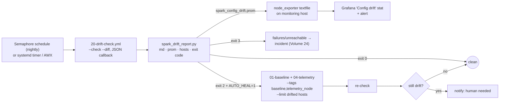

# Volume 22 — Configuration Drift Detection & Guarded Self-Healing for DGX Spark

> **Module 01 · Part V — Production SRE** · Prev: [21 Testing & CI](21-ansible-testing-linting-and-molecule.md) · Next: [23 Logging & audit](23-high-cardinality-logging-and-audit-compliance.md)

| | |
|---|---|
| **You will build** | A drift loop: check mode + diff against the desired state → machine-readable report (markdown, Prometheus metrics, exit codes, drifted-host list) → metrics on the Grafana dashboard → **auto-heal only safe drift on only the drifted hosts** → re-check. Scheduled nightly as the Semaphore template `20 Drift check` on sema01 (a systemd timer or AWX are the alternatives) |
| **Hardware** | 1–2× DGX Spark |
| **Time** | 60 min |
| **Risk** | Low for detection. Self-healing is deliberately limited to low-risk tags |

---

## 1. What counts as drift, and what's allowed to heal itself

| Drift source | Example on a Spark | Detected by | Auto-heal? |
|---|---|---|---|
| Config file edited by hand | `sysctl` tweak, sshd option, `chrony.conf` | `template`/`copy`/`sysctl` diff in check mode | ✅ `baseline` tag |
| Package state | NVIDIA hold removed; tool uninstalled | `apt` check mode; the explicit "missing holds" signal | ✅ (holds only) |
| Monitoring agent | timer disabled, collector edited | `gpu_telemetry` node tasks | ✅ `telemetry_node` tag |
| Fabric | netplan edited, MTU changed | `cx7_fabric` template diff | ❌ Notify only: a wrong heal cuts the link |
| Driver / kernel | DGX Dashboard update moved versions | Volume 07 audit (loaded ≠ on-disk = reboot pending) | ❌ Route to the upgrade playbook |
| Runtime | `daemon.json` edited, CDI stale | `container_runtime` diff + CDI freshness probe | ⚠️ Only when no containers are running (manual) |
| Kubernetes host config | `/etc/containerd/config.toml` lost the CRI plugin or `SystemdCgroup = true`; `/etc/kubernetes/kubeadm-config.yaml` edited | **Not** in `20-drift-check.yml`. Run the template `05 Kubernetes` as a dry run (`--check --diff`), or from the MacBook `ansible-playbook playbooks/05-kubernetes.yml --check --diff -l dgx-spark-1,localhost -K`; auditd key `kubernetes` / `container-runtime` shows who did it (Volume 23) | ❌ Never: restarting containerd restarts every pod on the node (root *and* both vClusters), and kubeadm doesn't reconcile a running control plane (the role prints the `kubeadm init phase` command instead) |
| Kubernetes objects | someone `kubectl edit`s the `vc-llms` ResourceQuota | Not Ansible's job: `kubectl --context spark-root diff -k "../02 Kubernetes/lab/manifests/root/05-vclusters"`, or Argo CD in the 02 Kubernetes production-mlops track | Via GitOps, not this loop |



---

## 2. Making check mode trustworthy (lessons baked into the roles)

Drift detection is only as good as your roles' behaviour under `--check`. Three rules, all applied in this lab:

| Rule | Why | Where you'll see it |
|---|---|---|
| **Read-only probes run in check mode too:** `check_mode: false` on `command`/`shell` tasks with `changed_when: false` | Otherwise they're *skipped*, their registered vars are empty, and later tasks error or evaluate wrongly | every probe task in every role |
| **Surface skipped actions as `changed`** | `command` tasks that *would* act are reported as skipped, not changed, so the drift is invisible | "Report missing holds…" (`spark_baseline`), "Report a stale CDI spec…" (`container_runtime`), "Report runtime drift…" (`cx7_fabric`) |
| **Compare runtime state, not only files** | A perfect netplan file says nothing about a live `ip link set mtu 1500` | `cx7_fabric` reads live MTU and re-applies netplan when it diverges |
| **Idempotence = zero noise** | A task that's always `changed` makes every run look drifted | Molecule idempotence step (Volume 21) |

```yaml
# pattern 1 — probe must run under --check
- name: Read current apt holds
  ansible.builtin.command: apt-mark showhold
  register: spark_baseline_holds
  changed_when: false
  check_mode: false

# pattern 2 — make skipped-in-check actions visible
- name: Report missing holds as drift in check mode
  ansible.builtin.debug:
    msg: "Would hold: {{ missing }}"
  changed_when: true
  when: ansible_check_mode and missing | length > 0
```

---

## 3. The pieces

```yaml
# lab/playbooks/20-drift-check.yml
---
# Drift = what WOULD change if we applied desired state now.
#   ANSIBLE_STDOUT_CALLBACK=ansible.posix.json ansible-playbook playbooks/20-drift-check.yml \
#     > .cache/drift.json; python3 tools/spark_drift_report.py .cache/drift.json
- name: Short-lived SSH certificate from vault01 (Semaphore runs only)
  ansible.builtin.import_playbook: 00-vault-cert.yml

- name: Drift check — baseline, fabric, runtime, telemetry (check mode, never changes anything)
  hosts: spark
  become: true
  check_mode: true
  diff: true
  roles:
    - role: spark_facts
    - role: spark_baseline
    - role: cx7_fabric
      vars:
        cx7_fabric_verify_peers: false
    - role: container_runtime
      vars:
        container_runtime_smoke_test: false
    - role: gpu_telemetry
```

```python
# lab/tools/spark_drift_report.py
#!/usr/bin/env python3
"""
spark_drift_report.py — turn an Ansible check-mode run into a drift report.

Usage:
  ANSIBLE_STDOUT_CALLBACK=ansible.posix.json \
    ansible-playbook playbooks/20-drift-check.yml > .cache/drift.json
  python3 tools/spark_drift_report.py .cache/drift.json [--markdown out.md] [--prom out.prom]

Exit codes (so cron / AWX / CI can act on it):
  0  no drift
  2  drift detected (tasks that WOULD change)
  3  failures or unreachable hosts (drift unknown — treat as an incident)
"""
import argparse
import json
import sys
from collections import defaultdict


def load(path):
    with open(path) as fh:
        text = fh.read()
    # The json callback prints one document; tolerate leading warnings and
    # trailing text from other callbacks (profile_tasks, timer).
    start = text.find("{")
    doc, _end = json.JSONDecoder().raw_decode(text[start:])
    return doc


def analyse(doc):
    drift = defaultdict(list)     # host -> [(play, task, diff summary)]
    failed = defaultdict(list)
    for play in doc.get("plays", []):
        pname = play["play"]["name"]
        for task in play.get("tasks", []):
            tname = task["task"]["name"]
            for host, res in task.get("hosts", {}).items():
                if res.get("unreachable"):
                    failed[host].append((pname, tname, "UNREACHABLE"))
                elif res.get("failed") and not res.get("ignore_errors"):
                    failed[host].append((pname, tname, res.get("msg", "failed")[:200]))
                elif res.get("changed"):
                    drift[host].append((pname, tname, summarise_diff(res)))
    stats = doc.get("stats", {})
    return drift, failed, stats


def summarise_diff(res):
    diffs = res.get("diff")
    if not diffs:
        return ""
    if isinstance(diffs, dict):
        diffs = [diffs]
    parts = []
    for d in diffs:
        if "before_header" in d or "after_header" in d:
            parts.append(d.get("after_header") or d.get("before_header"))
        elif "before" in d and "after" in d and isinstance(d["before"], dict):
            changed = [k for k in d["after"] if d["before"].get(k) != d["after"].get(k)]
            parts.append("keys: " + ",".join(changed))
    return "; ".join(p for p in parts if p)


def to_markdown(drift, failed, stats):
    lines = ["# DGX Spark drift report", ""]
    hosts = sorted(set(stats) | set(drift) | set(failed))
    lines += ["| Host | Drifted tasks | Failures |", "|---|---|---|"]
    for h in hosts:
        lines.append(f"| {h} | {len(drift.get(h, []))} | {len(failed.get(h, []))} |")
    for h in hosts:
        if drift.get(h) or failed.get(h):
            lines += ["", f"## {h}"]
            for p, t, d in drift.get(h, []):
                lines.append(f"- DRIFT `{t}` ({p}) {d}")
            for p, t, m in failed.get(h, []):
                lines.append(f"- FAIL `{t}` ({p}) {m}")
    return "\n".join(lines) + "\n"


def to_prom(drift, failed, stats):
    out = [
        "# HELP spark_config_drift_tasks Tasks that would change in check mode",
        "# TYPE spark_config_drift_tasks gauge",
    ]
    for h in sorted(set(stats) | set(drift)):
        out.append(f'spark_config_drift_tasks{{host="{h}"}} {len(drift.get(h, []))}')
    out += [
        "# HELP spark_config_drift_failures Failed/unreachable tasks during drift check",
        "# TYPE spark_config_drift_failures gauge",
    ]
    for h in sorted(set(stats) | set(failed)):
        out.append(f'spark_config_drift_failures{{host="{h}"}} {len(failed.get(h, []))}')
    return "\n".join(out) + "\n"


def main():
    ap = argparse.ArgumentParser()
    ap.add_argument("json_file")
    ap.add_argument("--markdown")
    ap.add_argument("--prom", help="write node_exporter textfile metrics here")
    ap.add_argument("--drifted-hosts", help="write a comma-separated list of drifted hosts (for --limit)")
    a = ap.parse_args()

    drift, failed, stats = analyse(load(a.json_file))
    md = to_markdown(drift, failed, stats)
    print(md)
    if a.markdown:
        open(a.markdown, "w").write(md)
    if a.prom:
        open(a.prom, "w").write(to_prom(drift, failed, stats))
    if a.drifted_hosts:
        open(a.drifted_hosts, "w").write(",".join(sorted(h for h, v in drift.items() if v)))

    if any(failed.values()):
        sys.exit(3)
    if any(drift.values()):
        sys.exit(2)
    sys.exit(0)


if __name__ == "__main__":
    main()
```

```bash
# lab/tools/drift-cycle.sh
#!/usr/bin/env bash
# Drift cycle: detect → report → publish metrics → (optionally) heal SAFE drift → re-check.
#
#   tools/drift-cycle.sh                 # detect + report only (exit 0 clean, 2 drift, 3 failures)
#   AUTO_HEAL=1 tools/drift-cycle.sh     # also re-apply safe tags on drifted hosts only
#
# Run from cron/systemd on the control node, or as an AWX job (Volume 20).
set -uo pipefail
cd "$(dirname "$0")/.."
export ANSIBLE_CONFIG=$PWD/ansible.cfg
OUT="${SPARK_LAB_CACHE:-.cache}/drift"; mkdir -p "$OUT"
TS=$(date -u +%Y%m%dT%H%M%SZ)
SAFE_TAGS=${SAFE_TAGS:-baseline,telemetry_node}      # never auto-heal fabric/driver/kubernetes
BECOME_ARGS=${BECOME_ARGS:-}                          # e.g. "--become-password-file /path" for unattended runs

run_check() {
  ANSIBLE_STDOUT_CALLBACK=ansible.posix.json ANSIBLE_CALLBACKS_ENABLED= \
    ansible-playbook playbooks/20-drift-check.yml $BECOME_ARGS > "$OUT/$1.json" 2> "$OUT/$1.stderr"
  python3 tools/spark_drift_report.py "$OUT/$1.json" \
    --markdown "$OUT/$1.md" --prom "$OUT/spark_config_drift.prom" --drifted-hosts "$OUT/$1.hosts"
}

run_check "check-$TS"; rc=$?
echo "drift check exit=$rc  report=$OUT/check-$TS.md"

# Publish metrics to the monitoring host's textfile collector (Volume 09 dashboard shows it)
ansible monitoring -b -m ansible.builtin.copy \
  -a "src=$OUT/spark_config_drift.prom dest=/var/lib/prometheus/node-exporter/spark_config_drift.prom mode=0644" \
  $BECOME_ARGS >/dev/null || echo "WARN: could not publish drift metrics"

if [[ $rc -eq 2 && "${AUTO_HEAL:-0}" == "1" ]]; then
  HOSTS=$(cat "$OUT/check-$TS.hosts")
  echo "auto-heal: tags=$SAFE_TAGS hosts=$HOSTS"
  ansible-playbook playbooks/01-baseline.yml playbooks/04-telemetry.yml \
    --limit "$HOSTS" --tags "$SAFE_TAGS" $BECOME_ARGS > "$OUT/heal-$TS.log" 2>&1
  run_check "recheck-$TS"; rc=$?
  echo "post-heal exit=$rc  report=$OUT/recheck-$TS.md"
fi
exit $rc
```

---

## 4. Hands-on

### 4.1 Detect

Two ways to run the same check:

- **Semaphore template `20 Drift check`** (`20-drift-check.yml`, check mode built in, CLI args `--limit dgx-spark-1,localhost` while there's one Spark). Play 1 gets the certificate; the host play changes nothing. The task log shows drift as `changed=N` in the recap, and `--diff` shows the lines. This is what runs every night (§4.4).
- **`tools/drift-cycle.sh`** wraps the same playbook with the JSON callback, the report, the Prometheus metric and the guarded heal. It runs `ansible-playbook` itself, so it runs where you have the repository and a login: your MacBook (as `nvidia`, pass `BECOME_ARGS=-K`). Its output goes to `$SPARK_LAB_CACHE/drift`, or `.cache/drift` when that's unset. The script has no limit option: with one Spark, add the limit through `BECOME_ARGS`, which it passes to every Ansible command: `BECOME_ARGS="-K -l dgx-spark-1,localhost" tools/drift-cycle.sh`.

```bash
cd "01 Ansible/lab"
tools/drift-cycle.sh; echo "exit=$?"
cat .cache/drift/check-*.md | tail -20
```

### 4.2 Create drift on purpose, then watch it

```bash
ssh nvidia@192.168.0.101 'sudo sysctl -w vm.swappiness=60 && sudo sed -i "s/^vm.swappiness.*/vm.swappiness = 60/" /etc/sysctl.d/90-spark.conf'
ssh nvidia@192.168.0.101 'sudo apt-mark unhold $(apt-mark showhold | grep -m1 nvidia)'
tools/drift-cycle.sh; echo "exit=$?"          # → 2, dgx-spark-2 listed with both tasks
```

Expected report (abridged):

```markdown
| Host | Drifted tasks | Failures |
| dgx-spark-1 | 0 | 0 |
| dgx-spark-2 | 2 | 0 |
## dgx-spark-2
- DRIFT `Apply sysctl tuning (persisted to /etc/sysctl.d/90-spark.conf)` (…) keys: …
- DRIFT `Report missing holds as drift in check mode` (…)
```

The Grafana "Config drift (tasks)" stat on the overview dashboard (Volume 09) turns orange for dgx-spark-2.

### 4.3 Heal (safe tags only) and confirm

```bash
AUTO_HEAL=1 tools/drift-cycle.sh; echo "exit=$?"     # → heal on dgx-spark-2 only → recheck → 0
```

### 4.4 Schedule it

**In Semaphore (this lab):** open the template `20 Drift check` → **Schedules** → add a cron expression such as `30 2 * * *` (nightly). It needs no extra permissions: it runs in check mode as `svc-ansible` with a fresh certificate each night. Semaphore marks the run **failed** only on task failures or unreachable hosts, so add a project alert (00b §9) and read the recap's `changed=` count for drift. If you want drift itself to page you, keep the metric path: run `tools/drift-cycle.sh` and alert on `spark_config_drift_tasks > 0` (§5). Never schedule `01 Baseline` as an "auto-heal" template: healing stays the guarded, tag-limited step below, or a human click.

**Alternative: a systemd timer** on a Linux machine with the repository and a login to the Sparks:

```ini
# /etc/systemd/system/spark-drift.service   (a Linux admin box; the lab's own schedule is in Semaphore)
[Unit]
Description=Spark lab drift cycle
[Service]
Type=oneshot
User=ansible
WorkingDirectory=/opt/technical-depth/01 Ansible/lab
Environment=AUTO_HEAL=1
Environment=BECOME_ARGS=--become-password-file=/etc/ansible/become.pass
ExecStart=/opt/technical-depth/01 Ansible/lab/tools/drift-cycle.sh
SuccessExitStatus=2

# /etc/systemd/system/spark-drift.timer
[Timer]
OnCalendar=*:0/30
RandomizedDelaySec=120
Persistent=true
[Install]
WantedBy=timers.target
```

Or use AWX: the Volume 20 workflow (drift → **approval** → remediate) adds what Semaphore lacks, an approval step, once more than one person operates the lab and a human must approve anything beyond the safe tags.

---

## 5. Integrations

| System | Role |
|---|---|
| Prometheus/Grafana (Volume 09) | `spark_config_drift_tasks`, `spark_config_drift_failures` per host; alert on `> 0 for 2h` |
| Semaphore (00b §9) | Nightly schedule on `20 Drift check`; task history is the audit trail of every check |
| AWX (Volume 20) | Alternative: schedules plus an approval workflow; job history is the audit trail |
| Logging (Volume 23) | Reports and heal logs in `drift/` of the state folder; `ansible.log` records every run (on sema01: the state volume) |
| Upgrades (Volume 07) | Driver/kernel drift routes here rather than to self-heal |

## 6. Troubleshooting & diagnostics

| Symptom | Diagnose | Fix |
|---|---|---|
| Every run shows drift on the same task | Run that play twice normally, then check `changed=0` | Non-idempotent task (missing `changed_when`, templated timestamps, unsorted dict output) |
| Report parser: `JSONDecodeError` | `head -c 300 .cache/drift/check-*.json` | Another callback printed to stdout; the script sets `ANSIBLE_CALLBACKS_ENABLED=` for that reason |
| Exit 3 on a healthy lab | `.cache/drift/check-*.stderr`; FAIL lines in the report | Sudo password missing for unattended runs (`BECOME_ARGS`); a node unreachable (one Spark: the optional dgx-spark-2 at .101, so add `-l dgx-spark-1,localhost` to `BECOME_ARGS`) |
| Check mode errors `'dict object' has no attribute 'stdout'` | Which task registered it? | A probe missing `check_mode: false` (§2 rule 1) |
| Heal "succeeded" but the recheck still shows drift | `.cache/drift/heal-*.log` | Drift is in a non-safe tag (fabric/runtime): expected, so escalate |
| Drift metrics missing in Grafana | `ls /var/lib/prometheus/node-exporter/` on the monitoring host | The publish step failed (see the WARN line); node_exporter textfile dir path |

## 7. Validation

- [ ] Clean lab → `exit=0`, report shows zero drift.
- [ ] Introduced sysctl + hold drift → `exit=2`, both detected, dashboard reflects it.
- [ ] `AUTO_HEAL=1` fixes only dgx-spark-2 and only safe tags; recheck exits 0.
- [ ] A fabric drift (edit `40-cx7.yaml` MTU) is **reported but not healed**.
