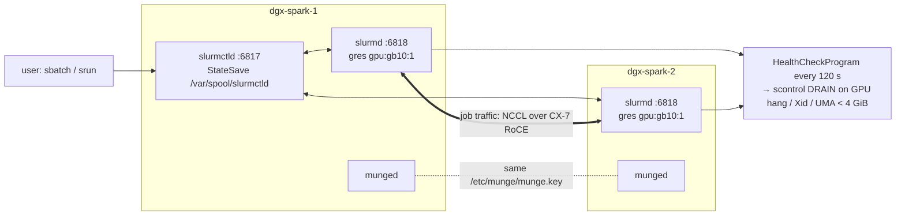

# Step 22 · Slurm on DGX Spark: MUNGE, GRES GPUs, cgroup v2 Confinement, Health Checks & Two-Node NCCL Jobs

> **01 Ansible · Part IV — Secrets & platforms · Step 22 of 30** · ← [Step 21 · Multus & RDMA pods](21-multus-and-secondary-rdma-networks.md) · [All steps](00-ansible-step-by-step-guide.md) · [Step 23 · AWX install](23-awx-install-and-configuration-as-code.md) →

| | |
|---|---|
| **You will build** | A Slurm cluster across your Sparks (controller on dgx-spark-1, `slurmd` on both), GPUs as GRES (`gpu:gb10:1`), device and memory confinement via cgroup v2, a health check that **drains** a node on GPU faults or unified-memory exhaustion, and batch jobs, including a 2-node NCCL run |
| **Hardware** | 1–2× DGX Spark |
| **Time** | 60 min |
| **Risk** | Low. Distro packages; configs are templated and identical on every node |

Slurm and Kubernetes can coexist on the same Sparks for learning purposes, but **they don't know about each other**. Both will happily schedule onto the same GPU, and so will both vClusters, because the 15 time-slices the root advertises are all backed by the one GB10. In the lab, use one at a time (drain one while you play with the other), or dedicate nodes.

---

## 1. Architecture

### 1.1 HLD



### 1.2 LLD

| File | Content | Notes |
|---|---|---|
| `/etc/munge/munge.key` | 1024 random bytes, generated **once** on the controller (`munge.key` in the state folder: sema01's `/opt/spark-lab/cache`), `0400 munge:munge` | Identical everywhere or nothing authenticates |
| `/etc/slurm/slurm.conf` | cluster, nodes, partition, plugins | **Identical** on all nodes (Slurm checks a hash) |
| `/etc/slurm/gres.conf` | `Name=gpu Type=gb10 File=/dev/nvidia0` | Explicit `File=` works without NVML-enabled builds |
| `/etc/slurm/cgroup.conf` | `CgroupPlugin=cgroup/v2`, `ConstrainDevices/Cores/RAMSpace=yes` | Jobs only see what they asked for |
| `NodeName … RealMemory` | `memtotal_mb − 16384` | Leaves 16 GiB for the OS on the unified pool |
| `/usr/local/sbin/spark-slurm-healthcheck.sh` | GPU answers? critical Xid? MemAvailable ≥ 4 GiB? | Drains with reason `healthcheck: …` |

```jinja
# lab/roles/slurm_cluster/templates/slurm.conf.j2
# {{ ansible_managed }}
ClusterName={{ slurm_cluster_name }}
SlurmctldHost={{ groups[slurm_cluster_controller_group][0] }}({{ hostvars[groups[slurm_cluster_controller_group][0]].ansible_host }})

AuthType=auth/munge
CryptoType=crypto/munge
# use `srun --mpi=pmix` if your build has it (check `srun --mpi=list`)
MpiDefault=none
ProctrackType=proctrack/cgroup
TaskPlugin=task/cgroup,task/affinity
SelectType=select/cons_tres
SelectTypeParameters=CR_Core_Memory
GresTypes=gpu

SlurmctldPort=6817
SlurmdPort=6818
StateSaveLocation=/var/spool/slurmctld
SlurmdSpoolDir=/var/spool/slurmd
SlurmctldPidFile=/run/slurmctld.pid
SlurmdPidFile=/run/slurmd.pid
SlurmctldLogFile=/var/log/slurm/slurmctld.log
SlurmdLogFile=/var/log/slurm/slurmd.log
SlurmdDebug=info
SlurmctldDebug=info

# a node that reboots cleanly comes back automatically
ReturnToService=2
SlurmdTimeout=120
InactiveLimit=0
KillWait=30
MinJobAge=300
SchedulerType=sched/backfill
JobAcctGatherType=jobacct_gather/cgroup
JobAcctGatherFrequency=30

# Health check: drain a node whose GPU stops answering (Step 29)
HealthCheckProgram=/usr/local/sbin/spark-slurm-healthcheck.sh
HealthCheckInterval=120
HealthCheckNodeState=ANY


NodeName={{ h }} NodeAddr={{ hostvars[h].ansible_host }} CPUs={{ slurm_cluster_cpus }} RealMemory={{ ((hostvars[h].ansible_facts.memtotal_mb | default(122880)) - slurm_cluster_mem_reserve_mb) | int }} Gres=gpu:{{ slurm_cluster_gpu_type }}:{{ slurm_cluster_gpu_devices | length }} State=UNKNOWN


PartitionName={{ slurm_cluster_partition }} Nodes={{ groups[slurm_cluster_compute_group] | join(',') }} Default=YES DefaultTime={{ slurm_cluster_default_time }} MaxTime={{ slurm_cluster_max_time }} State=UP OverSubscribe=NO
```

```jinja
# lab/roles/slurm_cluster/templates/gres.conf.j2
# {{ ansible_managed }}
# Explicit File= is used instead of AutoDetect=nvml because distro Slurm
# builds are not always compiled against NVML. Check: `slurmd -G`

Name=gpu Type={{ slurm_cluster_gpu_type }} File={{ dev }}

```

```jinja
# lab/roles/slurm_cluster/templates/cgroup.conf.j2
# {{ ansible_managed }}
CgroupPlugin=cgroup/v2
ConstrainCores=yes
ConstrainRAMSpace=yes
ConstrainSwapSpace=yes
# jobs without --gres=gpu cannot open /dev/nvidia*
ConstrainDevices=yes
AllowedRAMSpace=100
```

```bash
# lab/roles/slurm_cluster/files/spark-slurm-healthcheck.sh
#!/usr/bin/env bash
# Slurm HealthCheckProgram for DGX Spark — drains the node on GPU/fabric faults.
set -u
node=$(hostname -s)
reason=""
if ! timeout 15 nvidia-smi -L >/dev/null 2>&1; then
  reason="nvidia-smi unresponsive"
elif journalctl -k --since "-10 min" --no-pager 2>/dev/null | grep -qE 'NVRM: Xid \(.*\): (48|63|64|74|79|94|95|119|120)'; then
  reason="critical Xid in last 10 min"
elif [ "$(awk '/MemAvailable/{print int($2/1048576)}' /proc/meminfo)" -lt 4 ]; then
  reason="UMA MemAvailable < 4 GiB"
fi
if [ -n "$reason" ]; then
  scontrol update NodeName="$node" State=DRAIN Reason="healthcheck: $reason"
  exit 1
fi
exit 0
```

---

## 2. The role

```yaml
# lab/roles/slurm_cluster/tasks/main.yml
---
- name: Install controller packages
  ansible.builtin.apt:
    name: "{{ slurm_cluster_packages_controller }}"
    state: present
  when: inventory_hostname in groups[slurm_cluster_controller_group]

- name: Install compute packages
  ansible.builtin.apt:
    name: "{{ slurm_cluster_packages_compute }}"
    state: present
  when: inventory_hostname in groups[slurm_cluster_compute_group]

# ---- MUNGE: one shared key, generated once on the control node
- name: Generate cluster munge key on the control node (once)
  ansible.builtin.shell: |
    set -o pipefail
    umask 077
    dd if=/dev/urandom bs=1 count=1024 2>/dev/null > "{{ slurm_cluster_munge_key_local }}"
  args:
    creates: "{{ slurm_cluster_munge_key_local }}"
    executable: /bin/bash
  delegate_to: localhost
  become: false
  run_once: true

- name: Distribute munge key
  ansible.builtin.copy:
    src: "{{ slurm_cluster_munge_key_local }}"
    dest: /etc/munge/munge.key
    owner: munge
    group: munge
    mode: "0400"
  notify: Restart munge

- name: Directories
  ansible.builtin.file:
    path: "{{ item.path }}"
    state: directory
    owner: slurm
    group: slurm
    mode: "0755"
  loop:
    - { path: /var/log/slurm }
    - { path: /var/spool/slurmctld }
    - { path: /var/spool/slurmd }
  loop_control:
    label: "{{ item.path }}"

- name: Health check script
  ansible.builtin.copy:
    src: spark-slurm-healthcheck.sh
    dest: /usr/local/sbin/spark-slurm-healthcheck.sh
    owner: root
    group: root
    mode: "0755"

- name: Render Slurm configuration (identical on every node)
  ansible.builtin.template:
    src: "{{ item }}.j2"
    dest: "/etc/slurm/{{ item }}"
    owner: root
    group: root
    mode: "0644"
  loop: [slurm.conf, gres.conf, cgroup.conf]
  notify:
    - Restart slurmctld
    - Restart slurmd

- name: Flush handlers
  ansible.builtin.meta: flush_handlers

- name: Enable daemons
  ansible.builtin.service:
    name: "{{ item.name }}"
    state: started
    enabled: true
  loop:
    - { name: munge, when: true }
    - { name: slurmctld, when: "{{ inventory_hostname in groups[slurm_cluster_controller_group] }}" }
    - { name: slurmd, when: "{{ inventory_hostname in groups[slurm_cluster_compute_group] }}" }
  when: item.when | bool
  loop_control:
    label: "{{ item.name }}"

- name: Verify munge round-trip to controller
  ansible.builtin.shell: |
    set -o pipefail
    munge -n | ssh -o BatchMode=yes {{ hostvars[groups[slurm_cluster_controller_group][0]].ansible_host }} unmunge
  args:
    executable: /bin/bash
  become: false
  changed_when: false
  check_mode: false        # read-only probe: must also run under --check (drift detection)
  failed_when: false
  register: slurm_cluster_munge_check

- name: Resume nodes DOWN/DRAINED by (re)configuration — never ones drained on purpose
  ansible.builtin.shell: |
    set -o pipefail
    sinfo -h -N -t down,drain -o '%N|%E' | sort -u | while IFS='|' read -r n r; do
      case "$r" in
        healthcheck:*|maint:*|*"Kill task failed"*) echo "keep $n ($r)";;
        *) scontrol update NodeName="$n" State=RESUME && echo "resumed $n ($r)";;
      esac
    done
  args:
    executable: /bin/bash
  run_once: true
  delegate_to: "{{ groups[slurm_cluster_controller_group][0] }}"
  register: slurm_cluster_resume
  changed_when: "'resumed' in slurm_cluster_resume.stdout"

- name: Show cluster state
  ansible.builtin.command: sinfo -N -o "%N %T %G %m %E"
  run_once: true
  delegate_to: "{{ groups[slurm_cluster_controller_group][0] }}"
  register: slurm_cluster_sinfo
  changed_when: false
  check_mode: false        # read-only probe: must also run under --check (drift detection)

- name: Print sinfo
  ansible.builtin.debug:
    var: slurm_cluster_sinfo.stdout_lines
  run_once: true
```

Design choices:

- **The munge key is generated with `creates:`** on the controller and never regenerated. A new key on a live cluster would lock out every node. In this lab "the controller" is Semaphore, and the key lives on sema01's state volume. A break-glass run from the MacBook has its own `.cache/` **without** that key, so it would generate a new one and push it to every node. Before running `07-slurm.yml` from the MacBook, copy the key over (`ssh sema01 'cd ~/semaphore && docker compose exec -T semaphore cat /var/lib/spark-lab/cache/munge.key' > .cache/munge.key && chmod 600 .cache/munge.key`), and delete it again afterwards. Keeping a copy in vault01's `kv/spark-lab/` is the production answer.
- **"Resume" is selective.** Nodes drained by `healthcheck:` or `maint:` reasons stay drained. Only nodes down because of the reconfiguration itself get resumed. An automation that blindly resumes everything would undo your own safety net.
- **Same template, every node.** The role renders `slurm.conf` from inventory, so adding dgx-spark-3 is an inventory edit plus a run.

---

## 3. Hands-on

Run the Semaphore template **`07 Slurm`** (break-glass: `ansible-playbook playbooks/07-slurm.yml -l dgx-spark-1,localhost -K`, after copying the munge key as above). Then on the Spark:

```bash
ssh nvidia@192.168.0.100
sinfo -N -o "%N %T %G %m %c"          # dgx-spark-1 idle gpu:gb10:1 106496 20
scontrol show node dgx-spark-1 | grep -E 'Gres|RealMemory|State'
```

### 3.1 Prove device confinement

```bash
srun -p gpu -t 1 nvidia-smi -L                  # no --gres → should FAIL to see the GPU
srun -p gpu -t 1 --gres=gpu:gb10:1 nvidia-smi -L   # → GPU 0: NVIDIA GB10
```

If the first command still sees the GPU, `ConstrainDevices` isn't active: check `CgroupPlugin=cgroup/v2`, `TaskPlugin=task/cgroup`, and `slurmd -C`/`journalctl -u slurmd`.

### 3.2 Batch job: PyTorch in a container

```bash
cat > ~/torch-check.sbatch <<'EOF'
#!/bin/bash
#SBATCH -J torch-check
#SBATCH -p gpu
#SBATCH --gres=gpu:gb10:1
#SBATCH --mem=24G
#SBATCH -t 00:10:00
#SBATCH -o %x-%j.out
docker run --rm --gpus "device=${CUDA_VISIBLE_DEVICES:-0}" --memory=24g \
  nvcr.io/nvidia/pytorch:25.11-py3 \
  python -c "import torch;print(torch.cuda.get_device_name(0), torch.cuda.mem_get_info())"
EOF
sbatch ~/torch-check.sbatch && squeue && sleep 30 && cat torch-check-*.out
```

> Launching Docker from a job means **the container runs under dockerd, outside the job's cgroup**, so Slurm's limits don't apply to it (hence the explicit `--memory`). For real multi-user clusters, use **enroot + pyxis** (`srun --container-image=nvcr.io#nvidia/pytorch:25.11-py3 …`), which keeps the container inside the job.

### 3.3 Two-node NCCL job

```bash
cat > ~/nccl-2node.sbatch <<'EOF'
#!/bin/bash
#SBATCH -J nccl-2node
#SBATCH -p gpu
#SBATCH -N 2
#SBATCH --ntasks-per-node=1
#SBATCH --gres=gpu:gb10:1
#SBATCH -t 00:10:00
#SBATCH -o %x-%j.out
export LD_LIBRARY_PATH=$HOME/nccl/build/lib:/usr/local/cuda/lib64:/usr/lib/aarch64-linux-gnu/openmpi/lib:$LD_LIBRARY_PATH
export NCCL_SOCKET_IFNAME=enP7s7 NCCL_IB_HCA=rocep1s0f1,roceP2p1s0f1 NCCL_DEBUG=INFO
HOSTS=$(scontrol show hostnames $SLURM_JOB_NODELIST | sed 's/$/:1/' | paste -sd,)
mpirun -np $SLURM_NTASKS -H $HOSTS --mca btl_tcp_if_include enP7s7 \
  -x LD_LIBRARY_PATH -x NCCL_SOCKET_IFNAME -x NCCL_IB_HCA -x NCCL_DEBUG \
  $HOME/nccl-tests/build/all_gather_perf -b 1G -e 16G -f 2
EOF
sbatch ~/nccl-2node.sbatch
```

(Requires the NCCL build from `10-nccl-test.yml`. Using `mpirun` inside the allocation is the portable approach; `srun --mpi=pmix` works if your Slurm build has PMIx, which you can check with `srun --mpi=list`.)

### 3.4 Watch the health check drain a node

```bash
# on dgx-spark-2 — TEMPORARILY make the UMA threshold impossible to meet
sudo sed -i 's/-lt 4 ]/-lt 999 ]/' /usr/local/sbin/spark-slurm-healthcheck.sh
sleep 130; sinfo -R          # REASON: healthcheck: UMA MemAvailable < 4 GiB

# Semaphore: run the template 07 Slurm again — re-running the role restores the script
# (template drift fixed) and deliberately does NOT resume a node drained with a 'healthcheck:' reason
#   break-glass: ansible-playbook playbooks/07-slurm.yml -K
sinfo -R                     # still drained: that's the point

# a human (or a separate, restricted Semaphore template) resumes it after checking
sudo scontrol update NodeName=dgx-spark-2 State=RESUME
```

### 3.5 Experiment: does GPU memory count against the job's cgroup on UMA?

```bash
srun -p gpu --gres=gpu:gb10:1 --mem=8G -t 5 python3 - <<'PY'
import torch, time
xs=[]
for i in range(40):
    xs.append(torch.empty(1<<30, dtype=torch.uint8, device='cuda'))   # 1 GiB each
    print(i+1, "GiB allocated", flush=True); time.sleep(0.2)
PY
```

Does the job get OOM-killed at about 8 GiB, or does it sail past? The answer tells you whether `--mem` protects the node from GPU allocations on your DGX OS/driver combination. Record it; it decides how much you trust `RealMemory` and the health check.

---

## 4. Integrations

| System | How |
|---|---|
| Telemetry (Step 12) | The health check uses the same signals as the alerts, so scheduler and monitoring agree |
| Drain (Step 29) | `node_drain` issues `scontrol … DRAIN reason="maint: …"`, and the Slurm role respects `maint:` |
| NFS (Step 15) | `/mnt/models` present on every compute node, so jobs are location-independent |
| Semaphore (or AWX) | A template "Slurm: resume node" with a survey (node name) gives operators a safe button, with the task history as the record |
| Accounting (stretch) | Add `slurmdbd` + MariaDB for `sacct` history and fair-share |

## 5. Troubleshooting & diagnostics

| Symptom | Diagnose | Fix |
|---|---|---|
| `sinfo` shows `down*` | `scontrol show node X \| grep Reason`; `journalctl -u slurmd` | slurmd not running / not reachable on 6818; firewall |
| `Invalid credential` / `Munge decode failed` | `munge -n \| ssh other unmunge` | Keys differ, or clocks skew > 5 min (chrony! Step 02) |
| Node `INVAL` / `Low RealMemory` | `slurmd -C` on the node vs `slurm.conf` | RealMemory too high: raise `slurm_cluster_mem_reserve_mb` |
| `gres/gpu count reported lower than configured` | `slurmd -G` / `slurmd -C` | `File=/dev/nvidia0` missing? The driver isn't loaded at boot → Step 10 |
| Job runs without `--gres` and still sees the GPU | `cat /sys/fs/cgroup/system.slice/slurmstepd.scope/.../devices` | `ConstrainDevices=yes`, `TaskPlugin=task/cgroup`, cgroup v2 plugin present |
| `srun: error: ... mpi/pmix` | `srun --mpi=list` | Use `mpirun` in the allocation, or install Slurm with PMIx |
| Config change ignored | `scontrol show config \| grep -i <key>` | Some keys need `slurmctld` **and** `slurmd` restarts, not `scontrol reconfigure` (the handlers restart both) |
| Node stays `DRAIN` after you fixed things | `sinfo -R` shows `healthcheck:`/`maint:` | Intentional: resume explicitly after validating (`scontrol update … State=RESUME`) |

## 6. Validation

- [ ] `sinfo` shows both Sparks `idle` with `gpu:gb10:1`.
- [ ] `srun` without `--gres` can't see the GPU; with `--gres` it can.
- [ ] The 2-node NCCL job log shows `via NET/IB`.
- [ ] Health-check drain observed and resumed manually.
- [ ] §3.5 experiment result recorded.
