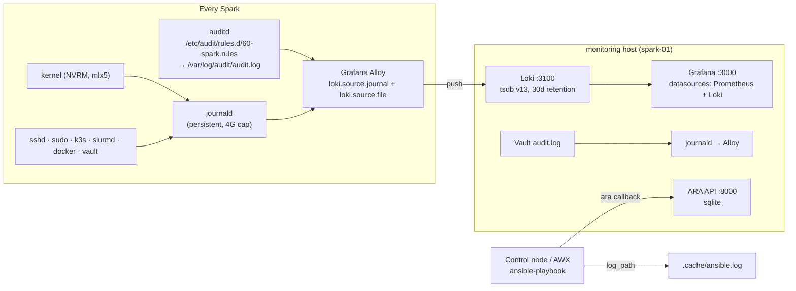

# Volume 23 — Logging & Audit Trails: Who Changed What, When, and Through Which Automation

> **Module 01 · Part V — Production SRE** · Prev: [22 Drift](22-configuration-drift-detection-and-self-healing.md) · Next: [24 Emergency drain & remediation](24-cluster-wide-emergency-drain-and-remediation.md)

| | |
|---|---|
| **You will build** | Four linked audit layers: **auditd** on every Spark (changes to sudoers, sshd, netplan, docker, k3s, slurm, vault; every root command), **journald → Grafana Alloy → Loki** for searchable logs (including NVRM/Xid kernel lines), **ARA** recording every playbook run task by task, and the **Vault audit log** for secret access, all viewable in the Grafana from Volume 09 |
| **Hardware** | 1–2× DGX Spark (Loki + ARA on the monitoring host) |
| **Time** | 60 min |
| **Risk** | Low. Watch disk: Loki retention is 30 days by default |

---

## 1. The questions an audit trail must answer

| Question | Layer that answers it |
|---|---|
| "Which playbook run changed `/etc/sysctl.d/90-spark.conf` on spark-02 last Tuesday, and with what diff?" | **ARA** (+ `ansible.log`) |
| "Did someone edit netplan by hand outside Ansible?" | **auditd** key `network` + drift (Volume 22) |
| "What did the kernel say about the GPU right before the job died?" | **Loki**: `{host="spark-02"} \|= "NVRM: Xid"` |
| "Who read the NGC key?" | **Vault audit log** (Volume 03B) |
| "Who launched the remediation job and who approved it?" | **AWX** activity stream + job history (Volume 20) |

## 2. Architecture



| Component | Image / package | Config |
|---|---|---|
| auditd | `auditd`, `audispd-plugins` | `playbooks/templates/spark-audit.rules.j2` |
| Loki | `grafana/loki:3.5.1` (validated with `loki -verify-config`) | `playbooks/templates/loki.yaml.j2` |
| Alloy | `grafana/alloy:v1.9.1` (config checked with `alloy fmt`) | `playbooks/templates/alloy.river.j2` |
| ARA | `pip install ara[server]` in a venv, systemd unit | `/opt/ara/settings.yaml` |

> **Why Alloy, not Promtail?** Promtail is in maintenance, and Grafana's supported collector going forward is Alloy. The journal source and labels map one to one.

---

## 3. The code

```bash
# lab/playbooks/templates/spark-audit.rules.j2
## {{ ansible_managed }}
## Who changed what on a DGX Spark. Keys make searching easy: ausearch -k <key>
-w /etc/sudoers -p wa -k priv
-w /etc/sudoers.d/ -p wa -k priv
-w /etc/ssh/sshd_config -p wa -k sshd
-w /etc/ssh/sshd_config.d/ -p wa -k sshd
-w /etc/ssh/trusted-user-ca-keys.pem -p wa -k sshd
-w /etc/netplan/ -p wa -k network
-w /etc/docker/daemon.json -p wa -k container-runtime
-w /etc/cdi/ -p wa -k container-runtime
-w /etc/nvidia-container-runtime/ -p wa -k container-runtime
-w /etc/rancher/k3s/ -p wa -k k3s
-w /etc/slurm/ -p wa -k slurm
-w /etc/munge/munge.key -p rwa -k slurm-secret
-w /etc/vault.d/ -p wa -k vault
-w /etc/sysctl.d/ -p wa -k kernel-tuning
-w /etc/modprobe.d/ -p wa -k kernel-tuning
-w /etc/default/grub.d/ -p wa -k boot
## package database changes (apt/dpkg) and apt-mark holds
-w /var/lib/dpkg/status -p wa -k packages
-w /usr/bin/apt-mark -p x -k packages
## every command run as root through sudo
-a always,exit -F arch=b64 -S execve -F euid=0 -F auid>=1000 -F auid!=4294967295 -k root-cmd
```

```hcl
# lab/playbooks/templates/alloy.river.j2
// {{ ansible_managed }}
// Grafana Alloy on {{ inventory_hostname }}: ship the systemd journal (kernel NVRM/Xid,
// sshd, sudo, k3s, slurmd, docker, vault, auditd via journald) to Loki.
loki.relabel "journal" {
  forward_to = []
  rule {
    source_labels = ["__journal__systemd_unit"]
    target_label  = "unit"
  }
  rule {
    source_labels = ["__journal_priority_keyword"]
    target_label  = "level"
  }
  rule {
    source_labels = ["__journal_syslog_identifier"]
    target_label  = "ident"
  }
  rule {
    source_labels = ["__journal__transport"]
    target_label  = "transport"
  }
}

loki.source.journal "journal" {
  forward_to    = [loki.write.default.receiver]
  relabel_rules = loki.relabel.journal.rules
  max_age       = "12h"
  labels        = { host = "{{ inventory_hostname }}", job = "systemd-journal", lab = "{{ lab_name | default('spark-lab') }}" }
}

loki.write "default" {
  endpoint {
    url = "http://{{ hostvars[groups['monitoring'][0]].ansible_host }}:3100/loki/api/v1/push"
  }
}

// auditd writes to its own file (not reliably to journald) — tail it separately.
local.file_match "audit" {
  path_targets = [{ "__path__" = "/var/log/audit/audit.log", host = "{{ inventory_hostname }}", job = "auditd" }]
}

loki.source.file "audit" {
  targets    = local.file_match.audit.targets
  forward_to = [loki.write.default.receiver]
}
```

```yaml
# lab/playbooks/templates/loki.yaml.j2
# {{ ansible_managed }}
auth_enabled: false
server:
  http_listen_port: 3100
common:
  path_prefix: /loki
  replication_factor: 1
  ring:
    kvstore:
      store: inmemory
  storage:
    filesystem:
      chunks_directory: /loki/chunks
      rules_directory: /loki/rules
schema_config:
  configs:
    - from: "2024-01-01"
      store: tsdb
      object_store: filesystem
      schema: v13
      index:
        prefix: index_
        period: 24h
limits_config:
  retention_period: {{ logging_retention }}
compactor:
  working_directory: /loki/compactor
  retention_enabled: true
  delete_request_store: filesystem
```

```yaml
# lab/playbooks/23-logging-audit.yml
---
# Audit & logging stack:
#   * auditd rules on every Spark (who changed sudoers, sshd, netplan, docker, k3s, slurm, vault…)
#   * Loki on the monitoring host + Grafana Alloy on every Spark shipping the journal
#   * Loki datasource in the Volume 09 Grafana
#   * ARA API server recording every ansible-playbook run
- name: Auditd on every Spark
  hosts: spark
  become: true
  tasks:
    - name: Install auditd
      ansible.builtin.apt:
        name: [auditd, audispd-plugins]
        state: present

    - name: Spark audit rules
      ansible.builtin.template:
        src: spark-audit.rules.j2
        dest: /etc/audit/rules.d/60-spark.rules
        mode: "0640"
      notify: Load audit rules

    - name: Load rules now so the check below sees them
      ansible.builtin.meta: flush_handlers

    - name: Confirm rules are active
      ansible.builtin.command: auditctl -l
      register: logging_auditctl
      changed_when: false
      check_mode: false
      failed_when: "'-k network' not in logging_auditctl.stdout and 'key=network' not in logging_auditctl.stdout"
  handlers:
    - name: Load audit rules
      ansible.builtin.command: augenrules --load     # merges /etc/audit/rules.d/*.rules
      changed_when: true

- name: Loki + Grafana datasource (monitoring host)
  hosts: monitoring
  become: true
  vars:
    logging_retention: 720h
    logging_loki_image: grafana/loki:3.5.1
    logging_dir: /opt/spark-logging
  tasks:
    - name: Directories
      ansible.builtin.file:
        path: "{{ logging_dir }}/{{ item }}"
        state: directory
        owner: "10001"          # loki image runs as uid 10001
        group: "10001"
        mode: "0755"
      loop: [config, data]

    - name: Loki config
      ansible.builtin.template:
        src: loki.yaml.j2
        dest: "{{ logging_dir }}/config/loki.yaml"
        mode: "0644"
      register: logging_loki_cfg

    - name: Loki container
      community.docker.docker_container:
        name: loki
        image: "{{ logging_loki_image }}"
        command: [-config.file=/etc/loki/loki.yaml]
        network_mode: host
        restart_policy: unless-stopped
        volumes:
          - "{{ logging_dir }}/config:/etc/loki:ro"
          - "{{ logging_dir }}/data:/loki"
        restart: "{{ logging_loki_cfg is changed }}"

    - name: Wait for Loki ready
      ansible.builtin.uri:
        url: http://127.0.0.1:3100/ready
      register: logging_loki_ready
      until: logging_loki_ready.status == 200
      retries: 30
      delay: 3

    - name: Loki datasource for Grafana (Volume 09 stack)
      ansible.builtin.copy:
        dest: /opt/spark-monitoring/grafana/provisioning/datasources/loki.yml
        mode: "0644"
        content: |
          # {{ ansible_managed }}
          apiVersion: 1
          datasources:
            - name: Loki
              type: loki
              access: proxy
              url: http://127.0.0.1:3100
      notify: Restart Grafana
  handlers:
    - name: Restart Grafana
      community.docker.docker_container:
        name: spark-monitoring-grafana-1     # compose project "spark-monitoring", service "grafana"
        state: started
        restart: true

- name: Grafana Alloy journal shipper (every Spark)
  hosts: spark
  become: true
  vars:
    logging_alloy_image: grafana/alloy:v1.9.1
  tasks:
    - name: Alloy config dir
      ansible.builtin.file:
        path: /etc/alloy
        state: directory
        mode: "0755"

    - name: Alloy config
      ansible.builtin.template:
        src: alloy.river.j2
        dest: /etc/alloy/config.alloy
        mode: "0644"
      register: logging_alloy_cfg

    - name: Alloy container (reads the host journal)
      community.docker.docker_container:
        name: alloy
        image: "{{ logging_alloy_image }}"
        command: [run, --storage.path=/var/lib/alloy/data, /etc/alloy/config.alloy]
        network_mode: host
        restart_policy: unless-stopped
        user: root
        volumes:
          - /etc/alloy:/etc/alloy:ro
          - /var/log/journal:/var/log/journal:ro
          - /run/log/journal:/run/log/journal:ro
          - /etc/machine-id:/etc/machine-id:ro
          - /var/log/audit:/var/log/audit:ro
          - alloy-data:/var/lib/alloy/data
        restart: "{{ logging_alloy_cfg is changed }}"

- name: ARA API server (records every playbook run)
  hosts: monitoring
  become: true
  vars:
    ara_dir: /opt/ara
    ara_port: 8000
  tasks:
    - name: Python venv with ARA server
      ansible.builtin.pip:
        name: ["ara[server]>=1.7"]
        virtualenv: "{{ ara_dir }}/venv"
        virtualenv_command: python3 -m venv

    - name: ARA settings
      ansible.builtin.copy:
        dest: "{{ ara_dir }}/settings.yaml"
        mode: "0644"
        content: |
          default:
            ALLOWED_HOSTS: ["*"]
            BASE_DIR: {{ ara_dir }}/data
            DATABASE_ENGINE: django.db.backends.sqlite3
            DATABASE_NAME: {{ ara_dir }}/data/ansible.sqlite
            TIME_ZONE: {{ lab_timezone | default('UTC') }}
            READ_LOGIN_REQUIRED: false
            WRITE_LOGIN_REQUIRED: false

    - name: ARA service
      ansible.builtin.copy:
        dest: /etc/systemd/system/ara.service
        mode: "0644"
        content: |
          [Unit]
          Description=ARA Records Ansible API server
          After=network-online.target
          [Service]
          Environment=ARA_SETTINGS={{ ara_dir }}/settings.yaml
          Environment=ARA_BASE_DIR={{ ara_dir }}/data
          ExecStartPre={{ ara_dir }}/venv/bin/ara-manage migrate
          ExecStart={{ ara_dir }}/venv/bin/ara-manage runserver 0.0.0.0:{{ ara_port }}
          Restart=on-failure
          [Install]
          WantedBy=multi-user.target
      register: ara_unit

    - name: Enable ARA
      ansible.builtin.systemd_service:
        name: ara
        state: "{{ 'restarted' if ara_unit is changed else 'started' }}"
        enabled: true
        daemon_reload: true
```

---

## 4. Hands-on

### 4.1 Deploy

```bash
cd "01 Ansible/lab"
ansible-playbook playbooks/23-logging-audit.yml -K
curl -s http://192.168.0.100:3100/ready                        # ready
curl -s http://192.168.0.100:8000/api/v1/ | jq 'keys'           # ARA API
```

### 4.2 Record every playbook run in ARA

```bash
pip install "ara>=1.7"                                       # client side, on the control node
export ANSIBLE_CALLBACK_PLUGINS=$(python3 -m ara.setup.callback_plugins)
export ARA_API_CLIENT=http ARA_API_SERVER=http://192.168.0.100:8000
ansible-playbook playbooks/01-baseline.yml -K
ara playbook list --limit 5
ara result list --playbook <id> --changed      # every changed task, with the diff
```

To make it permanent, put the three variables in your shell profile or in the AWX job template environment (Volume 20). For AWX, install `ara` into the EE (Volume 05).

### 4.3 Queries worth saving in Grafana (Explore → Loki)

| Question | LogQL |
|---|---|
| GPU Xid events, all nodes | `{job="systemd-journal", transport="kernel"} \|= "NVRM: Xid"` |
| CX-7 link flaps | `{transport="kernel"} \|~ "mlx5_core.*(link down\|Link up\|module)"` |
| sudo commands on spark-02 | `{host="spark-02", ident="sudo"}` |
| Config file watches that fired (auditd log file) | `{job="auditd"} \|~ "key=\"(network\|sshd\|priv\|container-runtime)\""` |
| SSH logins using Vault certificates | `{unit="ssh.service"} \|= "CA ED25519"` |
| k3s errors | `{unit=~"k3s.*", level="err"}` |
| Rate of Xids per host (graph) | `sum by (host) (count_over_time({transport="kernel"} \|= "NVRM: Xid" [5m]))` |

### 4.4 auditd: prove it catches a manual change

```bash
ssh nvidia@192.168.0.101 'sudo sed -i "s/mtu: 9000/mtu: 1500/" /etc/netplan/40-cx7.yaml'
ssh nvidia@192.168.0.101 'sudo ausearch -k network -i --start recent | tail -20'
# → type=SYSCALL ... comm="sed" ... auid=nvidia ... key="network"
tools/drift-cycle.sh      # drift reports the fabric template (and doesn't auto-heal it)
ansible-playbook playbooks/02-fabric.yml -K -l spark-02    # a human puts it back
```

---

## 5. Retention, volume and "high cardinality"

| Stream | Volume driver | Control |
|---|---|---|
| Kernel/NVRM | Bursts during faults | Keep. It's the evidence |
| auditd `root-cmd` (every root execve) | Automation runs generate many | Keep in Loki with 30d retention; exclude noisy automation users with `-F auid!=<ansible uid>` if you must |
| Container stdout (Docker) | Model servers can be chatty | Not shipped by default (journald only). Add a `loki.source.docker` block selectively |
| Labels | `host`, `unit`, `ident`, `level`, `transport` only | **Never** use request IDs, PIDs or pod UIDs as labels. That's how you get a high-cardinality Loki meltdown; filter those in queries with `\|=` instead |

## 6. Integrations

| System | Hook |
|---|---|
| Alerting (Volume 09) | Loki ruler or Grafana alert on the Xid-rate query, complementing the Prometheus `SparkGPUXid` alert |
| Drift (Volume 22) | The auditd `key` explains *who/what* caused the drift the playbook found |
| Drain (Volume 24) | The incident bundle captures local logs; Loki keeps them after the node is re-imaged |
| AWX (Volume 20) | External logging → Loki (`Settings → Logging`), so job events sit next to host logs |

## 7. Troubleshooting & diagnostics

| Symptom | Diagnose | Fix |
|---|---|---|
| No logs in Loki | `docker logs alloy` on the Spark; `curl -s localhost:12345/-/ready` (Alloy UI) | Loki URL/port; journal mounts (`/var/log/journal` exists only with persistent journald — set by `spark_baseline`) |
| Loki `permission denied` on `/loki` | `docker logs loki` | Directory owner must be uid 10001 (the play sets it) |
| Loki `entry too far behind` | Alloy pushing old journal on first start | Expected once; `max_age = "12h"` bounds it |
| `augenrules --load` fails: `rule exists` / syntax | `auditctl -R /etc/audit/rules.d/60-spark.rules` | Fix the rule line; a `-e 2` (immutable) rules file elsewhere blocks reloads until reboot |
| ARA shows nothing | `echo $ANSIBLE_CALLBACK_PLUGINS`; `curl $ARA_API_SERVER/api/v1/` | Callback path not exported in *this* shell/EE; the API is unreachable from the EE pod |
| Grafana has no Loki datasource | `/opt/spark-monitoring/grafana/provisioning/datasources/` | Re-run; the handler restarts Grafana |

## 8. Validation

- [ ] Grafana Explore shows journal logs from every Spark, filterable by `host`/`unit`.
- [ ] The Xid query returns results after a test (or at least runs clean).
- [ ] `ara playbook list` shows your last runs, with per-task changed results.
- [ ] A manual netplan edit is visible in `ausearch -k network` **and** in the drift report.
