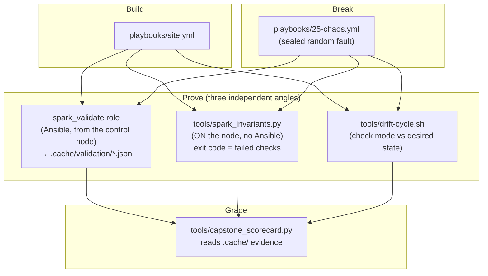

# Volume 25 — Capstone: Build, Break, Prove. The DGX Spark Automation Mastery Lab & Evidence-Based Test Harness

> **Module 01 · Part V — Production SRE** · Prev: [24 Incident response](24-cluster-wide-emergency-drain-and-remediation.md) · Back to [Module index](README.md)

| | |
|---|---|
| **You will do** | Rebuild the whole lab from a clean state with one command, pass 25 hands-on challenges, survive a chaos drill (random fault injected, then found and fixed with your own tooling), and earn a scorecard computed from **evidence**, not self-assessment |
| **Hardware** | 1× DGX Spark minimum; 2× for the fabric/NCCL/NFS challenges |
| **Time** | A weekend |
| **Risk** | You'll break things on purpose. Everything here is reversible with the lab's playbooks |

---

## 1. The harness



Why three angles? Each can lie in a different way. Ansible can validate a stale fact, the on-node script can't see config intent, and drift can't see hardware state. Agreement between all three is what "healthy" means.

### 1.1 End-to-end validation role

```yaml
# lab/roles/spark_validate/tasks/main.yml
---
# Every check records a result instead of failing immediately, so one run
# produces the full picture. The final task fails if anything failed.
- name: Refresh local facts
  ansible.builtin.setup:
    filter: [ansible_local, ansible_architecture, ansible_processor_nproc, ansible_memtotal_mb, ansible_distribution_major_version]

- name: Hardware / OS invariants
  ansible.builtin.set_fact:
    spark_validate_results: >-
      {{ {
        'arch_aarch64': ansible_facts.architecture == spark_expected.arch,
        'cpu_20_cores': ansible_facts.processor_nproc | int == spark_expected.cpu_cores,
        'os_ubuntu24': ansible_facts.distribution_major_version == spark_expected.os_major,
        'mem_ge_min': (ansible_facts.memtotal_mb / 1024) >= spark_expected.mem_total_gib_min,
        'gpu_present': ansible_local.spark.gpu.present | default(false),
        'gpu_is_gb10': (ansible_local.spark.gpu.name | default('')) is search(spark_expected.gpu_name_regex),
        'driver_ge_min': (ansible_local.spark.gpu.driver_version | default('0')).split('.')[0] | int >= spark_expected.driver_major_min,
        'cuda_major': (ansible_local.spark.gpu.cuda_driver_api | default('0')).split('.')[0] | int == spark_expected.cuda_major,
        'compute_cap_12_1': ansible_local.spark.gpu.compute_cap | default('') == spark_expected.compute_capability,
      } }}

- name: Container GPU access
  ansible.builtin.command: >-
    docker run --rm --gpus all {{ spark_validate_image }} nvidia-smi -L
  register: spark_validate_docker
  changed_when: false
  check_mode: false        # read-only probe: must also run under --check (drift detection)
  failed_when: false
  when: spark_validate_container | bool

- name: Fabric state
  ansible.builtin.set_fact:
    spark_validate_fabric_ok: >-
      {{ cx7_interfaces | default([])
         | map(attribute='name')
         | map('extract', ansible_local.spark.cx7.ports | default({}))
         | selectattr('state', 'equalto', 'Up')
         | selectattr('speed_mbps', 'equalto', 200000)
         | list | length == cx7_interfaces | default([]) | length }}
  when: spark_validate_fabric | bool

- name: Kubernetes node Ready + GPU allocatable
  ansible.builtin.shell: |
    set -o pipefail
    k3s kubectl get node {{ inventory_hostname }} -o json \
      | jq -r '[(.status.conditions[] | select(.type=="Ready") | .status), (.status.allocatable["nvidia.com/gpu"] // "0")] | @tsv'
  args:
    executable: /bin/bash
  delegate_to: "{{ groups['k3s_server'][0] }}"
  register: spark_validate_k8s_out
  changed_when: false
  check_mode: false        # read-only probe: must also run under --check (drift detection)
  failed_when: false
  when: spark_validate_k8s | bool

- name: Slurm node state
  ansible.builtin.command: sinfo -h -n {{ inventory_hostname }} -o %T
  delegate_to: "{{ groups['slurm_controller'][0] }}"
  register: spark_validate_slurm_out
  changed_when: false
  check_mode: false        # read-only probe: must also run under --check (drift detection)
  failed_when: false
  when: spark_validate_slurm | bool

- name: Merge service-level results
  ansible.builtin.set_fact:
    spark_validate_results: >-
      {{ spark_validate_results
         | combine({'docker_gpu': spark_validate_docker.rc | default(1) == 0} if spark_validate_container | bool else {})
         | combine({'cx7_links_200g': spark_validate_fabric_ok | bool} if spark_validate_fabric | bool else {})
         | combine({'k8s_ready_gpu': (spark_validate_k8s_out.stdout | default('')).split('\t')[0] == 'True'
                                     and ((spark_validate_k8s_out.stdout | default('')).split('\t') | last | int) > 0}
                   if spark_validate_k8s | bool else {})
         | combine({'slurm_usable': (spark_validate_slurm_out.stdout | default('')) in ['idle', 'mixed', 'allocated']}
                   if spark_validate_slurm | bool else {}) }}

- name: Write JSON report on the control node
  ansible.builtin.copy:
    content: "{{ {'host': inventory_hostname, 'time': now(utc=true).isoformat(), 'results': spark_validate_results} | to_nice_json }}"
    dest: "{{ spark_validate_report_dir }}/{{ inventory_hostname }}.json"
    mode: "0644"
  delegate_to: localhost
  become: false

- name: Verdict
  ansible.builtin.assert:
    that: spark_validate_results | dict2items | rejectattr('value') | list | length == 0
    fail_msg: "FAILED checks: {{ spark_validate_results | dict2items | rejectattr('value') | map(attribute='key') | list }}"
    success_msg: "All {{ spark_validate_results | length }} checks passed"
```

### 1.2 On-node invariant checker (works when Ansible can't)

```python
# lab/tools/spark_invariants.py
#!/usr/bin/env python3
"""
spark_invariants.py — run ON a DGX Spark (no Ansible needed) to check the
invariants the lab depends on. Good for: first boot, after a DGX OS update,
inside an incident, or as a Slurm/k8s node health probe.

  python3 spark_invariants.py            # human table
  python3 spark_invariants.py --json     # machine output
  python3 spark_invariants.py --peer 192.168.100.12   # also test fabric reachability

Exit code = number of FAILED checks (0 = healthy). WARN does not count.
"""
import argparse
import json
import os
import re
import shutil
import subprocess

T = 15
results = []


def sh(cmd, timeout=T):
    try:
        p = subprocess.run(cmd, shell=True, capture_output=True, text=True, timeout=timeout)
        return p.returncode, p.stdout.strip(), p.stderr.strip()
    except subprocess.TimeoutExpired:
        return 124, "", "timeout"


def check(name, status, detail="", fix=""):
    results.append({"check": name, "status": status, "detail": detail, "fix": fix})


def c_platform():
    arch = os.uname().machine
    check("arch is aarch64", "PASS" if arch == "aarch64" else "FAIL", arch)
    n = os.cpu_count()
    check("20 CPU cores", "PASS" if n == 20 else "WARN", str(n),
          "offline cores? check `lscpu` and /sys/devices/system/cpu/online")
    rc, out, _ = sh(". /etc/os-release && echo $VERSION_ID")
    check("Ubuntu 24.04 base", "PASS" if out.startswith("24.") else "FAIL", out)
    if os.path.exists("/etc/dgx-release"):
        rc, out, _ = sh("grep -E 'DGX_(SWBUILD_VERSION|OTA_VERSION)' /etc/dgx-release | tail -1")
        check("DGX OS release file", "PASS", out)
    else:
        check("DGX OS release file", "WARN", "missing /etc/dgx-release", "not DGX OS, or image customised")


def c_gpu():
    if not shutil.which("nvidia-smi"):
        check("nvidia-smi present", "FAIL", "", "driver not installed / PATH")
        return
    rc, out, err = sh("nvidia-smi --query-gpu=name,driver_version,compute_cap --format=csv,noheader")
    if rc != 0:
        check("GPU answers nvidia-smi", "FAIL", err or f"rc={rc}",
              "see Volume 24 Runbook A; check `dmesg | grep -i nvrm`")
        return
    name, drv, cc = [x.strip() for x in out.splitlines()[0].split(",")]
    check("GPU is GB10", "PASS" if "GB10" in name else "FAIL", name)
    check("driver >= 580", "PASS" if int(drv.split(".")[0]) >= 580 else "FAIL", drv)
    check("compute capability 12.1", "PASS" if cc == "12.1" else "WARN", cc,
          "build CUDA code with -gencode arch=compute_121,code=sm_121")
    rc, out, _ = sh("nvidia-smi | grep -o 'CUDA Version: [0-9.]*'")
    check("driver CUDA 13.x", "PASS" if "13." in out else "WARN", out)
    rc, out, _ = sh("journalctl -k --since '-24h' --no-pager | grep -c 'NVRM: Xid'")
    n = int(out or 0)
    check("no Xid in 24h", "PASS" if n == 0 else "WARN", f"{n} events",
          "journalctl -k | grep Xid ; Volume 24 Runbook B")


def c_memory():
    info = {}
    with open("/proc/meminfo") as fh:
        for line in fh:
            k, v = line.split(":", 1)
            info[k] = int(v.split()[0])
    tot = info["MemTotal"] / 1048576
    avail = info["MemAvailable"] / 1048576
    cache = info.get("Cached", 0) / 1048576
    check("MemTotal >= 110 GiB", "PASS" if tot >= 110 else "FAIL", f"{tot:.1f} GiB")
    status = "PASS" if avail >= 16 else ("WARN" if avail >= 8 else "FAIL")
    check("UMA MemAvailable >= 16 GiB", status, f"{avail:.1f} GiB avail, {cache:.1f} GiB page cache",
          "stop idle model servers; `sync; echo 3 | sudo tee /proc/sys/vm/drop_caches`")


def c_runtime():
    rc, out, _ = sh("docker info --format '{{.DefaultRuntime}} {{json .Runtimes}}'")
    if rc != 0:
        check("docker reachable", "FAIL", "", "sudo systemctl status docker; user in docker group?")
        return
    check("docker default runtime nvidia", "PASS" if out.startswith("nvidia") else "WARN", out.split()[0],
          "ansible-playbook playbooks/03-containers.yml")
    check("CDI spec present",
          "PASS" if os.path.exists("/etc/cdi/nvidia.yaml") or os.path.exists("/var/run/cdi/nvidia.yaml") else "WARN",
          "", "sudo nvidia-ctk cdi generate --output=/etc/cdi/nvidia.yaml")


def c_fabric(peer):
    rc, out, _ = sh("ibdev2netdev")
    if rc != 0:
        check("ibdev2netdev", "WARN", "not available", "ships with DGX OS; fallback: `rdma link show`")
        return
    up = re.findall(r"(\S+) port \d+ ==> (\S+) \(Up\)", out)
    if not up:
        check("CX-7 link up", "WARN", "no port Up (single Spark?)", "check QSFP cable; reboot both nodes")
        return
    for rdma, netdev in up:
        try:
            speed = int(open(f"/sys/class/net/{netdev}/speed").read())
            mtu = int(open(f"/sys/class/net/{netdev}/mtu").read())
        except (OSError, ValueError):
            speed, mtu = -1, -1
        check(f"{netdev} 200G", "PASS" if speed == 200000 else "FAIL", f"{speed} Mb/s",
              "switch port: disable autoneg, force 200G (e.g. 200G-baseCR4)")
        check(f"{netdev} MTU 9000", "PASS" if mtu == 9000 else "WARN", str(mtu),
              "must match on both ends; ansible-playbook playbooks/02-fabric.yml")
        rc, st, _ = sh(f"ibv_devinfo -d {rdma} | awk '/state:/{{print $2; exit}}'")
        check(f"{rdma} PORT_ACTIVE", "PASS" if st == "PORT_ACTIVE" else "FAIL", st)
    if peer:
        rc, _, _ = sh(f"ping -c2 -W1 -M do -s 8972 {peer}")
        check(f"jumbo ping {peer}", "PASS" if rc == 0 else "FAIL", "",
              "MTU mismatch somewhere on the path, or wrong subnet/interface")


def main():
    ap = argparse.ArgumentParser()
    ap.add_argument("--json", action="store_true")
    ap.add_argument("--peer")
    a = ap.parse_args()
    for fn in (c_platform, c_gpu, c_memory, c_runtime):
        fn()
    c_fabric(a.peer)
    fails = sum(r["status"] == "FAIL" for r in results)
    if a.json:
        print(json.dumps({"failed": fails, "results": results}, indent=2))
    else:
        w = max(len(r["check"]) for r in results)
        for r in results:
            line = f"[{r['status']:4}] {r['check']:<{w}}  {r['detail']}"
            if r["status"] != "PASS" and r["fix"]:
                line += f"\n        fix: {r['fix']}"
            print(line)
        print(f"\n{len(results)} checks, {fails} failed")
    raise SystemExit(fails)


if __name__ == "__main__":
    main()
```

```bash
scp tools/spark_invariants.py nvidia@192.168.0.101:
ssh nvidia@192.168.0.101 'python3 spark_invariants.py --peer 192.168.100.11'
```

### 1.3 Evidence-based scorecard

```python
# lab/tools/capstone_scorecard.py
#!/usr/bin/env python3
"""
capstone_scorecard.py — grade the Module 01 capstone from EVIDENCE in lab/.cache/.
Each challenge passes only if the artifact produced by the real run exists and says so.

  python3 tools/capstone_scorecard.py            # table
  python3 tools/capstone_scorecard.py --json
"""
import argparse
import glob
import json
import os
import re

CACHE = os.path.join(os.path.dirname(os.path.abspath(__file__)), "..", ".cache")


def p(*parts):
    return os.path.join(CACHE, *parts)


def jload(path):
    try:
        with open(path) as fh:
            return json.load(fh)
    except (OSError, ValueError):
        return None


def latest(pattern):
    files = sorted(glob.glob(p(pattern)), key=os.path.getmtime)
    return files[-1] if files else None


def read(path):
    try:
        with open(path) as fh:
            return fh.read()
    except OSError:
        return ""


CHECKS = []


def check(vol, title):
    def deco(fn):
        CHECKS.append((vol, title, fn))
        return fn
    return deco


@check("01", "Runs are logged (ansible.log has >= 10 playbook runs)")
def _():
    n = len(re.findall(r"PLAY RECAP", read(p("ansible.log"))))
    return n >= 10, f"{n} runs logged"


@check("01", "Fact cache populated with ansible_local.spark for every Spark")
def _():
    files = [f for f in glob.glob(p("facts", "*")) if not f.endswith("localhost")]
    ok = [f for f in files if (jload(f) or {}).get("ansible_local", {}).get("spark", {}).get("gpu", {}).get("present")]
    return len(files) > 0 and len(ok) == len(files), f"{len(ok)}/{len(files)} hosts with GPU facts"


@check("02", "Fleet benchmark recorded (>= 7 runs in bench.csv)")
def _():
    rows = [line for line in read(p("bench.csv")).splitlines() if "," in line]
    return len(rows) >= 7, f"{len(rows)} rows"


@check("06-25", "End-to-end validation passes on every Spark")
def _():
    reports = glob.glob(p("validation", "*.json"))
    bad = [os.path.basename(r) for r in reports
           if not all((jload(r) or {}).get("results", {"x": False}).values())]
    return len(reports) > 0 and not bad, f"{len(reports)} reports, failing: {bad or 'none'}"


@check("10", "Firmware consistent across nodes (no mismatches)")
def _():
    inv = jload(p("firmware-inventory.json"))
    if inv is None:
        return False, "no firmware-inventory.json"
    return inv.get("mismatch") == {}, f"mismatch={inv.get('mismatch')}"


@check("22", "Latest drift check is clean")
def _():
    f = latest("drift/check-*.md") or latest("drift/recheck-*.md")
    if not f:
        return False, "no drift report"
    rows = re.findall(r"^\| (\S+) \| (\d+) \| (\d+) \|$", read(f), re.M)
    dirty = [h for h, d, fl in rows if int(d) or int(fl)]
    return bool(rows) and not dirty, f"{os.path.basename(f)} dirty={dirty or 'none'}"


@check("22", "Self-heal proven (a recheck report exists)")
def _():
    f = latest("drift/recheck-*.md")
    return f is not None, os.path.basename(f) if f else "never healed"


@check("24", "Incident drill produced an evidence bundle")
def _():
    b = glob.glob(p("incidents", "*.tgz"))
    return len(b) > 0, f"{len(b)} bundles"


@check("16", "kubeconfig fetched from k3s")
def _():
    k = glob.glob(p("kubeconfig-*.yaml"))
    ok = any("https://127.0.0.1" not in read(x) and "server: https://" in read(x) for x in k)
    return ok, ", ".join(os.path.basename(x) for x in k) or "none"


@check("03B/19", "Vault CA present; init material NOT world-readable")
def _():
    ca = os.path.exists(p("spark-lab-ca.crt"))
    init = p("vault-init.json")
    safe = (not os.path.exists(init)) or (os.stat(init).st_mode & 0o077) == 0
    return ca and safe, f"ca={ca} init_safe={safe}"


def main():
    ap = argparse.ArgumentParser()
    ap.add_argument("--json", action="store_true")
    a = ap.parse_args()
    results = []
    for vol, title, fn in CHECKS:
        try:
            ok, detail = fn()
        except Exception as e:  # noqa: BLE001 — scorecard must never crash
            ok, detail = False, f"error: {e}"
        results.append({"volume": vol, "challenge": title, "pass": bool(ok), "evidence": detail})
    score = sum(r["pass"] for r in results)
    if a.json:
        print(json.dumps({"score": score, "total": len(results), "results": results}, indent=2))
    else:
        for r in results:
            print(f"[{'PASS' if r['pass'] else 'FAIL'}] Vol {r['volume']:<6} {r['challenge']}\n         evidence: {r['evidence']}")
        print(f"\nScore: {score}/{len(results)}")
    raise SystemExit(0 if score == len(results) else 1)


if __name__ == "__main__":
    main()
```

---

## 2. The 25 challenges

Complete them in order. "Evidence" is what the scorecard or a reviewer checks.

| # | Vol | Challenge | Evidence |
|---|---|---|---|
| 1 | 01A | Control node from scratch; `00-ping` shows aarch64/20 cores/GB10 facts | `.cache/facts/*` with `ansible_local.spark` |
| 2 | 01B | Explode and execute an AnsiballZ payload on the Spark | Screenshot / notes |
| 3 | 02A | 64-node fleet benchmark matrix | `.cache/bench.csv` ≥ 7 rows |
| 4 | 02B | AWX running on k3s (or hybrid), configured as code | `awx-config.yml` applied; job history |
| 5 | 03A | Target by state: `-l 'gpu_ready:&k3s_agent:!uma_pressure'` | `--list-hosts` output |
| 6 | 03B | Vault up; restart → sealed → playbook unseals | `vault status` before/after |
| 7 | 04 | 7/7 Jinja katas + one kata on live data | CI green |
| 8 | 05 | Collection built; arm64 EE built on the Spark | `cloudone-spark-*.tar.gz`, `docker image inspect` arm64 |
| 9 | 06 | Wizard → bootstrap with dead-man switch (drill the rollback) | `journalctl -t bootstrap` |
| 10 | 07 | Driver audit green; one rolling upgrade | `16-driver-audit` output |
| 11 | 08 | sm_121 probe + PyTorch bf16 baseline | `18-cuda-smoke` output |
| 12 | 09 | Dashboard live; three alerts fired and resolved | Alertmanager history |
| 13 | 10 | Firmware inventory with no mismatches | `.cache/firmware-inventory.json` `mismatch == {}` |
| 14 | 11 | CX-7 verified at 200G; perftest recorded | `02-fabric` asserts + perftest numbers |
| 15 | 12 | NCCL `via NET/IB` across two Sparks | NCCL log |
| 16 | 13 | Pod-to-pod RDMA over Multus | `ib_write_bw` from pods |
| 17 | 14 | GDS assessment + cold/warm load comparison | `gds_summary` |
| 18 | 15 | NFS over RDMA model cache | `/proc/mounts` `proto=rdma` |
| 19 | 16 | k3s with flannel on CX-7 | `ip -d link show flannel.1` |
| 20 | 17 | 4 time-sliced pods on one GB10 | `kubectl get pods` + `nvidia-smi` |
| 21 | 18 | Slurm: confinement proven; 2-node NCCL job | job output |
| 22 | 19 | Automation run with only AppRole creds; SSH via Vault certificate | Vault audit log |
| 23 | 21 | CI green; Molecule green on the Spark runner | Actions run |
| 24 | 22–23 | Drift found (with auditd showing who), safe-healed, recheck clean | `.cache/drift/recheck-*.md`, `ausearch -k` |
| 25 | 24–25 | Chaos drill solved (below) + incident bundle | `.cache/incidents/*.tgz`, sealed-fault reveal |

---

## 3. Chaos drill

```bash
cd "01 Ansible/lab"
ansible-playbook playbooks/25-chaos.yml -l spark-02 -K -e chaos_fault=random
# Now find it using ONLY: 30-validate, tools/drift-cycle.sh, Grafana/alerts, Loki, spark_invariants.py, 16-driver-audit
# Then fix it with the normal playbooks and prove it with all three angles.
base64 -d .cache/chaos-spark-02.sealed    # reveal AFTER you've fixed it
```

<details>
<summary><b>Fault catalogue (spoilers: open after the drill)</b></summary>

| # | Fault injected | Detected by | Fix |
|---|---|---|---|
| 1 | Runtime `ip link set <cx7> mtu 1500` (netplan file untouched) | Jumbo ping / perftest / `spark_invariants.py` MTU check; drift reports "Runtime MTU drift" | `02-fabric.yml` (runtime reconciliation re-applies netplan) |
| 2 | Three NVIDIA packages un-held | Drift: "Report missing holds as drift" | `01-baseline.yml --tags baseline` (safe auto-heal) |
| 3 | GPU metrics timer stopped + disabled | `SparkGPUMetricsStale` alert (node_exporter keeps serving the **old** file, a classic trap!); drift on "Enable collector timer" | `04-telemetry.yml` (safe auto-heal) |
| 4 | `vm.swappiness=60` (file + runtime) | Drift on sysctl | `01-baseline.yml` (safe auto-heal) |
| 5 | Slurm node drained, reason `chaos` | `30-validate` `slurm_usable=false`; `sinfo -R` | `scontrol update … State=RESUME` (the role won't resume it for you, on purpose) |
| 6 | `default-runtime` removed from `daemon.json` | Drift on daemon.json merge; `spark_invariants.py` warns on the default runtime | `03-containers.yml` |
| 7 | CDI spec corrupted (bogus libcuda path) | CDI smoke fails; drift "stale CDI spec" (hostPath check) | `03-containers.yml` regenerates |

The lesson from fault 3 is why the lab ships a **staleness** alert, `SparkGPUMetricsStale` (`time() - node_textfile_mtime_seconds{file=~".*spark_gpu.prom"} > 120`): a metric that stopped updating looks exactly like a healthy one.

</details>

---

## 4. Full rebuild and final proof

```bash
cd "01 Ansible/lab"
ansible-playbook playbooks/site.yml -K                 # everything, idempotently
ansible-playbook playbooks/site.yml -K                 # second run: changed=0 across the board
ansible-playbook playbooks/30-validate.yml -K
tools/drift-cycle.sh; echo "drift exit=$?"             # 0
ansible-playbook playbooks/19-firmware-inventory.yml -K
python3 tools/capstone_scorecard.py                    # target 10/10
```

## 5. Mastery criteria

- [ ] **Rebuild:** a re-imaged Spark returns to validated state using only playbooks, in under an hour (Volume 06 drill).
- [ ] **Idempotence:** `site.yml` second run is `changed=0`.
- [ ] **Three-angle proof:** validate + invariants + drift all green.
- [ ] **No long-lived secrets:** AppRole + SSH certificates; `.cache/vault-init.json` retired (auto-unseal or PGP shares).
- [ ] **Chaos:** at least 5 of 7 faults found without the reveal.
- [ ] **Scorecard:** 10/10.

## 6. Where to go next

| Direction | Start with |
|---|---|
| More Sparks (3-ring or 4+ with a switch) | Volume 11 §2.3, Volume 12 QoS; NVIDIA's multi-Spark playbooks |
| Real DGX/HGX cluster | Swap k3s for Kubespray or Base Command Manager; Redfish modules for real BMCs (Volume 06 §4); Fabric Manager in the driver flow (Volume 07); InfiniBand + UFM (Volume 11 §4) |
| Inference platform on the Spark pair | vLLM/TRT-LLM multi-node with the NCCL env from Volume 12, models from Volume 15, secrets from Volume 19 |
| The rest of this repo | [`02 Kubernetes`](../02%20Kubernetes/README.md), [`07 Nvidia`](../07%20Nvidia/), [`08 Storage`](../08%20Storage/README.md) |
