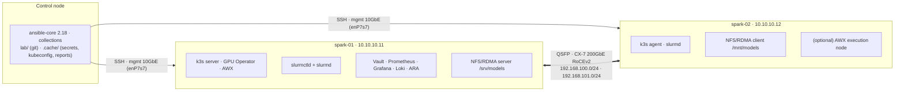

# Module 01 — Ansible for AI Infrastructure, Hands-On on NVIDIA DGX Spark

Production-grade automation you can actually run: every volume is built around a **working Ansible project in [`lab/`](lab/)** targeting one or two **DGX Spark** systems (GB10 Grace Blackwell, 128 GB unified memory, ConnectX-7 200GbE). Each volume has HLD/LLD diagrams, the real roles and playbooks, integrations, a troubleshooting runbook and a validation checklist.

Where a data-centre concept doesn't exist on a Spark (NVSwitch/Fabric Manager, InfiniBand subnet managers, BMC/Redfish, parallel file systems), the volume says so, maps the concept to what the Spark actually has, and gives you a way to practise the data-centre version.

---

## Reference lab



Single Spark? Remove `spark-02` from the inventory. The fabric, NCCL and NFS/RDMA steps skip themselves.

## Start here

1. **[Step-by-step build guide](00-ansible-step-by-step-guide.md)**: the build order, 19 steps.
2. **[Learning roadmap](ansible-tower-vault-roadmap.md)**: skills and checkpoints by level.
3. **[`lab/README.md`](lab/README.md)**: the project layout and quick start.

```bash
cd "01 Ansible/lab"
pip install -r requirements.txt && ansible-galaxy collection install -r requirements.yml -p ./collections
tests/run-local-checks.sh                    # lint, syntax, katas, fixture tests: no Spark needed
ansible-playbook playbooks/site.yml -K       # the whole lab
```

---

## Curriculum

### Part I — Foundations

| Vol | Title | Lab pieces |
|---|---|---|
| 01A | [Core on DGX Spark: control node, inventory, first contact](01-ansible-core-deep-dive.md) | `ansible.cfg`, inventory, `spark_facts`, `spark_baseline` |
| 01B | [Execution internals & debugging](01-ansible-core-engine-and-execution-internals.md) | AnsiballZ explode/execute, async, debugger |
| 02A | [Performance at scale: SSH mux, pipelining, forks, Mitogen](02-high-concurrency-tuning-mitogen-and-ssh-mux.md) | `13-fleet-sim`, `14-fleet-bench` |
| 02B | [AWX on the Spark: install & configure as code](02-ansible-tower-awx-deep-dive.md) | awx-operator, `awx.awx` |
| 03A | [Inventory: static, constructed, mDNS discovery, NetBox](03-dynamic-inventory-and-cloud-infrastructure.md) | `inventory_plugins/spark_mdns.py`, `zz-constructed.yml` |
| 03B | [Vault server: raft, TLS, init/unseal, audit, backup](03-hashicorp-vault-deep-dive.md) | `vault_server` |
| 04 | [Jinja2 & data transforms on real Spark output](04-advanced-jinja2-filters-and-data-transforms.md) | `15-jinja-lab.yml` (7 katas) |
| 05 | [Roles, collections & arm64 Execution Environments](05-role-architecture-collections-and-galaxy.md) | `argument_specs`, `build-collection.sh`, `ee/` |

### Part II — Node provisioning

| Vol | Title | Lab pieces |
|---|---|---|
| 06 | [Provisioning without a BMC; Redfish & PXE practice](06-bare-metal-os-provisioning-pxe-and-redfish.md) | `00-bootstrap` (dead-man switch), `12-redfish-practice` |
| 07 | [Driver stack: audit, pin, upgrade (and Fabric Manager)](07-nvidia-driver-and-fabric-manager-automation.md) | `16-driver-audit`, `17-dgxos-upgrade` |
| 08 | [CUDA 13, NGC containers & CDI](08-cuda-toolkit-cudnn-and-container-runtime.md) | `container_runtime`, `18-cuda-smoke`, `uma_probe.cu` |
| 09 | [Telemetry: GPU, unified memory, fabric; alerts; DCGM](09-dcgm-telemetry-and-exporter-orchestration.md) | `gpu_telemetry`, Grafana dashboard, 7 alert rules |
| 10 | [Firmware lifecycle & vulnerability patching](10-firmware-lifecycle-and-gpu-vulnerability-patch.md) | `19-firmware-inventory`, fwupd in the upgrade |

### Part III — Fabric & storage

| Vol | Title | Lab pieces |
|---|---|---|
| 11 | [ConnectX-7 fabric automation (RoCE), IB/OpenSM mapping](11-infiniband-fabric-automation-and-opensm.md) | `cx7_fabric`, `11-rdma-perftest` |
| 12 | [RoCEv2 done right: MTU, QoS, proving NCCL uses RDMA](12-lossless-rocev2-and-pfc-switch-host-tuning.md) | `12b-roce-qos`, `10-nccl-test` |
| 13 | [Multus & secondary RDMA networks on k3s](13-multus-cni-and-secondary-rdma-networking.md) | `13-multus-rdma` |
| 14 | [GPUDirect Storage on a unified-memory machine](14-gpudirect-storage-gds-and-cufile-provisioning.md) | `14-gds-check` |
| 15 | [NFS over RDMA model cache (→ Lustre/Weka/VAST clients)](15-parallel-file-system-client-orchestration.md) | `nfs_rdma` |

### Part IV — Platforms & security

| Vol | Title | Lab pieces |
|---|---|---|
| 16 | [Kubernetes with k3s (and when Kubespray)](16-kubernetes-bare-metal-bootstrap-kubespray.md) | `k3s_cluster` |
| 17 | [GPU Operator: host-driver mode, time-slicing](17-nvidia-gpu-operator-helm-automation.md) | `gpu_operator` |
| 18 | [Slurm: GRES, cgroup v2, health checks, 2-node NCCL](18-slurm-cluster-orchestration-and-cgroup-gpus.md) | `slurm_cluster` |
| 19 | [Vault ↔ Ansible: AppRole, KV, SSH certificates](19-hashicorp-vault-approle-and-dynamic-secrets.md) | `vault_config`, `19-vault-integration` |
| 20 | [AWX in production: execution nodes, Vault creds, workflows, backup](20-awx-tower-production-cluster-and-receptor.md) | receptor, `AWXBackup` |

### Part V — Production SRE

| Vol | Title | Lab pieces |
|---|---|---|
| 21 | [Testing & CI: lint, fixtures, Molecule on arm64](21-ansible-testing-linting-and-molecule.md) | `tests/`, `.github/workflows/ansible-lab-ci.yml` |
| 22 | [Drift detection & guarded self-healing](22-configuration-drift-detection-and-self-healing.md) | `20-drift-check`, `drift-cycle.sh`, `spark_drift_report.py` |
| 23 | [Logging & audit: auditd, Loki/Alloy, ARA](23-high-cardinality-logging-and-audit-compliance.md) | `23-logging-audit` |
| 24 | [Incident response: drain, evidence, runbooks A–E](24-cluster-wide-emergency-drain-and-remediation.md) | `node_drain`, `21-emergency-drain`, `24-uma-relief` |
| 25 | [Capstone: build, break, prove](25-hands-on-ansible-mastery-lab-and-test-harness.md) | `spark_validate`, `spark_invariants.py`, `25-chaos`, `capstone_scorecard.py` |

---

## How the lab was verified

Built and checked in a workspace **without** Spark hardware, so it was verified at every layer short of the device:

| Check | Result |
|---|---|
| `ansible-lint` (production profile) + `yamllint` | pass |
| `ansible-playbook --syntax-check` on every playbook | pass |
| Jinja katas against real Spark command output | 7/7 |
| Template rendering (netplan, k3s, slurm.conf, Prometheus, Vault HCL) | rendered and YAML-validated |
| Prometheus config + 7 alert rules + collector output | `promtool check config/rules/metrics` pass |
| Loki config / Alloy pipeline | `loki -verify-config` / `alloy fmt` pass |
| `uma_probe.cu` | compiles for `sm_121` with nvcc 13.x |
| Vault integration (AppRole → token → KV v2 → SSH sign) | exercised against a stand-in for Vault's HTTP API |
| Custom inventory plugin, drift reporter, firmware diff, argument specs, collection build | fixture-tested |

**Not yet run on a real Spark.** Your first pass through the step-by-step guide is the hardware test. Versions pinned in the lab (k3s, GPU Operator chart, container images, NCCL) are current as of this writing; check them before you run.
