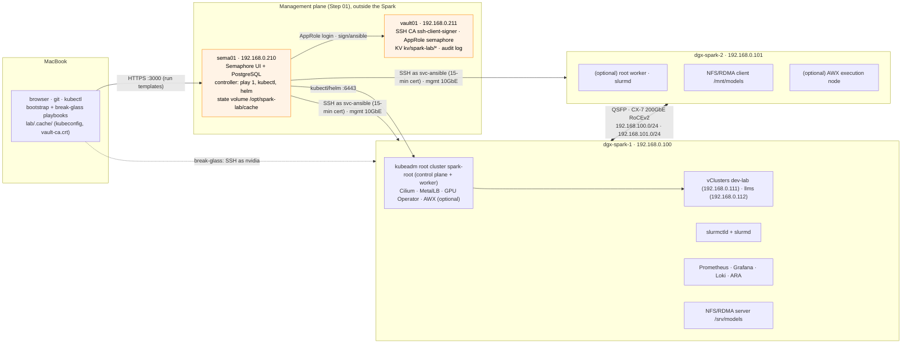
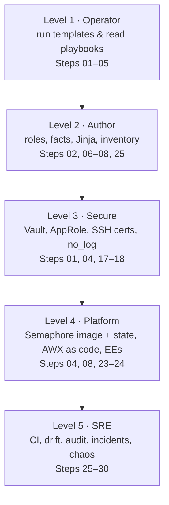
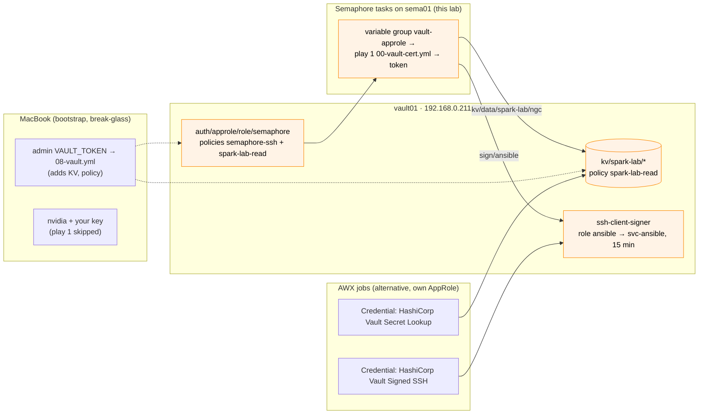

# 01 Ansible · Ansible for AI Infrastructure, Hands-On on NVIDIA DGX Spark

Production-grade automation you can actually run: every step is built around a **working Ansible project in [`lab/`](lab/)** targeting one or two **DGX Spark** systems (GB10 Grace Blackwell, 128 GB unified memory of which ~119.7 GiB is usable, ConnectX-7 200GbE). Each step's document has HLD/LLD diagrams, the real roles and playbooks, integrations, a troubleshooting runbook and a validation checklist.

Where a data-centre concept doesn't exist on a Spark (NVSwitch/Fabric Manager, InfiniBand subnet managers, BMC/Redfish, parallel file systems), the document says so, maps the concept to what the Spark actually has, and gives you a way to practise the data-centre version.

---

## Reference lab

The lab has two halves. The **management plane** stays outside the Spark: `sema01` (Semaphore UI) runs every playbook, and `vault01` (HashiCorp Vault) signs a 15-minute SSH certificate for each task and keeps the lab's secrets. The **DGX Spark** is only a target, so you can reset or re-image it without losing the tool that rebuilds it.




One Spark is the default. `dgx-spark-2` is commented out in [`lab/inventory/hosts.yml`](lab/inventory/hosts.yml), so Semaphore templates and break-glass runs need no `--limit`; if you do limit a run, keep `localhost` in it (`-l dgx-spark-1,localhost`). The fabric, NCCL and NFS/RDMA steps (13–15) skip themselves, and `dgx-spark-1` alone is a complete Kubernetes cluster (no control-plane taint). When a second Spark joins, uncomment `dgx-spark-2` (192.168.0.101) in `spark` and in the groups it belongs to.

The Kubernetes end-state is one **kubeadm** root cluster (`spark-root`) with two **vClusters** inside it, `dev-lab` and `llms`. Ansible builds it in three stages: `05-kubernetes.yml` (kubeadm, Cilium, MetalLB) → `06-gpu-operator.yml` (15 GPU time-slices) → `06b-vclusters.yml` (the two vClusters, applied from the [02 Kubernetes lab](../02%20Kubernetes/lab/README.md)). All three contexts land in one file, `kubeconfig-spark-lab.yaml`, on sema01's state volume; `lab/tools/fetch-kubeconfig.sh sema01` copies it to `lab/.cache/` on your MacBook, where the 02 Kubernetes labs expect it.

> **Convention used in every step.** "**Semaphore:** `NN Name`" means run that template in project `spark-lab`; template names follow the playbook names (`05 Kubernetes` ↔ `05-kubernetes.yml`). The same playbook from the MacBook, `ansible-playbook playbooks/NN-….yml -K` in `01 Ansible/lab`, is the **break-glass** path: without the Semaphore variable group, play 1 is skipped and you log in as `nvidia` with your own key ([Step 04 §10](04-dgx-spark-as-semaphore-target.md)). Only `00-bootstrap.yml`, `00b-semaphore-target.yml` and `08-vault.yml` run from the MacBook as the normal path. Playbook numbers are code and don't follow the step numbers: **Step 05** is a document, **`05 Kubernetes`** is a template.

## Start here

1. **[Step-by-step guide (Steps 01–30)](00-ansible-step-by-step-guide.md)**: the build order. One section per step, each linking its document, with the Semaphore template(s) or MacBook commands to run and a "Done when" check.
2. **[Step 01 · Management plane: Semaphore UI + Vault](01-management-plane-semaphore-and-vault.md)**: the first step, `vault01` and `sema01` built by hand. Then follow the guide.
3. **[`lab/README.md`](lab/README.md)**: the project layout and quick start.

```bash
cd "01 Ansible/lab"                          # on your MacBook
pip install -r requirements.txt && ansible-galaxy collection install -r requirements.yml -p ./collections
tests/run-local-checks.sh                    # lint, syntax, katas, fixture tests: no Spark needed
```

Once Step 04 is done, the Semaphore template `site` builds the whole lab in one task, or you run the stage templates one after the other as the guide does.

---

## Curriculum

Every document is numbered as its step. Work through them in order with the [step-by-step guide](00-ansible-step-by-step-guide.md); the one exception to strict order is Step 02, whose first half (toolchain, SSH trust, inventory) comes before Steps 03–04 and whose second half (first contact, facts, baseline) runs after Step 04.

### Part I — Management plane & Ansible foundations

| Step | Document | Lab pieces |
|---|---|---|
| 01 | [Management plane: Semaphore UI + Vault, automation account](01-management-plane-semaphore-and-vault.md) | `sema01`, `vault01`, `00-vault-cert.yml` (play 1) |
| 02 | [Control node & Ansible core: toolchain, inventory, first contact, facts, baseline](02-control-node-and-ansible-core.md) | `ansible.cfg`, inventory, `spark_facts`, `spark_baseline`, `00-ping`, `01-baseline` |
| 03 | [Bare-metal provisioning & bootstrap: no BMC; Redfish & PXE practice](03-bare-metal-provisioning-and-bootstrap.md) | `00-bootstrap` (dead-man switch), `12-redfish-practice` |
| 04 | [The DGX Spark as a Semaphore target](04-dgx-spark-as-semaphore-target.md) | `00b-semaphore-target.yml`, `semaphore/`, `tools/fetch-kubeconfig.sh`, `08-vault.yml` |
| 05 | [Execution internals & debugging](05-execution-internals-and-debugging.md) | AnsiballZ explode/execute, async, debugger |
| 06 | [Inventory: static, constructed, mDNS discovery, NetBox](06-inventory-static-dynamic-and-discovery.md) | `inventory_plugins/spark_mdns.py`, `zz-constructed.yml` |
| 07 | [Jinja2 & data transforms on real Spark output](07-jinja2-filters-and-data-transforms.md) | `15-jinja-lab.yml` (7 katas) |
| 08 | [Roles, collections & arm64 Execution Environments](08-roles-collections-and-execution-environments.md) | `argument_specs`, `build-collection.sh`, `ee/` |
| 09 | [Performance at scale: SSH mux, pipelining, forks, Mitogen](09-performance-at-scale-ssh-mux-and-mitogen.md) | `13-fleet-sim`, `14-fleet-bench` |

### Part II — Node provisioning

| Step | Document | Lab pieces |
|---|---|---|
| 10 | [Driver stack: audit, pin, upgrade (and Fabric Manager)](10-nvidia-driver-stack-and-fabric-manager.md) | `16-driver-audit`, `17-dgxos-upgrade` (dry run) |
| 11 | [CUDA 13, NGC containers & CDI](11-cuda-ngc-containers-and-cdi.md) | `container_runtime`, `03-containers`, `18-cuda-smoke`, `uma_probe.cu` |
| 12 | [Telemetry: GPU, unified memory, fabric; alerts; DCGM](12-gpu-telemetry-and-alerting.md) | `gpu_telemetry`, `04-telemetry`, Grafana dashboard, 7 alert rules |

### Part III — Fabric & storage

| Step | Document | Lab pieces |
|---|---|---|
| 13 | [ConnectX-7 fabric automation (RoCE), IB/OpenSM mapping](13-connectx7-fabric-and-opensm.md) | `cx7_fabric`, `02-fabric`, `11-rdma-perftest` |
| 14 | [RoCEv2 done right: MTU, QoS, proving NCCL uses RDMA](14-rocev2-qos-and-nccl.md) | `12b-roce-qos`, `10-nccl-test` |
| 15 | [NFS over RDMA model cache (→ Lustre/Weka/VAST clients)](15-nfs-rdma-and-parallel-file-systems.md) | `nfs_rdma`, `09-nfs-rdma` |
| 16 | [GPUDirect Storage on a unified-memory machine](16-gpudirect-storage-and-cufile.md) | `14-gds-check` |

### Part IV — Secrets & platforms

| Step | Document | Lab pieces |
|---|---|---|
| 17 | [Vault server: raft, TLS, init/unseal, audit, backup](17-vault-server-deep-dive.md) | `vault01` (built in Step 01, outside the Spark) |
| 18 | [Vault ↔ Ansible: AppRole, KV, SSH certificates](18-vault-approle-secrets-and-ssh-certificates.md) | `00-vault-cert`, `vault_config` (`08-vault`), `19-vault-integration` |
| 19 | [Kubernetes with kubeadm: root cluster, Cilium, MetalLB, vClusters](19-kubernetes-kubeadm-root-cluster-and-vclusters.md) | `kubeadm_cluster`, `cilium`, `metallb`, `vclusters`, `05-kubernetes`, `06b-vclusters`, `99-reset-kubernetes` |
| 20 | [GPU Operator: host-driver mode, time-slicing](20-nvidia-gpu-operator-and-time-slicing.md) | `gpu_operator`, `06-gpu-operator` |
| 21 | [Multus & secondary RDMA networks on Kubernetes](21-multus-and-secondary-rdma-networks.md) | `13-multus-rdma` |
| 22 | [Slurm: GRES, cgroup v2, health checks, 2-node NCCL](22-slurm-gres-and-cgroup-gpus.md) | `slurm_cluster`, `07-slurm` |
| 23 | [AWX on the Spark: install & configure as code](23-awx-install-and-configuration-as-code.md) (optional; the alternative controller, this lab runs Semaphore) | awx-operator, `awx.awx` |
| 24 | [AWX in production: execution nodes, Vault creds, workflows, backup](24-awx-production-and-receptor.md) (optional) | receptor, `AWXBackup` |

### Part V — Production operations

| Step | Document | Lab pieces |
|---|---|---|
| 25 | [Testing & CI: lint, fixtures, Molecule on arm64](25-testing-linting-and-ci.md) | `tests/`, `.github/workflows/ansible-lab-ci.yml` |
| 26 | [Drift detection & guarded self-healing](26-drift-detection-and-self-healing.md) | `20-drift-check`, `drift-cycle.sh`, `spark_drift_report.py` |
| 27 | [Logging & audit: auditd, Loki/Alloy, ARA](27-logging-and-audit-compliance.md) | `23-logging-audit` |
| 28 | [Firmware lifecycle & vulnerability patching](28-firmware-lifecycle-and-vulnerability-patching.md) | `19-firmware-inventory`, `17-dgxos-upgrade`, fwupd in the upgrade |
| 29 | [Incident response: drain, evidence, runbooks A–E](29-incident-response-and-emergency-drain.md) | `node_drain`, `21-emergency-drain`, `24-uma-relief` |
| 30 | [Capstone: build, break, prove](30-capstone-build-break-prove.md) | `spark_validate`, `spark_invariants.py`, `25-chaos`, `capstone_scorecard.py` |

---

## Learning roadmap

The step-by-step guide is the *build order*; this is the *learning order*: five levels of skill, each with what you should be able to do (not just read) and the steps that practise it. Every lab playbook runs as a Semaphore template; the CLI form is the break-glass path from your MacBook.



### Level 1 · Operator (week 1)

| Skill | Practise with | Checkpoint (you can…) |
|---|---|---|
| Inventory, ad-hoc, playbook runs | Semaphore templates `00 Ping`, `01 Baseline`; the same playbooks from the MacBook ([Step 02](02-control-node-and-ansible-core.md)) | explain every line of `ansible.cfg` and `hosts.yml`, and why `group_vars/spark.yml` logs in as `svc-ansible` in Semaphore but `nvidia` from the MacBook |
| Check/diff, tags, limits | `01 Baseline` as a dry run: `--check --diff --tags sysctl` (if you add `--limit`, keep `localhost`) | predict what a run will change before it runs |
| Reading failures | [Step 05](05-execution-internals-and-debugging.md) | tell whether a failure is SSH, sudo, Python, module, or logic from the error alone |

### Level 2 · Author (weeks 2–3)

| Skill | Practise with | Checkpoint |
|---|---|---|
| Custom facts | `spark.fact` ([Step 02 §3.6](02-control-node-and-ansible-core.md)) | add a field (e.g. NVMe model) and target a group by it |
| Jinja data transforms | `15-jinja-lab.yml` ([Step 07](07-jinja2-filters-and-data-transforms.md)) | parse any command output into a dict and assert on it |
| Role design & argument specs | `cx7_fabric` ([Step 08](08-roles-collections-and-execution-environments.md)) | write a role with defaults, argument_specs, pre-flight → configure → verify |
| Dynamic inventory | `spark_mdns`, `constructed` ([Step 06](06-inventory-static-dynamic-and-discovery.md)) | write an inventory plugin with a fixture test |
| Idempotence | Molecule ([Step 25](25-testing-linting-and-ci.md)) | make any role pass the idempotence step |

### Level 3 · Secure (week 3)

| Skill | Practise with | Checkpoint |
|---|---|---|
| Vault operations | vault01 ([Step 01](01-management-plane-semaphore-and-vault.md), [Step 17](17-vault-server-deep-dive.md)) | init/unseal/snapshot/restore from memory; explain seal vs unseal and what a sealed vault01 does to every Semaphore task |
| Policies & KV v2 paths | `vault_config` role (`08-vault.yml` from the MacBook: `spark-lab-read`, [Step 04 §6](04-dgx-spark-as-semaphore-target.md)) | write a least-privilege policy first time (remember `kv/data/` vs `kv/metadata/`) |
| AppRole + short-lived tokens | play 1 `00-vault-cert.yml`, `19-vault-integration.yml` ([Step 18](18-vault-approle-secrets-and-ssh-certificates.md)) | run automation with no static secrets on disk: Semaphore holds only the AppRole |
| SSH certificates | `00b-semaphore-target.yml`, `tools/vault-ssh-cert.sh` ([Step 04](04-dgx-spark-as-semaphore-target.md)) | retire static keys safely, with a break-glass path (`nvidia` + your key from the MacBook) |
| Secret hygiene | `no_log`, `.gitignore`, audit log ([Step 18](18-vault-approle-secrets-and-ssh-certificates.md)) | prove a secret never reached `ansible.log`, a Semaphore task log, AWX output, or ARA |

### Level 4 · Platform (week 4)

| Skill | Practise with | Checkpoint |
|---|---|---|
| Semaphore as the lab's controller | [Step 04](04-dgx-spark-as-semaphore-target.md), `lab/semaphore/` | rebuild the lab image, explain why its state lives on a volume and why the controller lives outside the Spark |
| AWX install (arm64 aware), the alternative controller | [Step 23](23-awx-install-and-configuration-as-code.md) | choose between on-Spark and hybrid based on the image pre-flight |
| AWX as code | `awx.awx` collection ([Step 23 §3.4](23-awx-install-and-configuration-as-code.md)) | rebuild all AWX config from git |
| Execution Environments | `ee/execution-environment.yml` ([Step 08 §3.2](08-roles-collections-and-execution-environments.md)) | build a multi-arch EE and pin it by digest |
| Receptor & execution nodes | [Step 24](24-awx-production-and-receptor.md) | make a Spark an execution node |
| Vault-backed credentials | [Step 24](24-awx-production-and-receptor.md) | map Semaphore's play 1 to AWX's *Signed SSH* credential; jobs get secrets and SSH certs from vault01 at run time |

### Level 5 · SRE (ongoing)

| Skill | Practise with | Checkpoint |
|---|---|---|
| CI gates | [Step 25](25-testing-linting-and-ci.md) | a broken role can't merge |
| Drift & guarded self-heal | [Step 26](26-drift-detection-and-self-healing.md) | explain why fabric drift is reported, not healed |
| Audit trail | [Step 27](27-logging-and-audit-compliance.md) | answer "who changed X, when, how" in under 5 minutes |
| Incident response | [Step 29](29-incident-response-and-emergency-drain.md) | run Runbooks A–E without the page open |
| Chaos | template `25 Chaos` ([Step 30](30-capstone-build-break-prove.md)) | find 5 of 7 faults unaided |

### The Vault ↔ Ansible ↔ Semaphore / AWX wiring



### Certification targets (if you want external milestones)

- Red Hat Certified Engineer (EX294): Ansible fundamentals (Levels 1–2).
- HashiCorp Certified: Vault Associate (Level 3).
- Red Hat Ansible Automation Platform specialist exams (Level 4). The skills map directly from AWX.
- NVIDIA DLI / NVIDIA-Certified Associate/Professional in AI Infrastructure (the GPU and fabric side of this lab).

Check each vendor's site for current exam names and versions; they change.

---

## How the lab was verified

Built and checked in a workspace **without** Spark hardware, so it was verified at every layer short of the device:

| Check | Result |
|---|---|
| `ansible-lint` (production profile) + `yamllint` | pass |
| `ansible-playbook --syntax-check` on every playbook | pass |
| Jinja katas against real Spark command output | 7/7 |
| Template rendering (netplan, slurm.conf, Prometheus) | rendered and YAML-validated |
| Prometheus config + 7 alert rules + collector output | `promtool check config/rules/metrics` pass |
| Loki config / Alloy pipeline | `loki -verify-config` / `alloy fmt` pass |
| `uma_probe.cu` | compiles for `sm_121` with nvcc 13.x |
| Vault integration (play 1: AppRole → token → SSH sign → KV v2) | exercised against a stand-in for Vault's HTTP API |
| Custom inventory plugin, drift reporter, firmware diff, argument specs, collection build | fixture-tested |

**Not yet run on a real Spark.** Your first pass through the step-by-step guide is the hardware test. Versions pinned in the lab (Kubernetes, Cilium, MetalLB, GPU Operator and vCluster charts, container images, NCCL) are current as of this writing; check them before you run.
