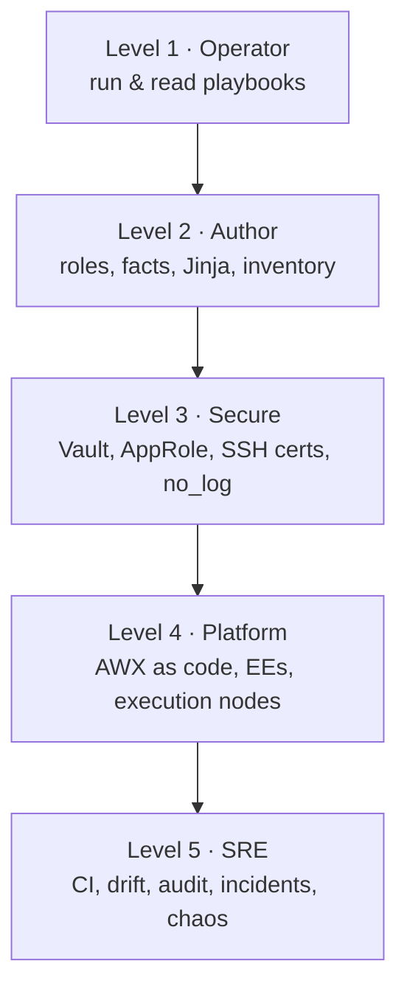
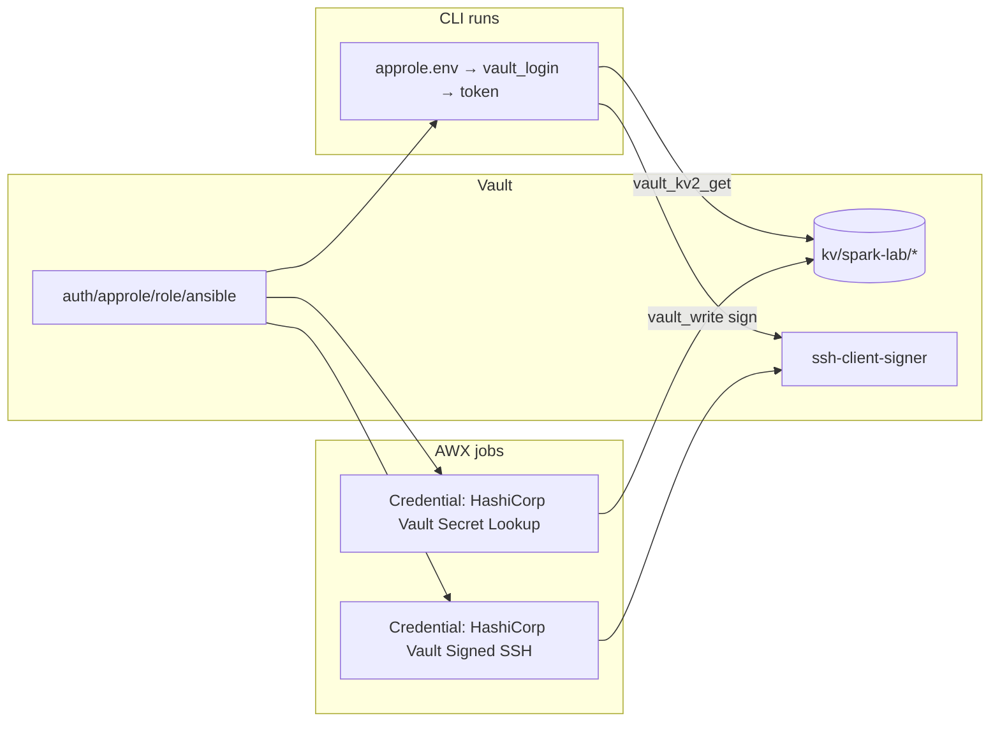

# Learning Roadmap: Ansible → Vault → AWX, Practised on DGX Spark

> **Module 01 companion.** A skills roadmap with checkpoints. The [step-by-step guide](00-ansible-step-by-step-guide.md) is the *build order*; this page is the *learning order*, with what to be able to do (not just read) at each level.

---

## Level 1 · Operator (week 1)

| Skill | Practise with | Checkpoint (you can…) |
|---|---|---|
| Inventory, ad-hoc, playbook runs | `00-ping`, `01-baseline` | explain every line of `ansible.cfg` and `hosts.yml` |
| Check/diff, tags, limits | `01-baseline --check --diff --tags sysctl -l dgx-spark-02` | predict what a run will change before it runs |
| Reading failures | [01B](01-ansible-core-engine-and-execution-internals.md) | tell whether a failure is SSH, sudo, Python, module, or logic from the error alone |

## Level 2 · Author (weeks 2–3)

| Skill | Practise with | Checkpoint |
|---|---|---|
| Custom facts | `spark.fact` ([01A](01-ansible-core-deep-dive.md)) | add a field (e.g. NVMe model) and target a group by it |
| Jinja data transforms | `15-jinja-lab.yml` ([04](04-advanced-jinja2-filters-and-data-transforms.md)) | parse any command output into a dict and assert on it |
| Role design & argument specs | `cx7_fabric` ([05](05-role-architecture-collections-and-galaxy.md)) | write a role with defaults, argument_specs, pre-flight → configure → verify |
| Dynamic inventory | `spark_mdns`, `constructed` ([03A](03-dynamic-inventory-and-cloud-infrastructure.md)) | write an inventory plugin with a fixture test |
| Idempotence | Molecule ([21](21-ansible-testing-linting-and-molecule.md)) | make any role pass the idempotence step |

## Level 3 · Secure (week 3)

| Skill | Practise with | Checkpoint |
|---|---|---|
| Vault operations | [03B](03-hashicorp-vault-deep-dive.md) | init/unseal/snapshot/restore from memory; explain seal vs unseal |
| Policies & KV v2 paths | `vault_config` role | write a least-privilege policy first time (remember `kv/data/` vs `kv/metadata/`) |
| AppRole + short-lived tokens | `19-vault-integration.yml` ([19](19-hashicorp-vault-approle-and-dynamic-secrets.md)) | run automation with no static secrets on disk |
| SSH certificates | `tools/vault-ssh-cert.sh` | retire static keys safely, with a break-glass path |
| Secret hygiene | `no_log`, `.gitignore`, audit log | prove a secret never reached `ansible.log`, AWX output, or ARA |

## Level 4 · Platform (week 4)

| Skill | Practise with | Checkpoint |
|---|---|---|
| AWX install (arm64 aware) | [02B](02-ansible-tower-awx-deep-dive.md) | choose between on-Spark and hybrid based on the image pre-flight |
| AWX as code | `awx.awx` collection | rebuild all AWX config from git |
| Execution Environments | `ee/execution-environment.yml` ([05](05-role-architecture-collections-and-galaxy.md)) | build a multi-arch EE and pin it by digest |
| Receptor & execution nodes | [20](20-awx-tower-production-cluster-and-receptor.md) | make a Spark an execution node |
| Vault-backed credentials | [20](20-awx-tower-production-cluster-and-receptor.md) | jobs get secrets and SSH certs from Vault at run time |

## Level 5 · SRE (ongoing)

| Skill | Practise with | Checkpoint |
|---|---|---|
| CI gates | [21](21-ansible-testing-linting-and-molecule.md) | a broken role can't merge |
| Drift & guarded self-heal | [22](22-configuration-drift-detection-and-self-healing.md) | explain why fabric drift is reported, not healed |
| Audit trail | [23](23-high-cardinality-logging-and-audit-compliance.md) | answer "who changed X, when, how" in under 5 minutes |
| Incident response | [24](24-cluster-wide-emergency-drain-and-remediation.md) | run Runbooks A–E without the page open |
| Chaos | `25-chaos.yml` ([25](25-hands-on-ansible-mastery-lab-and-test-harness.md)) | find 5 of 7 faults unaided |

---

## Quick reference: the Vault ↔ Ansible ↔ AWX wiring

## Suggested certification targets (if you want external milestones)

- Red Hat Certified Engineer (EX294): Ansible fundamentals (Level 1–2).
- HashiCorp Certified: Vault Associate (Level 3).
- Red Hat Ansible Automation Platform specialist exams (Level 4). The skills map directly from AWX.
- NVIDIA DLI / NVIDIA-Certified Associate/Professional in AI Infrastructure (the GPU and fabric side of this lab).

Check each vendor's site for current exam names and versions; they change.
