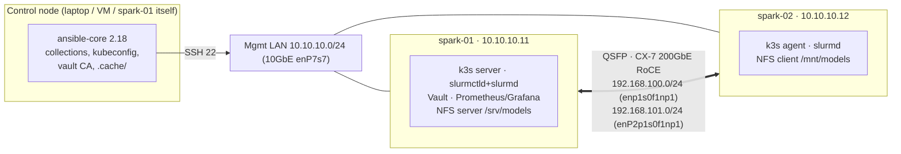

# DGX Spark Ansible Lab — runnable companion to Module 01

Everything the 25 volumes teach, as a working Ansible project you run against
one or two NVIDIA DGX Spark systems. Every code block in the volumes is taken
from (or runs against) this directory.

```
lab/
├── ansible.cfg                 # pipelining, ControlPersist, fact cache, log_path, plugin paths   (Vol 01-02)
├── requirements.txt / .yml     # control-node Python + collections                               (Vol 05)
├── inventory/
│   ├── hosts.yml               # control (localhost) + spark + functional groups                   (Vol 03A)
│   ├── zz-constructed.yml      # groups from facts: gpu_ready, driver_580, uma_pressure…         (Vol 03A)
│   ├── group_vars/all.yml      # lab-wide: user, networks, NTP
│   ├── group_vars/spark.yml    # GB10 golden values, packages, sysctls, NVIDIA hold regex
│   └── host_vars/spark-0N.yml  # per-node CX-7 addressing
├── inventory_plugins/spark_mdns.py   # discover Sparks via Avahi/mDNS                            (Vol 03A)
├── inventory-examples/         # opt-in sources (mDNS)
├── roles/
│   ├── spark_facts             # /etc/ansible/facts.d/spark.fact (GPU, CUDA, CX-7, UMA)          (Vol 01A, 04)
│   ├── spark_baseline          # packages, NVIDIA holds, sysctl, SSH, chrony, journald + Molecule (Vol 01A, 21)
│   ├── cx7_fabric              # netplan, MTU, 200G/RDMA verify, runtime reconcile, GID, argspec (Vol 11, 05)
│   ├── container_runtime       # docker + nvidia-ctk + CDI (freshness-checked) + NGC              (Vol 08)
│   ├── gpu_telemetry           # textfile collector, Prometheus/Grafana/Alertmanager, dashboard  (Vol 09)
│   ├── k3s_cluster             # k3s w/ nvidia default runtime, flannel over CX-7                (Vol 16)
│   ├── gpu_operator            # Helm, driver/toolkit disabled, time-slicing                    (Vol 17)
│   ├── slurm_cluster           # munge, slurm.conf, gres.conf, cgroup v2, health check          (Vol 18)
│   ├── vault_server            # Vault raft + TLS + init/unseal                                  (Vol 03B)
│   ├── vault_config            # KV, AppRole, policies, SSH CA, audit via HTTP API              (Vol 19)
│   ├── nfs_rdma                # NFSv4.2 over RDMA model cache                                   (Vol 15)
│   ├── node_drain              # cordon → capture → stop → reboot → validate → return            (Vol 24)
│   └── spark_validate          # end-to-end invariants + JSON report                             (Vol 25)
├── playbooks/                  # 00-bootstrap … 30-validate, site.yml (see the step-by-step guide)
│   ├── files/uma_probe.cu      # sm_121 unified-memory probe                                     (Vol 08)
│   └── templates/              # RDMA device plugin, Loki, Alloy, auditd rules                   (Vol 13, 23)
├── tools/
│   ├── spark_invariants.py     # run ON a Spark, no Ansible needed                               (Vol 25)
│   ├── spark_drift_report.py   # check-mode JSON → markdown / Prometheus / exit code / hosts      (Vol 22)
│   ├── drift-cycle.sh          # detect → publish → guarded auto-heal → recheck                  (Vol 22)
│   ├── capstone_scorecard.py   # grade the capstone from .cache/ evidence                        (Vol 25)
│   ├── vault-pass.sh · vault-ssh-cert.sh   # ansible-vault key + SSH certs from Vault           (Vol 19)
│   ├── build-collection.sh     # package roles as cloudone.spark                                 (Vol 05)
│   └── fleet-sim/Dockerfile    # fake sshd nodes for performance tuning                          (Vol 02A)
├── tests/                      # run-local-checks.sh + captured fixtures                         (Vol 21)
└── ee/execution-environment.yml  # arm64 EE for AWX / ansible-navigator                         (Vol 05, 20)
```

## Topology the defaults assume



**Single Spark?** Remove `spark-02` from `inventory/hosts.yml` and from the
`k3s_agent`/`nfs_client` groups. Fabric, NCCL and NFS-over-RDMA steps skip
themselves; everything else runs.

## Quick start

```bash
# 1. Control node
python3 -m venv ~/.venvs/spark-ansible && source ~/.venvs/spark-ansible/bin/activate
pip install -r requirements.txt
ansible-galaxy collection install -r requirements.yml -p ./collections

# 2. Edit inventory/hosts.yml (IPs) and host_vars/*.yml (CX-7 names from `ibdev2netdev`)
#    Fresh from the first-boot wizard? Use playbooks/00-bootstrap.yml (Volume 06).
ssh-copy-id nvidia@10.10.10.11     # and .12

# 3. Walk the stages (each is safe to re-run)
ansible-playbook playbooks/00-ping.yml
ansible-playbook playbooks/01-baseline.yml --ask-become-pass
ansible-playbook playbooks/02-fabric.yml   -K
ansible-playbook playbooks/03-containers.yml -K
ansible-playbook playbooks/30-validate.yml -K
# …or everything:
ansible-playbook playbooks/site.yml -K

# 4. Day-2
tools/drift-cycle.sh                                             # what drifted? (exit 0/2/3)
ansible-playbook playbooks/21-emergency-drain.yml -l spark-02 -K  # take a node out safely
ansible-playbook playbooks/10-nccl-test.yml -K                   # 2-node NCCL bandwidth
python3 tools/capstone_scorecard.py                              # evidence-based progress
```

## Quality gates (run before every commit)

```bash
tests/run-local-checks.sh                  # yamllint, ansible-lint (production), syntax, katas, fixtures
cd roles/spark_baseline && molecule test   # on the Spark: native arm64 container
```

## Versions pinned here (check before use)

| Component | Pin | Where |
|---|---|---|
| ansible-core | 2.18.x | `requirements.txt` |
| k3s | v1.32.5+k3s1 | `roles/k3s_cluster/defaults` |
| GPU Operator chart | v25.3.0 | `roles/gpu_operator/defaults` |
| Vault | 1.20.* | `roles/vault_server/defaults` |
| NCCL | v2.30.7-1 (NVIDIA Spark playbook) | `playbooks/10-nccl-test.yml` |
| CUDA smoke image | `nvcr.io/nvidia/cuda:13.0.1-base-ubuntu24.04` | `container_runtime`, `spark_validate` |

`.cache/` (git-ignored) holds the fact cache, run log, kubeconfig, munge key,
Vault CA and — **lab only** — Vault init keys. Treat it as secret.
