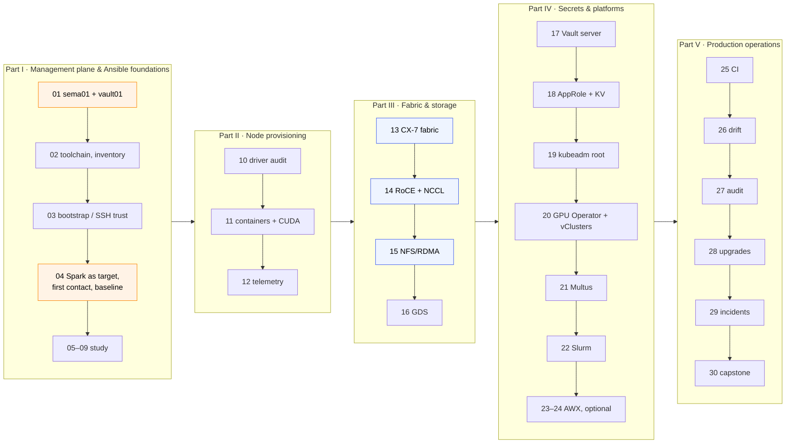

# Chapter 00 · Ansible Step-by-Step Guide

> **01-Ansible · Chapter 00 of 30** · Start here · [Module overview](README.md) · [Chapter 01 · Management plane: Semaphore & Vault](01-management-plane-semaphore-and-vault.md) →

This page is the build order for the whole module. Each section below is one chapter: it links the chapter's document and says what to run and how you know the chapter is done. Work through them in order. Documents, templates and playbooks carry the chapter numbers: Chapter 13 is `13-….md`, and its templates are `13.1 Fabric` (`13.1-fabric.yml`) and `13.2 RDMA perftest`.

**What you build.** One NVIDIA DGX Spark (`dgx-spark-1`, 192.168.0.100), automated end to end: OS baseline and custom GPU facts, containers and CUDA, telemetry, a kubeadm root cluster with two vClusters (`dev-lab`, `llms`), the GPU Operator, Slurm, logging and audit, drift detection, upgrades and incident drills, and a capstone that breaks the lab on purpose and makes you prove the fix. A second Spark (`dgx-spark-2`, 192.168.0.101) is optional. It is commented out in [`lab/inventory/hosts.yml`](lab/inventory/hosts.yml) until it joins, and it is needed only for the fabric, NCCL and NFS-over-RDMA chapters (13–15).

**Who runs what.**

| Machine | Role |
|---|---|
| `sema01` · 192.168.0.210 | Semaphore UI. Runs every lab playbook as a **template** in project `spark-lab`, from Chapter 04 on. Template name = playbook name: template `19.1 Kubernetes` runs `19.1-kubernetes.yml`. |
| `vault01` · 192.168.0.211 | HashiCorp Vault. Signs a 15-minute SSH certificate for `svc-ansible` at the start of every Semaphore task and holds the lab's secrets. |
| MacBook | Browser to Semaphore, `git push`, `kubectl` for the 02-Kubernetes labs. Also the **bootstrap** playbooks (`03.1-bootstrap.yml`, `04.1-semaphore-target.yml`, `17.1-vault.yml`) and **break-glass** runs when sema01 or vault01 is down. |

`sema01` and `vault01` stay outside the Spark, so resetting or re-imaging the Spark never takes the tool that rebuilds it with it.

**How to read a chapter section.** "**Semaphore UI:** `NN Name`" means run that template. The `ansible-playbook playbooks/NN-….yml -K` line under it is the break-glass form from the MacBook, in `01-Ansible/lab`: without the Semaphore variable group, play 1 (the certificate) is skipped and you log in as `dgxadmin` with your own key ([Chapter 04 §11](04-dgx-spark-as-semaphore-target.md)). A template's number is `<chapter>.<n>`, the chapter that explains it: **`19.1 Kubernetes`** is the first template of **Chapter 19**. The exceptions are `00-vault-cert.yml` (play 1, imported by every playbook that SSHes to the Sparks) and `site`.

**One Spark, no `--limit`.** With `dgx-spark-2` commented out, templates and break-glass runs need no `--limit`. If you do limit a run, always keep `localhost` in it (`-l dgx-spark-1,localhost`): play 1 and the Kubernetes plays run there.

## Where each command runs

Every command block starts with a `# ▶` line that says where to run it.

| Location line | Machine | Your prompt looks like | How to get there |
|---|---|---|---|
| `# ▶ MacBook · 01-Ansible/lab (venv active)` | your Mac | `(spark-ansible) you@Mac lab %` | `lab` (the shortcut below) |
| `# ▶ MacBook · any folder` | your Mac | `you@Mac … %` | a new Terminal window |
| `# ▶ dgx-spark-1 (ssh dgx-spark-1)` | the Spark | `dgxadmin@dgx-spark-1:~$` | `ssh dgx-spark-1` |
| `# ▶ vault01 (ssh vault01)` | Vault server | `vault01@vault01:~$` | `ssh vault01` |
| `# ▶ sema01 (ssh sema01)` | Semaphore server | `…@sema01:~$` | `ssh sema01` |
| **Semaphore UI:** | browser | — | http://192.168.0.210:3000 |

**One-time setup on the MacBook.** First type this line by hand (not as part of a pasted block). It lets macOS zsh treat the `# ▶ …` and other `#` lines in pasted blocks as comments; without it zsh answers `zsh: command not found: #`:

`setopt interactivecomments; echo 'setopt interactivecomments' >> ~/.zshrc`

Then the shortcut that takes you to the lab folder with the venv active:

```bash
# ▶ MacBook · any folder
echo "alias lab='cd ~/technical-depth/01-Ansible/lab && source ~/.venvs/spark-ansible/bin/activate'" >> ~/.zshrc
source ~/.zshrc
lab                                   # prompt now: (spark-ansible) … lab %
```

Adjust the path if you cloned elsewhere (`find ~ -maxdepth 4 -type d -path "*01-Ansible/lab"` finds it).

Before you paste: glance at the prompt. `… lab %` with `(spark-ansible)` = MacBook lab; `dgxadmin@dgx-spark-1` = the Spark. `exit` leaves an SSH session.

---

## Progress

Times are rough working times for one Spark, not counting reading.

| Chapter | Document | What you do | Time | Done when |
|---|---|---|---|---|
| **Part I** | **Management plane & Ansible foundations** | | | |
| 01 | [Management plane: Semaphore & Vault](01-management-plane-semaphore-and-vault.md) | Build `vault01` and `sema01` by hand | ½ day | A Semaphore task logs in to a test target as `svc-ansible` with a certificate |
| 02 | [Control node & Ansible core](02-control-node-and-ansible-core.md) | MacBook only: toolchain, local checks, inventory | 30–45 min | `ALL LOCAL CHECKS PASSED`; `ansible-inventory --graph` shows `dgx-spark-1` |
| 03 | [Bare-metal provisioning & bootstrap](03-bare-metal-provisioning-and-bootstrap.md) | Fresh DGX OS: bootstrap name, key, static IP; already installed: `ssh-copy-id` | 10–30 min | `ssh dgxadmin@192.168.0.100 hostname` → `dgx-spark-1`, no password |
| 04 | [DGX Spark as a Semaphore target](04-dgx-spark-as-semaphore-target.md) | `svc-ansible` + CA trust, lab image on sema01, project `spark-lab`; `04.2 Ping`, custom facts, `04.3 Baseline`; lab secrets | 90–120 min | sshd log: `… ED25519-CERT`; `compute_cap` `12.1`; second `04.3 Baseline` `changed=0` |
| 05 | [Execution internals & debugging](05-execution-internals-and-debugging.md) | Study: watch a module run, explode an AnsiballZ payload | 45 min | You can name the failing layer from an error alone |
| 06 | [Inventory: static, dynamic & discovery](06-inventory-static-dynamic-and-discovery.md) | Study: fact-driven groups, mDNS plugin | 45 min | `ansible-inventory --graph` shows `gpu_ready` |
| 07 | [Jinja2 filters & data transforms](07-jinja2-filters-and-data-transforms.md) | Study: the 7 Jinja katas | 60 min | `7/7 Jinja katas passed` |
| 08 | [Roles, collections & execution environments](08-roles-collections-and-execution-environments.md) | Study: package the roles as a collection | 45 min | `ansible-doc -t role -l cloudone.spark` lists the roles |
| 09 | [Performance at scale: SSH mux & Mitogen](09-performance-at-scale-ssh-mux-and-mitogen.md) | Study: simulated fleet, tuning matrix | 60 min | Your own timing table for forks / pipelining / facts |
| **Part II** | **Node provisioning** | | | |
| 10 | [NVIDIA driver stack & Fabric Manager](10-nvidia-driver-stack-and-fabric-manager.md) | `10.1 Driver audit`; upgrade dry run | 20 min | Driver audit green, NVIDIA packages held |
| 11 | [CUDA, NGC containers & CDI](11-cuda-ngc-containers-and-cdi.md) | `11.1 Containers`, `11.2 CUDA smoke` | 40 min | `uma_probe … check=PASS` |
| 12 | [GPU telemetry & alerting](12-gpu-telemetry-and-alerting.md) | `12.1 Telemetry` | 30 min | Grafana *Spark Lab / Overview* shows GPU, UMA, CX-7 |
| **Part III** | **Fabric & storage** | | | |
| 13 | [ConnectX-7 fabric & OpenSM](13-connectx7-fabric-and-opensm.md) | `13.1 Fabric`, `13.2 RDMA perftest` (2 Sparks) | 45 min | Links at 200000 Mb/s, MTU 9000 |
| 14 | [RoCEv2, QoS & NCCL](14-rocev2-qos-and-nccl.md) | `14.1 RoCE QoS` (optional), `14.2 NCCL test` (2 Sparks) | 60 min | NCCL log says `via NET/IB` |
| 15 | [NFS over RDMA & parallel file systems](15-nfs-rdma-and-parallel-file-systems.md) | `15.1 NFS RDMA` (2 Sparks) | 20 min | `proto=rdma,port=20049` on dgx-spark-2 |
| 16 | [GPUDirect Storage & cuFile](16-gpudirect-storage-and-cufile.md) | Study: `16.1 GDS check` | 30 min | You can say what GDS means on a UMA machine |
| **Part IV** | **Secrets & platforms** | | | |
| 17 | [Vault server deep dive](17-vault-server-deep-dive.md) | Study: inspect vault01, seal drill, snapshot | 45 min | You can unseal and snapshot vault01 from memory |
| 18 | [Vault AppRole, secrets & SSH certificates](18-vault-approle-secrets-and-ssh-certificates.md) | `18.1 Vault integration` | 20 min | `NGC key present: True` without the key in any log |
| 19 | [Kubernetes: kubeadm root cluster & vClusters](19-kubernetes-kubeadm-root-cluster-and-vclusters.md) | `19.1 Kubernetes`, fetch kubeconfig | 45 min | `dgx-spark-1` `Ready`, Cilium `OK` |
| 20 | [NVIDIA GPU Operator & time-slicing](20-nvidia-gpu-operator-and-time-slicing.md) | `20.1 GPU Operator`, then `20.2 vClusters` | 60 min | 15 `nvidia.com/gpu`; contexts `dev-lab` and `llms` answer |
| 21 | [Multus & secondary RDMA networks](21-multus-and-secondary-rdma-networks.md) | `21.1 Multus RDMA` | 45 min | A pod has a second, RDMA-capable interface |
| 22 | [Slurm: GRES & cgroup GPUs](22-slurm-gres-and-cgroup-gpus.md) | `22.1 Slurm` | 45 min | `srun --gres=gpu:1 nvidia-smi` runs |
| 23 | [AWX install & configuration as code](23-awx-install-and-configuration-as-code.md) | Optional study: arm64 pre-flight, AWX as code | 2 h | You can choose on-Spark vs hybrid AWX |
| 24 | [AWX production & Receptor](24-awx-production-and-receptor.md) | Optional: execution node, Vault credentials | 2 h | An AWX job runs on the Spark with a Vault-signed certificate |
| **Part V** | **Production operations** | | | |
| 25 | [Testing, linting & CI](25-testing-linting-and-ci.md) | CI workflow, Molecule on the Spark | 45 min | A broken role can't merge |
| 26 | [Drift detection & self-healing](26-drift-detection-and-self-healing.md) | `26.1 Drift check`, scheduled nightly | 30 min | Nightly task green; drift report exit codes understood |
| 27 | [Logging & audit compliance](27-logging-and-audit-compliance.md) | `27.1 Logging audit` | 45 min | Four audit sources answer "who changed what" |
| 28 | [Firmware lifecycle & vulnerability patching](28-firmware-lifecycle-and-vulnerability-patching.md) | `28.1 Firmware inventory`, `10.2 DGX OS upgrade` | per window | Upgrade done, validation green afterwards |
| 29 | [Incident response & emergency drain](29-incident-response-and-emergency-drain.md) | `29.1 Emergency drain`, `29.2 UMA relief`, break-glass drill | 90 min | Node drained, evidence captured, returned to service |
| 30 | [Capstone: build, break, prove](30-capstone-build-break-prove.md) | `30.2 Chaos`, find and fix, grade | a weekend | Scorecard from the evidence on sema01 |

## Overview



Orange: the management plane. Blue: needs `dgx-spark-2` and a QSFP cable; with one Spark, read those chapters and move on (the playbooks skip themselves).

---

# Part I · Management plane & Ansible foundations

## Chapter 01 · Management plane: Semaphore & Vault → [document](01-management-plane-semaphore-and-vault.md)

Build `vault01` (192.168.0.211: SSH CA `ssh-client-signer`, signing role `ansible` for principal `svc-ansible` with 15-minute certificates, AppRole `semaphore`, audit log) and `sema01` (192.168.0.210: Semaphore UI + PostgreSQL in Docker) by hand, exactly as Chapter 01 describes, with your Ubuntu test targets. No lab playbook ever configures these two machines, and they survive every reset of the Spark.

✅ **Done when** the Chapter 01 §9 checks pass: a Semaphore task on your Ubuntu targets gets a certificate in play 1 and logs in as `svc-ansible`.

## Chapter 02 · Control node & Ansible core → [document](02-control-node-and-ansible-core.md)

MacBook only: the toolchain, `ansible.cfg`, how the login switches between Semaphore and the MacBook, and the inventory (Chapter 02 §3). Nothing in this chapter touches the Spark.

```bash
# ▶ MacBook · any folder
setopt interactivecomments; echo 'setopt interactivecomments' >> ~/.zshrc   # macOS zsh: let "# comments" in pasted commands be comments
git clone https://github.com/cloudone365/technical-depth.git && cd "technical-depth/01-Ansible/lab"
python3 -m venv ~/.venvs/spark-ansible && source ~/.venvs/spark-ansible/bin/activate
```

```bash
# ▶ MacBook · 01-Ansible/lab (venv active)
pip install -r requirements.txt
ansible-galaxy collection install -r requirements.yml -p ./collections
tests/run-local-checks.sh              # proves your toolchain before touching hardware
ansible-inventory --graph              # the inventory as Ansible sees it (Chapter 02 §3.3)
```

Now set up the `lab` shortcut ([Where each command runs](#where-each-command-runs)): one word takes a new terminal to `01-Ansible/lab` with the venv active.

Every new terminal: `source ~/.venvs/spark-ansible/bin/activate` first (the prompt then starts with `(spark-ansible)`); without it, `yamllint`, `ansible` and friends are "command not found".

The MacBook needs this toolchain only for the bootstrap playbooks, `17.1-vault.yml` and break-glass runs; Semaphore brings its own (Chapter 04 §4).

✅ **Done when** `tests/run-local-checks.sh` prints `ALL LOCAL CHECKS PASSED` and `ansible-inventory --graph` shows `dgx-spark-1` under `@spark`.

## Chapter 03 · Bare-metal provisioning & bootstrap → [document](03-bare-metal-provisioning-and-bootstrap.md)

Give your MacBook key login to `dgxadmin` on the Spark. Two paths, the same end state (Chapter 03 §3):

- **Fresh DGX OS.** After the first-boot wizard (Chapter 03 §3.1), from the MacBook (Chapter 03 §3.2). The bootstrap also installs your key (`~/.ssh/id_ed25519.pub`):
  ```bash
  # ▶ MacBook · 01-Ansible/lab (venv active)
  ansible-playbook playbooks/03.1-bootstrap.yml -l dgx-spark-1 -k -K -e bootstrap_current_ip=<dhcp-ip>
  ansible-playbook playbooks/03.1-bootstrap.yml -l dgx-spark-1 -K -e bootstrap_current_ip=<dhcp-ip> -e bootstrap_static_ip=true
  ```
  The second run moves the Spark to its static address (a NetworkManager profile on DGX OS) behind a dead-man switch: if the new address doesn't answer, the change rolls back by itself. A Spark that is already static on that address is left alone.
- **Already installed** (named `dgx-spark-1`, on 192.168.0.100, user `dgxadmin`). No bootstrap: SSH trust only, then check name and address (Chapter 03 §3.3):
  ```bash
  # ▶ MacBook · any folder
  ssh-copy-id dgxadmin@192.168.0.100
  ssh dgxadmin@192.168.0.100 'hostname; grep -c "$(hostname)" /etc/hosts; ip -4 addr show enP7s7 | grep inet'
  ```
  You want `dgx-spark-1`, a count of 1 or more, and `inet 192.168.0.100/24`. A static address set in NetworkManager (DGX OS doesn't keep it in `/etc/netplan`) and a DHCP reservation on your router (`dynamic` in the output) are both fine. Only the hostname wrong? Run the first bootstrap command with `-e bootstrap_current_ip=192.168.0.100`; it doesn't touch the network. What the bootstrap does and when you can skip it: Chapter 03 §3.

Redfish and PXE (Chapter 03 §4–5) are practice for data-centre nodes; the Redfish mockup runs as the template `03.2 Redfish practice` once the Spark is a Semaphore target (Chapter 04 §8.1).

✅ **Done when** `ssh dgxadmin@192.168.0.100 hostname` prints `dgx-spark-1` without a password.

## Chapter 04 · DGX Spark as a Semaphore target → [document](04-dgx-spark-as-semaphore-target.md)

Work through Chapter 04 from top to bottom (MacBook, sema01 and the Semaphore UI). In short:

1. **Trust vault01 on the Spark**, from the MacBook (Chapter 04 §2–3):
   ```bash
   # ▶ MacBook · 01-Ansible/lab (venv active)
   scp vault01:~/vault-ca.crt .cache/vault-ca.crt                 # vault01's TLS certificate (SSH names vault01/sema01: Chapter 04 §2)
   ansible-playbook playbooks/04.1-semaphore-target.yml -K         # svc-ansible, NOPASSWD sudo, trust vault01's CA
   ```
   If anything that talks to vault01 answers `{"errors":["Vault is sealed"]}`, vault01 has restarted: on vault01 run `vault operator unseal` twice, with two different unseal keys, until `vault status` shows `Sealed false` (Chapter 04 §2).
2. **On sema01**, build the lab's Semaphore image and state volume from [`lab/semaphore/`](lab/semaphore/) (Chapter 04 §4).
3. **Semaphore UI:** create project `spark-lab`: repository, File inventory `01-Ansible/lab/inventory/hosts.yml`, variable group `vault-approle`, template `04.2 Ping`. Its first run proves the certificate chain (Chapter 04 §5). First run failed? Chapter 04 §5.6 *If the first run of `04.2 Ping` fails* sorts it by play: play 1 = sema01↔vault01 (sealed Vault, AppRole, TLS), play 2 = the Spark refused the certificate. The most common cause there is a clock that is off on vault01 or sema01 (`Certificate invalid: expired` in the Spark's SSH log), fixed with chrony.
4. **First contact, custom facts and OS baseline** (Chapter 04 §6). **Semaphore UI:** `04.2 Ping` again; the log shows play 1 (*Get an SSH certificate from Vault*), then *Connectivity and identity check* on `dgx-spark-1`. Try the ad-hoc commands of §6.1 from the MacBook: Semaphore runs playbooks, not ad-hoc commands. Then create the template `04.3 Baseline` and run it twice (Chapter 04 §6.2–6.3).
   ```bash
   # ▶ MacBook · 01-Ansible/lab (venv active)
   ansible-playbook playbooks/04.2-ping.yml -K       # break-glass (MacBook, as dgxadmin)
   ansible-playbook playbooks/04.3-baseline.yml -K   # break-glass
   ```
5. **Lab secrets** (optional until Chapter 11): get an admin token on vault01, run `17.1-vault.yml` from the MacBook to add the KV engine and policy, store the NGC key on vault01, then set `vault_lab_secrets_enabled: true` in the variable group (Chapter 04 §7, Tasks 7.1–7.4; explained in Chapters 17 and 18):
   ```bash
   # ▶ vault01 (ssh vault01)
   export VAULT_ADDR=https://192.168.0.211:8200 VAULT_CACERT=$HOME/vault-ca.crt
   vault login                                # the Initial Root Token from Chapter 01
   vault print token                          # copy it for the MacBook step
   ```
   ```bash
   # ▶ MacBook · 01-Ansible/lab (venv active)
   read -s "VAULT_TOKEN?Vault admin token: " && export VAULT_TOKEN   # paste; nothing is shown or saved
   ansible-playbook playbooks/17.1-vault.yml  # localhost only: talks to vault01's API
   unset VAULT_TOKEN
   ```
   ```bash
   # ▶ vault01 (ssh vault01)
   read -rsp "NGC key: " NGC_KEY; echo                                     # paste the nvapi-… key, Enter (not shown)
   printf %s "$NGC_KEY" | vault kv put kv/spark-lab/ngc api_key=-   # "-" = take the value from the line before; no trailing newline
   unset NGC_KEY
   ```
6. **Create the remaining templates** from the table in Chapter 04 §8.1.

`04.1-semaphore-target.yml` runs from the MacBook as `dgxadmin` with your own key, because the Spark doesn't trust vault01 until item 1 is done ([`group_vars/spark.yml`](lab/inventory/group_vars/spark.yml) picks that login whenever no `vault_role_id` is set).

✅ **Done when** dgx-spark-1's sshd log shows `Accepted publickey for svc-ansible … ED25519-CERT` after a Semaphore run of `04.2 Ping`, `04.2 Ping` reports `dgx-spark-1 aarch64 20 cores … Ubuntu 24.04` with `failed=0`, `ansible_local.spark.gpu.compute_cap == "12.1"`, and the second `04.3 Baseline` run reports `changed=0`.

## Chapter 05 · Execution internals & debugging → [document](05-execution-internals-and-debugging.md)

Study chapter, nothing new to build. **What to try** (MacBook, break-glass login, Chapter 05 §1.1): watch a module travel to the Spark, then keep and unpack its payload.

```bash
# ▶ MacBook · 01-Ansible/lab (venv active)
ansible dgx-spark-1 -m ping -vvvv 2>&1 | grep -E 'ESTABLISH|SSH: EXEC|PUT|<dgx-spark-1> (EXEC|SSH)'
ANSIBLE_PIPELINING=0 ANSIBLE_KEEP_REMOTE_FILES=1 \
  ansible dgx-spark-1 -m ansible.builtin.stat -a path=/etc/dgx-release -vvv 2>&1 | grep -o '/home/dgxadmin/.ansible/tmp/[^ /]*' | head -1
```

✅ **Done when** you have run `AnsiballZ_stat.py explode` and `execute` on the Spark and can tell from an error alone whether a failure is SSH, sudo, Python, module or logic.

## Chapter 06 · Inventory: static, dynamic & discovery → [document](06-inventory-static-dynamic-and-discovery.md)

Study chapter. **What to try** (MacBook, Chapter 06 §3.1): the fact-driven groups from `zz-constructed.yml` exist only where the whole `inventory/` directory is loaded, which is the MacBook, not Semaphore.

```bash
# ▶ MacBook · 01-Ansible/lab (venv active)
ansible-playbook playbooks/04.3-baseline.yml -K --tags facts   # fills .cache/facts with ansible_local.spark
ansible-inventory --graph
```

✅ **Done when** `dgx-spark-1` shows up under `gpu_ready` and `driver_580`, and you can explain why those groups don't exist in a Semaphore task.

## Chapter 07 · Jinja2 filters & data transforms → [document](07-jinja2-filters-and-data-transforms.md)

Study chapter. **What to try:** the kata playbook, localhost only. **Semaphore UI:** `07.1 Jinja lab`, or on the MacBook:

```bash
# ▶ MacBook · 01-Ansible/lab (venv active)
ansible-playbook playbooks/07.1-jinja-lab.yml        # → "7/7 Jinja katas passed"
```

✅ **Done when** all 7 katas pass and you have pointed them at your real Spark's output (Chapter 07 §3).

## Chapter 08 · Roles, collections & execution environments → [document](08-roles-collections-and-execution-environments.md)

Study chapter. **What to try** (MacBook, Chapter 08 §3.1): package the lab's roles as the collection `cloudone.spark` and install it somewhere clean.

```bash
# ▶ MacBook · 01-Ansible/lab (venv active)
tools/build-collection.sh 0.1.0
ansible-galaxy collection install .cache/dist/cloudone-spark-0.1.0.tar.gz -p /tmp/colltest
ANSIBLE_COLLECTIONS_PATH=/tmp/colltest ansible-doc -t role -l cloudone.spark
```

✅ **Done when** `ansible-doc` lists the roles with their `argument_specs`. Building the arm64 execution environment (Chapter 08 §3.2) can wait until Chapter 23.

## Chapter 09 · Performance at scale: SSH mux & Mitogen → [document](09-performance-at-scale-ssh-mux-and-mitogen.md)

Study chapter. **What to try** (MacBook only: it benchmarks your own controller, Chapter 09 §2): start a fleet of fake sshd nodes, run the matrix, clean up.

```bash
# ▶ MacBook · 01-Ansible/lab (venv active)
ansible-playbook playbooks/09.1-fleet-sim.yml -e fleet_size=64 -K
ansible -i .cache/fleet.ini fleet -m ping -f 64 -o | sort | head -3
ansible-playbook playbooks/09.2-fleet-bench.yml                               # the experiment matrix (Chapter 09 §3)
ansible-playbook playbooks/09.1-fleet-sim.yml -e fleet_state=absent -e fleet_size=64 -K
```

✅ **Done when** you have your own timing table and can say which lever (pipelining, facts, forks, Mitogen) paid off and why.

---

# Part II · Node provisioning

## Chapter 10 · NVIDIA driver stack & Fabric Manager → [document](10-nvidia-driver-stack-and-fabric-manager.md)

**Semaphore UI:** `10.1 Driver audit`. Then a dry run of the rolling upgrade, so you know what it would do before Chapter 28 does it for real: `10.2 DGX OS upgrade` with extra variable `upgrade_dry_run: true`.

```bash
# ▶ MacBook · 01-Ansible/lab (venv active)
# break-glass
ansible-playbook playbooks/10.1-driver-audit.yml -K
ansible-playbook playbooks/10.2-dgxos-upgrade.yml -K -e upgrade_dry_run=true
```

✅ **Done when** the driver audit is green, the NVIDIA packages are held, and the dry run lists the packages it would change.

## Chapter 11 · CUDA, NGC containers & CDI → [document](11-cuda-ngc-containers-and-cdi.md)

**Semaphore UI:** `11.1 Containers` (with `vault_lab_secrets_enabled: true` from Chapter 04 §7 it logs in to NGC with the key from vault01), then `11.2 CUDA smoke`.

```bash
# ▶ MacBook · 01-Ansible/lab (venv active)
# break-glass: no vault01 token here, so pass the NGC key yourself if you need it (Chapter 11 §3.1)
ansible-playbook playbooks/11.1-containers.yml -K
ansible-playbook playbooks/11.2-cuda-smoke.yml -K
```

✅ **Done when** the log shows `uma_probe ... cc=12.1 integrated=1 check=PASS` and the PyTorch bf16 TFLOPS figure is recorded.

## Chapter 12 · GPU telemetry & alerting → [document](12-gpu-telemetry-and-alerting.md)

**Semaphore UI:** `12.1 Telemetry`.

```bash
# ▶ MacBook · 01-Ansible/lab (venv active)
ansible-playbook playbooks/12.1-telemetry.yml -K   # break-glass
```

✅ **Done when** Grafana at `http://192.168.0.100:3000` (the Spark's port 3000, not Semaphore's on sema01) → *Spark Lab / Overview* shows the GPU, UMA and CX-7 panels.

---

# Part III · Fabric & storage

Chapters 13–15 need `dgx-spark-2` and a QSFP cable. Uncomment `dgx-spark-2` in `inventory/hosts.yml` (and in the groups it belongs to), push, and run Chapters 03 (bootstrap), 04 (`04.1-semaphore-target.yml`, `04.2 Ping`, `04.3 Baseline`) and 10–12 for it first. With one Spark these playbooks skip themselves; read the chapters and continue with Chapter 16.

## Chapter 13 · ConnectX-7 fabric & OpenSM → [document](13-connectx7-fabric-and-opensm.md)

Confirm the CX-7 names with `ssh dgxadmin@192.168.0.100 ibdev2netdev` (on the MacBook), put them in `host_vars/dgx-spark-N.yml`, push. **Semaphore UI:** `13.1 Fabric`, then `13.2 RDMA perftest`.

```bash
# ▶ MacBook · 01-Ansible/lab (venv active)
# break-glass, both Sparks
ansible-playbook playbooks/13.1-fabric.yml -K
ansible-playbook playbooks/13.2-rdma-perftest.yml -K
```

✅ **Done when** all link asserts pass at 200000 Mb/s, MTU 9000, `PORT_ACTIVE`, jumbo pings work, and the perftest numbers are recorded.

## Chapter 14 · RoCEv2, QoS & NCCL → [document](14-rocev2-qos-and-nccl.md)

**Semaphore UI:** `14.1 RoCE QoS` (optional: DSCP/PFC/ECN), then `14.2 NCCL test`.

```bash
# ▶ MacBook · 01-Ansible/lab (venv active)
ansible-playbook playbooks/14.1-roce-qos.yml -K   # break-glass, optional
ansible-playbook playbooks/14.2-nccl-test.yml -K
```

✅ **Done when** the NCCL log says `via NET/IB` and busbw is recorded next to the Chapter 13 perftest numbers.

## Chapter 15 · NFS over RDMA & parallel file systems → [document](15-nfs-rdma-and-parallel-file-systems.md)

**Semaphore UI:** `15.1 NFS RDMA`.

```bash
# ▶ MacBook · 01-Ansible/lab (venv active)
ansible-playbook playbooks/15.1-nfs-rdma.yml -K   # break-glass
```

✅ **Done when** `/proc/mounts` on dgx-spark-2 shows `proto=rdma,port=20049`.

## Chapter 16 · GPUDirect Storage & cuFile → [document](16-gpudirect-storage-and-cufile.md)

Study chapter, one Spark is enough. **What to try:** **Semaphore UI:** `16.1 GDS check`, then compare model load times (Chapter 16 §3.1).

```bash
# ▶ MacBook · 01-Ansible/lab (venv active)
ansible-playbook playbooks/16.1-gds-check.yml -K   # break-glass
```

✅ **Done when** you can explain from the check's output what GDS does and doesn't buy you on a unified-memory machine.

---

# Part IV · Secrets & platforms

## Chapter 17 · Vault server deep dive → [document](17-vault-server-deep-dive.md)

Study chapter: vault01 was built in Chapter 01 and extended in Chapter 04 §7. **What to try** (on vault01, Chapter 17 §3.1–3.5): inspect it, then prove the seal behaviour and take a snapshot.

```bash
# ▶ vault01 (ssh vault01)
vault status                         # Initialized true, Sealed false, Storage Type raft
vault operator raft list-peers       # one peer: vault01, leader
vault policy list                    # default, semaphore-ssh, spark-lab-read, root
vault read ssh-client-signer/roles/ansible | grep -E 'allowed_users|ttl'   # svc-ansible, 15m
```

✅ **Done when** you have sealed vault01, watched `04.2 Ping` fail in Semaphore, unsealed it, and restored a Raft snapshot (Chapter 17 §3.3, §3.5).

## Chapter 18 · Vault AppRole, secrets & SSH certificates → [document](18-vault-approle-secrets-and-ssh-certificates.md)

The lab has no Vault of its own: vault01 holds the SSH CA **and** the lab's secrets. You already ran `17.1-vault.yml` in Chapter 04 §7 (KV v2 mount `kv`, policy `spark-lab-read` attached to AppRole `semaphore`, `kv/spark-lab/ngc`), because Chapter 11 reads the NGC key. Re-run it from the MacBook whenever you change the policy; it needs an admin token, which Semaphore must never hold.

**Semaphore UI:** `18.1 Vault integration` (variable group `vault-approle` has `"vault_lab_secrets_enabled": true`).

```bash
# ▶ MacBook · 01-Ansible/lab (venv active)
ansible-playbook playbooks/18.1-vault-integration.yml -K   # break-glass: no AppRole, so it shows the skip path
```

✅ **Done when** the task log shows play 1 (certificate for `svc-ansible`), then `Lab secrets read from kv/spark-lab/: ['ngc']` and `NGC key present: True` without the key itself, and vault01's audit log has the AppRole login, the `sign/ansible` request and the KV read.

## Chapter 19 · Kubernetes: kubeadm root cluster & vClusters → [document](19-kubernetes-kubeadm-root-cluster-and-vclusters.md)

The end state of Chapters 19–20 is **one kubeadm root cluster with two vClusters inside it**:

| Context | What it is | Where |
|---|---|---|
| `spark-root` | kubeadm v1.36.5, `dgx-spark-1` is control plane *and* worker (no taint), `dgx-spark-2` joins as a worker if present; Cilium (VXLAN, kube-proxy kept), MetalLB L2 pool `192.168.0.110–119` | `https://192.168.0.100:6443` |
| `dev-lab` | vCluster #1 in root namespace `vc-dev-lab`: 2 CPU · 8 Gi · 2 GPU slices | `https://192.168.0.111` |
| `llms` | vCluster #2 in root namespace `vc-llms`: 12 CPU · 88 Gi · 11 GPU slices | `https://192.168.0.112` |

**Semaphore UI:** `19.1 Kubernetes` (kubeadm_cluster on the Spark, then cilium + metallb from the Semaphore container; the kubeconfig lands on sema01's state volume). Then, on the MacBook:

```bash
# ▶ MacBook · 01-Ansible/lab (venv active)
tools/fetch-kubeconfig.sh sema01                          # copies kubeconfig-spark-lab.yaml to .cache/ (0600)
export KUBECONFIG=$PWD/.cache/kubeconfig-spark-lab.yaml  # one file, every context
kubectl --context spark-root get nodes -o wide
kubectl --context spark-root -n kube-system get pods     # static-pod control plane, etcd, CoreDNS, cilium, kube-proxy
```

Break-glass: `ansible-playbook playbooks/19.1-kubernetes.yml -K` writes the kubeconfig straight to the MacBook's `.cache/`. The vClusters come in Chapter 20, after the GPU Operator, because their budgets count GPU slices (Chapter 19 §4.5).

✅ **Done when** `dgx-spark-1` is `Ready`, `kubectl --context spark-root -n kube-system exec ds/cilium -- cilium-dbg status --brief` prints `OK`, and `ssh dgxadmin@192.168.0.100 sudo crictl ps` (on the MacBook) lists the control-plane containers. Broke it while learning? Run the template `19.2 Reset Kubernetes` (extra variable `reset_confirm: RESET`, Chapter 04 §8.3; break-glass: `ansible-playbook playbooks/19.2-reset-kubernetes.yml -K` and type `RESET`) and run Chapter 19 again.

## Chapter 20 · NVIDIA GPU Operator & time-slicing → [document](20-nvidia-gpu-operator-and-time-slicing.md)

**Semaphore UI:** `20.1 GPU Operator`, then `20.2 vClusters` (the two vClusters from Chapter 19 §3.4 and §4.5; adds the `dev-lab` and `llms` contexts on sema01's state volume). `20.2 vClusters` needs the [02-Kubernetes lab](../02-Kubernetes/lab/README.md) in the same repository checkout: the `vclusters` role applies its `vclusters/*.yaml` values and the kustomize directories `manifests/root/00-platform` and `manifests/root/05-vclusters` (namespaces, PriorityClasses, budgets) rather than keeping a copy. Then, on the MacBook:

```bash
# ▶ MacBook · 01-Ansible/lab (venv active)
tools/fetch-kubeconfig.sh sema01                 # now with all three contexts
kubectl --context spark-root get node dgx-spark-1 -o jsonpath='{.status.allocatable.nvidia\.com/gpu}'   # 15
kubectl --context dev-lab get namespaces
kubectl --context llms get namespaces
```

Break-glass: `ansible-playbook playbooks/20.1-gpu-operator.yml` and `ansible-playbook playbooks/20.2-vclusters.yml` (localhost only, using the MacBook's `.cache/` kubeconfig).

✅ **Done when** the node advertises `nvidia.com/gpu: 15`, the `cuda-smoke` pod in `default` prints the GB10, both vCluster contexts answer through their MetalLB IPs, and `kubectl --context spark-root -n vc-llms get resourcequota` shows the llms budget. The [02-Kubernetes](../02-Kubernetes/README.md) module starts from this kubeconfig.

## Chapter 21 · Multus & secondary RDMA networks → [document](21-multus-and-secondary-rdma-networks.md)

**Semaphore UI:** `21.1 Multus RDMA`.

```bash
# ▶ MacBook · 01-Ansible/lab (venv active)
ansible-playbook playbooks/21.1-multus-rdma.yml   # break-glass
```

✅ **Done when** a test pod has a second interface on the CX-7 network next to its Cilium `eth0` (Chapter 21 §6). With one Spark, both test pods land on the same node.

## Chapter 22 · Slurm: GRES & cgroup GPUs → [document](22-slurm-gres-and-cgroup-gpus.md)

> Cordon the node in Kubernetes first (`kubectl --context spark-root cordon dgx-spark-1`, on the MacBook) or dedicate nodes: Slurm and Kubernetes don't know about each other's GPU use, and the time-sliced GPU is shared by root and vCluster pods alike.

**Semaphore UI:** `22.1 Slurm`.

```bash
# ▶ MacBook · 01-Ansible/lab (venv active)
ansible-playbook playbooks/22.1-slurm.yml -K   # break-glass
```

✅ **Done when** `sinfo` shows the node `idle` and a GPU job with `--gres=gpu:1` runs confined by cgroup v2 (Chapter 22 §6).

## Chapter 23 · AWX install & configuration as code → [document](23-awx-install-and-configuration-as-code.md)

Optional study chapter. This lab's controller is Semaphore on sema01, outside the Spark; AWX is the alternative controller you'll meet in larger shops. Don't run the same templates from both. **What to try** first (Chapter 23 §2): the arm64 pre-flight, which decides between AWX on the Spark and the hybrid pattern.

```bash
# ▶ dgx-spark-1 (ssh dgx-spark-1)
for img in quay.io/ansible/awx-operator:2.19.1 quay.io/ansible/awx:24.6.1 \
           quay.io/ansible/awx-ee:24.6.1 quay.io/sclorg/postgresql-15-c9s:latest \
           docker.io/redis:7; do
  printf '%-45s ' "$img"
  docker manifest inspect "$img" 2>/dev/null | grep -q '"architecture": "arm64"' && echo arm64-OK || echo NO-ARM64
done
```

Then, if you install it: `ansible-playbook playbooks/awx-config.yml -e @.cache/awx-secrets.yml` configures AWX from git (Chapter 23 §3.4).

✅ **Done when** you can justify on-Spark vs hybrid from the pre-flight and, if installed, rebuild all AWX configuration from git.

## Chapter 24 · AWX production & Receptor → [document](24-awx-production-and-receptor.md)

Optional, builds on Chapter 23. Make the Spark a Receptor execution node, map Semaphore's play 1 to AWX's *HashiCorp Vault Signed SSH* credential (with its own AppRole, not `semaphore`), add an approval workflow and an `AWXBackup`.

✅ **Done when** an AWX job runs on the Spark with a certificate signed by vault01, and a restore from `AWXBackup` brings the configuration back.

---

# Part V · Production operations

## Chapter 25 · Testing, linting & CI → [document](25-testing-linting-and-ci.md)

Push a branch: the `ansible-lab` workflow runs (it also lints `00-vault-cert.yml`, `04.1-semaphore-target.yml` and the `semaphore/` files). Register the Spark as a self-hosted runner and run Molecule on it. Semaphore clones `main`, so a green CI run is what gates the next template run.

```bash
# ▶ MacBook · 01-Ansible/lab (venv active)
tests/run-local-checks.sh                  # same gates as CI
```

```bash
# ▶ dgx-spark-1 (ssh dgx-spark-1)
# in the repository's 01-Ansible/lab on the Spark (Chapter 25 §3): native arm64 container
cd roles/spark_baseline && molecule test
```

✅ **Done when** a deliberately broken role fails CI and can't merge.

## Chapter 26 · Drift detection & self-healing → [document](26-drift-detection-and-self-healing.md)

**Semaphore UI:** `26.1 Drift check` (check mode is built in, it changes nothing); schedule it **nightly** in the template's schedule. A failed or drifted run is your alert.

```bash
# ▶ MacBook · 01-Ansible/lab (venv active)
tools/drift-cycle.sh; AUTO_HEAL=1 tools/drift-cycle.sh   # MacBook: report + guarded self-heal
```

✅ **Done when** the nightly task runs green, a hand-made change (a sysctl, say) shows up as drift the next run, and you can explain why fabric drift is reported but never healed.

## Chapter 27 · Logging & audit compliance → [document](27-logging-and-audit-compliance.md)

**Semaphore UI:** `27.1 Logging audit`.

```bash
# ▶ MacBook · 01-Ansible/lab (venv active)
ansible-playbook playbooks/27.1-logging-audit.yml -K   # break-glass
```

✅ **Done when** the audit trail has four sources: Semaphore's task history (who ran what), vault01's audit log (who got a certificate or a secret), sshd's `ED25519-CERT` lines and auditd on the Spark (what changed).

## Chapter 28 · Firmware lifecycle & vulnerability patching → [document](28-firmware-lifecycle-and-vulnerability-patching.md)

Per maintenance window. **Semaphore UI:** `28.1 Firmware inventory`, then `10.2 DGX OS upgrade` with extra variable `upgrade_dry_run: true` (as in Chapter 10), then for real with `upgrade_firmware: true` and `vault_ssh_cert_ttl: 1h` (it reboots; Chapter 04 §13). With two Sparks, give it CLI args `--limit <one Spark>,localhost` and do one node at a time.

```bash
# ▶ MacBook · 01-Ansible/lab (venv active)
# break-glass
ansible-playbook playbooks/28.1-firmware-inventory.yml -K
ansible-playbook playbooks/10.2-dgxos-upgrade.yml -K -e upgrade_dry_run=true
ansible-playbook playbooks/10.2-dgxos-upgrade.yml -K -l dgx-spark-1,localhost -e upgrade_firmware=true
```

✅ **Done when** the firmware inventory meets the security floor, the upgrade completes, and `30.1 Validate` is green afterwards.

## Chapter 29 · Incident response & emergency drain → [document](29-incident-response-and-emergency-drain.md)

**Semaphore UI:** `29.1 Emergency drain` (extra variables `node_drain_reboot: true`, `node_drain_undrain_after: true`; CLI args `--limit dgx-spark-1,localhost` name the node), then `29.2 UMA relief`. Then drill the break-glass path once, with sema01 "down":

```bash
# ▶ MacBook · 01-Ansible/lab (venv active)
ansible-playbook playbooks/29.1-emergency-drain.yml -l dgx-spark-1,localhost -K -e node_drain_reboot=true -e node_drain_undrain_after=true
ansible-playbook playbooks/29.2-uma-relief.yml -K
```

✅ **Done when** the node was drained, the evidence bundle captured, the node validated and returned to service, and you can run Runbooks A–E without the page open.

## Chapter 30 · Capstone: build, break, prove → [document](30-capstone-build-break-prove.md)

**Semaphore UI:** `30.2 Chaos` (extra variable `chaos_fault: random`; with two Sparks, `--limit` one of them plus `localhost`), then find and fix the fault with your own templates. Grade on sema01, where the evidence is (Chapter 30 §1.3).

```bash
# ▶ MacBook · 01-Ansible/lab (venv active)
ansible-playbook playbooks/30.2-chaos.yml -K -e chaos_fault=random   # break-glass
python3 tools/capstone_scorecard.py   # grades the MacBook's .cache; for Semaphore runs grade on sema01 (Chapter 30 §1.3)
```

✅ **Done when** you find 5 of the 7 faults unaided and the scorecard, built from the evidence on sema01, says so.

---

## Playbook quick reference

"Where" says how the playbook normally runs: **Semaphore** = the template of the same number in project `spark-lab`; **MacBook** = only from your MacBook. Every Semaphore playbook also runs from the MacBook as break-glass. No `--limit` is needed with one Spark; if you limit, keep `localhost`.

| Playbook | Purpose | Where | Chapter |
|---|---|---|---|
| `00-vault-cert.yml` | Play 1: AppRole login, 15-minute certificate, optional lab secrets | imported by every playbook that SSHes to the Sparks | 01, 18 |
| `03.1-bootstrap.yml` | Hostname, keys, static IP with dead-man rollback | MacBook (fresh DGX OS) | 03 |
| `03.2-redfish-practice.yml` | Redfish mockup BMC | Semaphore | 03 |
| `04.1-semaphore-target.yml` | `svc-ansible`, NOPASSWD sudo, trust vault01's SSH CA | MacBook (once) | 04 |
| `04.2-ping.yml` | Connectivity + identity | Semaphore `04.2 Ping` | 04 |
| `04.3-baseline.yml` | Custom facts + OS baseline | Semaphore `04.3 Baseline` | 04 |
| `07.1-jinja-lab.yml` | Jinja katas | MacBook or Semaphore (localhost only) | 07 |
| `09.1-fleet-sim.yml` · `09.2-fleet-bench.yml` | Performance lab | MacBook (it benchmarks your own controller) | 09 |
| `10.1-driver-audit.yml` | Driver consistency | Semaphore | 10 |
| `10.2-dgxos-upgrade.yml` | Rolling DGX OS + firmware upgrade | Semaphore | 10 (dry run), 28 |
| `11.1-containers.yml` | Docker, toolkit, CDI, NGC (key from vault01) | Semaphore | 11 |
| `11.2-cuda-smoke.yml` | sm_121 + PyTorch smoke | Semaphore | 11 |
| `12.1-telemetry.yml` | node_exporter, collector, Prometheus/Grafana/Alertmanager | Semaphore | 12 |
| `13.1-fabric.yml` | CX-7 addressing + verification | Semaphore (2 Sparks) | 13 |
| `13.2-rdma-perftest.yml` · `14.1-roce-qos.yml` · `14.2-nccl-test.yml` | Fabric performance and QoS | Semaphore (2 Sparks) | 13–14 |
| `15.1-nfs-rdma.yml` | Shared model cache | Semaphore (2 Sparks) | 15 |
| `16.1-gds-check.yml` | GDS / cuFile assessment | Semaphore | 16 |
| `17.1-vault.yml` | Lab secrets in vault01: KV `kv`, policy `spark-lab-read`, AppRole attachment | MacBook (admin `VAULT_TOKEN`) | 04 §7, 17, 18 |
| `18.1-vault-integration.yml` | Demonstrates the Semaphore path: play 1 token reads `kv/spark-lab/ngc` | Semaphore | 18 |
| `19.1-kubernetes.yml` | kubeadm root cluster (Cilium, MetalLB); then `tools/fetch-kubeconfig.sh sema01` | Semaphore | 19 |
| `19.2-reset-kubernetes.yml` | Wipe Kubernetes and every vCluster for a clean rebuild (`RESET` prompt, or extra variable `reset_confirm: RESET` in Semaphore) | Semaphore, never scheduled | 19 §8 |
| `20.1-gpu-operator.yml` · `20.2-vclusters.yml` | GPU Operator (15 time-slices) → vClusters dev-lab + llms; then fetch the kubeconfig | Semaphore | 20 (vClusters: 19 §3.4) |
| `21.1-multus-rdma.yml` | Secondary RDMA networks for pods | Semaphore | 21 |
| `22.1-slurm.yml` | Slurm | Semaphore | 22 |
| `26.1-drift-check.yml` | Check-mode drift | Semaphore, scheduled nightly | 26 |
| `27.1-logging-audit.yml` | auditd, Loki, Alloy, ARA | Semaphore | 27 |
| `28.1-firmware-inventory.yml` | Firmware + security floor | Semaphore | 28 |
| `29.1-emergency-drain.yml` · `29.2-uma-relief.yml` | Incident response | Semaphore; break-glass from the MacBook | 29 |
| `30.1-validate.yml` · `30.2-chaos.yml` · `site.yml` | Validation, capstone, full build (`site` excludes `03.1-bootstrap.yml`, `04.1-semaphore-target.yml` and `17.1-vault.yml`) | Semaphore | 30 |
