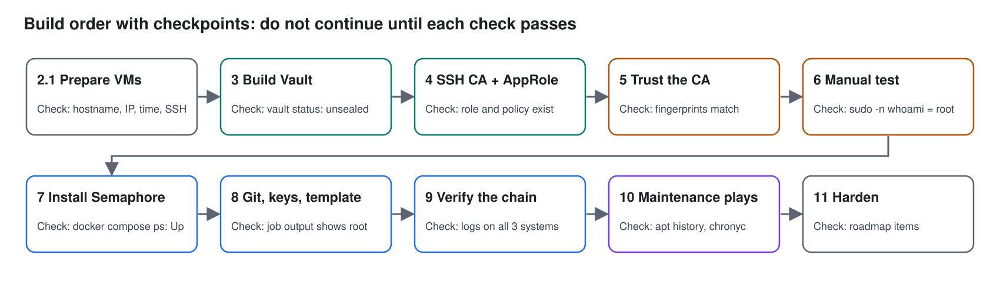
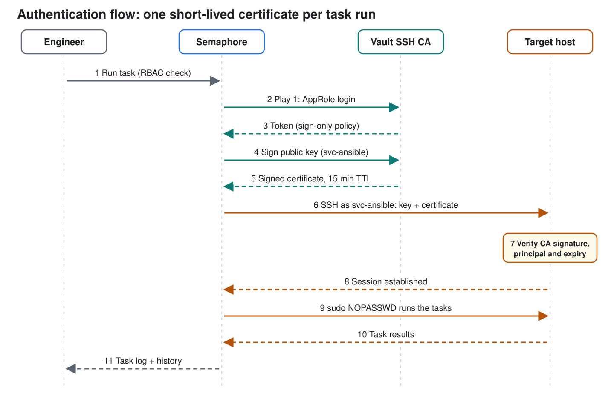
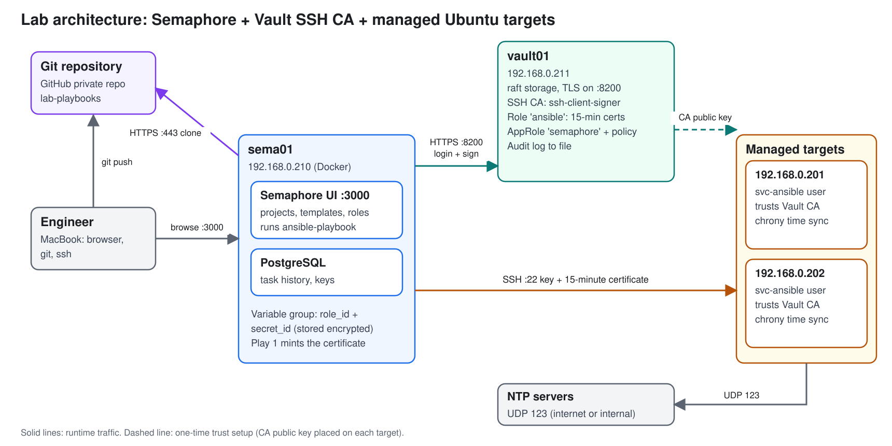

# Chapter 01 · Management Plane: Semaphore UI + HashiCorp Vault + Automation Account

> **01-Ansible · Part I — Management plane & Ansible foundations · Chapter 01 of 30** · ← [All chapters](00-ansible-step-by-step-guide.md) · [Chapter 02 · Control node & Ansible core](02-control-node-and-ansible-core.md) →
>
> Build this first. `sema01` (Semaphore) and `vault01` (Vault) stay **outside** the DGX Spark: they run every playbook of the Spark lab, and they must survive when the Spark is rebuilt or reset. When §9 passes, continue with [Chapter 02](02-control-node-and-ansible-core.md) (MacBook toolchain, inventory), [Chapter 03](03-bare-metal-provisioning-and-bootstrap.md) (bootstrap a fresh DGX OS, or SSH trust for one that's already installed), then [Chapter 04 · DGX Spark as a Semaphore target](04-dgx-spark-as-semaphore-target.md). Overview: [README](README.md).

**Goal:** no human ever holds the automation credential. Every Semaphore task starts by asking Vault for a 15-minute SSH certificate, and the targets trust Vault's CA instead of static keys.

Each step has a **Why** (the purpose), then commands with a comment on every line explaining what it does.

## Build order



Each stage ends with a **Verify** block. Do not move on until it passes. Sections marked "on vault01", "on sema01" or "on each target" tell you where to type the commands.

## 1. Authentication flow



| Hop | Mechanism | Why it matters |
|---|---|---|
| Engineer to Semaphore | Semaphore login and RBAC | Engineers run approved jobs without seeing credentials |
| Semaphore (play 1) to Vault | AppRole (role_id + secret_id) | A machine identity with a policy that can only request certificates |
| Vault to Semaphore | Signed SSH certificate, 15 min TTL | Replaces a permanent SSH key; expires on its own |
| Semaphore to target | SSH certificate auth | Target checks the CA signature, the principal name and the expiry |
| On target | NOPASSWD sudo | Avoids the sudo-rs prompt problem; the controls sit in front of it |

## 2. Lab topology

| Host | Role | Suggested spec | Example IP |
|---|---|---|---|
| vault01 | HashiCorp Vault | Ubuntu 24.04, 2 vCPU, 2 GB | 192.168.0.211 |
| sema01 | Semaphore UI in Docker | Ubuntu 24.04, 2 vCPU, 4 GB, 30 GB disk | 192.168.0.210 |
| 192.168.0.201 / .202 | Managed targets | Existing clients | as is |

Adjust IPs to your network. Use static IPs or DHCP reservations, because certificates and Semaphore credentials reference them.



### 2.1 Prepare vault01, sema01 and the targets

**Why:** certificates and TLS are time-bound and tied to IP addresses, so every machine needs a fixed address, a correct clock and a running SSH service before you install anything. Run this on **each VM** (change the hostname and IP per machine).

```bash
# ▶ vault01 (ssh vault01)
# repeat on sema01 (ssh sema01) with its own hostname and IP
sudo apt update && sudo apt -y upgrade        # refresh package lists, then install updates on the base OS
sudo apt install -y openssh-server curl wget gpg gnupg lsb-release ca-certificates openssl nano   # SSH server plus tools later steps use (apt package names are lowercase)
sudo systemctl enable --now ssh               # start the SSH server now and at every boot
sudo hostnamectl set-hostname vault01         # use sema01 on the Semaphore VM
echo '192.168.0.211 vault01' | sudo tee -a /etc/hosts   # local name-to-IP mapping; use the machine's own IP
sudo timedatectl set-ntp true                 # keep the clock synchronized; certificates fail when clocks drift
```

**Fixed IP address.** The easiest way is a DHCP reservation for each VM's MAC address on your router. Otherwise edit the netplan file (`ls /etc/netplan/`, back it up first) and apply it with `sudo netplan try`, which rolls back automatically after 120 seconds unless you confirm.

**Firewall (ufw).** Always allow SSH first so you don't lock yourself out.

```bash
# ▶ vault01 (ssh vault01)
# repeat on sema01 (ssh sema01); each machine needs only its own port rule
sudo ufw allow OpenSSH                                          # the ufw profile installed with openssh-server
sudo ufw allow from 192.168.0.0/24 to any port 8200 proto tcp   # vault01 only: Vault API and UI, LAN only
sudo ufw allow from 192.168.0.0/24 to any port 3000 proto tcp   # sema01 only: Semaphore web UI, LAN only
sudo ufw enable                                                 # switch the firewall on
sudo ufw status                                                 # list the active rules
```

**Verify section 2.1** (on every VM):

```bash
# ▶ vault01 (ssh vault01)
# repeat on sema01 (ssh sema01)
hostnamectl | grep -i 'static hostname'   # expect the machine's name
ip -br a                                  # expect the fixed IP on your interface
timedatectl | grep -i synchronized        # expect: System clock synchronized: yes
systemctl is-active ssh                   # expect: active
sudo ufw status                           # expect OpenSSH plus the port rule for that machine
curl -sI https://apt.releases.hashicorp.com | head -1   # expect an HTTP status line: the VM has internet access
ping -c 2 192.168.0.201                   # expect replies from each target
```

## 3. Build Vault (on vault01)

**Why:** Vault is the trust anchor. It holds the CA private key, issues certificates, and records every request in an audit log.

**3.1 Install**

```bash
# ▶ vault01 (ssh vault01)
# Download HashiCorp's signing key and convert (--dearmor) to the binary format apt needs
wget -O- https://apt.releases.hashicorp.com/gpg | sudo gpg --dearmor -o /usr/share/keyrings/hashicorp.gpg
# Add HashiCorp's apt repo; signed-by pins it to that key; lsb_release -cs inserts your Ubuntu codename
echo "deb [signed-by=/usr/share/keyrings/hashicorp.gpg] https://apt.releases.hashicorp.com $(lsb_release -cs) main" | sudo tee /etc/apt/sources.list.d/hashicorp.list
# Refresh package lists, then install Vault (also creates the vault user and systemd unit)
sudo apt update && sudo apt install -y vault
```

**3.2 TLS certificate.** Why: Vault carries tokens and secrets, so it must never speak plain HTTP. A self-signed cert is fine in a lab.

```bash
# ▶ vault01 (ssh vault01)
sudo mkdir -p /opt/vault/tls      # folder for the cert and key (no cd: the vault package makes /opt/vault readable only by the vault user)
# req -x509        = create a self-signed certificate directly
# -newkey rsa:4096 = generate a new 4096-bit key at the same time
# -nodes           = leave the key unencrypted so Vault can start unattended
# -days 365        = validity period
# -subj            = certificate subject (CN) without interactive prompts
# -addext SAN      = Subject Alternative Names; modern clients check the IP/DNS here, not the CN
# -addext basicConstraints/keyUsage/extendedKeyUsage = mark it as a server (leaf) certificate; Vault rejects a CA-flagged listener certificate
sudo openssl req -x509 -newkey rsa:4096 -nodes -days 365 \
  -keyout /opt/vault/tls/vault.key -out /opt/vault/tls/vault.crt -subj "/CN=vault01" \
  -addext "subjectAltName=IP:192.168.0.211,DNS:vault01" \
  -addext "basicConstraints=critical,CA:FALSE" \
  -addext "keyUsage=critical,digitalSignature,keyEncipherment" \
  -addext "extendedKeyUsage=serverAuth"
# Let the vault service user read the files
sudo chown vault:vault /opt/vault/tls/vault.key /opt/vault/tls/vault.crt
sudo chmod 600 /opt/vault/tls/vault.key   # private key: readable by its owner only
```

**3.3 Configuration** (`/etc/vault.d/vault.hcl`)

```hcl
disable_mlock = true               # required: Vault refuses to start with raft storage unless this is set explicitly; true suits a lab VM
ui = true                          # enable the web UI
storage "raft" {                   # Vault's built-in storage, no external database needed
  path    = "/opt/vault/data"      # where encrypted data lives on disk
  node_id = "vault01"              # unique name of this node in the raft cluster
}
listener "tcp" {
  address       = "0.0.0.0:8200"   # listen on all interfaces, port 8200 (API and UI)
  tls_cert_file = "/opt/vault/tls/vault.crt"   # certificate from 3.2
  tls_key_file  = "/opt/vault/tls/vault.key"   # its private key
}
api_addr     = "https://192.168.0.211:8200"   # address clients should use to reach Vault
cluster_addr = "https://192.168.0.211:8201"   # address for node-to-node traffic (needed by raft)
```

```bash
# ▶ vault01 (ssh vault01)
sudo mkdir -p /opt/vault/data && sudo chown vault:vault /opt/vault/data  # storage dir owned by vault
sudo systemctl enable --now vault          # start Vault now and at every boot
export VAULT_ADDR=https://192.168.0.211:8200   # tells the vault CLI where the server is
# /opt/vault/tls is private to the vault user, so give your own user a copy of the (public) certificate
sudo cp /opt/vault/tls/vault.crt ~/vault-ca.crt && sudo chown $USER:$USER ~/vault-ca.crt
export VAULT_CACERT=$HOME/vault-ca.crt         # tells the CLI to trust our self-signed cert
```

**3.4 Initialize and unseal.** Why: a new Vault is empty and sealed. Initialization generates the master key and splits it into shares so no single person can open Vault.

```bash
# ▶ vault01 (ssh vault01)
vault operator init -key-shares=3 -key-threshold=2   # create 3 unseal keys; any 2 can unseal; prints a root token
vault operator unseal      # run twice, entering two different unseal keys, until Sealed shows false
vault login                # authenticate the CLI with the Initial Root Token
```

Save the unseal keys and root token securely. In this lab Vault re-seals after every restart; production uses auto-unseal.

**3.5 Audit log.** Why: every request to Vault gets recorded, which is what auditors ask for.

```bash
# ▶ vault01 (ssh vault01)
sudo touch /var/log/vault_audit.log && sudo chown vault:vault /var/log/vault_audit.log  # create file the vault user can write
vault audit enable file file_path=/var/log/vault_audit.log   # turn on the file audit device
```

**Verify section 3** (on vault01):

```bash
# ▶ vault01 (ssh vault01)
vault status                              # expect: Initialized true, Sealed false, Storage Type raft
sudo systemctl is-active vault            # expect: active
sudo openssl x509 -in /opt/vault/tls/vault.crt -noout -ext basicConstraints   # expect: CA:FALSE
sudo tail -n 2 /var/log/vault_audit.log   # expect JSON lines: the audit log records your commands
```

Vault re-seals every time vault01 restarts. After a reboot run `vault operator unseal` twice before anything else.

## 4. Configure the SSH CA and AppRole (on vault01)

**Why:** this defines what Vault will sign (the role), what Semaphore is allowed to do (the policy), and how Semaphore proves who it is (AppRole).

```bash
# ▶ vault01 (ssh vault01)
# Mount the SSH secrets engine at a custom path named ssh-client-signer
vault secrets enable -path=ssh-client-signer ssh
# Have Vault generate the CA key pair; the private half never leaves Vault, the public half is readable
vault write ssh-client-signer/config/ca generate_signing_key=true
```

```bash
# ▶ vault01 (ssh vault01)
# Create a signing role named "ansible" (the JSON is read from stdin via the "-")
vault write ssh-client-signer/roles/ansible - <<'EOF'
{
  "key_type": "ca",
  "algorithm_signer": "rsa-sha2-256",
  "allow_user_certificates": true,
  "allowed_users": "svc-ansible",
  "default_user": "svc-ansible",
  "allowed_extensions": "permit-pty",
  "default_extensions": { "permit-pty": "" },
  "ttl": "15m",
  "max_ttl": "1h"
}
EOF
```

| Role field | Meaning |
|---|---|
| `key_type: ca` | This role signs certificates (as opposed to issuing one-time passwords) |
| `algorithm_signer` | Signature algorithm used on the certificate; `rsa-sha2-256` is accepted by modern OpenSSH |
| `allow_user_certificates` | Issue user certificates (not host certificates) |
| `allowed_users` | Only the principal `svc-ansible` may be requested; blocks asking for `root` |
| `default_user` | Principal used if the requester names none |
| `allowed_extensions` / `default_extensions` | Permit a TTY (`permit-pty`), which sudo and Ansible need |
| `ttl` / `max_ttl` | Default and maximum certificate lifetime: 15 minutes and 1 hour |

```bash
# ▶ vault01 (ssh vault01)
# Policy: the only thing Semaphore may do is request signatures from the ansible role
vault policy write semaphore-ssh - <<'EOF'
path "ssh-client-signer/sign/ansible" {
  capabilities = ["create", "update"]   # signing is a write operation in Vault's API
}
EOF

vault auth enable approle     # enable the AppRole method, designed for machines and applications
# Create an AppRole named semaphore: tokens it receives carry only semaphore-ssh, and expire after 10 minutes
vault write auth/approle/role/semaphore token_policies=semaphore-ssh token_ttl=10m token_max_ttl=30m

vault read -field=role_id auth/approle/role/semaphore/role-id          # role_id: like a username, identifies the role
vault write -f -field=secret_id auth/approle/role/semaphore/secret-id  # secret_id: like a password; -f = write with no data
```

Record the **role_id** and **secret_id** for §8.6.

**Verify section 4** (on vault01):

```bash
# ▶ vault01 (ssh vault01)
vault read ssh-client-signer/roles/ansible      # expect: allowed_users svc-ansible, ttl 15m
vault policy read semaphore-ssh                 # expect: one path, ssh-client-signer/sign/ansible
vault read auth/approle/role/semaphore          # expect: token_policies [semaphore-ssh]
vault write auth/approle/login role_id=<role_id> secret_id=<secret_id>   # expect a client_token; proves the pair works (the token expires in 10 minutes)
```

## 5. Build the automation account and trust the CA (on each target)

**Why:** this is the host side of the trust. `sshd` learns to accept any certificate signed by Vault's CA, and the `svc-ansible` account is what the certificate's principal maps to.

First, on vault01, print the CA public key: `vault read -field=public_key ssh-client-signer/config/ca`. Then on **each target**:

```bash
# ▶ Ubuntu test target (from Chapter 01)
sudo nano /etc/ssh/trusted-user-ca-keys.pem   # paste the CA public key; sshd will trust certificates signed by it

sudo useradd -m -s /bin/bash svc-ansible      # create the account with a home dir (-m) and a shell (-s); no password, so password login is impossible
# Passwordless sudo for this account only; a file in sudoers.d is safer than editing /etc/sudoers
echo 'svc-ansible ALL=(ALL) NOPASSWD:ALL' | sudo tee /etc/sudoers.d/90-svc-ansible
sudo chmod 440 /etc/sudoers.d/90-svc-ansible  # sudo requires read-only permissions on sudoers files
sudo visudo -c                                # syntax check; a broken sudoers file can lock you out of sudo
```

```bash
# ▶ Ubuntu test target (from Chapter 01)
sudo tee /etc/ssh/sshd_config.d/10-vault-ca.conf <<'EOF'
TrustedUserCAKeys /etc/ssh/trusted-user-ca-keys.pem   # accept certificates signed by this CA
Match User svc-ansible                                 # the rules below apply only to this account
    PasswordAuthentication no                          # never allow a password for it
    AuthenticationMethods publickey                    # key or certificate only
EOF
sudo sshd -t && sudo systemctl restart ssh   # test config first (-t); restart only if the test passes
```

Your existing `client01` login is untouched, so you can't lock yourself out.

**Verify section 5.** The pasted CA key must be **one single line that starts with `ssh-rsa`**; a wrapped line is silently ignored by sshd.

```bash
# ▶ vault01 (ssh vault01)
# print the fingerprint of the real CA key
vault read -field=public_key ssh-client-signer/config/ca > ~/ca.pub
ssh-keygen -l -f ~/ca.pub                                  # -l prints key size, SHA256 fingerprint and type
```

```bash
# ▶ Ubuntu test target (from Chapter 01)
# on each target
id svc-ansible                                             # expect a uid line: the account exists
sudo visudo -c                                             # expect "parsed OK" for the sudoers files
sudo sshd -T | grep -i trustedusercakeys                   # expect /etc/ssh/trusted-user-ca-keys.pem: sshd loaded the setting
sudo ssh-keygen -l -f /etc/ssh/trusted-user-ca-keys.pem    # expect the SAME SHA256 fingerprint as on vault01
```

## 6. Test the CA before involving Semaphore (on vault01)

**Why:** this proves Vault and the targets work together. If Semaphore fails later, you know the problem is in Semaphore.

```bash
# ▶ vault01 (ssh vault01)
ssh-keygen -t ed25519 -f ~/semaphore_lab -N ""     # create a key pair; -N "" = no passphrase. This stands in for the key Semaphore will hold
# Ask Vault to sign the PUBLIC key for principal svc-ansible; -field prints only the certificate; @ reads a file
vault write -field=signed_key ssh-client-signer/sign/ansible \
  public_key=@$HOME/semaphore_lab.pub valid_principals=svc-ansible > ~/semaphore_lab-cert.pub
ssh-keygen -L -f ~/semaphore_lab-cert.pub          # -L lists certificate details: principal, validity window, signing CA
# Log in with key + certificate; "sudo -n" means non-interactive, so it fails instead of prompting for a password
ssh -i ~/semaphore_lab -o CertificateFile=~/semaphore_lab-cert.pub svc-ansible@192.168.0.201 'sudo -n whoami'
```

Expected output: `root`. These keys are only for this test; the Semaphore playbook generates its own.

**Verify section 6:** the last command must print `root`. Then confirm the certificate is short-lived: `ssh-keygen -L` should show a validity window of about 15 minutes. After 16 minutes, repeat the `ssh` command with the old certificate. It must be **refused**, which proves credentials expire without cleanup.

## 7. Install Semaphore UI (on sema01)

**Why:** Semaphore UI is a web front end for Ansible with projects, roles, a key store, variable groups and task history. It runs as a Docker container with a PostgreSQL database, so there is no Kubernetes to maintain.

Prepare **sema01** like vault01 (prerequisites: hostname `sema01`, static IP `192.168.0.210`, time sync, updates, `openssh-server`), then open the web port:

```bash
# ▶ sema01 (ssh sema01)
sudo ufw allow from 192.168.0.0/24 to any port 3000 proto tcp   # Semaphore web UI, LAN only
```

**7.1 Install Docker**

```bash
# ▶ sema01 (ssh sema01)
sudo apt update && sudo apt install -y docker.io docker-compose-v2   # container engine and the "docker compose" command
sudo systemctl enable --now docker                                   # start Docker now and at boot
sudo usermod -aG docker $USER                                        # run docker without sudo; log out and back in to apply
newgrp docker   # apply the new group in this terminal now (or log out and back in)
```

**7.2 Bring the Vault CA certificate and test the path to Vault**

```bash
# ▶ sema01 (ssh sema01)
mkdir -p ~/semaphore && cd ~/semaphore
scp vault01@192.168.0.211:~/vault-ca.crt ./vault-ca.crt        # the public certificate copy you made in §3.3
curl --cacert ./vault-ca.crt https://192.168.0.211:8200/v1/sys/health   # JSON output = network and TLS trust work (the Vault status codes are expected)
```

**7.3 Create the secrets file and the compose file**

```bash
# ▶ sema01 (ssh sema01)
# in ~/semaphore (from §7.2)
cat > .env <<EOF
DB_PASS=$(openssl rand -hex 16)
ENC_KEY=$(head -c32 /dev/urandom | base64)
ADMIN_PASS=ChangeMe-Admin-2026
EOF
chmod 600 .env
cat .env
```

What this does: `cat > .env <<EOF` writes everything up to the line `EOF` into a new file named `.env`. Because `EOF` is **unquoted**, the shell runs the `$(...)` parts and stores random values: `openssl rand -hex 16` makes a database password, and `head -c32 /dev/urandom | base64` makes the 32-byte key Semaphore uses to encrypt stored secrets. Change `ADMIN_PASS` (your web login) before running it, and avoid the `$` character, because Docker Compose treats `$name` as a variable. `chmod 600` makes the file readable only by you. Back up `.env`: without `ENC_KEY`, Semaphore cannot decrypt what it stored. Set the values before the first `docker compose up`, because PostgreSQL fixes its password on first start.

```bash
# ▶ sema01 (ssh sema01)
# in ~/semaphore
cat > docker-compose.yml <<'EOF'
services:
  postgres:
    image: postgres:16
    restart: unless-stopped
    environment:
      POSTGRES_USER: semaphore
      POSTGRES_PASSWORD: ${DB_PASS}          # read from .env
      POSTGRES_DB: semaphore
    volumes:
      - pgdata:/var/lib/postgresql/data      # keep the database across restarts
  semaphore:
    image: semaphoreui/semaphore:latest      # fine for a lab; pin a version tag in production
    restart: unless-stopped
    ports: ["3000:3000"]
    depends_on: [postgres]
    environment:
      SEMAPHORE_DB_DIALECT: postgres
      SEMAPHORE_DB_HOST: postgres
      SEMAPHORE_DB_PORT: "5432"
      SEMAPHORE_DB_USER: semaphore
      SEMAPHORE_DB_PASS: ${DB_PASS}
      SEMAPHORE_DB: semaphore
      SEMAPHORE_PLAYBOOK_PATH: /tmp/semaphore/
      SEMAPHORE_ACCESS_KEY_ENCRYPTION: ${ENC_KEY}
      SEMAPHORE_ADMIN: admin                  # first admin account
      SEMAPHORE_ADMIN_NAME: Admin
      SEMAPHORE_ADMIN_EMAIL: admin@lab.local
      SEMAPHORE_ADMIN_PASSWORD: ${ADMIN_PASS}
    volumes:
      - ./vault-ca.crt:/etc/semaphore/vault-ca.crt:ro   # lets playbooks trust Vault's certificate
volumes:
  pgdata:
EOF
docker compose up -d              # start both containers in the background
docker compose logs -f semaphore  # watch startup; Ctrl+C when it reports it is listening on port 3000
```

**Semaphore UI:** log in at `http://192.168.0.210:3000` as `admin` with your `ADMIN_PASS`.

**Verify section 7** (on sema01, in `~/semaphore`):

```bash
# ▶ sema01 (ssh sema01)
# in ~/semaphore
docker compose ps                          # expect: postgres and semaphore both "Up"
docker compose logs --tail 20 semaphore    # expect no errors and a line saying it listens on port 3000
curl -sI http://localhost:3000 | head -1   # expect an HTTP 200 or 302 status line
```

Then, in the **Semaphore UI**, open `http://192.168.0.210:3000` from your Mac (plain **http**, not https) and sign in as `admin`. If the page does not load, see the troubleshooting table in section 12.

## 8. Git repository, keys and Semaphore configuration

**Why:** Semaphore runs playbooks from a Git repository, so the code is versioned and reviewable. It needs a credential to read a private repository, and it needs the Vault AppRole values to start each run. This section creates everything in order: repository, token, playbooks, project, key, variable group, repository entry, inventory and template. Menu names can differ slightly between Semaphore versions.

### 8.1 Create a private repository on GitHub
1. Sign in at github.com, click **+** at the top right, then **New repository**.
2. Repository name: `lab-playbooks`. Visibility: **Private**. Leave "Add a README" unticked.
3. Click **Create repository**. (A Gitea server in your lab works the same way: use its HTTP URL and an access token.)

### 8.2 Create a read-only token for Semaphore
1. GitHub: profile picture, **Settings**, **Developer settings**, **Personal access tokens**, **Fine-grained tokens**, **Generate new token**.
2. Name `semaphore-readonly`, expiration 90 days, Repository access **Only select repositories**, then choose `lab-playbooks`.
3. Under Repository permissions set **Contents** to **Read-only**. Leave everything else at No access.
4. Click **Generate token** and copy it immediately; GitHub shows it only once. Put the expiry date in your calendar.

### 8.3 Create the playbooks and push them (on your Mac)
The repository needs these files under `playbooks/`. The first two are below; the other two come in section 10. `00-vault-cert.yaml` is the play every other playbook imports to obtain the certificate.

```yaml
# playbooks/00-vault-cert.yaml  (play 1: get a short-lived certificate)
- name: Get an SSH certificate from Vault
  hosts: localhost                 # runs inside the Semaphore container, not on the targets
  connection: local
  gather_facts: false
  check_mode: false                # these tasks must really run, even in a dry run
  vars:
    vault_addr: https://192.168.0.211:8200
    vault_cacert: /etc/semaphore/vault-ca.crt    # the mounted CA file from §7.3
    key_dir: /tmp/lab_ssh
  tasks:
    - name: Create the key directory
      ansible.builtin.file: { path: "{{ key_dir }}", state: directory, mode: "0700" }
    - name: Generate the SSH key pair once
      ansible.builtin.command: ssh-keygen -t ed25519 -N "" -f {{ key_dir }}/id_ed25519
      args: { creates: "{{ key_dir }}/id_ed25519" }       # skipped if the key already exists
    - name: Read the public key
      ansible.builtin.slurp: { src: "{{ key_dir }}/id_ed25519.pub" }
      register: pubkey
    - name: Log in to Vault with AppRole
      ansible.builtin.uri:
        url: "{{ vault_addr }}/v1/auth/approle/login"
        method: POST
        body_format: json
        body: { role_id: "{{ vault_role_id }}", secret_id: "{{ vault_secret_id }}" }
        ca_path: "{{ vault_cacert }}"
      register: login
      no_log: true                 # keep the secret_id and token out of the task log
    - name: Ask Vault to sign the public key
      ansible.builtin.uri:
        url: "{{ vault_addr }}/v1/ssh-client-signer/sign/ansible"
        method: POST
        headers: { X-Vault-Token: "{{ login.json.auth.client_token }}" }
        body_format: json
        body: { public_key: "{{ pubkey.content | b64decode }}", valid_principals: svc-ansible }
        ca_path: "{{ vault_cacert }}"
      register: signed
      no_log: true
    - name: Save the certificate next to the key
      ansible.builtin.copy:
        content: "{{ signed.json.data.signed_key }}"
        dest: "{{ key_dir }}/id_ed25519-cert.pub"    # ssh automatically uses "<key>-cert.pub"
        mode: "0644"
      no_log: true
```

```yaml
# playbooks/whoami.yaml
# Smallest end-to-end test: get a certificate (play 1), log in, escalate with sudo, report the user.
- import_playbook: 00-vault-cert.yaml
- hosts: lab
  become: true
  tasks:
    - name: Who am I after sudo
      ansible.builtin.command: whoami
      register: who
      changed_when: false
    - ansible.builtin.debug:
        var: who.stdout
```

```bash
# ▶ MacBook · any folder
mkdir -p ~/lab-playbooks/playbooks && cd ~/lab-playbooks   # work folder; -p also creates the parent folders
# save the two files above as playbooks/00-vault-cert.yaml and playbooks/whoami.yaml
git init -b main                  # turn the folder into a Git repository with a branch named main
git add .                         # stage every file for the next commit
git commit -m "Initial playbooks" # record a snapshot of the staged files
git remote add origin https://github.com/<your-user>/lab-playbooks.git   # tell Git where the GitHub repository is
git push -u origin main           # upload; -u remembers origin/main so later pushes need only "git push"
```

Pushing uses **your own** GitHub sign-in (for example `gh auth login`, or a separate token with write access). The read-only token from 8.2 is only for Semaphore.

**Verify 8.3:**

```bash
# ▶ MacBook · any folder
# in ~/lab-playbooks (the folder from the block above)
git log --oneline     # expect one commit
git ls-files          # expect playbooks/00-vault-cert.yaml and playbooks/whoami.yaml
```

Then refresh the repository page on GitHub: the `playbooks` folder must be visible.

### 8.4 Create the project in Semaphore
**Semaphore UI:** open `http://192.168.0.210:3000`, sign in as `admin`, click **New Project**, name it `lab`, and create it. Everything below happens inside this project.

### 8.5 Store the GitHub token as a key
**Semaphore UI:** project `lab`, **Key Store**, **New Key**: Name `github-token`, Type **Login with password**, Login = your GitHub username, Password = the token from 8.2, **Save**. Semaphore encrypts it with the `ENC_KEY` from your `.env` file.

*Stronger alternative, an SSH deploy key (read-only, valid for one repository only):*

```bash
# ▶ MacBook · any folder
ssh-keygen -t ed25519 -f ~/semaphore_deploy -N "" -C "semaphore-deploy"   # new key pair, no passphrase
cat ~/semaphore_deploy.pub     # public half: add it in GitHub, repository Settings, Deploy keys, leave "Allow write access" unticked
cat ~/semaphore_deploy         # private half: Semaphore Key Store, New Key, Type SSH Key, name github-deploy
rm ~/semaphore_deploy          # delete the local private key once Semaphore holds it
```

With a deploy key, use the URL `git@github.com:<your-user>/lab-playbooks.git` in 8.7 and select `github-deploy` as the access key.

### 8.6 Create the variable group (the AppRole values)
On vault01 print the two values:

```bash
# ▶ vault01 (ssh vault01)
vault read -field=role_id auth/approle/role/semaphore/role-id            # the role_id: the AppRole's "username"
vault write -f -field=secret_id auth/approle/role/semaphore/secret-id    # a NEW secret_id on every run: the AppRole's "password"
```

**Semaphore UI:** **Variable Groups** (called **Environment** in some versions), **New**:
1. Name `vault-approle`.
2. Extra variables (JSON): `{"vault_role_id": "PASTE-THE-ROLE-ID"}`.
3. Secrets, **Add secret**: type **Variable**, name `vault_secret_id`, value = the secret_id. Secret values are stored encrypted and are hidden after saving.
4. **Save**.

### 8.7 Add the repository
**Semaphore UI:** **Repositories**, **New**: Name `lab-playbooks`, URL `https://github.com/<your-user>/lab-playbooks.git`, Branch `main`, Access Key `github-token`, **Save**.

### 8.8 Add the inventory
**Semaphore UI:** **Inventory**, **New**: Name `lab-hosts`, type **Static**, User Credentials `None` (the playbook supplies the key), content:

```ini
[lab]
192.168.0.201
192.168.0.202

[lab:vars]
ansible_user=svc-ansible
ansible_ssh_private_key_file=/tmp/lab_ssh/id_ed25519
ansible_ssh_common_args='-o StrictHostKeyChecking=accept-new'
ansible_python_interpreter=/usr/bin/python3
```

What the variables do: `ansible_user` is the automation account, `ansible_ssh_private_key_file` is the key that play 1 creates (ssh automatically uses the `-cert.pub` file next to it), `StrictHostKeyChecking=accept-new` accepts a host key the first time you see it, and the interpreter line pins Python so Ansible never re-discovers it.

### 8.9 Create the task template
**Semaphore UI:** **Task Templates**, **New Template**, type **Ansible Playbook**:

| Field | Value |
|---|---|
| Name | `whoami-lab` |
| Playbook filename | `playbooks/whoami.yaml` |
| Inventory | `lab-hosts` |
| Repository | `lab-playbooks` |
| Variable group (Environment) | `vault-approle` |

Save, then click **Run**.

### 8.10 Verify the first run
**Semaphore UI:** the task log must show two plays: **Get an SSH certificate from Vault** (steps `ok`, secret tasks hidden) and the second play with `who.stdout: root` for both IPs, ending in `failed=0`. Then confirm on all three systems:

```bash
# ▶ Ubuntu test target (from Chapter 01)
sudo journalctl -u ssh --since "10 minutes ago" | grep svc-ansible   # expect "Accepted publickey ... ED25519-CERT"
```

```bash
# ▶ vault01 (ssh vault01)
sudo grep -c 'sign/ansible' /var/log/vault_audit.log                 # the count grows with each task run
```

```bash
# ▶ sema01 (ssh sema01)
# in ~/semaphore
docker compose exec semaphore ssh-keygen -L -f /tmp/lab_ssh/id_ed25519-cert.pub   # principal svc-ansible, validity about 15 minutes
```

## 9. Verify the full chain

| Where | What to check | What it proves |
|---|---|---|
| Semaphore task log | Play 1 succeeds (secret tasks show as hidden), then `who.stdout: root` on both hosts | The full chain works |
| Target: `sudo journalctl -u ssh \| grep svc-ansible` | `Accepted publickey ... ED25519-CERT ... ID ...` | Login used a certificate, not a plain key |
| Vault: `sudo tail /var/log/vault_audit.log` | AppRole login and `sign/ansible` entries per task run | Every certificate request is recorded |
| sema01: `docker compose exec semaphore ssh-keygen -L -f /tmp/lab_ssh/id_ed25519-cert.pub` | Validity window of about 15 minutes | Short-lived credential |
| Expiry test | After 16 minutes, `docker compose exec semaphore ssh -i /tmp/lab_ssh/id_ed25519 svc-ansible@192.168.0.201 true` is refused, while a new task run succeeds | Credentials expire without cleanup |

## 10. Maintenance playbooks: OS updates and time sync

**Why:** once the chain works, every operational task is just another template that imports the same certificate play. For each file below: save it in `playbooks/` in your repository, run `git add . && git commit -m "add playbook" && git push` (on your Mac, in `~/lab-playbooks`), then create a template as in 8.9 (same inventory, repository and variable group) with the matching playbook path. Run each one as a **dry run** first if your Semaphore version offers it; it uses `--check` and changes nothing.

### 10.1 update_ubuntu.yaml (rolling OS updates)

```yaml
# playbooks/update_ubuntu.yaml
# Rolling OS update for the Ubuntu targets, using the Vault-issued SSH certificate.
- import_playbook: 00-vault-cert.yaml          # play 1: get a 15-minute certificate from Vault

- name: Update Ubuntu targets
  hosts: lab
  become: true
  serial: 1                                     # one host at a time, so a bad update never hits every host
  max_fail_percentage: 0                        # stop the rollout as soon as one host fails
  vars:
    apt_upgrade_mode: safe                      # safe = like "apt upgrade"; dist = like "apt full-upgrade" (may add or remove packages)
    allow_reboot: false                         # pass allow_reboot=true as an extra variable to reboot when Ubuntu asks for it
    min_free_root_mb: 1024                      # refuse to start with less free space than this on /

  pre_tasks:
    - name: Make sure this is Ubuntu
      ansible.builtin.assert:
        that: ansible_facts['distribution'] == 'Ubuntu'
        fail_msg: "{{ inventory_hostname }} is not Ubuntu; stopping instead of guessing"

    - name: Make sure there is enough free space on /
      ansible.builtin.assert:
        that: >-
          (ansible_facts['mounts'] | selectattr('mount', 'equalto', '/')
           | map(attribute='size_available') | first) > (min_free_root_mb * 1048576)
        fail_msg: "Less than {{ min_free_root_mb }} MB free on / of {{ inventory_hostname }}"

  tasks:
    - name: Refresh the package index
      ansible.builtin.apt:
        update_cache: true
        cache_valid_time: 3600                  # skip if refreshed within the last hour
        lock_timeout: 120                       # wait if another apt process is running

    - name: Install available updates
      ansible.builtin.apt:
        upgrade: "{{ apt_upgrade_mode }}"
        lock_timeout: 300
      register: upgrade

    - name: Remove unneeded packages and old downloads
      ansible.builtin.apt:
        autoremove: true
        autoclean: true
        lock_timeout: 120

    - name: Check whether Ubuntu wants a reboot
      ansible.builtin.stat:
        path: /var/run/reboot-required
      register: reboot_flag

    - name: Reboot and wait for the host to return
      ansible.builtin.reboot:
        reboot_timeout: 900
        msg: "Reboot started by Ansible after OS updates"
      when: reboot_flag.stat.exists and (allow_reboot | bool)

    - name: Summary for this host
      ansible.builtin.debug:
        msg: >-
          {{ inventory_hostname }}: packages changed = {{ upgrade.changed }},
          reboot needed = {{ reboot_flag.stat.exists }},
          rebooted = {{ reboot_flag.stat.exists and (allow_reboot | bool) }}
```

| Extra variable | Default | Effect |
|---|---|---|
| `allow_reboot` | `false` | `true` reboots a host when Ubuntu asks for it |
| `apt_upgrade_mode` | `safe` | `dist` behaves like `apt full-upgrade` |
| `min_free_root_mb` | `1024` | refuse to start with less free space on `/` |

**Verify 10.1** (on a target):

```bash
# ▶ Ubuntu test target (from Chapter 01)
grep -E 'Start-Date|Requested-By|^Upgrade:' /var/log/apt/history.log   # when it ran, as which user (svc-ansible) and which packages changed
apt list --upgradable 2>/dev/null          # expect an empty list after a full update
ls /var/run/reboot-required                # exists only when a reboot is still pending
uname -r; uptime -s                        # running kernel and last boot time
```

### 10.2 sync_time.yaml (time zone and NTP)

```yaml
# playbooks/sync_time.yaml
# Set the timezone and keep each target's clock in sync with NTP.
# Works with chrony or systemd-timesyncd, whichever the host already runs.
- import_playbook: 00-vault-cert.yaml          # play 1: get a 15-minute certificate from Vault

- name: Configure time zone and NTP on Ubuntu targets
  hosts: lab
  become: true
  vars:
    timezone: America/New_York                  # IANA zone name; list them with: timedatectl list-timezones
    ntp_servers:                                # use your internal NTP servers in an enterprise network
      - ntp.ubuntu.com
      - time.cloudflare.com

  pre_tasks:
    - name: Check whether chrony is the active time service
      ansible.builtin.command: systemctl is-active chrony
      register: chrony_state
      changed_when: false
      failed_when: false
      check_mode: false

    - name: Decide which time service this host uses
      ansible.builtin.set_fact:
        time_daemon: "{{ 'chrony' if chrony_state.stdout == 'active' else 'timesyncd' }}"

  tasks:
    - name: Read the current time zone
      ansible.builtin.command: timedatectl show -p Timezone --value
      register: current_tz
      changed_when: false
      check_mode: false

    - name: Set the time zone
      ansible.builtin.command: timedatectl set-timezone {{ timezone }}
      when: current_tz.stdout != timezone       # only act (and report "changed") when it differs

    # ---------- hosts running chrony ----------
    - name: Configure NTP servers for chrony
      when: time_daemon == 'chrony'
      block:
        - name: Make sure chrony reads extra source files from /etc/chrony/sources.d
          ansible.builtin.lineinfile:
            path: /etc/chrony/chrony.conf
            regexp: '^\s*sourcedir\s+/etc/chrony/sources\.d/?\s*$'   # matches the line however it is spaced, so it is never added twice
            line: sourcedir /etc/chrony/sources.d
            backup: true                                                # keeps a timestamped copy before the first change
          notify: Restart chrony

        - name: Make sure the sources.d directory exists
          ansible.builtin.file:
            path: /etc/chrony/sources.d
            state: directory
            mode: "0755"

        - name: Write the lab NTP sources
          ansible.builtin.copy:
            dest: /etc/chrony/sources.d/lab.sources    # added alongside the default Ubuntu sources
            mode: "0644"
            content: "server {{ s }} iburst\n"
          notify: Restart chrony

        - name: Make sure chrony is enabled and running
          ansible.builtin.systemd:
            name: chrony
            enabled: true
            state: started

    # ---------- hosts running systemd-timesyncd ----------
    - name: Configure NTP servers for systemd-timesyncd
      when: time_daemon == 'timesyncd'
      block:
        - name: Make sure the timesyncd drop-in directory exists
          ansible.builtin.file:
            path: /etc/systemd/timesyncd.conf.d
            state: directory
            mode: "0755"

        - name: Write the lab NTP servers
          ansible.builtin.copy:
            dest: /etc/systemd/timesyncd.conf.d/10-lab.conf
            mode: "0644"
            content: |
              [Time]
              NTP={{ ntp_servers | join(' ') }}
          notify: Restart timesyncd

        - name: Make sure timesyncd is enabled and running
          ansible.builtin.systemd:
            name: systemd-timesyncd
            enabled: true
            state: started

        - name: Switch NTP synchronization on
          ansible.builtin.command: timedatectl set-ntp true
          changed_when: false

    - name: Apply pending service changes now, before checking the clock
      ansible.builtin.meta: flush_handlers

    - name: Wait until chrony reports the clock is synchronized
      ansible.builtin.command: chronyc waitsync 12 0 0 10     # up to 12 tries, 10 seconds apart
      changed_when: false
      check_mode: false
      when: time_daemon == 'chrony' and not ansible_check_mode

    - name: Wait until timesyncd reports the clock is synchronized
      ansible.builtin.command: timedatectl show -p NTPSynchronized --value
      register: synced
      until: synced.stdout == 'yes'
      retries: 12
      delay: 10
      changed_when: false
      check_mode: false
      when: time_daemon == 'timesyncd' and not ansible_check_mode

    - name: Collect the final time settings
      ansible.builtin.command: timedatectl
      register: time_status
      changed_when: false
      check_mode: false

    - name: Show them
      ansible.builtin.debug:
        msg: "{{ inventory_hostname }} uses {{ time_daemon }}: {{ time_status.stdout_lines }}"

  handlers:
    - name: Restart chrony
      ansible.builtin.systemd:
        name: chrony
        state: restarted
    - name: Restart timesyncd
      ansible.builtin.systemd:
        name: systemd-timesyncd
        state: restarted
```

Variables: `timezone` (default `America/New_York`) and `ntp_servers` (use your internal NTP servers in an enterprise network). Targets need outbound UDP 123 to their NTP servers.

**Verify 10.2** (on a target):

```bash
# ▶ Ubuntu test target (from Chapter 01)
timedatectl                    # expect your time zone and "System clock synchronized: yes"
chronyc tracking               # chrony hosts: "Leap status: Normal" and a small offset
chronyc sources -v             # your servers are listed
```

## 11. Enterprise hardening and target architecture

The core pattern (a CA, a signing policy scoped to one role, a non-human account, audit logging) is production-grade. The items below are what a design review would still ask for.

| Area | Lab today | Enterprise target |
|---|---|---|
| Who can mint certificates | The AppRole login is inside a playbook, so anyone who can edit the repository can read the secret_id | Move signing to Vault Agent or a signing service on the runner; protected branches and mandatory code review |
| Secret zero | A static secret_id in a variable group | Wrapped single-use secret_id, or platform identity (cloud IAM, Kubernetes, SPIFFE); at minimum `secret_id_ttl`, `secret_id_num_uses` and `secret_id_bound_cidrs=192.168.0.210/32` |
| Certificate binding | Any host can use a stolen certificate for 15 minutes | Add `source-address` as a critical option and put the requesting user and task ID in the key ID |
| Vault availability | Single node, manual unseal | 3 to 5 node raft cluster, auto-unseal, automated snapshots, tested restores |
| Vault admin access | Root token | Revoke the root token; named admins through OIDC or LDAP with MFA; break-glass procedure |
| TLS | Self-signed certificate | Internal PKI with automated renewal |
| Privileges | `NOPASSWD:ALL` for one account | Several roles and principals mapped to scoped sudo rules, sudo I/O logging, approval gate for production |
| Trust anchor | One CA for everything | One CA per environment, with CA rotation using overlapping trusted keys |
| Platform | One Semaphore container and one Postgres | HA database, runners per environment, SSO with AD groups, pinned and scanned images, HTTPS through a reverse proxy |
| Network | Flat LAN | Management VLAN; runner to targets on port 22 only; runner to Vault on 8200 only; humans through a bastion |
| Observability | One audit file | Two audit devices forwarded to the SIEM; alerts on root token use, failed AppRole logins and off-hours signing |
| Build and change | Hand-typed commands | Vault configuration in Terraform, golden images (Packer or cloud-init), CI with `ansible-lint`, ITSM ticket gating |

Also check whether your network gear (Nexus, IOS XE) accepts OpenSSH user certificates; if not, use TACACS+ with a Vault-rotated account for those devices.

## 12. Troubleshooting

| Symptom | Cause | Fix |
|---|---|---|
| `Unable to locate package OpenSSH` | The package is called `openssh-server` (lowercase) | `sudo apt install -y openssh-server` |
| Vault fails: `disable_mlock must be configured` | Newer Vault requires the setting with raft storage | Add `disable_mlock = true` as the first line of `vault.hcl` |
| Vault fails: `No leaf certificates detected` | The certificate was created as a CA | Regenerate it with the `CA:FALSE` extensions from §3.2 |
| `permission denied` on `/opt/vault/tls/vault.crt` | The folder belongs to the vault user | Use the copy in your home directory: `export VAULT_CACERT=$HOME/vault-ca.crt` |
| `permission denied` on the Docker socket | Your session does not have the docker group yet | Run `newgrp docker`, or log out and back in |
| `The "x" variable is not set` when running compose | A `$` inside a value in `.env` | Remove the `$` from the password, or wrap the value in single quotes |
| Semaphore page does not load | The firewall blocks port 3000, or the containers are stopped | `sudo ufw allow from 192.168.0.0/24 to any port 3000 proto tcp`; check `docker compose ps`; use http, not https |
| `Timeout waiting for privilege escalation prompt` | sudo asks for a password that Ansible cannot supply | Confirm `/etc/sudoers.d/90-svc-ansible` has NOPASSWD, then test `sudo -n true` as svc-ansible |
| Login refused although the certificate looks valid | Clock difference between hosts, or the certificate expired | Fix time sync (section 10.2); run the task again to get a fresh certificate |
| `A worker was found in a dead state` | Out of memory on sema01 | Give the VM 4 GB or more, add swap, lower Ansible forks, and never run two tasks at once |
| Time playbook stops: chrony or timesyncd | The host runs the other time service | The current `sync_time.yaml` handles both; make sure your repository has the latest version |
| Vault commands fail after a reboot | Vault is sealed again | `vault operator unseal` twice with two different keys |

## 13. Next: add the DGX Spark

Your management plane now works for the two Ubuntu targets. The DGX Spark becomes the next target, with the same CA, the same `svc-ansible` account and the same play 1, so nothing in this guide changes:

| You keep | The Spark lab adds (Chapter 04) |
|---|---|
| `vault01`: SSH CA, role `ansible`, AppRole `semaphore`, audit log | a KV engine and a read-only policy for lab secrets, attached to AppRole `semaphore` |
| `sema01`: Semaphore + PostgreSQL, project `lab` | a lab image with `kubectl`/`helm`, a state volume, and a second project `spark-lab` for this repository |
| targets 192.168.0.201 / .202 | `dgx-spark-1` (192.168.0.100) as a third target, prepared by `playbooks/04.1-semaphore-target.yml` |

Continue with [Chapter 02](02-control-node-and-ansible-core.md) (MacBook toolchain, inventory), [Chapter 03](03-bare-metal-provisioning-and-bootstrap.md) (bootstrap or SSH trust), then [Chapter 04 · DGX Spark as a Semaphore target](04-dgx-spark-as-semaphore-target.md).

