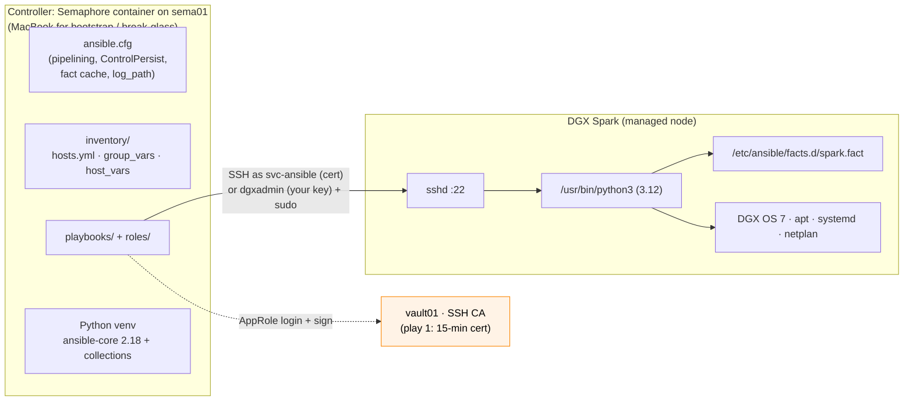
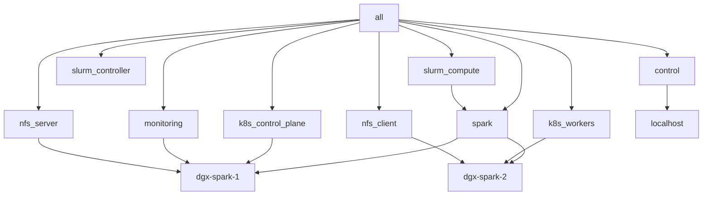

# Chapter 02 · Control Node & Ansible Core: Toolchain, Login Model & Inventory

> **01-Ansible · Part I — Management plane & Ansible foundations · Chapter 02 of 30** · ← [Chapter 01 · Management plane: Semaphore & Vault](01-management-plane-semaphore-and-vault.md) · [All chapters](00-ansible-step-by-step-guide.md) · [Chapter 03 · Bare-metal provisioning & bootstrap](03-bare-metal-provisioning-and-bootstrap.md) →
>
> Lab code: [`lab/`](lab/).

| | |
|---|---|
| **You will build** | A reproducible Ansible toolchain on your MacBook (bootstrap and break-glass), its `ansible.cfg`, and an inventory that describes your Spark(s) and how the controller logs in. Everything is checked offline: this chapter never touches the Spark |
| **Hardware** | Your MacBook only. The DGX Spark first gets touched in [Chapter 03](03-bare-metal-provisioning-and-bootstrap.md); the management plane from [Chapter 01](01-management-plane-semaphore-and-vault.md) (`sema01` + `vault01`) is not needed here |
| **Time** | 30–45 min |
| **Risk** | None: nothing leaves the MacBook |

---

## 1. Why Ansible on a single desktop box?

A DGX Spark looks like a workstation, but you'll treat it like a data-centre node: it runs DGX OS (Ubuntu 24.04 based, aarch64), a GB10 Grace Blackwell superchip (20 Arm cores + Blackwell GPU sharing **128 GB of coherent unified LPDDR5x memory**), a ConnectX-7 NIC with two 200 Gb/s QSFP cages, and eventually a kubeadm Kubernetes cluster (with two vClusters inside it), Slurm and a monitoring stack. The automation itself lives outside the box: Semaphore on `sema01` runs the playbooks and Vault on `vault01` signs a 15-minute SSH certificate for each run ([Chapter 01](01-management-plane-semaphore-and-vault.md), [Chapter 04](04-dgx-spark-as-semaphore-target.md)). Ansible gives you:

- **Rebuild in minutes after a re-image or a bad DGX OS update.** The playbooks describe the machine, so recovery doesn't depend on remembering what you changed.
- **Moving from one Spark to two (or four) is a one-line inventory change.** You don't have to repeat every manual step on the new node.
- **Drift detection:** `--check --diff` shows what changed behind your back (Chapter 26).
- **The same muscle memory you'll use on DGX/HGX clusters.** Only the inventory gets bigger.

---

## 2. Architecture

### 2.1 High-level design (HLD)



Ansible is **agentless**. Nothing runs on the Spark between plays. Each task is a small Python program that is shipped over SSH, run by `/usr/bin/python3`, and returns JSON.

### 2.2 Low-level design (LLD)

| Item | Value in this lab | Why |
|---|---|---|
| Managed-node user | `svc-ansible` with a 15-minute vault01 certificate under Semaphore; `dgxadmin` (same on every Spark, your own key) for bootstrap and break-glass | `group_vars/spark.yml` switches on `vault_role_id` (§3.2). NVIDIA's multi-Spark playbooks and MPI assume identical usernames, which both accounts are |
| Privilege | `become: true` via `sudo` (group_vars/spark.yml); NOPASSWD for `svc-ansible`, `-K` for `dgxadmin` | Everything we configure is root-owned |
| Python on target | `/usr/bin/python3` pinned in `ansible.cfg` | Avoids interpreter discovery warnings; DGX OS ships 3.12 |
| Mgmt network | `enP7s7` 10GbE, `192.168.0.0/24` | Ansible/SSH traffic never rides the CX-7 fabric |
| Fabric | CX-7 `enp1s0f1np1` / `enP2p1s0f1np1`, `192.168.100/101.0/24` | Workload traffic only (NCCL, NFS/RDMA, Multus `net1` for RDMA pods); the Kubernetes API and Cilium VXLAN stay on mgmt |
| Fact cache | `jsonfile` in the state folder `facts/`, 2 h | Ad-hoc runs and drift reports reuse facts |
| Run log | `ansible.log` in the state folder | Free audit trail (Chapter 27), next to Semaphore's task history |
| State folder (`lab_cache_dir`) | `/opt/spark-lab/cache` on sema01 (`SPARK_LAB_CACHE`), `lab/.cache` on the MacBook | Semaphore's checkout is temporary; kubeconfigs and reports must survive it (Chapter 04 §4) |

**Inventory model:** one *hardware* group (`spark`) plus *functional* groups (`k8s_control_plane`, `k8s_workers`, `slurm_compute`, `monitoring`…). A host can belong to several. Roles target functional groups, so moving the monitoring stack to another box is an inventory edit, not a code change. `sema01` and `vault01` are deliberately **not** in the inventory: they are the management plane, built by hand (Chapter 01), and no lab playbook configures them.



**Variable precedence you'll actually use** (low → high):
`role defaults` → `inventory group_vars/all` → `group_vars/<group>` → `host_vars/<host>` → play `vars` → `-e extra vars`.
Rule of thumb: **hardware facts in `group_vars/spark.yml`, per-box addressing in `host_vars`, knobs in role `defaults`, one-off overrides with `-e`.**

---

## 3. Hands-on lab

### 3.1 Build the MacBook toolchain

The lab has two controllers that run the same repository. **Semaphore** on `sema01` runs every playbook once [Chapter 04](04-dgx-spark-as-semaphore-target.md) is done; its container image (kubectl, helm, Python libraries, collections) comes from [`lab/semaphore/`](lab/semaphore/) and is built in [Chapter 04 §4](04-dgx-spark-as-semaphore-target.md). Your **MacBook** needs its own toolchain for the bootstrap playbooks (`03.1-bootstrap.yml`, `04.1-semaphore-target.yml`), `17.1-vault.yml`, and break-glass runs:

```bash
# macOS (or any Linux/WSL box) with Python ≥ 3.11
git clone https://github.com/cloudone365/technical-depth.git
cd "technical-depth/01-Ansible/lab"
python3 -m venv ~/.venvs/spark-ansible
source ~/.venvs/spark-ansible/bin/activate
pip install -r requirements.txt
ansible-galaxy collection install -r requirements.yml -p ./collections
ansible --version        # expect: core 2.18.x, config file = .../lab/ansible.cfg
```

Prove the toolchain before you touch any hardware. `tests/run-local-checks.sh` runs everything CI runs that doesn't need a Spark (yamllint, syntax checks, ansible-lint, the Jinja katas, fixture tests):

```bash
tests/run-local-checks.sh        # expect, as the last line: ALL LOCAL CHECKS PASSED
```

> **Why not use the Spark as its own controller?** `19.2-reset-kubernetes.yml` and a DGX OS re-image delete everything on the box, including a controller running there. Keeping Semaphore and Vault outside, like out-of-band management in a data centre, is what lets the Spark break freely ([Chapter 04 §1](04-dgx-spark-as-semaphore-target.md)).

In Semaphore, `ANSIBLE_CONFIG="01-Ansible/lab/ansible.cfg"` points at the same file, and the environment variables of the Semaphore container (`SPARK_LAB_CACHE`, `ANSIBLE_LOG_PATH`, `ANSIBLE_CACHE_PLUGIN_CONNECTION`) move the run log and fact cache from `./.cache` to the state volume.

```ini
# lab/ansible.cfg
# ansible.cfg — DGX Spark lab control-node configuration
# Every setting here is explained in Chapter 02 (core) and Chapter 09 (performance).
[defaults]
inventory               = ./inventory
inventory_plugins       = ./inventory_plugins
roles_path              = ./roles
collections_path        = ./collections:~/.ansible/collections
remote_user             = dgxadmin
forks                   = 10
interpreter_python      = /usr/bin/python3
host_key_checking       = True
retry_files_enabled     = False
stdout_callback         = ansible.builtin.default
callback_result_format  = yaml
callbacks_enabled       = ansible.posix.profile_tasks, ansible.posix.timer
# Fact cache: lets ad-hoc runs and drift reports reuse facts without re-gathering
gathering               = smart
fact_caching            = jsonfile
fact_caching_connection = ./.cache/facts
fact_caching_timeout    = 7200
# Log every run to a file — the cheapest audit trail you will ever build (Chapter 27)
log_path                = ./.cache/ansible.log
# Vault password comes from a script so it never sits in plain text (Chapter 18)
# vault_password_file   = ./tools/vault-pass.sh
nocows                  = True

[inventory]
enable_plugins          = ansible.builtin.yaml, ansible.builtin.ini, spark_mdns, ansible.builtin.constructed, ansible.builtin.auto

[privilege_escalation]
become                  = False
become_method           = sudo

[ssh_connection]
# ControlPersist keeps one TCP+SSH session per host alive for 10 minutes.
ssh_args                = -o ControlMaster=auto -o ControlPersist=600s -o ServerAliveInterval=30
control_path_dir        = ~/.ansible/cp
# Pipelining removes the "copy module to /tmp then execute" round trips.
# Requires 'Defaults !requiretty' in sudoers (the Ubuntu default).
pipelining              = True

[diff]
always                  = False
context                 = 3
```

### 3.2 How the login switches between Semaphore and the MacBook

One variable decides who Ansible logs in as. The Semaphore variable group `vault-approle` defines `vault_role_id`; your MacBook doesn't. `group_vars/spark.yml` (full file in §3.3) turns that into three connection variables:

| Variable | Semaphore (`vault_role_id` defined) | MacBook (not defined) |
|---|---|---|
| `ansible_user` | `svc-ansible` (`vault_ssh_principal`) | `dgxadmin` (`spark_admin_user`) |
| `ansible_ssh_private_key_file` | `/tmp/lab_ssh/id_ed25519`; ssh picks up `id_ed25519-cert.pub` next to it | empty: your agent / `~/.ssh` key |
| `ansible_ssh_common_args` | `-o StrictHostKeyChecking=accept-new` (the container starts with an empty `known_hosts`; a *changed* key is still refused) | empty: your `known_hosts` |
| sudo | NOPASSWD (`/etc/sudoers.d/90-svc-ansible`) | `-K` |

The key and certificate in `/tmp/lab_ssh` come from **play 1**, `playbooks/00-vault-cert.yml`, which every playbook that SSHes to the Sparks imports first. On the MacBook play 1 is skipped (`when: vault_role_id is defined`), so the same playbook runs as `dgxadmin`. That is the break-glass path ([Chapter 04 §11](04-dgx-spark-as-semaphore-target.md)). `remote_user = dgxadmin` in `ansible.cfg` is only the fallback; the inventory variable wins.

**ControlPersist and the 15-minute certificate.** sshd checks a certificate's validity window only when a connection **authenticates**. With `ControlPersist=600s`, Ansible opens one master connection per host and runs every later task through it, so a task that is still running at minute 20 keeps working: its master connection authenticated at minute 1. What fails is a **new** connection after the certificate has expired, for example a master that closed because the host rebooted (`reboot` module in `10.2-dgxos-upgrade.yml`, `29.1-emergency-drain.yml -e node_drain_reboot=true`) or because it sat idle for more than 600 s. Two more details:

- `ServerAliveInterval=30` keeps a busy master from being dropped by the network, so long tasks without a reboot are fine.
- A master socket left in the container's `~/.ansible/cp` by the previous task may be reused by the next one for up to 600 s, which is harmless, and every run's play 1 signs a fresh certificate anyway.

So keep long or rebooting Semaphore tasks to one host per task (`--limit`), and if a reconnect after a reboot fails with `Permission denied (publickey)`, simply run the template again: play 1 issues a new certificate. On the MacBook path none of this applies, because your key doesn't expire.

### 3.3 Describe your hardware (inventory)

The inventory below is what the lab ships with: `dgx-spark-1` on 192.168.0.100 and the CX-7 interface names a DGX Spark reports. You don't need the Spark to write it. Nothing uses the fabric before [Chapter 13](13-connectx7-fabric-and-opensm.md), which has you confirm the names on each box with `ibdev2netdev`; its output looks like this:

```bash
ibdev2netdev                                   # on a Spark (Chapter 13), not needed now
# rocep1s0f0 port 1 ==> enp1s0f0np0 (Down)
# rocep1s0f1 port 1 ==> enp1s0f1np1 (Up)       <- cable is in this cage
# roceP2p1s0f0 port 1 ==> enP2p1s0f0np0 (Down)
# roceP2p1s0f1 port 1 ==> enP2p1s0f1np1 (Up)   <- same cage, second PCIe root
```

Each physical QSFP cage shows up as **two** netdevs (`enp1s0f1np1` and `enP2p1s0f1np1`) because the CX-7 is attached through two PCIe roots. Address both to get the full 200 Gb/s.

```yaml
# lab/inventory/hosts.yml
---
# Static inventory for the DGX Spark lab.
#
#   Single-Spark mode: delete dgx-spark-2 (or leave it commented) — every playbook
#   works on one node; 2-node sections are skipped automatically.
#
#   Management network (10GbE RJ-45, enP7s7) : 192.168.0.0/24
#   CX-7 fabric (QSFP, direct cable)          : 192.168.100.0/24 + 192.168.101.0/24
all:
  children:
    # The control node itself, declared explicitly so `--limit localhost` works
    # and it gets a sane Python (implicit localhost can't be targeted by --limit).
    control:
      hosts:
        localhost:
          ansible_connection: local
          ansible_python_interpreter: "{{ ansible_playbook_python }}"
    spark:
      hosts:
        dgx-spark-1:
          ansible_host: 192.168.0.100
        # dgx-spark-2:                 # second Spark: uncomment here and in the groups below
        #   ansible_host: 192.168.0.101

    # ---- functional groups (a host can be in several) -------------------
    # Kubernetes (Chapter 19): kubeadm control plane on dgx-spark-1. It also runs
    # workloads (no control-plane taint), so a single Spark is a complete cluster.
    k8s_control_plane:
      hosts:
        dgx-spark-1:
    k8s_workers:
      # hosts:
      #   dgx-spark-2:
    slurm_controller:
      hosts:
        dgx-spark-1:
    slurm_compute:
      children:
        spark:
    # vault01 (192.168.0.211) and sema01 (192.168.0.210) are deliberately NOT
    # here: they are the management plane, built by hand in Chapter 01 and
    # never configured by these playbooks. Their addresses live in group_vars/all.yml.
    monitoring:
      hosts:
        dgx-spark-1:
    nfs_server:
      hosts:
        dgx-spark-1:
    nfs_client:
      # hosts:
      #   dgx-spark-2:
```

```yaml
# lab/inventory/group_vars/spark.yml
---
# ------------------------------------------------------------------------
# Hardware invariants for every DGX Spark (GB10 Grace Blackwell).
# These are the "golden values" the validate + drift playbooks enforce.
# ------------------------------------------------------------------------
ansible_become: true

# ------------------------------------------------------------------------
# How the controller logs in (Chapter 04 §1).
#   From Semaphore (sema01): the variable group defines vault_role_id, play 1
#     (00-vault-cert.yml) gets a 15-minute certificate from vault01, and every
#     task runs as svc-ansible with NOPASSWD sudo.
#   From your MacBook (bootstrap and break-glass only): no vault_role_id, so the
#     login is your own key as the admin user (add -K for the sudo password).
# ------------------------------------------------------------------------
ansible_user: "{{ vault_ssh_principal if vault_role_id is defined else spark_admin_user }}"
ansible_ssh_private_key_file: "{{ vault_ssh_key_dir ~ '/id_ed25519' if vault_role_id is defined else '' }}"
# The Semaphore container starts with an empty known_hosts: accept a host key the
# first time, refuse a CHANGED key afterwards.
ansible_ssh_common_args: "{{ '-o StrictHostKeyChecking=accept-new' if vault_role_id is defined else '' }}"

spark_expected:
  arch: aarch64
  cpu_cores: 20                  # 10x Cortex-X925 + 10x Cortex-A725
  gpu_name_regex: "GB10"
  cuda_major: 13                 # DGX OS 7.x ships CUDA 13.x
  driver_major_min: 580
  compute_capability: "12.1"     # sm_121 — use this in NVCC_GENCODE
  mem_total_gib_min: 110         # 128 GB LPDDR5x, some reserved by firmware
  os_family: Debian
  os_major: "24"                 # DGX OS 7 is Ubuntu 24.04 based

# Packages every node gets (Chapters 03/10)
spark_base_packages:
  - chrony
  - jq
  - htop
  - nvtop
  - tmux
  - ethtool
  - pciutils
  - rdma-core
  - ibverbs-utils
  - infiniband-diags
  - perftest
  - python3-pip
  - python3-venv
  - acl                      # needed for become_user to unprivileged users

# NVIDIA packages we never let a random 'apt upgrade' move (Chapter 10)
spark_hold_nvidia_packages: true
spark_nvidia_hold_regex: '^(nvidia-driver-|nvidia-dkms-|nvidia-kernel-|libnvidia-|nvidia-firmware-|cuda-drivers)'

# Kernel / sysctl tuning (Chapters 03, 14)
spark_sysctls:
  vm.swappiness: 10
  vm.max_map_count: 1048576          # large mmap'ed model weights
  fs.inotify.max_user_watches: 1048576
  fs.inotify.max_user_instances: 8192 # kubelet + vClusters + many containers
  net.core.rmem_max: 268435456
  net.core.wmem_max: 268435456
  net.ipv4.tcp_rmem: "4096 87380 268435456"
  net.ipv4.tcp_wmem: "4096 65536 268435456"
  net.core.netdev_max_backlog: 250000
  net.ipv4.tcp_mtu_probing: 1
```

```yaml
# lab/inventory/host_vars/dgx-spark-1.yml
---
spark_node_index: 1

# CX-7 fabric. Each physical QSFP port shows up as TWO logical netdevs
# (one per PCIe root: enp1s0f1np1 and enP2p1s0f1np1 are the SAME cage).
# Assign both to get the full 200 Gb/s. Confirm names with `ibdev2netdev`.
cx7_interfaces:
  - name: enp1s0f1np1
    rdma_dev: rocep1s0f1
    address: 192.168.100.11/24
    mtu: 9000
  - name: enP2p1s0f1np1
    rdma_dev: roceP2p1s0f1
    address: 192.168.101.11/24
    mtu: 9000
```

Check that Ansible sees what you meant. All three run on the MacBook alone: `debug` is evaluated by the controller and never connects:

```bash
ansible-inventory --graph
ansible-inventory --host dgx-spark-1 --yaml | head -40     # merged vars for one host
ansible -m debug -a "var=cx7_interfaces" spark           # per-host value
```

---

## 4. Production hardening checklist

- [ ] `host_key_checking = True`. Pre-seed `known_hosts` with `ssh-keyscan` rather than turning checking off.
- [ ] Put the lab directory in git and never commit `.cache/` (it holds the kubeconfig and the munge key). On sema01 the same applies to the state volume `/opt/spark-lab/cache`: back it up, keep it `0700`.
- [ ] Pin `ansible-core` and collection versions (`requirements.*`). An unpinned `community.general` bump is the most common source of "it worked yesterday".

---

## 5. Troubleshooting & diagnostics

| Symptom | Likely cause | Diagnose | Fix |
|---|---|---|---|
| `zsh: unknown group`, `No such file or directory` for words from a comment, or a `quote>` prompt | macOS zsh doesn't treat `#` as a comment in pasted commands | — | `setopt interactivecomments`, and add it to `~/.zshrc` |
| `pip install -r requirements.txt` can't find a matching `ansible-core` | The venv's Python is older than 3.11 | `python3 --version` | Create the venv with a newer Python (`python3.12 -m venv ~/.venvs/spark-ansible`) |
| `yamllint: command not found` in `tests/run-local-checks.sh` | The venv isn't active in this shell | `which ansible yamllint` | `source ~/.venvs/spark-ansible/bin/activate` |
| `ansible --version` shows `config file = None` or another file | Not in `01-Ansible/lab`, `ANSIBLE_CONFIG` points elsewhere, or the directory is world-writable (Ansible then ignores its `ansible.cfg` and warns) | `ansible --version`; `echo $ANSIBLE_CONFIG`; `ls -ld .` | `cd` into `01-Ansible/lab`; `unset ANSIBLE_CONFIG`; `chmod o-w .` |
| A module or callback from `ansible.posix` / `community.general` can't be found | Collections not installed into `./collections` | `ansible-galaxy collection list -p ./collections` | `ansible-galaxy collection install -r requirements.yml -p ./collections` |
| `ansible-inventory --graph` has no `dgx-spark-1` | Wrong directory (no `inventory = ./inventory`), or an indentation error in `hosts.yml` | `ansible-inventory --graph -vvv 2>&1 \| grep -iE 'parsed\|skipping'` | Run from `lab/`; fix the YAML |
| A variable has an unexpected value | Precedence: a later source wins (§2.2) | `ansible-inventory --host dgx-spark-1 --yaml` | Move the value to the right layer |

A diagnostic sequence worth memorising:

```bash
ansible --version                                    # which core, which config file, which Python
ansible-config dump --only-changed                   # which config is actually in effect
ansible-inventory --host dgx-spark-1 --yaml          # which vars will be used
ansible dgx-spark-1 -m debug -a "var=ansible_user"   # who the MacBook logs in as (§3.2); debug never connects
```

---

## 6. Validation

```bash
tests/run-local-checks.sh                            # ALL LOCAL CHECKS PASSED
ansible --version | head -2                          # core 2.18.x, config file = …/01-Ansible/lab/ansible.cfg
ansible-config dump --only-changed                   # the settings from lab/ansible.cfg, nothing else
ansible-inventory --graph                            # dgx-spark-1 under @spark and its functional groups
ansible dgx-spark-1 -m debug -a "var=ansible_user"   # "dgxadmin": no vault_role_id on the MacBook
```

- [ ] `tests/run-local-checks.sh` prints `ALL LOCAL CHECKS PASSED`
- [ ] `ansible --version` reports ansible-core 2.18.x and the lab's `ansible.cfg`
- [ ] `ansible-inventory --graph` shows `dgx-spark-1` under `spark`, `k8s_control_plane`, `slurm_controller`, `monitoring` and `nfs_server`
- [ ] You can say who Ansible logs in as from Semaphore and from the MacBook, and why (§3.2)

## 7. Break-it exercises

1. Run `ansible-config dump --only-changed` and `ansible-inventory --graph` from the repository root instead of `lab/`. What disappears, and why?
2. Run `ansible dgx-spark-1 -m debug -a "var=ansible_user" -e vault_role_id=x`. Which user do you get, and which two other connection variables switch with it (§3.2)?
3. Add `ansible_host: 192.168.0.99` to `host_vars/dgx-spark-1.yml` while `hosts.yml` keeps 192.168.0.100. Which value does `ansible-inventory --host dgx-spark-1` show, and why? Put it back afterwards.
