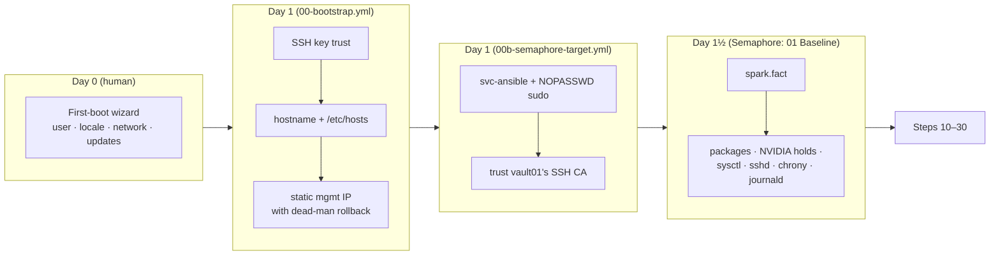
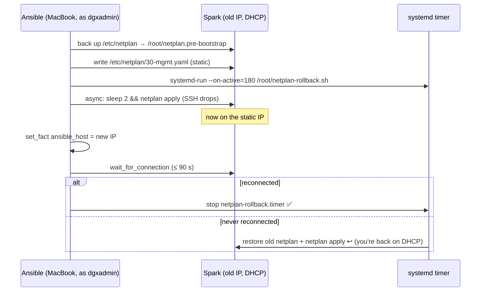
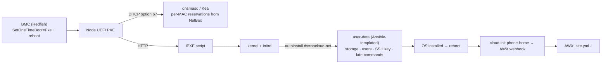

# Step 03 · Provisioning Without a BMC: Day-0/Day-1 on DGX Spark, Safe Network Cut-over, and Practising Redfish & PXE

> **01-Ansible · Part I — Management plane & Ansible foundations · Step 03 of 30** · ← [Step 02 · Control node & Ansible core](02-control-node-and-ansible-core.md) · [All steps](00-ansible-step-by-step-guide.md) · [Step 04 · dgx-spark-1 as Semaphore target](04-dgx-spark-as-semaphore-target.md) →

| | |
|---|---|
| **You will build** | A repeatable path from *fresh out of the box* (or *just re-imaged*) to *managed by Ansible*: first-boot wizard → key trust → hostname → static mgmt IP with an automatic rollback → baseline. Then a Redfish practice target and a PXE design for when you graduate to DGX/HGX |
| **Hardware** | 1× DGX Spark (recovery USB stick optional) |
| **Time** | 2 h (+30 min if you do a full re-image drill) |
| **Risk** | **Medium.** Changing the management IP on a headless box can lock you out, which is exactly what the dead-man switch below prevents |

---

## 1. What's different about a Spark

| Data-centre DGX/HGX | DGX Spark | Consequence for automation |
|---|---|---|
| BMC with Redfish/IPMI (power, virtual media, boot order, sensors) | **No BMC** | No remote power cycling or console. A hung box needs a human (or a smart plug) |
| PXE + autoinstall, fully unattended | **First-boot wizard** (local display, or headless via a Wi-Fi hotspot whose SSID, password and URL are on the Quick Start Guide sticker) | Day 0 is manual. Ansible takes over at Day 1 |
| Re-image over the network | **USB recovery media** from NVIDIA/OEM; a re-install takes roughly 25–30 min | Your playbooks must rebuild everything after a re-image, and that's the point of this module |
| OS images you build | **DGX OS 7** (Ubuntu 24.04 based) with NVIDIA's kernel, driver, CUDA, Docker and toolkit preinstalled | Converge the vendor image; don't fight it |


> **Do not power off during the first-boot update.** NVIDIA warns that interrupting the initial software download and install can damage the system. Let it finish before running any playbook.

---

## 2. Architecture

### 2.1 HLD: control-plane responsibilities by phase



### 2.2 LLD: the dead-man switch for network changes



The same pattern protects **any** change that can cut your own access: sshd config, firewall rules, bonding, VLANs.

---

## 3. Hands-on

### 3.1 Day 0: the first-boot wizard

1. Connect the 10GbE port to your management LAN (recommended over Wi-Fi for everything that follows).
2. Power on. Either use a monitor and keyboard, or join the setup hotspot from a laptop and open the URL on the Quick Start Guide sticker.
3. Create the user. Use **the same username on every Spark** (`dgxadmin` in this lab); NVIDIA's multi-node playbooks and MPI depend on it.
4. Let the updates finish, including the reboot.
5. Find its DHCP address from your router, or with `avahi-browse -rt _ssh._tcp` from a Linux machine on the same LAN (Step 06).

### 3.2 Day 1: bootstrap with Ansible

This is one of the few playbooks that runs **from your MacBook**, not from Semaphore: the Spark has no `svc-ansible` account and doesn't trust vault01's CA yet, so Semaphore can't log in. You connect as `dgxadmin` with a password (`-k`), and the play installs your key.

```yaml
# lab/playbooks/00-bootstrap.yml
---
# Day-1 bootstrap for a Spark that just finished the first-boot wizard.
# Password auth is still on, you have no key trust yet, and it's on DHCP.
#
#   ansible-playbook playbooks/00-bootstrap.yml -l dgx-spark-2 -k -K \
#     -e bootstrap_current_ip=<current DHCP IP> [-e bootstrap_static_ip=true]
#
# NOTE: don't pass -e ansible_host=… — extra vars outrank set_fact, so Ansible
# could never switch to the new address and the rollback would always fire.
#
# The static-IP step uses a DEAD-MAN SWITCH: a systemd timer restores the old
# netplan in 180 s unless Ansible reconnects on the new IP and cancels it.
- name: Bootstrap a freshly installed DGX Spark
  hosts: spark
  become: true
  gather_facts: false          # we must redirect the connection before the first SSH
  vars:
    bootstrap_static_ip: false
    bootstrap_prefix: "{{ mgmt_cidr | default('192.168.0.0/24') | regex_replace('^.*/', '') }}"
    bootstrap_rollback_seconds: 180
    bootstrap_netplan: /etc/netplan/30-mgmt.yaml
  tasks:
    - name: Remember the inventory (target) IP, connect via the current one
      ansible.builtin.set_fact:
        bootstrap_target_ip: "{{ ansible_host }}"
        ansible_host: "{{ bootstrap_current_ip | default(ansible_host) }}"

    - name: Gather facts on the current address
      ansible.builtin.setup:

    - name: Set hostname to the inventory name
      ansible.builtin.hostname:
        name: "{{ inventory_hostname }}"

    - name: Make the hostname resolvable locally (sudo is slow without it)
      ansible.builtin.lineinfile:
        path: /etc/hosts
        regexp: '^127\.0\.1\.1\s'
        line: "127.0.1.1 {{ inventory_hostname }}.{{ lab_domain | default('lab.local') }} {{ inventory_hostname }}"
        mode: "0644"

    - name: Install control-node SSH key(s)
      ansible.posix.authorized_key:
        user: "{{ spark_admin_user }}"
        key: "{{ item }}"
      loop: "{{ spark_admin_pubkeys | select | list }}"

    - name: Ensure OpenSSH server is enabled
      ansible.builtin.systemd_service:
        name: ssh
        enabled: true
        state: started

    # ------------------------------------------------------------ static mgmt IP with rollback
    - name: Static management IP (dead-man switch)
      when: bootstrap_static_ip | bool
      block:
        - name: Back up current netplan directory
          ansible.builtin.command: cp -a /etc/netplan /root/netplan.pre-bootstrap
          args:
            creates: /root/netplan.pre-bootstrap

        - name: Write rollback script
          ansible.builtin.copy:
            dest: /root/netplan-rollback.sh
            mode: "0700"
            content: |
              #!/bin/sh
              rm -f {{ bootstrap_netplan }}
              cp -a /root/netplan.pre-bootstrap/. /etc/netplan/
              netplan apply
              logger -t bootstrap "netplan rolled back — Ansible did not confirm new IP"

        - name: Render static netplan for the mgmt NIC
          ansible.builtin.copy:
            dest: "{{ bootstrap_netplan }}"
            mode: "0600"
            content: |
              # {{ ansible_managed }}
              network:
                version: 2
                ethernets:
                  {{ mgmt_interface }}:
                    dhcp4: false
                    addresses: [{{ bootstrap_target_ip }}/{{ bootstrap_prefix }}]
                    routes: [{to: default, via: {{ mgmt_gateway }}}]
                    nameservers: {addresses: {{ dns_servers | to_json }}}

        - name: Arm the dead-man switch
          ansible.builtin.command: >-
            systemd-run --unit=netplan-rollback --on-active={{ bootstrap_rollback_seconds }}
            /root/netplan-rollback.sh
          changed_when: true

        - name: Apply netplan in the background (our SSH session will drop)
          ansible.builtin.shell: sleep 2 && netplan apply
          async: 60
          poll: 0
          changed_when: true

        - name: Switch Ansible to the new address
          ansible.builtin.set_fact:
            ansible_host: "{{ bootstrap_target_ip }}"

        - name: Reconnect on the new IP
          ansible.builtin.wait_for_connection:
            delay: 5
            timeout: 90

        - name: Disarm the dead-man switch
          ansible.builtin.systemd_service:
            name: netplan-rollback.timer
            state: stopped

        - name: Remove DHCP-era netplan files that would fight the static one
          ansible.builtin.find:
            paths: /etc/netplan
            patterns: ["*.yaml"]
            excludes: ["30-mgmt.yaml", "40-cx7.yaml"]
          register: bootstrap_old_netplan

        - name: Show what else configures the mgmt NIC (remove by hand if it duplicates)
          ansible.builtin.debug:
            msg: "Review: {{ bootstrap_old_netplan.files | map(attribute='path') | list }}"
```

```bash
cd "01-Ansible/lab"
# First run: password SSH (-k) and sudo (-K), on the DHCP address, no IP change yet
ansible-playbook playbooks/00-bootstrap.yml -l dgx-spark-2 -k -K -e bootstrap_current_ip=192.168.0.137

# Second run: move it to its inventory IP (192.168.0.101) with the dead-man switch
ansible-playbook playbooks/00-bootstrap.yml -l dgx-spark-2 -K \
  -e bootstrap_current_ip=192.168.0.137 -e bootstrap_static_ip=true

# Make it a Semaphore target (Step 04 §3): svc-ansible, NOPASSWD sudo, trust vault01's CA
ansible-playbook playbooks/00b-semaphore-target.yml -l dgx-spark-2,localhost -K
```

From now on, plain inventory addressing works and the node belongs to Semaphore: run the templates `00 Ping` and `01 Baseline` with CLI args `--limit dgx-spark-2,localhost`. (When dgx-spark-2 is permanent, drop the `--limit dgx-spark-1,localhost` from all templates, Step 04 §5.5.)

**Test the rollback on purpose, once.** Point the node at an address your MacBook can't reach, e.g. `-e bootstrap_target_ip=10.99.99.99`. (`-e` beats the playbook's own `set_fact`, so this is a handy way to force a bad target.) The reconnect times out, and 180 s later the Spark is back on its old address. `journalctl -t bootstrap` on the Spark shows the rollback.

> **Precedence trap (the reason for `bootstrap_current_ip`):** extra vars (`-e`) outrank everything, including `set_fact`. If you passed the DHCP address as `-e ansible_host=…`, the play could never switch its connection to the new IP, and the dead-man switch would roll back every time. Always carry "where it is now" in a separate variable.

### 3.3 Managing kernel arguments (when you have a reason)

DGX OS ships tuned kernel parameters, so don't change them casually. When you must (a vendor-advised setting, or a debugging flag), use a GRUB drop-in plus a controlled reboot, never a `sed` on `/etc/default/grub`:

```yaml
- name: Kernel arguments via GRUB drop-in
  hosts: spark
  become: true
  serial: 1                               # one node at a time
  vars:
    spark_kernel_args: []                 # e.g. ["nvidia.NVreg_EnableStreamMemOPs=1"] — only if advised
  tasks:
    - name: Drop-in
      ansible.builtin.copy:
        dest: /etc/default/grub.d/90-spark-lab.cfg
        content: |
          # {{ ansible_managed }}
          GRUB_CMDLINE_LINUX_DEFAULT="$GRUB_CMDLINE_LINUX_DEFAULT {{ spark_kernel_args | join(' ') }}"
        mode: "0644"
      register: grub_dropin
    - name: Regenerate GRUB
      ansible.builtin.command: update-grub
      when: grub_dropin is changed
      changed_when: true
    - name: Reboot and wait for the GPU to come back
      ansible.builtin.reboot:
        reboot_timeout: 900
        test_command: nvidia-smi -L
      when: grub_dropin is changed
    - name: Verify args are live
      ansible.builtin.command: cat /proc/cmdline
      register: cmdline
      changed_when: false
      failed_when: spark_kernel_args | reject('in', cmdline.stdout) | list | length > 0
```

### 3.4 Recovery drill: prove you can rebuild

The real test of provisioning automation is to wipe a node and rebuild it:

1. Record the state: Semaphore template `30 Validate` with `--limit dgx-spark-2,localhost` (keep `validation/dgx-spark-2.json` from sema01's state volume, `/opt/spark-lab/cache`).
2. Re-image dgx-spark-2 from the USB recovery media (the OEM/NVIDIA guide covers creating it with `dd`; verify the checksum first).
3. Complete the wizard (§3.1).
4. From the MacBook: `00-bootstrap.yml` (both runs), then `00b-semaphore-target.yml -l dgx-spark-2,localhost -K`. The re-image gave the node a new SSH host key, so on sema01 remove the old one first (`docker compose exec semaphore ssh-keygen -R 192.168.0.101`, Step 04 §12). Then the Semaphore template `site` with `--limit dgx-spark-2,localhost`.
5. Validate again and `diff` the two JSON reports. **Anything that differs is something you did by hand and never automated.**

Semaphore, vault01 and the task history of the first build are untouched by the re-image: that's why the controller lives outside the Spark.

Time the whole thing. Under an hour from USB boot to validated is a good target.

---

## 4. Practising Redfish (for DGX/HGX) on the Spark

The Spark has no BMC, but the Redfish automation you'll use on DGX B200/GB200 systems (power control, boot override, firmware inventory, sensors) can be practised against DMTF's **Redfish Mockup Server**, which serves a realistic BMC tree from static JSON:

```yaml
# lab/playbooks/12-redfish-practice.yml
---
# DGX Spark has no BMC. To practise the Redfish automation you'll need on
# DGX/HGX servers, run DMTF's Redfish Mockup Server on the Spark and point
# community.general redfish modules at it (Step 03).
- name: Short-lived SSH certificate from vault01 (Semaphore runs only)
  ansible.builtin.import_playbook: 00-vault-cert.yml

- name: Start a Redfish mockup server
  hosts: spark[0]
  become: true
  vars:
    redfish_mock_dir: /opt/redfish-mockup
    redfish_mock_port: 8000
  tasks:
    - name: Clone DMTF Redfish-Mockup-Server
      ansible.builtin.git:
        repo: https://github.com/DMTF/Redfish-Mockup-Server.git
        dest: "{{ redfish_mock_dir }}"
        version: main
        depth: 1
    - name: Install its Python requirements in a venv
      ansible.builtin.pip:
        requirements: "{{ redfish_mock_dir }}/requirements.txt"
        virtualenv: "{{ redfish_mock_dir }}/.venv"
        virtualenv_command: python3 -m venv
    - name: Run it as a transient systemd unit
      ansible.builtin.command: >-
        systemd-run --unit=redfish-mock --collect
        {{ redfish_mock_dir }}/.venv/bin/python {{ redfish_mock_dir }}/redfishMockupServer.py
        -H 0.0.0.0 -p {{ redfish_mock_port }} -D {{ redfish_mock_dir }}/public-rackmount1
      register: redfish_mock_run
      changed_when: redfish_mock_run.rc == 0
      failed_when: redfish_mock_run.rc != 0 and 'already' not in redfish_mock_run.stderr

- name: Query it like a real BMC
  hosts: localhost
  connection: local
  gather_facts: false
  vars:
    bmc: "{{ hostvars[groups['spark'][0]].ansible_host }}:8000"
  tasks:
    - name: Inventory via Redfish
      community.general.redfish_info:
        category: Systems,Chassis,Manager
        command: GetSystemInventory,GetPsuInventory,GetFirmwareInventory,GetBootOverride
        baseuri: "{{ bmc }}"
        username: root
        password: unused-by-mockup
      register: redfish
    - name: Show system inventory
      ansible.builtin.debug:
        var: redfish.redfish_facts.system
```

Semaphore template `12 Redfish practice`, or break-glass from the MacBook:

```bash
ansible-playbook playbooks/12-redfish-practice.yml -l dgx-spark-1,localhost -K
curl -s http://192.168.0.100:8000/redfish/v1/Systems | jq '.Members'
```

Real-BMC equivalents of what you just ran:

| Task | Module / command | On a real DGX/HGX BMC |
|---|---|---|
| Inventory | `community.general.redfish_info` `GetSystemInventory` | CPU/GPU/DIMM/PSU inventory |
| One-time PXE boot | `redfish_command` `SetOneTimeBoot` `bootdevice: Pxe` | Next boot from the network |
| Power | `redfish_command` `PowerGracefulRestart` / `PowerForceOff` | Remote power-cycle a hung node (you **can't** do this on a Spark; a smart plug is the home-lab stand-in) |
| Virtual media | `redfish_command` `VirtualMediaInsert` | Boot an ISO without USB |
| Firmware | `redfish_info` `GetFirmwareInventory` + `redfish_command` `MultipartHTTPPushUpdate` | BMC/BIOS/GPU firmware |

## 5. PXE / autoinstall design (reference for data-centre nodes)

Not runnable on a Spark (no network install path documented for it), but here's the blueprint the rest of this module plugs into:



Ansible owns every box in that diagram: it templates the dnsmasq reservations from NetBox (Step 06), renders the per-node `user-data`, flips the BMC boot order through Redfish, and receives the phone-home webhook in AWX.

---

## 6. Troubleshooting & diagnostics

| Symptom | Diagnose | Fix |
|---|---|---|
| Can't find the Spark after the wizard | Router DHCP leases; `avahi-browse -rt _ssh._tcp`; `arp -a` | Use a wired connection; the Wi-Fi hotspot is setup-only |
| `-k` fails: `to use the 'ssh' connection type with passwords, you must install the sshpass program` | — | `brew install hudochenkov/sshpass/sshpass` on the MacBook (`apt install sshpass` on Linux) |
| Semaphore after a re-image: `Host key verification failed` | the node's host key changed | on sema01: `docker compose exec semaphore ssh-keygen -R <ip>`, only once you know why it changed (Step 04 §12) |
| Bootstrap: `wait_for_connection` times out and then the old IP answers again | The dead-man switch worked | Check the new IP/prefix/gateway; `journalctl -t bootstrap`; make sure you used `bootstrap_current_ip`, **not** `-e ansible_host`; fix and re-run |
| Both the old DHCP and the new static address are present | Another netplan file (from the wizard/NetworkManager) still configures the NIC | Review the files the last task lists; `netplan get`; remove the duplicate; `netplan apply` |
| `netplan apply` warns `Permissions for /etc/netplan/*.yaml are too open` | `ls -l /etc/netplan` | `mode: "0600"` (the roles already do this) |
| After `update-grub` + reboot, the GPU is missing | `nvidia-smi`; `dmesg \| grep -i nvrm` | Remove the drop-in, `update-grub`, reboot; bisect the argument you added |
| Redfish mockup: `Connection refused` | `systemctl status redfish-mock` on the Spark | `systemctl reset-failed redfish-mock`; re-run; check the port with `ss -ltnp \| grep 8000` |

## 7. Validation

- [ ] A Spark goes from wizard-complete to `01-baseline.yml changed=0` using only playbooks.
- [ ] You triggered the dead-man rollback deliberately and watched it recover.
- [ ] (Drill) Re-image → rebuild → `diff` of the validation JSON is empty.
- [ ] `redfish_info` returns system inventory from the mockup.
