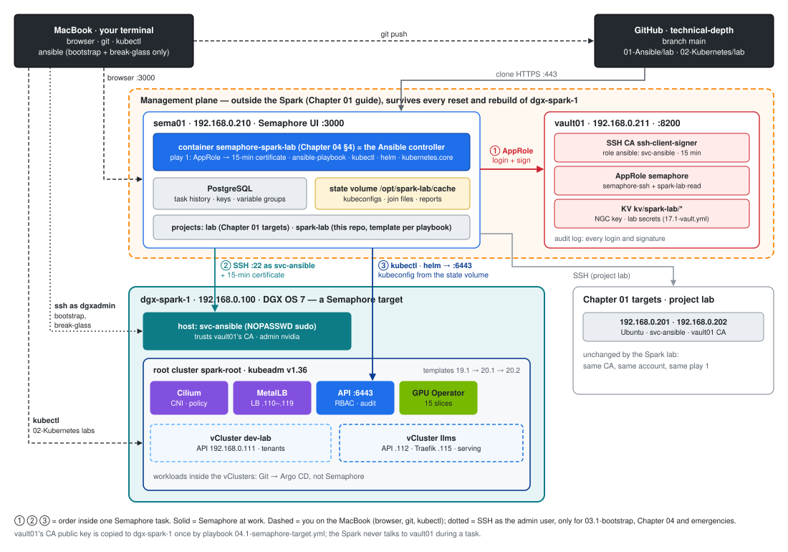

# Chapter 04 · DGX Spark as a Semaphore Target: Add dgx-spark-1 to sema01 and vault01

> **01-Ansible · Part I — Management plane & Ansible foundations · Chapter 04 of 30** · ← [Chapter 03 · Bare-metal provisioning & bootstrap](03-bare-metal-provisioning-and-bootstrap.md) · [All chapters](00-ansible-step-by-step-guide.md) · [Chapter 05 · Execution internals & debugging](05-execution-internals-and-debugging.md) →
>
> Prerequisites: this chapter follows Chapters 01–03. [Chapter 01 · Management plane: Semaphore & Vault](01-management-plane-semaphore-and-vault.md) works end to end (its §9 passes), and the MacBook toolchain, SSH trust and inventory from [Chapter 02](02-control-node-and-ansible-core.md) §3.1–3.4 are in place (a fresh DGX OS also needs the bootstrap from [Chapter 03](03-bare-metal-provisioning-and-bootstrap.md)). This chapter makes the DGX Spark the next target of that same Semaphore and Vault. Afterwards **every playbook of the Spark lab runs as a Semaphore task**. Next comes first contact, the `02.1 Ping` template from §5.6 ([Chapter 02 §3.5](02-control-node-and-ansible-core.md)), then the baseline; the [02-Kubernetes](../02-Kubernetes/README.md) module builds on the clusters those tasks create.

**Goal:** the same rule as in Chapter 01: no human holds the automation credential. `sema01` and `vault01` stay outside the Spark. `dgx-spark-1` trusts vault01's SSH CA, and every Semaphore task logs in as `svc-ansible` with a 15-minute certificate. Kubernetes work (kubeadm, Cilium, the GPU Operator, the vClusters) is driven from the Semaphore container over the LAN.

Each step has a **Why**, then commands with a comment on every line, then a **Verify** block. Steps say where to type: **on your MacBook**, **on sema01**, **on vault01**, **on dgx-spark-1**, or **in Semaphore** (the web UI).



---

## 1. How the pieces fit

| Machine | Address | Role in the Spark lab | Built by |
|---|---|---|---|
| MacBook | DHCP | your terminal: browser to Semaphore, `git push`, `kubectl` for the 02-Kubernetes labs, and the two bootstrap playbooks | [Chapter 02](02-control-node-and-ansible-core.md) §3.1–3.4 |
| `sema01` | 192.168.0.210 | **runs every lab playbook** (Semaphore + PostgreSQL in Docker). Its container is the Ansible *controller*: play 1, `kubectl`, `helm` and the `kubernetes.core` modules run there | Chapter 01 §7, plus §4 here |
| `vault01` | 192.168.0.211 | SSH CA (`ssh-client-signer`, role `ansible`), AppRole `semaphore`, audit log; plus the lab's secrets (§6) | Chapter 01 §3–4, plus §6 here |
| `dgx-spark-1` | 192.168.0.100 | the target: DGX OS, then the kubeadm root cluster `spark-root` with the vClusters `dev-lab` and `llms` inside it | the lab playbooks, run by Semaphore |
| 192.168.0.201 / .202 | — | your existing Chapter 01 targets, unchanged (project `lab`) | Chapter 01 |

**One Semaphore task, step by step** (template `19.1 Kubernetes` as the example):

1. You click **Run**. Semaphore checks your role and clones `technical-depth` (branch `main`).
2. **Play 1** (`playbooks/00-vault-cert.yml`, the same play as Chapter 01 §8.3) runs inside the container. It logs in to vault01 with the AppRole from the variable group and gets a 15-minute certificate for `svc-ansible`.
3. The host plays SSH to `dgx-spark-1` as `svc-ansible` with that certificate. sshd checks the CA signature, the principal and the expiry, and `sudo` (NOPASSWD) runs the tasks.
4. The controller plays run `kubectl`/`helm` in the container against `https://192.168.0.100:6443`. The kubeconfig with the contexts `spark-root`, `dev-lab` and `llms` lives on sema01's **state volume** (§4), not in the temporary checkout.
5. The task log and history stay in Semaphore. vault01's audit log has the login and the signature, and dgx-spark-1's sshd log has `Accepted publickey … ED25519-CERT`.

**Two ways in, decided by one variable.** [`inventory/group_vars/spark.yml`](lab/inventory/group_vars/spark.yml) switches the login on whether the Semaphore variable group (`vault_role_id`) is attached:

| Run from | `ansible_user` | Credential | Used for |
|---|---|---|---|
| Semaphore (normal) | `svc-ansible` | 15-minute certificate from play 1 | every template from `02.1 Ping` on |
| MacBook (bootstrap, break-glass) | `dgxadmin` (the admin user) | your own SSH key, sudo password with `-K` | `03.1-bootstrap.yml`, `04.1-semaphore-target.yml`, `17.1-vault.yml`, and emergencies when sema01 or vault01 is down (§10) |

> **Why the controller is outside the Spark.** `19.2-reset-kubernetes.yml` deletes everything Kubernetes runs; a rebuild of DGX OS deletes everything on the box. A Semaphore running *on* the Spark would delete itself halfway through its own job, and a broken cluster would take away the tool you need to fix it. With the management plane outside — like out-of-band management in a datacenter — the Spark can break freely.

---

## 2. Before you start

**Why:** the bootstrap playbooks run once from your MacBook, and they need the lab repository, a working Ansible, SSH as the admin user, and vault01's TLS certificate.

**Two one-time settings on the MacBook first.**

- **zsh and `#` comments.** macOS's zsh does **not** treat `#` as a comment when you type or paste commands: everything after it becomes arguments (errors like `zsh: unknown group`, `No such file or directory`, or a hanging quote from an apostrophe). The commented command blocks in these guides need it switched on:
  ```bash
  setopt interactivecomments                                   # this shell
  echo 'setopt interactivecomments' >> ~/.zshrc                # every new shell
  ```
- **SSH names for the management plane**, so `vault01` and `sema01` in the commands below resolve to the right address and user. Your login user on vault01 is the one from Chapter 01 (`vault01` in its examples); put your own sema01 user in place of `<your-user>`:
  ```bash
  cat >> ~/.ssh/config <<'EOF'
  Host vault01
    HostName 192.168.0.211
    User vault01
  Host sema01
    HostName 192.168.0.210
    User <your-user>
  Host dgx-spark-1
    HostName 192.168.0.100
    User dgxadmin
  EOF
  ssh vault01 hostname && ssh sema01 hostname                  # both answer
  ```

Then, on your MacBook (the repository and Ansible come from [Chapter 02](02-control-node-and-ansible-core.md) §3.1):

```bash
cd ~/technical-depth/"01-Ansible/lab"                       # the lab folder; every relative path below starts here
mkdir -p .cache && chmod 700 .cache                          # local state folder (git-ignored)
scp vault01:~/vault-ca.crt .cache/vault-ca.crt               # vault01 TLS certificate (the copy you made in Chapter 01 §3.3)
curl --cacert .cache/vault-ca.crt https://192.168.0.211:8200/v1/sys/health   # JSON = the MacBook trusts vault01's TLS
ssh -t dgxadmin@192.168.0.100 'hostname; sudo -v && echo sudo-ok'   # admin login + sudo (-t: a terminal, so sudo can ask for the password)
```

**Verify 2:**

```bash
ls -l .cache/vault-ca.crt                                    # the certificate is there
curl -s --cacert .cache/vault-ca.crt https://192.168.0.211:8200/v1/ssh-client-signer/public_key | cut -c1-20   # expect: ssh-rsa AAAA… (public, no token)
ansible -m ping dgx-spark-1 -K                              # expect: pong (as dgxadmin, your key)
```

### 2.1 Fresh DGX OS only: bootstrap

Skip this if the Spark is already named `dgx-spark-1`, sits on 192.168.0.100 and takes your key as `dgxadmin` (the last command in Verify 2 answers `pong`). On a Spark that has just finished the first-boot wizard (password login, DHCP address), `03.1-bootstrap.yml` sets the hostname, installs your key for `dgxadmin` and, on the second run, moves it to the static IP. A dead-man timer rolls the network back if Ansible can't reconnect.

```bash
ansible-playbook playbooks/03.1-bootstrap.yml -l dgx-spark-1 -k -K -e bootstrap_current_ip=<its DHCP IP>                              # -k: SSH password, still on
ansible-playbook playbooks/03.1-bootstrap.yml -l dgx-spark-1 -K -e bootstrap_current_ip=<its DHCP IP> -e bootstrap_static_ip=true     # move to 192.168.0.100
```

Then repeat Verify 2. Details: [Chapter 03](03-bare-metal-provisioning-and-bootstrap.md) and the playbook's header.

---

## 3. Make dgx-spark-1 trust vault01 (on your MacBook)

**Why:** this is Chapter 01 §5 for the Spark, as a playbook instead of by hand. `04.1-semaphore-target.yml`:

- creates `svc-ansible` without a password;
- gives it NOPASSWD sudo (checked with `visudo -c` before it lands);
- writes vault01's CA public key to `/etc/ssh/trusted-user-ca-keys.pem`;
- adds `/etc/ssh/sshd_config.d/10-vault-ca.conf`, which trusts the CA and allows `svc-ansible` only key or certificate logins (checked with `sshd -t`);
- reloads sshd.

Your `dgxadmin` login is untouched, so you can't lock yourself out.

### 3.1 Run it

```bash
ansible-playbook playbooks/04.1-semaphore-target.yml -l dgx-spark-1,localhost -K   # localhost: fetches the CA key from vault01
```

`-l dgx-spark-1,localhost` is optional while `dgx-spark-2` is commented out in [`inventory/hosts.yml`](lab/inventory/hosts.yml), as it is now. If you limit a run, keep `localhost` in the limit: the CA key is fetched there, and play 1 runs there in every Semaphore template (§5.5).

### 3.2 Verify on dgx-spark-1

```bash
id svc-ansible                                               # expect a uid line
sudo visudo -c                                               # expect: parsed OK (including /etc/sudoers.d/90-svc-ansible)
sudo sshd -T | grep -i trustedusercakeys                     # expect: trustedusercakeys /etc/ssh/trusted-user-ca-keys.pem
sudo ssh-keygen -l -f /etc/ssh/trusted-user-ca-keys.pem      # expect the SAME SHA256 fingerprint as vault01 prints below
```

On vault01: `vault read -field=public_key ssh-client-signer/config/ca > ~/ca.pub && ssh-keygen -l -f ~/ca.pub`.

### 3.3 Test the CA before involving Semaphore (on vault01)

The same test as Chapter 01 §6, against the Spark. If Semaphore fails later, you'll know the problem isn't the trust:

```bash
ssh-keygen -t ed25519 -f ~/semaphore_lab -N "" <<<y >/dev/null       # test key (overwrites the Chapter 01 one)
vault write -field=signed_key ssh-client-signer/sign/ansible \
  public_key=@$HOME/semaphore_lab.pub valid_principals=svc-ansible > ~/semaphore_lab-cert.pub
ssh -i ~/semaphore_lab -o CertificateFile=~/semaphore_lab-cert.pub svc-ansible@192.168.0.100 'hostname; sudo -n whoami'
```

Expected: `dgx-spark-1` and `root`. `01-Ansible/lab/tools/vault-ssh-cert.sh` does the same in one command if you have the repository on vault01.

---

## 4. Give Semaphore the lab's tools and a place to keep state (on sema01)

**Why:** two things differ from the Ubuntu targets.

- **Kubernetes tools.** Several Spark playbooks run on the controller: kubeadm's kubeconfig merge, `helm` installs of Cilium, MetalLB and the GPU Operator, the vCluster charts, `kubectl drain`. The stock Semaphore image has no `kubectl`, `helm`, `kubernetes` Python library or `kubernetes.core` collection.
- **State.** The lab writes files the next run needs to its state folder: the kubeconfig with three contexts, the kubeadm join material, validation reports, incident bundles. Semaphore's checkout of the repository is temporary, and `/tmp` is gone after a container restart. So the state goes to a host folder, `/opt/spark-lab/cache`, and the playbooks find it through `SPARK_LAB_CACHE` (`lab_cache_dir` in [`group_vars/all.yml`](lab/inventory/group_vars/all.yml)).

[`lab/semaphore/`](lab/semaphore/) has both pieces:

| File | What it does |
|---|---|
| [`Dockerfile`](lab/semaphore/Dockerfile) | `FROM semaphoreui/semaphore`, plus `kubectl` v1.36.5, `helm`, the Python libraries in [`requirements-semaphore.txt`](lab/semaphore/requirements-semaphore.txt) and the collections in [`requirements.yml`](lab/requirements.yml) |
| [`docker-compose.override.yml`](lab/semaphore/docker-compose.override.yml) | merged with your Chapter 01 `docker-compose.yml`: builds that image, mounts `/opt/spark-lab/cache`, sets `ANSIBLE_CONFIG`, `SPARK_LAB_CACHE` and the log and fact paths |

```bash
cd ~ && git clone https://github.com/cloudone365/technical-depth.git   # the lab repository, as the image's build context
sudo install -d -o 1001 -g 0 -m 0700 /opt/spark-lab/cache            # state folder, owned by the container's semaphore user (uid 1001)
cp ~/technical-depth/"01-Ansible/lab/semaphore/docker-compose.override.yml" ~/semaphore/   # next to the Chapter 01 compose file
cd ~/semaphore
docker compose build semaphore                                       # builds semaphore-spark-lab:local (a few minutes)
docker compose up -d                                                 # recreates the semaphore container; PostgreSQL and your data are untouched
```

`/opt/spark-lab/cache` will hold cluster-admin kubeconfigs: back it up like the `.env` file (Chapter 01 §7.3) and keep it readable by the container user only. To update the tools later, `git -C ~/technical-depth pull`, then `docker compose build semaphore && docker compose up -d`.

**Verify 4 (on sema01, in ~/semaphore):**

```bash
docker compose ps                                                    # expect: postgres and semaphore Up
docker compose exec semaphore kubectl version --client               # expect: Client Version: v1.36.5
docker compose exec semaphore helm version --short                   # expect: v3.18.x
docker compose exec semaphore ansible-galaxy collection list kubernetes.core   # expect: kubernetes.core 5.x or newer
docker compose exec semaphore sh -c 'echo $SPARK_LAB_CACHE; touch $SPARK_LAB_CACHE/.w && echo writable'   # expect the path, then: writable
```

Your Chapter 01 project `lab` keeps working: same database, same keys, and the new image is a superset of the old one.

---

## 5. A Semaphore project for the Spark lab (in Semaphore)

**Why:** a separate project keeps the Spark's repository, inventory and templates apart from the Chapter 01 `lab` project, and lets you give other people access to one without the other. Menu names differ slightly between Semaphore versions.

### 5.1 Project

**New Project** → name `spark-lab`. Everything below happens inside it.

### 5.2 Key for the repository

**Key Store → New Key**: name `github-token`, type *Login with password*. Login is your GitHub user; Password is a **read-only** fine-grained token for `technical-depth` (Chapter 01 §8.2: Contents → Read-only). If the repository is public, type *None* works too. An SSH deploy key (Chapter 01 §8.5) is the stronger option.

### 5.3 Variable group `vault-approle`

**Variable Groups → New**, exactly as Chapter 01 §8.6 (same AppRole, so the same values work):

1. Name `vault-approle`.
2. Extra variables (JSON): `{"vault_role_id": "PASTE-THE-ROLE-ID", "vault_lab_secrets_enabled": false}`.
3. Secrets → Add secret: type *Variable*, name `vault_secret_id`, value = a secret_id from vault01 (`vault write -f -field=secret_id auth/approle/role/semaphore/secret-id`).
4. Save.

`vault_role_id` being defined is what switches the lab to `svc-ansible` with a certificate (§1). Set `vault_lab_secrets_enabled` to `true` after §6.

### 5.4 Repository

**Repositories → New**: name `technical-depth`, URL `https://github.com/cloudone365/technical-depth.git`, branch `main`, access key `github-token`.

### 5.5 Inventory

**Inventory → New**: name `spark-lab`, type **File**, repository `technical-depth`, path `01-Ansible/lab/inventory/hosts.yml`, user credentials *None* (play 1 supplies the key).

The inventory file comes with its `group_vars/` and `host_vars/`, so addresses, the automation user, the certificate path and `StrictHostKeyChecking=accept-new` are all already there; you don't retype them.

**One Spark or two:** `dgx-spark-2` is commented out in the inventory, so the templates need no limit. When dgx-spark-2 joins, uncomment its lines in `hosts.yml` (groups `spark`, `k8s_workers`, `nfs_client`) and push. If you ever add a `--limit` to a template, include `localhost`: play 1 and all the Kubernetes plays run there.

### 5.6 First template: `02.1 Ping`

**Task Templates → New Template**, type *Ansible Playbook*:

| Field | Value |
|---|---|
| Name | `02.1 Ping` |
| Playbook filename | `01-Ansible/lab/playbooks/02.1-ping.yml` |
| Inventory | `spark-lab` |
| Repository | `technical-depth` |
| Variable group (Environment) | `vault-approle` |
| CLI args | none needed with one Spark (if you add a limit: `["--limit", "dgx-spark-1,localhost"]`) |

Save, then **Run**.

**Verify 5:** the task log shows two plays.

- **Get an SSH certificate from Vault** (on `localhost`), with its secret tasks hidden.
- **Connectivity and identity check**, with `ok` on `dgx-spark-1` and a line like `dgx-spark-1 aarch64 20 cores 119.7 GiB Ubuntu 24.04`, ending in `failed=0`.

Then check all three systems:

```bash
sudo journalctl -u ssh --since "10 minutes ago" | grep svc-ansible   # on dgx-spark-1: "Accepted publickey for svc-ansible … ED25519-CERT"
sudo grep -c 'sign/ansible' /var/log/vault_audit.log                 # on vault01: the count grows with each task run
docker compose exec semaphore ssh-keygen -L -f /tmp/lab_ssh/id_ed25519-cert.pub | grep -A1 Principals   # on sema01: svc-ansible
```

---

## 6. Lab secrets in vault01 (on your MacBook, once)

**Why:** some lab playbooks need secrets, for example the NGC API key that `11.1-containers.yml` uses to pull NVIDIA images. They belong in vault01, next to the SSH CA, not in the repository. Setting this up needs an **admin** token, which Semaphore must never hold, so you run it from the MacBook.

[`17.1-vault.yml`](lab/playbooks/17.1-vault.yml) (role [`vault_config`](lab/roles/vault_config/)):

- **checks** what Chapter 01 built (the signing role allows `svc-ansible`; AppRole `semaphore` exists) and never rewrites it;
- mounts a KV v2 engine at `kv/`;
- writes the read-only policy `spark-lab-read` (`kv/data/spark-lab/*`);
- adds it to AppRole `semaphore`, so its tokens carry `semaphore-ssh` **and** `spark-lab-read`;
- seeds a placeholder `kv/spark-lab/ngc`.

```bash
export VAULT_ADDR=https://192.168.0.211:8200 VAULT_CACERT=$PWD/.cache/vault-ca.crt   # the vault CLI on the MacBook talks to vault01
vault login                                      # an admin token (root token in the lab; a named admin in production)
export VAULT_TOKEN=$(vault print token)          # the playbook reads it from the environment; it is never written to disk
ansible-playbook playbooks/17.1-vault.yml          # localhost only: talks to vault01's API
vault kv put kv/spark-lab/ngc api_key=<your NGC API key>   # the real value replaces the placeholder
unset VAULT_TOKEN                                # don't leave an admin token in the shell
```

No `vault` CLI on the MacBook? Run the `vault` commands on vault01 instead, and paste the token into `export VAULT_TOKEN=…` on the MacBook for the playbook run.

Then in Semaphore: variable group `vault-approle` → change `vault_lab_secrets_enabled` to `true`.

**Verify 6:**

```bash
vault read auth/approle/role/semaphore | grep token_policies   # on vault01: [semaphore-ssh spark-lab-read]
vault kv get -field=api_key kv/spark-lab/ngc | cut -c1-6       # the first characters of your key, not REPLACE_ME
```

In Semaphore, add and run a template `18.1 Vault integration` (`01-Ansible/lab/playbooks/18.1-vault-integration.yml`, same inventory, variable group and CLI args). Its log reports `Lab secrets read from kv/spark-lab/: ['ngc']` and `NGC key present: True`, without ever printing the key.

---

## 7. Build the lab from Semaphore

**Why:** from here on, the [step-by-step guide](00-ansible-step-by-step-guide.md) and the chapter documents say `ansible-playbook playbooks/NN.n-….yml`. In this lab that means **run the template of the same number**: every template uses the same inventory, repository, variable group and CLI args as `02.1 Ping`, and only the playbook filename changes.

### 7.1 The templates

Create these templates, listed in number order. A template's number is `<chapter>.<n>`: the chapter that explains it, then its place in that chapter, so `19.1 Kubernetes` runs `19.1-kubernetes.yml` and is explained in Chapter 19. Where another chapter also covers a template, the **Notes** column says so. Extra variables go in the template's *Extra variables* or a survey.

| Template | Playbook (`01-Ansible/lab/playbooks/…`) | Notes |
|---|---|---|
| `02.1 Ping` | `02.1-ping.yml` | first test (§5.6); explained in Chapter 02 §3.5 |
| `02.2 Baseline` | `02.2-baseline.yml` | OS, packages, sysctls, custom facts; also Chapters 03, 10 |
| `03.2 Redfish practice` | `03.2-redfish-practice.yml` | Redfish mockup BMC, practice for data-centre nodes |
| `07.1 Jinja lab` | `07.1-jinja-lab.yml` | the 7 Jinja katas; localhost only |
| `10.1 Driver audit` | `10.1-driver-audit.yml` | driver consistency |
| `10.2 DGX OS upgrade` | `10.2-dgxos-upgrade.yml` | reboots: extra variable `vault_ssh_cert_ttl: 1h` (§12); also Chapter 28 |
| `11.1 Containers` | `11.1-containers.yml` | Docker, NVIDIA toolkit, NGC login (key from §6) |
| `11.2 CUDA smoke` | `11.2-cuda-smoke.yml` | sm_121 + PyTorch smoke test |
| `12.1 Telemetry` | `12.1-telemetry.yml` | DCGM exporter, node exporter |
| `13.1 Fabric` | `13.1-fabric.yml` | CX-7 addressing: only with dgx-spark-2; also Chapter 14 |
| `13.2 RDMA perftest` | `13.2-rdma-perftest.yml` | needs dgx-spark-2 |
| `14.1 RoCE QoS` | `14.1-roce-qos.yml` | optional: DSCP/PFC/ECN; needs dgx-spark-2 |
| `14.2 NCCL test` | `14.2-nccl-test.yml` | needs dgx-spark-2 |
| `15.1 NFS RDMA` | `15.1-nfs-rdma.yml` | shared model cache; needs dgx-spark-2 |
| `16.1 GDS check` | `16.1-gds-check.yml` | GDS / cuFile assessment |
| `18.1 Vault integration` | `18.1-vault-integration.yml` | created in §6; reads `kv/spark-lab/ngc` without printing it |
| `19.1 Kubernetes` | `19.1-kubernetes.yml` | kubeadm root cluster, Cilium, MetalLB; writes the kubeconfig to the state volume |
| `19.2 Reset Kubernetes` | `19.2-reset-kubernetes.yml` | **danger zone**: see 7.3; explained in Chapter 19 §8 |
| `20.1 GPU Operator` | `20.1-gpu-operator.yml` | 15 time-slices |
| `20.2 vClusters` | `20.2-vclusters.yml` | `dev-lab` and `llms`; adds their contexts; explained in Chapter 19 §3.4 and 02-Kubernetes Chapter 04 |
| `21.1 Multus RDMA` | `21.1-multus-rdma.yml` | secondary CX-7 networks |
| `22.1 Slurm` | `22.1-slurm.yml` | Slurm with GRES and cgroup GPUs |
| `26.1 Drift check` | `26.1-drift-check.yml` | check mode is built in (changes nothing); schedule it nightly |
| `27.1 Logging audit` | `27.1-logging-audit.yml` | auditd, Loki, Alloy, ARA |
| `28.1 Firmware inventory` | `28.1-firmware-inventory.yml` | firmware + security floor |
| `29.1 Emergency drain` | `29.1-emergency-drain.yml` | drains through context `spark-root`; with a reboot, `vault_ssh_cert_ttl: 1h` |
| `29.2 UMA relief` | `29.2-uma-relief.yml` | Runbook C: diagnose, then relieve unified-memory pressure |
| `30.1 Validate` | `30.1-validate.yml` | the golden-value gate |
| `30.2 Chaos` | `30.2-chaos.yml` | capstone fault injection |
| `site` | `site.yml` | `02.2 Baseline`, `13.1 Fabric`, `11.1 Containers`, `12.1 Telemetry`, `19.1 Kubernetes`, `20.1 GPU Operator`, `20.2 vClusters`, `22.1 Slurm`, `15.1 NFS RDMA` and `30.1 Validate` in one task; extra variable `vault_ssh_cert_ttl: 1h` |

The playbooks `03.1-bootstrap.yml`, `04.1-semaphore-target.yml`, `09.1-fleet-sim.yml`, `09.2-fleet-bench.yml` and `17.1-vault.yml` have no template: they run from the MacBook. `00-vault-cert.yml` is play 1, imported by the others.

### 7.2 Build order

Run `02.2 Baseline` → `11.1 Containers` → `12.1 Telemetry` → `19.1 Kubernetes` → `20.1 GPU Operator` → `20.2 vClusters`, one after the other. Or run `site` once. Each task log must end in `failed=0` before you start the next one: the same checkpoints as in Chapters 02, 11, 12, 19 and 20 ([all chapters](00-ansible-step-by-step-guide.md)).

### 7.3 The danger zone

`19.2-reset-kubernetes.yml` asks you to type `RESET`, and a Semaphore task can't answer prompts. Give the template an extra variable instead: Ansible skips a prompt when the variable is already set.

- Extra variables: `{"reset_confirm": "RESET"}`, optional `"reset_wipe_data": true`.
- Permissions: in **Team**, give other users the *Task Runner* role at most, and keep this template for yourself. The clean option is a third project `spark-danger` that only you can open.

Never schedule it.

### 7.4 Your kubeconfig on the MacBook

`19.1 Kubernetes` and `20.2 vClusters` write `kubeconfig-spark-lab.yaml` (contexts `spark-root`, `dev-lab`, `llms`) to sema01's state volume. The 02-Kubernetes labs run `kubectl` from your MacBook and expect it at `01-Ansible/lab/.cache/kubeconfig-spark-lab.yaml`. Copy it there after each of those two tasks:

```bash
tools/fetch-kubeconfig.sh sema01                                     # reads it through the container, writes .cache/kubeconfig-spark-lab.yaml (0600)
export KUBECONFIG="$PWD/.cache/kubeconfig-spark-lab.yaml"            # what every 02-Kubernetes command uses
kubectl --context spark-root get nodes                               # expect: dgx-spark-1 Ready control-plane
kubectl --context dev-lab get ns && kubectl --context llms get ns    # both vClusters answer
```

This kubeconfig holds cluster-admin certificates, the human side of the lab, and you need it for the Kubernetes labs. Keep it on the MacBook only (it's git-ignored). In an enterprise, people get short-lived OIDC logins instead (02-Kubernetes Chapter 03).

### 7.5 Renaming templates from the old numbering

The playbooks used to carry their own numbers (`05-kubernetes.yml`, template `05 Kubernetes`). They now carry the number of the chapter that explains them (`19.1-kubernetes.yml`, template `19.1 Kubernetes`). If you created templates on sema01 before the rename, Semaphore still points them at the old file names, and their runs fail because those files no longer exist in the repository. Open each template in project `spark-lab`, change its **Name** and its **Playbook** path, and save.

Edit the templates; don't delete and recreate them. Semaphore keeps the task history per template: deleting a template throws away its record of who ran what and when (Chapter 27), and a recreated template starts empty. Schedules, surveys and extra variables also stay with the edited template.

| Old template · old playbook | New template · new playbook |
|---|---|
| `00 Ping` · `00-ping.yml` | `02.1 Ping` · `02.1-ping.yml` |
| `01 Baseline` · `01-baseline.yml` | `02.2 Baseline` · `02.2-baseline.yml` |
| — (MacBook only) · `00-bootstrap.yml` | — (MacBook only) · `03.1-bootstrap.yml` |
| `12 Redfish practice` · `12-redfish-practice.yml` | `03.2 Redfish practice` · `03.2-redfish-practice.yml` |
| — (MacBook only) · `00b-semaphore-target.yml` | — (MacBook only) · `04.1-semaphore-target.yml` |
| `15 Jinja lab` · `15-jinja-lab.yml` | `07.1 Jinja lab` · `07.1-jinja-lab.yml` |
| — (MacBook only) · `13-fleet-sim.yml` | — (MacBook only) · `09.1-fleet-sim.yml` |
| — (MacBook only) · `14-fleet-bench.yml` | — (MacBook only) · `09.2-fleet-bench.yml` |
| `16 Driver audit` · `16-driver-audit.yml` | `10.1 Driver audit` · `10.1-driver-audit.yml` |
| `17 DGX OS upgrade` · `17-dgxos-upgrade.yml` | `10.2 DGX OS upgrade` · `10.2-dgxos-upgrade.yml` |
| `03 Containers` · `03-containers.yml` | `11.1 Containers` · `11.1-containers.yml` |
| `18 CUDA smoke` · `18-cuda-smoke.yml` | `11.2 CUDA smoke` · `11.2-cuda-smoke.yml` |
| `04 Telemetry` · `04-telemetry.yml` | `12.1 Telemetry` · `12.1-telemetry.yml` |
| `02 Fabric` · `02-fabric.yml` | `13.1 Fabric` · `13.1-fabric.yml` |
| `11 RDMA perftest` · `11-rdma-perftest.yml` | `13.2 RDMA perftest` · `13.2-rdma-perftest.yml` |
| `12b RoCE QoS` · `12b-roce-qos.yml` | `14.1 RoCE QoS` · `14.1-roce-qos.yml` |
| `10 NCCL test` · `10-nccl-test.yml` | `14.2 NCCL test` · `14.2-nccl-test.yml` |
| `09 NFS RDMA` · `09-nfs-rdma.yml` | `15.1 NFS RDMA` · `15.1-nfs-rdma.yml` |
| `14 GDS check` · `14-gds-check.yml` | `16.1 GDS check` · `16.1-gds-check.yml` |
| — (MacBook only) · `08-vault.yml` | — (MacBook only) · `17.1-vault.yml` |
| `19 Vault integration` · `19-vault-integration.yml` | `18.1 Vault integration` · `18.1-vault-integration.yml` |
| `05 Kubernetes` · `05-kubernetes.yml` | `19.1 Kubernetes` · `19.1-kubernetes.yml` |
| `99 Reset Kubernetes` · `99-reset-kubernetes.yml` | `19.2 Reset Kubernetes` · `19.2-reset-kubernetes.yml` |
| `06 GPU Operator` · `06-gpu-operator.yml` | `20.1 GPU Operator` · `20.1-gpu-operator.yml` |
| `06b vClusters` · `06b-vclusters.yml` | `20.2 vClusters` · `20.2-vclusters.yml` |
| `13 Multus RDMA` · `13-multus-rdma.yml` | `21.1 Multus RDMA` · `21.1-multus-rdma.yml` |
| `07 Slurm` · `07-slurm.yml` | `22.1 Slurm` · `22.1-slurm.yml` |
| `20 Drift check` · `20-drift-check.yml` | `26.1 Drift check` · `26.1-drift-check.yml` |
| `23 Logging audit` · `23-logging-audit.yml` | `27.1 Logging audit` · `27.1-logging-audit.yml` |
| `19 Firmware inventory` · `19-firmware-inventory.yml` | `28.1 Firmware inventory` · `28.1-firmware-inventory.yml` |
| `21 Emergency drain` · `21-emergency-drain.yml` | `29.1 Emergency drain` · `29.1-emergency-drain.yml` |
| `24 UMA relief` · `24-uma-relief.yml` | `29.2 UMA relief` · `29.2-uma-relief.yml` |
| `30 Validate` · `30-validate.yml` | `30.1 Validate` · `30.1-validate.yml` |
| `25 Chaos` · `25-chaos.yml` | `30.2 Chaos` · `30.2-chaos.yml` |

Unchanged: template `site` (`site.yml`, which imports the new names itself) and the `00-vault-cert.yml` import in every playbook. The rows marked *MacBook only* have no template; only your shell history and notes need the new names.

---

## 8. Verify the full chain

| Where | What to check | What it proves |
|---|---|---|
| Semaphore task log | Play 1 ok (secret tasks hidden), then host plays on `dgx-spark-1`, `failed=0` | Semaphore → Vault → Spark works |
| dgx-spark-1: `sudo journalctl -u ssh \| grep svc-ansible` | `Accepted publickey … ED25519-CERT ID …` | login used a certificate, not a plain key |
| dgx-spark-1: `sudo grep svc-ansible /var/log/auth.log \| grep COMMAND` | sudo lines for the tasks | privileged actions are traceable to the automation account |
| vault01: `sudo grep -c 'sign/ansible' /var/log/vault_audit.log` | grows by one per task | every certificate request is recorded |
| sema01: `docker compose exec semaphore ls /var/lib/spark-lab/cache` | `kubeconfig-spark-lab.yaml`, `kubeconfig-dev-lab.yaml`, `kubeconfig-llms.yaml`, `validation/` … | lab state survives the temporary checkout |
| MacBook: `kubectl --context llms get nodes` | `dgx-spark-1` (synced from the root) | the 02-Kubernetes labs can start |
| Expiry test | 16 minutes after a task, `docker compose exec semaphore ssh -i /tmp/lab_ssh/id_ed25519 svc-ansible@192.168.0.100 true` is refused; a new task run succeeds | credentials expire without cleanup |

---

## 9. Day-2 operations from Semaphore

- **Schedules:** `26.1 Drift check` nightly (it only reports, it never changes anything), and `30.1 Validate` weekly. A failed scheduled task is your alert (add a Telegram, Slack or e-mail alert in project settings).
- **Upgrades** (`10.2 DGX OS upgrade`, Chapters 10/28) and **drains** (`29.1 Emergency drain`, Chapter 29): run them from Semaphore so every maintenance action has a record of who ran it, when and with what result.
- **Rebuild:** `19.2 Reset Kubernetes`, then `19.1 Kubernetes` → `20.1 GPU Operator` → `20.2 vClusters`, then `tools/fetch-kubeconfig.sh`. Semaphore, Vault and their history are untouched by any of it.
- **What Semaphore does *not* do:** workloads inside the vClusters (vLLM, tenant apps, quotas). Those are Git → Argo CD (02-Kubernetes [Chapter 28](../02-Kubernetes/28-production-mlops-and-gitops.md)). One tool per object, or the two will undo each other's changes.

---

## 10. Break-glass: running from the MacBook

When sema01 or vault01 is down, you can still reach the Spark the way you did in §2:

```bash
cd ~/technical-depth/"01-Ansible/lab"
ansible-playbook playbooks/29.1-emergency-drain.yml -l dgx-spark-1,localhost -K   # no vault_role_id → nvidia + your key; play 1 is skipped
```

State then goes to the MacBook's `.cache/` instead of sema01's volume. After the emergency, re-run the affected template in Semaphore, so the record and the state are back in one place.

---

## 11. Security notes

| Item | Lab today | Better |
|---|---|---|
| AppRole secret_id | one static secret_id in the variable group | `secret_id_ttl`, `secret_id_bound_cidrs=192.168.0.210/32`, rotation (Chapter 01 §11) |
| State volume | cluster-admin kubeconfigs and kubeadm join material on sema01 | encrypt the disk, back it up, restrict who can `docker exec` into the container |
| Template permissions | everyone in the project can run everything | *Task Runner* role for others; dangerous templates in a separate project |
| Container image | `semaphoreui/semaphore:latest` + tools built locally | pin the base tag, rebuild on a schedule, scan the image |
| Lab secrets | read-only policy for `kv/spark-lab/*` | one policy per template class (build vs day-2), short token TTLs |

---

## 12. Troubleshooting

| Symptom | Cause | Fix |
|---|---|---|
| `zsh: unknown group`, `No such file or directory` for words from a comment, or a `quote>` prompt | zsh on macOS doesn't treat `#` as a comment | `setopt interactivecomments` (and add it to `~/.zshrc`), §2 |
| `ssh: Could not resolve hostname vault01` / wrong user on vault01 or sema01 | no SSH names on the MacBook | `~/.ssh/config` entries, §2 |
| `Permission denied (publickey)` for svc-ansible | sshd doesn't trust vault01's CA, or the certificate expired | §3.2 fingerprints; run the task again for a fresh certificate; check clocks (Chapter 01 §10.2) |
| A long task fails after a reboot or a long pause: `Permission denied` / `UNREACHABLE` halfway | the 15-minute certificate expired; the open SSH connection kept working, the new one after the reboot is refused | template extra variable `vault_ssh_cert_ttl: 1h` (the vault01 role's `max_ttl`) |
| Play 1 skipped and then `Permission denied` for **nvidia** | the template has no variable group, so the lab thinks it's a MacBook run | attach `vault-approle` to the template |
| Play 1 never runs, hosts unreachable | `--limit` without `localhost` | `--limit dgx-spark-1,localhost` |
| `UNREACHABLE … 192.168.0.101` | dgx-spark-2 is uncommented in the inventory but not there yet | comment it out again, or add `--limit dgx-spark-1,localhost` (§5.5) |
| `Host key verification failed` | dgx-spark-1 was reinstalled, so its host key changed | on sema01: `docker compose exec semaphore ssh-keygen -R 192.168.0.100` (only after you know why the key changed) |
| `No module named 'kubernetes'` / `helm: not found` | the stock image is running | §4: `docker compose build semaphore && docker compose up -d`, check `docker compose ps` shows `semaphore-spark-lab:local` |
| `Could not find … kubeconfig-spark-lab.yaml` in templates `20.1`/`20.2`/`21.1`/`29.1` | state is not on the volume (SPARK_LAB_CACHE unset) or `19.1 Kubernetes` never ran from Semaphore | §4 Verify; run `19.1 Kubernetes` from Semaphore |
| `17.1-vault.yml`: `export VAULT_TOKEN=…` assertion | no admin token in the environment | §6 |
| `17.1-vault.yml`: signing role does not allow svc-ansible | vault01's role differs from Chapter 01 §4 | `vault read ssh-client-signer/roles/ansible`; fix `allowed_users` there |
| `11.1 Containers`: NGC login skipped | `vault_lab_secrets_enabled` false, or the key is still `REPLACE_ME` | §6 |
| `19.2 Reset Kubernetes`: `reset_confirm == 'RESET'` assertion | the template has no extra variable | §7.3 |
| `A worker was found in a dead state` | sema01 out of memory during `helm`/`kubectl` work | 4 GB+ for sema01 (Chapter 01 §2), never two tasks at once |
