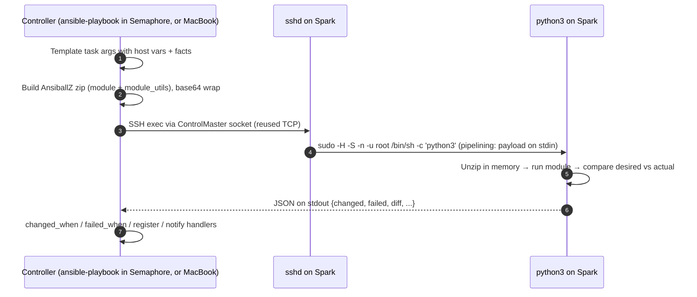
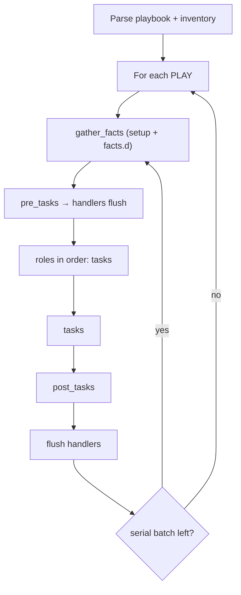

# Chapter 05 · Execution Internals & Debugging: What Actually Happens on the Spark

> **01-Ansible · Part I — Management plane & Ansible foundations · Chapter 05 of 30** · ← [Chapter 04 · DGX Spark as a Semaphore target](04-dgx-spark-as-semaphore-target.md) · [All chapters](00-ansible-step-by-step-guide.md) · [Chapter 06 · Inventory: static, dynamic & discovery](06-inventory-static-dynamic-and-discovery.md) →

| | |
|---|---|
| **You will learn** | To see (not just believe) each stage of a task run, and to debug failures at the right layer: SSH, sudo, Python, module, or your logic |
| **Hardware** | 1× DGX Spark |
| **Time** | 60 min |
| **Risk** | None: read-only experiments plus a scratch directory |

---

## 1. The task lifecycle, observed



Under Semaphore the SSH user is `svc-ansible` (15-minute certificate from play 1, NOPASSWD sudo, so `sudo -n` succeeds without a prompt); from the MacBook it is `dgxadmin` with your key and `-K` ([Chapter 02 §3.2](02-control-node-and-ansible-core.md)). Everything below is the same for both.

With **pipelining** on (our `ansible.cfg`), steps 3–4 are a single SSH round-trip and nothing is written to `/tmp` on the Spark. Without it you get `mkdir` → `sftp put` → `chmod` → `exec` → `rm`, which is five round-trips per task.

### 1.1 See it for yourself

These are interactive experiments, so run them from your **MacBook** (the break-glass login: `dgxadmin`, your key). In Semaphore you'd get the same `-vvvv` output by adding `-vvvv` to a template's CLI args, but you can't then `ssh` in as `svc-ansible` to read the payload: only Semaphore holds its certificate, and that's the point.

```bash
# ▶ MacBook · technical-depth (repo root)
cd "01-Ansible/lab"
```

```bash
# ▶ MacBook · 01-Ansible/lab (venv active)
ansible dgx-spark-1 -m ping -vvvv 2>&1 | grep -E 'ESTABLISH|SSH: EXEC|PUT|<dgx-spark-1> (EXEC|SSH)'
```

Look for `EXEC ... sudo -H -S -n -u root /bin/sh -c 'echo BECOME-SUCCESS-... ; /usr/bin/python3'` and the *absence* of `PUT`. That confirms pipelining is active.

Now switch pipelining off and keep the payload on the Spark so you can read it:

```bash
# ▶ MacBook · 01-Ansible/lab (venv active)
ANSIBLE_PIPELINING=0 ANSIBLE_KEEP_REMOTE_FILES=1 \
  ansible dgx-spark-1 -m ansible.builtin.stat -a path=/etc/dgx-release -vvv 2>&1 | grep -o '/home/dgxadmin/.ansible/tmp/[^ /]*' | head -1
# → /home/dgxadmin/.ansible/tmp/ansible-tmp-1727630000.12-4242-1234
```

```bash
# ▶ MacBook · any folder
ssh dgxadmin@192.168.0.100
```

```bash
# ▶ dgx-spark-1 (ssh dgx-spark-1)
cd ~/.ansible/tmp/ansible-tmp-*/
python3 AnsiballZ_stat.py explode        # unpacks the module into ./debug_dir
ls debug_dir/ansible/modules/            # stat.py — the real module source
python3 AnsiballZ_stat.py execute        # re-run it by hand, see raw JSON
```

This is the single most useful technique when a module behaves differently on aarch64 than on your laptop. You can edit `debug_dir/.../stat.py`, add prints, and run `execute` again.

---

## 2. Play execution model (what runs when)



| Knob | What it controls | Spark-lab usage |
|---|---|---|
| `strategy: linear` (default) | Every host finishes task N before any starts N+1 | Most plays: predictable output |
| `strategy: free` | Hosts race ahead independently | Long independent builds (NCCL compile on 2+ nodes) |
| `serial: 1` | Batches of hosts, whole play per batch | `29.1-emergency-drain.yml`, fabric changes: never both nodes at once |
| `throttle: 1` | Per-task concurrency limit | Tasks hitting a shared API (Vault, the Kubernetes API) |
| `run_once` + `delegate_to` | One execution, on a chosen host | Generating the munge key; minting a `kubeadm token create` on the control plane for each joining worker (delegate only) |
| `order: sorted` | Host ordering | `19.1-kubernetes.yml`: `order: sorted` + `serial` so dgx-spark-1 (control plane) finishes before dgx-spark-2 joins |
| `any_errors_fatal` / `max_fail_percentage` | Stop everything on first failure | Drain: one failed node → stop |

### 2.1 Handlers: why your config didn't reload

Handlers run **once, at the end of the play** (or at `meta: flush_handlers`), and only if a notifying task reported `changed`. Three things commonly go wrong:

1. The task ran in check mode, so nothing actually changed and the handler never fires.
2. The play failed before the flush, so the handler never ran. The next run sees no change and **still** doesn't restart the service. Use `--force-handlers` (or `force_handlers = True` in `ansible.cfg`) for plays that restart services.
3. Two tasks notified the handler under different names. Name handlers once and use `listen:` for aliases.

`container_runtime` shows the pattern for "restart *now*, then test":

```yaml
- name: Flush handlers so docker restarts before smoke test
  ansible.builtin.meta: flush_handlers
```

---

## 3. Long-running operations: async, poll and timeouts

Pulling `nvcr.io/nvidia/pytorch` (~20 GB) or building NCCL (~10 min on 20 Arm cores) can outlive SSH keepalives. Use `async`:

```yaml
- name: Pre-pull NGC images (async — multi-GB pulls outlive SSH timeouts)
  community.docker.docker_image_pull:
    name: "{{ item }}"
    platform: linux/arm64
  loop: "{{ container_runtime_prepull }}"
  async: 3600     # max seconds the job may run on the Spark
  poll: 15        # the controller checks every 15 s with a short SSH exec (through the ControlPersist master while it lives)
```

> **Async and the 15-minute certificate.** Every poll is a new SSH *exec*. While the ControlPersist master is alive it carries the polls without authenticating again, so a 40-minute pull is fine. If the master dies (the Spark rebooted, the network dropped longer than `ServerAliveInterval` × 3), the next poll must authenticate, and under Semaphore the certificate from play 1 may have expired by then: `Permission denied (publickey)`. The job itself keeps running on the Spark; re-run the template and the task's idempotence (`creates:`, image already present) skips what's done.

Fire-and-forget with a later join:

```yaml
- name: Download model weights in the background
  ansible.builtin.command: >
    huggingface-cli download Qwen/Qwen2.5-7B-Instruct --local-dir /srv/models/qwen2.5-7b
  async: 7200
  poll: 0
  register: dl_job
  become_user: dgxadmin

# ... other tasks run meanwhile ...

- name: Wait for the download
  ansible.builtin.async_status:
    jid: "{{ dl_job.ansible_job_id }}"
  register: dl
  until: dl.finished
  retries: 240
  delay: 30
  become_user: dgxadmin
```

> **Gotcha:** `async_status` must use the same `become_user` as the async task. The job file lives in that user's `~/.ansible_async/`.

---

## 4. Error handling that tells you *why*

```yaml
- name: GPU health gate with forensics
  block:
    - name: GPU must answer within 10 s
      ansible.builtin.command: timeout 10 nvidia-smi -L
      changed_when: false
  rescue:
    - name: Capture kernel evidence
      ansible.builtin.shell: set -o pipefail; journalctl -k --since "-30 min" --no-pager | grep -E 'NVRM|Xid' | tail -50
      args: { executable: /bin/bash }
      register: xid
      changed_when: false
      failed_when: false
    - name: Fail with context
      ansible.builtin.fail:
        msg: |
          GPU unresponsive on {{ inventory_hostname }}.
          Recent NVRM lines:
          {{ xid.stdout | default('none') }}
          Next: playbooks/29.1-emergency-drain.yml -l {{ inventory_hostname }}
  always:
    - name: Record outcome
      ansible.builtin.debug:
        msg: "GPU gate {{ 'FAILED' if ansible_failed_task is defined else 'ok' }}"
```

Other levers:

| Pattern | Use when |
|---|---|
| `failed_when: rc not in [0, 3]` | The tool has "soft" exit codes |
| `changed_when: false` | Read-only `command`/`shell` (keeps idempotence reports honest) |
| `until/retries/delay` | Waiting for a service or link to converge (see `cx7_fabric`) |
| `ignore_unreachable: true` | Drain/forensics plays where a dead host is expected |
| `ansible.builtin.assert` with `fail_msg` | Turn a precondition into a readable error |

---

## 5. The interactive debugger

```yaml
- name: Parse ibdev2netdev
  ansible.builtin.set_fact: { ... }
  debugger: on_failed
```

or globally: `ANSIBLE_ENABLE_TASK_DEBUGGER=True ansible-playbook ...`. At the `[dgx-spark-1] TASK: ... (debug)>` prompt:

```
p task.args                 # arguments after templating
p task_vars['cx7_interfaces']
p result._result            # module return
task.args['dest'] = '/tmp/x'; redo    # fix and retry without restarting the play
c                           # continue
```

`ansible-console` gives you a REPL against the inventory:

```bash
# ▶ MacBook · 01-Ansible/lab (venv active)
ansible-console spark --become
spark (2)[f:10]# nvidia-smi -L
spark (2)[f:10]# setup filter=ansible_local
spark (2)[f:10]# cd dgx-spark-1
```

---

## 6. Hands-on exercises

Four short labs that make §1–§4 visible on your own Spark. All four run **from the MacBook** as `dgxadmin` (the break-glass login, `-K` for the sudo password), because they change Ansible's connection settings or need you to look inside the Spark while a run is going. Exercise 4 also runs as a Semaphore template.

**Before you start (every exercise):**

```bash
# ▶ MacBook · any folder
cd ~/technical-depth && git pull                  # gets 05.1-async-download.yml and the latest roles
lab                                               # = cd 01-Ansible/lab + activate the venv (Chapter 02)
ansible dgx-spark-1 -m ping                       # expect: pong
```

| # | Exercise | Shows | Changes on the Spark | Time |
|---|---|---|---|---|
| 1 | Measure the round-trip tax | what pipelining and the SSH mux save (§1) | nothing new (baseline re-runs, idempotent) | ~10 min |
| 2 | Read a real module | what Ansible actually runs on the Spark (§1.1) | temporary files in `~/.ansible/tmp`, removed at the end | ~10 min |
| 3 | Break a handler | the "lost handler" problem (§2.1) | chrony and journald restart | ~15 min |
| 4 | Async join | `async` / `poll: 0` / `async_status` (§3) | a 4.7 GB model file in `/srv/models` | ~10 min + download |

### 6.1 Exercise 1 · Measure the round-trip tax

**Idea:** run the same playbook three times with different connection settings and compare the total time. The playbook does the same work each time; only the number of SSH round trips changes.

| Run | Settings | What happens per task |
|---|---|---|
| A | `ANSIBLE_PIPELINING=0 ANSIBLE_SSH_ARGS=""` | new SSH login (no mux) **and** copy-the-module-then-run (no pipelining): about 5 round trips |
| B | `ANSIBLE_PIPELINING=0` | SSH connection reused (mux), but still copy-then-run |
| C | defaults from `ansible.cfg` | one round trip: module sent on stdin over the reused connection |

Two details keep the comparison fair:

- `--flush-cache` makes every run gather facts again. Without it, runs B and C reuse the facts cached by run A (`gathering = smart` in `ansible.cfg`) and look faster than they are.
- `rm -f ~/.ansible/cp/*` closes the SSH connections that a previous run left open (`ControlPersist=600s`), so each run starts cold.

```bash
# ▶ MacBook · 01-Ansible/lab (venv active)
rm -f ~/.ansible/cp/*
ANSIBLE_PIPELINING=0 ANSIBLE_SSH_ARGS="" ansible-playbook playbooks/04.3-baseline.yml -l dgx-spark-1,localhost -K --flush-cache   # run A

rm -f ~/.ansible/cp/*
ANSIBLE_PIPELINING=0 ansible-playbook playbooks/04.3-baseline.yml -l dgx-spark-1,localhost -K --flush-cache                        # run B

rm -f ~/.ansible/cp/*
ansible-playbook playbooks/04.3-baseline.yml -l dgx-spark-1,localhost -K --flush-cache                                             # run C
```

**Read the result.** Each run ends with two blocks from the callbacks enabled in `ansible.cfg`:

- `ansible.posix.timer`: one line, `Playbook run took 0 days, 0 hours, 1 minutes, 12 seconds`. That's the number to record.
- `ansible.posix.profile_tasks`: the slowest tasks. Compare the same task (for example *Gathering Facts*) across A, B and C.

Write the three times down; Chapter 09 §3 measures the same levers across a simulated fleet:

```bash
# ▶ MacBook · 01-Ansible/lab (venv active)
grep "Playbook run took" .cache/ansible.log | tail -3     # the same three lines, from the run log
```

**What you should see:** A clearly slowest, C fastest, B in between. Most tasks in the baseline report `ok` (nothing to change), so almost all the time is connection overhead: exactly what pipelining and the mux remove. `recap` must say `failed=0` in all three.

**Why not in Semaphore:** without the mux every task logs in again. Under Semaphore that login uses the 15-minute certificate from play 1, so a slow run A would start failing with `Permission denied` once the certificate expires. With the mux (the default) the one connection made at the start carries the whole run.

### 6.2 Exercise 2 · Read a real module

**Idea:** a module is a Python program that Ansible wraps into one file (`AnsiballZ_<module>.py`), sends to the Spark, runs and deletes. With pipelining off and `KEEP_REMOTE_FILES=1`, the file stays, so you can unpack it and read the real code. Here you look at how `ansible.builtin.apt` handles the dpkg lock (the "another apt is running" situation you hit after every boot, when unattended-upgrades runs).

**Step 1 · Run the module once and keep the payload.** `jq` is already installed, so nothing changes.

```bash
# ▶ MacBook · 01-Ansible/lab (venv active)
ANSIBLE_PIPELINING=0 ANSIBLE_KEEP_REMOTE_FILES=1 \
  ansible dgx-spark-1 -b -K -m ansible.builtin.apt -a "name=jq state=present" -vvv 2>&1 \
  | grep -o '/home/dgxadmin/.ansible/tmp/ansible-tmp-[^ /]*' | sort -u
# → /home/dgxadmin/.ansible/tmp/ansible-tmp-1760000000.12-4242-1234   (copy this folder name)
```

**Step 2 · Unpack it on the Spark.**

```bash
# ▶ MacBook · any folder
ssh dgx-spark-1
```

```bash
# ▶ dgx-spark-1 (ssh dgx-spark-1)
cd ~/.ansible/tmp/ansible-tmp-*/          # if there are several, use the name from step 1
ls                                         # AnsiballZ_apt.py — the whole module in one file
python3 AnsiballZ_apt.py explode           # unpacks into ./debug_dir
ls debug_dir/ansible/modules/              # apt.py — the real module source
cat debug_dir/args                         # the arguments Ansible passed: name=jq, state=present
```

**Step 3 · Find the lock handling.**

```bash
# ▶ dgx-spark-1 (ssh dgx-spark-1)
grep -n -i "lock" debug_dir/ansible/modules/apt.py
```

Open the file at those lines (`less +<line> debug_dir/ansible/modules/apt.py`) and find three things:

1. The option **`lock_timeout`** (default `60`): how long the module waits for the lock.
2. `deadline = time.time() + p['lock_timeout']` followed by `while True:`: the retry loop.
3. `except apt.cache.LockFailedException` → `continue` while there is time left, else `fail_json(msg="Failed to lock apt for exclusive operation: …")`. That message is what you see in a task log when the 60 seconds run out.

**What it means for the lab:** a playbook that runs `apt` right after a reboot (`10.2 DGX OS upgrade`) should set `lock_timeout: 300` on its apt tasks, because unattended-upgrades can hold the lock for minutes.

**Step 4 · Run the unpacked module by hand.** This is how you debug a module that behaves differently on the Spark (aarch64) than on your Mac: add a `print()` to `debug_dir/ansible/modules/apt.py` and run it again.

```bash
# ▶ dgx-spark-1 (ssh dgx-spark-1)
sudo python3 AnsiballZ_apt.py execute     # raw JSON: "changed": false, because jq is installed
```

**Optional · watch the lock wait happen.** The test needs a package that is **not** installed. If `sl` is there from an earlier try (`dpkg -l sl` shows `ii`), remove it first:

```bash
# ▶ dgx-spark-1 (ssh dgx-spark-1)
sudo apt-get remove -y sl
```

Then two terminals. In the first, hold apt's lock on purpose with the same Python library the module uses (`apt_pkg`); it keeps the lock until you press Ctrl-C:

```bash
# ▶ dgx-spark-1 (ssh dgx-spark-1)
sudo python3 -c 'import apt_pkg, time; apt_pkg.init(); apt_pkg.pkgsystem_lock(); print("apt is locked - Ctrl-C to release"); time.sleep(600)'
```

(A plain `sudo apt-get install …` is no good for this: for a single package without new dependencies, apt installs at once without asking "Do you want to continue?", so it never sits there holding the lock.)

In the second, ask Ansible to install a package that is **not** installed yet (`sl`), with a short timeout:

```bash
# ▶ MacBook · 01-Ansible/lab (venv active)
ansible dgx-spark-1 -b -K -m ansible.builtin.apt -a "name=sl state=present lock_timeout=20"
# after ~20 s: FAILED! … "Failed to lock apt for exclusive operation"
```

Press Ctrl-C in the first terminal and run the same command again: now it installs `sl` (`CHANGED`). Remove it afterwards:

```bash
# ▶ MacBook · 01-Ansible/lab (venv active)
ansible dgx-spark-1 -b -K -m ansible.builtin.apt -a "name=sl state=absent"
```

**Step 5 · Clean up.** `KEEP_REMOTE_FILES` never deletes anything.

```bash
# ▶ dgx-spark-1 (ssh dgx-spark-1)
rm -rf ~/.ansible/tmp/ansible-tmp-*
exit
```

### 6.3 Exercise 3 · Break a handler

**Idea:** §2.1 says a handler runs at the end of the play, and only if the play gets there. Here you prove it: chrony's config changes, a later task fails, chrony is **not** restarted, and the next run doesn't restart it either, because by then the file is already right.

The pieces in the role (`roles/spark_baseline/`):

- `tasks/time_logging.yml`, task *Configure chrony*: writes `/etc/chrony/chrony.conf` and has `notify: Restart chrony`.
- The last task in the same file, *Persistent journald with a size cap*: this is where you add the failure.
- `handlers/main.yml`: *Restart chrony*.

All runs use `--tags time`, which runs only the tasks in `time_logging.yml`, so each run takes seconds.

**Step 1 · Note when chrony last started.**

```bash
# ▶ dgx-spark-1 (ssh dgx-spark-1)
systemctl show chrony -p ActiveEnterTimestamp     # e.g. ActiveEnterTimestamp=Thu 2026-10-08 21:14:02 EDT
```

**Step 2 · Make chrony's config differ from the template** (so the task reports `changed` and notifies the handler):

```bash
# ▶ dgx-spark-1 (ssh dgx-spark-1)
echo "# handler test" | sudo tee -a /etc/chrony/chrony.conf
```

**Step 3 · Add the failure.** In `roles/spark_baseline/tasks/time_logging.yml`, add one line to the last task, at the same indentation as `notify:`:

```yaml
- name: Persistent journald with a size cap
  ansible.builtin.copy:
    # … unchanged …
  notify: Restart journald
  failed_when: true          # TEMPORARY — Chapter 05 Exercise 3
```

**Step 4 · Run and look.**

```bash
# ▶ MacBook · 01-Ansible/lab (venv active)
ansible-playbook playbooks/04.3-baseline.yml -l dgx-spark-1,localhost -K --tags time
```

Expected: *Configure chrony* `changed`, *Persistent journald…* `FAILED`, **no** `RUNNING HANDLER [spark_baseline : Restart chrony]`, recap `failed=1`. Step 1's command on the Spark shows the **same** timestamp: chrony was not restarted.

**Step 5 · Remove the failure and run again** (delete the `failed_when: true` line; `git diff roles/` must show nothing):

```bash
# ▶ MacBook · 01-Ansible/lab (venv active)
git diff roles/                                   # expect: no output
ansible-playbook playbooks/04.3-baseline.yml -l dgx-spark-1,localhost -K --tags time
```

*Configure chrony* is now `ok` (the file was already fixed in step 4), so nothing notifies the handler, and the timestamp is **still** the old one. That's the lost handler: the config on disk is new, the running service still uses the old one, and Ansible reports everything fine. In real life it's a changed `sshd_config` or `daemon.json` that silently never takes effect.

**Step 6 · Repeat with `--force-handlers`.** Do steps 2 and 3 again, then:

```bash
# ▶ MacBook · 01-Ansible/lab (venv active)
ansible-playbook playbooks/04.3-baseline.yml -l dgx-spark-1,localhost -K --tags time --force-handlers
```

This time the task still fails, but `RUNNING HANDLER [spark_baseline : Restart chrony]` appears before the recap, and the timestamp on the Spark is new.

**Step 7 · Put it back.** Delete the `failed_when: true` line again, check `git diff roles/` is empty, and run step 5's command once more: `failed=0`, every task `ok`.

**Take-away:** for plays that restart services, use `--force-handlers` (or `force_handlers: true` on the play, or `force_handlers = True` in `ansible.cfg`), or flush handlers right after the change with `meta: flush_handlers` (§2.1).

### 6.4 Exercise 4 · Async join

**Idea:** a download of several GB would block the play for minutes. With `async: 3600` and `poll: 0`, Ansible starts it on the Spark as a background job and moves on at once. Later, `async_status` waits for the job ("join"). [`05.1-async-download.yml`](lab/playbooks/05.1-async-download.yml) does exactly that:

1. creates `/srv/models`;
2. starts downloading one 7B model file (Qwen2.5-7B-Instruct, GGUF Q4_K_M, about 4.7 GB, no Hugging Face login needed) with `async: 3600`, `poll: 0`, and registers the job id;
3. runs the whole `spark_baseline` role **while** the download continues;
4. waits with `async_status` (`until: …finished`, every 15 s, up to 1 hour);
5. prints the file size and removes the job's status file.

**Run it** (from the MacBook, or create a Semaphore template `05.1 Async download` with the same settings as `04.2 Ping`):

```bash
# ▶ MacBook · 01-Ansible/lab (venv active)
ansible-playbook playbooks/05.1-async-download.yml -l dgx-spark-1,localhost -K
```

**Watch it from the Spark** in a second terminal while it runs:

```bash
# ▶ dgx-spark-1 (ssh dgx-spark-1)
watch -n 5 ls -lh /srv/models               # the file grows while the baseline tasks run; Ctrl-C to stop
sudo ls /root/.ansible_async/               # one file per async job; its name is the job id from the log
```

**What you should see in the log:**

- *Start the download in the background* finishes in about a second (`changed`), and the next line shows the job id.
- The baseline tasks run normally, while the file keeps growing.
- *Join — wait for the download* prints `FAILED - RETRYING: … (239 retries left)` lines. That's normal: each line is one check that found the job still running, not an error.
- *Report*: `Qwen2.5-7B-Instruct-Q4_K_M.gguf: 4.36 GiB` (4.68 GB = 4.36 GiB).

**Run it again:** the file already exists, so `get_url` doesn't download it again: the job finishes at once and *Report* says `changed=False`.

**Clean up** (or keep the file: Chapter 16's GDS check also uses `/srv/models`):

```bash
# ▶ MacBook · 01-Ansible/lab (venv active)
ansible-playbook playbooks/05.1-async-download.yml -l dgx-spark-1,localhost -K -e async_cleanup=true
```

**Try:** change `retries: 240` to `retries: 2` in your copy and run with the file deleted. The join gives up after 30 s with `failed=1`, but the download carries on in the background on the Spark (`watch ls -lh /srv/models`). Async jobs belong to the Spark, not to the SSH connection. Put the line back afterwards.

**Done when:**

- [ ] You have three `Playbook run took …` times (A > B > C).
- [ ] You can point to `lock_timeout` and the `LockFailedException` retry loop in `apt.py`.
- [ ] You've seen chrony **not** restart after a failure, and restart with `--force-handlers`; `git diff roles/` is empty.
- [ ] `05.1-async-download.yml` ran with the baseline in the middle of the download, `failed=0`.

---

## 7. Troubleshooting & diagnostics

| Symptom | Layer | Diagnose | Fix |
|---|---|---|---|
| Semaphore: `Permission denied (publickey)` for `svc-ansible` after a reboot or a long async wait | SSH (certificate) | Task duration vs. the 15-minute certificate; the Spark's `journalctl -u ssh` shows `expired` | Run the template again (fresh certificate); keep rebooting tasks to one host (`--limit`) |
| `Failed to connect to the host via ssh: ... Connection timed out` | Network | `nc -vz 192.168.0.100 22` | Mgmt cabling or IP. Remember that Ansible uses `ansible_host`, not DNS |
| `Shared connection to ... closed` mid-task | SSH | `-vvvv`; check whether the task is long | Use `async`; `ServerAliveInterval=30` is already in `ansible.cfg` |
| `MODULE FAILURE ... See stdout/stderr for the exact error` | Python on target | `KEEP_REMOTE_FILES=1`, then `explode`/`execute` | Usually a missing Python lib on the Spark (e.g. `python3-apt`) |
| `The conditional check ... failed. The error was: ... is undefined` | Your logic | Add a debug task: `var=hostvars[inventory_hostname]` | Add `default()` or fix the variable scope (host_vars vs group_vars) |
| `sudo: a password is required` in the middle of a run | sudo | Did the task set `become: false` and then `become_user`? | `become_user` needs `become: true` at the same level (ansible-lint `partial-become`) |
| Handler did not run | Play flow | `--list-tasks`; was the notifying task `changed`? | `meta: flush_handlers`, or `--force-handlers` |
| Task takes 10+ minutes then fails with `timeout` | async missing | `ps -ef \| grep AnsiballZ` on the Spark | `async:` + `poll:` |
| Different result on the Spark vs. your laptop | aarch64 | `ansible dgx-spark-1 -m setup -a filter=ansible_architecture` | Pin `platform: linux/arm64` for images; check the module's arch assumptions |

## 8. Validation

- [ ] You can show the difference in `-vvvv` output with and without pipelining.
- [ ] You exploded and executed an AnsiballZ payload on the Spark.
- [ ] You wrote one `block/rescue/always` that captures evidence before failing.
- [ ] You joined a `poll: 0` async task with `async_status`.
