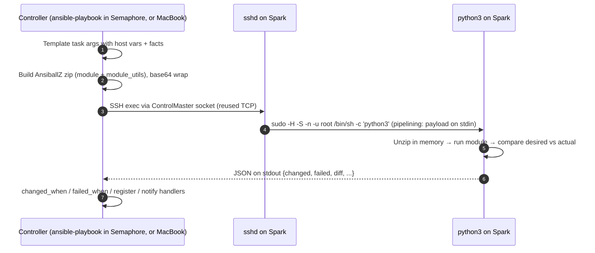
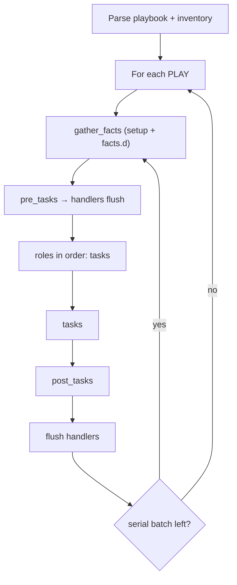

# Step 05 · Execution Internals & Debugging: What Actually Happens on the Spark

> **01-Ansible · Part I — Management plane & Ansible foundations · Step 05 of 30** · ← [Step 04 · DGX Spark as a Semaphore target](04-dgx-spark-as-semaphore-target.md) · [All steps](00-ansible-step-by-step-guide.md) · [Step 06 · Inventory: static, dynamic & discovery](06-inventory-static-dynamic-and-discovery.md) →

| | |
|---|---|
| **You will learn** | To see (not just believe) each stage of a task run, and to debug failures at the right layer: SSH, sudo, Python, module, or your logic |
| **Hardware** | 1× DGX Spark |
| **Time** | 60 min |
| **Risk** | None: read-only experiments plus a scratch directory |

---

## 1. The task lifecycle, observed



Under Semaphore the SSH user is `svc-ansible` (15-minute certificate from play 1, NOPASSWD sudo, so `sudo -n` succeeds without a prompt); from the MacBook it is `dgxadmin` with your key and `-K` ([Step 02 §3.3](02-control-node-and-ansible-core.md)). Everything below is the same for both.

With **pipelining** on (our `ansible.cfg`), steps 3–4 are a single SSH round-trip and nothing is written to `/tmp` on the Spark. Without it you get `mkdir` → `sftp put` → `chmod` → `exec` → `rm`, which is five round-trips per task.

### 1.1 See it for yourself

These are interactive experiments, so run them from your **MacBook** (the break-glass login: `dgxadmin`, your key). In Semaphore you'd get the same `-vvvv` output by adding `-vvvv` to a template's CLI args, but you can't then `ssh` in as `svc-ansible` to read the payload: only Semaphore holds its certificate, and that's the point.

```bash
cd "01-Ansible/lab"
ansible dgx-spark-1 -m ping -vvvv 2>&1 | grep -E 'ESTABLISH|SSH: EXEC|PUT|<dgx-spark-1> (EXEC|SSH)'
```

Look for `EXEC ... sudo -H -S -n -u root /bin/sh -c 'echo BECOME-SUCCESS-... ; /usr/bin/python3'` and the *absence* of `PUT`. That confirms pipelining is active.

Now switch pipelining off and keep the payload on the Spark so you can read it:

```bash
ANSIBLE_PIPELINING=0 ANSIBLE_KEEP_REMOTE_FILES=1 \
  ansible dgx-spark-1 -m ansible.builtin.stat -a path=/etc/dgx-release -vvv 2>&1 | grep -o '/home/dgxadmin/.ansible/tmp/[^ /]*' | head -1
# → /home/dgxadmin/.ansible/tmp/ansible-tmp-1727630000.12-4242-1234

ssh dgxadmin@192.168.0.100
cd ~/.ansible/tmp/ansible-tmp-*/
python3 AnsiballZ_stat.py explode        # unpacks the module into ./debug_dir
ls debug_dir/ansible/modules/            # stat.py — the real module source
python3 AnsiballZ_stat.py execute        # re-run it by hand, see raw JSON
```

This is the single most useful technique when a module behaves differently on aarch64 than on your laptop. You can edit `debug_dir/.../stat.py`, add prints, and run `execute` again.

---

## 2. Play execution model (what runs when)



| Knob | What it controls | Spark-lab usage |
|---|---|---|
| `strategy: linear` (default) | Every host finishes task N before any starts N+1 | Most plays: predictable output |
| `strategy: free` | Hosts race ahead independently | Long independent builds (NCCL compile on 2+ nodes) |
| `serial: 1` | Batches of hosts, whole play per batch | `21-emergency-drain.yml`, fabric changes: never both nodes at once |
| `throttle: 1` | Per-task concurrency limit | Tasks hitting a shared API (Vault, the Kubernetes API) |
| `run_once` + `delegate_to` | One execution, on a chosen host | Generating the munge key; minting a `kubeadm token create` on the control plane for each joining worker (delegate only) |
| `order: sorted` | Host ordering | `05-kubernetes.yml`: `order: sorted` + `serial` so dgx-spark-1 (control plane) finishes before dgx-spark-2 joins |
| `any_errors_fatal` / `max_fail_percentage` | Stop everything on first failure | Drain: one failed node → stop |

### 2.1 Handlers: why your config didn't reload

Handlers run **once, at the end of the play** (or at `meta: flush_handlers`), and only if a notifying task reported `changed`. Three things commonly go wrong:

1. The task ran in check mode, so nothing actually changed and the handler never fires.
2. The play failed before the flush, so the handler never ran. The next run sees no change and **still** doesn't restart the service. Use `--force-handlers` (or `force_handlers = True` in `ansible.cfg`) for plays that restart services.
3. Two tasks notified the handler under different names. Name handlers once and use `listen:` for aliases.

`container_runtime` shows the pattern for "restart *now*, then test":

```yaml
- name: Flush handlers so docker restarts before smoke test
  ansible.builtin.meta: flush_handlers
```

---

## 3. Long-running operations: async, poll and timeouts

Pulling `nvcr.io/nvidia/pytorch` (~20 GB) or building NCCL (~10 min on 20 Arm cores) can outlive SSH keepalives. Use `async`:

```yaml
- name: Pre-pull NGC images (async — multi-GB pulls outlive SSH timeouts)
  community.docker.docker_image_pull:
    name: "{{ item }}"
    platform: linux/arm64
  loop: "{{ container_runtime_prepull }}"
  async: 3600     # max seconds the job may run on the Spark
  poll: 15        # the controller checks every 15 s with a short SSH exec (through the ControlPersist master while it lives)
```

> **Async and the 15-minute certificate.** Every poll is a new SSH *exec*. While the ControlPersist master is alive it carries the polls without authenticating again, so a 40-minute pull is fine. If the master dies (the Spark rebooted, the network dropped longer than `ServerAliveInterval` × 3), the next poll must authenticate, and under Semaphore the certificate from play 1 may have expired by then: `Permission denied (publickey)`. The job itself keeps running on the Spark; re-run the template and the task's idempotence (`creates:`, image already present) skips what's done.

Fire-and-forget with a later join:

```yaml
- name: Download model weights in the background
  ansible.builtin.command: >
    huggingface-cli download Qwen/Qwen2.5-7B-Instruct --local-dir /srv/models/qwen2.5-7b
  async: 7200
  poll: 0
  register: dl_job
  become_user: dgxadmin

# ... other tasks run meanwhile ...

- name: Wait for the download
  ansible.builtin.async_status:
    jid: "{{ dl_job.ansible_job_id }}"
  register: dl
  until: dl.finished
  retries: 240
  delay: 30
  become_user: dgxadmin
```

> **Gotcha:** `async_status` must use the same `become_user` as the async task. The job file lives in that user's `~/.ansible_async/`.

---

## 4. Error handling that tells you *why*

```yaml
- name: GPU health gate with forensics
  block:
    - name: GPU must answer within 10 s
      ansible.builtin.command: timeout 10 nvidia-smi -L
      changed_when: false
  rescue:
    - name: Capture kernel evidence
      ansible.builtin.shell: set -o pipefail; journalctl -k --since "-30 min" --no-pager | grep -E 'NVRM|Xid' | tail -50
      args: { executable: /bin/bash }
      register: xid
      changed_when: false
      failed_when: false
    - name: Fail with context
      ansible.builtin.fail:
        msg: |
          GPU unresponsive on {{ inventory_hostname }}.
          Recent NVRM lines:
          {{ xid.stdout | default('none') }}
          Next: playbooks/21-emergency-drain.yml -l {{ inventory_hostname }}
  always:
    - name: Record outcome
      ansible.builtin.debug:
        msg: "GPU gate {{ 'FAILED' if ansible_failed_task is defined else 'ok' }}"
```

Other levers:

| Pattern | Use when |
|---|---|
| `failed_when: rc not in [0, 3]` | The tool has "soft" exit codes |
| `changed_when: false` | Read-only `command`/`shell` (keeps idempotence reports honest) |
| `until/retries/delay` | Waiting for a service or link to converge (see `cx7_fabric`) |
| `ignore_unreachable: true` | Drain/forensics plays where a dead host is expected |
| `ansible.builtin.assert` with `fail_msg` | Turn a precondition into a readable error |

---

## 5. The interactive debugger

```yaml
- name: Parse ibdev2netdev
  ansible.builtin.set_fact: { ... }
  debugger: on_failed
```

or globally: `ANSIBLE_ENABLE_TASK_DEBUGGER=True ansible-playbook ...`. At the `[dgx-spark-1] TASK: ... (debug)>` prompt:

```
p task.args                 # arguments after templating
p task_vars['cx7_interfaces']
p result._result            # module return
task.args['dest'] = '/tmp/x'; redo    # fix and retry without restarting the play
c                           # continue
```

`ansible-console` gives you a REPL against the inventory:

```bash
ansible-console spark --become
spark (2)[f:10]# nvidia-smi -L
spark (2)[f:10]# setup filter=ansible_local
spark (2)[f:10]# cd dgx-spark-1
```

---

## 6. Hands-on exercises

1. **Measure the round-trip tax.** Run `playbooks/01-baseline.yml` three ways and record the `timer` line:
   `ANSIBLE_PIPELINING=0 ANSIBLE_SSH_ARGS=""` (no pipelining, no mux) → `ANSIBLE_PIPELINING=0` → default. Chart the three numbers in Step 09. Do it from the MacBook (`-l dgx-spark-1,localhost -K`): without the mux every task authenticates again, which under Semaphore would start failing once the 15-minute certificate expires.
2. **Read a real module.** Use `KEEP_REMOTE_FILES` + `explode` on `ansible.builtin.apt` and find where it takes the dpkg lock.
3. **Break a handler.** Add `failed_when: true` to the last task of `spark_baseline` after changing `chrony.conf`, run it, remove the failure and run again. Did chrony restart? Now repeat with `--force-handlers`.
4. **Async join.** Download a 7B model to `/srv/models` with `poll: 0` while `01-baseline.yml` tasks continue, then join with `async_status`.

---

## 7. Troubleshooting & diagnostics

| Symptom | Layer | Diagnose | Fix |
|---|---|---|---|
| Semaphore: `Permission denied (publickey)` for `svc-ansible` after a reboot or a long async wait | SSH (certificate) | Task duration vs. the 15-minute certificate; the Spark's `journalctl -u ssh` shows `expired` | Run the template again (fresh certificate); keep rebooting tasks to one host (`--limit`) |
| `Failed to connect to the host via ssh: ... Connection timed out` | Network | `nc -vz 192.168.0.100 22` | Mgmt cabling or IP. Remember that Ansible uses `ansible_host`, not DNS |
| `Shared connection to ... closed` mid-task | SSH | `-vvvv`; check whether the task is long | Use `async`; `ServerAliveInterval=30` is already in `ansible.cfg` |
| `MODULE FAILURE ... See stdout/stderr for the exact error` | Python on target | `KEEP_REMOTE_FILES=1`, then `explode`/`execute` | Usually a missing Python lib on the Spark (e.g. `python3-apt`) |
| `The conditional check ... failed. The error was: ... is undefined` | Your logic | Add a debug task: `var=hostvars[inventory_hostname]` | Add `default()` or fix the variable scope (host_vars vs group_vars) |
| `sudo: a password is required` in the middle of a run | sudo | Did the task set `become: false` and then `become_user`? | `become_user` needs `become: true` at the same level (ansible-lint `partial-become`) |
| Handler did not run | Play flow | `--list-tasks`; was the notifying task `changed`? | `meta: flush_handlers`, or `--force-handlers` |
| Task takes 10+ minutes then fails with `timeout` | async missing | `ps -ef \| grep AnsiballZ` on the Spark | `async:` + `poll:` |
| Different result on the Spark vs. your laptop | aarch64 | `ansible dgx-spark-1 -m setup -a filter=ansible_architecture` | Pin `platform: linux/arm64` for images; check the module's arch assumptions |

## 8. Validation

- [ ] You can show the difference in `-vvvv` output with and without pipelining.
- [ ] You exploded and executed an AnsiballZ payload on the Spark.
- [ ] You wrote one `block/rescue/always` that captures evidence before failing.
- [ ] You joined a `poll: 0` async task with `async_status`.
