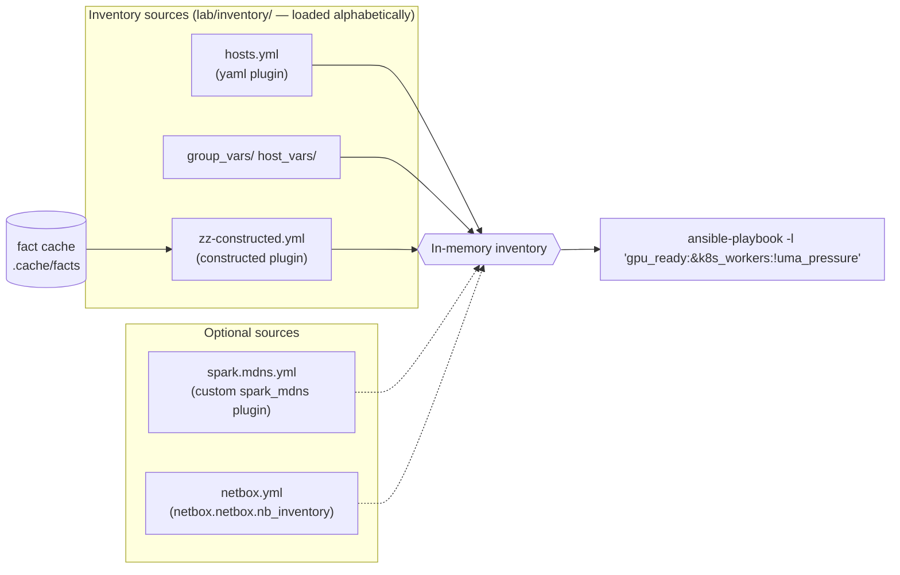

# Chapter 06 · Inventory: Static, Dynamic & Discovery: Constructed Groups, mDNS and NetBox as Source of Truth

> **01-Ansible · Part I — Management plane & Ansible foundations · Chapter 06 of 30** · ← [Chapter 05 · Execution internals & debugging](05-execution-internals-and-debugging.md) · [All chapters](00-ansible-step-by-step-guide.md) · [Chapter 07 · Jinja2 filters & data transforms](07-jinja2-filters-and-data-transforms.md) →

| | |
|---|---|
| **You will build** | A layered inventory: a static YAML baseline, **fact-driven groups** (`gpu_ready`, `driver_580`, `uma_pressure`), a **custom mDNS inventory plugin** that finds Sparks on the LAN, and NetBox as an optional source of truth |
| **Hardware** | 1–2× DGX Spark; for mDNS, a Linux machine on the Sparks' L2 segment (or a capture taken on a Spark, §3.2) |
| **Time** | 90 min |
| **Risk** | None. Inventory is read-only |

---

## 1. Why inventory design matters more than playbooks

On a real GPU cluster, most outages traced back to automation come down to *targeting*: a playbook ran against the wrong nodes, or against nodes in the wrong state. Examples include a driver upgrade hitting a node mid-job, or a fabric change reaching both ends of a link at once. Good inventory makes the right target set the easy one:

| Question | Answered by |
|---|---|
| *What hardware exists?* | static `spark` group, or NetBox |
| *What does each box do?* | functional groups (`k8s_control_plane`, `k8s_workers`, `slurm_compute`, …) |
| *What state is it in right now?* | **constructed** groups from facts (`gpu_ready`, `uma_pressure`, `driver_580`) |
| *What's on the network that I didn't write down?* | discovery (mDNS plugin) |

## 2. Architecture



**LLD — the files in the lab:**

| File | Plugin | Purpose |
|---|---|---|
| `inventory/hosts.yml` | `ansible.builtin.yaml` | Hardware + functional groups (Chapter 02) |
| `inventory/group_vars/*.yml`, `host_vars/*.yml` | vars plugin | Golden values and per-node addressing |
| `inventory/zz-constructed.yml` | `ansible.builtin.constructed` | Groups computed from facts in the cache. The `zz-` prefix makes it load last |
| `inventory_plugins/spark_mdns.py` | custom | Discovers `_ssh._tcp` Sparks via Avahi |
| `inventory-examples/spark.mdns.yml` | → `spark_mdns` | Config for the plugin (kept out of `inventory/` so it's opt-in) |

`ansible.cfg` points `inventory = ./inventory` (a **directory**, so every file in it is a source) and enables the custom plugin:

```ini
[defaults]
inventory         = ./inventory
inventory_plugins = ./inventory_plugins
[inventory]
enable_plugins = ansible.builtin.yaml, ansible.builtin.ini, spark_mdns, ansible.builtin.constructed, ansible.builtin.auto
```

---

## 3. Hands-on

### 3.1 Fact-driven groups with `constructed`

```yaml
# lab/inventory/zz-constructed.yml
---
# Loaded after hosts.yml (alphabetical). Builds groups from *facts* — including
# the custom ansible_local.spark facts — read from the fact cache.
# Run any play with facts once (e.g. 04.2-ping.yml) to populate the cache.
plugin: ansible.builtin.constructed
strict: false
groups:
  gpu_ready: ansible_local.spark.gpu.present | default(false)
  fabric_cabled: (ansible_local.spark.cx7.up | default([])) | length > 0
  uma_pressure: (ansible_local.spark.memory.available_gib | default(999)) < 16
keyed_groups:
  - prefix: driver
    key: (ansible_local.spark.gpu.driver_version | default('unknown')).split('.')[0]
  - prefix: cuda
    key: (ansible_local.spark.gpu.cuda_driver_api | default('unknown')) | replace('.', '_')
  - prefix: arch
    key: ansible_architecture | default('unknown')
```

Do this from your MacBook. Semaphore's inventory (Chapter 04 §5.5) is the **file** `01-Ansible/lab/inventory/hosts.yml`, not the directory, so `zz-constructed.yml` isn't loaded there and these fact-driven groups don't exist in Semaphore tasks; the static and functional groups do. On the MacBook, `ansible.cfg` loads the whole `inventory/` directory and the fact cache is your own `.cache/facts`:

```bash
# ▶ MacBook · technical-depth (repo root)
cd "01-Ansible/lab"
```

```bash
# ▶ MacBook · 01-Ansible/lab (venv active)
ansible-playbook playbooks/04.2-ping.yml -l dgx-spark-1,localhost -K                   # populates .cache/facts/*
ansible-playbook playbooks/04.3-baseline.yml -l dgx-spark-1,localhost -K --tags facts  # adds ansible_local.spark
ansible-inventory --graph
```

Output (example):

```
  |--@gpu_ready:        |--dgx-spark-1 |--dgx-spark-2
  |--@fabric_cabled:    |--dgx-spark-1 |--dgx-spark-2
  |--@driver_580:       |--dgx-spark-1 |--dgx-spark-2
  |--@cuda_13_0:        |--dgx-spark-1 |--dgx-spark-2
  |--@arch_aarch64:     |--dgx-spark-1 |--dgx-spark-2
```

Now **target by state** with inventory patterns:

```bash
# ▶ MacBook · 01-Ansible/lab (venv active)
# only healthy GPU nodes that are Kubernetes workers and NOT under memory pressure
# (30.1-validate targets the Sparks themselves; 19.1/20.1/20.2 run from localhost against the API)
ansible-playbook playbooks/30.1-validate.yml -l 'gpu_ready:&k8s_workers:!uma_pressure'
# every node still on an old driver major
ansible 'driver_570' -m debug -a msg="needs upgrade"
# one node at a time from a group
ansible-playbook playbooks/29.1-emergency-drain.yml -l 'slurm_compute[1]'
```

| Pattern | Meaning |
|---|---|
| `a:b` | union |
| `a:&b` | intersection |
| `a:!b` | exclusion |
| `group[0]`, `group[0:2]` | index / slice |
| `~spark-0[12]` | regex |

These state-based patterns are a MacBook tool for the reason above. In Semaphore, limit by name or functional group, and keep `localhost` in the limit for play 1: `["--limit", "k8s_workers,localhost"]`.

> **Stale facts = wrong groups.** Constructed groups are only as fresh as the cache (`fact_caching_timeout = 7200`). For safety-critical targeting (drain, upgrade), refresh first: `ansible spark -m setup -a filter=ansible_local`.

### 3.2 Discovery: a custom mDNS inventory plugin

DGX OS advertises SSH over mDNS, which is how NVIDIA's `discover-sparks` script finds peers (`avahi-browse -p -r -t _ssh._tcp`). The same mechanism can feed Ansible:

```python
# lab/inventory_plugins/spark_mdns.py
# -*- coding: utf-8 -*-
# Inventory plugin: discover DGX Sparks on the local LAN via mDNS (_ssh._tcp),
# the same mechanism NVIDIA's `discover-sparks` script uses.
from __future__ import annotations

DOCUMENTATION = r"""
name: spark_mdns
short_description: Discover DGX Spark systems via Avahi/mDNS
description:
  - Runs C(avahi-browse -p -r -t _ssh._tcp) on the control node (or reads a saved
    capture) and adds every host whose mDNS name matches O(name_regex).
  - Hosts land in group O(group) with C(ansible_host) set to the discovered IPv4.
options:
  plugin:
    description: Must be C(spark_mdns).
    required: true
    choices: [spark_mdns]
  name_regex:
    description: Regex applied to the mDNS host name (without .local).
    type: str
    default: '^(spark|dgx-spark|spark-)[-\w]*$'
  group:
    description: Group to put discovered hosts in.
    type: str
    default: spark
  interface:
    description: Only accept answers seen on this control-node interface (e.g. the mgmt NIC).
    type: str
  from_file:
    description: Parse this saved avahi-browse -p output instead of running avahi-browse (testing/CI).
    type: path
  timeout:
    description: Seconds to wait for avahi-browse.
    type: int
    default: 10
extends_documentation_fragment:
  - constructed
"""

EXAMPLES = r"""
# inventory/spark.mdns.yml
plugin: spark_mdns
name_regex: '^dgx-spark-\d+$'
interface: enp0s31f6
keyed_groups:
  - key: mdns_interface
    prefix: seen_on
"""

import re
import subprocess

from ansible.errors import AnsibleParserError
from ansible.plugins.inventory import BaseInventoryPlugin, Constructable


class InventoryModule(BaseInventoryPlugin, Constructable):
    NAME = "spark_mdns"

    def verify_file(self, path):
        return super().verify_file(path) and path.endswith(("spark.mdns.yml", "spark.mdns.yaml"))

    def _capture(self):
        src = self.get_option("from_file")
        if src:
            with open(src) as fh:
                return fh.read()
        try:
            out = subprocess.run(
                ["avahi-browse", "-p", "-r", "-t", "_ssh._tcp"],
                capture_output=True, text=True, timeout=self.get_option("timeout"),
            )
        except FileNotFoundError as e:
            raise AnsibleParserError("avahi-browse not found: apt install avahi-utils") from e
        except subprocess.TimeoutExpired as e:
            raise AnsibleParserError("avahi-browse timed out") from e
        return out.stdout

    def parse(self, inventory, loader, path, cache=True):
        super().parse(inventory, loader, path, cache)
        self._read_config_data(path)
        name_re = re.compile(self.get_option("name_regex"))
        want_if = self.get_option("interface")
        group = self.inventory.add_group(self.get_option("group"))

        # '=;iface;IPv4;service name;_ssh._tcp;local;host.local;192.168.0.100;22;"txt"'
        for line in self._capture().splitlines():
            f = line.split(";")
            if len(f) < 9 or f[0] != "=" or f[2] != "IPv4":
                continue
            iface, host_fqdn, addr, port = f[1], f[6], f[7], f[8]
            host = host_fqdn.removesuffix(".local")
            if not name_re.search(host) or (want_if and iface != want_if):
                continue
            self.inventory.add_host(host, group=group)
            self.inventory.set_variable(host, "ansible_host", addr)
            self.inventory.set_variable(host, "ansible_port", int(port))
            self.inventory.set_variable(host, "mdns_interface", iface)
            strict = self.get_option("strict")
            hv = self.inventory.get_host(host).get_vars()
            self._set_composite_vars(self.get_option("compose"), hv, host, strict=strict)
            self._add_host_to_composed_groups(self.get_option("groups"), hv, host, strict=strict)
            self._add_host_to_keyed_groups(self.get_option("keyed_groups"), hv, host, strict=strict)
```

```yaml
# lab/inventory-examples/spark.mdns.yml
---
# ansible-inventory -i inventory-examples/spark.mdns.yml --graph
# Requires: avahi-utils on the control node, control node on the Sparks' LAN.
plugin: spark_mdns
name_regex: '^dgx-spark-\d+$'
# interface: enp0s31f6          # your control node's LAN NIC
compose:
  ansible_user: "'dgxadmin'"      # the admin user on DGX OS (spark_admin_user); quoted twice: compose values are Jinja expressions
keyed_groups:
  - key: mdns_interface
    prefix: seen_on
```

Discovery is an interactive tool, not something Semaphore runs: the lab's Semaphore image has no Avahi, and multicast doesn't cross into a container's bridge network anyway. Take the raw view on a Spark (or any Linux machine on the Sparks' LAN):

```bash
# ▶ dgx-spark-1 (ssh dgx-spark-1)
sudo apt install avahi-utils                         # the machine you run the discovery from
avahi-browse -p -r -t _ssh._tcp | grep '^='          # raw view
```

Then build the inventory from it. The plugin runs `avahi-browse` **on the machine that runs `ansible-inventory`**. On a Linux control node on the Sparks' LAN that just works:

```bash
# ▶ Linux control node with avahi-utils · 01-Ansible/lab (venv active) — on the MacBook use the capture below
ansible-inventory -i inventory-examples/spark.mdns.yml --graph
ansible-inventory -i inventory -i inventory-examples/spark.mdns.yml --graph   # merged with static
```

**On the MacBook: use a capture.** macOS has its own mDNS tool (`dns-sd`), not `avahi-browse`, and its output format is different, so the plugin can't run there. Instead, let a Spark do the listening, save what it heard to a file on the MacBook, and tell the plugin to read that file (`from_file:`) instead of listening itself:

1. Install the listener on the Spark (once):

   ```bash
   # ▶ dgx-spark-1 (ssh dgx-spark-1)
   sudo apt install -y avahi-utils
   ```

2. Capture from the MacBook. `ssh` runs `avahi-browse` on the Spark; `>` saves its output into a file on the **MacBook**:

   ```bash
   # ▶ MacBook · 01-Ansible/lab (venv active)
   ssh dgxadmin@192.168.0.100 'avahi-browse -p -r -t _ssh._tcp' > .cache/mdns.txt
   grep '^=' .cache/mdns.txt | head            # one '=' line per discovered SSH service: name, IPv4, port
   ```

3. Make a copy of the plugin config that reads the capture (the copy goes to `.cache/`, which git ignores; the file name must still end in `spark.mdns.yml` or the plugin ignores it):

   ```bash
   # ▶ MacBook · 01-Ansible/lab (venv active)
   cp inventory-examples/spark.mdns.yml .cache/spark.mdns.yml
   echo 'from_file: .cache/mdns.txt' >> .cache/spark.mdns.yml   # path relative to the lab folder
   ansible-inventory -i .cache/spark.mdns.yml --graph
   ansible-inventory -i inventory -i .cache/spark.mdns.yml --graph   # merged with static
   ```

   Expect `@spark:` with `dgx-spark-1` (and `dgx-spark-2` if it's on), plus `@seen_on_<interface>`. The capture is a snapshot: take it again when a Spark is added or changes address.

The plugin accepts `from_file:` so you can unit-test it against a saved capture without any Sparks on the network. That's how it was validated for this lab:

```text
=;enp0s31f6;IPv4;dgx-spark-1;_ssh._tcp;local;dgx-spark-1.local;192.168.0.100;22;
=;enp0s31f6;IPv4;dgx-spark-2;_ssh._tcp;local;dgx-spark-2.local;192.168.0.101;22;
=;enp0s31f6;IPv4;nas;_ssh._tcp;local;nas.local;192.168.0.200;22;          <- filtered by name_regex
=;wlp2s0;IPv4;dgx-spark-1;_ssh._tcp;local;dgx-spark-1.local;192.168.1.77;22;   <- filtered by interface
```

**Discovery vs. source of truth.** Use discovery to *find* what's there, and compare it against what *should* be there:

```bash
# ▶ MacBook · 01-Ansible/lab (venv active)
comm -3 <(ansible-inventory -i inventory --list | jq -r '.spark.hosts[]' | sort) \
        <(ansible-inventory -i inventory-examples/spark.mdns.yml --list | jq -r '.spark.hosts[]' | sort)
# column 1 = declared but not seen (down?), column 2 = seen but not declared (rogue/new)
```

### 3.3 NetBox as source of truth (optional; NetBox runs on the Spark, Ansible on the MacBook)

**Idea:** so far the inventory is files you write by hand (§2) or what the network announces (§3.2). In a real data centre, the list of machines, their ports, cables and IP addresses lives in a **CMDB**, usually [NetBox](https://netbox.dev), and Ansible reads its inventory from there. In this exercise you:

1. run NetBox in Docker on the Spark;
2. let a playbook describe the lab in NetBox (device, management port, CX-7 ports, addresses), using what's already in `inventory/`;
3. read it back with the `netbox.netbox.nb_inventory` plugin, so NetBox becomes an inventory source like any other.

| | |
|---|---|
| **Where** | NetBox: Docker on dgx-spark-1, port 8081. Ansible: MacBook, lab folder |
| **Cost** | four containers (NetBox, worker, PostgreSQL, Redis), roughly 1–2 GB of memory; remove them at the end (step 7) |
| **Files** | [`playbooks/06.1-netbox-seed.yml`](lab/playbooks/06.1-netbox-seed.yml) · [`inventory-examples/netbox.yml`](lab/inventory-examples/netbox.yml) |
| **Time** | ~30 min, most of it NetBox's first start |

**Step 1 · Start NetBox on the Spark.** DGX OS has Docker already. If `docker ps` says *permission denied*, put `sudo` in front of the `docker` commands.

```bash
# ▶ dgx-spark-1 (ssh dgx-spark-1)
docker ps                                                   # Docker works?
git clone -b release https://github.com/netbox-community/netbox-docker.git ~/netbox-docker
cd ~/netbox-docker
cat > docker-compose.override.yml <<'YAML'
services:
  netbox:
    ports: ["8081:8080"]
YAML
docker compose pull                                         # multi-arch images, fine on the Spark's Arm CPU
docker compose up -d                                        # first start runs the database migrations: several minutes
docker compose ps                                           # repeat until netbox shows (healthy)
```

**Step 2 · Create your NetBox admin user** (asks for a username, an e-mail you can leave empty, and a password):

```bash
# ▶ dgx-spark-1 (ssh dgx-spark-1)
cd ~/netbox-docker
docker compose exec netbox /opt/netbox/netbox/manage.py createsuperuser
```

**Step 3 · Create an API token.** Browser on the MacBook: `http://192.168.0.100:8081`, log in with that user, then your user name (top right) → **API Tokens** → **Add** (keep **Write enabled** on) → **Create**, and copy the token. Like the Vault token in Chapter 04 §7, it goes into the shell environment, never into a file.

**Step 4 · Prepare the MacBook** (once): the NetBox collection and its Python library.

```bash
# ▶ MacBook · 01-Ansible/lab (venv active)
ansible-galaxy collection install -r requirements.yml -p ./collections   # includes netbox.netbox + ansible.utils
python -m pip install pynetbox
```

**Step 5 · Describe the lab in NetBox.** The playbook runs on the MacBook (`connection: local`) and only talks to NetBox's API; it never logs in to the Spark. For every host in group `spark` it creates or updates:

| NetBox object | Value | From |
|---|---|---|
| manufacturer, device type, role, site, tags | `NVIDIA`, `DGX Spark`, `gpu-node`, `home-lab`, `k8s-control-plane` / `k8s-worker` | fixed in the playbook (once) |
| device | `dgx-spark-1`, role `gpu-node`, tag `k8s-control-plane` | `inventory_hostname`, group `k8s_control_plane` |
| management interface + IP, set as **primary IPv4** | `enP7s7`, `192.168.0.100/24` | `mgmt_interface`, `ansible_host`, `mgmt_cidr` (`group_vars/all.yml`, `hosts.yml`) |
| CX-7 interfaces + fabric IPs | `enp1s0f1np1` `192.168.100.11/24`, `enP2p1s0f1np1` `192.168.101.11/24`, MTU 9000 | `cx7_interfaces` (`host_vars/dgx-spark-1.yml`) |

```bash
# ▶ MacBook · 01-Ansible/lab (venv active)
read -s "NETBOX_TOKEN?NetBox API token: " && export NETBOX_TOKEN   # zsh; paste the token (not shown, not saved)
ansible-playbook playbooks/06.1-netbox-seed.yml                    # expect: several changed, failed=0
ansible-playbook playbooks/06.1-netbox-seed.yml                    # again: changed=0 (idempotent)
```

Look at the result in NetBox: **Devices → Devices → dgx-spark-1**, tabs **Interfaces** and **IP Addresses**.

**Step 6 · Read NetBox back as an inventory.**

```bash
# ▶ MacBook · 01-Ansible/lab (venv active)
ansible-inventory -i inventory-examples/netbox.yml --graph                  # groups from role, site and tags
ansible-inventory -i inventory-examples/netbox.yml --host dgx-spark-1 | grep -E 'ansible_host|primary_ip4'
ansible -i inventory-examples/netbox.yml dgx-spark-1 -m ping               # a real SSH ping, host found via NetBox
```

Expect groups named after the role, site and tags (for example `device_roles_gpu_node`, `sites_home_lab`, `tags_k8s_control_plane`) with `dgx-spark-1` in them, and `ansible_host: 192.168.0.100`, which the plugin takes from the device's primary IPv4. Change something in the NetBox UI (add a tag, say), run `--graph` again, and the inventory follows.

**Step 7 · Clean up.**

```bash
# ▶ MacBook · 01-Ansible/lab (venv active)
unset NETBOX_TOKEN
```

```bash
# ▶ dgx-spark-1 (ssh dgx-spark-1)
cd ~/netbox-docker
docker compose down          # stop; data kept for next time (docker compose up -d)
# docker compose down -v     # or: stop AND delete NetBox's database
```

**If something fails:**

| You see | Cause | Fix |
|---|---|---|
| `Failed to import the required Python library (pynetbox)` | pynetbox not in the venv | step 4 (venv active) |
| `couldn't resolve module/action 'netbox.netbox…'` | collection not installed | step 4, in the lab folder |
| `Connection refused` / timeout to `:8081` | NetBox still starting, or not up | on the Spark: `docker compose ps`, `docker compose logs netbox \| tail` |
| Browser: *This site can't be reached*, but another browser (or `curl -sI http://192.168.0.100:8081/login/` on the MacBook) works | that browser rewrites `http://` to `https://` (HTTPS-only / "always use secure connections"), or an antivirus web filter or extension blocks it | type `http://192.168.0.100:8081` in full, allow the site in that setting or filter, or use the other browser |
| `403` / `Invalid token` | token wrong, expired, or read-only | new token with **Write enabled** (step 3) |
| `export NETBOX_TOKEN=…` assertion | token not in this shell | step 5's `read -s` line in the same terminal |
| errors naming the NetBox version, or unknown fields | collection or pynetbox older than the NetBox from `netbox-docker` | `ansible-galaxy collection install netbox.netbox -p ./collections --upgrade` and `python -m pip install -U pynetbox` |

**Source-of-truth rules for a real cluster:** NetBox (or your CMDB) owns *what exists and how it's cabled*. Ansible `group_vars` own *how it's configured*. Facts own *what state it's in*. Never let two of these define the same thing. (In this exercise the inventory seeds NetBox, the reverse of production, only because the lab has nothing else to start from.)

---

## 4. Integrations

| Consumer | Uses |
|---|---|
| Semaphore (Chapter 04) | Inventory type **File** → `01-Ansible/lab/inventory/hosts.yml` from the repository; its `group_vars/`, `host_vars/` come along, `zz-constructed.yml` does not |
| AWX (Chapters 23/24) | Inventory source "Sourced from a Project" → `lab/inventory/`; NetBox has a native source type |
| Drift (Chapter 26) | `-l gpu_ready` keeps drift checks off nodes that are already known-bad |
| Drain (Chapter 29) | `-l uma_pressure` finds nodes to relieve first |
| Slurm / `kubeadm_cluster` roles | functional groups decide who's controller / control plane vs worker (`k8s_control_plane` runs `kubeadm init`, `k8s_workers` run `kubeadm join`) |

## 5. Troubleshooting & diagnostics

| Symptom | Diagnose | Fix |
|---|---|---|
| `[WARNING]: Unable to parse ... as an inventory source` | `ansible-inventory -i <file> --list -vvv` | For custom plugins the file name must pass `verify_file` (`spark.mdns.yml`), and the plugin must be in `enable_plugins` |
| Constructed groups empty | `ls .cache/facts/`; `jq .ansible_local .cache/facts/dgx-spark-1` | Gather facts first; check `fact_caching_timeout`; `strict: false` hides errors, so set `strict: true` temporarily |
| Host appears twice with different names (IP vs name) | `ansible-inventory --list \| jq '._meta.hostvars \| keys'` | Keep one naming source. Use `compose: ansible_host` rather than naming hosts by IP |
| mDNS finds nothing | `avahi-browse -a -t` on the machine running discovery | Different L2 segment, or multicast filtered (Wi-Fi APs, VLANs); `systemctl status avahi-daemon` on the Spark |
| Variables from `group_vars/spark.yml` missing for mDNS hosts | `ansible-inventory --host dgx-spark-1` | group_vars load relative to the inventory *source*. Pass both `-i inventory -i inventory-examples/...` so the directory's group_vars apply |
| `06.1-netbox-seed.yml`: `ansible.utils.ipaddr` not found | collections from `requirements.yml` not installed | `ansible-galaxy collection install -r requirements.yml -p ./collections`; `python -m pip install netaddr` |

## 6. Validation

- [ ] `ansible-inventory --graph` shows functional, constructed and hardware groups.
- [ ] You targeted a playbook with an intersection plus exclusion pattern and confirmed the host list with `--list-hosts`.
- [ ] `spark_mdns` finds your Spark(s), and the declared-vs-seen `comm` diff is empty.
- [ ] (Optional) NetBox shows both Sparks with CX-7 interfaces and fabric IPs.
