# Step 08 · Roles, Collections & Execution Environments for the Spark Lab

> **01-Ansible · Part I — Management plane & Ansible foundations · Step 08 of 30** · ← [Step 07 · Jinja2 filters & data transforms](07-jinja2-filters-and-data-transforms.md) · [All steps](00-ansible-step-by-step-guide.md) · [Step 09 · Performance at scale: SSH mux & Mitogen](09-performance-at-scale-ssh-mux-and-mitogen.md) →

| | |
|---|---|
| **You will build** | Roles with typed input contracts (`argument_specs`), the lab packaged as a versioned collection (`cloudone.spark`), and an arm64 Execution Environment that runs it anywhere (CLI, AWX, CI) |
| **Hardware** | Your MacBook (collection build); 1× Spark to build the arm64 EE natively |
| **Time** | 90 min |
| **Risk** | None |

---

## 1. Architecture: from playbooks to a shippable product

```mermaid
flowchart LR
  subgraph DEV["lab/ (source)"]
    R["roles/*<br/>defaults · tasks · handlers ·<br/>templates · files · meta/argument_specs"]
    P["playbooks/*.yml"]
    IP["inventory_plugins/spark_mdns.py"]
  end
  subgraph PKG["Collection cloudone.spark (versioned tarball)"]
    CR["roles/"] & CP["plugins/inventory/"] & CPB["playbooks/"]
    G["galaxy.yml · meta/runtime.yml"]
  end
  subgraph EE["Execution Environment (OCI image, linux/arm64 + amd64)"]
    AC["ansible-core 2.18 + runner"]
    COL["collections: cloudone.spark,<br/>community.*, kubernetes.core"]
    PY["python: hvac, kubernetes, jmespath, netaddr"]
    BIN["helm, ssh, git"]
  end
  DEV -- tools/build-collection.sh --> PKG -- ansible-builder --> EE
  EE --> CLI["ansible-navigator run"] & AWX["AWX job pods"] & CI["CI runner"]
  DEV -- "semaphore/Dockerfile<br/>(roles from the git checkout)" --> SEMA["Semaphore image on sema01<br/>semaphore-spark-lab:local"]
  classDef mgmt fill:#fff3e6,stroke:#fb8500,color:#000
  class SEMA mgmt
```



**Why three layers?** Roles are the unit of **logic**. Collections are the unit of **versioning and distribution**. EEs are the unit of **runtime**, which ends "works on my laptop" because the Python, collection and binary versions are frozen together in one image.

**This lab's runtime today is simpler.** Semaphore on `sema01` runs the playbooks straight from its git checkout of the repository (roles via `ANSIBLE_CONFIG="01-Ansible/lab/ansible.cfg"`), in an image built from [`lab/semaphore/Dockerfile`](lab/semaphore/Dockerfile): the stock `semaphoreui/semaphore` plus kubectl, helm, the Python libraries in `requirements-semaphore.txt` and the collections in `requirements.yml` ([Step 04 §4](04-dgx-spark-as-semaphore-target.md)). It is the same idea as an EE, frozen tools in one image, without ansible-builder. The collection and the EE below are what you'd ship when other teams, AWX or CI consume the lab.

---

## 2. Role anatomy: conventions this lab follows

```
roles/cx7_fabric/
├── defaults/main.yml          # every knob, documented, prefixed with the role name
├── meta/main.yml              # galaxy_info, platforms, dependencies (kept empty on purpose)
├── meta/argument_specs.yml    # typed input contract — validated before tasks run
├── tasks/main.yml             # pre-flight → configure → verify → publish facts
├── templates/40-cx7.yaml.j2   # {{ ansible_managed }} header in every template
└── handlers/main.yml
```

| Convention | Why |
|---|---|
| **Prefix every variable with the role name** (`cx7_fabric_*`) | No collisions when 13 roles share one play. ansible-lint's `var-naming[no-role-prefix]` enforces it; this lab skips it only for *inventory-level* shared facts like `cx7_interfaces` |
| **Defaults read inventory, never the reverse** (`cx7_fabric_interfaces: "{{ cx7_interfaces \| default([]) }}"`) | The role works standalone *and* inside the lab |
| **Structure: pre-flight → configure → verify → publish** | Each role proves its own result; `set_fact` exports (e.g. `cx7_fabric_hca_list`) feed later roles |
| **No `meta` dependencies** | Hidden ordering is a debugging nightmare, so ordering lives in playbooks |
| **Split `tasks/` by concern** once it passes ~80 lines (`spark_baseline/tasks/{packages,users_ssh,kernel,time_logging}.yml`) | Readable diffs; tags per file |

### 2.1 Typed inputs with `argument_specs`

```yaml
# lab/roles/cx7_fabric/meta/argument_specs.yml
---
# Validated automatically before the role's tasks run (ansible-core >= 2.11).
# A typo in host_vars now fails in <1 s with a clear message instead of
# half-configuring a 200G link.
argument_specs:
  main:
    short_description: Configure and verify ConnectX-7 fabric interfaces on DGX Spark
    options:
      cx7_fabric_interfaces:
        type: list
        elements: dict
        required: true
        description: CX-7 logical interfaces to address (see `ibdev2netdev`).
        options:
          name:
            type: str
            required: true
            description: netdev name, e.g. enp1s0f1np1
          rdma_dev:
            type: str
            required: true
            description: RDMA device, e.g. rocep1s0f1
          address:
            type: str
            required: true
            description: IPv4 CIDR, e.g. 192.168.100.11/24
          mtu:
            type: int
            default: 9000
            choices: [1500, 4200, 9000]
      cx7_fabric_expected_speed_mbps:
        type: int
        default: 200000
      cx7_fabric_strict:
        type: bool
        default: true
      cx7_fabric_verify_peers:
        type: bool
        default: true
      cx7_fabric_netplan_file:
        type: path
        default: /etc/netplan/40-cx7.yaml
      cx7_fabric_gid_index:
        type: str
        default: ""
```

A typo in `host_vars` (`adress:` instead of `address:`) now fails immediately:

```
TASK [cx7_fabric : Validating arguments against arg spec 'main' ...]
fatal: [dgx-spark-1]: FAILED! => argument_errors:
  - 'missing required arguments: address found in cx7_fabric_interfaces'
```

`ansible-doc -t role -r roles cx7_fabric` renders the same spec as documentation.

### 2.2 `import_role` vs `include_role` vs `roles:`

| Form | Parsed | Tags/when apply to | Use for |
|---|---|---|---|
| `roles:` | static, at play load | every task in the role | The normal case (all lab playbooks) |
| `import_role` | static | every task | Static reuse inside `tasks:`, where `--list-tasks` should show it |
| `include_role` | **dynamic**, at runtime | the include itself only | Conditional/looped roles (`spark_validate` inside `node_drain`), loops over roles |

---

## 3. Hands-on

### 3.1 Package the lab as a collection

```bash
# lab/tools/build-collection.sh
#!/usr/bin/env bash
# Package the lab roles as an Ansible collection: cloudone.spark
#   tools/build-collection.sh 1.2.0        → .cache/dist/cloudone-spark-1.2.0.tar.gz
set -euo pipefail
VERSION=${1:-0.1.0}
LAB=$(cd "$(dirname "$0")/.." && pwd)
OUT="$LAB/.cache/build/ansible_collections/cloudone/spark"
rm -rf "$OUT" && mkdir -p "$OUT"/{roles,plugins/inventory,playbooks,meta}
cp -r "$LAB"/roles/* "$OUT/roles/"
find "$OUT/roles" -type d -name molecule -prune -exec rm -rf {} +
cp "$LAB"/inventory_plugins/spark_mdns.py "$OUT/plugins/inventory/"
cp "$LAB"/playbooks/{01-baseline,02-fabric,03-containers,20-drift-check,21-emergency-drain,30-validate}.yml "$OUT/playbooks/"
# roles referenced by short name inside playbooks resolve inside the collection namespace
sed -i 's/- role: \([a-z_]*\)/- role: cloudone.spark.\1/' "$OUT"/playbooks/*.yml
cat > "$OUT/galaxy.yml" <<YML
namespace: cloudone
name: spark
version: $VERSION
readme: README.md
authors: [cloudone365]
description: DGX Spark automation — baseline, CX-7 fabric, containers, telemetry, kubeadm + Cilium + vCluster, Slurm, Vault, drain, validation
license: [MIT]
tags: [nvidia, dgx, gpu, rdma, infrastructure]
dependencies:
  ansible.posix: ">=1.5.4"
  community.general: ">=9.0.0"
  community.docker: ">=3.10.0"
  community.crypto: ">=2.20.0"
  kubernetes.core: ">=5.0.0"
repository: https://github.com/cloudone365/technical-depth
build_ignore: ['*.retry', '.cache']
YML
printf 'requires_ansible: ">=2.17.0"\n' > "$OUT/meta/runtime.yml"
cp "$LAB/README.md" "$OUT/README.md"
mkdir -p "$LAB/.cache/dist"
ansible-galaxy collection build "$OUT" --output-path "$LAB/.cache/dist" --force
```

```bash
cd "01-Ansible/lab"
tools/build-collection.sh 0.1.0
ansible-galaxy collection install .cache/dist/cloudone-spark-0.1.0.tar.gz -p /tmp/colltest
ANSIBLE_COLLECTIONS_PATH=/tmp/colltest ansible-doc -t role -l cloudone.spark
ANSIBLE_COLLECTIONS_PATH=/tmp/colltest ansible-playbook cloudone.spark.30-validate -i inventory -K
```

**Versioning:** follow SemVer. Adding a role is a minor bump. Renaming a variable or changing a default that alters behaviour on existing nodes (say, MTU) is **major**. Consumers pin versions:

```yaml
# someone else's requirements.yml
collections:
  - name: https://github.com/cloudone365/technical-depth/releases/download/spark-v1.2.0/cloudone-spark-1.2.0.tar.gz
    type: url
```

### 3.2 Build an arm64 Execution Environment on the Spark

```yaml
# lab/ee/execution-environment.yml
---
# ansible-builder build -t spark-ee:1.0 -f ee/execution-environment.yml --container-runtime docker
# Build ON the Spark to get a native linux/arm64 image (or use buildx for multi-arch).
version: 3
images:
  base_image:
    name: quay.io/fedora/python-312:latest
dependencies:
  ansible_core:
    package_pip: ansible-core~=2.18.0
  ansible_runner:
    package_pip: ansible-runner
  galaxy: ../requirements.yml
  python:
    - jmespath
    - netaddr
    - hvac
    - kubernetes
  system:
    - openssh-clients [platform:rpm]
    - sshpass [platform:rpm]
    - rsync [platform:rpm]
    - git-core [platform:rpm]
additional_build_steps:
  append_final:
    - RUN curl -fsSL -o /usr/local/bin/helm.tgz https://get.helm.sh/helm-v3.18.3-linux-$(uname -m | sed 's/aarch64/arm64/;s/x86_64/amd64/').tar.gz
        && tar -xzf /usr/local/bin/helm.tgz -C /tmp && mv /tmp/linux-*/helm /usr/local/bin/helm && rm -rf /usr/local/bin/helm.tgz /tmp/linux-*
    - LABEL org.opencontainers.image.description="Ansible EE for the DGX Spark lab"
```

```bash
# on dgx-spark-1 (native arm64 build; no emulation)
pip install ansible-builder ansible-navigator
cd "01-Ansible/lab"
ansible-builder build -t spark-ee:1.0 -f ee/execution-environment.yml --container-runtime docker -v 3
docker image inspect spark-ee:1.0 --format '{{.Architecture}}'      # arm64
docker run --rm spark-ee:1.0 ansible --version
docker run --rm spark-ee:1.0 ansible-galaxy collection list | grep -cE 'community|kubernetes|hashi'
```

Multi-arch (so AWX on x86 and the Spark can both pull it):

```bash
ansible-builder create -f ee/execution-environment.yml --output-filename Containerfile
docker buildx build --platform linux/arm64,linux/amd64 -t ghcr.io/cloudone365/spark-ee:1.0 \
  -f context/Containerfile context --push
```

Run playbooks through the EE, exactly as AWX will:

```bash
ansible-navigator run playbooks/30-validate.yml --eei spark-ee:1.0 --mode stdout \
  --pae false -i inventory --become-password-file <(echo "$SUDO_PW")
```

### 3.3 Dependency hygiene

| File | Pins | Consumed by |
|---|---|---|
| `requirements.txt` | ansible-core, lint, molecule, python libs | control-node venv |
| `requirements.yml` | collections (min versions) | `ansible-galaxy`, ansible-builder |
| `ee/execution-environment.yml` | base image, core, runner, system pkgs | ansible-builder |
| `semaphore/Dockerfile` · `semaphore/requirements-semaphore.txt` | Semaphore base tag, kubectl, helm, Python libs (+ `requirements.yml`) | `docker compose build semaphore` on sema01 |
| collection `galaxy.yml` | collection dependencies | consumers of `cloudone.spark` |

Freeze what actually ran: `pip freeze > .cache/pip.lock` and `ansible-galaxy collection list --format yaml > .cache/collections.lock`. Commit these to the release tag.

---

## 4. Integrations

- **Semaphore (Step 04):** after changing `requirements.yml` or `requirements-semaphore.txt`, rebuild the image on sema01 (`git -C ~/technical-depth pull && docker compose build semaphore && docker compose up -d`). Pin the base tag there the way you pin the EE digest.
- **AWX (Steps 23, 24):** set `spark-ee:1.0` as the org's default EE. The job pods then have every collection the lab needs.
- **CI (Step 25):** the same EE image runs lint, syntax-check and Molecule, so CI and prod can't drift.
- **Release flow:** tag → build the collection → build the EE with that collection → AWX points at the EE digest.

## 5. Troubleshooting & diagnostics

| Symptom | Diagnose | Fix |
|---|---|---|
| `the role 'x' was not found` | `ansible-config dump \| grep ROLES_PATH`; which `ansible.cfg` loaded? | Run from `lab/`, or use FQCN `cloudone.spark.x` from a collection |
| `couldn't resolve module/action` | `ansible-galaxy collection list` in the **same** environment/EE | Install into `collections_path`; for an EE, rebuild with the collection |
| Collection installed but an old version is used | Several `collections_path` entries | `ansible-galaxy collection list -p ./collections`; the first match wins |
| `exec format error` running the EE | `docker image inspect ... Architecture` | You built amd64 and ran it on the Spark: rebuild natively or with buildx |
| ansible-builder fails on `bindep` | Build log | Add `[platform:rpm]`/`[platform:dpkg]` markers correctly for the base image's distro |
| Argument spec error on a var you *did* set | `ansible-inventory --host <h>` | Wrong precedence level, or `default` vs `required`. Specs validate the **merged** value |

## 6. Validation

- [ ] `ansible-doc -t role -r roles cx7_fabric` shows the spec.
- [ ] A misspelled key in host_vars fails at the arg-spec task.
- [ ] `cloudone-spark-0.1.0.tar.gz` installs and `cloudone.spark.30-validate` runs.
- [ ] `spark-ee:1.0` is arm64 and `ansible-navigator run` works with it.
