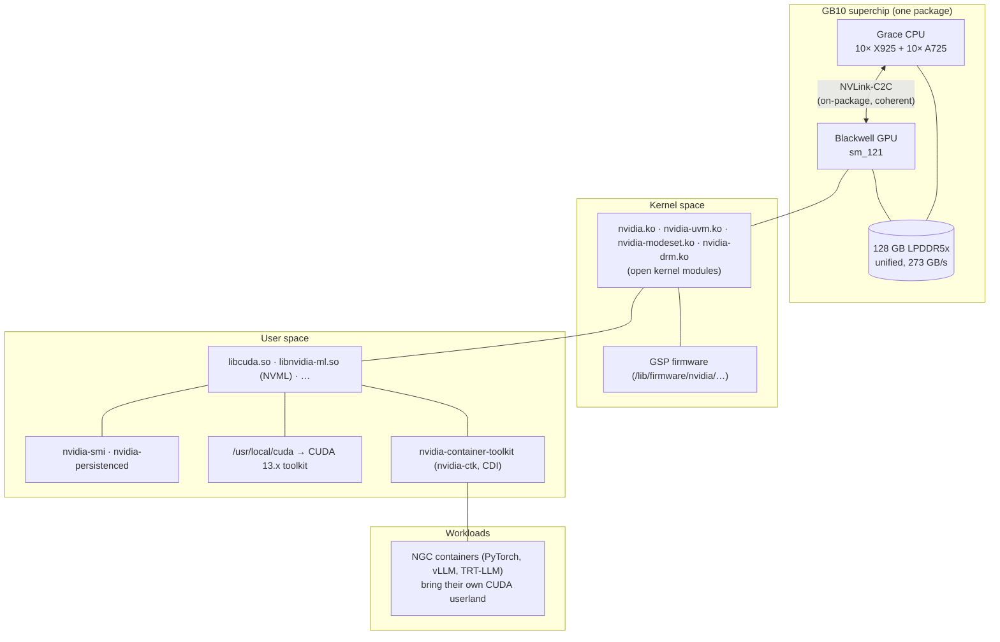

# Step 10 · The NVIDIA Driver Stack on DGX Spark: Audit, Pin, Upgrade Safely (and Where Fabric Manager Fits)

> **01-Ansible · Part II — Node provisioning · Step 10 of 30** · ← [Step 09 · Performance at scale](09-performance-at-scale-ssh-mux-and-mitogen.md) · [All steps](00-ansible-step-by-step-guide.md) · [Step 11 · CUDA, NGC containers & CDI](11-cuda-ngc-containers-and-cdi.md) →

| | |
|---|---|
| **You will build** | A driver-consistency audit (`16-driver-audit.yml`), apt holds that stop accidental driver moves, and a rolling DGX OS upgrade (`17-dgxos-upgrade.yml`: drain → upgrade → reboot → audit/validate → return) |
| **Hardware** | 1–2× DGX Spark |
| **Time** | 60 min (+ upgrade time) |
| **Risk** | Medium during upgrades. Low for the audit |

---

## 1. The stack you're managing



**The invariant every layer depends on:** the loaded kernel module, the module on disk, and the userland libraries (`libnvidia-ml`, `libcuda`) must all be the **same driver version**. Containers bring their own CUDA *toolkit*, but they use the host's `libcuda` through the container toolkit, so a host mismatch breaks every container too.

### 1.1 Where does Fabric Manager fit?

| System | GPU interconnect | Fabric Manager? |
|---|---|---|
| HGX/DGX H100/H200/B200 (8 GPUs + NVSwitch) | NVLink through NVSwitch chips | **Required**. `nvidia-fabricmanager` must match the driver version exactly, or CUDA init fails |
| GB200/GB300 NVL72 | NVLink Switch trays across the rack | Required, plus NVLink management (NMX) |
| **DGX Spark (GB10)** | NVLink-C2C between CPU and GPU **inside one package**; no NVSwitch | **Not used**. Nothing to install or pin |
| Multi-Spark | ConnectX-7 Ethernet/RoCE (Steps 13–14) | Not applicable; NCCL uses the NIC |

On a real HGX node, the rule you'd automate is "Fabric Manager version == driver version, installed together, held together, restarted together". The audit playbook's `nvswitch_present` field is where that check would go. The upgrade playbook's "unhold → upgrade → re-hold" flow is exactly what you'd use for `nvidia-fabricmanager-<branch>`.

---

## 2. LLD: what gets pinned and how

| Mechanism | Where | Effect |
|---|---|---|
| `apt-mark hold` on `^(nvidia-driver-\|nvidia-dkms-\|nvidia-kernel-\|libnvidia-\|nvidia-firmware-\|cuda-drivers)` | `spark_baseline/tasks/packages.yml` | `apt upgrade` and unattended-upgrades skip the driver stack |
| Dynamic package discovery (`package_facts` + regex) | same | No hard-coded package names, so it survives DGX OS renaming packages |
| Unhold → upgrade → re-hold | `17-dgxos-upgrade.yml` | Driver moves only inside a drained, validated window |
| `serial: 1`, `max_fail_percentage: 0` | upgrade play | Never both Sparks at once; the first failure stops the rollout |

> **The DGX Dashboard "Update" button** upgrades packages *and firmware* and then reboots. That's fine for a single personal box. Once the Spark is a shared node (Kubernetes/vCluster and Slurm workloads, a second Spark depending on it), use the playbook so drain, validation and holds wrap the same apt operation. Firmware is covered in Step 28.

---

## 3. Hands-on

### 3.1 Audit

```yaml
# lab/playbooks/16-driver-audit.yml
---
# Is the NVIDIA stack on each Spark internally consistent?
#   kernel module (loaded) == kernel module (on disk) == userland libs == what nvidia-smi reports
# A mismatch is THE classic post-upgrade failure: "Failed to initialize NVML: Driver/library version mismatch".
- name: NVIDIA driver stack audit
  hosts: spark
  become: true
  gather_facts: true
  tasks:
    - name: Loaded kernel module version (/proc/driver/nvidia/version)
      ansible.builtin.slurp:
        src: /proc/driver/nvidia/version
      register: audit_proc
      failed_when: false

    - name: On-disk module version (what will load after reboot)
      ansible.builtin.shell: set -o pipefail; modinfo nvidia | awk '/^version:/{print $2}'
      args: { executable: /bin/bash }
      register: audit_modinfo
      changed_when: false
      failed_when: false

    - name: Userland NVML library version
      ansible.builtin.shell: >-
        set -o pipefail;
        ls /usr/lib/aarch64-linux-gnu/libnvidia-ml.so.* 2>/dev/null
        | sed -n 's/.*libnvidia-ml\.so\.\([0-9][0-9.]*\)$/\1/p' | sort -V | tail -1
      args: { executable: /bin/bash }
      register: audit_nvml
      changed_when: false

    - name: What nvidia-smi says (fails on mismatch)
      ansible.builtin.command: nvidia-smi --query-gpu=driver_version --format=csv,noheader
      register: audit_smi
      changed_when: false
      failed_when: false

    - name: Installed NVIDIA/CUDA packages
      ansible.builtin.package_facts:
        manager: apt

    - name: Persistence daemon state
      ansible.builtin.systemd_service:
        name: nvidia-persistenced
      register: audit_persist
      failed_when: false

    - name: Build report
      ansible.builtin.set_fact:
        driver_audit:
          kernel_running: "{{ ansible_facts.kernel }}"
          module_loaded: >-
            {{ (audit_proc.content | default('') | b64decode
                | regex_search('Kernel Module(?: for [a-z0-9]+)?\s+([0-9.]+)', '\1')
                | default(['none'], true)) | first }}
          module_flavor: "{{ 'open' if 'Open Kernel Module' in (audit_proc.content | default('') | b64decode) else 'proprietary/unknown' }}"
          module_on_disk: "{{ audit_modinfo.stdout | default('none', true) }}"
          nvml_userland: "{{ audit_nvml.stdout | default('none', true) }}"
          nvidia_smi: "{{ audit_smi.stdout if audit_smi.rc == 0 else 'ERROR: ' ~ (audit_smi.stdout ~ audit_smi.stderr) | trim }}"
          persistenced: "{{ audit_persist.status.ActiveState | default('absent') }}"
          held: "{{ ansible_facts.packages.keys() | select('match', spark_nvidia_hold_regex) | list | length }}"
          cuda_pkgs: "{{ ansible_facts.packages.keys() | select('match', '^cuda-toolkit-[0-9]') | list }}"
          nvswitch_present: false     # GB10: GPU<->CPU is NVLink-C2C on package; no NVSwitch, no Fabric Manager

    - name: Show report
      ansible.builtin.debug:
        var: driver_audit

    - name: Verdict
      ansible.builtin.assert:
        that:
          - driver_audit.module_loaded == driver_audit.module_on_disk
          - driver_audit.module_loaded == driver_audit.nvml_userland
          - driver_audit.nvidia_smi == driver_audit.module_loaded
          - driver_audit.module_flavor == 'open'
        fail_msg: >-
          Driver stack inconsistent on {{ inventory_hostname }}:
          loaded={{ driver_audit.module_loaded }} disk={{ driver_audit.module_on_disk }}
          userland={{ driver_audit.nvml_userland }} smi={{ driver_audit.nvidia_smi }}.
          Loaded != disk → reboot pending after an upgrade. Userland != loaded → partial upgrade;
          see Step 10 troubleshooting.
        success_msg: "Driver {{ driver_audit.module_loaded }} ({{ driver_audit.module_flavor }}) consistent"
```

```bash
cd "01-Ansible/lab"
ansible-playbook playbooks/16-driver-audit.yml -K
```

Healthy output (example):

```yaml
driver_audit:
  kernel_running: 6.x-…-nvidia
  module_loaded: 580.82.09
  module_flavor: open
  module_on_disk: 580.82.09
  nvml_userland: 580.82.09
  nvidia_smi: 580.82.09
  persistenced: active
  held: 12
  nvswitch_present: false
```

### 3.2 Rolling upgrade

```yaml
# lab/playbooks/17-dgxos-upgrade.yml
---
# Controlled DGX OS update, one Spark at a time:
#   drain → unhold → apt full-upgrade → reboot → audit + validate → re-hold → return to service
# This is what the DGX Dashboard "Update" button does, wrapped in the safety
# steps a shared/multi-node lab needs.
#
#   ansible-playbook playbooks/17-dgxos-upgrade.yml -l dgx-spark-2 -K
#   ansible-playbook playbooks/17-dgxos-upgrade.yml -K -e upgrade_dry_run=true   # show what would change
- name: Rolling DGX OS upgrade
  hosts: spark
  become: true
  serial: 1
  max_fail_percentage: 0
  vars:
    upgrade_dry_run: false
    upgrade_reboot: true
    upgrade_firmware: false          # fwupd capsules (UEFI/EC/SoC/PD/VBIOS) — see Step 28
  pre_tasks:
    - name: What would be upgraded  # noqa: command-instead-of-module (apt module has no simulate-output mode)
      ansible.builtin.command: apt-get -s full-upgrade
      register: upgrade_sim
      changed_when: false

    - name: Summarise pending upgrades (NVIDIA lines first)
      ansible.builtin.set_fact:
        upgrade_pending: "{{ upgrade_sim.stdout_lines | select('match', '^Inst ') | list }}"
        upgrade_pending_nvidia: "{{ upgrade_sim.stdout_lines | select('match', '^Inst (nvidia|libnvidia|cuda|linux-)') | list }}"

    - name: Report
      ansible.builtin.debug:
        msg:
          - "{{ upgrade_pending | length }} packages pending, {{ upgrade_pending_nvidia | length }} driver/CUDA/kernel"
          - "{{ upgrade_pending_nvidia }}"

    - name: Stop here in dry-run mode
      ansible.builtin.meta: end_host
      when: upgrade_dry_run | bool or upgrade_pending | length == 0

  tasks:
    - name: Drain the node (no forensics, no reboot yet)
      ansible.builtin.include_role:
        name: node_drain
      vars:
        node_drain_collect: false
        node_drain_reboot: false
        node_drain_undrain_after: false
        node_drain_reason: "maint: dgxos upgrade"

    - name: Release NVIDIA holds for this upgrade
      ansible.builtin.shell: >-
        set -o pipefail; apt-mark showhold | grep -E '{{ spark_nvidia_hold_regex }}' | xargs -r apt-mark unhold
      args: { executable: /bin/bash }
      changed_when: true

    - name: Full upgrade (async — kernel/driver postinst can take a while)
      ansible.builtin.apt:
        upgrade: full
        update_cache: true
        autoremove: false
      async: 3600
      poll: 15

    - name: Stage firmware capsules (applied during the next reboot)
      when: upgrade_firmware | bool
      block:
        - name: Refresh LVFS metadata
          ansible.builtin.command: fwupdmgr refresh --force
          register: upgrade_fw_refresh
          changed_when: false
          failed_when: upgrade_fw_refresh.rc not in [0, 2]
        - name: Apply firmware without letting fwupd reboot on its own
          ansible.builtin.command: fwupdmgr update -y --no-reboot-check
          register: upgrade_fw
          changed_when: upgrade_fw.rc == 0
          failed_when: upgrade_fw.rc not in [0, 2]      # 2 = nothing to update

    - name: Reboot and wait for the GPU (capsule flashing can take ~10 min — do NOT cut power)
      ansible.builtin.reboot:
        reboot_timeout: 1800
        post_reboot_delay: 30
        test_command: nvidia-smi -L
      when: upgrade_reboot | bool

    - name: Re-apply holds and baseline (idempotent)
      ansible.builtin.include_role:
        name: spark_baseline
        tasks_from: packages.yml

    - name: Refresh facts
      ansible.builtin.include_role:
        name: spark_facts

    - name: Regenerate CDI spec for the new driver
      ansible.builtin.include_role:
        name: container_runtime
      vars:
        container_runtime_smoke_test: true

    - name: Validate and return to service
      ansible.builtin.include_role:
        name: node_drain
      vars:
        node_drain_k8s: "{{ inventory_hostname in (groups['k8s_control_plane'] | default([])) + (groups['k8s_workers'] | default([])) }}"
        node_drain_collect: false
        node_drain_stop_containers: false
        node_drain_undrain_after: true
```

```bash
ansible-playbook playbooks/17-dgxos-upgrade.yml -K -e upgrade_dry_run=true    # what's pending, on every node
ansible-playbook playbooks/17-dgxos-upgrade.yml -K -l dgx-spark-2                  # canary
ansible-playbook playbooks/16-driver-audit.yml -K -l dgx-spark-2
ansible-playbook playbooks/10-nccl-test.yml -K        # the cross-node check: mixed driver versions?
ansible-playbook playbooks/17-dgxos-upgrade.yml -K -l dgx-spark-1
```

**Canary discipline:** upgrade one Spark, run real work on it (a vLLM or NCCL job), then do the other. For NCCL across two Sparks, keep **matching driver and NCCL versions on both nodes**. A mixed state is only acceptable during the rollout window.

### 3.3 Check what `nvidia-smi` can and can't tell you on a UMA system

```bash
nvidia-smi --query-gpu=name,driver_version,compute_cap,memory.total,memory.used --format=csv
# name, driver_version, compute_cap, memory.total [MiB], memory.used [MiB]
# NVIDIA GB10, 580.xx.xx, 12.1, [N/A], [N/A]     <- expected on unified memory
free -g        # the real memory signal for GPU workloads
```

---

## 4. Integrations

| Downstream | Why it cares about the driver |
|---|---|
| CDI spec (Step 11) | Hard-codes library paths and versions. **Regenerate after every driver change** (the upgrade playbook does) |
| Kubernetes + GPU Operator (Steps 19–20) | Operator validator pods check the host driver; a mismatch blocks the device plugin |
| Slurm (Step 22) | The health check drains a node when `nvidia-smi` fails, which is what a mismatch looks like |
| NCCL (Step 14) | Mixed driver or NCCL versions across Sparks: hangs or crashes at init |
| Drift (Step 26) | `module_loaded != module_on_disk` = "reboot pending", a first-class drift signal |

## 5. Troubleshooting & diagnostics

| Symptom | Meaning | Diagnose | Fix |
|---|---|---|---|
| `Failed to initialize NVML: Driver/library version mismatch` | Userland upgraded, old module still loaded | Audit: `nvml_userland != module_loaded` | Reboot (or unload and reload the modules with the GPU idle: stop persistenced, `rmmod nvidia_uvm nvidia_drm nvidia_modeset nvidia`, `modprobe nvidia`) |
| Audit: `module_loaded != module_on_disk` | Upgrade done, reboot pending | `cat /proc/driver/nvidia/version` vs `modinfo nvidia` | Schedule a reboot through the drain playbook |
| `nvidia-smi` hangs | GPU/driver wedged | `timeout 10 nvidia-smi; echo $?` → 124; `dmesg \| grep -i xid` | Step 29 Runbook A (drain → bug report → reboot) |
| `NVIDIA-SMI has failed because it couldn't communicate with the NVIDIA driver` | Module not loaded | `lsmod \| grep nvidia`; `journalctl -k -b \| grep -i nvidia` | A kernel updated without a matching module? `apt install --reinstall` the matching `linux-modules-nvidia-*`; check Secure Boot/MOK |
| Apt wants to remove `nvidia-*` during an upgrade | Held packages conflict with a new kernel | `apt-get -s full-upgrade \| grep -E '^Remv'` | Don't force it. Let the playbook unhold everything together, or wait for a consistent DGX OS release |
| Containers: `could not select device driver "" with capabilities: [[gpu]]` | Docker has no nvidia runtime/CDI | `docker info \| grep -i runtime` | Step 11 (`03-containers.yml`) |
| CUDA app: `no kernel image is available for execution on the device` | Binary not built for sm_121 | `cuobjdump --list-elf app \| grep sm_` | Rebuild with `-gencode arch=compute_121,code=sm_121` (or embed PTX); use NGC containers built for Blackwell |

Evidence bundle for NVIDIA support:

```bash
sudo nvidia-bug-report.sh          # → nvidia-bug-report.log.gz  (or node_drain_bug_report=true in Step 29)
```

## 6. Validation

- [ ] `16-driver-audit.yml` passes on every Spark, with `module_flavor: open`.
- [ ] `apt-mark showhold` lists the NVIDIA packages; `apt upgrade -s` doesn't touch them.
- [ ] You ran `17-dgxos-upgrade.yml` in dry-run mode, and then for real on one node, with NCCL and a GPU container still working afterwards.
