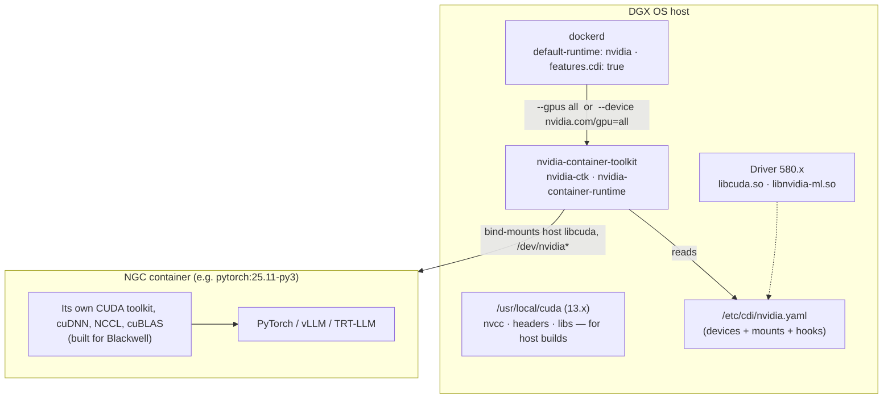

# Chapter 11 · CUDA, NGC Containers & CDI: CUDA 13 and the NVIDIA Container Toolkit on DGX Spark

> **01-Ansible · Part II — Node provisioning · Chapter 11 of 30** · ← [Chapter 10 · NVIDIA driver stack & Fabric Manager](10-nvidia-driver-stack-and-fabric-manager.md) · [All chapters](00-ansible-step-by-step-guide.md) · [Chapter 12 · GPU telemetry & alerting](12-gpu-telemetry-and-alerting.md) →

| | |
|---|---|
| **You will build** | A converged container runtime (Docker default runtime `nvidia`, CDI spec, NGC login from Vault, pre-pulled images) and a two-level smoke test: an sm_121 CUDA binary on the host, and a bf16 matmul in an NGC PyTorch container |
| **Hardware** | 1× DGX Spark |
| **Time** | 60 min (+ image pull time; PyTorch images are large) |
| **Risk** | Low. `daemon.json` is merged rather than overwritten, and a backup is kept |

---

## 1. Architecture

### 1.1 Where CUDA lives: host vs container



**The contract:** containers bring their own CUDA **toolkit and libraries** (cuDNN, cuBLAS, NCCL), and borrow the host's **driver** (`libcuda`, device nodes). So:

- The host driver must be **≥** what the container's CUDA needs (CUDA 13 containers need a 580-series driver or newer).
- **cuDNN on the host is usually unnecessary.** Use NGC images, which ship matched cuDNN/NCCL builds for Blackwell. Install host cuDNN only for native (non-container) builds.
- **Architecture:** the Spark is `linux/arm64`, and NGC publishes arm64 variants for the Spark-relevant images. Always check the manifest (§3.4).

### 1.2 Two ways to request a GPU

| Method | Flag | Mechanism | Notes |
|---|---|---|---|
| Legacy hook | `--gpus all` | `nvidia-container-runtime` prestart hook | Works everywhere; what most docs show |
| **CDI** | `--device nvidia.com/gpu=all` | Container Device Interface spec (`/etc/cdi/nvidia.yaml`) | The standard used by Docker 25+, Podman and containerd/k8s. **Must be regenerated when the driver changes** |

---

## 2. The role

```yaml
# lab/roles/container_runtime/defaults/main.yml
---
# DGX OS ships Docker + NVIDIA Container Toolkit. This role *converges* them to a
# known state rather than installing from scratch.
container_runtime_packages:
  - docker-ce
  - docker-ce-cli
  - containerd.io
  - docker-compose-plugin
  - nvidia-container-toolkit

# Keys merged INTO the existing /etc/docker/daemon.json (we never clobber it).
container_runtime_daemon_overrides:
  default-runtime: nvidia
  runtimes:
    nvidia:
      path: nvidia-container-runtime
      args: []
  log-driver: json-file
  log-opts:
    max-size: 100m
    max-file: "3"
  # Put images on the big NVMe; default /var/lib/docker is already on it on Spark.
  data-root: /var/lib/docker
  features:
    cdi: true

container_runtime_generate_cdi: true
container_runtime_cdi_spec: /etc/cdi/nvidia.yaml

# NGC (nvcr.io) — API key comes from Vault or ansible-vault, never plain text.
container_runtime_ngc_login: false
container_runtime_ngc_api_key: ""        # e.g. "{{ lookup('community.hashi_vault.hashi_vault', 'secret=kv/data/ngc:api_key') }}"

# Images to pre-pull (big — do this once, on a fast link)
container_runtime_prepull: []
#  - nvcr.io/nvidia/pytorch:25.11-py3
#  - nvcr.io/nvidia/vllm:26.01-py3

container_runtime_smoke_image: nvcr.io/nvidia/cuda:13.0.1-base-ubuntu24.04
container_runtime_smoke_test: true
```

```yaml
# lab/roles/container_runtime/tasks/main.yml
---
- name: Ensure container packages are present
  ansible.builtin.apt:
    name: "{{ container_runtime_packages }}"
    state: present
  register: container_runtime_apt
  retries: 3
  delay: 10
  until: container_runtime_apt is succeeded

# ---- daemon.json: read-merge-write (keeps any keys DGX OS or you added) ----
- name: Read current daemon.json
  ansible.builtin.slurp:
    src: /etc/docker/daemon.json
  register: container_runtime_daemon_raw
  failed_when: false

- name: Merge overrides into daemon.json
  ansible.builtin.copy:
    dest: /etc/docker/daemon.json
    content: >-
      {{ ((container_runtime_daemon_raw.content | default('e30=') | b64decode | from_json)
          | combine(container_runtime_daemon_overrides, recursive=True))
         | to_nice_json(indent=2) }}
    owner: root
    group: root
    mode: "0644"
    backup: true
  notify: Restart docker

# ---- CDI: lets docker/podman/containerd request GPUs by name (nvidia.com/gpu=all)
- name: Check CDI spec freshness (driver version present AND every hostPath exists)
  ansible.builtin.shell: |
    set -o pipefail
    spec={{ container_runtime_cdi_spec }}
    [ -f "$spec" ] || { echo "stale: missing"; exit 0; }
    drv=$(nvidia-smi --query-gpu=driver_version --format=csv,noheader | head -1)
    grep -q "$drv" "$spec" || { echo "stale: driver $drv not referenced"; exit 0; }
    missing=$(grep -oP 'hostPath: \K\S+' "$spec" | while read -r f; do [ -e "$f" ] || echo "$f"; done)
    [ -n "$missing" ] && echo "stale: missing paths: $missing" || echo fresh
  args:
    executable: /bin/bash
  register: container_runtime_cdi_state
  changed_when: false
  check_mode: false        # read-only probe: must also run under --check (drift detection)
  when: container_runtime_generate_cdi | bool

- name: Generate CDI spec (driver changed or missing)
  ansible.builtin.command: >-
    nvidia-ctk cdi generate --output={{ container_runtime_cdi_spec }}
  changed_when: true
  when:
    - container_runtime_generate_cdi | bool
    - container_runtime_cdi_state.stdout is match('stale')

- name: Report a stale CDI spec as drift in check mode
  ansible.builtin.debug:
    msg: "CDI spec would be regenerated: {{ container_runtime_cdi_state.stdout }}"
  changed_when: true
  when:
    - ansible_check_mode
    - container_runtime_generate_cdi | bool
    - container_runtime_cdi_state.stdout is match('stale')

- name: Flush handlers so docker restarts before smoke test
  ansible.builtin.meta: flush_handlers

# ---- NGC registry login
- name: Log in to nvcr.io
  community.docker.docker_login:
    registry_url: nvcr.io
    username: "$oauthtoken"
    password: "{{ container_runtime_ngc_api_key }}"
    reauthorize: false
  no_log: true
  when:
    - container_runtime_ngc_login | bool
    - container_runtime_ngc_api_key | length > 0

- name: Pre-pull NGC images (async — multi-GB pulls outlive SSH timeouts)
  community.docker.docker_image_pull:
    name: "{{ item }}"
    platform: linux/arm64
  loop: "{{ container_runtime_prepull }}"
  async: 3600
  poll: 15

# ---- prove the GPU is reachable from a container
- name: GPU smoke test via --gpus (legacy hook path)
  ansible.builtin.command: >-
    docker run --rm --gpus all {{ container_runtime_smoke_image }}
    nvidia-smi --query-gpu=name,driver_version --format=csv,noheader
  register: container_runtime_smoke
  changed_when: false
  check_mode: false        # read-only probe: must also run under --check (drift detection)
  when: container_runtime_smoke_test | bool

- name: GPU smoke test via CDI device name
  ansible.builtin.command: >-
    docker run --rm --device nvidia.com/gpu=all {{ container_runtime_smoke_image }}
    nvidia-smi -L
  register: container_runtime_smoke_cdi
  changed_when: false
  check_mode: false        # read-only probe: must also run under --check (drift detection)
  failed_when: false
  when: container_runtime_smoke_test | bool and container_runtime_generate_cdi | bool

- name: Report container GPU visibility
  ansible.builtin.debug:
    msg:
      - "--gpus : {{ container_runtime_smoke.stdout | default('skipped') }}"
      - "CDI    : {{ container_runtime_smoke_cdi.stdout | default('skipped') }} (rc={{ container_runtime_smoke_cdi.rc | default('-') }})"
```

Design choices:

- **Read, merge, write `daemon.json`.** DGX OS may ship keys you don't know about; `combine(recursive=True)` keeps them, and `backup: true` keeps the previous file.
- **CDI freshness check.** The spec embeds driver-versioned library paths. The role greps the current driver version from `nvidia-smi` in the spec and regenerates it only when it's stale. That's cheap, idempotent, and catches post-upgrade breakage.
- **Both smoke paths** (`--gpus` and CDI) are tested, so you know which one is broken.

---

## 3. Hands-on

### 3.1 Converge the runtime

Your NGC key lives in **vault01** at `kv/spark-lab/ngc` ([Chapter 04 §7](04-dgx-spark-as-semaphore-target.md): `17.1-vault.yml` from the MacBook, then the NGC key stored on vault01 with `vault kv put kv/spark-lab/ngc api_key=-`, Task 7.3). The playbook never sees it in the repository or on a command line:

- **Semaphore UI (normal):** run the template **`11.1 Containers`**. With `vault_lab_secrets_enabled: true` in the variable group, play 1 (`00-vault-cert.yml`) reads `kv/spark-lab/ngc` with its AppRole token (policy `spark-lab-read`) into `hostvars['localhost'].vault_lab_secrets`, and `11.1-containers.yml` passes it to `container_runtime_ngc_api_key` under `no_log`. The task log shows the NGC login task, never the key.
- **Break-glass (MacBook):** there's no AppRole on the MacBook, so play 1 is skipped. Pass the key yourself, read with your own vault01 login:

```bash
# ▶ MacBook · technical-depth (repo root)
cd "01-Ansible/lab"
```

```bash
# ▶ MacBook · 01-Ansible/lab (venv active)
export VAULT_ADDR=https://192.168.0.211:8200 VAULT_CACERT=$PWD/.cache/vault-ca.crt   # vault login first
ansible-playbook playbooks/11.1-containers.yml -l dgx-spark-1,localhost -K \
  -e ngc_api_key="$(vault kv get -field=api_key kv/spark-lab/ngc)"
```

`ngc_api_key` wins when it's set; otherwise the playbook falls back to the vault01 value, and with neither (or the placeholder `REPLACE_ME`) it skips the NGC login. Chapter 18 explains the play 1 pattern.

Check the result:

```bash
# ▶ MacBook · any folder
ssh dgxadmin@192.168.0.100 'docker info --format "{{.DefaultRuntime}} {{json .Runtimes}}"; nvidia-ctk cdi list'
# nvidia {"nvidia":{"path":"nvidia-container-runtime"},"runc":{...}}
# INFO[0000] Found 2 CDI devices
# nvidia.com/gpu=0
# nvidia.com/gpu=all
```

### 3.2 Host CUDA: compile and run natively for sm_121

```cpp
# lab/playbooks/files/uma_probe.cu
// uma_probe.cu — prove sm_121 codegen works and show unified-memory behaviour on GB10.
// Build: nvcc -O2 -gencode arch=compute_121,code=sm_121 -o uma_probe uma_probe.cu
#include <cstdio>
#include <cstdlib>
#include <cuda_runtime.h>

#define CK(x) do { cudaError_t e = (x); if (e != cudaSuccess) { \
  fprintf(stderr, "CUDA error %s at %s:%d\n", cudaGetErrorString(e), __FILE__, __LINE__); return 2; } } while (0)

__global__ void saxpy(size_t n, float a, const float* x, float* y) {
  size_t i = blockIdx.x * (size_t)blockDim.x + threadIdx.x;
  if (i < n) y[i] = a * x[i] + y[i];
}

int main() {
  cudaDeviceProp p; CK(cudaGetDeviceProperties(&p, 0));
  size_t freeB, totalB; CK(cudaMemGetInfo(&freeB, &totalB));
  printf("device=%s cc=%d.%d sms=%d integrated=%d concurrentManaged=%d pageableAccess=%d\n",
         p.name, p.major, p.minor, p.multiProcessorCount, p.integrated,
         p.concurrentManagedAccess, p.pageableMemoryAccess);
  printf("cudaMemGetInfo free=%.1fGiB total=%.1fGiB (on UMA this tracks host memory)\n",
         freeB / 1073741824.0, totalB / 1073741824.0);

  const size_t n = 1ull << 28;               // 268M floats = 1 GiB per array
  float *x, *y;
  // Plain malloc'd memory is GPU-accessible on a coherent system when pageableMemoryAccess=1.
  // We use cudaMallocManaged for portability.
  CK(cudaMallocManaged(&x, n * sizeof(float)));
  CK(cudaMallocManaged(&y, n * sizeof(float)));
  for (size_t i = 0; i < n; ++i) { x[i] = 1.0f; y[i] = 2.0f; }

  cudaEvent_t a, b; cudaEventCreate(&a); cudaEventCreate(&b);
  cudaEventRecord(a);
  saxpy<<<(unsigned)((n + 255) / 256), 256>>>(n, 3.0f, x, y);
  cudaEventRecord(b); CK(cudaEventSynchronize(b));
  CK(cudaGetLastError());
  float ms; cudaEventElapsedTime(&ms, a, b);
  double gbs = 3.0 * n * sizeof(float) / (ms / 1e3) / 1e9;   // 2 reads + 1 write

  size_t bad = 0; for (size_t i = 0; i < n; i += 4096) bad += (y[i] != 5.0f);
  printf("saxpy n=%zu time=%.2fms effective_bw=%.1fGB/s check=%s\n", n, ms, gbs, bad ? "FAIL" : "PASS");
  cudaFree(x); cudaFree(y);
  return bad ? 1 : 0;
}
```

```yaml
# lab/playbooks/11.2-cuda-smoke.yml
---
# CUDA end-to-end on the host AND in a container:
#   1. nvcc compiles for sm_121 and the binary runs (host toolkit OK)
#   2. an NGC PyTorch container sees the GPU and runs a bf16 matmul (runtime + toolkit + CDI OK)
- name: Short-lived SSH certificate from vault01 (Semaphore runs only)
  ansible.builtin.import_playbook: 00-vault-cert.yml

- name: CUDA toolchain and container smoke tests
  hosts: spark
  become: true
  vars:
    cuda_smoke_dir: /opt/spark-lab/cuda-smoke
    cuda_smoke_pytorch_image: nvcr.io/nvidia/pytorch:25.11-py3
    cuda_smoke_run_pytorch: true
  tasks:
    - name: Work directory
      ansible.builtin.file:
        path: "{{ cuda_smoke_dir }}"
        state: directory
        mode: "0755"

    - name: Copy UMA probe source
      ansible.builtin.copy:
        src: uma_probe.cu      # resolved from playbooks/files/
        dest: "{{ cuda_smoke_dir }}/uma_probe.cu"
        mode: "0644"
      register: cuda_smoke_src

    - name: Is the binary already built?
      ansible.builtin.stat:
        path: "{{ cuda_smoke_dir }}/uma_probe"
      register: cuda_smoke_bin

    - name: Compile for Blackwell GB10 (sm_121)
      ansible.builtin.command: >-
        /usr/local/cuda/bin/nvcc -O2 -gencode arch=compute_121,code=sm_121
        -o {{ cuda_smoke_dir }}/uma_probe {{ cuda_smoke_dir }}/uma_probe.cu
      changed_when: true
      when: cuda_smoke_src is changed or not cuda_smoke_bin.stat.exists

    - name: Confirm the binary contains sm_121 SASS
      ansible.builtin.shell: set -o pipefail; /usr/local/cuda/bin/cuobjdump --list-elf {{ cuda_smoke_dir }}/uma_probe | grep -o 'sm_[0-9]*' | sort -u
      args: { executable: /bin/bash }
      register: cuda_smoke_sass
      changed_when: false
      failed_when: "'sm_121' not in cuda_smoke_sass.stdout"

    - name: Run the probe
      ansible.builtin.command: "{{ cuda_smoke_dir }}/uma_probe"
      register: cuda_smoke_run
      changed_when: false

    - name: PyTorch in NGC container (bf16 matmul on GPU)
      ansible.builtin.command:
        argv:
          - docker
          - run
          - --rm
          - --gpus=all
          - --ipc=host
          - "{{ cuda_smoke_pytorch_image }}"
          - python
          - -c
          - |
            import torch, time
            assert torch.cuda.is_available(), "CUDA not visible in container"
            d = torch.cuda.get_device_properties(0)
            a = torch.randn(8192, 8192, device="cuda", dtype=torch.bfloat16)
            torch.cuda.synchronize(); t = time.time()
            for _ in range(20): c = a @ a
            torch.cuda.synchronize(); dt = time.time() - t
            print(f"torch={torch.__version__} cuda={torch.version.cuda} dev={d.name} cc={d.major}.{d.minor} "
                  f"bf16_tflops={20*2*8192**3/dt/1e12:.1f}")
      register: cuda_smoke_torch
      changed_when: false
      when: cuda_smoke_run_pytorch | bool

    - name: Results
      ansible.builtin.debug:
        msg:
          - "SASS     : {{ cuda_smoke_sass.stdout_lines | join(' ') }}"
          - "{{ cuda_smoke_run.stdout_lines }}"
          - "{{ cuda_smoke_torch.stdout | default('pytorch test skipped') }}"
```

**Semaphore UI:** run the template `11.2 CUDA smoke`, or break-glass from the MacBook:

```bash
# ▶ MacBook · 01-Ansible/lab (venv active)
ansible-playbook playbooks/11.2-cuda-smoke.yml -l dgx-spark-1,localhost -K
```

What to look for in the output:

| Field | Expected on GB10 | Meaning |
|---|---|---|
| SASS | `sm_121` | The binary contains native Blackwell code, not just PTX |
| `integrated=1` | 1 | The GPU shares system memory (UMA) |
| `pageableAccess=1` | 1 | The GPU can dereference plain `malloc` pointers (coherent via NVLink-C2C) |
| `cudaMemGetInfo total` | ≈ host MemTotal | There's no separate VRAM, so "GPU memory" means the unified pool |
| saxpy `effective_bw` | a healthy fraction of the 273 GB/s LPDDR5x peak | Memory-bound kernels are bounded by that bandwidth |

> **The same probe is how you debug `cudaErrorMemoryAllocation` at "only 60 GB used".** On UMA, the page cache, other containers and the CPU side of your own process all eat the same pool. Compare `cudaMemGetInfo free` with `MemAvailable`, then see Chapter 29 Runbook C.

### 3.3 Container CUDA: PyTorch

The last task runs a bf16 matmul in `nvcr.io/nvidia/pytorch:25.11-py3` and prints torch/CUDA versions, device name, compute capability (`12.1`) and achieved TFLOPS. Use it as a regression baseline: record the number, and re-run after every driver or DGX OS upgrade (Chapter 10).

### 3.4 Arm64 image hygiene

```bash
# ▶ dgx-spark-1 (ssh dgx-spark-1)
check_arm64() { docker manifest inspect "$1" | jq -r '.manifests[]?.platform | "\(.os)/\(.architecture)"' | sort -u; }
check_arm64 nvcr.io/nvidia/pytorch:25.11-py3
check_arm64 nvcr.io/nvidia/vllm:26.01-py3
```

Build your own images natively on the Spark, or with `docker buildx --platform linux/arm64`. An amd64 image on the Spark fails with `exec format error`, or runs very slowly under emulation if binfmt/QEMU is installed.

### 3.5 Keeping large images under control

```bash
# ▶ dgx-spark-1 (ssh dgx-spark-1)
docker system df
docker image prune -a --filter "until=720h"   # images unused for 30 days
```

Automate it with a weekly systemd timer from Ansible (exercise), but **never** prune images that a running Kubernetes or Slurm job needs. Docker and the kubeadm cluster share **one** containerd (DGX OS's `containerd.io`), but in different containerd namespaces: Docker's images live in `moby`, the kubelet's in `k8s.io`. So `docker image prune` never touches Kubernetes images; prune those with `sudo crictl rmi --prune` (crictl is pointed at containerd by `/etc/crictl.yaml`), which removes only images no container uses. Every vCluster pod is a real container on the root's kubelet, so it shows up in `sudo crictl ps` too. List both sides with `sudo ctr -n moby images ls` and `sudo ctr -n k8s.io images ls`.

---

## 4. Integrations

| System | Integration point |
|---|---|
| Vault (vault01, Chapter 18) | `container_runtime_ngc_api_key` from `kv/spark-lab/ngc`, read by play 1 with Semaphore's AppRole token (or `-e ngc_api_key` on the break-glass path); `no_log` on login. The `community.hashi_vault` lookup in the defaults comment is the alternative for controllers without play 1 |
| Kubernetes (Chapter 19) | The `kubeadm_cluster` role reuses this containerd: it enables the CRI plugin (Docker's stock config disables it), sets `SystemdCgroup = true`, and runs `nvidia-ctk runtime configure --runtime=containerd --set-as-default`. `daemon.json` doesn't affect Kubernetes, but a `systemctl restart containerd` restarts the runtime under **both** Docker and every pod (root and vCluster) |
| GPU Operator (Chapter 20) | `toolkit.enabled=false`: the host toolkit from this chapter is the one used |
| Slurm (Chapter 22) | Jobs run containers via `srun docker run --gpus …` or enroot/pyxis (a plugin that runs container images inside Slurm jobs) |
| Drift (Chapter 26) | `daemon.json` keys and CDI freshness are checked every run |

## 5. Troubleshooting & diagnostics

| Symptom | Diagnose | Fix |
|---|---|---|
| `could not select device driver "" with capabilities: [[gpu]]` | `docker info \| grep -i runtime` | Runtime not registered: `nvidia-ctk runtime configure --runtime=docker` or re-run `11.1-containers.yml`; restart docker |
| `unresolvable CDI devices nvidia.com/gpu=all` | `nvidia-ctk cdi list`; `ls /etc/cdi /var/run/cdi` | Generate the spec; Docker needs `features.cdi: true` (≥ 25) |
| CDI works, then breaks after an upgrade: `failed to stat ... libcuda.so.580.xx` | `grep libcuda /etc/cdi/nvidia.yaml` vs `nvidia-smi` | Stale spec. Re-run the role (the freshness check regenerates it) |
| `exec format error` | `docker image inspect IMG --format '{{.Architecture}}'` | amd64 image. Use an arm64 tag or rebuild |
| `unauthorized: authentication required` from nvcr.io | `cat ~/.docker/config.json \| jq '.auths \| keys'` (as the user who pulls) | Username must be the literal `$oauthtoken`; the key must be valid. Note root's and the user's docker configs are separate |
| Container OOM-killed / CUDA OOM while `nvidia-smi` shows nothing | `free -g`; `docker stats` | UMA: the host pool is exhausted. Add `--memory` limits, stop idle model servers, drop caches (Chapter 29 Runbook C) |
| PyTorch: `no kernel image is available` | The container predates Blackwell support | Use a newer NGC tag built for Blackwell (`sm_120`/`sm_121`) |
| `nvcc fatal: Unsupported gpu architecture 'compute_121'` | `nvcc --version` | The host toolkit is too old; use the CUDA 13.x shipped with DGX OS (`/usr/local/cuda`) |

## 6. Validation

```bash
# ▶ MacBook · 01-Ansible/lab (venv active)
# as dgxadmin; in Semaphore, run `11.2 CUDA smoke` instead of the second line
ansible dgx-spark-1 -b -K -m command -a "docker run --rm --device nvidia.com/gpu=all nvcr.io/nvidia/cuda:13.0.1-base-ubuntu24.04 nvidia-smi -L"
ansible-playbook playbooks/11.2-cuda-smoke.yml -l dgx-spark-1,localhost -K
```

- [ ] Both `--gpus` and CDI smoke tests pass.
- [ ] `uma_probe` shows `cc=12.1 integrated=1 check=PASS`.
- [ ] You recorded the PyTorch bf16 TFLOPS as your baseline.
- [ ] `daemon.json.*~` backup exists, and unrelated keys survived the merge.
