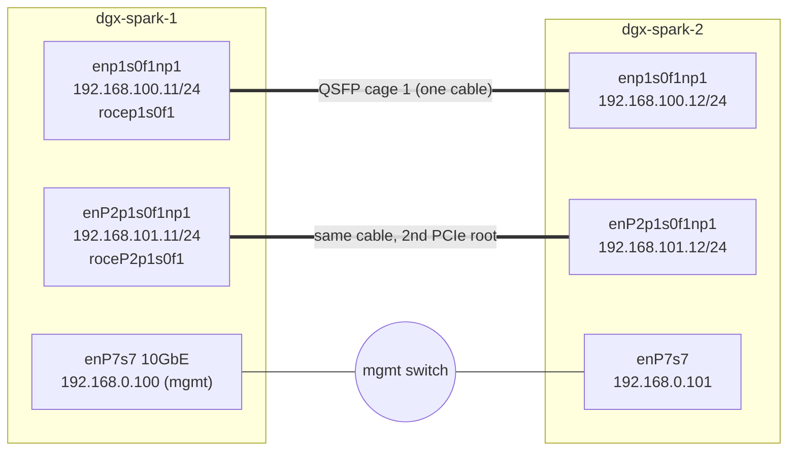

# Step 13 · ConnectX-7 Fabric & OpenSM: RDMA over Converged Ethernet, Topologies & Verification (with the InfiniBand Mapping)

> **01-Ansible · Part III — Fabric & storage · Step 13 of 30** · ← [Step 12 · GPU telemetry & alerting](12-gpu-telemetry-and-alerting.md) · [All steps](00-ansible-step-by-step-guide.md) · [Step 14 · RoCEv2, QoS & NCCL](14-rocev2-qos-and-nccl.md) →

| | |
|---|---|
| **You will build** | Addressed, verified CX-7 links between Sparks (`02-fabric.yml`), RDMA bandwidth and latency measurements (`11-rdma-perftest.yml`), and the mental model to carry this to InfiniBand clusters |
| **Hardware** | 2× DGX Spark + 1 QSFP cable (direct-attach copper for 200G, or an AOC). 3–4 Sparks need a ring or a switch (§2.3) |
| **Time** | 90 min |
| **Risk** | Medium. Network reconfiguration, but only on CX-7 interfaces; management stays on `enP7s7` |

---

## 1. The hardware, precisely

Each Spark has a **ConnectX-7** with **two QSFP cages**, up to 200 Gb/s. Two things confuse everyone the first time:

1. **Each physical cage appears as two netdevs and two RDMA devices**, because the NIC is attached through two PCIe roots:

   | Cage | netdev (root 1) | RDMA dev | netdev (root 2) | RDMA dev |
   |---|---|---|---|---|
   | Port 0 | `enp1s0f0np0` | `rocep1s0f0` | `enP2p1s0f0np0` | `roceP2p1s0f0` |
   | Port 1 | `enp1s0f1np1` | `rocep1s0f1` | `enP2p1s0f1np1` | `roceP2p1s0f1` |

   NVIDIA's guidance is that **one cable can deliver full bandwidth**, but **both logical interfaces of that cage need IP addresses** to get it (and with two cables, all four).

2. **It runs Ethernet, and RDMA is RoCE.** The RDMA device names (`roce…`) say so. There's no InfiniBand subnet manager here. NCCL, NFS/RDMA and perftest all use the RDMA verbs API over RoCEv2 (RDMA in UDP/IP).

## 2. Architecture

### 2.1 HLD: two Sparks, one cable



One **subnet per logical link** (`.100.x` and `.101.x`), so the kernel routes each pair over its own netdev and there's no ambiguity about which interface answers ARP.

### 2.2 LLD

| Setting | Value | Where |
|---|---|---|
| Netplan file | `/etc/netplan/40-cx7.yaml`, mode `0600`, `renderer: networkd` | `cx7_fabric` template |
| Addressing | host_vars `cx7_interfaces[]` | `inventory/host_vars/spark-0N.yml` |
| MTU | 9000 (both ends must match) | host_vars |
| `optional: true` | Boot doesn't wait for an unplugged cable | template |
| Link verification | operstate `up`, speed `200000`, MTU, `ibv_devinfo` `PORT_ACTIVE` | role asserts |
| Reachability | `ping -M do -s 8972` (DF set, jumbo) to each same-subnet peer | role |
| Published facts | `cx7_fabric_primary_if`, `_primary_ip`, `_hca_list`, `_roce_gid_index` | consumed by NCCL, vLLM, Kubernetes (Multus NADs), NFS |

### 2.3 Scaling past two Sparks (NVIDIA-documented topologies)

| Sparks | Topology | Addressing pattern | Notes |
|---|---|---|---|
| 2 | Direct cable | /24 per logical link (this lab) | Simplest |
| 3 | **Ring**: each Spark uses both cages, one to each neighbour | One subnet per link (point-to-point) | NCCL settings for rings: `NCCL_IB_SUBNET_AWARE_ROUTING=1`, `NCCL_NET_PLUGIN=none` |
| 4+ | **Switch** (QSFP56/QSFP56-DD, 200G ports) | One L2 bridge on the switch, one subnet, DHCP from the switch or static | Force 200G on switch ports if autonegotiation lands at 100G; use the same cage on every Spark |

To model a ring in this lab, give each host **two** `cx7_interfaces` groups on different cages with per-link subnets. The role's peer computation (same /24 → peer) already handles it.

---

## 3. Hands-on

### 3.1 Cable and discover

```bash
ssh dgxadmin@192.168.0.100 ibdev2netdev
# rocep1s0f1 port 1 ==> enp1s0f1np1 (Up)
# roceP2p1s0f1 port 1 ==> enP2p1s0f1np1 (Up)
```

Use the **same cage number** on both Sparks. It keeps the config symmetric, and NVIDIA's NCCL guides recommend it. If nothing shows `Up`, reseat the cable and reboot both.

### 3.2 Configure and verify the fabric

```yaml
# lab/roles/cx7_fabric/tasks/main.yml
---
# Everything lives in fabric.yml. We use a conditional include instead of
# `meta: end_host`: end_host would end the host for the WHOLE play, silently
# skipping any roles that follow this one (e.g. in 20-drift-check.yml).
- name: Configure and verify CX-7 fabric
  ansible.builtin.include_tasks: fabric.yml
  when: cx7_fabric_interfaces | length > 0
```

```yaml
# lab/roles/cx7_fabric/tasks/fabric.yml
---
# ---------------------------------------------------------------- pre-flight
- name: Discover RDMA <-> netdev mapping
  ansible.builtin.command: ibdev2netdev
  register: cx7_fabric_ibdev
  changed_when: false
  check_mode: false        # read-only probe: must also run under --check (drift detection)

# "rocep1s0f1 port 1 ==> enp1s0f1np1 (Up)"  ->  {"enp1s0f1np1": {"rdma_dev": "rocep1s0f1", "state": "Up"}}
- name: Parse ibdev2netdev into a dict keyed by netdev
  ansible.builtin.set_fact:
    cx7_fabric_map: >-
      
      
        
        
          
        
      
      {{ m }}

- name: Assert every configured interface exists
  ansible.builtin.assert:
    that: item.name in cx7_fabric_map
    fail_msg: >-
      {{ item.name }} not found. ibdev2netdev shows: {{ cx7_fabric_map.keys() | list }}.
      Fix host_vars/{{ inventory_hostname }}.yml cx7_interfaces.
    quiet: true
  loop: "{{ cx7_fabric_interfaces }}"
  loop_control:
    label: "{{ item.name }}"

# ---------------------------------------------------------------- configure
- name: Render netplan for CX-7
  ansible.builtin.template:
    src: 40-cx7.yaml.j2
    dest: "{{ cx7_fabric_netplan_file }}"
    owner: root
    group: root
    mode: "0600"            # netplan warns on world-readable files
  register: cx7_fabric_netplan

- name: Validate netplan syntax before applying  # noqa: no-handler (must run before apply, in order)
  ansible.builtin.command: netplan generate
  changed_when: false
  check_mode: false        # read-only probe: must also run under --check (drift detection)
  when: cx7_fabric_netplan is changed

- name: Apply netplan  # noqa: no-handler (later verify tasks need the links up in this run)
  ansible.builtin.command: netplan apply
  changed_when: true
  when: cx7_fabric_netplan is changed

- name: Wait for CX-7 links to come up
  ansible.builtin.command: "cat /sys/class/net/{{ item.name }}/operstate"
  register: cx7_fabric_oper
  until: cx7_fabric_oper.stdout == 'up'
  retries: 15
  delay: 2
  changed_when: false
  check_mode: false        # read-only probe: must also run under --check (drift detection)
  failed_when: false
  loop: "{{ cx7_fabric_interfaces }}"
  loop_control:
    label: "{{ item.name }}"

# ---------------------------------------------------------------- runtime reconciliation
# The netplan FILE can be perfect while the RUNNING state is not (someone ran
# `ip link set ... mtu 1500`). Compare live MTU with desired and re-apply.
- name: Read live MTU per interface
  ansible.builtin.command: "cat /sys/class/net/{{ item.name }}/mtu"
  register: cx7_fabric_live_mtu
  changed_when: false
  check_mode: false        # read-only probe: must also run under --check (drift detection)
  loop: "{{ cx7_fabric_interfaces }}"
  loop_control:
    label: "{{ item.name }}"

- name: Interfaces whose runtime MTU differs from desired
  ansible.builtin.set_fact:
    cx7_fabric_runtime_drift: >-
      
      
        
          
        
      
      {{ bad }}

- name: Re-apply netplan to fix runtime drift
  ansible.builtin.command: netplan apply
  changed_when: true
  when:
    - cx7_fabric_runtime_drift | length > 0
    - not ansible_check_mode

- name: Report runtime drift in check mode
  ansible.builtin.debug:
    msg: "Runtime MTU drift on {{ cx7_fabric_runtime_drift }} — netplan apply would fix it"
  changed_when: true
  when:
    - cx7_fabric_runtime_drift | length > 0
    - ansible_check_mode

# ---------------------------------------------------------------- verify
- name: Read link speed / MTU / RDMA port state
  ansible.builtin.shell: |
    set -o pipefail
    printf '{"speed":%s,"mtu":%s,"oper":"%s","rdma_state":"%s"}' \
      "$(cat /sys/class/net/{{ item.name }}/speed 2>/dev/null || echo -1)" \
      "$(cat /sys/class/net/{{ item.name }}/mtu)" \
      "$(cat /sys/class/net/{{ item.name }}/operstate)" \
      "$(ibv_devinfo -d {{ item.rdma_dev }} 2>/dev/null | awk '/state:/{print $2; exit}')"
  args:
    executable: /bin/bash
  register: cx7_fabric_link
  changed_when: false
  check_mode: false        # read-only probe: must also run under --check (drift detection)
  loop: "{{ cx7_fabric_interfaces }}"
  loop_control:
    label: "{{ item.name }}"

- name: Build link report
  ansible.builtin.set_fact:
    cx7_fabric_report: >-
      {{ cx7_fabric_report | default({}) | combine({item.item.name: (item.stdout | from_json)}) }}
  loop: "{{ cx7_fabric_link.results }}"
  loop_control:
    label: "{{ item.item.name }}"

- name: Assert link health
  ansible.builtin.assert:
    that:
      - cx7_fabric_report[item.name].oper == 'up'
      - cx7_fabric_report[item.name].speed | int == cx7_fabric_expected_speed_mbps
      - cx7_fabric_report[item.name].mtu | int == item.mtu | default(9000) | int
      - cx7_fabric_report[item.name].rdma_state == 'PORT_ACTIVE'
    fail_msg: "{{ item.name }} unhealthy: {{ cx7_fabric_report[item.name] }}"
    success_msg: "{{ item.name }} OK: {{ cx7_fabric_report[item.name] }}"
  register: cx7_fabric_assert
  failed_when: cx7_fabric_strict | bool and cx7_fabric_assert.failed | default(false)
  loop: "{{ cx7_fabric_interfaces }}"
  loop_control:
    label: "{{ item.name }}"

- name: Discover RoCEv2 IPv4 GID index (value for NCCL_IB_GID_INDEX)
  ansible.builtin.shell: |
    set -o pipefail
    d=/sys/class/infiniband/{{ item.rdma_dev }}/ports/1
    for t in "$d"/gid_attrs/types/*; do
      idx=$(basename "$t")
      type=$(cat "$t" 2>/dev/null) || continue
      gid=$(cat "$d/gids/$idx")
      # RoCE v2 + IPv4-mapped GID (0000:...:ffff:c0a8:640b)
      if [ "$type" = "RoCE v2" ] && [[ "$gid" == 0000:0000:0000:0000:0000:ffff:* ]]; then
        echo "$idx"; exit 0
      fi
    done
    exit 1
  args:
    executable: /bin/bash
  register: cx7_fabric_gid
  changed_when: false
  check_mode: false        # read-only probe: must also run under --check (drift detection)
  failed_when: false
  loop: "{{ cx7_fabric_interfaces }}"
  loop_control:
    label: "{{ item.rdma_dev }}"

- name: Publish fabric facts for later roles (NCCL, Slurm, Kubernetes, vLLM)
  ansible.builtin.set_fact:
    cx7_fabric_primary_if: "{{ cx7_fabric_interfaces[0].name }}"
    cx7_fabric_primary_ip: "{{ cx7_fabric_interfaces[0].address.split('/')[0] }}"
    cx7_fabric_hca_list: "{{ cx7_fabric_interfaces | map(attribute='rdma_dev') | join(',') }}"
    cx7_fabric_roce_gid_index: "{{ cx7_fabric_gid_index or (cx7_fabric_gid.results[0].stdout | default('', true)) }}"

# Build [peer_ip, my_interface] pairs for peers that share a /24 with one of my ports.
- name: Compute fabric peers
  ansible.builtin.set_fact:
    cx7_fabric_peer_pairs: >-
      
      
        
          
            
              
            
          
        
      
      {{ pairs }}

- name: Jumbo-frame reachability to peers (DF bit set, MTU-28 byte payload)
  ansible.builtin.command: >-
    ping -c 3 -W 1 -M do -s {{ item.mtu | int - 28 }} -I {{ item.dev }} {{ item.ip }}
  loop: "{{ cx7_fabric_peer_pairs }}"
  loop_control:
    label: "{{ item.dev }} -> {{ item.peer }} ({{ item.ip }})"
  changed_when: false
  check_mode: false        # read-only probe: must also run under --check (drift detection)
  when: cx7_fabric_verify_peers | bool
```

```bash
cd "01-Ansible/lab"
ansible-playbook playbooks/02-fabric.yml -K
```

Expected tail:

```
TASK [cx7_fabric : Assert link health]
ok: [dgx-spark-1] => (item=enp1s0f1np1) => msg: 'enp1s0f1np1 OK: {''speed'': 200000, ''mtu'': 9000, ''oper'': ''up'', ''rdma_state'': ''PORT_ACTIVE''}'
TASK [cx7_fabric : Jumbo-frame reachability to peers (DF bit set, MTU-28 byte payload)]
ok: [dgx-spark-1] => (item=enp1s0f1np1 -> dgx-spark-2 (192.168.100.12))
TASK [Print NCCL environment derived from the fabric]
  - export NCCL_SOCKET_IFNAME=enp1s0f1np1
  - export NCCL_IB_HCA=rocep1s0f1,roceP2p1s0f1
  - export NCCL_IB_GID_INDEX=3
```

### 3.3 Measure RDMA

```yaml
# lab/playbooks/11-rdma-perftest.yml
---
# RDMA verbs bandwidth/latency between two Sparks over CX-7 (RoCEv2).
# Server side runs on the 2nd Spark (async), client on the 1st.
#   ansible-playbook playbooks/11-rdma-perftest.yml -K [-e perftest_port_idx=1] [-e perftest_qps=4]
- name: RDMA perftest (ib_write_bw / ib_write_lat)
  hosts: spark
  become: true
  gather_facts: false
  vars:
    perftest_port_idx: 0            # which entry of cx7_interfaces to test
    perftest_qps: 4                 # queue pairs; >1 needed to fill 200G
    perftest_msg: 1048576
    perftest_seconds: 10
    perftest_server: "{{ groups['spark'][1] | default(None) }}"
    perftest_client: "{{ groups['spark'][0] }}"
  tasks:
    - name: Needs two Sparks
      ansible.builtin.meta: end_play
      when: groups['spark'] | length < 2

    - name: Select port + GID index
      ansible.builtin.include_role:
        name: cx7_fabric
        tasks_from: main.yml
      vars:
        cx7_fabric_verify_peers: false
        cx7_fabric_strict: false

    - name: Facts for this port
      ansible.builtin.set_fact:
        perftest_dev: "{{ cx7_interfaces[perftest_port_idx | int].rdma_dev }}"
        perftest_ip: "{{ cx7_interfaces[perftest_port_idx | int].address.split('/')[0] }}"
        perftest_gid: "{{ cx7_fabric_gid.results[perftest_port_idx | int].stdout | default('3', true) }}"

    - name: Start ib_write_bw server (async, one-shot)
      ansible.builtin.command: >-
        timeout 60 ib_write_bw -d {{ perftest_dev }} -x {{ perftest_gid }} -q {{ perftest_qps }}
        -s {{ perftest_msg }} -D {{ perftest_seconds }} --report_gbits -F
      async: 90
      poll: 0
      register: perftest_srv
      changed_when: false
      when: inventory_hostname == perftest_server

    - name: Give the server a moment
      ansible.builtin.pause:
        seconds: 3

    - name: Run ib_write_bw client
      ansible.builtin.command: >-
        ib_write_bw -d {{ perftest_dev }} -x {{ perftest_gid }} -q {{ perftest_qps }}
        -s {{ perftest_msg }} -D {{ perftest_seconds }} --report_gbits -F
        {{ hostvars[perftest_server].perftest_ip }}
      register: perftest_bw
      changed_when: false
      when: inventory_hostname == perftest_client

    - name: Start ib_write_lat server
      ansible.builtin.command: >-
        timeout 60 ib_write_lat -d {{ perftest_dev }} -x {{ perftest_gid }} -F
      async: 90
      poll: 0
      changed_when: false
      when: inventory_hostname == perftest_server

    - name: Pause
      ansible.builtin.pause:
        seconds: 3

    - name: Run ib_write_lat client
      ansible.builtin.command: >-
        ib_write_lat -d {{ perftest_dev }} -x {{ perftest_gid }} -F {{ hostvars[perftest_server].perftest_ip }}
      register: perftest_lat
      changed_when: false
      when: inventory_hostname == perftest_client

    - name: Parse results
      ansible.builtin.set_fact:
        perftest_result:
          device: "{{ perftest_dev }} (GID idx {{ perftest_gid }})"
          bw_gbps: >-
            {{ (perftest_bw.stdout_lines | select('match', '^\s*\d+\s+\d+') | last | default('')).split()[3] | default('n/a') }}
          lat_typical_usec: >-
            {{ (perftest_lat.stdout_lines | select('match', '^\s*\d+\s+\d+') | last | default('')).split()[4] | default('n/a') }}
      when: inventory_hostname == perftest_client

    - name: Report
      ansible.builtin.debug:
        msg:
          - "{{ perftest_result }}"
          - >-
            Each QSFP cage is split across two PCIe roots (two netdevs). One netdev alone typically
            shows about half the cage rate; run idx 0 and 1 together to see the full link.
          - "Low numbers? Check MTU (9000 both ends), -q (QPs), link speed (ethtool), and that GID index is RoCE v2."
      when: inventory_hostname == perftest_client
```

```bash
ansible-playbook playbooks/11-rdma-perftest.yml -K                       # port idx 0
ansible-playbook playbooks/11-rdma-perftest.yml -K -e perftest_port_idx=1
ansible-playbook playbooks/11-rdma-perftest.yml -K -e perftest_qps=1     # see why QPs matter
```

Manual equivalents, for when you're debugging by hand:

```bash
# dgx-spark-2 (server)
ib_write_bw -d rocep1s0f1 -x 3 -q 4 -D 10 --report_gbits -F
# dgx-spark-1 (client)
ib_write_bw -d rocep1s0f1 -x 3 -q 4 -D 10 --report_gbits -F 192.168.100.12
show_gids | grep -E 'rocep1s0f1|v2'          # which index is RoCE v2 + IPv4
```

---

## 4. Carrying it to InfiniBand clusters: the concept map

| Concept | On DGX Spark (RoCE) | On an InfiniBand cluster |
|---|---|---|
| Link layer | Ethernet | InfiniBand |
| Who assigns addresses/routes | You (netplan / DHCP) | **Subnet Manager** (OpenSM or UFM) assigns LIDs and computes routes (fat-tree/ftree, up-down) |
| Addressing | IP → GID (RoCEv2 IPv4-mapped GID; pick the index) | LID (+ GID for routing across subnets) |
| Isolation | VLAN / subnet | P_Key partitions (configured on the SM) |
| IP over the fabric | Native IP | IPoIB (`ib0`, datagram vs connected mode) |
| Congestion / loss | ECN/DCQCN; PFC on switches (Step 14) | Credit-based link-level flow control (lossless by design) |
| Health tools | `ibv_devinfo`, `ethtool -S`, `rdma link` | `ibstat`, `iblinkinfo`, `ibdiagnet`, `perfquery` |
| Ansible's job | netplan, MTU, verify, publish NCCL env | Install DOCA-OFED, configure the SM(s) (HA priority), P_Keys, IPoIB, verify `ibdiagnet` |

What stays the same, and what this step trains: **inventory-driven addressing, pre-flight existence checks, link assertions, peer reachability, and publishing derived facts for NCCL.**

---

## 5. Troubleshooting & diagnostics

| Symptom | Diagnose | Fix |
|---|---|---|
| `ibdev2netdev` shows everything `Down` | Cable seated? Same cage on both ends? | Reseat; try the other cage; reboot both (NVIDIA's documented first step) |
| Role asserts: `configured interface not found` | Names in host_vars vs `ibdev2netdev` | Fix host_vars; names differ between cages |
| Speed `100000` instead of `200000` | `ethtool enp1s0f1np1 \| grep -E 'Speed\|Link'` | Cable rated for 100G; or a switch port autonegotiating: force 200G on the switch |
| `ping -M do -s 8972` fails, plain ping works | MTU mismatch somewhere | Both ends 9000 (`ip link show`); on a switch, the port MTU must be ≥ 9000 plus headers |
| Ping works on `.100`, not on `.101` | Second logical interface not addressed on one side | Both netdevs per cage need IPs; re-run `02-fabric.yml` |
| `PORT_ACTIVE` but perftest `Couldn't connect` | Wrong GID index (a RoCE v1 or link-local GID) | `show_gids`; use the RoCE v2 IPv4 index; pass `-x` |
| perftest reports roughly half the expected rate | Only one logical interface, or `-q 1` | Test both netdevs concurrently; raise `-q` to 4–8 |
| Random loss under load (switch topology) | `ethtool -S enp1s0f1np1 \| grep -E 'discard\|pause\|ecn'` | Congestion: Step 14 (ECN/PFC) |
| Netplan apply cut the mgmt link | You put the mgmt NIC in `40-cx7.yaml` | Never. Mgmt lives in `30-mgmt.yaml` (Step 03) |

Fast triage bundle:

```bash
ibdev2netdev; rdma link show
for d in rocep1s0f1 roceP2p1s0f1; do ibv_devinfo -d $d | grep -E 'state|active_mtu|link_layer'; done
ethtool enp1s0f1np1 | grep -E 'Speed|Duplex|Link detected'
ethtool -S enp1s0f1np1 | grep -Ei 'err|drop|discard' | grep -v ': 0$'
ip -s link show enp1s0f1np1
```

## 6. Validation

- [ ] `02-fabric.yml`: all asserts pass and jumbo pings succeed on both subnets.
- [ ] `11-rdma-perftest.yml` results recorded for idx 0, idx 1 and `-q 1` vs `-q 4`.
- [ ] You can explain why the Spark needs no subnet manager, and what OpenSM would do on an IB cluster.
