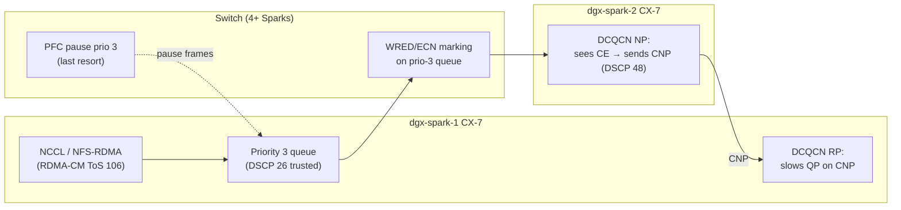
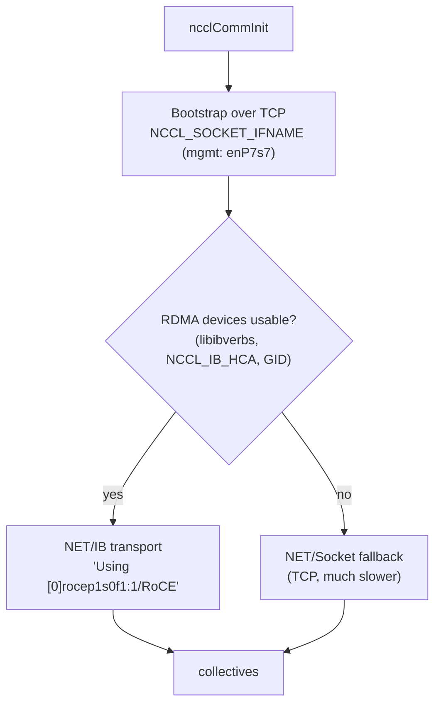

# Chapter 14 · RoCEv2, QoS & NCCL: MTU, DSCP/PFC/ECN, and Proving NCCL Uses RDMA Across Sparks

> **01-Ansible · Part III — Fabric & storage · Chapter 14 of 30** · ← [Chapter 13 · ConnectX-7 fabric & OpenSM](13-connectx7-fabric-and-opensm.md) · [All chapters](00-ansible-step-by-step-guide.md) · [Chapter 15 · NFS over RDMA & parallel file systems](15-nfs-rdma-and-parallel-file-systems.md) →

| | |
|---|---|
| **You will build** | A tuned RoCEv2 path (MTU 9000, optional DSCP/PFC/ECN via `14.1-roce-qos.yml`), a two-node NCCL build and run (`14.2-nccl-test.yml`), and the skill to read NCCL logs to prove the data went over RDMA and not TCP sockets |
| **Hardware** | 2× DGX Spark, direct cable (switch optional) |
| **Time** | 90 min (the NCCL build takes about 10 min per node) |
| **Risk** | Low. QoS settings are runtime-only until you persist them |

---

## 1. What "lossless" means here, and when you need it

RoCEv2 carries RDMA inside UDP/IP. RDMA transports react badly to packet loss, because a drop costs a go-back-N retransmit and throughput collapses. There are three tools:

| Mechanism | Layer | Who configures it | Needed on a direct cable? | Needed with a switch? |
|---|---|---|---|---|
| **MTU 9000** | L2/L3 | Hosts (+ switch ports) | **Yes.** Fewer packets, larger RDMA MTU (4096) | Yes |
| **ECN + DCQCN** | L3 marking + NIC rate control | Switch marks, NIC reacts (RP/NP enable) | No congestion point, so optional | **Yes**, the first line of defence |
| **PFC** (per-priority pause) | L2 | Hosts **and** switch, on the same priority | No | Usually, for the RoCE class only |
| **DSCP trust + ToS** | L3 → priority mapping | Hosts (`mlnx_qos --trust dscp`, RDMA-CM ToS) + switch | Harmless | **Yes**: classify RoCE into the lossless queue |



**Rule of thumb:** direct cable → MTU 9000 is all you need. Switch → match DSCP 26 → prio 3, ECN on, PFC on prio 3 **identically on every host and switch port**. A mismatch is worse than not configuring it at all.

---

## 2. Host QoS playbook (opt-in)

```yaml
# lab/playbooks/14.1-roce-qos.yml
---
# Host-side RoCEv2 QoS for CX-7 — needed when Sparks share a SWITCH with other
# traffic (4+ node topology). On a direct cable it is optional (no congestion point).
#
# Conventional RoCE marking (keep identical on hosts AND switch):
#   RoCE data  : DSCP 26 → priority 3 → PFC enabled on prio 3 (lossless class)
#   CNP (DCQCN): DSCP 48 → priority 6
#   ECN        : marked by the switch, reacted to by the NIC (DCQCN)
#
#   ansible-playbook playbooks/14.1-roce-qos.yml -K [-e roce_qos_pfc=false]   # ECN-only ("lossy RoCE")
- name: RoCEv2 QoS on CX-7 ports
  hosts: spark
  become: true
  gather_facts: false
  vars:
    roce_qos_prio: 3
    roce_qos_dscp: 26
    roce_qos_pfc: true
    roce_qos_tos: "{{ (roce_qos_dscp * 4) + 2 }}"       # DSCP<<2 | ECT(0) = 106
    # "0,0,0,1,0,0,0,0" — PFC on the RoCE priority only
    roce_qos_pfc_vector: >-
      {{ '1' if (p == roce_qos_prio | int and roce_qos_pfc | bool) else '0' }}{{ '' if loop.last else ',' }}
  tasks:
    - name: Check for mlnx_qos (DOCA / MLNX tools)
      ansible.builtin.command: which mlnx_qos
      register: roce_qos_tool
      changed_when: false
      failed_when: false

    - name: Stop with guidance when the tool is missing
      ansible.builtin.meta: end_host
      when: roce_qos_tool.rc != 0

    - name: Read current QoS state
      ansible.builtin.command: "mlnx_qos -i {{ item.name }}"
      loop: "{{ cx7_interfaces }}"
      loop_control: { label: "{{ item.name }}" }
      register: roce_qos_before
      changed_when: false

    - name: Trust DSCP and set PFC vector
      ansible.builtin.command: >-
        mlnx_qos -i {{ item.item.name }} --trust dscp --pfc {{ roce_qos_pfc_vector }}
      loop: "{{ roce_qos_before.results }}"
      loop_control: { label: "{{ item.item.name }}" }
      when: >-
        ('Priority trust state: dscp' not in item.stdout)
        or (roce_qos_pfc and not (item.stdout is search('enabled\s+(\d\s+){' ~ roce_qos_prio ~ '}1')))
      changed_when: true

    - name: Enable ECN reaction point + notification point for the RoCE priority (DCQCN)
      ansible.builtin.shell: |
        set -e
        changed=0
        for role in roce_rp roce_np; do
          f=/sys/class/net/{{ item.name }}/ecn/$role/enable/{{ roce_qos_prio }}
          [ -e "$f" ] || { echo "missing $f"; exit 3; }
          if [ "$(cat $f)" != "1" ]; then echo 1 > $f; changed=1; fi
        done
        echo "changed=$changed"
      args: { executable: /bin/bash }
      loop: "{{ cx7_interfaces }}"
      loop_control: { label: "{{ item.name }}" }
      register: roce_qos_ecn
      changed_when: "'changed=1' in roce_qos_ecn.stdout"
      failed_when: roce_qos_ecn.rc not in [0, 3]

    - name: Default ToS for RDMA-CM connections (NCCL, NFS/RDMA use RDMA-CM)
      ansible.builtin.shell: |
        set -e
        d=/sys/kernel/config/rdma_cm/{{ item.rdma_dev }}
        mountpoint -q /sys/kernel/config || mount -t configfs none /sys/kernel/config
        modprobe rdma_cm
        [ -d "$d" ] || mkdir "$d"
        cur=$(cat $d/ports/1/default_roce_tos)
        if [ "$cur" != "{{ roce_qos_tos }}" ]; then echo {{ roce_qos_tos }} > $d/ports/1/default_roce_tos; echo changed; fi
      args: { executable: /bin/bash }
      loop: "{{ cx7_interfaces }}"
      loop_control: { label: "{{ item.rdma_dev }}" }
      register: roce_qos_cm
      changed_when: "'changed' in roce_qos_cm.stdout"

    - name: Read back
      ansible.builtin.command: "mlnx_qos -i {{ item.name }}"
      loop: "{{ cx7_interfaces }}"
      loop_control: { label: "{{ item.name }}" }
      register: roce_qos_after
      changed_when: false

    - name: Show trust + PFC lines
      ansible.builtin.debug:
        msg: "{{ item.item.name }}: {{ item.stdout_lines | select('search', 'trust|enabled|buffer') | list }}"
      loop: "{{ roce_qos_after.results }}"
      loop_control: { label: "{{ item.item.name }}" }

    - name: Note on persistence
      ansible.builtin.debug:
        msg: >-
          mlnx_qos / sysfs / configfs settings do not survive reboot. Re-run this play from a
          systemd unit or AWX schedule at boot, or bake it into a oneshot service (exercise in Chapter 14).
```

```bash
cd "01-Ansible/lab"
ansible-playbook playbooks/14.1-roce-qos.yml -K
ssh dgxadmin@192.168.0.100 'sudo mlnx_qos -i enp1s0f1np1 | sed -n "1,20p"'
```

Persist it: create a oneshot systemd unit that runs the same commands at boot. Templating that unit is the exercise at the end of this chapter. Or have AWX run the play on a boot-triggered webhook.

---

## 3. NCCL across two Sparks

### 3.1 How NCCL picks a transport



NVIDIA's Spark NCCL guide bootstraps over the **management** interface (`NCCL_SOCKET_IFNAME=enP7s7`, also passed to UCX and Open MPI) and lets NCCL discover the RoCE devices for data. The lab playbook does the same, but pins `NCCL_IB_HCA` from inventory, so it can't pick a wrong or down device.

### 3.2 Build and run

```yaml
# lab/playbooks/14.2-nccl-test.yml
---
# Builds NCCL + nccl-tests for Blackwell (sm_121) on every Spark, then runs
# all_gather_perf across the CX-7 link from the first node. Mirrors NVIDIA's
# "NCCL for Multiple Sparks" playbook, but idempotent and inventory-driven.
- name: Build NCCL and nccl-tests
  hosts: spark
  become: true
  vars:
    nccl_version: v2.30.7-1
    nccl_user: "{{ spark_admin_user }}"
    nccl_home: "/home/{{ spark_admin_user }}"
  tasks:
    - name: Build dependencies
      ansible.builtin.apt:
        name: [libopenmpi-dev, openmpi-bin, build-essential, git]
        state: present

    - name: Clone NCCL
      ansible.builtin.git:
        repo: https://github.com/NVIDIA/nccl.git
        dest: "{{ nccl_home }}/nccl"
        version: "{{ nccl_version }}"
        depth: 1
      become: true
      become_user: "{{ nccl_user }}"

    - name: Build NCCL for sm_121 (≈10 min first time)
      ansible.builtin.command: make -j20 src.build NVCC_GENCODE="-gencode=arch=compute_121,code=sm_121"
      args:
        chdir: "{{ nccl_home }}/nccl"
        creates: "{{ nccl_home }}/nccl/build/lib/libnccl.so"   # rm -rf ~/nccl/build to force a rebuild
      environment:
        CUDA_HOME: /usr/local/cuda
        PATH: "/usr/local/cuda/bin:{{ ansible_env.PATH }}"
      become: true
      become_user: "{{ nccl_user }}"
      async: 3600
      poll: 30

    - name: Clone nccl-tests
      ansible.builtin.git:
        repo: https://github.com/NVIDIA/nccl-tests.git
        dest: "{{ nccl_home }}/nccl-tests"
        version: master
        depth: 1
        update: false
      become: true
      become_user: "{{ nccl_user }}"

    - name: Build nccl-tests with MPI
      ansible.builtin.command: >-
        make -j20 MPI=1 MPI_HOME=/usr/lib/aarch64-linux-gnu/openmpi
        CUDA_HOME=/usr/local/cuda NCCL_HOME={{ nccl_home }}/nccl/build
      args:
        chdir: "{{ nccl_home }}/nccl-tests"
        creates: "{{ nccl_home }}/nccl-tests/build/all_gather_perf"
      become: true
      become_user: "{{ nccl_user }}"

- name: Run all_gather_perf across all Sparks
  hosts: spark[0]
  gather_facts: false
  become: false
  vars:
    nccl_home: "/home/{{ spark_admin_user }}"
    nccl_bytes: 16G
  tasks:
    - name: Skip on single node
      ansible.builtin.meta: end_play
      when: groups['spark'] | length < 2

    - name: Run mpirun over the management network, data over CX-7 RoCE
      ansible.builtin.shell: |
        export LD_LIBRARY_PATH={{ nccl_home }}/nccl/build/lib:/usr/local/cuda/lib64:/usr/lib/aarch64-linux-gnu/openmpi/lib:$LD_LIBRARY_PATH
        mpirun -np {{ groups['spark'] | length }} \
          -H {{ groups['spark'] | map('extract', hostvars, 'ansible_host') | map('regex_replace', '$', ':1') | join(',') }} \
          --mca plm_rsh_agent "ssh -o StrictHostKeyChecking=accept-new" \
          --mca btl_tcp_if_include {{ mgmt_interface }} \
          -x LD_LIBRARY_PATH \
          -x NCCL_SOCKET_IFNAME={{ mgmt_interface }} \
          -x UCX_NET_DEVICES={{ mgmt_interface }} \
          -x NCCL_IB_HCA={{ cx7_interfaces | map(attribute='rdma_dev') | join(',') }} \
          -x NCCL_DEBUG=INFO -x NCCL_DEBUG_SUBSYS=INIT,NET \
          {{ nccl_home }}/nccl-tests/build/all_gather_perf -b {{ nccl_bytes }} -e {{ nccl_bytes }} -f 2
      args:
        executable: /bin/bash
      register: nccl_run
      changed_when: false

    - name: Extract bus bandwidth
      ansible.builtin.set_fact:
        nccl_busbw: "{{ nccl_run.stdout | regex_search('Avg bus bandwidth\\s*:\\s*([\\d.]+)', '\\1') | first | default('n/a') }}"
        nccl_transport: "{{ nccl_run.stdout_lines | select('search', 'NET/IB|NET/Socket|Using network') | list | unique | first | default('unknown') }}"

    - name: Result
      ansible.builtin.debug:
        msg:
          - "Avg bus bandwidth: {{ nccl_busbw }} GB/s"
          - "Transport line   : {{ nccl_transport }}"
          - "If this says NET/Socket, RDMA isn't in use — see Chapter 14 troubleshooting."
```

```bash
ansible-playbook playbooks/14.2-nccl-test.yml -K
```

### 3.3 Prove it used RDMA

With `NCCL_DEBUG=INFO NCCL_DEBUG_SUBSYS=INIT,NET` you'll see lines like:

```
NCCL INFO NET/IB : Using [0]rocep1s0f1:1/RoCE [1]roceP2p1s0f1:1/RoCE ; OOB enP7s7:192.168.0.100<0>
NCCL INFO Channel 00/0 : 0[0] -> 1[0] [send] via NET/IB/0
```

| You see | Meaning | Action |
|---|---|---|
| `NET/IB : Using [...]/RoCE` + `via NET/IB` | RDMA data path ✅ | Compare busbw to your perftest numbers |
| `NET/Socket : Using [0]enP7s7` / `via NET/Socket` | TCP fallback ❌ | Check `NCCL_IB_HCA` names, `ibv_devinfo` state, GID index, whether libibverbs is inside containers |
| `NET/IB : No device found` | verbs can't open devices | `rdma link show`; container needs `/dev/infiniband` + `--cap-add IPC_LOCK` (or `--privileged` for tests) |
| Hang at init | Bootstrap can't connect | Firewall/SSH/MPI on the mgmt network; test `mpirun -np 2 -H a:1,b:1 hostname` first |

### 3.4 Useful NCCL knobs for Spark pairs

| Variable | Typical value | When |
|---|---|---|
| `NCCL_SOCKET_IFNAME` | `enP7s7` (or `wlP9s9` if you only have Wi-Fi, but **all nodes must use the same kind**) | Always |
| `NCCL_IB_HCA` | `rocep1s0f1,roceP2p1s0f1` (from `cx7_fabric_hca_list`) | Pin devices |
| `NCCL_IB_GID_INDEX` | from `cx7_fabric_roce_gid_index` | If autodetection picks a non-v2 GID |
| `NCCL_IB_SUBNET_AWARE_ROUTING=1`, `NCCL_NET_PLUGIN=none` | — | 3-Spark **ring** (NVIDIA guidance) |
| `NCCL_DEBUG=INFO` | — | Whenever you're not sure |

The same variables go into vLLM or TRT-LLM multi-node launches. NVIDIA's vLLM Spark guide passes `NCCL_SOCKET_IFNAME`, `GLOO_SOCKET_IFNAME`, `TP_SOCKET_IFNAME` and `UCX_NET_DEVICES` into the Ray containers. Template them from the fabric facts rather than hand-typing.

---

## 4. Integrations

| Consumer | Uses from this chapter |
|---|---|
| vLLM / TRT-LLM tensor-parallel across 2 Sparks | NCCL env from fabric facts; `--tensor-parallel-size 2` |
| Slurm (Chapter 22) | `srun --mpi=pmix` or `mpirun` jobs inherit the same NCCL env via `/etc/profile.d/nccl.sh` (template it) |
| Kubernetes + Multus (Chapter 21) | Pods need the RDMA device, plus the same GID/HCA choices |
| NFS over RDMA (Chapter 15) | Uses RDMA-CM, so it inherits the ToS set by `14.1-roce-qos.yml` |

## 5. Troubleshooting & diagnostics

| Symptom | Diagnose | Fix |
|---|---|---|
| NCCL busbw far below perftest | NCCL log transport line; `nvidia-smi` clocks during the run | Socket fallback, or only one logical port in `NCCL_IB_HCA` |
| `mpirun` hangs before NCCL starts | `mpirun -np 2 -H ip1:1,ip2:1 hostname` | Passwordless SSH both ways, same username, same paths on both nodes |
| `libnccl.so: cannot open shared object` on node 2 | `-x LD_LIBRARY_PATH` missing / different home dirs | Same build path on both (the playbook builds in `~nvidia` on each) |
| Different results each run, occasional `NCCL WARN NET/IB : Got completion ... error 12` | `ethtool -S` for drops/pauses | Retry-exceeded → loss: MTU mismatch, or QoS mismatch on a switch |
| After enabling PFC, the whole port stalls | Switch/host priority mismatch → pause storms | Remove PFC (`-e roce_qos_pfc=false`), keep ECN; fix the switch config to match |
| `mlnx_qos: command not found` | — | Not all DGX OS images ship MLNX tools; the play skips cleanly. Use the switch-side QoS + ECN sysfs only |

Counters to watch during a run:

```bash
watch -n1 "ethtool -S enp1s0f1np1 | grep -E 'rx_prio3_(bytes|pause)|tx_prio3_(bytes|pause)|rx_discards|np_cnp_sent|rp_cnp_handled'"
```

## 6. Validation

- [ ] NCCL log shows `via NET/IB` for every channel.
- [ ] `all_gather_perf` busbw recorded at 16 GB message size, and within a sensible fraction of your perftest line rate.
- [ ] (Switch users) `mlnx_qos` shows `trust dscp` and PFC `0,0,0,1,0,0,0,0` on every node, matching the switch.
- [ ] (Exercise) QoS persisted through a reboot via a templated systemd oneshot.
