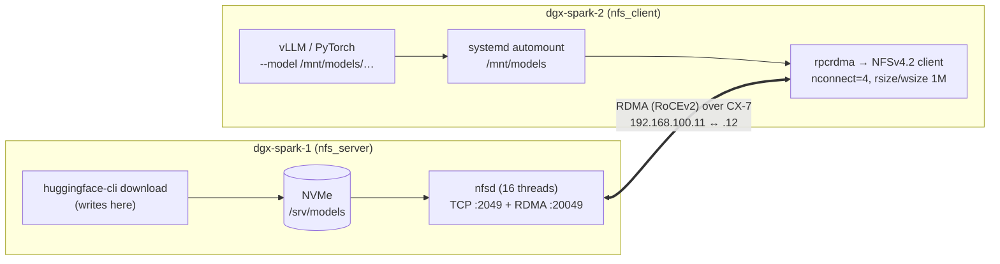

# Step 15 · Shared Storage for a Spark Pair: NFSv4.2 over RDMA as a Model Cache (and How It Maps to Lustre/Weka/VAST Clients)

> **01-Ansible · Part III — Fabric & storage · Step 15 of 30** · ← [Step 14 · RoCEv2, QoS & NCCL](14-rocev2-qos-and-nccl.md) · [All steps](00-ansible-step-by-step-guide.md) · [Step 16 · GPUDirect Storage & cuFile](16-gpudirect-storage-and-cufile.md) →

| | |
|---|---|
| **You will build** | dgx-spark-1 exports `/srv/models` (its NVMe) over **NFSv4.2 on RDMA** across the CX-7 link; dgx-spark-2 mounts it at `/mnt/models` with an automatic TCP fallback. One download of a 70B checkpoint serves both nodes, and tensor-parallel runs see identical paths |
| **Hardware** | 2× DGX Spark with the CX-7 fabric from Step 13 |
| **Time** | 45 min |
| **Risk** | Low. `hard` mounts mean clients hang (rather than corrupt) if the server disappears; `x-systemd.automount` keeps boot from blocking |

---

## 1. Why this design

| Option | Verdict for a Spark pair |
|---|---|
| Download the model on each node | Doubles download time and NVMe usage; versions can drift apart |
| rsync after download | Two copies, manual step, drift |
| **NFS over RDMA** from one Spark's NVMe | ✅ One copy, uses the 200G fabric, kernel-native (no extra software), RDMA offloads the CPU |
| Parallel FS (Lustre, BeeGFS, Weka) | Overkill for two nodes, and needs more servers; right answer for 10s of nodes |

Model weights are **read-mostly**, which is the easy case for NFS: no locking storms, and caching on the client helps.

## 2. Architecture

### 2.1 HLD



### 2.2 LLD

| Setting | Value | Why |
|---|---|---|
| `/etc/nfs.conf [nfsd]` | `rdma=y`, `rdma-port=20049`, `threads=16`, `vers3=n` | RDMA listener on the IANA NFS/RDMA port; v4 only |
| Export | `/srv/models 192.168.100.0/24(rw,async,no_subtree_check,no_root_squash)` (+ `.101`) | Fabric subnets only, so the mgmt LAN can't mount it |
| Client opts | `vers=4.2,proto=rdma,port=20049,nconnect=4,hard,noatime,rsize=1048576,wsize=1048576,_netdev,x-systemd.automount` | RDMA transport, parallel connections, big I/O, safe failure semantics |
| Fallback | Same mount with `proto=tcp` if RDMA fails | Something works while you debug |
| Kernel modules | `rpcrdma` (persisted by `spark_baseline`) | Client and server RDMA transport |

> **`async` export:** faster writes, but the server can acknowledge writes that aren't yet on disk. That's acceptable for a re-downloadable model cache and **not** for checkpoints you can't lose. Use `sync` for a checkpoint export.

---

## 3. Hands-on

```yaml
# lab/roles/nfs_rdma/defaults/main.yml
---
# Shared model/dataset cache: dgx-spark-1 exports its NVMe over NFSv4.2 on RDMA
# (port 20049) across the CX-7 link; dgx-spark-2 mounts it. One copy of a 70 GB
# checkpoint instead of two downloads.
nfs_rdma_export_path: /srv/models
nfs_rdma_mount_path: /mnt/models
nfs_rdma_port: 20049
nfs_rdma_threads: 16
nfs_rdma_server_group: nfs_server
nfs_rdma_client_group: nfs_client
nfs_rdma_export_cidrs: [192.168.100.0/24, 192.168.101.0/24]
nfs_rdma_mount_opts: "vers=4.2,proto=rdma,port={{ nfs_rdma_port }},nconnect=4,hard,noatime,rsize=1048576,wsize=1048576,_netdev,x-systemd.automount"
# Fallback when RDMA isn't available (single Spark, laptop client):
nfs_rdma_tcp_fallback: true
```

```yaml
# lab/roles/nfs_rdma/tasks/main.yml
---
# ------------------------------------------------------------ server
- name: Server side
  when: inventory_hostname in groups[nfs_rdma_server_group] | default([])
  block:
    - name: Install NFS server
      ansible.builtin.apt:
        name: nfs-kernel-server
        state: present

    - name: Export directory
      ansible.builtin.file:
        path: "{{ nfs_rdma_export_path }}"
        state: directory
        owner: "{{ spark_admin_user | default('dgxadmin') }}"
        group: "{{ spark_admin_user | default('dgxadmin') }}"
        mode: "0775"

    - name: Enable RDMA listener + thread count in /etc/nfs.conf
      community.general.ini_file:
        path: /etc/nfs.conf
        section: nfsd
        option: "{{ item.k }}"
        value: "{{ item.v }}"
        mode: "0644"
      loop:
        - { k: rdma, v: "y" }
        - { k: rdma-port, v: "{{ nfs_rdma_port }}" }
        - { k: threads, v: "{{ nfs_rdma_threads }}" }
        - { k: vers3, v: "n" }
      loop_control:
        label: "{{ item.k }}={{ item.v }}"
      notify: Restart nfs-server

    - name: Exports
      ansible.builtin.copy:
        dest: /etc/exports.d/spark-models.exports
        content: |
          # {{ ansible_managed }}
          {{ nfs_rdma_export_path }} {{ c }}(rw,async,no_subtree_check,no_root_squash) 

        owner: root
        group: root
        mode: "0644"
      notify: Re-export

    - name: Start NFS server
      ansible.builtin.service:
        name: nfs-server
        state: started
        enabled: true

    - name: Flush handlers
      ansible.builtin.meta: flush_handlers

    - name: Confirm RDMA listener is registered
      ansible.builtin.command: cat /proc/fs/nfsd/portlist
      register: nfs_rdma_portlist
      changed_when: false
      check_mode: false        # read-only probe: must also run under --check (drift detection)
      failed_when: ("rdma " ~ nfs_rdma_port) not in nfs_rdma_portlist.stdout

# ------------------------------------------------------------ client
- name: Client side
  when: inventory_hostname in groups[nfs_rdma_client_group] | default([])
  block:
    - name: Install NFS client
      ansible.builtin.apt:
        name: nfs-common
        state: present

    - name: Load rpcrdma now (also persisted by spark_baseline)
      community.general.modprobe:
        name: rpcrdma
        state: present

    - name: Pick the server's fabric IP that shares my subnet
      ansible.builtin.set_fact:
        nfs_rdma_server_ip: >-
          {{ hostvars[groups[nfs_rdma_server_group][0]].cx7_interfaces
             | map(attribute='address')
             | select('match', (cx7_interfaces[0].address.split('.')[:3] | join('.')) ~ '\.')
             | map('regex_replace', '/\d+$', '')
             | first }}

    - name: Mount over RDMA
      ansible.posix.mount:
        src: "{{ nfs_rdma_server_ip }}:{{ nfs_rdma_export_path }}"
        path: "{{ nfs_rdma_mount_path }}"
        fstype: nfs4
        opts: "{{ nfs_rdma_mount_opts }}"
        state: mounted
      register: nfs_rdma_mount
      ignore_errors: "{{ nfs_rdma_tcp_fallback }}"

    - name: Fallback to TCP when RDMA mount failed
      ansible.posix.mount:
        src: "{{ nfs_rdma_server_ip }}:{{ nfs_rdma_export_path }}"
        path: "{{ nfs_rdma_mount_path }}"
        fstype: nfs4
        opts: "{{ nfs_rdma_mount_opts | regex_replace('proto=rdma,port=\\d+', 'proto=tcp') }}"
        state: mounted
      when: nfs_rdma_mount is failed

    - name: Verify transport actually in use
      ansible.builtin.shell: |
        set -o pipefail
        grep " {{ nfs_rdma_mount_path }} " /proc/mounts | grep -o 'proto=[a-z]*'
      args:
        executable: /bin/bash
      register: nfs_rdma_proto
      changed_when: false
      check_mode: false        # read-only probe: must also run under --check (drift detection)

    - name: Report transport
      ansible.builtin.debug:
        msg: "{{ nfs_rdma_mount_path }} mounted with {{ nfs_rdma_proto.stdout }}"
```

```bash
cd "01-Ansible/lab"
ansible-playbook playbooks/09-nfs-rdma.yml -K
ssh dgxadmin@192.168.0.101 'nfsstat -m | grep -A1 /mnt/models; cat /proc/fs/nfsd/portlist 2>/dev/null'
# Expect: proto=rdma,port=20049 on the client; "rdma 20049" in the server portlist
```

### 3.1 Put a model in it once, and use it on both nodes

```bash
# on dgx-spark-1 (server side, local disk speed)
docker run --rm -v /srv/models:/models -e HF_TOKEN nvcr.io/nvidia/pytorch:25.11-py3 \
  huggingface-cli download Qwen/Qwen2.5-7B-Instruct --local-dir /models/qwen2.5-7b-instruct
# on dgx-spark-2 (over RDMA)
ls -lh /mnt/models/qwen2.5-7b-instruct/*.safetensors
```

For multi-node vLLM (NVIDIA's Ray-based Spark recipe), mount the **same path** in both containers: `-v /srv/models:/models` on dgx-spark-1 and `-v /mnt/models:/models` on dgx-spark-2, then pass `--model /models/...`. Identical paths inside the containers are what matters.

### 3.2 Measure it

```bash
# dgx-spark-2: sequential read over RDMA (direct I/O, bypass client page cache)
fio --name=seqread --filename=/mnt/models/fio.bin --size=16G --rw=read --bs=1M \
    --ioengine=libaio --iodepth=32 --numjobs=4 --direct=1 --group_reporting
# compare with TCP: remount with proto=tcp (or run the fallback task) and repeat
```

Interpretation: expect a ceiling set by the **server's NVMe** (or its page cache, if the file is hot there), not by the 200G link. RDMA shows up as **lower client CPU** (`top`/`mpstat` during the run) and steadier latency than TCP.

---

## 4. From here to real parallel file systems

The role's shape (server/client blocks, kernel-module pre-reqs, explicit transport verification) is the same shape you'd use for a data-centre storage client:

| Concern | NFS/RDMA (this lab) | Lustre | WekaFS / VAST (client) |
|---|---|---|---|
| Kernel bits | `rpcrdma` (in-tree) | `lustre-client-modules-$(uname -r)`, pinned to the exact kernel | Vendor client/agent; kernel-version coupling |
| Fabric config | RDMA port 20049 | LNet `o2ib` over IB or RoCE (`/etc/modprobe.d/lustre.conf: options lnet networks=o2ib0(enp1s0f1np1)`) | Frontend NICs / DPDK or RDMA config |
| Mount | `nfs4 … proto=rdma` | `mount -t lustre mgs@o2ib:/fs /lustre` | Vendor mount type/options |
| Verify | `/proc/mounts` `proto=rdma`; `nfsstat -m` | `lctl ping`, `lfs df` | Vendor CLI health |
| Ansible risk | Low | **Kernel upgrades break modules**: couple to Step 10's upgrade flow | Same |

The lesson carries over: **every storage client with a kernel module must be part of the kernel/driver upgrade playbook**, or the next DGX OS update leaves nodes unable to mount.

## 5. Integrations

| System | Integration |
|---|---|
| Kubernetes (Step 19) | On the root cluster (`spark-root`), expose `/mnt/models` to platform pods with a `hostPath` volume, or install `csi-driver-nfs` with `mountOptions: [vers=4.2, proto=rdma, port=20049]`. Inside the `llms` vCluster, `llm-serving` enforces Pod Security `baseline`, which forbids `hostPath`; use a PVC instead. The vCluster syncs it to the root (namespace `vc-llms`) and sees the root's StorageClasses, so an NFS-backed class on the root works there too |
| Slurm (Step 22) | Same path on every compute node, so jobs are location-independent |
| Telemetry (Step 12) | node_exporter's `nfs`/`mountstats` collectors expose client RPC latency |
| Drain (Step 29) | Drain the client **before** rebooting the server, or `hard` mounts will hang processes until it's back |

## 6. Troubleshooting & diagnostics

| Symptom | Diagnose | Fix |
|---|---|---|
| Server: `rdma 20049` missing from `/proc/fs/nfsd/portlist` | `journalctl -u nfs-server`; `lsmod \| grep rpcrdma` | `modprobe rpcrdma`; check `/etc/nfs.conf [nfsd] rdma=y`; restart nfs-server |
| Client mount: `mount.nfs4: Protocol not supported` | `lsmod \| grep rpcrdma` on the client | `modprobe rpcrdma` (the role does it); make sure the fabric IP is used, not mgmt |
| Mount falls back to TCP every time | Role output "Fallback to TCP"; `dmesg \| grep -i rpcrdma` | Wrong server IP (mgmt instead of fabric); CX-7 link down (Step 13); port 20049 blocked |
| `Permission denied` / `access denied by server` | `exportfs -v` on the server | Client IP not in the export CIDRs (did you mount via the `.101` subnet but only export `.100`?) |
| Processes stuck in `D` state on the client | Server down/rebooted; `hard` mount waiting | Bring the server back; it's by design. For emergencies: `umount -f -l /mnt/models` |
| Slow small-file workloads | `nfsstat -c`; `mountstats` | NFS isn't for metadata storms; pack datasets (WebDataset/tar) or keep them local |
| Client sees stale files after an update on the server | Attribute caching | `actimeo=` tuning, or remount; version your model directories |

## 7. Validation

- [ ] `/proc/mounts` on dgx-spark-2 shows `proto=rdma,port=20049` for `/mnt/models`.
- [ ] One model downloaded once, loaded on both nodes.
- [ ] `fio` numbers recorded for RDMA vs TCP, with client CPU usage for each.
