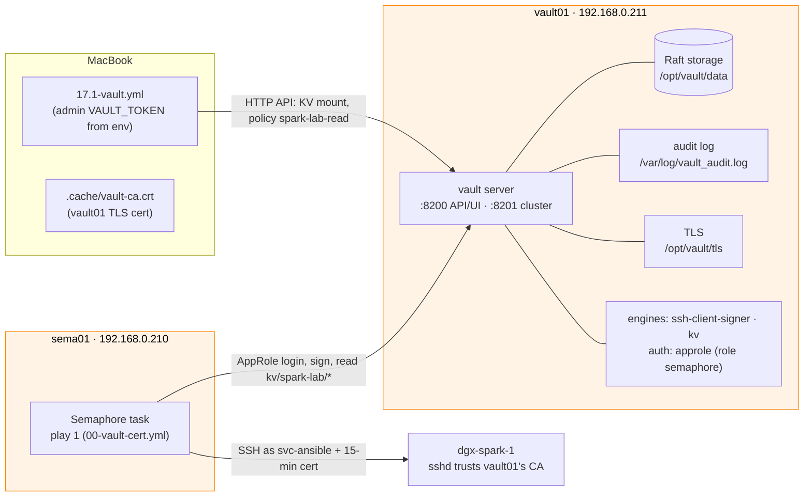
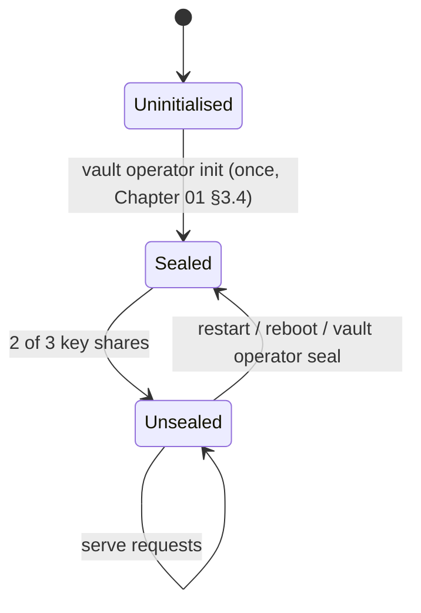

# Chapter 17 · Vault Server Deep Dive: vault01's Raft Storage, TLS, Seal/Unseal, Policies, Audit & Backup

> **01-Ansible · Part IV — Secrets & platforms · Chapter 17 of 30** · ← [Chapter 16 · GPUDirect Storage & cuFile](16-gpudirect-storage-and-cufile.md) · [All chapters](00-ansible-step-by-step-guide.md) · [Chapter 18 · Vault AppRole, secrets & SSH certificates](18-vault-approle-secrets-and-ssh-certificates.md) →
>
> Builds on: [Chapter 01 §3–4](01-management-plane-semaphore-and-vault.md) (vault01 built by hand) · Spark lab additions: [Chapter 04 §7](04-dgx-spark-as-semaphore-target.md) · Ansible integration: [Chapter 18](18-vault-approle-secrets-and-ssh-certificates.md)

| | |
|---|---|
| **You will build** | An operator's understanding of `vault01`, the lab's **single** Vault (built by hand in [Chapter 01 §3–4](01-management-plane-semaphore-and-vault.md)): integrated Raft storage, TLS, the Shamir seal, policies, the audit log and snapshots. Then you add the Spark lab's KV engine and read-only policy with `17.1-vault.yml`, the one playbook that writes to vault01 |
| **Hardware** | `vault01` (192.168.0.211), your MacBook; `sema01` + `dgx-spark-1` for the seal test (§3.3) |
| **Time** | 75 min |
| **Risk** | Medium. **Losing the unseal keys means losing every secret, including the SSH CA that every Semaphore task depends on.** A restart of vault01 halts all new Semaphore tasks until you unseal it (§3.3). Read §5 before you change anything on vault01 |

The Spark lab needs secrets: the NGC API key, later a Grafana admin password, the ansible-vault password, and above all the **SSH CA** that signs the 15-minute certificates every Semaphore task uses. Vault gives you one audited place for them, short-lived credentials, and an API that Semaphore, Ansible, AWX and pods can all use.

**Why Vault lives on vault01, not on the Spark.** `19.2-reset-kubernetes.yml` wipes Kubernetes and a DGX OS reinstall wipes the box. A Vault on the Spark would take the SSH CA (and therefore every automation login) down with it, so you'd need Vault to rebuild the machine that holds Vault. The management plane (sema01 + vault01) stays outside, like out-of-band management in a datacenter ([Chapter 04 §1](04-dgx-spark-as-semaphore-target.md)).

---

## 1. Architecture

### 1.1 HLD



Nobody configures vault01 over SSH from the lab: it isn't in [`inventory/hosts.yml`](lab/inventory/hosts.yml) on purpose. Its address lives in [`group_vars/all.yml`](lab/inventory/group_vars/all.yml) (`vault_addr`, `vault_cacert`, `vault_ssh_*`, `vault_kv_*`).

### 1.2 LLD

| Item | Value on vault01 | Built in |
|---|---|---|
| Package | `vault` from `apt.releases.hashicorp.com` (creates the `vault` user and systemd unit) | Chapter 01 §3.1 |
| Config | `/etc/vault.d/vault.hcl`: `ui = true`, `disable_mlock = true` | Chapter 01 §3.3 |
| Storage | Integrated Raft, `path = /opt/vault/data`, `node_id = vault01` | Chapter 01 §3.3 |
| Listener | `0.0.0.0:8200`, TLS | Chapter 01 §3.3 |
| `api_addr` / `cluster_addr` | `https://192.168.0.211:8200` / `:8201` | Chapter 01 §3.3 |
| TLS | Self-signed RSA-4096 **leaf** certificate (`CA:FALSE`), SANs `IP:192.168.0.211`, `DNS:vault01`, 365 days, in `/opt/vault/tls/`; public copy `~/vault-ca.crt` | Chapter 01 §3.2–3.3 |
| Seal | Shamir, **3 shares, threshold 2** | Chapter 01 §3.4 |
| Audit | `file` device → `/var/log/vault_audit.log` | Chapter 01 §3.5 |
| SSH CA | engine `ssh-client-signer/`, role `ansible` (principal `svc-ansible`, ttl 15m, max 1h) | Chapter 01 §4 |
| AppRole | `auth/approle/role/semaphore`: policy `semaphore-ssh`, token ttl 10m, max 30m | Chapter 01 §4 |
| Lab secrets | KV v2 at `kv/`, policy `spark-lab-read` for `kv/spark-lab/*`, attached to AppRole `semaphore` | **`17.1-vault.yml`** (Chapter 04 §7) |
| Firewall | 8200 from 192.168.0.0/24 only | Chapter 01 §2.1 |

Where the controllers find the TLS certificate (`vault_cacert` in `group_vars/all.yml`): inside the Semaphore container it's `/etc/semaphore/vault-ca.crt` (mounted in Chapter 01 §7.3); on the MacBook it's `lab/.cache/vault-ca.crt` (copied in Chapter 04 §2).

### 1.3 Who builds what

| Object | Built by | The lab's playbooks |
|---|---|---|
| Install, TLS, `vault.hcl`, init, unseal, audit device | You, by hand ([Chapter 01 §3](01-management-plane-semaphore-and-vault.md)) | never touch it |
| SSH engine, signing role `ansible`, policy `semaphore-ssh`, AppRole `semaphore` | You, by hand ([Chapter 01 §4](01-management-plane-semaphore-and-vault.md)) | `17.1-vault.yml` **checks** them (asserts), never rewrites them |
| KV v2 `kv/`, policy `spark-lab-read`, its attachment to AppRole `semaphore`, placeholder `kv/spark-lab/ngc` | `17.1-vault.yml` (role [`vault_config`](lab/roles/vault_config/)), from the MacBook with an admin token | idempotent: read → compare → write |
| The real NGC key, `kv/spark-lab/ansible-vault` | You, `vault kv put` | read by play 1 / `tools/vault-pass.sh` |

### 1.4 Seal/unseal, briefly and practically

Vault encrypts everything in storage with a **data encryption key** (the keyring). The keyring is encrypted with the **root key**, which exists only in memory after an unseal. With Shamir sealing the root key is split into shares: on vault01, 3 shares, and any 2 reconstruct it. After **every restart Vault comes up sealed** and answers almost every request with `503 Vault is sealed` until it's unsealed. Then:

- play 1 of every Semaphore task fails at **Log in to Vault with AppRole**, so no new certificates are issued;
- certificates already issued keep working until they expire (sshd checks them offline against the CA public key);
- the public CA key and `sys/health` are the only things that still answer.

That's why production uses **auto-unseal** (§5).



### 1.5 Integrated Raft storage

Raft is Vault's built-in, replicated storage: no Consul, no external database. Every node holds a full copy; one node is the **leader** and takes all writes; a write is committed when a **quorum** (more than half) of the nodes has it.

| Nodes | Quorum | Failures tolerated | Comment |
|---|---|---|---|
| 1 (vault01 today) | 1 | 0 | fine for a lab; a lost disk = restore from snapshot |
| 2 | 2 | 0 | worse than one: twice the hardware, no extra tolerance |
| 3 | 2 | 1 | minimum for HA |
| 5 | 3 | 2 | production for important estates |

`node_id` names the node in the cluster, `cluster_addr` (port 8201) carries Raft replication and request forwarding, and new nodes join with `retry_join` blocks in their `vault.hcl`. Additional nodes belong next to vault01 in the management plane (VMs), **not** on the Sparks, for the reason at the top of this step. Even a single-node Raft cluster gives you **snapshots** (§3.5), which is the backup unit.

### 1.6 Policies: deny by default, paths and capabilities

Every token carries a list of policies. Anything not explicitly granted is denied. A policy is a list of **paths** (exact or with `*` / `+` globs) and **capabilities** (`create`, `read`, `update`, `delete`, `list`, `sudo`, `deny`). These are the policies on vault01:

```hcl
# semaphore-ssh (Chapter 01 §4): the only thing play 1 may do with SSH is ask for a signature from role ansible
path "ssh-client-signer/sign/ansible" {
  capabilities = ["create", "update"]   # signing is a write in Vault's API
}
```

```hcl
# spark-lab-read (17.1-vault.yml / roles/vault_config/defaults/main.yml): read the lab's secrets, nothing else
path "kv/data/spark-lab/*"     { capabilities = ["read"] }
path "kv/metadata/spark-lab/*" { capabilities = ["list", "read"] }
```

The `default` policy (attached to every token) lets a token look itself up and renew itself. The **root token** bypasses policies entirely, which is why it's for bootstrap only (§5).

> **KV v2 path gotcha:** the API path for *reading* is `kv/data/<path>`, for *listing* `kv/metadata/<path>`. Policies must use those exact prefixes; the CLI (`vault kv get kv/spark-lab/ngc`) hides the `data/` segment from you. `vault token capabilities <path>` tells you what the current token can do on a path.

---

## 2. Automating Vault with Ansible

### 2.1 Building a Vault server with Ansible (concepts; not a lab task)

In this lab vault01 is built **by hand** with [Chapter 01 §3](01-management-plane-semaphore-and-vault.md), on purpose: it's the trust anchor, it's built once, and every step teaches something. When you manage many Vault clusters, you automate the build. The patterns that matter:

- **TLS with `community.crypto`** (`openssl_privatekey`, `openssl_csr_pipe`, `x509_certificate`), which is idempotent: a re-run doesn't regenerate keys unless they're missing or expiring.
- **`vault operator init` guarded** by `sys/seal-status.initialized`. Running init twice on a live cluster would be catastrophic, and the guard makes it impossible from Ansible.
- **`no_log: true`** on every task that touches keys or tokens. Without it they'd end up in `ansible.log`, the Semaphore task log, AWX job output and ARA.
- **HTTP API via `uri`** for status (no CLI parsing); the CLI for init and unseal, which have no clean idempotent wrapper.
- **Where the init output goes.** This is the hard part. Writing the unseal keys and root token to a file on the controller is the classic anti-pattern: that file *is* your whole Vault. Use `-pgp-keys` (each share encrypted to a different person) or auto-unseal.

> **Illustrative only, not part of this lab.** A trimmed excerpt of what such a role looks like. It's for a dedicated Vault host in its own inventory group; the Spark lab has no such group, and vault01 is never configured by the lab's playbooks.

```yaml
# ILLUSTRATIVE — a Vault-server role for a fleet of Vault hosts (not in this repository)
- name: Read seal status
  ansible.builtin.uri:
    url: "https://{{ ansible_host }}:8200/v1/sys/seal-status"
    ca_path: /opt/vault/tls/vault.crt
  register: vault_seal

- name: Initialise Vault (first run only; shares PGP-encrypted to three operators)
  ansible.builtin.command: >-
    vault operator init -format=json -key-shares=3 -key-threshold=2
    -pgp-keys=/etc/vault.d/ops1.asc,/etc/vault.d/ops2.asc,/etc/vault.d/ops3.asc
  environment:
    VAULT_ADDR: "https://{{ ansible_host }}:8200"
    VAULT_CACERT: /opt/vault/tls/vault.crt
  register: vault_init
  when: not vault_seal.json.initialized
  changed_when: true
  no_log: true          # the output still holds the (encrypted) shares and the root token

- name: Confirm unsealed (unsealing itself is done by humans or by auto-unseal)
  ansible.builtin.uri:
    url: "https://{{ ansible_host }}:8200/v1/sys/health"
    ca_path: /opt/vault/tls/vault.crt
    status_code: [200]
  register: vault_health
  retries: 10
  delay: 3
  until: vault_health.status == 200
```

`sys/health` encodes the state in the status code (200 active, 429 standby, 501 not initialised, 503 sealed), which makes it a natural `until:` condition and a load-balancer health check.

### 2.2 What the lab automates: `vault_config` (real lab code)

The only playbook that writes to vault01 is [`17.1-vault.yml`](lab/playbooks/17.1-vault.yml), which runs the role [`vault_config`](lab/roles/vault_config/tasks/main.yml) on `localhost` against vault01's HTTP API. Every step is **read → compare → write only when different**, and what Chapter 01 built is checked, never rewritten:

```yaml
# lab/roles/vault_config/tasks/main.yml (excerpt)
- name: An admin token is required for this run
  ansible.builtin.assert:
    that: vault_config_token | length > 0          # lookup('env', 'VAULT_TOKEN'): never stored
    fail_msg: "export VAULT_TOKEN=<admin token from vault01> and run again (Chapter 04 §7)"
    quiet: true

- name: The signing role must exist and allow the automation account
  ansible.builtin.assert:
    that:
      - vault_config_sshrole.status == 200
      - vault_config_ssh_principal in (vault_config_sshrole.json.data.allowed_users | split(','))
    quiet: true

- name: Attach the lab policy to the Semaphore AppRole (keeps its existing policies)
  ansible.builtin.uri:
    url: "{{ vault_config_addr }}/v1/auth/approle/role/{{ vault_config_approle }}"
    method: POST
    headers: "{{ vault_config_headers }}"
    ca_path: "{{ vault_config_cacert }}"
    body_format: json
    body:
      token_policies: "{{ vault_config_role.json.data.token_policies + [vault_config_policy_name] }}"
    status_code: [200, 204]
  when: vault_config_policy_name not in vault_config_role.json.data.token_policies
  changed_when: true

- name: Seed placeholder secrets (only if absent)
  ansible.builtin.uri:
    url: "{{ vault_config_addr }}/v1/{{ vault_config_kv_mount }}/data/{{ vault_config_kv_prefix }}/{{ item.key }}"
    method: POST
    body: { data: "{{ item.value }}", options: { cas: 0 } }   # cas=0: write only when the secret does not exist
    status_code: [200, 204, 400]
    # … headers, ca_path, loop, no_log as in the file
```

Things to notice:

- **Attach, don't replace.** Writing `token_policies` replaces the whole list. The role appends to what it read, so `semaphore-ssh` survives. A naive `token_policies: [spark-lab-read]` would silently break every Semaphore task's SSH signing.
- **`cas: 0`** (check-and-set) makes the seed write fail with 400 when the secret already exists, so a re-run never overwrites your real NGC key with `REPLACE_ME`.
- **The admin token comes from the environment** and lives only in that shell. Semaphore never holds it: its AppRole can sign and read, nothing else. That's why `17.1-vault.yml` runs from the MacBook and isn't in `site.yml`.

---

## 3. Hands-on

All commands are against vault01. Run the `vault` CLI either **on vault01** (the Chapter 01 setup: `VAULT_ADDR`, `VAULT_CACERT=$HOME/vault-ca.crt`) or **on your MacBook** if you installed the CLI there:

```bash
# ▶ MacBook · 01-Ansible/lab (venv active)
cd ~/technical-depth/"01-Ansible/lab"                                         # MacBook: the lab folder
export VAULT_ADDR=https://192.168.0.211:8200 VAULT_CACERT=$PWD/.cache/vault-ca.crt   # vault01 + its TLS cert (Chapter 04 §2)
vault login                                                                   # admin token (the root token in the lab)
```

### 3.1 Inspect vault01

```bash
# ▶ MacBook · 01-Ansible/lab (venv active)
# same shell as above: VAULT_ADDR, VAULT_CACERT and the vault login are set
vault status                         # Initialized true, Sealed false, Total Shares 3, Threshold 2, Storage Type raft, HA Enabled true
vault operator raft list-peers       # one peer: vault01, State leader, Voter true
vault secrets list                   # ssh-client-signer/ (Chapter 01), kv/ once 17.1 has run, plus cubbyhole/, identity/, sys/
vault auth list                      # approle/ and token/
vault audit list                     # file/  file_path=/var/log/vault_audit.log
vault policy list                    # default, semaphore-ssh, root; spark-lab-read once 17.1 has run
vault read ssh-client-signer/roles/ansible | grep -E 'allowed_users|ttl'   # svc-ansible, 15m, 1h
```

### 3.2 Add the Spark lab's KV engine and policy (vault01 + MacBook)

This is [Chapter 04 §7](04-dgx-spark-as-semaphore-target.md) (Tasks 7.1–7.3); skip the first run if you already did it there. The `vault` program runs on vault01; the playbook runs on the MacBook and only needs the token.

```bash
# ▶ vault01 (ssh vault01)
vault login                                      # Initial Root Token (Chapter 01 §3.4)
vault print token                                # copy it for the MacBook
```

```bash
# ▶ MacBook · 01-Ansible/lab (venv active)
read -s "VAULT_TOKEN?Vault admin token: " && export VAULT_TOKEN   # zsh; paste the token (not shown, not saved)
ansible-playbook playbooks/17.1-vault.yml          # localhost only: talks to vault01's API
ansible-playbook playbooks/17.1-vault.yml          # run it AGAIN: every task ok, changed=0 (idempotent)
unset VAULT_TOKEN                                # no admin token left in the shell
```

```bash
# ▶ vault01 (ssh vault01)
read -rsp "NGC key: " NGC_KEY; echo                                     # paste the nvapi-… key, Enter (not shown)
printf %s "$NGC_KEY" | vault kv put kv/spark-lab/ngc api_key=-   # "-" = take the value from the line before; no trailing newline
unset NGC_KEY
```

**Verify:**

```bash
# ▶ vault01 (ssh vault01)
vault read -field=token_policies auth/approle/role/semaphore     # [semaphore-ssh spark-lab-read]
vault policy read spark-lab-read                                 # the two kv/… paths from §1.6
vault kv metadata get kv/spark-lab/ngc | grep current_version   # 2 (version 1 = the placeholder, 2 = your key)
```

**Semaphore UI:** then set `vault_lab_secrets_enabled` to `true` in the variable group `vault-approle` (Chapter 04 §7), so play 1 reads the lab secrets.

### 3.3 Prove the seal behaviour (vault01 + Semaphore)

```bash
# ▶ vault01 (ssh vault01)
sudo systemctl restart vault         # on vault01
vault status | grep Sealed           # true
curl -s --cacert $VAULT_CACERT $VAULT_ADDR/v1/sys/health -o /dev/null -w '%{http_code}\n'   # 503
```

**Semaphore UI:** in project `spark-lab`, run **04.2 Ping**: play 1 fails at *Log in to Vault with AppRole* (status 503, details hidden by `no_log`), and no host play runs. That's the whole lab stopping on one sealed Vault.

```bash
# ▶ vault01 (ssh vault01)
vault operator unseal                # on vault01: key share 1 of 2
vault operator unseal                # key share 2 → Sealed false
vault status | grep -E 'Sealed|HA Mode'   # Sealed false, HA Mode active
```

**Semaphore UI:** run **04.2 Ping** again: `failed=0`. Lesson: the unseal keys are an operational dependency of every task, so who holds them and how fast they can respond is part of the design (§5).

### 3.4 Read the audit log (on vault01)

The `file` audit device writes one JSON line per request and one per response. Values are **HMAC'd** (salted SHA-256), so the log proves *that* something was read without revealing *what*.

```bash
# ▶ vault01 (ssh vault01)
# The last Semaphore runs: who, which path, which AppRole
sudo jq -c 'select(.type=="response") | {time, path: .request.path, who: .auth.display_name, role: .auth.metadata.role_name}' \
  /var/log/vault_audit.log | tail -6
# expect: auth/approle/login, ssh-client-signer/sign/ansible and (if enabled) kv/data/spark-lab/ngc, role "semaphore"

# The requested principal is HMAC'd; prove it was svc-ansible without un-hashing anything
sudo jq -r 'select(.type=="request" and .request.path=="ssh-client-signer/sign/ansible") | .request.data.valid_principals' \
  /var/log/vault_audit.log | tail -1                          # hmac-sha256:…
vault write -field=hash sys/audit-hash/file input=svc-ansible   # the same hmac-sha256:… value
```

`sys/audit-hash/<device>` hashes an input with that device's salt. It's how an investigator checks "was this value used?" without the log ever storing it.

### 3.5 Backups: Raft snapshots (on vault01)

A snapshot is a consistent copy of the whole Raft store: secrets, policies, the SSH CA key, AppRoles, secret_id accessors.

```bash
# ▶ vault01 (ssh vault01)
mkdir -p ~/vault-backups && chmod 700 ~/vault-backups
vault operator raft snapshot save ~/vault-backups/raft-$(date +%Y%m%d-%H%M).snap
ls -l ~/vault-backups                 # a few hundred KB in the lab
```

**Restore drill** (do it once, right after a snapshot, and change nothing else on vault01 in between: a restore rolls back *everything* to the snapshot):

```bash
# ▶ vault01 (ssh vault01)
vault kv put kv/spark-lab/drill canary=before          # a throwaway secret
vault operator raft snapshot save ~/vault-backups/drill.snap
vault kv delete kv/spark-lab/drill                     # "lose" it
vault operator raft snapshot restore -force ~/vault-backups/drill.snap
vault kv get -field=canary kv/spark-lab/drill          # before
vault kv metadata delete kv/spark-lab/drill            # clean up
```

A snapshot is useless without the unseal keys that were valid **when it was taken**, so store the two together and offline. Schedule snapshots on vault01 itself (cron or a systemd timer with a snapshot-only token). In an estate where Vault nodes are Ansible-managed hosts, the same thing is a task:

```yaml
# ILLUSTRATIVE — for an inventory that contains the Vault nodes (vault01 is deliberately not in the lab's)
- name: Raft snapshot
  ansible.builtin.command: >
    vault operator raft snapshot save /var/backups/vault/raft-{{ now(fmt='%Y%m%d-%H%M') }}.snap
  environment:
    VAULT_ADDR: "https://127.0.0.1:8200"
    VAULT_TOKEN: "{{ vault_backup_token }}"   # a token whose policy allows only the snapshot endpoint
  changed_when: true
```

### 3.6 Metrics (optional, on vault01)

Chapter 01's `vault.hcl` has no `telemetry` block, so Prometheus-format metrics are off. Add it, and practise the restart → unseal cycle while you're at it:

```bash
# ▶ vault01 (ssh vault01)
sudo tee -a /etc/vault.d/vault.hcl <<'EOF'
telemetry {
  prometheus_retention_time = "24h"   # keep metrics in memory for the Prometheus endpoint
  disable_hostname          = true    # metric names without the hostname prefix
}
EOF
sudo systemctl restart vault && vault operator unseal && vault operator unseal   # restart re-seals: two shares
curl -s --cacert $VAULT_CACERT -H "X-Vault-Token: $(vault print token)" \
  "$VAULT_ADDR/v1/sys/metrics?format=prometheus" | grep -E '^vault_core_unsealed|^vault_raft'
```

Chapter 12's Prometheus can scrape this with a token whose policy allows `read` on `sys/metrics`. Alert on `vault_core_unsealed == 0`: that alert means "no Semaphore task can start".

### 3.7 Retire the root token for `17.1-vault.yml` (on vault01)

`17.1-vault.yml` doesn't need root. Give it exactly what `vault_config` touches, as a short-lived token:

```bash
# ▶ vault01 (ssh vault01)
vault policy write spark-lab-admin - <<'EOF'
path "ssh-client-signer/roles/ansible"  { capabilities = ["read"] }                       # check the Chapter 01 signing role
path "auth/approle/role/semaphore"      { capabilities = ["read", "create", "update"] }   # check + attach the policy
path "sys/mounts"                       { capabilities = ["read"] }                       # list engines
path "sys/mounts/kv"                    { capabilities = ["create", "update", "sudo"] }   # mount kv/ once
path "sys/policies/acl/spark-lab-read"  { capabilities = ["read", "create", "update"] }   # the lab policy only
path "kv/data/spark-lab/*"              { capabilities = ["create", "read", "update"] }   # seed + vault kv put
path "kv/metadata/spark-lab/*"          { capabilities = ["list", "read"] }
EOF
vault token create -policy=spark-lab-admin -ttl=30m -field=token   # paste into export VAULT_TOKEN=… on the MacBook
```

Run `ansible-playbook playbooks/17.1-vault.yml` with that token (on the MacBook, in `01-Ansible/lab`): all `ok`. Try `vault policy write semaphore-ssh …` with it: `permission denied`. In production that token comes from a named admin's OIDC/LDAP login, and the root token is revoked (§5).

---

## 4. Integrations

| Consumer | Mechanism | Where |
|---|---|---|
| Every Semaphore task (play 1) | AppRole `semaphore` login → `ssh-client-signer/sign/ansible` → 15-minute cert for `svc-ansible` | [`00-vault-cert.yml`](lab/playbooks/00-vault-cert.yml), Chapter 01 §8.3, Chapter 18 |
| sshd on the Sparks | `TrustedUserCAKeys /etc/ssh/trusted-user-ca-keys.pem` (vault01's CA public key) | [`04.1-semaphore-target.yml`](lab/playbooks/04.1-semaphore-target.yml), Chapter 04 §3 |
| Lab secrets (NGC key) | play 1's token reads `kv/data/spark-lab/*` when `vault_lab_secrets_enabled=true` | [`11.1-containers.yml`](lab/playbooks/11.1-containers.yml), [`18.1-vault-integration.yml`](lab/playbooks/18.1-vault-integration.yml), Chapters 11, 18 |
| ansible-vault password | `kv/spark-lab/ansible-vault`, read by [`tools/vault-pass.sh`](lab/tools/vault-pass.sh) | Chapter 18 §3.4 |
| AWX | "HashiCorp Vault Secret Lookup" and "HashiCorp Vault Signed SSH" credential types | Chapter 24 |
| Kubernetes pods (root cluster or inside `dev-lab` / `llms`) | Vault Agent Injector or the External Secrets Operator; each vCluster has its own API server and ServiceAccount issuer, so it needs its own Kubernetes auth mount on vault01 | Chapter 20 |

## 5. Production hardening

| Area | vault01 today | Production |
|---|---|---|
| Unseal keys | 3 shares printed by `vault operator init` (Chapter 01 §3.4), kept by you | `-pgp-keys` so each share is encrypted to a different person, or **auto-unseal**: a *transit* seal against a second small Vault, a cloud KMS, or an HSM via PKCS#11 (Enterprise) |
| Root token | used for Chapter 01 and for `17.1-vault.yml` | §3.7 policy for 08; named admins via OIDC/LDAP with MFA; `vault token revoke <root>`; regenerate with `vault operator generate-root` for break-glass |
| HA | single Raft node | 3 (or 5) Raft nodes **in the management plane** with `retry_join`, never on the Sparks; two nodes can't keep quorum after one failure |
| Backups | manual snapshot (§3.5) | scheduled snapshots, copied off-host, restore tested quarterly |
| Audit | one `file` device | **if every audit device fails, Vault stops serving requests**. Add a second (`socket` to Loki, or `syslog`), rotate the file with `logrotate` + HUP, forward to the SIEM, alert on root-token use and failed AppRole logins |
| TLS | self-signed leaf, 365 days | internal PKI with automated renewal; monitor expiry (a lapsed cert stops every task just like a seal) |
| Network | 8200 from the /24 | management VLAN: 8200 from sema01, admins and (later) the Sparks' pods only |

More context: Chapter 01 §11.

## 6. Troubleshooting & diagnostics

| Symptom | Diagnose | Fix |
|---|---|---|
| `x509: certificate signed by unknown authority` | `openssl s_client -connect 192.168.0.211:8200 -showcerts </dev/null` | Point `VAULT_CACERT` at `~/vault-ca.crt` (vault01) or `lab/.cache/vault-ca.crt` (MacBook, Chapter 04 §2); in Semaphore check the `/etc/semaphore/vault-ca.crt` mount (Chapter 01 §7.3) |
| `x509: certificate is valid for 192.168.0.211, vault01, not …` | `openssl x509 -in ~/vault-ca.crt -noout -ext subjectAltName` | Use the IP or `vault01`; for another name, reissue the cert with that SAN (Chapter 01 §3.2) and copy it everywhere again |
| `503 Vault is sealed`; play 1 fails at the AppRole login | `vault status` | `vault operator unseal` twice with two different shares (§3.3) |
| `17.1-vault.yml`: `export VAULT_TOKEN=…` assertion | `echo ${VAULT_TOKEN:+set}` | §3.2: export an admin token in that shell |
| `17.1-vault.yml`: signing role does not allow svc-ansible / AppRole not found | `vault read ssh-client-signer/roles/ansible`; `vault read auth/approle/role/semaphore` | vault01 differs from Chapter 01 §4: fix it there; the playbook won't |
| Vault won't start: `failed to open raft storage: permission denied` | `journalctl -u vault -n 50`; `ls -ld /opt/vault/data` | `sudo chown -R vault:vault /opt/vault/data` |
| Vault won't start: `disable_mlock must be configured` | `vault.hcl` | `disable_mlock = true` (required with Raft) |
| Vault won't start: `No leaf certificates detected` | `openssl x509 -in /opt/vault/tls/vault.crt -noout -ext basicConstraints` | The cert was made as a CA; regenerate with `CA:FALSE` (Chapter 01 §3.2) |
| Requests hang, and the audit log disk is full | `df -h /var/log`; journal shows `audit backend failed` | Free space; add a second audit device; logrotate |
| `permission denied` on a path that should be allowed | `vault token capabilities <token> <path>`; audit log `error` field | Wrong prefix (KV v2 needs `kv/data/…` / `kv/metadata/…`) or the policy isn't on the token: tokens issued before `17.1-vault.yml` attached `spark-lab-read` keep their old policies until they expire |
| `prometheus is not enabled` from `sys/metrics` | `vault.hcl` | Add the `telemetry` block (§3.6) |

## 7. Validation

```bash
# ▶ MacBook · 01-Ansible/lab (venv active)
vault status -format=json | jq '{sealed, initialized, storage_type, ha_enabled, t, n}'   # false, true, raft, true, 2, 3
vault operator raft autopilot state | head
vault read sys/audit
vault read -field=token_policies auth/approle/role/semaphore                              # [semaphore-ssh spark-lab-read]
python3 tools/capstone_scorecard.py | grep Chapter 17                                            # on the MacBook, in lab/
```

- [ ] Sealed `false`, storage `raft`, one audit device writing `/var/log/vault_audit.log`.
- [ ] A restart leaves vault01 sealed and **04.2 Ping** fails at play 1; two unseal shares bring both back.
- [ ] `17.1-vault.yml` runs twice with `changed=0` the second time, and with the §3.7 token instead of root.
- [ ] A snapshot restore drill succeeded on a throwaway secret; the snapshot and the unseal keys are stored together, offline.
- [ ] Scorecard check **17/18** passes: `vault-ca.crt` is in the cache and no Vault init output, AppRole or token file is anywhere in it.
