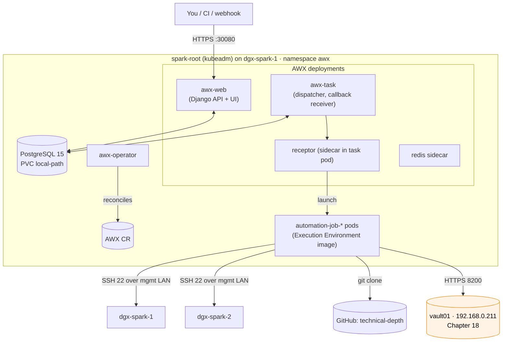
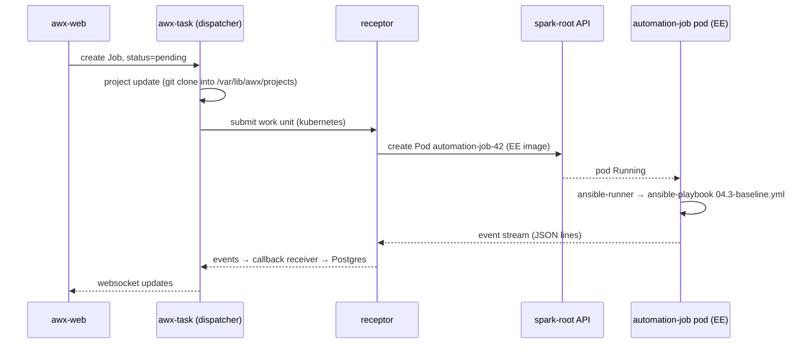

# Chapter 23 · AWX Install & Configuration as Code: Run the Lab from a UI

> **01-Ansible · Part IV — Secrets & platforms · Chapter 23 of 30** · ← [Chapter 22 · Slurm: GRES & cgroup GPUs](22-slurm-gres-and-cgroup-gpus.md) · [All chapters](00-ansible-step-by-step-guide.md) · [Chapter 24 · AWX production & Receptor](24-awx-production-and-receptor.md) →

| | |
|---|---|
| **You will build** | AWX running on the kubeadm root cluster (`spark-root`, namespace `awx`) on dgx-spark-1, configured *entirely from Ansible* (org, credentials, project, inventory, job templates, schedules), running the lab's own playbooks |
| **Prerequisite** | Root cluster up ([Chapter 19](19-kubernetes-kubeadm-root-cluster-and-vclusters.md), `playbooks/19.1-kubernetes.yml`) and the `local-path` StorageClass (installed by `playbooks/20.2-vclusters.yml`, or `"02-Kubernetes/lab/scripts/install-addons.sh" storage`) |
| **Clusters** | `spark-root` only. AWX is platform tooling, so it lives on the root next to observability, not inside a tenant vCluster |
| **Time** | 2 h |
| **Risk** | Medium: AWX + Postgres use about 4–6 GiB of the unified memory pool. Budget it (§2.2) |

AWX is the upstream of Red Hat Ansible Automation Platform's controller. It gives you RBAC, credentials that users can't read, job history, schedules, webhooks and an API. Those are the things a CLI-only lab lacks once more than one person (or a cron job) runs playbooks.

> **This lab's controller is Semaphore, not AWX.** Every lab playbook runs as a Semaphore task on `sema01` (192.168.0.210), with a 15-minute SSH certificate from `vault01` (192.168.0.211); both stay **outside** the Spark ([Chapter 01](01-management-plane-semaphore-and-vault.md), [Chapter 04](04-dgx-spark-as-semaphore-target.md)). This step teaches AWX as the **alternative controller** you'll meet in Red Hat shops. Why the lab doesn't use it as its main controller:
>
> - **It would live on the thing it manages.** AWX here runs on `spark-root`. `19.2-reset-kubernetes.yml` or a DGX OS re-image deletes it along with its job history, and it can't run `19.1-kubernetes.yml` to build the cluster it runs on. Semaphore on sema01 survives every reset (Chapter 04 §1).
> - **Memory.** AWX + PostgreSQL take 4–6 GiB from the Spark's unified pool (§1.3); Semaphore costs the Spark nothing.
> - **Same ideas, smaller.** Semaphore has the parts this lab needs (projects, templates, variable groups with encrypted secrets, schedules, task history, roles). AWX adds execution nodes, workflows with approvals and credential plugins (Chapter 24), which matter at fleet scale.
>
> If you install AWX, let it **observe** (validate, drift in check mode) rather than run the same build templates as Semaphore: two controllers changing the same hosts undo each other's work and split the audit trail.

---

## 1. Architecture

### 1.1 HLD



**Key idea:** AWX does **not** run playbooks inside its own web or task pods. For each job, Receptor launches a short-lived pod from an **Execution Environment (EE)** image. That pod clones the project, runs `ansible-runner`, and streams events back. What your playbook can do is determined by the EE, not by AWX.

### 1.2 LLD

| Component | Object | Spark-specific setting |
|---|---|---|
| Operator | `Deployment awx-operator-controller-manager` | Installed with kustomize, version pinned |
| AWX | `AWX/awx` CR | `service_type: NodePort`, `nodeport_port: 30080`; resource **limits** set |
| DB | `StatefulSet awx-postgres-15` | PVC on the root's `local-path` StorageClass → a directory under `/data/k8s` on the NVMe (the `vclusters` role points the provisioner there) |
| Secrets | `awx-admin-password`, `awx-secret-key`, `awx-postgres-configuration` | Pre-created so they're stable across reinstalls. **Back them up** |
| Jobs | Container Group `default` | `automation-job-*` pods, EE `quay.io/ansible/awx-ee` (or your arm64 build, §3.6) |

### 1.3 Memory budget on a UMA machine

Everything on a Spark competes for one unified pool (~119.7 GiB usable), including the GPU. AWX comes out of the root's share: the two vClusters' ResourceQuotas already claim 56 Gi (dev-lab 8, llms 48), and the root keeps the rest for platform services. Give AWX hard limits so it can never starve a model server:

| Container | request | limit |
|---|---|---|
| awx-web | 256Mi | 1.5Gi |
| awx-task | 256Mi | 1.5Gi |
| postgres | 256Mi | 1Gi |
| redis / ee sidecars | 64Mi | 256Mi |
| each job pod | 256Mi | 1Gi |

---

## 2. Pre-flight: architecture check (do this first)

The Spark is **arm64**. Before installing, confirm that every image you'll pull has a `linux/arm64` manifest:

```bash
for img in quay.io/ansible/awx-operator:2.19.1 quay.io/ansible/awx:24.6.1 \
           quay.io/ansible/awx-ee:24.6.1 quay.io/sclorg/postgresql-15-c9s:latest \
           docker.io/redis:7; do
  printf '%-45s ' "$img"
  docker manifest inspect "$img" 2>/dev/null | grep -q '"architecture": "arm64"' && echo arm64-OK || echo NO-ARM64
done
```

- **All OK:** follow §3 as written.
- **Any `NO-ARM64`:** don't fight it. Use the **hybrid pattern**: run the AWX control plane on an x86 box or VM and make the Spark a Receptor **execution node** (Chapter 24 §2.1). Jobs still run *on* the Spark, and only the UI/DB live elsewhere. Production AAP deployments use this same split.

---

## 3. Hands-on: install and configure

### 3.1 Operator

```bash
export KUBECONFIG="$PWD/.cache/kubeconfig-spark-lab.yaml"   # contexts spark-root, dev-lab, llms
mkdir -p .cache/awx && cd .cache/awx
cat > kustomization.yaml <<'EOF'
apiVersion: kustomize.config.k8s.io/v1beta1
kind: Kustomization
namespace: awx
resources:
  - github.com/ansible/awx-operator/config/default?ref=2.19.1
images:
  - name: quay.io/ansible/awx-operator
    newTag: 2.19.1
EOF
kubectl --context spark-root create namespace awx
kubectl --context spark-root apply -k .
kubectl --context spark-root -n awx rollout status deploy/awx-operator-controller-manager --timeout=5m
```

### 3.2 Stable secrets (so a reinstall doesn't orphan the DB)

```bash
kubectl --context spark-root -n awx create secret generic awx-admin-password --from-literal=password="$(openssl rand -base64 24)"
kubectl --context spark-root -n awx create secret generic awx-secret-key      --from-literal=secret_key="$(openssl rand -base64 48)"
kubectl --context spark-root -n awx get secret awx-admin-password awx-secret-key -o yaml > ../awx-secrets.backup.yaml   # keep safe
```

### 3.3 The AWX custom resource

```yaml
# .cache/awx/awx.yaml
apiVersion: awx.ansible.com/v1beta1
kind: AWX
metadata:
  name: awx
  namespace: awx
spec:
  service_type: NodePort
  nodeport_port: 30080
  admin_user: admin
  admin_password_secret: awx-admin-password
  secret_key_secret: awx-secret-key
  postgres_storage_class: local-path
  postgres_storage_requirements: { requests: { storage: 20Gi } }
  web_resource_requirements:   { requests: { cpu: 250m, memory: 256Mi }, limits: { cpu: "2", memory: 1536Mi } }
  task_resource_requirements:  { requests: { cpu: 250m, memory: 256Mi }, limits: { cpu: "2", memory: 1536Mi } }
  ee_resource_requirements:    { requests: { cpu: 100m, memory: 64Mi },  limits: { memory: 256Mi } }
  redis_resource_requirements: { requests: { cpu: 50m,  memory: 64Mi },  limits: { memory: 256Mi } }
  postgres_resource_requirements: { requests: { cpu: 100m, memory: 256Mi }, limits: { memory: 1Gi } }
```

```bash
kubectl --context spark-root apply -f awx.yaml
kubectl --context spark-root -n awx logs -f deploy/awx-operator-controller-manager -c awx-manager | grep -E 'PLAY RECAP|failed=[1-9]'
kubectl --context spark-root -n awx get pods -w      # awx-web, awx-task, awx-postgres-15-0 → Running
curl -s http://192.168.0.100:30080/api/v2/ping/ | jq .version
```

### 3.4 Configure AWX *as code*

Clicking through the UI can't be reviewed or rebuilt. Use the `awx.awx` collection instead:

```bash
ansible-galaxy collection install awx.awx -p ./collections
export CONTROLLER_HOST=http://192.168.0.100:30080 CONTROLLER_USERNAME=admin
export CONTROLLER_PASSWORD=$(kubectl --context spark-root -n awx get secret awx-admin-password -o jsonpath='{.data.password}' | base64 -d)
```

```yaml
# playbooks/awx-config.yml  (run from your MacBook)
- name: AWX configuration as code
  hosts: localhost
  connection: local
  gather_facts: false
  vars:
    org: SparkLab
    repo: https://github.com/cloudone365/technical-depth.git
  tasks:
    - name: Organization
      awx.awx.organization: { name: "{{ org }}", state: present }

    - name: Machine credential (SSH key for the dgxadmin user)
      awx.awx.credential:
        name: spark-ssh
        organization: "{{ org }}"
        credential_type: Machine
        inputs:
          username: dgxadmin
          ssh_key_data: "{{ lookup('file', '~/.ssh/id_ed25519') }}"
          become_method: sudo
          become_password: "{{ spark_become_password }}"   # pass with -e @vault.yml
      no_log: true

    - name: Project (this repo)
      awx.awx.project:
        name: technical-depth
        organization: "{{ org }}"
        scm_type: git
        scm_url: "{{ repo }}"
        scm_branch: main
        scm_update_on_launch: true
        scm_update_cache_timeout: 300
        wait: true

    - name: Inventory
      awx.awx.inventory: { name: spark-lab, organization: "{{ org }}" }

    - name: Inventory source = lab/inventory/hosts.yml from the project
      awx.awx.inventory_source:
        name: lab-yaml
        inventory: spark-lab
        source: scm
        source_project: technical-depth
        source_path: "01-Ansible/lab/inventory/hosts.yml"
        update_on_launch: true
        overwrite: true

    - name: Job templates for each lab stage
      awx.awx.job_template:
        name: "spark · {{ item.name }}"
        organization: "{{ org }}"
        inventory: spark-lab
        project: technical-depth
        playbook: "01-Ansible/lab/playbooks/{{ item.pb }}"
        credentials: [spark-ssh]
        become_enabled: true
        forks: 10
        ask_limit_on_launch: true
        diff_mode: true
        job_type: "{{ item.type | default('run') }}"
      loop:
        - { name: baseline,  pb: 04.3-baseline.yml }
        - { name: fabric,    pb: 13.1-fabric.yml }
        - { name: validate,  pb: 30.1-validate.yml }
        - { name: drift,     pb: 26.1-drift-check.yml, type: check }
        - { name: drain,     pb: 29.1-emergency-drain.yml }

    - name: Drift check every 30 minutes
      awx.awx.schedule:
        name: drift-every-30m
        unified_job_template: "spark · drift"
        rrule: "DTSTART;TZID=America/New_York:20260101T000000 RRULE:FREQ=MINUTELY;INTERVAL=30"
        state: present
```

This machine credential is the **simple** version: your own `dgxadmin` key, stored in AWX. It is exactly the long-lived key the Semaphore path avoids. The production version is a *HashiCorp Vault Signed SSH* credential against vault01 for `svc-ansible` (Chapter 24 §2.2), AWX's counterpart of Semaphore's play 1. Two lab details when you switch:

- `group_vars/spark.yml` sets `ansible_user` to `dgxadmin` whenever `vault_role_id` is undefined, which it is in AWX, and an inventory variable beats the credential's username. Give the job templates the extra variable `ansible_user: svc-ansible`.
- Play 1 (`00-vault-cert.yml`) is skipped in AWX for the same reason, so it doesn't conflict with the credential plugin.

```bash
ansible-playbook playbooks/awx-config.yml -e @.cache/awx-secrets.yml
awx --conf.host $CONTROLLER_HOST job_templates launch "spark · validate" --monitor   # optional awxkit CLI
```

### 3.5 What happens when you press "Launch"



### 3.6 An arm64 Execution Environment that contains your collections

`lab/ee/execution-environment.yml` builds on the Spark itself, so the image is native `linux/arm64`:

```yaml
# lab/ee/execution-environment.yml
---
# ansible-builder build -t spark-ee:1.0 -f ee/execution-environment.yml --container-runtime docker
# Build ON the Spark to get a native linux/arm64 image (or use buildx for multi-arch).
version: 3
images:
  base_image:
    name: quay.io/fedora/python-312:latest
dependencies:
  ansible_core:
    package_pip: ansible-core~=2.18.0
  ansible_runner:
    package_pip: ansible-runner
  galaxy: ../requirements.yml
  python:
    - jmespath
    - netaddr
    - hvac
    - kubernetes
  system:
    - openssh-clients [platform:rpm]
    - sshpass [platform:rpm]
    - rsync [platform:rpm]
    - git-core [platform:rpm]
additional_build_steps:
  append_final:
    - RUN curl -fsSL -o /usr/local/bin/helm.tgz https://get.helm.sh/helm-v3.18.3-linux-$(uname -m | sed 's/aarch64/arm64/;s/x86_64/amd64/').tar.gz
        && tar -xzf /usr/local/bin/helm.tgz -C /tmp && mv /tmp/linux-*/helm /usr/local/bin/helm && rm -rf /usr/local/bin/helm.tgz /tmp/linux-*
    - LABEL org.opencontainers.image.description="Ansible EE for the DGX Spark lab"
```

```bash
pip install ansible-builder
cd "01-Ansible/lab"
ansible-builder build -t 192.168.0.100:5000/spark-ee:1.0 -f ee/execution-environment.yml --container-runtime docker
docker run --rm 192.168.0.100:5000/spark-ee:1.0 ansible-galaxy collection list | grep -E 'hashi_vault|kubernetes.core'
# push to a local registry (or GHCR), then in AWX: Execution Environments → add, set as default for the org
```

---

## 4. Integrations

| System | How AWX integrates | Chapter |
|---|---|---|
| Git | Project SCM, update on launch; webhook from GitHub triggers job templates | 25 |
| Vault (vault01) | "HashiCorp Vault Secret Lookup" / "Signed SSH" credential types, so no static keys live in AWX. Give AWX its own AppRole and policy on vault01; don't reuse Semaphore's `semaphore` AppRole | 18, 24 |
| Semaphore (sema01) | none: it's the lab's main controller. Keep AWX to read-only templates (validate, drift) so the two never fight over the same hosts | 04 |
| Kubernetes (`spark-root`) | Container Group runs job pods in `awx`; you can add a second group with a GPU `nodeSelector` for GPU-touching jobs (it comes out of the root's share of 2 time-slices). A job that must manage a vCluster uses a kubeconfig credential with the `dev-lab` / `llms` context | 19, 20 |
| Prometheus | `/api/v2/metrics/` (enable in settings). Scrape it from the Chapter 12 stack | 12 |
| ARA / logging | AWX external logging → Loki/Splunk; job events stay in Postgres | 27 |

## 5. Production hardening (lab → real)

- [ ] Put TLS in front with an Ingress (`ingress_type: ingress`, cert-manager) and don't leave the NodePort exposed.
- [ ] Use LDAP/OIDC SSO; keep the local `admin` account for break-glass only.
- [ ] Separate credentials per environment, with Teams + RBAC. Nobody gets `admin` for daily work.
- [ ] Back up with the operator's `AWXBackup` CR on a schedule, plus `awx-secret-key` (without it, the encrypted credentials in the DB can't be decrypted).
- [ ] Pin the EE image by digest. `:latest` makes every job a possible regression.

## 6. Troubleshooting & diagnostics

| Symptom | Diagnose | Fix |
|---|---|---|
| Pods `ImagePullBackOff` with `no matching manifest for linux/arm64` | `kubectl --context spark-root -n awx describe pod <p>` | §2 hybrid pattern, or build that image for arm64 |
| Operator loops, AWX never appears | `kubectl --context spark-root -n awx logs deploy/awx-operator-controller-manager -c awx-manager` → look for `failed=1` | Usually a CR typo or a PVC that can't bind: `kubectl --context spark-root get pvc -n awx`. On kubeadm there is no StorageClass until `local-path` is installed (prerequisite above) |
| `awx-postgres-15-0` CrashLoop: permission denied on data dir | `kubectl --context spark-root -n awx logs awx-postgres-15-0` | local-path volume permissions: delete the PVC (lab only) and let the operator recreate it |
| Job stuck `pending` | `kubectl --context spark-root -n awx get pods \| grep automation-job`; `awx-task` logs | Capacity: the instance group shows 0 capacity; raise `task_resource_requirements` or wait for running jobs |
| Job fails instantly: `ERROR! the role 'spark_facts' was not found` | Job output → working directory | AWX runs from the project root, so `lab/ansible.cfg` (and its `roles_path`) is **not** read. The lab ships `playbooks/roles → ../roles` so role lookup works relative to the playbook. Set other settings via the job template's env or `AWX_TASK_ENV` (Semaphore solves the same problem with `ANSIBLE_CONFIG="01-Ansible/lab/ansible.cfg"` in its container, Chapter 04 §4) |
| `couldn't resolve module/action 'community.docker...'` | EE collection list | Build and use the custom EE (§3.6), or add `collections/requirements.yml` to the project |
| Job can't reach 192.168.0.x | `kubectl --context spark-root -n awx exec` into a job pod → `nc -vz 192.168.0.101 22` | Pod → mgmt LAN traffic leaves through Cilium and is masqueraded to the node IP; check host firewalls, then `kubectl --context spark-root -n kube-system exec ds/cilium -- cilium-dbg monitor --type drop` for policy drops |
| Job succeeds in AWX but the handlers didn't restart services | Job output shows `changed` but no `RUNNING HANDLER` | The job type was **Check**. The drift template is intentionally check-only |

## 7. Validation

```bash
curl -s http://192.168.0.100:30080/api/v2/ping/ | jq '{version, active_node}'
kubectl --context spark-root -n awx top pods   # within the §1.3 budget (needs metrics-server: install-addons.sh metrics-server)
```

- [ ] `spark · validate` succeeds from AWX (the per-host verdict is in the job output; the JSON report lands inside the ephemeral job pod unless you point `spark_validate_report_dir` at a PVC).
- [ ] The drift schedule runs every 30 min and shows `changed=0` on a clean lab.
- [ ] Deleting and re-applying the `AWX` CR brings back the same admin password and credentials.
