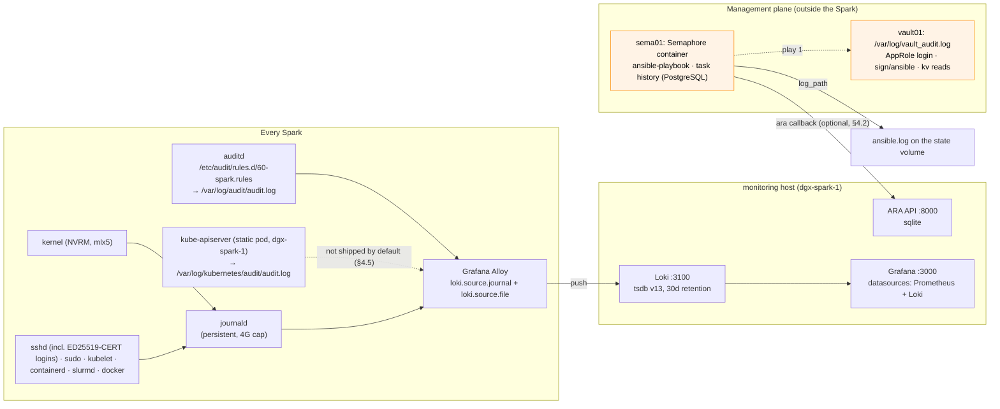

# Step 27 · Logging & Audit Trails: Who Changed What, When, and Through Which Automation

> **01-Ansible · Part V — Production operations · Step 27 of 30** · ← [Step 26 · Drift & self-healing](26-drift-detection-and-self-healing.md) · [All steps](00-ansible-step-by-step-guide.md) · [Step 28 · Firmware & patching](28-firmware-lifecycle-and-vulnerability-patching.md) →

| | |
|---|---|
| **You will build** | Four linked audit layers on the Sparks: **auditd** (changes to sudoers, sshd and the trusted SSH CA, netplan, docker, containerd, `/etc/kubernetes`, kubelet config, slurm; every root command), **journald → Grafana Alloy → Loki** for searchable logs (including NVRM/Xid kernel lines and sshd's `ED25519-CERT` logins), **ARA** recording playbook runs task by task, and the Kubernetes API audit log. Plus the management plane's own records outside the Spark: **Semaphore's task history** on sema01 (who ran which template, when, with what result) and **vault01's audit log** (every AppRole login, certificate signature and secret read) |
| **Hardware** | 1–2× DGX Spark (Loki + ARA on the monitoring host) |
| **Clusters** | `spark-root` (its API-server audit log, §4.5) and `dev-lab` (to generate a tenant write) |
| **Time** | 60 min |
| **Risk** | Low. Watch disk: Loki retention is 30 days by default |

---

## 1. The questions an audit trail must answer

| Question | Layer that answers it |
|---|---|
| "Which playbook run changed `/etc/sysctl.d/90-spark.conf` on dgx-spark-2 last Tuesday, and with what diff?" | **ARA** (+ `ansible.log`) |
| "Did someone edit netplan by hand outside Ansible?" | **auditd** key `network` + drift (Step 26) |
| "What did the kernel say about the GPU right before the job died?" | **Loki**: `{host="dgx-spark-2"} \|= "NVRM: Xid"` |
| "Who read the NGC key?" | **vault01's audit log**, `/var/log/vault_audit.log` on vault01 (Step 01 §3.5): the `kv/data/spark-lab/ngc` read by the `semaphore` AppRole token, or by an admin |
| "Who ran `21 Emergency drain` on Saturday, with which extra variables, and did it succeed?" | **Semaphore task history** on sema01 (task log, user, start/end, status), kept in its PostgreSQL |
| "Which credential did that run log in with?" | **sshd** on the Spark: `Accepted publickey for svc-ansible … ED25519-CERT ID vault-… serial N CA …`, matched by time to the `sign/ansible` entry in vault01's audit log |
| "Who raised the `vc-llms` GPU quota, and what did the request body say?" | **Kubernetes API audit log** on dgx-spark-1, `/var/log/kubernetes/audit/audit.log` (written by the root kube-apiserver; §4.5) |
| "Who launched the remediation job and who approved it?" | **Semaphore** task history (this lab); **AWX** activity stream + job history if you run AWX (Step 24) |

## 2. Architecture



vault01's audit file and Semaphore's history stay on their own machines: the lab ships neither to Loki. That's deliberate for a lab (the management plane doesn't depend on the Spark it manages), and the first thing a production design would change: forward both to a SIEM (Step 01 §11).

| Component | Image / package | Config |
|---|---|---|
| auditd | `auditd`, `audispd-plugins` | `playbooks/templates/spark-audit.rules.j2` |
| Loki | `grafana/loki:3.5.1` (validated with `loki -verify-config`) | `playbooks/templates/loki.yaml.j2` |
| Alloy | `grafana/alloy:v1.9.1` (config checked with `alloy fmt`) | `playbooks/templates/alloy.river.j2` |
| ARA | `pip install ara[server]` in a venv, systemd unit | `/opt/ara/settings.yaml` |

> **Why Alloy, not Promtail?** Promtail is in maintenance, and Grafana's supported collector going forward is Alloy. The journal source and labels map one to one.

---

## 3. The code

```bash
# lab/playbooks/templates/spark-audit.rules.j2
## {{ ansible_managed }}
## Who changed what on a DGX Spark. Keys make searching easy: ausearch -k <key>
-w /etc/sudoers -p wa -k priv
-w /etc/sudoers.d/ -p wa -k priv
-w /etc/ssh/sshd_config -p wa -k sshd
-w /etc/ssh/sshd_config.d/ -p wa -k sshd
-w /etc/ssh/trusted-user-ca-keys.pem -p wa -k sshd
-w /etc/netplan/ -p wa -k network
-w /etc/docker/daemon.json -p wa -k container-runtime
-w /etc/cdi/ -p wa -k container-runtime
-w /etc/nvidia-container-runtime/ -p wa -k container-runtime
-w /etc/kubernetes/ -p wa -k kubernetes
-w /var/lib/kubelet/config.yaml -p wa -k kubernetes
-w /etc/containerd/ -p wa -k container-runtime
-w /etc/slurm/ -p wa -k slurm
-w /etc/munge/munge.key -p rwa -k slurm-secret
-w /etc/sysctl.d/ -p wa -k kernel-tuning
-w /etc/modprobe.d/ -p wa -k kernel-tuning
-w /etc/default/grub.d/ -p wa -k boot
## package database changes (apt/dpkg) and apt-mark holds
-w /var/lib/dpkg/status -p wa -k packages
-w /usr/bin/apt-mark -p x -k packages
## every command run as root through sudo
-a always,exit -F arch=b64 -S execve -F euid=0 -F auid>=1000 -F auid!=4294967295 -k root-cmd
```

```hcl
# lab/playbooks/templates/alloy.river.j2
// {{ ansible_managed }}
// Grafana Alloy on {{ inventory_hostname }}: ship the systemd journal (kernel NVRM/Xid,
// sshd, sudo, kubelet, containerd, slurmd, docker, auditd via journald) to Loki.
loki.relabel "journal" {
  forward_to = []
  rule {
    source_labels = ["__journal__systemd_unit"]
    target_label  = "unit"
  }
  rule {
    source_labels = ["__journal_priority_keyword"]
    target_label  = "level"
  }
  rule {
    source_labels = ["__journal_syslog_identifier"]
    target_label  = "ident"
  }
  rule {
    source_labels = ["__journal__transport"]
    target_label  = "transport"
  }
}

loki.source.journal "journal" {
  forward_to    = [loki.write.default.receiver]
  relabel_rules = loki.relabel.journal.rules
  max_age       = "12h"
  labels        = { host = "{{ inventory_hostname }}", job = "systemd-journal", lab = "{{ lab_name | default('spark-lab') }}" }
}

loki.write "default" {
  endpoint {
    url = "http://{{ hostvars[groups['monitoring'][0]].ansible_host }}:3100/loki/api/v1/push"
  }
}

// auditd writes to its own file (not reliably to journald) — tail it separately.
local.file_match "audit" {
  path_targets = [{ "__path__" = "/var/log/audit/audit.log", host = "{{ inventory_hostname }}", job = "auditd" }]
}

loki.source.file "audit" {
  targets    = local.file_match.audit.targets
  forward_to = [loki.write.default.receiver]
}
```

```yaml
# lab/playbooks/templates/loki.yaml.j2
# {{ ansible_managed }}
auth_enabled: false
server:
  http_listen_port: 3100
common:
  path_prefix: /loki
  replication_factor: 1
  ring:
    kvstore:
      store: inmemory
  storage:
    filesystem:
      chunks_directory: /loki/chunks
      rules_directory: /loki/rules
schema_config:
  configs:
    - from: "2024-01-01"
      store: tsdb
      object_store: filesystem
      schema: v13
      index:
        prefix: index_
        period: 24h
limits_config:
  retention_period: {{ logging_retention }}
compactor:
  working_directory: /loki/compactor
  retention_enabled: true
  delete_request_store: filesystem
```

```yaml
# lab/playbooks/23-logging-audit.yml
---
# Audit & logging stack:
#   * auditd rules on every Spark (who changed sudoers, sshd, netplan, docker, kubernetes, slurm, vault…)
#   * Loki on the monitoring host + Grafana Alloy on every Spark shipping the journal
#   * Loki datasource in the Step 12 Grafana
#   * ARA API server recording every ansible-playbook run
- name: Short-lived SSH certificate from vault01 (Semaphore runs only)
  ansible.builtin.import_playbook: 00-vault-cert.yml

- name: Auditd on every Spark
  hosts: spark
  become: true
  tasks:
    - name: Install auditd
      ansible.builtin.apt:
        name: [auditd, audispd-plugins]
        state: present

    - name: Spark audit rules
      ansible.builtin.template:
        src: spark-audit.rules.j2
        dest: /etc/audit/rules.d/60-spark.rules
        mode: "0640"
      notify: Load audit rules

    - name: Load rules now so the check below sees them
      ansible.builtin.meta: flush_handlers

    - name: Confirm rules are active
      ansible.builtin.command: auditctl -l
      register: logging_auditctl
      changed_when: false
      check_mode: false
      failed_when: "'-k network' not in logging_auditctl.stdout and 'key=network' not in logging_auditctl.stdout"
  handlers:
    - name: Load audit rules
      ansible.builtin.command: augenrules --load     # merges /etc/audit/rules.d/*.rules
      changed_when: true

- name: Loki + Grafana datasource (monitoring host)
  hosts: monitoring
  become: true
  vars:
    logging_retention: 720h
    logging_loki_image: grafana/loki:3.5.1
    logging_dir: /opt/spark-logging
  tasks:
    - name: Directories
      ansible.builtin.file:
        path: "{{ logging_dir }}/{{ item }}"
        state: directory
        owner: "10001"          # loki image runs as uid 10001
        group: "10001"
        mode: "0755"
      loop: [config, data]

    - name: Loki config
      ansible.builtin.template:
        src: loki.yaml.j2
        dest: "{{ logging_dir }}/config/loki.yaml"
        mode: "0644"
      register: logging_loki_cfg

    - name: Loki container
      community.docker.docker_container:
        name: loki
        image: "{{ logging_loki_image }}"
        command: [-config.file=/etc/loki/loki.yaml]
        network_mode: host
        restart_policy: unless-stopped
        volumes:
          - "{{ logging_dir }}/config:/etc/loki:ro"
          - "{{ logging_dir }}/data:/loki"
        restart: "{{ logging_loki_cfg is changed }}"

    - name: Wait for Loki ready
      ansible.builtin.uri:
        url: http://127.0.0.1:3100/ready
      register: logging_loki_ready
      until: logging_loki_ready.status == 200
      retries: 30
      delay: 3

    - name: Loki datasource for Grafana (Step 12 stack)
      ansible.builtin.copy:
        dest: /opt/spark-monitoring/grafana/provisioning/datasources/loki.yml
        mode: "0644"
        content: |
          # {{ ansible_managed }}
          apiVersion: 1
          datasources:
            - name: Loki
              type: loki
              access: proxy
              url: http://127.0.0.1:3100
      notify: Restart Grafana
  handlers:
    - name: Restart Grafana
      community.docker.docker_container:
        name: spark-monitoring-grafana-1     # compose project "spark-monitoring", service "grafana"
        state: started
        restart: true

- name: Grafana Alloy journal shipper (every Spark)
  hosts: spark
  become: true
  vars:
    logging_alloy_image: grafana/alloy:v1.9.1
  tasks:
    - name: Alloy config dir
      ansible.builtin.file:
        path: /etc/alloy
        state: directory
        mode: "0755"

    - name: Alloy config
      ansible.builtin.template:
        src: alloy.river.j2
        dest: /etc/alloy/config.alloy
        mode: "0644"
      register: logging_alloy_cfg

    - name: Alloy container (reads the host journal)
      community.docker.docker_container:
        name: alloy
        image: "{{ logging_alloy_image }}"
        command: [run, --storage.path=/var/lib/alloy/data, /etc/alloy/config.alloy]
        network_mode: host
        restart_policy: unless-stopped
        user: root
        volumes:
          - /etc/alloy:/etc/alloy:ro
          - /var/log/journal:/var/log/journal:ro
          - /run/log/journal:/run/log/journal:ro
          - /etc/machine-id:/etc/machine-id:ro
          - /var/log/audit:/var/log/audit:ro
          - alloy-data:/var/lib/alloy/data
        restart: "{{ logging_alloy_cfg is changed }}"

- name: ARA API server (records every playbook run)
  hosts: monitoring
  become: true
  vars:
    ara_dir: /opt/ara
    ara_port: 8000
  tasks:
    - name: Python venv with ARA server
      ansible.builtin.pip:
        name: ["ara[server]>=1.7"]
        virtualenv: "{{ ara_dir }}/venv"
        virtualenv_command: python3 -m venv

    - name: ARA settings
      ansible.builtin.copy:
        dest: "{{ ara_dir }}/settings.yaml"
        mode: "0644"
        content: |
          default:
            ALLOWED_HOSTS: ["*"]
            BASE_DIR: {{ ara_dir }}/data
            DATABASE_ENGINE: django.db.backends.sqlite3
            DATABASE_NAME: {{ ara_dir }}/data/ansible.sqlite
            TIME_ZONE: {{ lab_timezone | default('UTC') }}
            READ_LOGIN_REQUIRED: false
            WRITE_LOGIN_REQUIRED: false

    - name: ARA service
      ansible.builtin.copy:
        dest: /etc/systemd/system/ara.service
        mode: "0644"
        content: |
          [Unit]
          Description=ARA Records Ansible API server
          After=network-online.target
          [Service]
          Environment=ARA_SETTINGS={{ ara_dir }}/settings.yaml
          Environment=ARA_BASE_DIR={{ ara_dir }}/data
          ExecStartPre={{ ara_dir }}/venv/bin/ara-manage migrate
          ExecStart={{ ara_dir }}/venv/bin/ara-manage runserver 0.0.0.0:{{ ara_port }}
          Restart=on-failure
          [Install]
          WantedBy=multi-user.target
      register: ara_unit

    - name: Enable ARA
      ansible.builtin.systemd_service:
        name: ara
        state: "{{ 'restarted' if ara_unit is changed else 'started' }}"
        enabled: true
        daemon_reload: true
```

---

## 4. Hands-on

### 4.1 Deploy

Run the Semaphore template **`23 Logging audit`** (break-glass: `ansible-playbook playbooks/23-logging-audit.yml -l dgx-spark-1,localhost -K`), then:

```bash
curl -s http://192.168.0.100:3100/ready                        # ready
curl -s http://192.168.0.100:8000/api/v1/ | jq 'keys'           # ARA API
```

### 4.2 Record every playbook run in ARA

The ARA callback runs on the **controller**. The lab's Semaphore image doesn't include it, so start on the MacBook:

```bash
pip install "ara>=1.7"                                       # client side, on the controller (here: the MacBook)
export ANSIBLE_CALLBACK_PLUGINS=$(python3 -m ara.setup.callback_plugins)
export ARA_API_CLIENT=http ARA_API_SERVER=http://192.168.0.100:8000
ansible-playbook playbooks/01-baseline.yml -l dgx-spark-1,localhost -K
ara playbook list --limit 5
ara result list --playbook <id> --changed      # every changed task, with the diff
```

To record the **Semaphore** runs too, add `ara` to [`semaphore/requirements-semaphore.txt`](lab/semaphore/requirements-semaphore.txt), rebuild the image (Step 04 §4), and put the three variables in the variable group's environment. Semaphore's task history already answers "who ran what, when"; ARA adds per-task results and diffs you can query. For AWX, install `ara` into the EE (Step 08) and set the variables in the job template environment (Step 24).

### 4.2b The management-plane trail: Semaphore, vault01, sshd

One template run leaves three matching records. Run `00 Ping` in Semaphore, then:

```bash
# sema01: the task, who ran it, its status (also in the UI: project spark-lab → Task history)
cd ~/semaphore && docker compose exec semaphore ls /var/lib/spark-lab/cache   # ansible.log grows with every task
# vault01: the AppRole login and the signature for that task
sudo grep -E 'auth/approle/login|sign/ansible' /var/log/vault_audit.log | tail -2 | jq -c '{time, path: .request.path, type}'
# dgx-spark-1: the login with that certificate, then the sudo commands
sudo journalctl -u ssh --since "10 minutes ago" | grep 'ED25519-CERT'
sudo grep svc-ansible /var/log/auth.log | grep COMMAND | tail -3
```

Line the three up by time: the Semaphore task's start, the `sign/ansible` request a second later, the `ED25519-CERT` login right after (Vault's audit log HMACs response values such as the serial by default, so the timestamp and the request path are the join keys). That's how you show a change on the Spark came from a specific Semaphore task and not from a human with a copied key: a copied key without a fresh certificate can't log in as `svc-ansible` at all.

### 4.3 Queries worth saving in Grafana (Explore → Loki)

| Question | LogQL |
|---|---|
| GPU Xid events, all nodes | `{job="systemd-journal", transport="kernel"} \|= "NVRM: Xid"` |
| CX-7 link flaps | `{transport="kernel"} \|~ "mlx5_core.*(link down\|Link up\|module)"` |
| sudo commands on dgx-spark-2 | `{host="dgx-spark-2", ident="sudo"}` |
| Config file watches that fired (auditd log file) | `{job="auditd"} \|~ "key=\"(network\|sshd\|priv\|container-runtime)\""` |
| SSH logins using vault01 certificates | `{unit="ssh.service"} \|= "ED25519-CERT"` |
| kubelet / containerd errors | `{unit=~"kubelet.service\|containerd.service", level="err"}` |
| Who touched Kubernetes host config (auditd) | `{job="auditd"} \|= "key=\"kubernetes\""` |
| Rate of Xids per host (graph) | `sum by (host) (count_over_time({transport="kernel"} \|= "NVRM: Xid" [5m]))` |

### 4.4 auditd: prove it catches a manual change

```bash
ssh dgxadmin@192.168.0.101 'sudo sed -i "s/mtu: 9000/mtu: 1500/" /etc/netplan/40-cx7.yaml'
ssh dgxadmin@192.168.0.101 'sudo ausearch -k network -i --start recent | tail -20'
# → type=SYSCALL ... comm="sed" ... auid=nvidia ... key="network"
tools/drift-cycle.sh      # drift reports the fabric template (and doesn't auto-heal it)
# a human puts it back: Semaphore template 02 Fabric with --limit dgx-spark-2,localhost
#   (break-glass: ansible-playbook playbooks/02-fabric.yml -K -l dgx-spark-2,localhost)
```

### 4.5 The Kubernetes API audit log: root vs vCluster

auditd sees *files* changing. It can't see `kubectl patch resourcequota`, which only touches etcd. For that, the `kubeadm_cluster` role starts the root kube-apiserver with `--audit-policy-file=/etc/kubernetes/audit/audit-policy.yaml` (from `roles/kubeadm_cluster/files/audit-policy.yaml`) and `--audit-log-path=/var/log/kubernetes/audit/audit.log`. The policy logs Secrets and ConfigMaps at `Metadata` only (never payloads), drops kubelet and health-check noise, and records **full request and response** for every write in `vc-dev-lab`, `vc-llms`, `gpu-operator` and `platform-tools`.

The nesting adds one twist. Each vCluster has its **own** API server. A tenant's `kubectl --context dev-lab create …` is decided by that API server, and the root only sees the result: the vCluster's syncer writing a translated object into `vc-dev-lab` under its own ServiceAccount.

```bash
export KUBECONFIG=$PWD/.cache/kubeconfig-spark-lab.yaml
# 1. A platform change on the root: who touched the llms budget?
kubectl --context spark-root -n vc-llms annotate resourcequota vcluster-budget spark.lab/audit-test="$(date +%s)" --overwrite
ssh dgxadmin@192.168.0.100 "sudo tail -n 2000 /var/log/kubernetes/audit/audit.log | jq -c 'select(.objectRef.resource==\"resourcequotas\" and .verb==\"patch\") | {user: .user.username, verb, ns: .objectRef.namespace, name: .objectRef.name}' | tail -1"
# → {"user":"kubernetes-admin","verb":"patch","ns":"vc-llms","name":"vcluster-budget"}

# 2. A tenant write inside dev-lab: the root logs the syncer, not the tenant
kubectl --context dev-lab -n default create configmap audit-probe --from-literal=k=v
ssh dgxadmin@192.168.0.100 "sudo tail -n 2000 /var/log/kubernetes/audit/audit.log | jq -c 'select(.objectRef.namespace==\"vc-dev-lab\" and .objectRef.resource==\"configmaps\" and .verb==\"create\") | {user: .user.username, name: .objectRef.name}' | tail -1"
# → user is a ServiceAccount in vc-dev-lab (system:serviceaccount:vc-dev-lab:…), name audit-probe-x-default-x-dev-lab
kubectl --context dev-lab -n default delete configmap audit-probe
```

So "which tenant did this?" has to be answered from the vCluster's own audit trail, not the root's. That is the same split a hosting provider has between its own audit log and a customer's.

The 4-layer stack above does **not** ship this file yet: Alloy tails `/var/log/audit/audit.log` only, and the `alloy` container doesn't mount `/var/log/kubernetes`. Exercise: add a second `local.file_match` for `/var/log/kubernetes/audit/audit.log` (label `job="kube-audit"`) to `alloy.river.j2`, add the read-only mount to the `Alloy container` task in `23-logging-audit.yml`, and filter by `objectRef.namespace` in LogQL with `| json`, never as a label.

---

## 5. Retention, volume and "high cardinality"

| Stream | Volume driver | Control |
|---|---|---|
| Kernel/NVRM | Bursts during faults | Keep. It's the evidence |
| auditd `root-cmd` (every root execve) | Automation runs generate many | Keep in Loki with 30d retention; exclude noisy automation users with `-F auid!=<ansible uid>` if you must |
| Container stdout (Docker) | Model servers can be chatty | Not shipped by default (journald only). Add a `loki.source.docker` block selectively |
| Pod logs (root and vCluster pods) | Under `/var/log/pods/<ns>_<pod>_<uid>/` on the node; vCluster pods use their translated root names (`<pod>-x-<ns>-x-<vcluster>` in `vc-<vcluster>`) | Not shipped by default; the root's kube-prometheus-stack covers metrics, not logs |
| Kubernetes API audit | Every write in the `vc-*` namespaces at `RequestResponse` | Rotated by kube-apiserver (`--audit-log-maxsize`/`maxbackup` in the kubeadm config); ship it per §4.5 |
| Labels | `host`, `unit`, `ident`, `level`, `transport` only | **Never** use request IDs, PIDs or pod UIDs as labels. That's how you get a high-cardinality Loki meltdown; filter those in queries with `\|=` instead |

## 6. Integrations

| System | Hook |
|---|---|
| Alerting (Step 12) | Loki ruler or Grafana alert on the Xid-rate query, complementing the Prometheus `SparkGPUXid` alert |
| Drift (Step 26) | The auditd `key` explains *who/what* caused the drift the playbook found |
| Drain (Step 29) | The incident bundle captures local logs; Loki keeps them after the node is re-imaged |
| Semaphore (sema01) | Task history in its database; `ansible.log` on the state volume. Neither is shipped to Loki by default |
| vault01 | `/var/log/vault_audit.log`; forward it to a SIEM in production (Step 01 §11) |
| AWX (Step 24) | External logging → Loki (`Settings → Logging`), so job events sit next to host logs |

## 7. Troubleshooting & diagnostics

| Symptom | Diagnose | Fix |
|---|---|---|
| No logs in Loki | `docker logs alloy` on the Spark; `curl -s localhost:12345/-/ready` (Alloy UI) | Loki URL/port; journal mounts (`/var/log/journal` exists only with persistent journald — set by `spark_baseline`) |
| Loki `permission denied` on `/loki` | `docker logs loki` | Directory owner must be uid 10001 (the play sets it) |
| Loki `entry too far behind` | Alloy pushing old journal on first start | Expected once; `max_age = "12h"` bounds it |
| `augenrules --load` fails: `rule exists` / syntax | `auditctl -R /etc/audit/rules.d/60-spark.rules` | Fix the rule line; a `-e 2` (immutable) rules file elsewhere blocks reloads until reboot |
| ARA shows nothing | `echo $ANSIBLE_CALLBACK_PLUGINS`; `curl $ARA_API_SERVER/api/v1/` | Callback path not exported in *this* shell/EE; the API is unreachable from the EE pod |
| Grafana has no Loki datasource | `/opt/spark-monitoring/grafana/provisioning/datasources/` | Re-run; the handler restarts Grafana |

## 8. Validation

- [ ] Grafana Explore shows journal logs from every Spark, filterable by `host`/`unit`.
- [ ] The Xid query returns results after a test (or at least runs clean).
- [ ] For one Semaphore task you can show all three records: the task in Semaphore's history, the `sign/ansible` entry in vault01's audit log, and the `ED25519-CERT` login on the Spark.
- [ ] `ara playbook list` shows your last runs, with per-task changed results.
- [ ] A manual netplan edit is visible in `ausearch -k network` **and** in the drift report.
- [ ] A change to the `vc-llms` ResourceQuota is in `/var/log/kubernetes/audit/audit.log` with the user who made it, and a tenant write in `dev-lab` shows up there as the syncer's ServiceAccount.
