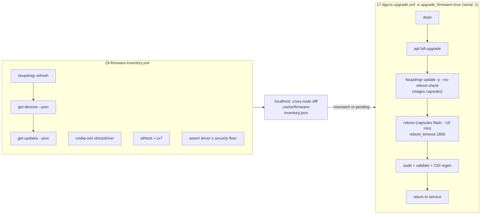
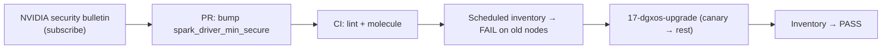

# Step 28 · Firmware Lifecycle & Vulnerability Patching on DGX Spark (fwupd, VBIOS, CX-7, Security Floors)

> **01-Ansible · Part V — Production operations · Step 28 of 30** · ← [Step 27 · Logging & audit compliance](27-logging-and-audit-compliance.md) · [All steps](00-ansible-step-by-step-guide.md) · [Step 29 · Incident response & emergency drain](29-incident-response-and-emergency-drain.md) →

| | |
|---|---|
| **You will build** | A firmware and security-posture inventory across all Sparks (`19-firmware-inventory.yml`), with cross-node mismatch detection and a driver *security floor*. Firmware then gets folded into the rolling upgrade (`17-dgxos-upgrade.yml -e upgrade_firmware=true`) |
| **Hardware** | 1–2× DGX Spark |
| **Time** | 45 min (inventory) · 30–60 min per node (update, including a long capsule reboot) |
| **Risk** | **High during flashing.** Never interrupt power while capsules are being written |

---

## 1. What firmware a Spark has, and who updates it

| Component | Delivered as | Queried with |
|---|---|---|
| UEFI / system firmware | UEFI capsule via **fwupd** (LVFS), or the DGX Dashboard | `fwupdmgr get-devices` |
| Embedded controller (EC) | fwupd capsule | `fwupdmgr get-devices` |
| SoC firmware | fwupd capsule | `fwupdmgr get-devices` |
| USB-C power-delivery controller | fwupd capsule | `fwupdmgr get-devices` |
| GPU VBIOS | Rides inside the SoC capsule | `nvidia-smi --query-gpu=vbios_version` |
| ConnectX-7 NIC | Platform update path (don't flash it yourself with generic MFT images) | `ethtool -i <netdev>` (read-only) |
| GPU driver, kernel, DGX tooling | apt (DGX OS repos) | Step 10 |

**NVIDIA's guidance for Founders Edition units** is that the **DGX Dashboard** is the primary update path. The terminal equivalent, in order, is:

```bash
sudo apt update && sudo apt dist-upgrade
sudo fwupdmgr refresh && sudo fwupdmgr upgrade
sudo reboot
```

OEM GB10 systems (Dell, HP, ASUS, Lenovo, …) may use their own firmware channels. Follow the vendor's guide, but the Ansible structure below stays the same.

> **Field lesson (from teams running several GB10 units):** firmware on "identical" boxes drifts apart quickly. Different EC and SoC versions across units are a common finding, and they explain "why is node 3 slower/flakier". Inventory first, update second, and **compare across nodes**.

---

## 2. Architecture



**Why `--no-reboot-check` and our own reboot?** fwupd's own reboot would happen outside Ansible's control: no drain, no wait-for-GPU, no validation. Staging capsules and then using `ansible.builtin.reboot` with a long timeout keeps the whole window orchestrated.

---

## 3. Hands-on

### 3.1 Inventory and compare

```yaml
# lab/playbooks/19-firmware-inventory.yml
---
# Firmware + security-posture inventory across all Sparks.
#  * fwupd device versions (UEFI, EC, SoC, USB-PD, …) and pending updates
#  * GPU VBIOS, CX-7 firmware (read-only queries)
#  * driver version vs the minimum fixed version from the latest NVIDIA security bulletin
#  * cross-node consistency — mixed firmware across a cluster is a real, common finding
- name: Collect firmware inventory
  hosts: spark
  become: true
  gather_facts: false
  vars:
    # Set from the NVIDIA GPU Display Driver security bulletin that applies to your branch.
    # Empty = skip the check.
    spark_driver_min_secure: ""
  tasks:
    - name: Refresh fwupd metadata (LVFS)
      ansible.builtin.command: fwupdmgr refresh --force
      register: fw_refresh
      changed_when: false
      failed_when: fw_refresh.rc not in [0, 2]      # 2 = nothing to do / already fresh

    - name: Devices known to fwupd
      ansible.builtin.command: fwupdmgr get-devices --json
      register: fw_devices
      changed_when: false

    - name: Pending firmware updates
      ansible.builtin.command: fwupdmgr get-updates --json
      register: fw_updates
      changed_when: false
      failed_when: fw_updates.rc not in [0, 2]       # 2 = no updates available

    - name: GPU VBIOS and driver
      ansible.builtin.command: nvidia-smi --query-gpu=vbios_version,driver_version --format=csv,noheader
      register: fw_gpu
      changed_when: false

    - name: CX-7 firmware (ethtool -i on each configured port)
      ansible.builtin.command: "ethtool -i {{ item.name }}"
      loop: "{{ cx7_interfaces | default([]) }}"
      loop_control:
        label: "{{ item.name }}"
      register: fw_cx7
      changed_when: false
      failed_when: false

    - name: Build per-host record
      ansible.builtin.set_fact:
        fw_record:
          fwupd: >-
            {{ (fw_devices.stdout | from_json).Devices | default([])
               | selectattr('Version', 'defined')
               | items2dict(key_name='Name', value_name='Version') }}
          pending: >-
            {{ (fw_updates.stdout | default('{}', true) | from_json).Devices | default([])
               | map(attribute='Name') | list }}
          vbios: "{{ fw_gpu.stdout.split(',')[0] | trim }}"
          driver: "{{ fw_gpu.stdout.split(',')[1] | trim }}"
          cx7: >-
            {{ fw_cx7.results | default([])
               | map(attribute='stdout') | map('regex_search', 'firmware-version: (.*)', '\1') | map('first') | list | unique }}

    - name: Security floor for the driver
      ansible.builtin.assert:
        that: fw_record.driver is version(spark_driver_min_secure, '>=')
        fail_msg: >-
          {{ inventory_hostname }} driver {{ fw_record.driver }} is below the security floor
          {{ spark_driver_min_secure }} — schedule playbooks/17-dgxos-upgrade.yml
        success_msg: "driver {{ fw_record.driver }} >= {{ spark_driver_min_secure }}"
      when: spark_driver_min_secure | length > 0

- name: Cross-node comparison
  hosts: localhost
  connection: local
  gather_facts: false
  tasks:
    - name: Collate
      ansible.builtin.set_fact:
        fw_all: "{{ dict(groups['spark'] | zip(groups['spark'] | map('extract', hostvars, 'fw_record'))) }}"

    - name: Components whose version differs between nodes
      ansible.builtin.set_fact:
        fw_mismatch: >-
          
          
          
            
            
          
          
            
            
          
          {{ out }}

    - name: Write report
      ansible.builtin.copy:
        dest: "{{ playbook_dir }}/../.cache/firmware-inventory.json"
        content: "{{ {'hosts': fw_all, 'mismatch': fw_mismatch} | to_nice_json }}"
        mode: "0644"

    - name: Summary
      ansible.builtin.debug:
        msg:
          - "Pending updates: {{ fw_all | dict2items | selectattr('value.pending') | map(attribute='key') | list }}"
          - "Version mismatches across nodes: {{ fw_mismatch if fw_mismatch else 'none' }}"
```

```bash
cd "01-Ansible/lab"
ansible-playbook playbooks/19-firmware-inventory.yml -K
jq '.mismatch' .cache/firmware-inventory.json
```

Example output with two Sparks bought months apart:

```text
Pending updates: ['dgx-spark-1']
Version mismatches across nodes: {'UEFI': ['1.0.5', '1.0.7'], 'driver': ['580.82.09', '580.95.05']}
```

### 3.2 Set a security floor for the driver

NVIDIA publishes **GPU Display Driver security bulletins** (several a year). Each lists fixed versions per driver branch. Turn the one that applies to you into a variable:

```yaml
# inventory/group_vars/spark.yml
spark_driver_min_secure: "580.95.05"     # example — take the value from the bulletin for your branch
```

Now `19-firmware-inventory.yml` fails any node below the floor, and so does AWX's scheduled run of it (Step 24). That turns "we should patch" into a red job.

Process to automate around it:



Also track OS-level CVEs: `apt list --upgradable 2>/dev/null | grep -i security`, or `pro security-status` if the Spark is attached to Ubuntu Pro.

### 3.3 Update firmware with the rolling upgrade

```bash
ansible-playbook playbooks/17-dgxos-upgrade.yml -K -l dgx-spark-2 -e upgrade_firmware=true
ansible-playbook playbooks/19-firmware-inventory.yml -K        # verify versions moved
ansible-playbook playbooks/18-cuda-smoke.yml -K -l dgx-spark-2     # performance regression check
```

**Canary rules for firmware:**

1. Stop all inference and benchmark containers first. The drain handles Kubernetes (including the vCluster pods, which are real pods on the root node) and Slurm, but also check `docker ps` for services with a `restart: unless-stopped` policy, which **come back by themselves after the reboot**.
2. One node, then verify with *independent* read-only checks (the inventory, `18-cuda-smoke`, a real workload) rather than trusting the updater's "success".
3. Measure **your** workload before and after. Firmware can shift synthetic benchmarks and real serving throughput in different directions.

---

## 4. Integrations

| System | How |
|---|---|
| AWX (Step 24) | Schedule `19-firmware-inventory` weekly; failing = below the security floor or mismatched |
| Prometheus (Step 12) | Export `.cache/firmware-inventory.json` → textfile metric `spark_firmware_pending{host}` (exercise) |
| Drift (Step 26) | Firmware versions are part of the "expected state"; a surprise change is drift |
| NetBox (Step 06) | Push firmware versions to device custom fields for fleet-wide views |

## 5. Troubleshooting & diagnostics

| Symptom | Diagnose | Fix |
|---|---|---|
| `fwupdmgr refresh` fails: metadata download error | `fwupdmgr refresh -v`; proxy/DNS | Check internet access from the Spark; `/etc/fwupd/remotes.d/lvfs.conf` enabled |
| `get-updates` shows nothing, but the Dashboard shows an update | Different channel (NVIDIA repo vs LVFS), or the metadata is stale | `refresh --force`; follow the Dashboard/OEM path for that component |
| Device version shows `0x00000001` or similar | fwupd plugin can't read the real version | Treat it as **unknown**, not up to date; cross-check with the vendor tool or Dashboard |
| Capsule update "succeeded" but the version didn't change after reboot | `fwupdmgr get-history`; `journalctl -b -u fwupd` | The capsule wasn't applied (Secure Boot/ESP issue); re-stage and reboot once more; report to NVIDIA/OEM with `fwupdmgr report-history` |
| Reboot takes > 10 min, the node looks dead | Capsule flashing | **Wait.** The playbook uses `reboot_timeout: 1800`. Don't power-cycle |
| Node won't POST after a firmware update | — | Vendor recovery procedure / support. This is why you canary one node |
| Driver floor assert fails right after an upgrade | `16-driver-audit.yml` | A reboot is pending (the loaded module is still old), or the DGX OS repo doesn't have the fixed build yet |

## 6. Validation

- [ ] `.cache/firmware-inventory.json` exists with every Spark, and `mismatch` is `{}` after remediation.
- [ ] `spark_driver_min_secure` is set from a real bulletin and all nodes pass.
- [ ] One node was updated through `17-dgxos-upgrade.yml -e upgrade_firmware=true`, with before/after workload numbers recorded.
