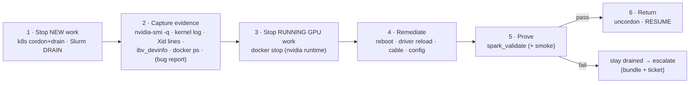
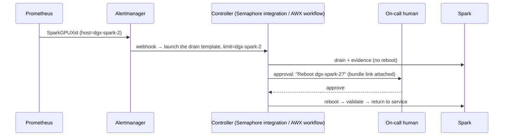

# Chapter 29 · Incident Response & Emergency Drain: Capture Evidence, Remediate, Prove, Return to Service

> **01-Ansible · Part V — Production operations · Chapter 29 of 30** · ← [Chapter 28 · Firmware lifecycle & vulnerability patching](28-firmware-lifecycle-and-vulnerability-patching.md) · [All chapters](00-ansible-step-by-step-guide.md) · [Chapter 30 · Capstone: build, break, prove](30-capstone-build-break-prove.md) →

| | |
|---|---|
| **You will build** | One drain role that works across Kubernetes (root cluster *and* the vClusters inside it) and Slurm (`node_drain`), a forensics bundle collected **before** anything is restarted, runbooks A–E for the failure modes a Spark actually has (GPU hang, Xid, unified-memory pressure, CX-7 degradation, unreachable node), and an alert-to-automation path |
| **Hardware** | 1–2× DGX Spark |
| **Clusters** | `spark-root` (the drain itself); `dev-lab` and `llms` to watch what tenants see |
| **Time** | 90 min (including drills) |
| **Risk** | Medium. You'll deliberately take nodes out of service |

---

## 1. The drain contract



**Evidence before remediation.** A reboot destroys the most useful data (GPU state, `nvidia-smi -q`, in-memory logs). The role collects first, time-boxing every command so that a hung GPU can't hang the drain.

**`serial: 1`, and refuse to run without `-l`.** A drain that runs against every host at once is an outage you caused yourself.

**Two ways to start it.** Normally from Semaphore: the template **`29.1 Emergency drain`** in project `spark-lab`, whose CLI args name the node (`["--limit", "dgx-spark-2,localhost"]`; keep `localhost` for play 1 and the `kubectl` steps) and whose extra variables pick the stages (`node_drain_reboot`, `node_drain_undrain_after`, `node_drain_bug_report`). The task history then records who drained which node, when, and what happened. **Break-glass** from your MacBook, when sema01 or vault01 is down (Chapter 04 §11):

```bash
cd "01-Ansible/lab"
tools/fetch-kubeconfig.sh sema01 || true          # if sema01 still answers; otherwise use the copy you fetched last
ansible-playbook playbooks/29.1-emergency-drain.yml -l dgx-spark-2,localhost -K -e node_drain_reboot=true
```

Without the Semaphore variable group, play 1 is skipped and the play logs in as `dgxadmin` with your key; the kubeconfig and the incident bundle are read from and written to the MacBook's `.cache/`. Afterwards, re-run the template in Semaphore so the record and the state are back on sema01.

> **The 15-minute certificate and the reboot.** Under Semaphore, play 1's certificate covers new logins for 15 minutes. The drain, the evidence and the containers use the already-open ControlPersist connection, but the reconnect **after** the reboot is a new login. With `node_drain_bug_report=true` (minutes of `nvidia-bug-report.sh`) plus a slow boot you can pass 15 minutes, and the reconnect fails with `Permission denied (publickey)`. Nothing is lost: the node is up and still drained. Run the template again with `node_drain_reboot=false node_drain_undrain_after=true`; play 1 issues a fresh certificate and the role validates and returns the node.

---

## 2. The role

```yaml
# lab/roles/node_drain/defaults/main.yml
---
# What the drain does, in order. Toggle stages per incident.
node_drain_k8s: "{{ inventory_hostname in groups['k8s_control_plane'] | default([]) + groups['k8s_workers'] | default([]) }}"
node_drain_slurm: "{{ inventory_hostname in groups['slurm_compute'] | default([]) }}"
node_drain_stop_containers: true        # docker containers using the GPU
node_drain_collect: true                # forensic bundle before anything is restarted
node_drain_bug_report: false            # nvidia-bug-report.sh takes minutes; enable for Xid cases
node_drain_reboot: false
node_drain_undrain_after: false         # only after reboot + validation passes
node_drain_reason: "maint: ansible drain {{ now(utc=true, fmt='%Y-%m-%dT%H:%MZ') }}"
node_drain_kubeconfig: "{{ lab_cache_dir | default(playbook_dir ~ '/../.cache') }}/kubeconfig-{{ lab_name | default('spark-lab') }}.yaml"
node_drain_context: spark-root          # the root owns the nodes; vCluster pods are drained as root pods
node_drain_bundle_dir: "{{ lab_cache_dir | default(playbook_dir ~ '/../.cache') }}/incidents"
```

```yaml
# lab/roles/node_drain/tasks/main.yml
---
# Order matters: stop NEW work → collect evidence → stop RUNNING work → remediate → prove → return.
- name: "1/6 Cordon + drain Kubernetes node"
  kubernetes.core.k8s_drain:
    kubeconfig: "{{ node_drain_kubeconfig }}"
    context: "{{ node_drain_context }}"
    name: "{{ inventory_hostname }}"
    state: drain
    delete_options:
      ignore_daemonsets: true
      delete_emptydir_data: true
      terminate_grace_period: 60
      wait_timeout: 300
  delegate_to: localhost
  become: false
  when: node_drain_k8s | bool

- name: "2/6 Drain in Slurm (running jobs finish, no new ones start)"
  ansible.builtin.command: >-
    scontrol update NodeName={{ inventory_hostname }} State=DRAIN Reason="{{ node_drain_reason }}"
  delegate_to: "{{ groups['slurm_controller'][0] }}"
  changed_when: true
  when: node_drain_slurm | bool

- name: "3/6 Collect forensic bundle"
  when: node_drain_collect | bool
  block:
    - name: Create remote bundle dir
      ansible.builtin.tempfile:
        state: directory
        prefix: incident-
      register: node_drain_tmp

    - name: Capture state (each command time-boxed; a hung GPU must not hang the drain)
      ansible.builtin.shell: |
        set -o pipefail
        cd {{ node_drain_tmp.path }}
        timeout 30 nvidia-smi -q                > nvidia-smi-q.txt 2>&1
        timeout 30 nvidia-smi                   > nvidia-smi.txt 2>&1
        journalctl -k --since "-2h" --no-pager  > kernel.log 2>&1
        journalctl -k -b -1 --no-pager          > kernel-prev-boot.log 2>&1 || true   # after a hard power-cycle
        journalctl -k --no-pager | grep -E 'NVRM|Xid|mlx5' > nvrm-xid.log 2>&1 || true
        journalctl -u docker -u containerd -u kubelet -u slurmd --since "-2h" --no-pager > services.log 2>&1
        cat /proc/meminfo > meminfo.txt
        ibdev2netdev > ibdev2netdev.txt 2>&1
        for d in $(ls /sys/class/infiniband 2>/dev/null); do ibv_devinfo -d $d; done > ibv_devinfo.txt 2>&1
        ip -s link > ip-link.txt
        docker ps -a > docker-ps.txt 2>&1
        
        timeout 600 nvidia-bug-report.sh --output-file nvidia-bug-report.log.gz >/dev/null 2>&1
        

        tar czf /tmp/{{ inventory_hostname }}-incident.tgz -C {{ node_drain_tmp.path }} .
      args:
        executable: /bin/bash
      changed_when: false
      check_mode: false        # read-only probe: must also run under --check (drift detection)

    - name: Pull bundle to the control node
      ansible.builtin.fetch:
        src: "/tmp/{{ inventory_hostname }}-incident.tgz"
        dest: "{{ node_drain_bundle_dir }}/{{ inventory_hostname }}-{{ now(fmt='%Y%m%d-%H%M%S') }}.tgz"
        flat: true

- name: "4/6 Stop GPU containers"
  ansible.builtin.shell: |
    set -o pipefail
    ids=$(docker ps -q)
    [ -z "$ids" ] && exit 0
    docker inspect $ids --format '{{ '{{' }}.Id{{ '}}' }} {{ '{{' }}.HostConfig.Runtime{{ '}}' }} {{ '{{' }}json .HostConfig.DeviceRequests{{ '}}' }}' \
      | awk '/nvidia/ {print $1}' | xargs -r docker stop -t 60
  args:
    executable: /bin/bash
  register: node_drain_stopped
  changed_when: node_drain_stopped.stdout | length > 0
  when: node_drain_stop_containers | bool

- name: "5/6 Reboot (optional)"
  ansible.builtin.reboot:
    reboot_timeout: 900
    post_reboot_delay: 30
    test_command: nvidia-smi -L
  when: node_drain_reboot | bool

- name: "6/6 Validate, then return to service"
  when: node_drain_undrain_after | bool
  block:
    - name: Run validation role
      ansible.builtin.include_role:
        name: spark_validate

    - name: Uncordon Kubernetes node
      kubernetes.core.k8s_drain:
        kubeconfig: "{{ node_drain_kubeconfig }}"
        context: "{{ node_drain_context }}"
        name: "{{ inventory_hostname }}"
        state: uncordon
      delegate_to: localhost
      become: false
      when: node_drain_k8s | bool

    - name: Resume in Slurm
      ansible.builtin.command: scontrol update NodeName={{ inventory_hostname }} State=RESUME
      delegate_to: "{{ groups['slurm_controller'][0] }}"
      changed_when: true
      when: node_drain_slurm | bool
```

```yaml
# lab/playbooks/29.1-emergency-drain.yml
---
# ansible-playbook playbooks/29.1-emergency-drain.yml -l dgx-spark-2 \
#   -e node_drain_reboot=true -e node_drain_undrain_after=true -e node_drain_bug_report=true
- name: Short-lived SSH certificate from vault01 (Semaphore runs only)
  ansible.builtin.import_playbook: 00-vault-cert.yml

- name: Emergency drain / remediation
  hosts: spark
  become: true
  serial: 1                       # never take the whole lab down at once
  max_fail_percentage: 0
  pre_tasks:
    - name: Refuse to run against every host without -l
      ansible.builtin.assert:
        that: ansible_limit is defined or (allow_all | default(false) | bool)
        fail_msg: "Use -l <host> (or -e allow_all=true if you really mean it)"
      run_once: true
  roles:
    - role: node_drain
```

### 2.1 What a drain does to the nested clusters

`node_drain_kubeconfig` is the lab file `kubeconfig-spark-lab.yaml` in the controller's state folder (sema01's state volume under Semaphore, `.cache/` on the MacBook), and `node_drain_context` pins `k8s_drain` to `spark-root` — whatever the file's `current-context` happens to be (someone may have run `kubectl config use-context llms` on it). Only the root has nodes to cordon. The by-hand equivalent is:

```bash
export KUBECONFIG=$PWD/.cache/kubeconfig-spark-lab.yaml
kubectl --context spark-root drain dgx-spark-2 --ignore-daemonsets --delete-emptydir-data --grace-period=60 --timeout=300s
```

A vCluster has no kubelet and no nodes of its own, so there's nothing to drain "inside" it. Every vCluster pod is a real pod on the root, renamed `<pod>-x-<namespace>-x-<vcluster>` in `vc-dev-lab` or `vc-llms`, and the root drain evicts it like any other pod:

| What runs on the node | What the drain does | What you see |
|---|---|---|
| Static control-plane pods (kube-apiserver, etcd, …) on dgx-spark-1 | Skipped: they are mirror pods, owned by the kubelet, not the API | The root API stays up |
| DaemonSets (cilium, kube-proxy, GPU Operator device plugin, MetalLB speaker) | Skipped (`ignore_daemonsets`) | Networking and the GPU stay advertised |
| vCluster control planes (`dev-lab`, `llms` StatefulSets in `vc-*`) | Evicted | That vCluster's API (`https://192.168.0.111` / `.112`) is down until it reschedules. On a single Spark that means until you uncordon |
| Tenant pods synced from a vCluster | Evicted | The tenant's controller recreates its pod; the syncer creates a new root pod, which stays `Pending` while the node is cordoned |
| Tenant PodDisruptionBudgets | Respected: vCluster syncs PDBs to the root | A tight tenant PDB can block the drain until `wait_timeout` (§5) |

```bash
kubectl --context spark-root get pods -A -o wide --field-selector spec.nodeName=dgx-spark-2   # what is still there
kubectl --context spark-root -n vc-llms get pods                                           # tenant pods, root names
kubectl --context spark-root get pdb -A                                                    # synced PDBs show up in vc-*
```

**Single Spark:** `dgx-spark-1` is the only node, so draining it stops *every* workload in all three clusters (the root API itself keeps running). That's correct for a GPU hang, but it isn't a rolling drain. Use `node_drain_k8s=false` if you only need the evidence bundle.

---

## 3. Runbooks

### Runbook A — GPU hang (`nvidia-smi` doesn't answer)

**Signals:** `SparkGPUUnresponsive` alert; Slurm health check drains the node (`healthcheck: nvidia-smi unresponsive`); workloads stuck in CUDA calls.

Semaphore: template `29.1 Emergency drain`, `--limit dgx-spark-2,localhost`, extra variables `node_drain_bug_report: true`, `node_drain_reboot: true`, `node_drain_undrain_after: true` (see the certificate note in §1). Break-glass:

```bash
ansible-playbook playbooks/29.1-emergency-drain.yml -l dgx-spark-2,localhost -K \
  -e node_drain_bug_report=true -e node_drain_reboot=true -e node_drain_undrain_after=true
```

If it happens again after the reboot, keep the node drained and open a case with the bundle (`incidents/dgx-spark-2-*.tgz` in the state folder, `/opt/spark-lab/cache` on sema01; it includes `nvidia-bug-report.log.gz`), and check for a driver/firmware update (Chapters 10, 28).

### Runbook B — Xid triage

**Signals:** `SparkGPUXid` alert; Loki `|= "NVRM: Xid"`.

```bash
ansible dgx-spark-2 -b -m shell -a "journalctl -k --since '-24h' --no-pager | grep 'NVRM: Xid'"
```

| Xid (common meaning, per NVIDIA's Xid catalogue) | Usually | Action |
|---|---|---|
| 13 Graphics engine exception | Application (bad kernel, OOB) | Tell the workload owner; no drain unless repeated across apps |
| 31 GPU memory page fault | Application (bad pointer) | Same |
| 43 GPU stopped processing | Application / driver | Watch; drain if it repeats with different apps |
| 45 Preemptive cleanup | Follow-on to another error | Look at the preceding Xid |
| 48, 63, 64, 94, 95 ECC / memory-remap family | Hardware / memory | **Drain + bug report.** Tolerate no repeats |
| 74 NVLink error | Interconnect | **Drain**, bug report |
| 79 GPU has fallen off the bus | Hardware / power / PCIe | **Drain + reboot**; if it recurs → RMA path |
| 119 / 120 GSP RPC timeout / error | Driver / firmware | Drain + reboot; check the driver/firmware update level |

The Slurm health check (Chapter 22) auto-drains on the hardware-class codes; the kata in Chapter 07 (K3) is the same classification in Jinja. Check NVIDIA's Xid documentation for the codes and fields your driver branch reports.

### Runbook C — Unified-memory pressure

**Signals:** `SparkUnifiedMemoryLow`; CUDA OOM "while nvidia-smi shows nothing"; kubelet `MemoryPressure` evictions (the kubelet evicts below `memory.available` 4Gi, `roles/kubeadm_cluster/defaults`); the OOM killer in `dmesg`.

Kubernetes side first: `kubectl --context spark-root get pods -A --field-selector=status.phase=Failed` lists evicted pods, vCluster pods included under their root names. The vCluster budgets cap memory with `limits.memory` (dev-lab 8Gi, llms 88Gi), but they are ceilings, not reservations. A model server started outside Kubernetes (Docker, Slurm) still takes from the same pool.

```yaml
# lab/playbooks/29.2-uma-relief.yml
---
# Runbook C — unified-memory pressure on a DGX Spark.
# Diagnose first (always), relieve second (opt-in flags).
#   ansible-playbook playbooks/29.2-uma-relief.yml -l dgx-spark-1 -K                       # diagnose only
#   ansible-playbook playbooks/29.2-uma-relief.yml -l dgx-spark-1 -K -e uma_drop_caches=true
#   ansible-playbook playbooks/29.2-uma-relief.yml -l dgx-spark-1 -K -e uma_stop_label=spark.lab/idle=true
- name: Short-lived SSH certificate from vault01 (Semaphore runs only)
  ansible.builtin.import_playbook: 00-vault-cert.yml

- name: UMA pressure diagnosis and relief
  hosts: spark
  become: true
  gather_facts: false
  vars:
    uma_drop_caches: false
    uma_stop_label: ""          # stop running containers carrying this label (key=value)
  tasks:
    - name: Memory picture
      ansible.builtin.shell: |
        set -o pipefail
        echo "== meminfo (GiB)"
        awk '/MemTotal|MemAvailable|^Cached|Shmem:|AnonPages|Mlocked/{printf "%-14s %6.1f\n",$1,$2/1048576}' /proc/meminfo
        echo "== top processes by RSS"
        ps -eo pid,user,rss,comm --sort=-rss | head -8 | awk 'NR==1{print;next}{printf "%-8s %-10s %6.1fG %s\n",$1,$2,$3/1048576,$4}'
        echo "== GPU compute processes (memory column is N/A on UMA)"
        timeout 10 nvidia-smi --query-compute-apps=pid,process_name --format=csv,noheader || echo "nvidia-smi unavailable"
        echo "== containers by memory"
        docker stats --no-stream --format '{{ "{{" }}.MemUsage{{ "}}" }}\t{{ "{{" }}.Name{{ "}}" }}' 2>/dev/null | sort -h -r | head -8
      args: { executable: /bin/bash }
      register: uma_diag
      changed_when: false
      check_mode: false

    - name: Show diagnosis
      ansible.builtin.debug:
        msg: "{{ uma_diag.stdout_lines }}"

    - name: Record MemAvailable before
      ansible.builtin.shell: awk '/MemAvailable/{print int($2/1048576)}' /proc/meminfo
      register: uma_before
      changed_when: false
      check_mode: false

    - name: Stop labelled containers
      ansible.builtin.shell: |
        set -o pipefail
        ids=$(docker ps -q --filter "label={{ uma_stop_label }}")
        [ -z "$ids" ] && exit 0
        docker stop -t 30 $ids && echo "stopped: $ids"
      args: { executable: /bin/bash }
      register: uma_stopped
      changed_when: "'stopped' in uma_stopped.stdout"
      when: uma_stop_label | length > 0

    - name: Drop page cache (safe; next model load will be cold)
      ansible.builtin.shell: sync && echo 3 > /proc/sys/vm/drop_caches
      changed_when: true
      when: uma_drop_caches | bool

    - name: Record MemAvailable after
      ansible.builtin.shell: awk '/MemAvailable/{print int($2/1048576)}' /proc/meminfo
      register: uma_after
      changed_when: false
      check_mode: false

    - name: Result
      ansible.builtin.debug:
        msg: "MemAvailable {{ uma_before.stdout }} GiB → {{ uma_after.stdout }} GiB"
```

Semaphore: template `29.2 UMA relief` (`--limit dgx-spark-1,localhost`; extra variable `uma_drop_caches: true` to relieve). Break-glass:

```bash
ansible-playbook playbooks/29.2-uma-relief.yml -l dgx-spark-1,localhost -K                          # diagnose
ansible-playbook playbooks/29.2-uma-relief.yml -l dgx-spark-1,localhost -K -e uma_drop_caches=true   # relieve
```

Prevent it from recurring: set memory limits on model-server containers, keep the kubelet reserve (Chapter 19), give idle services the `spark.lab/idle=true` label so this runbook can stop them, and don't run Kubernetes and Slurm GPU jobs on the same node at the same time.

### Runbook D — CX-7 link degraded / down

**Signals:** `SparkCX7Degraded` (speed < 200G), NCCL falls back to `NET/Socket`, NFS falls back to TCP.

```bash
ansible spark -b -K -m shell -a "ibdev2netdev; ethtool enp1s0f1np1 | grep -E 'Speed|Link detected'"   # MacBook, ad hoc
# then Semaphore: 13.1 Fabric (re-assert config + verify), 13.2 RDMA perftest (measure after fixing); break-glass:
ansible-playbook playbooks/13.1-fabric.yml -K
ansible-playbook playbooks/13.2-rdma-perftest.yml -K
```

Fix order: reseat the cable, then check that the same cage is used on both ends, then check the switch port speed (forced 200G), and finally reboot both nodes (NVIDIA's documented step when links won't come up). Drain dependent Slurm or Kubernetes multi-node jobs first (the llms vCluster's `batch` jobs use the CX-7 through the Multus NADs in `vc-llms`). A 2-node job can't run on a broken link.

### Runbook E — Node unreachable (no BMC)

A Spark has **no out-of-band management**. When SSH and ping fail:

1. Check from the other Spark over the fabric (`ping 192.168.100.12`). If that works, the problem is on the management network, not the node.
2. Check the local console (monitor/keyboard), or the power LED.
3. Power-cycle. For a desk lab, a **smart plug** with an API is the practical stand-in for a BMC power action. Ansible can drive it (e.g. a Home Assistant or Tasmota HTTP call from `delegate_to: localhost`).
4. After it boots: the template `29.1 Emergency drain` (default `node_drain_collect=true`) still captures the *previous boot's* kernel log (`journalctl -k -b -1`) because journald is persistent (Chapter 04 §6.3 baseline).

---

## 4. From alert to automation



Automate **steps 1–3** (safe and reversible). Gate **step 4** (reboot or reload) behind a human. Semaphore has no approval node: give the webhook-triggered run only the drain-and-evidence stages (`node_drain_reboot=false`), and keep the reboot as a separate run a person starts. AWX can express the whole flow with an approval node (Chapter 24). On a single-user lab you can skip the approval, but keep the structure.

---

## 5. Troubleshooting the drain itself

| Symptom | Diagnose | Fix |
|---|---|---|
| k8s drain times out | `kubectl --context spark-root get pods -A -o wide --field-selector spec.nodeName=dgx-spark-2`; `kubectl --context spark-root get pdb -A` | PodDisruptionBudgets (including tenant PDBs synced from a vCluster into `vc-*`) or unmanaged pods; `terminate_grace_period`; delete stuck pods with the owner's consent. For a tenant pod, ask the tenant to delete it through their own context (`--context llms`), or the syncer may fight you |
| Drain fails with "node not found" / context error | `kubectl --kubeconfig .cache/kubeconfig-spark-lab.yaml config get-contexts` | `node_drain_context` must name the root (`spark-root`); a vCluster context has synced nodes you can't cordon from there. Fix the variable or re-run the template `19.1 Kubernetes` to restore the context. Break-glass from the MacBook: `tools/fetch-kubeconfig.sh sema01` first, or the drain uses a stale or missing `.cache/` copy |
| Reconnect after the reboot: `Permission denied (publickey)` (Semaphore) | Task duration vs. the 15-minute certificate | Run the template again with `node_drain_reboot=false node_drain_undrain_after=true` (§1) |
| Slurm DRAIN never reaches DRAINED | `squeue -w dgx-spark-2` | Running jobs finish first (by design); `scancel` only if agreed |
| Evidence capture hangs | Which command? Everything is wrapped in `timeout` | A new command without `timeout` → add it |
| Reboot task times out | Console | Capsule/firmware work on boot takes long (Chapter 28), or the node didn't come back: Runbook E |
| Returned to service but alerts fire again | Loki/Prometheus since the reboot | Root cause not fixed; re-drain with `node_drain_undrain_after=false` |

## 6. Validation (drills)

- [ ] Drill A: drain dgx-spark-2 with evidence and a reboot; the bundle exists; the node returns only after validation passes.
- [ ] Drill C: load a model until `SparkUnifiedMemoryLow` fires; relieve with the runbook; record before/after GiB.
- [ ] Drill D: pull the QSFP cable during a perftest; alert, then diagnosis, then recovery.
- [ ] The playbook refuses to run without `-l`.
- [ ] Break-glass drill: with the Semaphore container stopped (`docker compose stop semaphore` on sema01), drain and return a node from the MacBook, then start Semaphore again and re-run the template.
