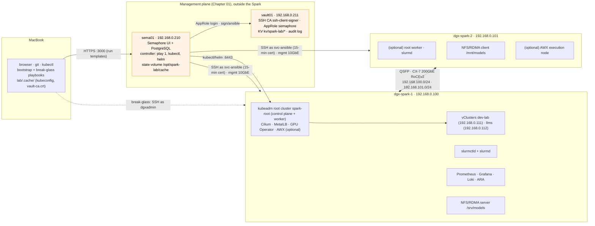
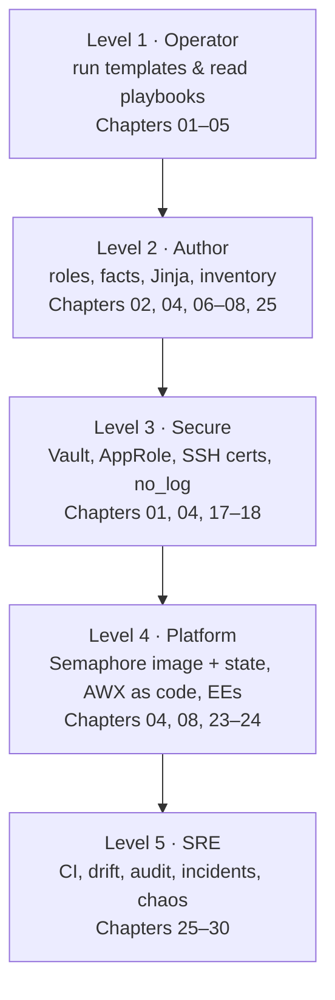
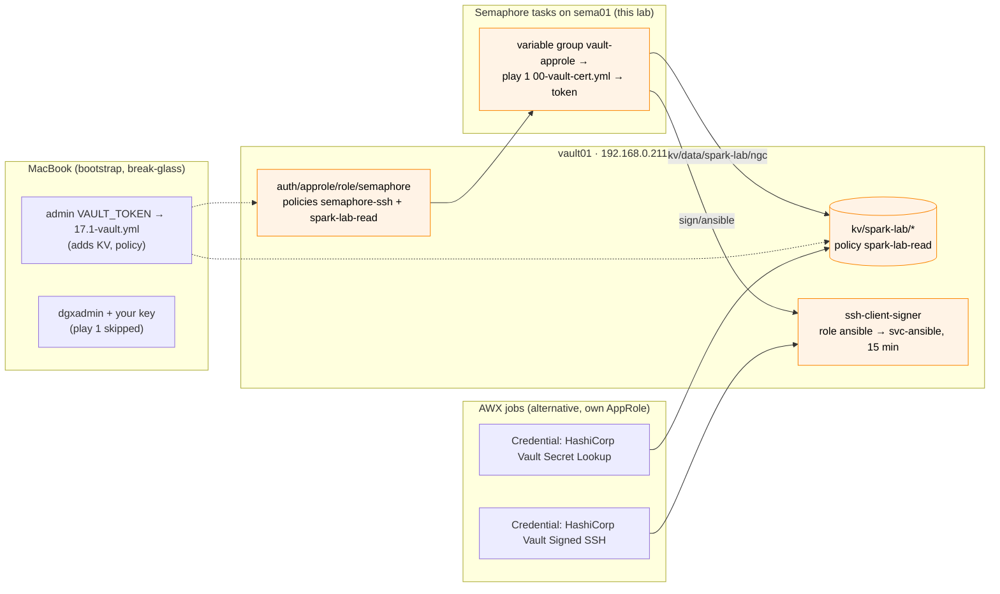

# 01-Ansible · Ansible for AI Infrastructure, Hands-On on NVIDIA DGX Spark

Production-grade automation you can actually run: every chapter is built around a **working Ansible project in [`lab/`](lab/)** targeting one or two **DGX Spark** systems (GB10 Grace Blackwell, 128 GB unified memory of which ~119.7 GiB is usable, ConnectX-7 200GbE). Each chapter has HLD/LLD diagrams, the real roles and playbooks, integrations, a troubleshooting runbook and a validation checklist.

Where a data-centre concept doesn't exist on a Spark (NVSwitch/Fabric Manager, InfiniBand subnet managers, BMC/Redfish, parallel file systems), the document says so, maps the concept to what the Spark actually has, and gives you a way to practise the data-centre version.

## How this module is organised

| Level | Name | Example |
|---|---|---|
| Folder | **Module** | `01-Ansible` |
| Group of documents | **Part** | Part I — Management plane & Ansible foundations (Parts I–V) |
| Document | **Chapter** | Chapter 19 · Kubernetes: kubeadm root cluster & vClusters (Chapters 00–30) |
| Heading in a document | **Section** | §3.4 |
| Hands-on exercise in a document | **Task** | Task 2 · Apply the quota |
| Semaphore item | **Template** | `19.1 Kubernetes`, named `<chapter>.<n> <Name>` |

References read "Chapter 19 §3.4"; across modules, "01-Ansible Chapter 19" or "02-Kubernetes Chapter 04". Playbook files carry the same numbers as their templates: `19.1-kubernetes.yml` is template `19.1 Kubernetes`, explained in Chapter 19. The two exceptions are `00-vault-cert.yml` (play 1, imported by every playbook that SSHes to the Sparks) and `site.yml` (template `site`).

---

## Reference lab

The lab has two halves. The **management plane** stays outside the Spark: `sema01` (Semaphore UI) runs every playbook, and `vault01` (HashiCorp Vault) signs a 15-minute SSH certificate for each task and keeps the lab's secrets. The **DGX Spark** is only a target, so you can reset or re-image it without losing the tool that rebuilds it.




One Spark is the default. `dgx-spark-2` is commented out in [`lab/inventory/hosts.yml`](lab/inventory/hosts.yml), so Semaphore templates and break-glass runs need no `--limit`; if you do limit a run, keep `localhost` in it (`-l dgx-spark-1,localhost`). The fabric, NCCL and NFS/RDMA chapters (13–15) skip themselves, and `dgx-spark-1` alone is a complete Kubernetes cluster (no control-plane taint). When a second Spark joins, uncomment `dgx-spark-2` (192.168.0.101) in `spark` and in the groups it belongs to.

The Kubernetes end-state is one **kubeadm** root cluster (`spark-root`) with two **vClusters** inside it, `dev-lab` and `llms`. Ansible builds it in three stages: `19.1-kubernetes.yml` (kubeadm, Cilium, MetalLB) → `20.1-gpu-operator.yml` (15 GPU time-slices) → `20.2-vclusters.yml` (the two vClusters, applied from the [02-Kubernetes lab](../02-Kubernetes/lab/README.md)). All three contexts land in one file, `kubeconfig-spark-lab.yaml`, on sema01's state volume; `lab/tools/fetch-kubeconfig.sh sema01` copies it to `lab/.cache/` on your MacBook, where the 02-Kubernetes labs expect it.

> **Convention used in every chapter.** "**Semaphore:** `NN Name`" means run that template in project `spark-lab`; template names follow the playbook names (`19.1 Kubernetes` ↔ `19.1-kubernetes.yml`). The same playbook from the MacBook, `ansible-playbook playbooks/NN-….yml -K` in `01-Ansible/lab`, is the **break-glass** path: without the Semaphore variable group, play 1 is skipped and you log in as `dgxadmin` with your own key ([Chapter 04 §11](04-dgx-spark-as-semaphore-target.md)). Only `03.1-bootstrap.yml`, `04.1-semaphore-target.yml` and `17.1-vault.yml` run from the MacBook as the normal path. A template's number is `<chapter>.<n>`, the chapter that explains it: **`19.1 Kubernetes`** is the first template of **Chapter 19**. The exceptions are `00-vault-cert.yml` and `site`.

## Start here

1. **[Chapter 00 · Step-by-step guide](00-ansible-step-by-step-guide.md)**: the build order. One section per chapter, each linking its document, with the Semaphore template(s) or MacBook commands to run and a "Done when" check.
2. **[Chapter 01 · Management plane: Semaphore & Vault](01-management-plane-semaphore-and-vault.md)**: the first chapter, `vault01` and `sema01` built by hand. Then follow the guide.
3. **[`lab/README.md`](lab/README.md)**: the project layout and quick start.

```bash
cd "01-Ansible/lab"                          # on your MacBook
pip install -r requirements.txt && ansible-galaxy collection install -r requirements.yml -p ./collections
tests/run-local-checks.sh                    # lint, syntax, katas, fixture tests: no Spark needed
```

Once Chapter 04 is done, the Semaphore template `site` builds the whole lab in one task, or you run the stage templates one after the other as the guide does.

---

## Curriculum

Every document is numbered as its chapter. Work through them in order with the [step-by-step guide](00-ansible-step-by-step-guide.md): Chapter 02 is MacBook-only (toolchain, inventory), Chapter 03 gives the MacBook key login to the Spark, and Chapter 04 makes it a Semaphore target and runs first contact, custom facts and the baseline.

### Part I — Management plane & Ansible foundations

| Chapter | Document | Lab pieces |
|---|---|---|
| 01 | [Management plane: Semaphore & Vault](01-management-plane-semaphore-and-vault.md) | `sema01`, `vault01`, `00-vault-cert.yml` (play 1) |
| 02 | [Control node & Ansible core](02-control-node-and-ansible-core.md) | `ansible.cfg`, inventory, `tests/run-local-checks.sh` |
| 03 | [Bare-metal provisioning & bootstrap](03-bare-metal-provisioning-and-bootstrap.md) | `03.1-bootstrap` (dead-man switch), SSH trust, `03.2-redfish-practice` |
| 04 | [DGX Spark as a Semaphore target](04-dgx-spark-as-semaphore-target.md) | `04.1-semaphore-target`, `semaphore/`, `04.2-ping`, `04.3-baseline`, custom facts `spark_facts`, role `spark_baseline`, `17.1-vault`, `tools/fetch-kubeconfig.sh` |
| 05 | [Execution internals & debugging](05-execution-internals-and-debugging.md) | AnsiballZ explode/execute, async, debugger |
| 06 | [Inventory: static, dynamic & discovery](06-inventory-static-dynamic-and-discovery.md) | `inventory_plugins/spark_mdns.py`, `zz-constructed.yml` |
| 07 | [Jinja2 filters & data transforms](07-jinja2-filters-and-data-transforms.md) | `07.1-jinja-lab.yml` (7 katas) |
| 08 | [Roles, collections & execution environments](08-roles-collections-and-execution-environments.md) | `argument_specs`, `build-collection.sh`, `ee/` |
| 09 | [Performance at scale: SSH mux & Mitogen](09-performance-at-scale-ssh-mux-and-mitogen.md) | `09.1-fleet-sim`, `09.2-fleet-bench` |

### Part II — Node provisioning

| Chapter | Document | Lab pieces |
|---|---|---|
| 10 | [NVIDIA driver stack & Fabric Manager](10-nvidia-driver-stack-and-fabric-manager.md) | `10.1-driver-audit`, `10.2-dgxos-upgrade` (dry run) |
| 11 | [CUDA, NGC containers & CDI](11-cuda-ngc-containers-and-cdi.md) | `container_runtime`, `11.1-containers`, `11.2-cuda-smoke`, `uma_probe.cu` |
| 12 | [GPU telemetry & alerting](12-gpu-telemetry-and-alerting.md) | `gpu_telemetry`, `12.1-telemetry`, Grafana dashboard, 7 alert rules |

### Part III — Fabric & storage

| Chapter | Document | Lab pieces |
|---|---|---|
| 13 | [ConnectX-7 fabric & OpenSM](13-connectx7-fabric-and-opensm.md) | `cx7_fabric`, `13.1-fabric`, `13.2-rdma-perftest` |
| 14 | [RoCEv2, QoS & NCCL](14-rocev2-qos-and-nccl.md) | `14.1-roce-qos`, `14.2-nccl-test` |
| 15 | [NFS over RDMA & parallel file systems](15-nfs-rdma-and-parallel-file-systems.md) | `nfs_rdma`, `15.1-nfs-rdma` |
| 16 | [GPUDirect Storage & cuFile](16-gpudirect-storage-and-cufile.md) | `16.1-gds-check` |

### Part IV — Secrets & platforms

| Chapter | Document | Lab pieces |
|---|---|---|
| 17 | [Vault server deep dive](17-vault-server-deep-dive.md) | `vault01` (built in Chapter 01, outside the Spark) |
| 18 | [Vault AppRole, secrets & SSH certificates](18-vault-approle-secrets-and-ssh-certificates.md) | `00-vault-cert`, `vault_config` (`17.1-vault`), `18.1-vault-integration` |
| 19 | [Kubernetes: kubeadm root cluster & vClusters](19-kubernetes-kubeadm-root-cluster-and-vclusters.md) | `kubeadm_cluster`, `cilium`, `metallb`, `vclusters`, `19.1-kubernetes`, `20.2-vclusters`, `19.2-reset-kubernetes` |
| 20 | [NVIDIA GPU Operator & time-slicing](20-nvidia-gpu-operator-and-time-slicing.md) | `gpu_operator`, `20.1-gpu-operator` |
| 21 | [Multus & secondary RDMA networks](21-multus-and-secondary-rdma-networks.md) | `21.1-multus-rdma` |
| 22 | [Slurm: GRES & cgroup GPUs](22-slurm-gres-and-cgroup-gpus.md) | `slurm_cluster`, `22.1-slurm` |
| 23 | [AWX install & configuration as code](23-awx-install-and-configuration-as-code.md) (optional; the alternative controller, this lab runs Semaphore) | awx-operator, `awx.awx` |
| 24 | [AWX production & Receptor](24-awx-production-and-receptor.md) (optional) | receptor, `AWXBackup` |

### Part V — Production operations

| Chapter | Document | Lab pieces |
|---|---|---|
| 25 | [Testing, linting & CI](25-testing-linting-and-ci.md) | `tests/`, `.github/workflows/ansible-lab-ci.yml` |
| 26 | [Drift detection & self-healing](26-drift-detection-and-self-healing.md) | `26.1-drift-check`, `drift-cycle.sh`, `spark_drift_report.py` |
| 27 | [Logging & audit compliance](27-logging-and-audit-compliance.md) | `27.1-logging-audit` |
| 28 | [Firmware lifecycle & vulnerability patching](28-firmware-lifecycle-and-vulnerability-patching.md) | `28.1-firmware-inventory`, `10.2-dgxos-upgrade`, fwupd in the upgrade |
| 29 | [Incident response & emergency drain](29-incident-response-and-emergency-drain.md) | `node_drain`, `29.1-emergency-drain`, `29.2-uma-relief` |
| 30 | [Capstone: build, break, prove](30-capstone-build-break-prove.md) | `spark_validate`, `spark_invariants.py`, `30.2-chaos`, `capstone_scorecard.py` |

---

## Learning roadmap

The step-by-step guide is the *build order*; this is the *learning order*: five levels of skill, each with what you should be able to do (not just read) and the chapters that practise it. Every lab playbook runs as a Semaphore template; the CLI form is the break-glass path from your MacBook.



### Level 1 · Operator (week 1)

| Skill | Practise with | Checkpoint (you can…) |
|---|---|---|
| Inventory, ad-hoc, playbook runs | Semaphore templates `04.2 Ping`, `04.3 Baseline`; the same playbooks from the MacBook ([Chapter 02](02-control-node-and-ansible-core.md), [Chapter 04 §6](04-dgx-spark-as-semaphore-target.md)) | explain every line of `ansible.cfg` and `hosts.yml`, and why `group_vars/spark.yml` logs in as `svc-ansible` in Semaphore but `dgxadmin` from the MacBook |
| Check/diff, tags, limits | `04.3 Baseline` as a dry run: `--check --diff --tags sysctl` (if you add `--limit`, keep `localhost`) | predict what a run will change before it runs |
| Reading failures | [Chapter 05](05-execution-internals-and-debugging.md) | tell whether a failure is SSH, sudo, Python, module, or logic from the error alone |

### Level 2 · Author (weeks 2–3)

| Skill | Practise with | Checkpoint |
|---|---|---|
| Custom facts | `spark.fact` ([Chapter 04 §6.2](04-dgx-spark-as-semaphore-target.md)) | add a field (e.g. NVMe model) and target a group by it |
| Jinja data transforms | `07.1-jinja-lab.yml` ([Chapter 07](07-jinja2-filters-and-data-transforms.md)) | parse any command output into a dict and assert on it |
| Role design & argument specs | `cx7_fabric` ([Chapter 08](08-roles-collections-and-execution-environments.md)) | write a role with defaults, argument_specs, pre-flight → configure → verify |
| Dynamic inventory | `spark_mdns`, `constructed` ([Chapter 06](06-inventory-static-dynamic-and-discovery.md)) | write an inventory plugin with a fixture test |
| Idempotence | Molecule ([Chapter 25](25-testing-linting-and-ci.md)) | make any role pass the idempotence step |

### Level 3 · Secure (week 3)

| Skill | Practise with | Checkpoint |
|---|---|---|
| Vault operations | vault01 ([Chapter 01](01-management-plane-semaphore-and-vault.md), [Chapter 17](17-vault-server-deep-dive.md)) | init/unseal/snapshot/restore from memory; explain seal vs unseal and what a sealed vault01 does to every Semaphore task |
| Policies & KV v2 paths | `vault_config` role (`17.1-vault.yml` from the MacBook: `spark-lab-read`, [Chapter 04 §7](04-dgx-spark-as-semaphore-target.md)) | write a least-privilege policy first time (remember `kv/data/` vs `kv/metadata/`) |
| AppRole + short-lived tokens | play 1 `00-vault-cert.yml`, `18.1-vault-integration.yml` ([Chapter 18](18-vault-approle-secrets-and-ssh-certificates.md)) | run automation with no static secrets on disk: Semaphore holds only the AppRole |
| SSH certificates | `04.1-semaphore-target.yml`, `tools/vault-ssh-cert.sh` ([Chapter 04](04-dgx-spark-as-semaphore-target.md)) | retire static keys safely, with a break-glass path (`dgxadmin` + your key from the MacBook) |
| Secret hygiene | `no_log`, `.gitignore`, audit log ([Chapter 18](18-vault-approle-secrets-and-ssh-certificates.md)) | prove a secret never reached `ansible.log`, a Semaphore task log, AWX output, or ARA |

### Level 4 · Platform (week 4)

| Skill | Practise with | Checkpoint |
|---|---|---|
| Semaphore as the lab's controller | [Chapter 04](04-dgx-spark-as-semaphore-target.md), `lab/semaphore/` | rebuild the lab image, explain why its state lives on a volume and why the controller lives outside the Spark |
| AWX install (arm64 aware), the alternative controller | [Chapter 23](23-awx-install-and-configuration-as-code.md) | choose between on-Spark and hybrid based on the image pre-flight |
| AWX as code | `awx.awx` collection ([Chapter 23 §3.4](23-awx-install-and-configuration-as-code.md)) | rebuild all AWX config from git |
| Execution Environments | `ee/execution-environment.yml` ([Chapter 08 §3.2](08-roles-collections-and-execution-environments.md)) | build a multi-arch EE and pin it by digest |
| Receptor & execution nodes | [Chapter 24](24-awx-production-and-receptor.md) | make a Spark an execution node |
| Vault-backed credentials | [Chapter 24](24-awx-production-and-receptor.md) | map Semaphore's play 1 to AWX's *Signed SSH* credential; jobs get secrets and SSH certs from vault01 at run time |

### Level 5 · SRE (ongoing)

| Skill | Practise with | Checkpoint |
|---|---|---|
| CI gates | [Chapter 25](25-testing-linting-and-ci.md) | a broken role can't merge |
| Drift & guarded self-heal | [Chapter 26](26-drift-detection-and-self-healing.md) | explain why fabric drift is reported, not healed |
| Audit trail | [Chapter 27](27-logging-and-audit-compliance.md) | answer "who changed X, when, how" in under 5 minutes |
| Incident response | [Chapter 29](29-incident-response-and-emergency-drain.md) | run Runbooks A–E without the page open |
| Chaos | template `30.2 Chaos` ([Chapter 30](30-capstone-build-break-prove.md)) | find 5 of 7 faults unaided |

### The Vault ↔ Ansible ↔ Semaphore / AWX wiring



### Certification targets (if you want external milestones)

- Red Hat Certified Engineer (EX294): Ansible fundamentals (Levels 1–2).
- HashiCorp Certified: Vault Associate (Level 3).
- Red Hat Ansible Automation Platform specialist exams (Level 4). The skills map directly from AWX.
- NVIDIA DLI / NVIDIA-Certified Associate/Professional in AI Infrastructure (the GPU and fabric side of this lab).

Check each vendor's site for current exam names and versions; they change.

---

## How the lab was verified

Built and checked in a workspace **without** Spark hardware, so it was verified at every layer short of the device:

| Check | Result |
|---|---|
| `ansible-lint` (production profile) + `yamllint` | pass |
| `ansible-playbook --syntax-check` on every playbook | pass |
| Jinja katas against real Spark command output | 7/7 |
| Template rendering (netplan, slurm.conf, Prometheus) | rendered and YAML-validated |
| Prometheus config + 7 alert rules + collector output | `promtool check config/rules/metrics` pass |
| Loki config / Alloy pipeline | `loki -verify-config` / `alloy fmt` pass |
| `uma_probe.cu` | compiles for `sm_121` with nvcc 13.x |
| Vault integration (play 1: AppRole → token → SSH sign → KV v2) | exercised against a stand-in for Vault's HTTP API |
| Custom inventory plugin, drift reporter, firmware diff, argument specs, collection build | fixture-tested |

**Not yet run on a real Spark.** Your first pass through the step-by-step guide is the hardware test. Versions pinned in the lab (Kubernetes, Cilium, MetalLB, GPU Operator and vCluster charts, container images, NCCL) are current as of this writing; check them before you run.
