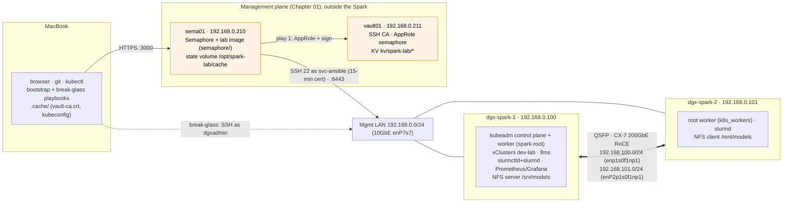

# 01-Ansible Lab · Runnable Companion to Chapters 01–30

Everything Chapters 01–30 teach, as a working Ansible project you run against
one or two NVIDIA DGX Spark systems. Every code block in the chapter documents is taken
from (or runs against) this directory. The build order is the
[step-by-step guide](../00-ansible-step-by-step-guide.md).

The playbooks run as **Semaphore tasks** on `sema01` (192.168.0.210), with a
15-minute SSH certificate from `vault01` (192.168.0.211). Both stay outside the
Spark and are built by hand in [Chapter 01](../01-management-plane-semaphore-and-vault.md);
[Chapter 04](../04-dgx-spark-as-semaphore-target.md) makes the Spark their target.
A command `ansible-playbook playbooks/NN.n-….yml` in the chapter documents means "run the
Semaphore template `NN.n …`"; the CLI form is the break-glass path from your MacBook
(`-K`; if you limit a run, keep `localhost`: `-l dgx-spark-1,localhost`).

```
lab/
├── ansible.cfg                 # pipelining, ControlPersist, fact cache, log_path, plugin paths   (Chapters 02, 09)
├── requirements.txt / .yml     # control-node Python + collections                               (Chapter 08)
├── inventory/
│   ├── hosts.yml               # control (localhost) + spark + functional groups                   (Chapter 06)
│   ├── zz-constructed.yml      # groups from facts: gpu_ready, driver_580, uma_pressure…         (Chapter 06)
│   ├── group_vars/all.yml      # lab-wide: user, networks, NTP, lab_cache_dir, vault01/sema01 settings (vault_*, semaphore_url)
│   ├── group_vars/spark.yml    # login switch (svc-ansible + cert under Semaphore, dgxadmin otherwise), GB10 golden values, packages, sysctls
│   └── host_vars/dgx-spark-N.yml  # per-node CX-7 addressing
├── inventory_plugins/spark_mdns.py   # discover Sparks via Avahi/mDNS                            (Chapter 06)
├── inventory-examples/         # opt-in sources (mDNS)
├── roles/
│   ├── spark_facts             # /etc/ansible/facts.d/spark.fact (GPU, CUDA, CX-7, UMA)          (Chapters 04, 07)
│   ├── spark_baseline          # packages, NVIDIA holds, sysctl, SSH, chrony, journald + Molecule (Chapters 04, 25)
│   ├── cx7_fabric              # netplan, MTU, 200G/RDMA verify, runtime reconcile, GID, argspec (Chapters 13, 08)
│   ├── container_runtime       # docker + nvidia-ctk + CDI (freshness-checked) + NGC              (Chapter 11)
│   ├── gpu_telemetry           # textfile collector, Prometheus/Grafana/Alertmanager, dashboard  (Chapter 12)
│   ├── kubeadm_cluster         # kubeadm root cluster spark-root: containerd + nvidia runtime,   (Chapter 19)
│   │                           #   audit log, Secret encryption, etcd snapshot timer, workers join
│   ├── cilium                  # Cilium CNI (VXLAN, kube-proxy kept), Hubble UI :31235          (Chapter 19)
│   ├── metallb                 # MetalLB L2 pool 192.168.0.110-119                               (Chapter 19)
│   ├── gpu_operator            # Helm, driver/toolkit disabled, 15 time-slices                  (Chapter 20)
│   ├── vclusters               # vClusters dev-lab + llms from ../../02-Kubernetes/lab           (Chapters 19, 20)
│   ├── slurm_cluster           # munge, slurm.conf, gres.conf, cgroup v2, health check          (Chapter 22)
│   ├── vault_config            # adds to vault01: KV kv/, policy spark-lab-read → AppRole semaphore (Chapter 18)
│   ├── nfs_rdma                # NFSv4.2 over RDMA model cache                                   (Chapter 15)
│   ├── node_drain              # cordon → capture → stop → reboot → validate → return            (Chapter 29)
│   └── spark_validate          # end-to-end invariants + JSON report                             (Chapter 30)
├── playbooks/                  # 03.1-bootstrap … 30.2-chaos, site.yml (see ../00-ansible-step-by-step-guide.md)
│   │                           #   one Semaphore template per playbook, same number ("19.1 Kubernetes" = 19.1-kubernetes.yml)
│   ├── 00-vault-cert.yml           # play 1: AppRole login → 15-min cert for svc-ansible (+ kv/spark-lab/*)              (Chapters 01, 18)
│   │                               #   imported first by every playbook that SSHes to the Sparks; skipped off Semaphore
│   ├── 03.1-bootstrap.yml          # MacBook only: hostname, key, static IP with dead-man switch                         (Chapter 03)
│   ├── 04.1-semaphore-target.yml   # MacBook, once: svc-ansible + NOPASSWD sudo, trust vault01's CA                      (Chapter 04)
│   ├── 04.2-ping.yml               # first contact: SSH, sudo, Python, it IS a Spark                                     (Chapter 04 §6.1)
│   ├── 04.3-baseline.yml           # custom facts (spark_facts) + OS baseline (spark_baseline)                           (Chapter 04 §6.2–6.3)
│   ├── 17.1-vault.yml              # MacBook, admin VAULT_TOKEN: lab secrets in vault01                                  (Chapter 04 §7, Chapter 18)
│   ├── 19.1-kubernetes.yml         # kubeadm, Cilium, MetalLB; then 20.1-gpu-operator → 20.2-vclusters                   (Chapters 19, 20)
│   ├── 19.2-reset-kubernetes.yml   # wipes Kubernetes and every vCluster for a clean rebuild                             (Chapter 19)
│   ├── files/uma_probe.cu          # sm_121 unified-memory probe                                                         (Chapter 11)
│   └── templates/                  # RDMA device plugin, Loki, Alloy, auditd rules                                       (Chapters 21, 27)
├── semaphore/                  # the lab's Semaphore image + state volume, built on sema01         (Chapter 04 §4)
│   ├── Dockerfile              # semaphoreui/semaphore + kubectl v1.36.5 + helm + Python libs + collections
│   ├── requirements-semaphore.txt
│   └── docker-compose.override.yml   # /opt/spark-lab/cache → SPARK_LAB_CACHE, ANSIBLE_CONFIG
├── tools/
│   ├── fetch-kubeconfig.sh     # sema01's state volume → MacBook .cache/kubeconfig-spark-lab.yaml  (Chapter 04 §8.4)
│   ├── spark_invariants.py     # run ON a Spark, no Ansible needed                               (Chapter 30)
│   ├── spark_drift_report.py   # check-mode JSON → markdown / Prometheus / exit code / hosts      (Chapter 26)
│   ├── drift-cycle.sh          # detect → publish → guarded auto-heal → recheck                  (Chapter 26)
│   ├── capstone_scorecard.py   # grade the capstone from the state folder's evidence             (Chapter 30)
│   ├── vault-pass.sh · vault-ssh-cert.sh   # ansible-vault key from vault01; manual CA test for svc-ansible (Chapter 18, Chapter 04 §3.3)
│   ├── build-collection.sh     # package roles as cloudone.spark                                 (Chapter 08)
│   └── fleet-sim/Dockerfile    # fake sshd nodes for performance tuning                          (Chapter 09)
├── tests/                      # run-local-checks.sh + captured fixtures                         (Chapter 25)
└── ee/execution-environment.yml  # arm64 EE for AWX / ansible-navigator                         (Chapters 08, 24)
```

## Topology the defaults assume



The inventory never lists `sema01` or `vault01`: no lab playbook configures them.
Their addresses are in `group_vars/all.yml` (`semaphore_url`, `vault_addr`).

**Single Spark?** Keep `dgx-spark-2` in `inventory/hosts.yml` and give every
Semaphore template the CLI argument `--limit dgx-spark-1,localhost` (break-glass:
`-l dgx-spark-1,localhost`). `localhost` must stay in the limit: play 1 and the
Kubernetes plays run there. Fabric, NCCL and NFS-over-RDMA playbooks skip
themselves; everything else runs. `dgx-spark-1` keeps no control-plane taint, so on
its own it is a complete cluster.

## Kubernetes: one root cluster, two vClusters

**Semaphore UI:** in project `spark-lab`, run the templates `19.1 Kubernetes` (kubeadm root
cluster + Cilium + MetalLB), `20.1 GPU Operator` (node advertises `nvidia.com/gpu: 15`)
and `20.2 vClusters` (dev-lab on 192.168.0.111, llms on 192.168.0.112). They write the
kubeconfig to sema01's state volume. Then, on your MacBook:

```bash
# ▶ MacBook · 01-Ansible/lab (venv active)
tools/fetch-kubeconfig.sh sema01                         # → .cache/kubeconfig-spark-lab.yaml (0600)
export KUBECONFIG=$PWD/.cache/kubeconfig-spark-lab.yaml   # contexts: spark-root, dev-lab, llms
kubectl --context spark-root get nodes -o wide
kubectl --context dev-lab get namespaces
kubectl --context llms get namespaces
```

Start over with the template `19.2 Reset Kubernetes` (extra variable
`reset_confirm: RESET`; `reset_remove_k3s: true` also removes an old k3s install).
Never schedule it. Break-glass from the MacBook:
`ansible-playbook playbooks/19.2-reset-kubernetes.yml -l dgx-spark-1,localhost -K` (type `RESET`).

`20.2-vclusters.yml` applies the vCluster values and the root kustomize directories
`manifests/root/00-platform` and `manifests/root/05-vclusters` (budgets included) from
[`../../02-Kubernetes/lab`](../../02-Kubernetes/lab/README.md), so that lab must
be checked out next to this one. It also writes `kubeconfig-dev-lab.yaml`
and `kubeconfig-llms.yaml` to the state folder for anyone who should only see one vCluster.

## Quick start

```bash
# ▶ MacBook · any folder
# 0. Management plane: vault01 + sema01 by hand (Chapter 01: ../01-management-plane-semaphore-and-vault.md)

# 1. MacBook toolchain (Chapter 02 §3.1)
python3 -m venv ~/.venvs/spark-ansible && source ~/.venvs/spark-ansible/bin/activate
```

```bash
# ▶ MacBook · 01-Ansible/lab (venv active)
pip install -r requirements.txt
ansible-galaxy collection install -r requirements.yml -p ./collections
```

```bash
# ▶ MacBook · any folder
# 2. Edit inventory/hosts.yml (IPs) and host_vars/*.yml (CX-7 names from `ibdev2netdev` on the Spark), push
#    Key login for the MacBook (Chapter 03): fresh from the first-boot wizard? playbooks/03.1-bootstrap.yml (§3.2).
ssh-copy-id dgxadmin@192.168.0.100     # already installed (Chapter 03 §3.3); and .101
```

```bash
# ▶ MacBook · 01-Ansible/lab (venv active)
# 3. Make the Spark a Semaphore target (Chapter 04: ../04-dgx-spark-as-semaphore-target.md)
scp vault01:~/vault-ca.crt .cache/vault-ca.crt
ansible-playbook playbooks/04.1-semaphore-target.yml -l dgx-spark-1,localhost -K
#    on sema01: build semaphore/ (Chapter 04 §4); Semaphore UI: project spark-lab, variable group vault-approle (Chapter 04 §5)
export VAULT_TOKEN=<admin token> && ansible-playbook playbooks/17.1-vault.yml && unset VAULT_TOKEN   # Chapter 04 §7
```

4. **Semaphore UI:** walk the stages as templates (each is safe to re-run; no `--limit`
   needed while `dgx-spark-2` is commented out, and any limit must keep `localhost`): `04.2 Ping` → `04.3 Baseline`
   → `13.1 Fabric` (two Sparks) → `11.1 Containers` → `19.1 Kubernetes` → `20.1 GPU Operator`
   → `20.2 vClusters` → `30.1 Validate`, or everything with `site`.
5. **Semaphore UI:** day 2, `26.1 Drift check` scheduled nightly, `29.1 Emergency drain`
   (extra variables, `--limit` on one node), `14.2 NCCL test` (two Sparks).

```bash
# ▶ MacBook · 01-Ansible/lab (venv active)
tools/fetch-kubeconfig.sh sema01                                 # after 19.1 / 20.2
tools/drift-cycle.sh                                             # what drifted? (exit 0/2/3)
python3 tools/capstone_scorecard.py                              # evidence-based progress (Chapter 30 §1.3)

# Break-glass, when sema01 or vault01 is down: same playbooks, as dgxadmin with your key
ansible-playbook playbooks/29.1-emergency-drain.yml -l dgx-spark-1,localhost -K
```

## Quality gates (run before every commit)

```bash
# ▶ MacBook · 01-Ansible/lab (venv active)
tests/run-local-checks.sh                  # yamllint, ansible-lint (production), syntax, katas, fixtures
```

```bash
# ▶ dgx-spark-1 (ssh dgx-spark-1)
# in the repository's 01-Ansible/lab on the Spark (Chapter 25 §3): native arm64 container
cd roles/spark_baseline && molecule test
```

## Versions pinned here (check before use)

| Component | Pin | Where |
|---|---|---|
| ansible-core | 2.18.x | `requirements.txt` |
| Kubernetes (kubeadm, pkgs.k8s.io) | 1.36.5 | `roles/kubeadm_cluster/defaults` |
| Cilium chart | 1.20.2 | `roles/cilium/defaults` |
| MetalLB chart | 0.16.0 | `roles/metallb/defaults` |
| GPU Operator chart | v26.7.1 | `roles/gpu_operator/defaults` |
| vCluster chart | 0.37.1 | `roles/vclusters/defaults` |
| Multus (thick) | v4.3.0 | `playbooks/21.1-multus-rdma.yml` |
| Semaphore image tools (kubectl, helm) | v1.36.5 · v3.18.3 | `semaphore/Dockerfile` |
| NCCL | v2.30.7-1 (NVIDIA Spark playbook) | `playbooks/14.2-nccl-test.yml` |
| CUDA smoke image | `nvcr.io/nvidia/cuda:13.0.1-base-ubuntu24.04` | `container_runtime`, `spark_validate` |

The **state folder** (`lab_cache_dir`) holds the fact cache, run log, kubeconfigs (`kubeconfig-spark-lab.yaml` with all
three contexts), kubeadm join material, munge key, validation reports and incident bundles. Under Semaphore it is
sema01's state volume `/opt/spark-lab/cache` (`SPARK_LAB_CACHE`); on the MacBook it is `.cache/` (git-ignored), which
also holds vault01's TLS certificate `vault-ca.crt` and the kubeconfig you fetched. No Vault token or AppRole secret is
ever written to either. Treat both as secret.
