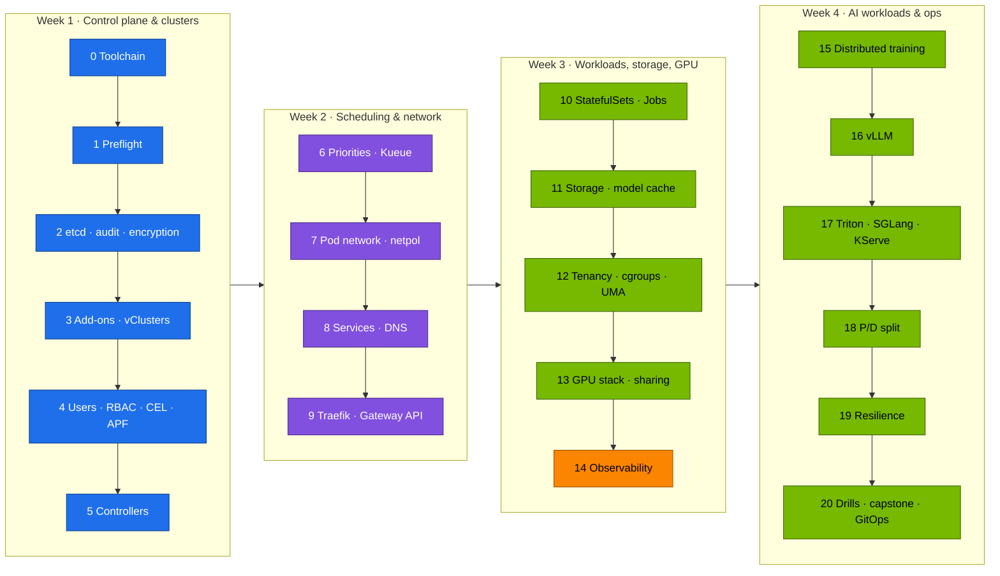

# Step-by-Step: From the Ansible-Built Root Cluster to a Complete AI Platform on DGX Spark

> **Module 02 companion guide.** The shortest correct path through the lab, in the order that avoids rework. Each step lists the commands, what "done" looks like, and the volume that explains it. Prerequisite: the [01 Ansible step-by-step guide](../01%20Ansible/00-ansible-step-by-step-guide.md) through its Step 10 — the kubeadm root cluster, Cilium, MetalLB and the GPU Operator (playbooks 05 and 06).
>
> **Three clusters, one kubeconfig.** Every command names its context: `spark-root` (the kubeadm root — platform team), `dev-lab` (vCluster #1 — tenants and labs) or `llms` (vCluster #2 — serving and training). [Volume 27](27-nested-clusters-with-vcluster.md) explains the shape; the [lab README](lab/README.md#which-cluster-am-i-talking-to) has the rule of thumb.



**One Spark or two?** Everything works on one. Steps marked **(2×)** have an optional second part that needs spark-02 and the QSFP cable.

**The Spark is your playground.** Every step can be undone: `scripts/breakfix.sh reset all` for drills, and `01 Ansible playbooks/99-reset-kubernetes.yml` to wipe Kubernetes and rebuild from playbook 05. Breaking things on purpose is part of the course.

---

## Step 0 · Toolchain on the control node (20 min) → [20 §CI](20-hands-on-practice-exercises-workbook.md)

```bash
cd "technical-depth/02 Kubernetes/lab"
pip install yamllint shellcheck-py pyyaml
# kubectl, helm, kubeconform, promtool, mikefarah yq: versions in versions.env / the CI workflow
export KUBECONFIG="$PWD/../../01 Ansible/lab/.cache/kubeconfig-spark-lab.yaml"
tests/run-local-checks.sh
```

✅ `ALL LOCAL CHECKS PASSED` (includes `budget check OK`: the vCluster budgets fit the Spark)

## Step 1 · Preflight (5 min) → [01](01-kubernetes-core-architecture.md)

```bash
scripts/preflight.sh          # run on the Spark
```

✅ 0 failed. kubelet + containerd active, no control-plane taint, Cilium ready, `allocatable nvidia.com/gpu=15`, GB10 cc 12.1. The vCluster contexts show as "not reachable yet" until Step 3.

## Step 2 · Control plane hardening (30 min) → [03](03-etcd-database-deep-dive.md), [02](02-kube-apiserver-internals.md)

The 01 Ansible `kubeadm_cluster` role already started the API server with an audit policy and Secret encryption, and installed an etcd snapshot timer. Prove each one:

```bash
kubectl --context spark-root get secrets -A -o json | kubectl --context spark-root replace -f - >/dev/null   # re-encrypt old Secrets
kubectl --context spark-root -n default create secret generic enc-test --from-literal=k=v
sudo ETCDCTL_API=3 etcdctl --endpoints=https://127.0.0.1:2379 --cacert=/etc/kubernetes/pki/etcd/ca.crt \
  --cert=/etc/kubernetes/pki/etcd/healthcheck-client.crt --key=/etc/kubernetes/pki/etcd/healthcheck-client.key \
  get /registry/secrets/default/enc-test --print-value-only | head -c 40; echo
scripts/etcd-drill.sh status && scripts/etcd-drill.sh snapshot
sudo tail -2 /var/log/kubernetes/audit/audit.log
```

✅ 1 etcd member, no alarms, a snapshot in `/var/lib/etcd-snapshots`. Secret values in etcd start with `k8s:enc:aescbc:v1:key1`. The audit log grows.

## Step 3 · Platform add-ons and the two vClusters (40 min) → [27](27-nested-clusters-with-vcluster.md), [15](15-dgx-spark-datacenter-simulation-lab.md)

```bash
scripts/install-addons.sh storage
scripts/install-addons.sh metrics-server
scripts/install-addons.sh kps
scripts/install-addons.sh vclusters        # = 01 Ansible playbooks/06b-vclusters.yml
kubectl config get-contexts
scripts/verify.sh vclusters
```

✅ Contexts `spark-root`, `dev-lab`, `llms`. `dev-lab root budget: 2 8Gi 2`, `llms root budget: 4 48Gi 8`. Grafana answers on `:32000`.

## Step 4 · Tenancy, users, policy (45 min) → [02](02-kube-apiserver-internals.md), [12](12-multi-tenancy-resource-quotas-and-cgroups.md)

```bash
scripts/apply-lab.sh root                  # platform namespaces, vCluster budgets, syncer APF lane, …
for d in 00-platform 10-tenancy 15-admission 16-apf; do kubectl --context dev-lab apply -k manifests/dev-lab/$d; done
for d in 00-platform 10-tenancy 15-admission; do kubectl --context llms apply -k manifests/llms/$d; done
scripts/make-user.sh alice team-alpha && scripts/make-user.sh bob team-beta       # users of dev-lab
scripts/verify.sh tenancy admission
```

✅ `21 passed, 0 failed` — including `team-alpha has no rights on the root`.

## Step 5 · Controllers (30 min) → [04](04-kube-controller-manager-and-controllers.md)

```bash
kubectl --context dev-lab apply -k manifests/dev-lab/30-networking
kubectl --context spark-root apply -k manifests/root/45-controller
kubectl --context spark-root -n platform-tools logs deploy/slice-ledger
```

✅ `relist: … GPU pods` and a `gpu-slice-ledger` ConfigMap with a `by-namespace` key (`vc-dev-lab`, `vc-llms`).

## Step 6 · Priorities, Kueue (40 min) → [05](05-kube-scheduler-and-ai-batch-scheduling.md)

```bash
scripts/install-addons.sh kueue                       # inside llms
kubectl --context llms apply -k manifests/llms/20-scheduling
tests/kueue-gang-test.sh
```

✅ `PASS: one gang admitted whole, the other held whole`

## Step 7 · Pod network & policies (40 min) → [06](06-kubernetes-networking-deep-dive.md)

```bash
pod=$(kubectl --context dev-lab -n lab-tools get pod -l app=echo -o jsonpath='{.items[0].metadata.name}')
scripts/pod-netns.sh lab-tools "$pod" dev-lab         # finds the pod's real copy on the root
scripts/breakfix.sh inject 06     # fix it, then: scripts/breakfix.sh answer 06
```

✅ You can name the `lxc*` veth, `cilium_host`, `cilium_vxlan` and the MTU — and the vCluster pod's root name. Drill 06 fixed.

## Step 8 · Services & DNS (40 min) → [07](07-kube-proxy-and-cluster-ip-mechanics.md), [08](08-coredns-and-service-discovery.md)

```bash
scripts/svc-trace.sh lab-tools echo dev-lab           # the ROOT's kube-proxy rules for a dev-lab Service
kubectl --context spark-root apply -f manifests/root/30-networking/coredns-corefile.yaml
```

✅ KUBE-SEP probabilities explained. ndots query counts measured (≈10 vs 2) in dev-lab's own CoreDNS.

## Step 9 · Ingress & Gateway API (40 min) → [09](09-ingress-controllers-and-gateway-api.md)

```bash
scripts/install-addons.sh traefik                     # inside llms → 192.168.0.115
kubectl --context llms apply -k manifests/llms/40-ingress
echo "192.168.0.115 llm.lab.local gw.lab.local" | sudo tee -a /etc/hosts      # on the laptop
scripts/verify.sh ingress
```

✅ Streaming PASS. HTTPRoute 200. Canary ≈ 90/10.

## Step 10 · Stateful and batch workloads (40 min) → [10](10-advanced-workload-controllers.md)

```bash
kubectl --context llms apply -k manifests/llms/50-workloads
kubectl --context dev-lab apply -f manifests/dev-lab/50-workloads/tokenizer-indexed-job.yaml
kubectl --context spark-root apply -k manifests/root/50-workloads
```

✅ Qdrant data survives pod deletion. `completedIndexes: 0-7`. One node-probe pod per Spark.

## Step 11 · Storage & model cache (40 min) → [11](11-storage-csi-and-high-performance-volumes.md)

```bash
kubectl --context llms apply -k manifests/llms/60-storage
kubectl --context llms apply -f manifests/llms/60-storage/model-prefetch-job.yaml
kubectl --context spark-root apply -f manifests/root/60-storage/fio-job.yaml
```

✅ `model-cache` Bound on Retain (a real PV under `/data/k8s/retain/vc-llms/…`). fio baseline saved.

## Step 12 · Tenancy under load & the UMA question (40 min) → [12](12-multi-tenancy-resource-quotas-and-cgroups.md)

```bash
kubectl --context spark-root apply -f manifests/root/12-cgroups/qos-trio.yaml -f manifests/root/12-cgroups/cpu-throttle.yaml
kubectl --context spark-root apply -f manifests/root/12-cgroups/uma-cgroup-experiment.yaml
kubectl --context spark-root -n platform-tools logs -f uma-cgroup-experiment
scripts/breakfix.sh inject 02                         # a vCluster budget, spent
```

✅ QoS/`oom_score_adj` table filled in. **UMA experiment result recorded with the driver version.** You can explain why the bf02 pods have no scheduler events.

## Step 13 · GPU stack & sharing (60 min) → [13](13-nvidia-hardware-and-driver-stack.md), [14](14-nvidia-container-toolkit-and-gpu-virtualization.md), [16](16-nvidia-gpu-operator-and-network-operator.md)

```bash
kubectl --context spark-root apply -k manifests/root/70-gpu
kubectl --context spark-root apply -f manifests/root/70-gpu/gemm-solo.yaml
kubectl --context spark-root -n platform-tools scale deploy gemm-contention --replicas=4      # Vol 14 §5.3 table
scripts/verify.sh gpu                                  # gpu-smoke from inside dev-lab
scripts/breakfix.sh inject 10                          # the GPU leak
```

✅ Baseline TFLOPS. Aggregate ≈ baseline under 4-way contention. gpu-smoke PASS through the vCluster. Leak explained (hardening optional).

## Step 14 · Observability (30 min) → [16](16-nvidia-gpu-operator-and-network-operator.md)

```bash
kubectl --context spark-root apply -k manifests/root/95-observability
scripts/verify.sh observability      # Grafana http://192.168.0.100:32000 → "Spark · Kubernetes"
```

✅ Every dashboard row has data. Targets labelled `vcluster="llms"` appear once Traefik/vLLM run. One alert seen firing (drill 02).

## Step 15 · Distributed training (45 min) (2×) → [17](17-distributed-ai-training-and-nccl.md), [18](18-large-scale-superpod-and-network-fabrics.md)

```bash
kubectl --context llms apply -k manifests/llms/80-distributed/base
kubectl --context llms -n batch logs -f -l job-name=ddp --prefix
# (2×) kubectl --context llms apply -k manifests/llms/80-distributed/two-spark
```

✅ `correctness OK`. (2×) `Using network IB`, busbw near line rate.

## Step 16 · vLLM (60 min) → [21](21-vllm-high-throughput-llm-serving.md)

```bash
kubectl --context llms apply -k manifests/llms/90-serving/vllm
kubectl --context llms apply -f manifests/llms/90-serving/vllm/vllm-bench.yaml
scripts/install-addons.sh keda && kubectl --context llms apply -f manifests/llms/90-serving/autoscaling.yaml
scripts/verify.sh serving
```

✅ `vLLM answered a chat completion`. Benchmark table for c = 1/8/32. KEDA reads the root's Prometheus.

## Step 17 · Triton, SGLang, KServe (90 min) → [22](22-nvidia-triton-inference-server.md), [23](23-llm-inference-alternatives-and-kserve.md)

```bash
kubectl --context llms apply -k manifests/llms/90-serving/triton
kubectl --context llms -n llm-serving scale deploy vllm --replicas=0
kubectl --context llms apply -k manifests/llms/90-serving/sglang && kubectl --context llms -n llm-serving scale deploy sglang --replicas=1
kubectl --context llms -n llm-serving port-forward svc/sglang 30000 &
python3 scripts/ttft_probe.py --url http://localhost:30000 --model qwen2.5-0.5b
scripts/install-addons.sh kserve                        # cert-manager + KServe inside llms (Vol 23)
```

✅ Triton batch size > 1 under load. Prefix-cache speed-up measured on two engines. The llms memory budget (48 Gi) decides which engines run at the same time.

## Step 18 · Prefill/decode split (45 min) (2×) → [24](24-disaggregated-prefill-and-decode-serving.md)

```bash
kubectl --context llms apply -k manifests/llms/90-serving/pd-disagg
```

✅ `X-Prefill-Ms` header and NIXL activity in the decode log.

## Step 19 · Resilience (45 min) → [26](26-ultra-scale-cluster-resilience-and-fault-tolerance.md), [25](25-hyperscaler-silicon-and-compilers.md)

```bash
kubectl --context llms apply -k manifests/llms/80-distributed/resilient      # kill a pod mid-run → RESUMED
kubectl --context spark-root apply -f manifests/root/70-gpu/compile-compare.yaml   # eager vs compiled
```

✅ Resume from the newest complete checkpoint. SDC drill fails fast.

## Step 20 · Drills, capstone, GitOps → [19](19-cluster-diagnostics-and-failure-scenarios.md), [20](20-hands-on-practice-exercises-workbook.md), [production-mlops](production-mlops.md)

```bash
scripts/breakfix.sh list                 # at least 5 drills, timed — across all three clusters
scripts/collect-diag.sh
# capstone: delete and recreate both vClusters, then rebuild the 02 layer to green in < 60 min (Vol 20)
scripts/install-addons.sh argocd && scripts/argocd-register-vclusters.sh
kubectl --context spark-root apply -n argocd -f gitops/applications.yaml
```

✅ `scripts/verify.sh` → `0 failed` after the rebuild. Argo CD apps Synced/Healthy on all three destinations.
